# 开发工作流技能

<cite>
**本文引用的文件**
- [README.md](file://README.md)
- [global/CLAUDE.md](file://global/CLAUDE.md)
- [skills/dev-workflow/SKILL.md](file://skills/dev-workflow/SKILL.md)
- [global/codex-skills/writing-plans/SKILL.md](file://global/codex-skills/writing-plans/SKILL.md)
- [global/codex-skills/subagent-driven-development/SKILL.md](file://global/codex-skills/subagent-driven-development/SKILL.md)
- [global/codex-skills/requesting-code-review/SKILL.md](file://global/codex-skills/requesting-code-review/SKILL.md)
- [global/codex-skills/receiving-code-review/SKILL.md](file://global/codex-skills/receiving-code-review/SKILL.md)
- [global/codex-skills/verification-before-completion/SKILL.md](file://global/codex-skills/verification-before-completion/SKILL.md)
- [global/codex-skills/test-driven-development/SKILL.md](file://global/codex-skills/test-driven-development/SKILL.md)
- [global/codex-skills/systematic-debugging/SKILL.md](file://global/codex-skills/systematic-debugging/SKILL.md)
- [global/codex-skills/finishing-a-development-branch/SKILL.md](file://global/codex-skills/finishing-a-development-branch/SKILL.md)
- [global/codex-skills/using-git-worktrees/SKILL.md](file://global/codex-skills/using-git-worktrees/SKILL.md)
- [settings.json](file://settings.json)
</cite>

## 目录
1. [简介](#简介)
2. [项目结构](#项目结构)
3. [核心组件](#核心组件)
4. [架构总览](#架构总览)
5. [详细组件分析](#详细组件分析)
6. [依赖关系分析](#依赖关系分析)
7. [性能考量](#性能考量)
8. [故障排查指南](#故障排查指南)
9. [结论](#结论)
10. [附录](#附录)

## 简介
本文件系统化阐述“开发工作流技能”，围绕严格阶段顺序（需求→设计→实现→评审→测试）构建完整的理念与实现机制。文档覆盖各阶段职责、前置条件、输出文档与质量标准；明确任务文档目录结构、源代码组织规范与测试布局；提供需求、设计、代码评审与测试报告的模板与使用示例；解释进度跟踪机制、阶段验证规则与最佳实践；并给出Python API参考与常见问题解决方案。

## 项目结构
本仓库采用“多 AI 协同 + 规范驱动开发（SDD）”的工程化体系，核心由以下层次构成：
- 全局配置与规则：定义项目通用的目录约定、工具使用、角色分工与交叉检查策略
- 技能系统：以“Skill”为单位封装可复用的工作流能力，如开发工作流、编写计划、子代理驱动开发、测试驱动开发、系统化调试、完成开发分支、使用 Git Worktrees 等
- 工作流集成：通过技能之间的组合与衔接，形成从需求到完成的闭环

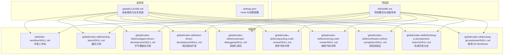

图表来源
- [README.md](file://README.md#L1-L229)
- [global/CLAUDE.md](file://global/CLAUDE.md#L1-L147)
- [skills/dev-workflow/SKILL.md](file://skills/dev-workflow/SKILL.md#L1-L397)
- [global/codex-skills/writing-plans/SKILL.md](file://global/codex-skills/writing-plans/SKILL.md#L1-L117)
- [global/codex-skills/subagent-driven-development/SKILL.md](file://global/codex-skills/subagent-driven-development/SKILL.md#L1-L241)
- [global/codex-skills/test-driven-development/SKILL.md](file://global/codex-skills/test-driven-development/SKILL.md#L1-L372)
- [global/codex-skills/systematic-debugging/SKILL.md](file://global/codex-skills/systematic-debugging/SKILL.md#L1-L297)
- [global/codex-skills/requesting-code-review/SKILL.md](file://global/codex-skills/requesting-code-review/SKILL.md#L1-L106)
- [global/codex-skills/receiving-code-review/SKILL.md](file://global/codex-skills/receiving-code-review/SKILL.md#L1-L210)
- [global/codex-skills/verification-before-completion/SKILL.md](file://global/codex-skills/verification-before-completion/SKILL.md#L1-L140)
- [global/codex-skills/finishing-a-development-branch/SKILL.md](file://global/codex-skills/finishing-a-development-branch/SKILL.md#L1-L201)
- [global/codex-skills/using-git-worktrees/SKILL.md](file://global/codex-skills/using-git-worktrees/SKILL.md#L1-L214)

章节来源
- [README.md](file://README.md#L1-L229)
- [global/CLAUDE.md](file://global/CLAUDE.md#L1-L147)

## 核心组件
- 开发工作流技能（dev-workflow）：定义严格阶段顺序、目录约定、文档模板与质量标准，并提供 Python API 以支持外部代理调用
- 编写计划（writing-plans）：产出可执行的实现计划，确保任务粒度小、步骤明确、可测试
- 子代理驱动开发（subagent-driven-development）：每任务派发新鲜子代理，两阶段评审（规范符合性→代码质量），加速高质量迭代
- 测试驱动开发（test-driven-development）：红-绿-重构循环，确保测试先行与最小实现
- 系统化调试（systematic-debugging）：四阶段根因调查→模式分析→假设验证→实施修复，杜绝症状式修复
- 请求/接收代码评审（requesting-code-review / receiving-code-review）：评审前置与反馈处理的严谨流程
- 完成前验证（verification-before-completion）：任何“完成/成功”声明前必须运行验证命令并展示证据
- 完成开发分支（finishing-a-development-branch）：合并/PR/保留/丢弃的结构化选项与清理流程
- 使用 Git Worktrees（using-git-worktrees）：隔离工作空间，安全地并行多任务

章节来源
- [skills/dev-workflow/SKILL.md](file://skills/dev-workflow/SKILL.md#L1-L397)
- [global/codex-skills/writing-plans/SKILL.md](file://global/codex-skills/writing-plans/SKILL.md#L1-L117)
- [global/codex-skills/subagent-driven-development/SKILL.md](file://global/codex-skills/subagent-driven-development/SKILL.md#L1-L241)
- [global/codex-skills/test-driven-development/SKILL.md](file://global/codex-skills/test-driven-development/SKILL.md#L1-L372)
- [global/codex-skills/systematic-debugging/SKILL.md](file://global/codex-skills/systematic-debugging/SKILL.md#L1-L297)
- [global/codex-skills/requesting-code-review/SKILL.md](file://global/codex-skills/requesting-code-review/SKILL.md#L1-L106)
- [global/codex-skills/receiving-code-review/SKILL.md](file://global/codex-skills/receiving-code-review/SKILL.md#L1-L210)
- [global/codex-skills/verification-before-completion/SKILL.md](file://global/codex-skills/verification-before-completion/SKILL.md#L1-L140)
- [global/codex-skills/finishing-a-development-branch/SKILL.md](file://global/codex-skills/finishing-a-development-branch/SKILL.md#L1-L201)
- [global/codex-skills/using-git-worktrees/SKILL.md](file://global/codex-skills/using-git-worktrees/SKILL.md#L1-L214)

## 架构总览
下图展示了从需求到完成的端到端工作流，强调阶段顺序、前置条件与质量门禁：

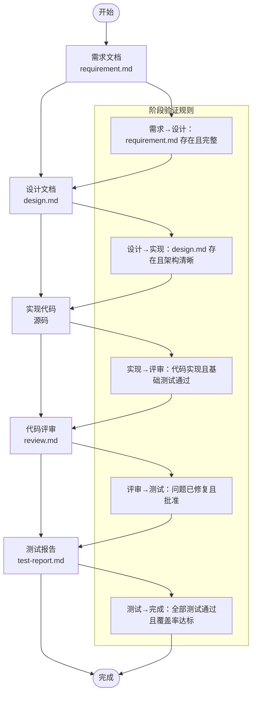

图表来源
- [skills/dev-workflow/SKILL.md](file://skills/dev-workflow/SKILL.md#L306-L331)

章节来源
- [skills/dev-workflow/SKILL.md](file://skills/dev-workflow/SKILL.md#L28-L331)

## 详细组件分析

### 开发工作流技能（dev-workflow）
- 目的：管理严格的阶段顺序与目录约定，确保文档保存到正确位置、前置条件校验、阶段过渡验证与进度跟踪
- 阶段顺序：需求 → 设计 → 实现 → 评审 → 测试 → 完成
- 目录结构：
  - 任务文档：.devos/tasks/{task-id}/requirement.md、design.md、review.md、test-report.md、progress.md
  - 源代码：devos/agents、devos/core、devos/orchestration、devos/skills、devos/tools、devos/workflow
  - 测试：tests/agents、tests/core、tests/integration、tests/orchestration、tests/tools
- 文档模板与命令：需求、设计、评审、测试报告均有模板与保存命令
- 进度跟踪：progress.md 采用时间戳+状态+已完成/待办清单
- 阶段验证：逐阶段检查前置文档与质量指标
- 最佳实践：始终从需求开始、验证前置条件、文档归档到指定目录、定期更新进度、测试通过后再标记完成
- Python API：提供写需求、读设计、查询任务状态、校验阶段过渡等方法

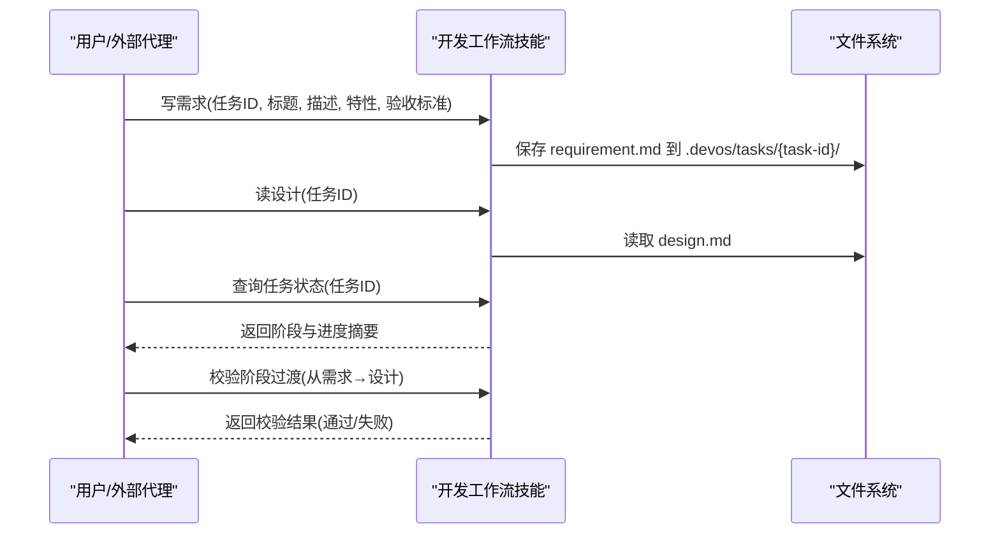

图表来源
- [skills/dev-workflow/SKILL.md](file://skills/dev-workflow/SKILL.md#L353-L383)

章节来源
- [skills/dev-workflow/SKILL.md](file://skills/dev-workflow/SKILL.md#L1-L397)

### 编写计划（writing-plans）
- 目标：产出可执行的实现计划，任务粒度小、步骤明确、可测试、可提交
- 计划头：包含目标、架构、技术栈与必需子技能提示
- 任务结构：文件列表、步骤（写失败测试→运行验证→实现最小代码→再次运行→提交）
- 执行交接：完成后提供两种执行路径选择（子代理驱动/并行会话）

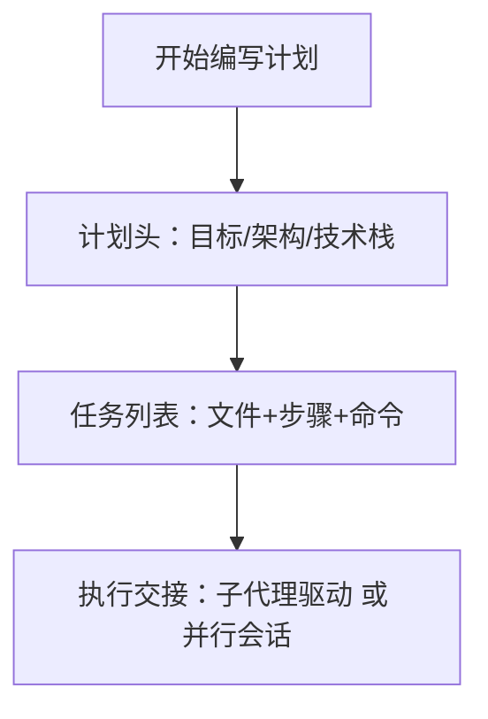

图表来源
- [global/codex-skills/writing-plans/SKILL.md](file://global/codex-skills/writing-plans/SKILL.md#L29-L117)

章节来源
- [global/codex-skills/writing-plans/SKILL.md](file://global/codex-skills/writing-plans/SKILL.md#L1-L117)

### 子代理驱动开发（subagent-driven-development）
- 核心原则：每任务派发新鲜子代理，两阶段评审（规范符合性→代码质量），高质快速迭代
- 流程：派发实现子代理→问答与实现→派发规范评审→派发代码质量评审→标记任务完成→最终评审→完成开发分支
- 质量门禁：规范符合性必须先通过，然后才能进入代码质量评审；不得跳过任一阶段

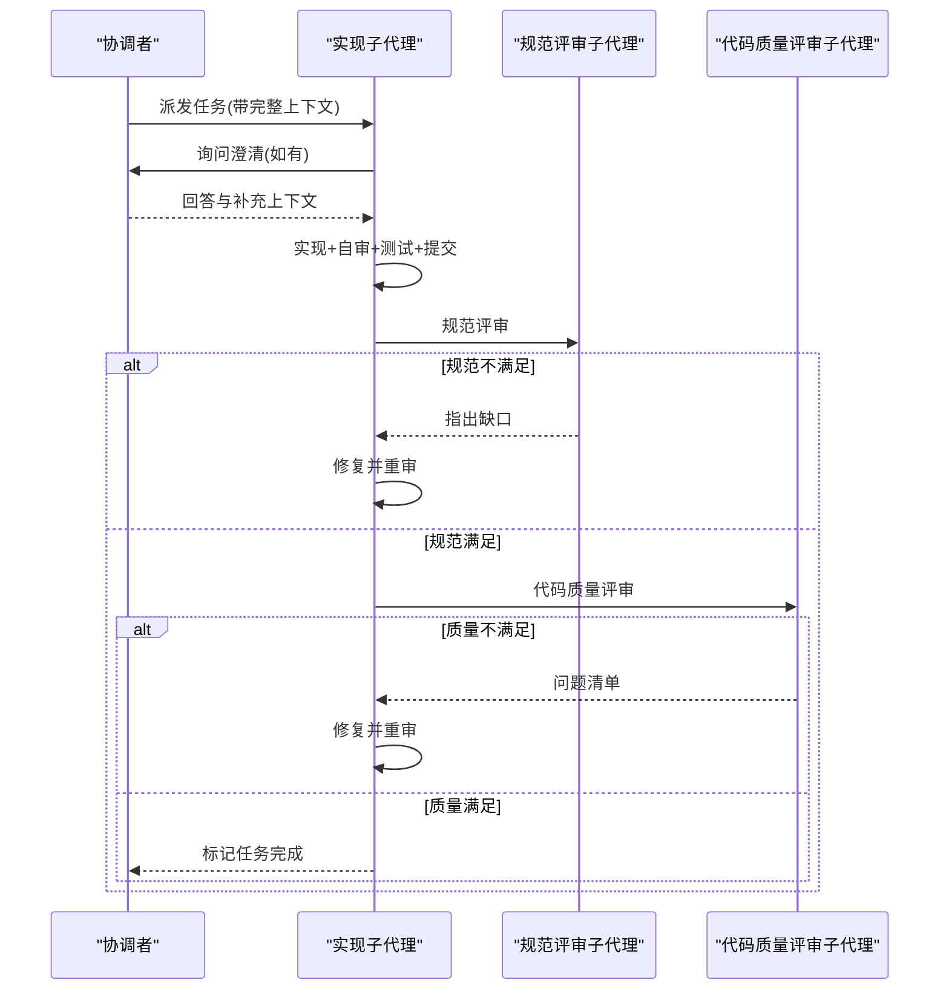

图表来源
- [global/codex-skills/subagent-driven-development/SKILL.md](file://global/codex-skills/subagent-driven-development/SKILL.md#L38-L83)

章节来源
- [global/codex-skills/subagent-driven-development/SKILL.md](file://global/codex-skills/subagent-driven-development/SKILL.md#L1-L241)

### 测试驱动开发（test-driven-development）
- 核心原则：先写测试→观察失败→写最少实现→验证通过→重构
- 循环：红（写失败测试）→绿（最小实现）→重构（清理）
- 质量要求：测试名称清晰、行为单一、真实代码、无副作用、覆盖边界与错误
- 常见误区：测试后补写、测试通过立即结束、用模拟替代真实行为

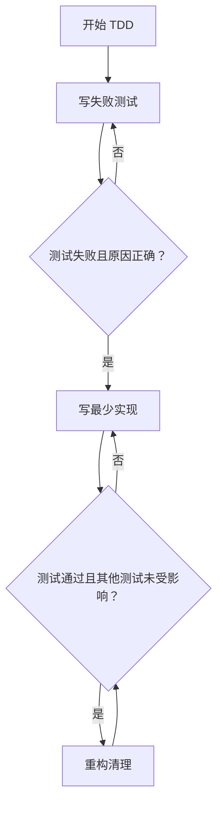

图表来源
- [global/codex-skills/test-driven-development/SKILL.md](file://global/codex-skills/test-driven-development/SKILL.md#L47-L69)

章节来源
- [global/codex-skills/test-driven-development/SKILL.md](file://global/codex-skills/test-driven-development/SKILL.md#L1-L372)

### 系统化调试（systematic-debugging）
- 四阶段：根因调查→模式分析→假设与测试→实施修复
- 关键规则：在提出任何修复前必须完成根因调查；修复应针对根因而非症状
- 多组件系统：在组件边界添加诊断日志，逐步定位失败层
- 3+修复失败：停止修复，质疑架构设计

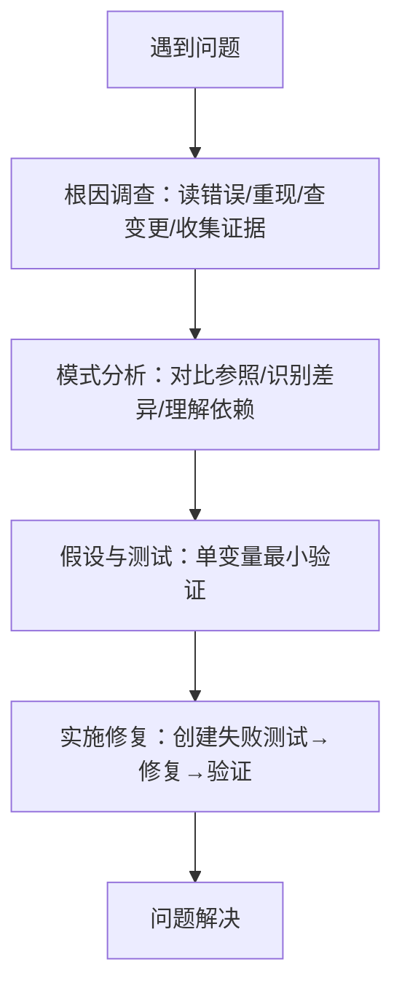

图表来源
- [global/codex-skills/systematic-debugging/SKILL.md](file://global/codex-skills/systematic-debugging/SKILL.md#L46-L214)

章节来源
- [global/codex-skills/systematic-debugging/SKILL.md](file://global/codex-skills/systematic-debugging/SKILL.md#L1-L297)

### 请求/接收代码评审（requesting-code-review / receiving-code-review）
- 请求评审：在关键节点（每任务后、重大特性后、合并前）请求评审，提供基线与头 SHA、摘要与要求
- 接收评审：先验证再实现；对不清楚项先澄清；对错误建议进行技术论证；按阻断→简单→复杂顺序实施修复；测试每个修复并验证回归

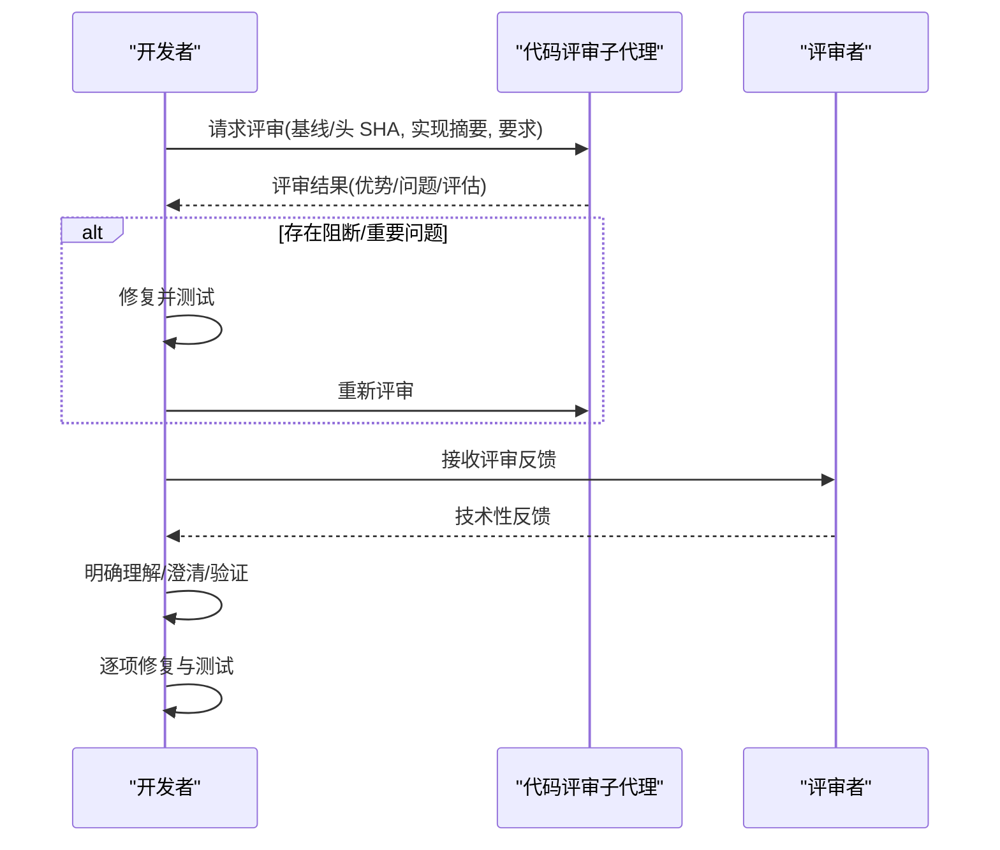

图表来源
- [global/codex-skills/requesting-code-review/SKILL.md](file://global/codex-skills/requesting-code-review/SKILL.md#L24-L76)
- [global/codex-skills/receiving-code-review/SKILL.md](file://global/codex-skills/receiving-code-review/SKILL.md#L14-L25)

章节来源
- [global/codex-skills/requesting-code-review/SKILL.md](file://global/codex-skills/requesting-code-review/SKILL.md#L1-L106)
- [global/codex-skills/receiving-code-review/SKILL.md](file://global/codex-skills/receiving-code-review/SKILL.md#L1-L210)

### 完成前验证（verification-before-completion）
- 铁律：任何“完成/成功”声明前必须运行验证命令并展示证据
- 五步法：识别命令→完整运行→读取输出→验证结论→仅在此后声明
- 常见失败：仅凭“应该/大概/看起来”声明；信任代理报告；依赖部分验证

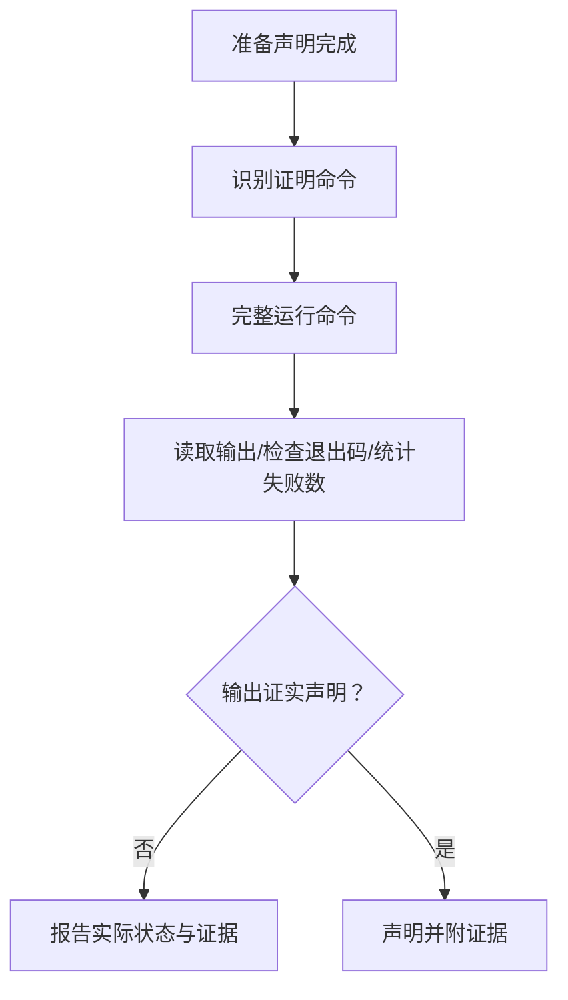

图表来源
- [global/codex-skills/verification-before-completion/SKILL.md](file://global/codex-skills/verification-before-completion/SKILL.md#L24-L38)

章节来源
- [global/codex-skills/verification-before-completion/SKILL.md](file://global/codex-skills/verification-before-completion/SKILL.md#L1-L140)

### 完成开发分支（finishing-a-development-branch）
- 步骤：验证测试→确定基线分支→呈现四个选项→执行选择→清理工作树
- 选项：本地合并、推送并创建 PR、保留分支、丢弃工作
- 清理：仅在本地合并/丢弃后清理工作树，保留分支时不清理

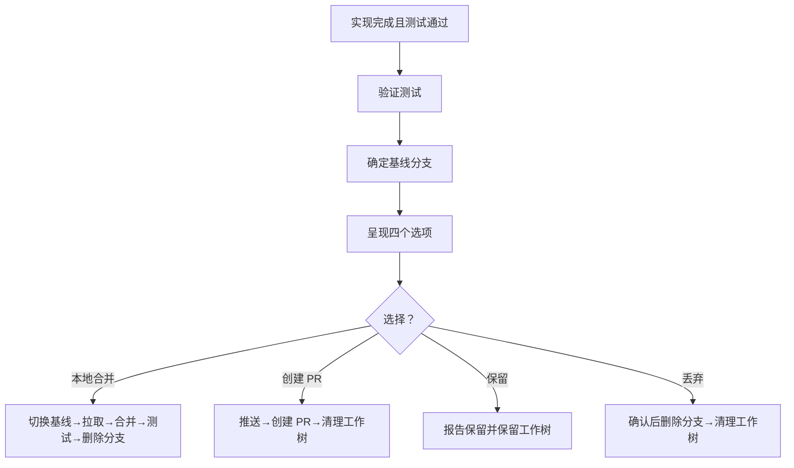

图表来源
- [global/codex-skills/finishing-a-development-branch/SKILL.md](file://global/codex-skills/finishing-a-development-branch/SKILL.md#L16-L151)

章节来源
- [global/codex-skills/finishing-a-development-branch/SKILL.md](file://global/codex-skills/finishing-a-development-branch/SKILL.md#L1-L201)

### 使用 Git Worktrees（using-git-worktrees）
- 目的：为隔离工作空间，避免切换当前工作区，支持并行多任务
- 目录优先级：.worktrees/ > worktrees/ > 全局目录；优先检查 .gitignore
- 创建流程：检测项目名→创建工作树→自动运行项目初始化→基线测试验证→报告就绪
- 清理：在完成开发分支后按需清理工作树

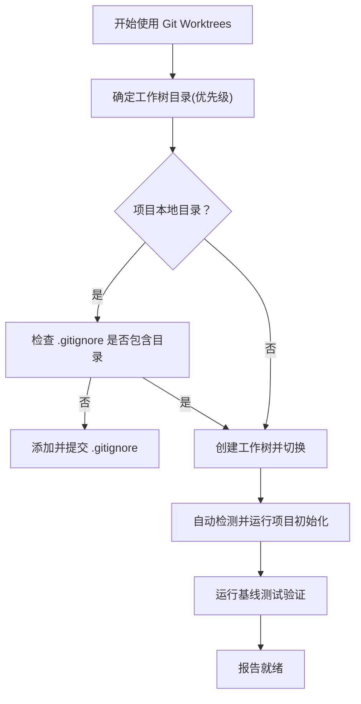

图表来源
- [global/codex-skills/using-git-worktrees/SKILL.md](file://global/codex-skills/using-git-worktrees/SKILL.md#L16-L143)

章节来源
- [global/codex-skills/using-git-worktrees/SKILL.md](file://global/codex-skills/using-git-worktrees/SKILL.md#L1-L214)

## 依赖关系分析
- 角色与工具：Claude 为主协调者，Codex 交叉检查后端，Gemini 负责前端与大文本分析；Superpowers 插件提供技能集合
- 交叉检查：不同执行器与检查器的配对策略与时机
- Hook 与权限：settings.json 中配置用户提示与工具使用后的追踪钩子，允许编辑与 Bash 权限

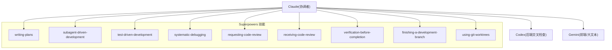

图表来源
- [README.md](file://README.md#L141-L173)
- [global/CLAUDE.md](file://global/CLAUDE.md#L76-L133)
- [settings.json](file://settings.json#L1-L37)

章节来源
- [README.md](file://README.md#L1-L229)
- [global/CLAUDE.md](file://global/CLAUDE.md#L1-L147)
- [settings.json](file://settings.json#L1-L37)

## 性能考量
- 子代理驱动开发通过“每任务新鲜子代理+两阶段评审”减少上下文污染与返工，提升迭代速度
- TDD 的红-绿-重构循环降低调试成本，防止回归
- 系统化调试避免症状式修复导致的反复与新问题引入
- 使用 Git Worktrees 隔离工作空间，减少冲突与状态污染
- 完成前验证确保“声明即证据”，减少无效沟通与重复工作

## 故障排查指南
- 阶段跳过或前置缺失
  - 现象：直接进入实现或评审，缺少需求/设计文档
  - 处理：先补齐前置文档并通过阶段校验
- 评审反馈不清
  - 现象：评审意见模糊或相互矛盾
  - 处理：先澄清再实施；必要时与人类伙伴讨论
- 测试通过但功能异常
  - 现象：单元测试通过但集成失败
  - 处理：使用系统化调试定位根因，补充失败测试用例
- “完成”声明未经验证
  - 现象：未运行验证命令就宣布完成
  - 处理：严格遵循完成前验证流程，展示证据后再声明
- 工作树污染或误提交
  - 现象：工作树内容被意外提交
  - 处理：创建前检查 .gitignore；项目本地目录必须纳入忽略

章节来源
- [global/codex-skills/receiving-code-review/SKILL.md](file://global/codex-skills/receiving-code-review/SKILL.md#L164-L175)
- [global/codex-skills/systematic-debugging/SKILL.md](file://global/codex-skills/systematic-debugging/SKILL.md#L215-L233)
- [global/codex-skills/verification-before-completion/SKILL.md](file://global/codex-skills/verification-before-completion/SKILL.md#L52-L62)
- [global/codex-skills/using-git-worktrees/SKILL.md](file://global/codex-skills/using-git-worktrees/SKILL.md#L51-L70)

## 结论
本工作流以“开发工作流技能”为核心，结合“编写计划”“子代理驱动开发”“测试驱动开发”“系统化调试”“请求/接收评审”“完成前验证”“完成开发分支”“使用 Git Worktrees”等技能，形成从需求到完成的闭环。严格阶段顺序、前置条件校验、质量门禁与证据驱动的声明机制，确保交付质量与效率兼顾。建议在团队内推广该工作流，并通过技能文档与模板持续优化。

## 附录

### 需求文档模板与使用示例
- 模板字段：概述（任务ID、标题、优先级、创建时间）、描述、特性清单、验收标准、技术约束、相关上下文
- 保存位置：.devos/tasks/{task-id}/requirement.md
- 示例：参见技能文档中的模板与命令说明

章节来源
- [skills/dev-workflow/SKILL.md](file://skills/dev-workflow/SKILL.md#L95-L133)

### 设计文档模板与使用示例
- 模板字段：概述、架构、模块职责与接口、技术栈选型、接口定义、关键决策、实现计划、风险与约束
- 保存位置：.devos/tasks/{task-id}/design.md
- 示例：参见技能文档中的模板与命令说明

章节来源
- [skills/dev-workflow/SKILL.md](file://skills/dev-workflow/SKILL.md#L136-L193)

### 代码评审报告模板与使用示例
- 模板字段：概述（任务ID、评审时间、开发者、评审者、一致性）、问题清单（严重程度、类别、描述、建议）、缺失特性、改进建议
- 保存位置：.devos/tasks/{task-id}/review.md
- 示例：参见技能文档中的模板与命令说明

章节来源
- [skills/dev-workflow/SKILL.md](file://skills/dev-workflow/SKILL.md#L196-L242)

### 测试报告模板与使用示例
- 模板字段：最新结果（时间、尝试次数、状态）、统计（总数、通过、失败、跳过、通过率）、失败测试明细
- 保存位置：.devos/tasks/{task-id}/test-report.md
- 示例：参见技能文档中的模板与命令说明

章节来源
- [skills/dev-workflow/SKILL.md](file://skills/dev-workflow/SKILL.md#L245-L279)

### 进度跟踪模板与使用示例
- 模板字段：时间戳+阶段+状态、已完成事项、待办事项
- 更新位置：.devos/tasks/{task-id}/progress.md
- 示例：参见技能文档中的模板与命令说明

章节来源
- [skills/dev-workflow/SKILL.md](file://skills/dev-workflow/SKILL.md#L282-L303)

### Python API 参考
- 导入与实例化：from devos.skills.dev_workflow import get_dev_workflow_skill；skill = get_dev_workflow_skill()
- 方法示例：
  - 写需求：write_requirement(task_id, title, description, features, acceptance_criteria)
  - 读设计：read_design(task_id)
  - 查询任务状态：get_task_status(task_id)
  - 校验阶段过渡：validate_phase_transition(task_id, from_phase, to_phase)

章节来源
- [skills/dev-workflow/SKILL.md](file://skills/dev-workflow/SKILL.md#L353-L383)