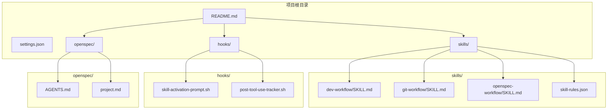
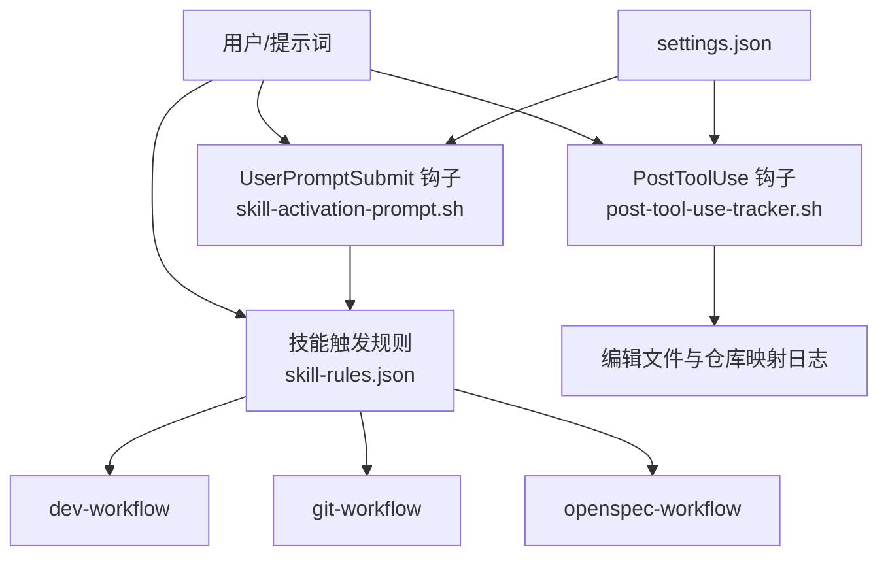
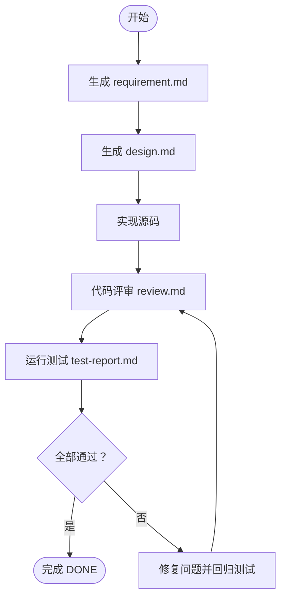
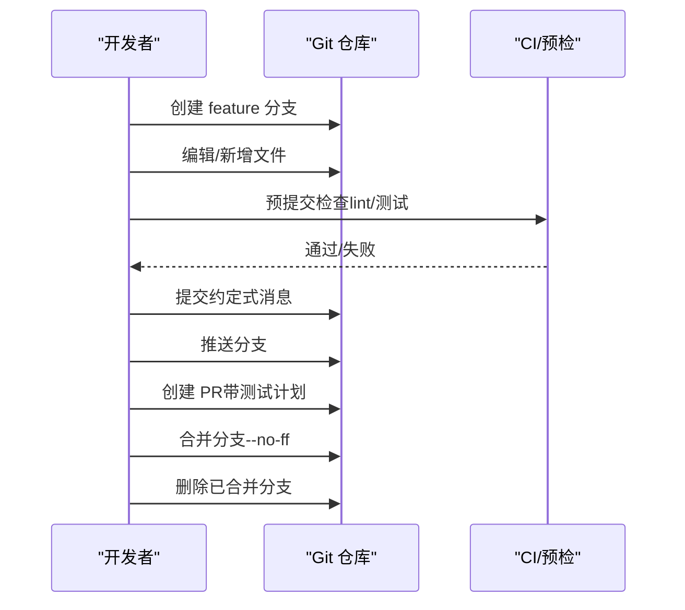
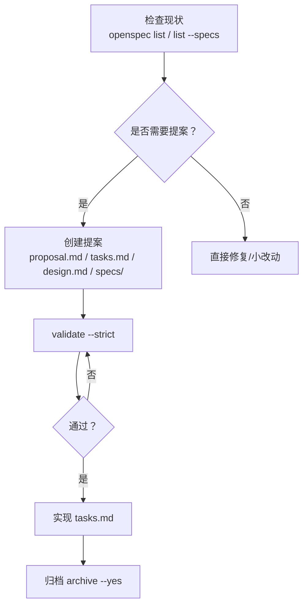
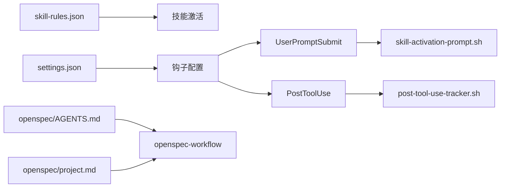

# 核心技能模块

<cite>
**本文引用的文件**
- [skills/dev-workflow/SKILL.md](file://skills/dev-workflow/SKILL.md)
- [skills/git-workflow/SKILL.md](file://skills/git-workflow/SKILL.md)
- [skills/openspec-workflow/SKILL.md](file://skills/openspec-workflow/SKILL.md)
- [skills/skill-rules.json](file://skills/skill-rules.json)
- [settings.json](file://settings.json)
- [hooks/skill-activation-prompt.sh](file://hooks/skill-activation-prompt.sh)
- [hooks/post-tool-use-tracker.sh](file://hooks/post-tool-use-tracker.sh)
- [openspec/AGENTS.md](file://openspec/AGENTS.md)
- [openspec/project.md](file://openspec/project.md)
- [README.md](file://README.md)
</cite>

## 目录
1. [简介](#简介)
2. [项目结构](#项目结构)
3. [核心组件](#核心组件)
4. [架构总览](#架构总览)
5. [详细组件分析](#详细组件分析)
6. [依赖分析](#依赖分析)
7. [性能考虑](#性能考虑)
8. [故障排查指南](#故障排查指南)
9. [结论](#结论)
10. [附录](#附录)

## 简介
本文件聚焦于“核心技能模块”，系统阐述三大核心技能的设计理念、实现机制与使用场景：开发工作流（dev-workflow）、Git 工作流（git-workflow）与 OpenSpec 工作流（openspec-workflow）。文档从触发条件、执行流程、配置选项、协作关系与最佳实践等维度，帮助读者在实际项目中高效运用这些技能，构建规范驱动、可追溯、可协作的开发体系。

## 项目结构
围绕核心技能，项目采用“技能即知识模板”的组织方式，结合全局与项目级配置、钩子脚本与 OpenSpec 规范目录，形成可自动激活、可扩展的协作开发基础设施。

图示来源
- [README.md](file://README.md#L71-L92)
- [skills/dev-workflow/SKILL.md](file://skills/dev-workflow/SKILL.md#L1-L30)
- [skills/git-workflow/SKILL.md](file://skills/git-workflow/SKILL.md#L1-L30)
- [skills/openspec-workflow/SKILL.md](file://skills/openspec-workflow/SKILL.md#L1-L30)
- [skills/skill-rules.json](file://skills/skill-rules.json#L1-L50)
- [settings.json](file://settings.json#L1-L37)
- [hooks/skill-activation-prompt.sh](file://hooks/skill-activation-prompt.sh#L1-L6)
- [hooks/post-tool-use-tracker.sh](file://hooks/post-tool-use-tracker.sh#L1-L60)
- [openspec/AGENTS.md](file://openspec/AGENTS.md#L1-L40)
- [openspec/project.md](file://openspec/project.md#L1-L40)

章节来源
- [README.md](file://README.md#L71-L92)
- [settings.json](file://settings.json#L1-L37)
- [skills/skill-rules.json](file://skills/skill-rules.json#L1-L50)

## 核心组件
- 开发工作流（dev-workflow）：以 SDD（规范驱动开发）为核心，严格约束“需求→设计→实现→评审→测试→完成”的阶段顺序，配套文档模板与进度跟踪，确保可追溯与质量门禁。
- Git 工作流（git-workflow）：标准化分支命名、提交消息（约定式提交）、预提交检查与合并流程，保障团队协作一致性与代码质量。
- OpenSpec 工作流（openspec-workflow）：以规范为先的变更治理，覆盖“提案创建→实现→验证→归档”的闭环，确保重大变更受控、可审计。

章节来源
- [skills/dev-workflow/SKILL.md](file://skills/dev-workflow/SKILL.md#L1-L50)
- [skills/git-workflow/SKILL.md](file://skills/git-workflow/SKILL.md#L1-L30)
- [skills/openspec-workflow/SKILL.md](file://skills/openspec-workflow/SKILL.md#L1-L30)

## 架构总览
三大技能通过“触发规则 + 钩子 + 配置”协同工作：用户意图或文件变化触发技能建议；钩子脚本记录工具使用与编辑轨迹；settings.json 与 skill-rules.json 统一权限、Hook 与技能激活策略。

图示来源
- [skills/skill-rules.json](file://skills/skill-rules.json#L1-L120)
- [settings.json](file://settings.json#L13-L35)
- [hooks/skill-activation-prompt.sh](file://hooks/skill-activation-prompt.sh#L1-L6)
- [hooks/post-tool-use-tracker.sh](file://hooks/post-tool-use-tracker.sh#L1-L60)

章节来源
- [skills/skill-rules.json](file://skills/skill-rules.json#L1-L250)
- [settings.json](file://settings.json#L1-L37)
- [hooks/skill-activation-prompt.sh](file://hooks/skill-activation-prompt.sh#L1-L6)
- [hooks/post-tool-use-tracker.sh](file://hooks/post-tool-use-tracker.sh#L1-L60)

## 详细组件分析

### 开发工作流（dev-workflow）
- 设计理念
  - 以 SDD 为主线，强调“先规范、后实现”，通过严格的阶段顺序与前置校验，降低返工成本，提升交付质量。
- 触发条件
  - 关键词与意图模式匹配：如 development workflow、requirement、design document、code review、test report、phase、spec、SDD、task progress 等。
  - 文件触发：.devos/tasks/**/*.md、**/spec.md、**/design.md、**/review.md、**/test-report.md、**/requirement.md。
- 执行流程
  - 需求阶段：生成 requirement.md，明确任务 ID、标题、优先级、技术约束与相关背景。
  - 设计阶段：基于 requirement.md 产出 design.md，包含架构、模块、接口、技术栈与关键决策。
  - 实现阶段：依据设计文档编写源码，遵循 devos/ 与 tests/ 的目录约定。
  - 评审阶段：对照 requirement 与 design，输出 review.md，记录问题与改进建议。
  - 测试阶段：运行 pytest，生成 test-report.md，统计通过率与失败用例。
  - 完成阶段：所有测试通过、评审通过后，标记 DONE。
- 配置选项
  - 目录结构：.devos/tasks/{task-id}/、devos/、tests/。
  - Python API：提供读取/写入/状态查询/阶段校验等接口，便于外部代理调用。
- 协作关系
  - 与 Git 工作流协作：在实现阶段使用 feature 分支，评审与测试阶段进行 PR/合并。
  - 与 OpenSpec 工作流协作：在需求阶段参考/对齐现有规范，避免重复与漂移。
- 使用示例
  - 从 requirement.md 开始，逐步推进至 test-report.md，最后完成 DONE。
- 最佳实践
  - 始终从需求开始，严格遵守阶段顺序，定期更新 progress.md，测试先行。

图示来源
- [skills/dev-workflow/SKILL.md](file://skills/dev-workflow/SKILL.md#L30-L50)
- [skills/dev-workflow/SKILL.md](file://skills/dev-workflow/SKILL.md#L306-L331)

章节来源
- [skills/dev-workflow/SKILL.md](file://skills/dev-workflow/SKILL.md#L1-L397)

### Git 工作流（git-workflow）
- 设计理念
  - 通过分支命名约定、提交消息标准、预提交检查与合并流程，统一团队协作方式，减少冲突与低质量提交。
- 触发条件
  - 关键词与意图模式匹配：git、commit、branch、merge、pull request、PR、code review、feature branch、hotfix 等。
  - 文件触发：.git/**、.gitignore、.gitattributes。
- 执行流程
  - 分支命名：feature/{task-id}-{description}、bugfix/{task-id}-{description}、hotfix/{task-id}-{description}、release/{version}。
  - 提交消息：约定式提交（feat/fix/docs/style/refactor/test/chore/perf），支持正文与 footer。
  - 预提交检查：检查分支命名、冲突标记、lint、测试。
  - 合并与 PR：rebase/merge 更新主干，创建 PR，批准后合并并清理分支。
- 配置选项
  - 分支与提交规范、预提交检查脚本、常用操作命令。
- 协作关系
  - 与开发工作流协作：在实现阶段使用 feature 分支，评审与测试阶段进行 PR/合并。
  - 与 OpenSpec 工作流协作：OpenSpec 的变更通常通过 feature 分支实现，hotfix 用于紧急修复。
- 使用示例
  - 创建 feature 分支、编写代码、预提交检查、提交、推送、创建 PR、合并。
- 最佳实践
  - 使用描述性分支名与清晰提交消息；保持提交原子性；合并前拉取/变基；及时清理已合并分支。

图示来源
- [skills/git-workflow/SKILL.md](file://skills/git-workflow/SKILL.md#L27-L72)
- [skills/git-workflow/SKILL.md](file://skills/git-workflow/SKILL.md#L196-L255)
- [skills/git-workflow/SKILL.md](file://skills/git-workflow/SKILL.md#L388-L426)

章节来源
- [skills/git-workflow/SKILL.md](file://skills/git-workflow/SKILL.md#L1-L440)

### OpenSpec 工作流（openspec-workflow）
- 设计理念
  - 以“规范先行”为核心，通过提案（Proposal）→实现（Apply）→验证（Validate）→归档（Archive）的闭环，确保重大变更受控、可追溯。
- 触发条件
  - 关键词与意图模式匹配：change、proposal、spec、approval、apply、archive 等。
  - 文件触发：openspec/changes/**、openspec/specs/**。
- 执行流程
  - 实现前检查：列出现有规范与活跃变更，避免重复与冲突；判断是否需要提案。
  - 创建提案：生成 proposal.md、tasks.md、design.md（必要时）与 specs/ 增量需求。
  - 实现提案：按 tasks.md 顺序完成任务，完成后标记；对照规范验证实现。
  - 验证与归档：请求批准前使用 validate --strict；部署后归档，支持 --skip-specs。
- 配置选项
  - CLI 命令与标志：list、show、validate、archive；--strict、--no-interactive、--yes、--skip-specs。
  - 目录结构：openspec/changes/<变更ID>/、openspec/specs/<能力>/spec.md。
- 协作关系
  - 与开发工作流协作：OpenSpec 的变更在 dev-workflow 的实现/评审/测试阶段落地。
  - 与 Git 工作流协作：通过 feature 分支实现 OpenSpec 变更，PR/合并后归档。
- 使用示例
  - 使用 openspec list 检查现状，创建 proposal 与 tasks，validate 通过后再实现，最终 archive。
- 最佳实践
  - 为重大变更创建提案；实现前验证；完成后立即归档；避免跳过“验证”。

图示来源
- [skills/openspec-workflow/SKILL.md](file://skills/openspec-workflow/SKILL.md#L48-L67)
- [skills/openspec-workflow/SKILL.md](file://skills/openspec-workflow/SKILL.md#L138-L157)
- [skills/openspec-workflow/SKILL.md](file://skills/openspec-workflow/SKILL.md#L160-L187)
- [openspec/AGENTS.md](file://openspec/AGENTS.md#L15-L65)

章节来源
- [skills/openspec-workflow/SKILL.md](file://skills/openspec-workflow/SKILL.md#L1-L231)
- [openspec/AGENTS.md](file://openspec/AGENTS.md#L1-L120)
- [openspec/project.md](file://openspec/project.md#L24-L65)

## 依赖分析
- 技能激活依赖
  - skill-rules.json 定义了 dev-workflow、git-workflow 等技能的触发关键词、意图正则与文件路径模式，决定何时建议使用相应技能。
- 钩子与配置依赖
  - settings.json 配置权限与 Hook，包括 UserPromptSubmit 与 PostToolUse 钩子，分别用于技能激活提示与工具使用后的编辑追踪。
  - skill-activation-prompt.sh 将 stdin 的提示词交给 TypeScript 脚本处理，以增强技能激活体验。
  - post-tool-use-tracker.sh 记录编辑文件、识别仓库、收集构建与类型检查命令，辅助后续自动化。
- OpenSpec 依赖
  - openspec/AGENTS.md 与 openspec/project.md 提供 OpenSpec 的工作流规范与项目上下文，支撑 openspec-workflow 的实施。

图示来源
- [skills/skill-rules.json](file://skills/skill-rules.json#L1-L250)
- [settings.json](file://settings.json#L13-L35)
- [hooks/skill-activation-prompt.sh](file://hooks/skill-activation-prompt.sh#L1-L6)
- [hooks/post-tool-use-tracker.sh](file://hooks/post-tool-use-tracker.sh#L1-L60)
- [openspec/AGENTS.md](file://openspec/AGENTS.md#L1-L60)
- [openspec/project.md](file://openspec/project.md#L1-L40)

章节来源
- [skills/skill-rules.json](file://skills/skill-rules.json#L1-L250)
- [settings.json](file://settings.json#L1-L37)
- [hooks/skill-activation-prompt.sh](file://hooks/skill-activation-prompt.sh#L1-L6)
- [hooks/post-tool-use-tracker.sh](file://hooks/post-tool-use-tracker.sh#L1-L60)
- [openspec/AGENTS.md](file://openspec/AGENTS.md#L1-L60)
- [openspec/project.md](file://openspec/project.md#L1-L40)

## 性能考虑
- 技能激活开销
  - skill-rules.json 的关键词与正则匹配应保持简洁，避免过度复杂的模式导致匹配延迟。
- 钩子执行效率
  - post-tool-use-tracker.sh 对仓库检测与命令收集应避免重复扫描，缓存已识别的仓库与命令。
- OpenSpec 验证
  - validate --strict 会进行全面检查，建议在本地先进行轻量验证，再在 CI 中执行严格验证。

## 故障排查指南
- 技能未被建议
  - 检查 skill-rules.json 中的 keywords、intentPatterns 是否覆盖当前提示词；确认文件触发路径是否匹配。
- 钩子未生效
  - 检查 settings.json 中 hooks 配置与命令路径；确认 shell 脚本可执行权限。
- Git 提交被拒绝
  - 检查分支命名是否符合约定；确认无冲突标记；确保 lint 与测试通过。
- OpenSpec 验证失败
  - 检查是否缺少 specs/ 增量文件；确保每个需求至少有一个 “#### Scenario:”；使用 --json 调试 delta 解析。

章节来源
- [skills/skill-rules.json](file://skills/skill-rules.json#L230-L250)
- [settings.json](file://settings.json#L13-L35)
- [hooks/post-tool-use-tracker.sh](file://hooks/post-tool-use-tracker.sh#L1-L60)
- [skills/git-workflow/SKILL.md](file://skills/git-workflow/SKILL.md#L159-L193)
- [skills/openspec-workflow/SKILL.md](file://skills/openspec-workflow/SKILL.md#L160-L187)
- [openspec/AGENTS.md](file://openspec/AGENTS.md#L289-L317)

## 结论
三大核心技能共同构成“规范驱动 + 团队协作 + 质量门禁”的开发基础设施。通过明确的触发规则、标准化的流程与完善的钩子配置，开发者可以在实际项目中高效落地 SDD、Git 与 OpenSpec 的最佳实践，显著提升交付质量与协作效率。

## 附录
- 快速参考
  - 开发工作流：阶段顺序、目录结构、模板与命令。
  - Git 工作流：分支命名、提交消息、预提交检查与合并流程。
  - OpenSpec 工作流：提案创建、实现与归档的 CLI 命令与目录结构。
- 相关文件
  - README.md 展示整体目录结构与项目级技能清单。
  - openspec/AGENTS.md 与 openspec/project.md 提供 OpenSpec 的工作流与项目上下文。

章节来源
- [README.md](file://README.md#L71-L92)
- [openspec/AGENTS.md](file://openspec/AGENTS.md#L123-L142)
- [openspec/project.md](file://openspec/project.md#L123-L142)