# 本体客户端

<cite>
**本文引用的文件**
- [ontology_client/client.py](file://ontology_client/client.py)
- [ontology_client/config.py](file://ontology_client/config.py)
- [ontology_client/__init__.py](file://ontology_client/__init__.py)
- [rd_ontology/ttl_generator.py](file://rd_ontology/ttl_generator.py)
- [rd_ontology/rd-core.ttl](file://rd_ontology/rd-core.ttl)
- [code_processor/base_parser.py](file://code_processor/base_parser.py)
- [code_processor/java_parser.py](file://code_processor/java_parser.py)
- [code_processor/javascript_parser.py](file://code_processor/javascript_parser.py)
- [code_processor/document_generator.py](file://code_processor/document_generator.py)
- [code_processor/document_writer.py](file://code_processor/document_writer.py)
- [tests/test_ttl_generator.py](file://tests/test_ttl_generator.py)
- [README.md](file://README.md)
- [settings.json](file://settings.json)
- [docs/code-ontology-technical.md](file://docs/code-ontology-technical.md)
- [docs/rd-ontology-schema.md](file://docs/rd-ontology-schema.md)
- [tests/test_integration.py](file://tests/test_integration.py)
</cite>

## 更新摘要
**变更内容**
- 新增完整的本体客户端系统架构分析
- 更新 TTL 生成器与本体模式的详细实现
- 补充代码解析器的多语言支持分析
- 增强查询接口与配置管理的详细说明
- 添加测试覆盖与性能优化建议
- **新增**：集成完整的 DocumentKGPipeline，提供端到端的文档到知识图谱构建流程
- **更新**：废弃 build_code_ontology 方法，推荐使用 build_and_import_code_ontology
- **新增**：build_complete_code_ontology 方法，提供完整的代码本体构建流程
- **新增**：wiki 文档集成功能，支持自动检测和复制多种来源的 wiki 文档

## 目录
1. [简介](#简介)
2. [项目结构](#项目结构)
3. [核心组件](#核心组件)
4. [架构总览](#架构总览)
5. [详细组件分析](#详细组件分析)
6. [依赖关系分析](#依赖关系分析)
7. [性能考量](#性能考量)
8. [故障排查指南](#故障排查指南)
9. [结论](#结论)
10. [附录](#附录)

## 简介
本体客户端为"规范驱动开发（SDD）"与"研发本体（R&D Ontology）"提供核心集成能力，主要职责包括：
- 将代码分析结果转换为 TTL（RDF/Turtle）格式，并按命名规则写入本地 TTL 目录
- 以版本号递增的方式管理 TTL 文件，支持列出、统计与清理
- 通过 Cypher 查询对接 Neo4j 图数据库，提供需求实现关系检索、测试覆盖查询与变更影响分析
- **新增**：集成完整的 DocumentKGPipeline，支持端到端的文档到知识图谱构建流程
- **更新**：提供配置管理（文件与环境变量双通道）、连接生命周期管理与资源清理
- **新增**：wiki 文档集成功能，自动检测和复制多种来源的 wiki 文档，包括 Qoder 生成的中文/英文 wiki 和项目特定 wiki 文档

该文档面向开发者与技术负责人，既提供高层架构视图，也给出代码级细节、API 使用示例、错误处理策略与性能优化建议。

## 项目结构
本体客户端位于仓库根目录下的模块化结构中，核心模块如下：
- **ontology_client**：本体客户端与配置
- **rd_ontology**：TTL 生成器与本体核心模式  
- **code_processor**：多语言代码解析器（Java、JavaScript/TypeScript 等）
- **tests**：TTL 生成器单元测试
- **docs**：技术文档与模式参考
- **其他**：README、settings.json 等

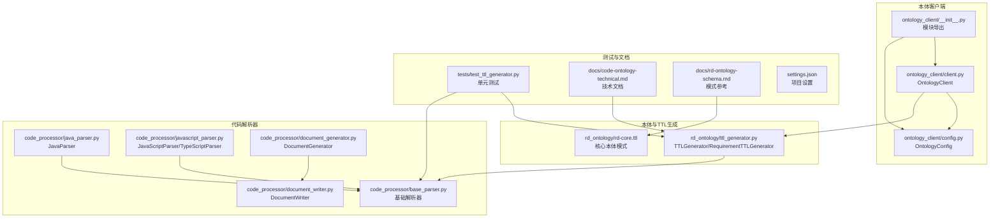

**图表来源**
- [ontology_client/client.py](file://ontology_client/client.py#L1-L1222)
- [ontology_client/config.py](file://ontology_client/config.py#L1-L129)
- [rd_ontology/ttl_generator.py](file://rd_ontology/ttl_generator.py#L1-L364)
- [code_processor/base_parser.py](file://code_processor/base_parser.py#L1-L360)
- [code_processor/document_generator.py](file://code_processor/document_generator.py#L1-L200)
- [code_processor/document_writer.py](file://code_processor/document_writer.py#L1-L308)

## 核心组件
- **OntologyClient**：对外暴露 TTL 上传、版本管理、文件列表、Cypher 查询、需求/测试检索、变更影响分析、统计与连接管理
- **OntologyConfig**：配置加载（文件/环境变量）、路径解析、校验与保存
- **TTLGenerator**：将代码元素与关系映射为 TTL，生成稳定 ID、IRI、转义字符串与项目级 TTL 输出
- **RequirementTTLGenerator**：生成需求/设计/任务实体与链接的 TTL
- **BaseCodeParser 及其子类**：抽象解析器与多语言实现，提供元素/关系数据结构与项目统计
- **DocumentKGPipeline**：**新增**：完整的文档到知识图谱构建管道，支持 LLM 增强和 Neo4j 导入
- **CodeOntologyBuildPipeline**：**新增**：代码本体构建管道，提供完整的构建流程
- **DocumentGenerator**：**新增**：将代码分析结果转换为描述文档，支持 LLM 增强
- **DocumentWriter**：**新增**：负责将生成的文档保存到磁盘，管理构建 ID

**章节来源**
- [ontology_client/client.py](file://ontology_client/client.py#L76-L1222)
- [ontology_client/config.py](file://ontology_client/config.py#L13-L129)
- [rd_ontology/ttl_generator.py](file://rd_ontology/ttl_generator.py#L23-L364)
- [code_processor/base_parser.py](file://code_processor/base_parser.py#L82-L360)
- [code_processor/document_generator.py](file://code_processor/document_generator.py#L23-L200)
- [code_processor/document_writer.py](file://code_processor/document_writer.py#L110-L308)

## 架构总览
本体客户端采用"配置驱动 + 本地 TTL 写入 + 可选 Neo4j 查询"的双通道架构，**新增**了完整的 DocumentKGPipeline 集成和 wiki 文档集成功能：
- **配置层**：优先从配置文件加载，否则回退到环境变量
- **TTL 层**：将分析结果转为 TTL，按 domain+版本命名，自动递增版本号
- **查询层**：可选连接 Neo4j，提供 Cypher 查询与统计信息
- **解析层**：多语言解析器输出统一的数据结构，供 TTL 生成器消费
- **新增**：DocumentKGPipeline 层，提供端到端的文档到知识图谱构建流程
- **新增**：wiki 文档集成层，自动检测和复制多种来源的 wiki 文档

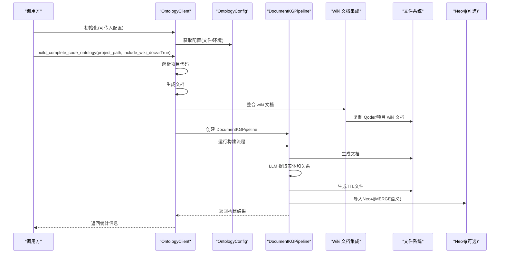

**图表来源**
- [ontology_client/client.py](file://ontology_client/client.py#L614-L799)
- [ontology_client/config.py](file://ontology_client/config.py#L95-L129)
- [rd_ontology/ttl_generator.py](file://rd_ontology/ttl_generator.py#L176-L228)

## 详细组件分析

### OntologyClient 类设计与初始化
- **设计要点**
  - 通过构造函数接收配置对象或自动加载默认配置
  - 维护 Neo4j 驱动实例，延迟初始化并在关闭时释放
  - 对外提供 TTL 上传、版本计算、文件列表、Cypher 查询、需求/测试检索、变更影响分析、统计与连接管理
  - **新增**：集成多个构建管道，包括 DocumentKGPipeline 和 CodeOntologyBuildPipeline
  - **新增**：支持 wiki 文档集成功能，自动检测和复制多种来源的 wiki 文档
- **初始化参数与配置**
  - config: OntologyConfig 实例；若为空则调用 get_config() 加载
  - 配置来源：优先读取 .ontology_config.json，不存在则读取环境变量
- **关键方法**
  - **upload_ttl**：写入 TTL 文件，自动创建目录与版本命名
  - **list_ttl_files**：枚举目录下所有 .ttl，返回元信息列表
  - **query**：执行 Cypher，失败时记录日志并返回空列表
  - **search_code_by_requirement** / **search_tests_for_code**：基于名称或 changeId 的检索
  - **analyze_change_impact**：根据文件路径条件，返回受影响的需求与测试
  - **get_statistics**：统计 TTL 数量、节点数、关系数、需求数（若连接 Neo4j）
  - **close** / 上下文管理：确保 Neo4j 驱动释放
  - **新增**：build_and_import_code_ontology：使用 Pipeline 构建并导入到 Neo4j
  - **新增**：build_complete_code_ontology：完整的代码本体构建流程，包含 wiki 文档集成

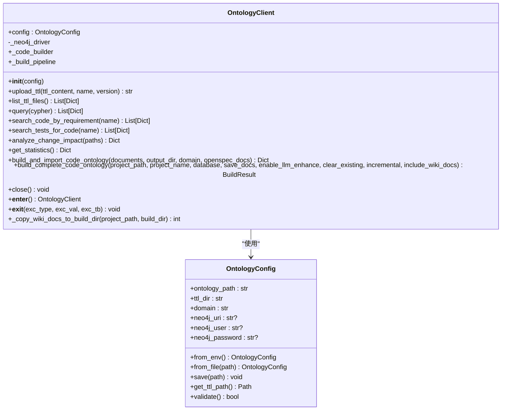

**图表来源**
- [ontology_client/client.py](file://ontology_client/client.py#L76-L1222)
- [ontology_client/config.py](file://ontology_client/config.py#L13-L129)

**章节来源**
- [ontology_client/client.py](file://ontology_client/client.py#L76-L1222)
- [ontology_client/config.py](file://ontology_client/config.py#L13-L129)

### TTL 文件上传与版本管理
- **功能概述**
  - 将传入的 TTL 字符串写入本地 TTL 目录
  - 自动生成文件名：domain 或指定 name + 版本号 vN
  - 版本号规则：按 name_vX.ttl 的命名模式扫描现有文件，取最大版本+1
- **命名规则**
  - 文件名：{name}_v{version}.ttl
  - 默认 name 来源于配置 domain
  - 默认 version 由内部版本计算逻辑确定
- **目录解析**
  - 通过 OntologyConfig.get_ttl_path() 解析绝对路径
- **性能与健壮性**
  - 递归创建目录，避免重复 IO
  - 版本扫描正则匹配，保证命名一致性

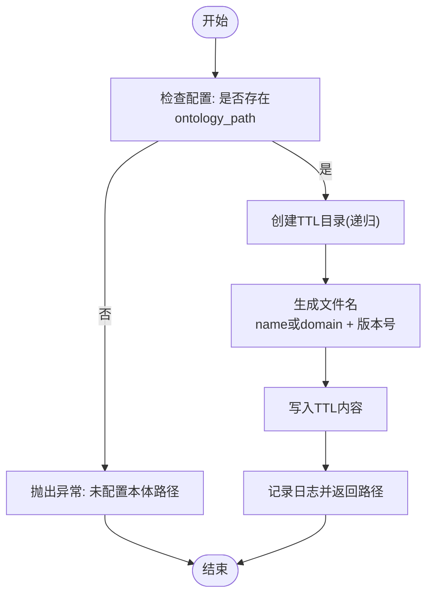

**图表来源**
- [ontology_client/client.py](file://ontology_client/client.py#L1005-L1037)
- [ontology_client/client.py](file://ontology_client/client.py#L1039-L1052)
- [ontology_client/config.py](file://ontology_client/config.py#L96-L100)

**章节来源**
- [ontology_client/client.py](file://ontology_client/client.py#L1005-L1052)
- [ontology_client/config.py](file://ontology_client/config.py#L96-L100)

### Cypher 查询接口与 Neo4j 集成
- **连接管理**
  - 首次查询时创建 GraphDatabase 驱动，使用配置中的 URI、用户名与密码
  - 使用会话执行查询，异常捕获并记录日志
  - 显式 close() 或上下文管理器确保连接释放
- **查询能力**
  - **通用 query(cypher)**：返回记录字典列表
  - **需求实现关系检索**：search_code_by_requirement(name)
  - **测试覆盖检索**：search_tests_for_code(name)
  - **变更影响分析**：analyze_change_impact(paths)
  - **统计信息**：get_statistics()（在有 Neo4j 时统计节点、关系、需求数量）

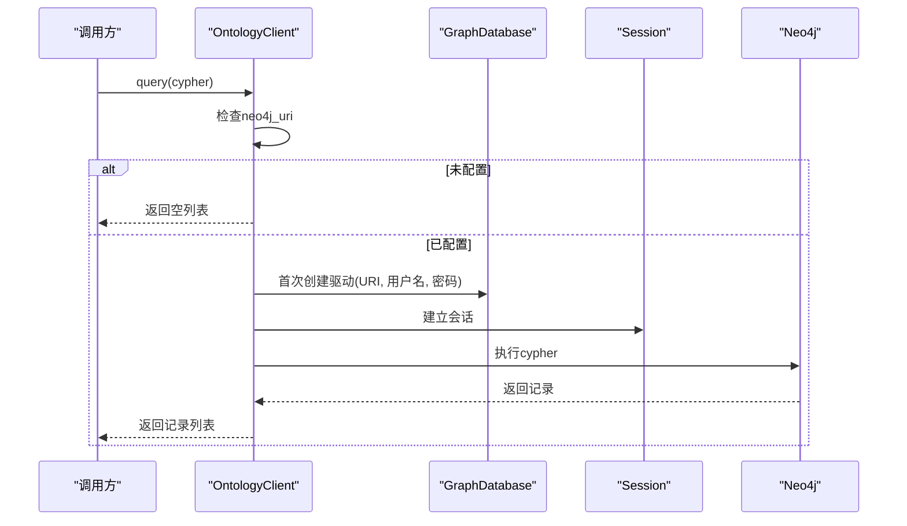

**图表来源**
- [ontology_client/client.py](file://ontology_client/client.py#L1075-L1107)

**章节来源**
- [ontology_client/client.py](file://ontology_client/client.py#L1075-L1107)

### TTL 生成器与本体模式
- **TTLGenerator**
  - 将 CodeElement/CodeRelation 映射为 TTL 三元组
  - 生成稳定 ID（SHA1 截断）与 IRI，映射元素类型与关系类型
  - 转义字符串，限制长字段长度，输出项目级 TTL
- **RequirementTTLGenerator**
  - 生成 Requirement/Design/Task 实体与属性
  - 支持链接属性（如 changeId、rationale、scope、decision），并限制条目数量
- **本体核心模式（rd-core.ttl）**
  - 定义实体层（Requirement/Design/CodeElement/Test/Task）
  - 定义类层次（CodeClass/CodeInterface/CodeMethod/CodeField/CodeModule/CodeEnum/CodeConstructor/CodeProperty/CodeComponent）
  - 定义对象属性（implementsRequirement、realizesDesign、testsCode、validatesRequirement、inherits、implements、extends、calls、dependsOn、contains、imports、overrides、decorates、uses、affectsFile、belongsToRequirement）
  - 定义数据属性（fullName、filePath、lineNumber、language、package、modifier、annotation、docstring、returnType、parameterName、parameterType、rationale、scope、decision、changeId、confidence、linkMethod）

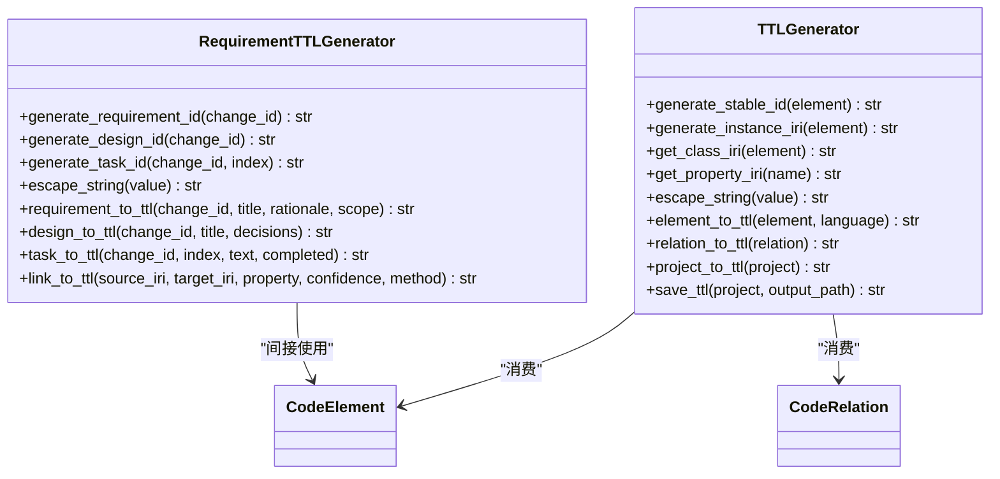

**图表来源**
- [rd_ontology/ttl_generator.py](file://rd_ontology/ttl_generator.py#L23-L364)
- [code_processor/base_parser.py](file://code_processor/base_parser.py#L82-L171)

**章节来源**
- [rd_ontology/ttl_generator.py](file://rd_ontology/ttl_generator.py#L23-L364)
- [rd_ontology/rd-core.ttl](file://rd_ontology/rd-core.ttl#L1-L294)
- [code_processor/base_parser.py](file://code_processor/base_parser.py#L82-L171)

### 代码元素搜索与需求实现关系
- **search_code_by_requirement(requirement_name)**
  - 在图中查找实现某需求的代码元素，返回代码全名、文件路径、行号与需求名称
- **search_tests_for_code(code_name)**
  - 在图中查找覆盖某代码元素的测试，返回测试全名、文件路径与被测代码
- **分析流程**
  - 构造 Cypher 查询，使用 CONTAINS 模糊匹配名称或 changeId
  - 通过 query() 执行并返回结果

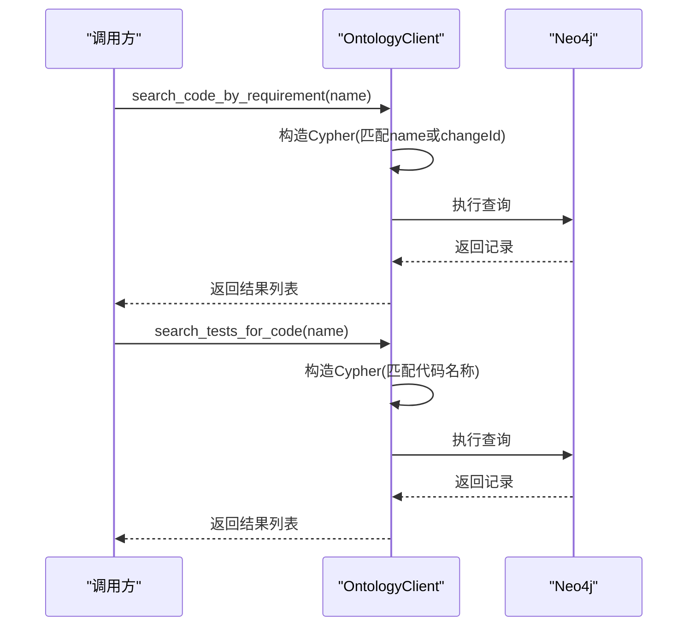

**图表来源**
- [ontology_client/client.py](file://ontology_client/client.py#L1109-L1141)

**章节来源**
- [ontology_client/client.py](file://ontology_client/client.py#L1109-L1141)

### 变更影响评估
- **analyze_change_impact(file_paths)**
  - 输入一组文件路径，返回受影响的需求与测试
  - 构造条件表达式，分别查询需求与测试，去重返回
- **使用场景**
  - 回归测试规划、需求影响范围评估、变更传播分析

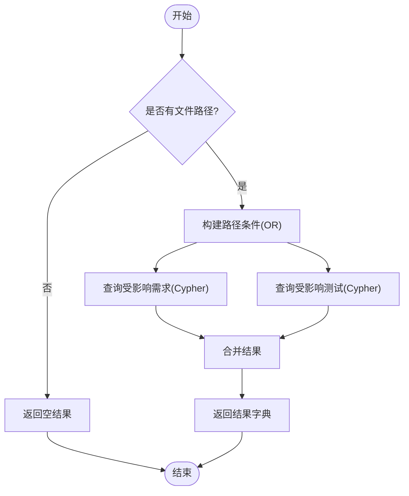

**图表来源**
- [ontology_client/client.py](file://ontology_client/client.py#L1143-L1176)

**章节来源**
- [ontology_client/client.py](file://ontology_client/client.py#L1143-L1176)

### 配置管理与连接生命周期
- **配置加载顺序**
  - 优先读取 .ontology_config.json（默认路径）
  - 若不存在，回退到环境变量（ONTOLOGY_PATH、ONTOLOGY_TTL_DIR、ONTOLOGY_DOMAIN、NEO4J_URI、NEO4J_USER、NEO4J_PASSWORD）
- **连接生命周期**
  - 首次查询时创建驱动，后续复用
  - close() 或 with 上下文管理器释放驱动
- **最佳实践**
  - 在项目根目录放置 .ontology_config.json，便于团队共享
  - 通过环境变量在 CI/CD 中注入配置
  - 在长时间运行的任务中显式 close() 或使用 with 语句

**章节来源**
- [ontology_client/config.py](file://ontology_client/config.py#L118-L129)
- [ontology_client/client.py](file://ontology_client/client.py#L1211-L1222)

### **新增**：DocumentKGPipeline 集成与端到端构建流程
- **DocumentKGPipeline 功能概述**
  - **新增**：完整的文档到知识图谱构建管道
  - 支持 LLM 增强的实体和关系抽取
  - 自动化的 TTL 文件生成和 Neo4j 导入
  - MERGE 语义，支持增量更新
- **构建流程**
  1. **文档加载**：从输入目录加载文档
  2. **LLM 提取**：使用 LLM 抽取实体和关系
  3. **TTL 生成**：生成版本化的 TTL 文件
  4. **TTL 解析**：使用 TTLParser 解析生成的 TTL
  5. **Neo4j 导入**：使用 V6Neo4jImporter 导入（MERGE 语义）
- **配置管理**
  - 从 .env 文件加载配置
  - 支持多种 LLM 提供商（如 Qwen）
  - 自动化的 Neo4j 连接配置

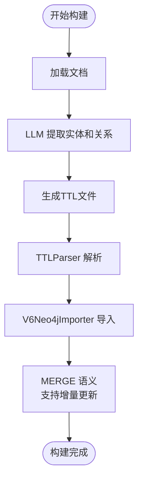

**图表来源**
- [ontology_client/client.py](file://ontology_client/client.py#L158-L225)
- [ontology_client/client.py](file://ontology_client/client.py#L281-L342)

**章节来源**
- [ontology_client/client.py](file://ontology_client/client.py#L158-L225)
- [ontology_client/client.py](file://ontology_client/client.py#L281-L342)

### **更新**：build_and_import_code_ontology 方法
- **方法概述**
  - **新增**：推荐使用的代码本体构建方法
  - 使用 CodeOntologyBuildPipeline 进行完整的构建流程
  - 自动处理文档保存、TTL 生成和 Neo4j 导入
- **构建流程**
  1. **文档保存**：将文档列表保存到临时目录
  2. **Pipeline 执行**：运行 CodeOntologyBuildPipeline
  3. **结果返回**：返回详细的构建统计信息
- **配置特点**
  - 使用 ontology 服务内部配置
  - 自动化的 LLM 和 Neo4j 配置
  - 支持 OpenSpec 文档集成

**章节来源**
- [ontology_client/client.py](file://ontology_client/client.py#L281-L342)

### **废弃**：build_code_ontology 方法
- **方法概述**
  - **废弃**：不推荐使用的方法
  - 建议使用 build_and_import_code_ontology 替代
  - 仅支持基本的 TTL 生成，不包含完整的构建流程
- **替代方案**
  - 使用 build_and_import_code_ontology 获取完整的构建体验
  - 或使用 build_complete_code_ontology 获取端到端的完整流程

**章节来源**
- [ontology_client/client.py](file://ontology_client/client.py#L227-L280)

### **新增**：build_complete_code_ontology 方法与 wiki 文档集成
- **方法概述**
  - **新增**：最完整的代码本体构建方法
  - 集成代码解析、文档生成、Pipeline 构建和 Neo4j 导入
  - 支持增量构建和 LLM 增强
  - **新增**：自动检测和复制多种来源的 wiki 文档
- **完整流程**
  1. **项目解析**：解析项目代码
  2. **增量检测**：检测文件变更
  3. **文档生成**：生成带 frontmatter 的文档
  4. **保存文档**：保存到磁盘
  5. ****新增**：整合 wiki 文档**：自动检测和复制多种来源的 wiki 文档
  6. **Pipeline 构建**：使用 DocumentKGPipeline 构建本体
  7. **Neo4j 导入**：导入到 Neo4j
- **配置选项**
  - 支持增量构建模式
  - 可选的 LLM 增强
  - 数据库选择和清理选项
  - **新增**：include_wiki_docs 参数，控制是否包含 wiki 文档
- **wiki 文档集成功能**
  - **支持的文档来源**：
    - .qoder/repowiki：Qoder 生成的项目文档（中文版）
    - .qoder/repowiki/en：Qoder 生成的项目文档（英文版）
    - docs/wiki：项目自带的 wiki 文档
    - wiki：项目根目录的 wiki 文档
  - **复制策略**：按优先级检测和复制，递归复制所有 .md 文件
  - **目录结构**：保持原始相对路径，复制到对应的子目录

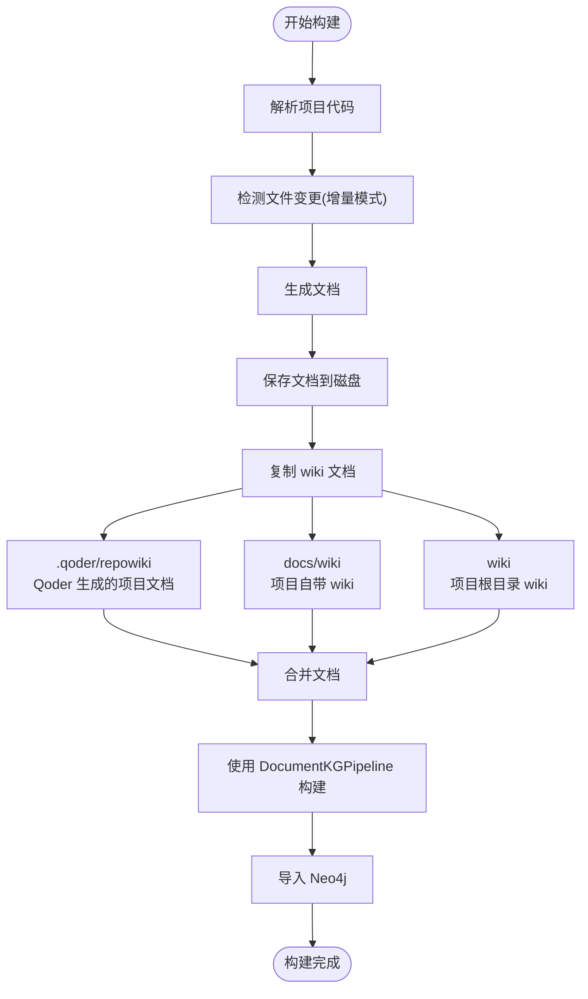

**图表来源**
- [ontology_client/client.py](file://ontology_client/client.py#L614-L799)
- [ontology_client/client.py](file://ontology_client/client.py#L941-L1003)

**章节来源**
- [ontology_client/client.py](file://ontology_client/client.py#L614-L799)
- [ontology_client/client.py](file://ontology_client/client.py#L941-L1003)

### **新增**：wiki 文档复制功能详解
- **功能概述**
  - 自动检测和复制多种来源的 wiki 文档
  - 支持 Qoder 生成的中文/英文 wiki 和项目特定 wiki 文档
  - 保持原始目录结构，递归复制所有 .md 文件
- **支持的文档来源**
  - **Qoder 生成的 repowiki（中文版）**：`.qoder/repowiki/zh/content`
  - **Qoder 生成的 repowiki（英文版）**：`.qoder/repowiki/en/content`
  - **项目 docs/wiki 目录**：`docs/wiki`
  - **项目根目录 wiki**：`wiki`
- **复制策略**
  - 按优先级检测各个来源
  - 对于每个存在的来源，递归复制所有 .md 文件
  - 保持原始相对路径结构
  - 复制到对应的子目录（qoder_wiki、qoder_wiki_en、project_wiki、wiki）
- **性能考虑**
  - 使用 rglob("*.md") 递归查找所有 Markdown 文件
  - 使用 shutil.copy2 保持文件元数据
  - 统计复制的文档数量，便于调试和监控

**章节来源**
- [ontology_client/client.py](file://ontology_client/client.py#L941-L1003)

## 依赖关系分析
- **组件耦合**
  - OntologyClient 依赖 OntologyConfig 与 Neo4j 驱动（可选）
  - TTLGenerator 依赖 code_processor 的数据结构（CodeElement/CodeRelation/ProjectInfo）
  - 多语言解析器继承 BaseCodeParser，提供统一接口
  - **新增**：DocumentKGPipeline 和 CodeOntologyBuildPipeline 依赖 ontology 服务内部模块
  - **新增**：DocumentGenerator 和 DocumentWriter 提供文档生成功能
  - **新增**：wiki 文档集成功能依赖文件系统操作
- **外部依赖**
  - **neo4j**：用于 Cypher 查询
  - **javalang**（可选）：Java 解析
  - **Python 标准库**：logging、pathlib、json、re、datetime 等
  - **新增**：dotenv：用于加载 .env 配置文件
  - **新增**：LLM 插件：支持多种 LLM 提供商
  - **新增**：shutil：用于文件复制操作

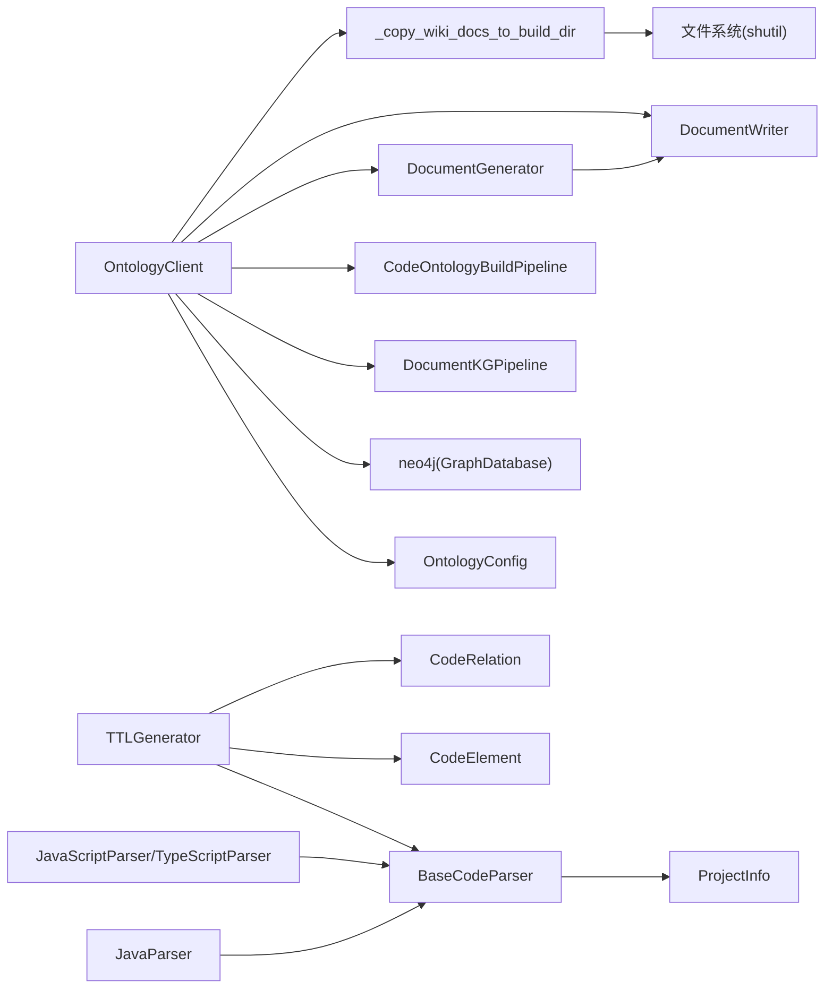

**图表来源**
- [ontology_client/client.py](file://ontology_client/client.py#L100-L156)
- [rd_ontology/ttl_generator.py](file://rd_ontology/ttl_generator.py#L12-L15)
- [code_processor/base_parser.py](file://code_processor/base_parser.py#L206-L206)
- [code_processor/document_generator.py](file://code_processor/document_generator.py#L13-L18)
- [code_processor/document_writer.py](file://code_processor/document_writer.py#L110-L115)

**章节来源**
- [ontology_client/client.py](file://ontology_client/client.py#L100-L156)
- [rd_ontology/ttl_generator.py](file://rd_ontology/ttl_generator.py#L12-L15)
- [code_processor/base_parser.py](file://code_processor/base_parser.py#L206-L206)
- [code_processor/document_generator.py](file://code_processor/document_generator.py#L13-L18)
- [code_processor/document_writer.py](file://code_processor/document_writer.py#L110-L115)

## 性能考量
- **TTL 写入**
  - 递归创建目录一次，避免重复 IO
  - 版本扫描使用正则匹配，复杂度与文件数量线性相关
- **查询性能**
  - 首次查询建立驱动，后续复用；建议在批量查询时复用同一实例
  - Cypher 查询应结合索引与属性选择，避免全表扫描
- **解析性能**
  - 多语言解析器过滤排除常见目录（如 .git、node_modules、venv 等），减少扫描范围
  - AST 解析失败时降级为基础提取，提升鲁棒性
- **内存与资源**
  - 使用 with 上下文管理器或显式 close() 释放 Neo4j 驱动
  - TTL 生成器缓存元素 IRIs，避免重复计算
- **新增**：Pipeline 性能优化
  - DocumentKGPipeline 支持增量构建，避免重复处理未变更的文档
  - LLM 调用优化，支持批量处理和缓存
  - Neo4j 导入使用 MERGE 语义，支持增量更新
- **新增**：wiki 文档复制性能
  - 使用 rglob 递归查找，避免深度遍历的复杂度问题
  - 批量复制操作，减少文件系统开销
  - 统计复制数量，便于性能监控

## 故障排查指南
- **未配置本体路径**
  - **现象**：upload_ttl 抛出异常
  - **处理**：设置 ONTOLOGY_PATH 或在 .ontology_config.json 中配置
- **未安装 Neo4j 驱动**
  - **现象**：query 抛出 ImportError 并记录错误日志
  - **处理**：pip install neo4j
- **Neo4j 连接失败**
  - **现象**：query 记录错误日志并返回空列表
  - **处理**：检查 URI、用户名、密码与网络连通性
- **TTL 文件未生成或版本号异常**
  - **现象**：文件名不符合 {name}_v{version}.ttl
  - **处理**：确认 domain/name 与现有文件命名是否一致；检查版本扫描逻辑
- **Pipeline 导入失败**
  - **现象**：build_and_import_code_ontology 返回错误
  - **处理**：检查 .env 配置文件、LLM API 密钥和 Neo4j 连接
- **DocumentKGPipeline 导入失败**
  - **现象**：文档到知识图谱构建失败
  - **处理**：检查文档格式、LLM 配置和数据库权限
- **wiki 文档复制失败**
  - **现象**：build_complete_code_ontology 无法复制 wiki 文档
  - **处理**：检查源目录是否存在、权限是否足够、目标目录是否可写
- **测试覆盖率不足**
  - **建议**：补充针对 TTL 生成器的单元测试，覆盖稳定 ID、元素/关系映射与项目级 TTL 输出

**章节来源**
- [ontology_client/client.py](file://ontology_client/client.py#L1017-L1018)
- [ontology_client/client.py](file://ontology_client/client.py#L1102-L1107)
- [tests/test_ttl_generator.py](file://tests/test_ttl_generator.py#L15-L103)

## 结论
本体客户端通过清晰的配置管理、稳健的 TTL 生成与版本控制、以及可选的 Neo4j 查询能力，为研发本体提供了可靠的基础设施。**新增**的 DocumentKGPipeline 集成进一步增强了端到端的文档到知识图谱构建能力。**新增**的 wiki 文档集成功能使得构建流程更加完整，能够自动整合多种来源的项目文档。建议在生产环境中：
- 使用 .ontology_config.json 管理配置，CI/CD 中通过环境变量注入
- 在批量查询场景中复用连接，避免频繁创建/销毁驱动
- **推荐**：使用 build_and_import_code_ontology 或 build_complete_code_ontology 获取完整的构建体验
- **新增**：利用 Pipeline 的增量构建功能，提升构建效率
- **新增**：启用 wiki 文档集成，确保项目文档的完整性
- 补充更多测试用例，覆盖不同语言与边界情况
- 结合本体核心模式（rd-core.ttl）进行 Cypher 查询优化

## 附录

### API 使用示例（步骤说明）
- **初始化客户端**
  - 传入配置对象或留空让其自动加载
- **上传 TTL**
  - 调用 upload_ttl(ttl_content, name?, version?)，返回写入路径
- **列出 TTL 文件**
  - 调用 list_ttl_files()，返回排序后的文件信息列表
- **执行 Cypher 查询**
  - 调用 query(cypher)，返回记录列表
- **搜索需求实现关系**
  - 调用 search_code_by_requirement(name)
- **搜索测试覆盖**
  - 调用 search_tests_for_code(name)
- **变更影响分析**
  - 调用 analyze_change_impact([paths...])
- **获取统计信息**
  - 调用 get_statistics()
- **资源清理**
  - 调用 close() 或使用 with 上下文管理器
- **新增**：构建代码本体并导入 Neo4j
  - 调用 build_and_import_code_ontology(documents, output_dir?, domain?, openspec_docs?)
- **新增**：完整的代码本体构建流程（含 wiki 文档集成）
  - 调用 build_complete_code_ontology(project_path, project_name?, database?, save_docs?, enable_llm_enhance?, clear_existing?, incremental?, include_wiki_docs?)

**章节来源**
- [ontology_client/client.py](file://ontology_client/client.py#L1005-L1222)

### 配置项说明
- **ONTOLOGY_PATH**：本体项目根目录
- **ONTOLOGY_TTL_DIR**：TTL 输出目录（相对路径）
- **ONTOLOGY_DOMAIN**：域名，用于默认文件名
- **NEO4J_URI**：Neo4j 连接地址
- **NEO4J_USER**：Neo4j 用户名
- **NEO4J_PASSWORD**：Neo4j 密码
- **新增**：ONTOLOGY_NEO4J_URI：Pipeline 使用的 Neo4j 连接地址
- **新增**：ONTOLOGY_LLM_PROVIDER：LLM 提供商（如 qwen）
- **新增**：ONTOLOGY_LLM_API_KEY：LLM API 密钥
- **新增**：ONTOLOGY_LLM_MODEL：LLM 模型名称

**章节来源**
- [ontology_client/config.py](file://ontology_client/config.py#L37-L52)
- [ontology_client/config.py](file://ontology_client/config.py#L118-L129)
- [ontology_client/client.py](file://ontology_client/client.py#L190-L197)

### 本体核心模式要点
- **实体类**：Requirement、Design、CodeElement、Test、Task
- **关系属性**：implementsRequirement、realizesDesign、testsCode、validatesRequirement、inherits、implements、extends、calls、dependsOn、contains、imports、overrides、decorates、uses、affectsFile、belongsToRequirement
- **数据属性**：fullName、filePath、lineNumber、language、package、modifier、annotation、docstring、returnType、parameterName、parameterType、rationale、scope、decision、changeId、confidence、linkMethod

**章节来源**
- [rd_ontology/rd-core.ttl](file://rd_ontology/rd-core.ttl#L17-L294)

### 代码解析器支持的语言
- **Java**：JavaParser，支持 .java 文件，使用 javalang 库进行 AST 解析
- **JavaScript/TypeScript**：JavaScriptParser/TypeScriptParser，支持 .js/.jsx/.ts/.tsx 文件，使用正则表达式解析
- **Python**：PythonParser，支持 .py 文件，使用 AST 解析
- **多语言项目**：MultiLanguageProjectAnalyzer，支持混合语言项目分析

**章节来源**
- [code_processor/java_parser.py](file://code_processor/java_parser.py#L39-L425)
- [code_processor/javascript_parser.py](file://code_processor/javascript_parser.py#L22-L548)
- [code_processor/base_parser.py](file://code_processor/base_parser.py#L17-L360)

### 测试覆盖分析
- **单元测试**：tests/test_ttl_generator.py 覆盖 TTL 生成器的核心功能
- **测试用例**：包括稳定 ID 生成、元素到 TTL 转换、关系到 TTL 转换、项目到 TTL 转换
- **测试策略**：使用 pytest 框架，验证 TTL 生成的正确性和完整性
- **新增**：集成测试：tests/test_integration.py 覆盖完整的端到端流程

**章节来源**
- [tests/test_ttl_generator.py](file://tests/test_ttl_generator.py#L1-L103)
- [tests/test_integration.py](file://tests/test_integration.py#L1-L524)

### **新增**：DocumentKGPipeline 使用示例
- **基本使用**
  ```python
  from ontology_client import OntologyClient
  
  client = OntologyClient()
  documents = ["# UserService\n\n用户服务类"]
  
  result = client.build_and_import_code_ontology(
      documents=documents,
      domain="rd"
  )
  
  print(f"构建成功: {result['success']}")
  print(f"实体数: {result['entities_created']}")
  print(f"关系数: {result['relationships_created']}")
  ```
- **完整流程使用（含 wiki 文档集成）**
  ```python
  result = client.build_complete_code_ontology(
      project_path="/path/to/project",
      project_name="my_project",
      database="ontologydevos",
      save_docs=True,
      enable_llm_enhance=True,
      clear_existing=False,
      incremental=True,
      include_wiki_docs=True  # 启用 wiki 文档集成
  )
  
  print(result.summary())
  ```

**章节来源**
- [ontology_client/client.py](file://ontology_client/client.py#L281-L342)
- [ontology_client/client.py](file://ontology_client/client.py#L614-L799)

### **新增**：wiki 文档集成使用示例
- **启用 wiki 文档集成**
  ```python
  result = client.build_complete_code_ontology(
      project_path="/path/to/project",
      include_wiki_docs=True  # 默认值为 True
  )
  
  # 将自动复制以下来源的 wiki 文档：
  # - .qoder/repowiki/zh/content (Qoder 中文版)
  # - .qoder/repowiki/en/content (Qoder 英文版)
  # - docs/wiki (项目自带 wiki)
  # - wiki (项目根目录 wiki)
  ```
- **禁用 wiki 文档集成**
  ```python
  result = client.build_complete_code_ontology(
      project_path="/path/to/project",
      include_wiki_docs=False  # 禁用 wiki 文档集成
  )
  ```

**章节来源**
- [ontology_client/client.py](file://ontology_client/client.py#L614-L799)
- [ontology_client/client.py](file://ontology_client/client.py#L941-L1003)