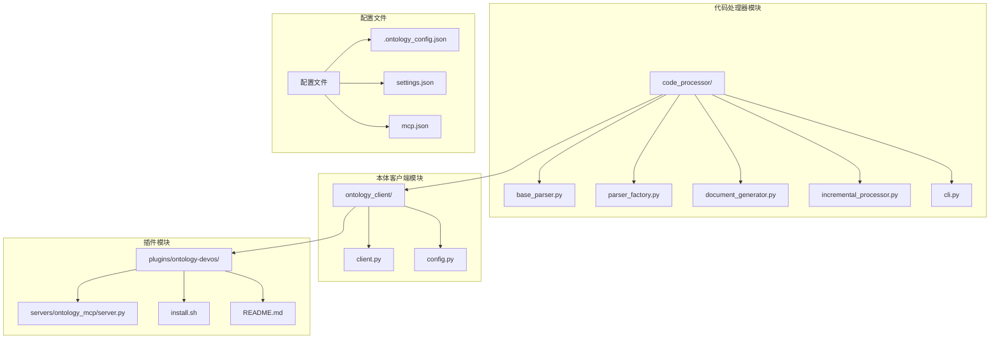
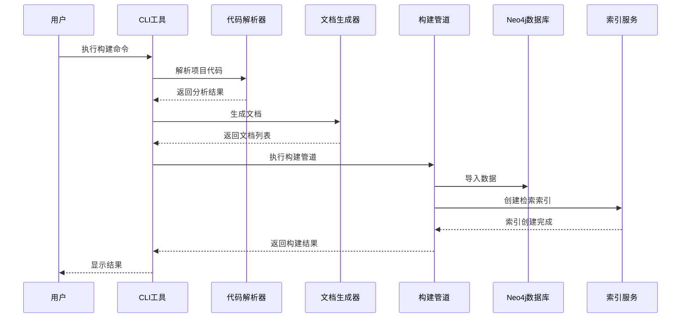
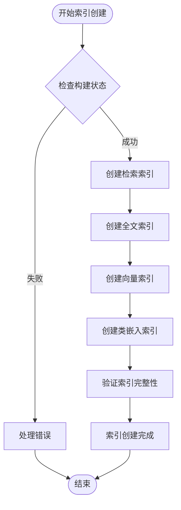
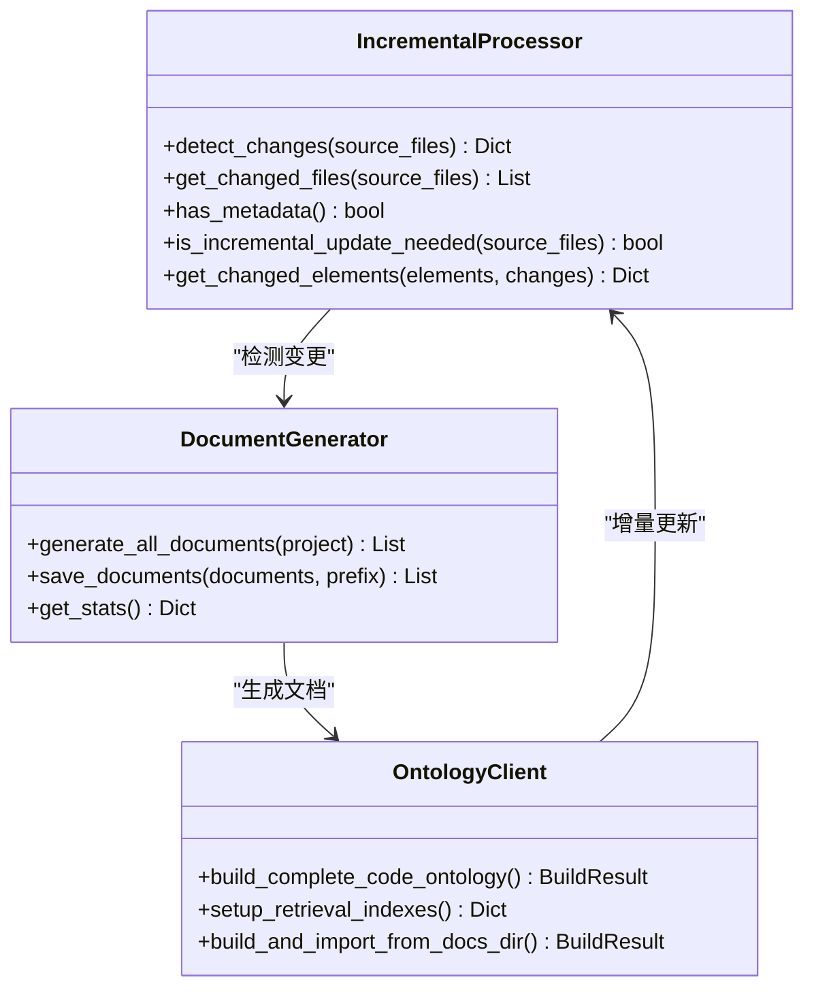
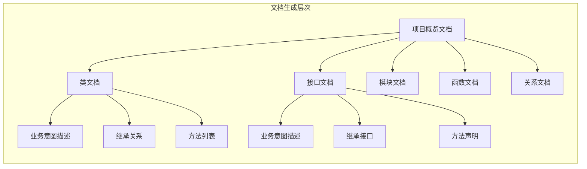
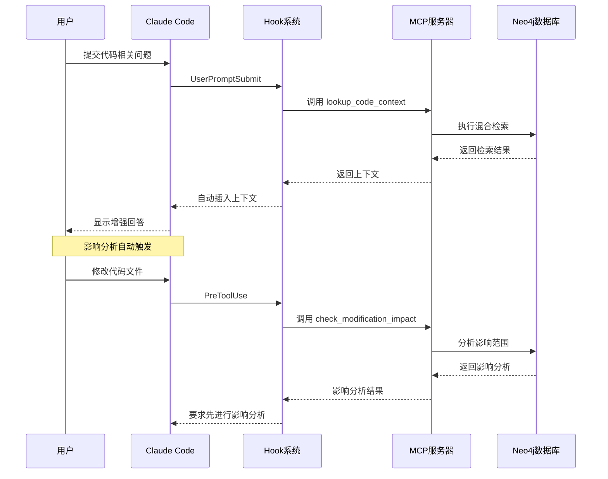
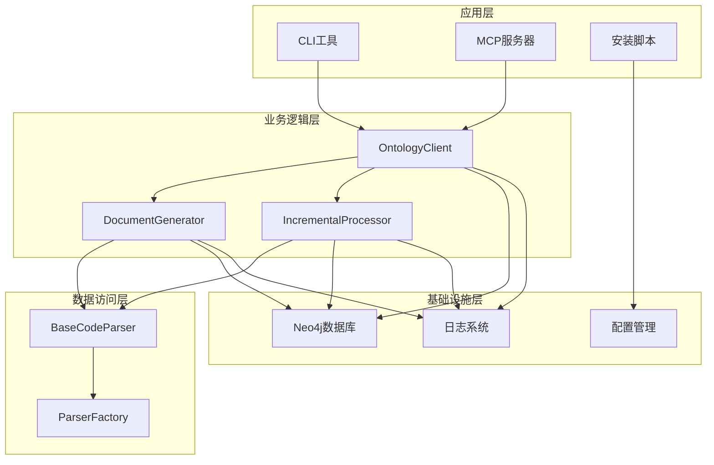

# 自动检索索引创建

<cite>
**本文档引用的文件**
- [README.md](file://README.md)
- [cli.py](file://code_processor/cli.py)
- [client.py](file://ontology_client/client.py)
- [server.py](file://plugins/ontology-devos/servers/ontology_mcp/server.py)
- [install.sh](file://plugins/ontology-devos/install.sh)
- [base_parser.py](file://code_processor/base_parser.py)
- [parser_factory.py](file://code_processor/parser_factory.py)
- [document_generator.py](file://code_processor/document_generator.py)
- [incremental_processor.py](file://code_processor/incremental_processor.py)
- [setup-claude-config.sh](file://setup-claude-config.sh)
- [setup-global.sh](file://setup-global.sh)
</cite>

## 目录
1. [简介](#简介)
2. [项目结构](#项目结构)
3. [核心组件](#核心组件)
4. [架构概览](#架构概览)
5. [详细组件分析](#详细组件分析)
6. [依赖关系分析](#依赖关系分析)
7. [性能考虑](#性能考虑)
8. [故障排除指南](#故障排除指南)
9. [结论](#结论)

## 简介

自动检索索引创建是本项目的核心功能之一，它实现了代码本体构建过程中的智能索引管理。该功能确保在代码本体构建完成后，自动创建必要的检索索引，包括全文索引和向量索引，为后续的代码检索、影响分析和需求链接提供高效的支持。

本系统采用多层架构设计，结合了代码解析、文档生成、知识图谱构建和索引管理等核心功能。通过自动化索引创建，用户可以无缝地获得强大的代码检索能力，无需手动配置复杂的索引参数。

## 项目结构

项目采用模块化设计，主要包含以下几个核心模块：

**图表来源**
- [cli.py](file://code_processor/cli.py#L1-L376)
- [client.py](file://ontology_client/client.py#L1-L800)
- [server.py](file://plugins/ontology-devos/servers/ontology_mcp/server.py#L1-L271)

**章节来源**
- [README.md](file://README.md#L71-L92)
- [setup-claude-config.sh](file://setup-claude-config.sh#L1-L456)

## 核心组件

### 代码处理器模块

代码处理器模块负责解析各种编程语言的源代码，提取代码元素和关系，并生成相应的文档。其核心组件包括：

- **BaseCodeParser**: 抽象基类，定义了代码解析的标准接口
- **ParserFactory**: 解析器工厂，支持多种编程语言的自动检测和解析
- **DocumentGenerator**: 文档生成器，将代码分析结果转换为自然语言描述
- **IncrementalProcessor**: 增量处理器，检测文件变更并支持增量更新

### 本体客户端模块

本体客户端模块提供了与外部本体服务交互的能力：

- **OntologyClient**: 主要的客户端类，封装了所有本体构建和管理功能
- **BuildResult**: 构建结果的数据结构，包含统计信息和状态报告

### MCP 服务器模块

MCP 服务器模块为 Claude Code 提供了代码检索和分析能力：

- **FastMCP**: 基于 FastMCP 的服务器实现
- **ReasoningClient**: 本体推理客户端，支持上下文检索和影响分析

**章节来源**
- [base_parser.py](file://code_processor/base_parser.py#L208-L360)
- [parser_factory.py](file://code_processor/parser_factory.py#L20-L248)
- [document_generator.py](file://code_processor/document_generator.py#L23-L697)
- [incremental_processor.py](file://code_processor/incremental_processor.py#L25-L281)

## 架构概览

系统采用分层架构设计，实现了代码解析、文档生成、知识图谱构建和检索服务的完整流程：

**图表来源**
- [cli.py](file://code_processor/cli.py#L160-L263)
- [client.py](file://ontology_client/client.py#L614-L787)

系统的核心优势在于其自动化程度和可扩展性。通过统一的接口设计，系统能够支持多种编程语言，自动检测项目结构，并提供灵活的配置选项。

## 详细组件分析

### 自动索引创建机制

自动索引创建是系统的核心功能，它在代码本体构建完成后自动执行，确保检索功能的即时可用性。

#### 索引类型和配置

系统自动创建以下类型的检索索引：

| 索引名称 | 类型 | 用途 | 配置参数 |
|---------|------|------|----------|
| `node_name_fulltext` | 全文索引 | 关键词搜索 | `fulltext_index` |
| `node_embedding_index` | 向量索引 | 语义搜索（实体节点） | `text_vector_index` |
| `class_embedding_idx` | 向量索引 | 语义搜索（类节点） | `embedding_dim` |

#### 索引创建流程

**图表来源**
- [client.py](file://ontology_client/client.py#L789-L800)

#### 增量索引维护

系统支持增量索引维护，通过文件变更检测来更新索引内容：

**图表来源**
- [incremental_processor.py](file://code_processor/incremental_processor.py#L25-L281)
- [document_generator.py](file://code_processor/document_generator.py#L23-L697)
- [client.py](file://ontology_client/client.py#L614-L787)

**章节来源**
- [client.py](file://ontology_client/client.py#L789-L800)
- [incremental_processor.py](file://code_processor/incremental_processor.py#L100-L182)

### 代码解析和文档生成

代码解析模块支持多种编程语言，通过工厂模式实现自动语言检测和解析。

#### 支持的语言类型

系统支持以下编程语言：

- **Java**: 通过 `JavaParser` 实现
- **Python**: 通过 `PythonParser` 实现  
- **JavaScript**: 通过 `JavaScriptParser` 实现
- **TypeScript**: 通过 `TypeScriptParser` 实现

#### 文档生成策略

文档生成器采用分层策略，为不同类型的代码元素生成相应的文档：

**图表来源**
- [document_generator.py](file://code_processor/document_generator.py#L196-L521)

**章节来源**
- [parser_factory.py](file://code_processor/parser_factory.py#L48-L88)
- [document_generator.py](file://code_processor/document_generator.py#L69-L134)

### MCP 服务器集成

MCP 服务器为 Claude Code 提供了强大的代码检索能力，集成了多种检索工具：

#### MCP 工具功能

| 工具名称 | 功能描述 | 使用场景 |
|---------|----------|----------|
| `lookup_code_context` | 混合检索代码上下文 | 代码相关问题查询 |
| `check_modification_impact` | 分析代码修改影响 | 修改代码前的风险评估 |
| `link_spec_to_code` | 需求-代码链接 | 需求追踪和实现验证 |
| `switch_database` | 切换数据库 | 多项目环境管理 |
| `health_check` | 健康检查 | 系统状态监控 |

#### Hook 自动触发机制

系统通过 Hook 机制实现自动触发：

**图表来源**
- [server.py](file://plugins/ontology-devos/servers/ontology_mcp/server.py#L147-L267)

**章节来源**
- [server.py](file://plugins/ontology-devos/servers/ontology_mcp/server.py#L147-L267)
- [README.md](file://README.md#L14-L409)

## 依赖关系分析

系统的依赖关系呈现清晰的分层结构，从底层的代码解析到上层的应用服务：

**图表来源**
- [cli.py](file://code_processor/cli.py#L14-L28)
- [client.py](file://ontology_client/client.py#L88-L156)
- [base_parser.py](file://code_processor/base_parser.py#L208-L243)

系统的关键依赖包括：

- **Neo4j**: 作为知识图谱存储和查询引擎
- **FastMCP**: 作为 MCP 协议的实现框架
- **Python生态系统**: 包括各种解析器和工具库

**章节来源**
- [setup-claude-config.sh](file://setup-claude-config.sh#L285-L366)
- [install.sh](file://plugins/ontology-devos/install.sh#L1-L263)

## 性能考虑

系统在设计时充分考虑了性能优化，特别是在大规模代码库的处理方面：

### 增量处理优化

- **文件哈希检测**: 通过 SHA256 哈希值检测文件变更，避免全量重新处理
- **元数据缓存**: 使用 JSON 文件缓存文件元数据，支持断点续传
- **智能过滤**: 只处理变更的代码元素，减少不必要的计算

### 索引性能优化

- **多索引策略**: 结合全文索引和向量索引，提供最佳的检索性能
- **批量创建**: 支持批量索引创建，减少数据库操作开销
- **内存管理**: 合理的内存使用策略，避免大规模数据处理时的内存溢出

### 并发处理能力

系统支持并发处理多个代码文件，通过以下机制保证线程安全：

- **无状态设计**: 大多数组件设计为无状态，便于并发调用
- **原子操作**: 关键操作采用原子性设计，避免数据竞争
- **资源池管理**: 合理的资源池管理，避免资源泄露

## 故障排除指南

### 常见问题和解决方案

#### 索引创建失败

**问题症状**:
- 索引创建过程中出现异常
- 检索功能不可用

**可能原因**:
- Neo4j 连接失败
- 权限不足
- 索引配置错误

**解决步骤**:
1. 检查 Neo4j 服务状态
2. 验证数据库连接参数
3. 确认用户权限
4. 检查索引配置参数

#### 增量处理异常

**问题症状**:
- 增量构建失败
- 元数据损坏

**解决步骤**:
1. 清除元数据缓存
2. 重新初始化增量处理器
3. 执行全量构建
4. 重新启用增量模式

#### MCP 服务器问题

**问题症状**:
- MCP 工具调用失败
- Claude Code 无法连接

**解决步骤**:
1. 检查 .mcp.json 配置
2. 验证 Python 环境
3. 重启 MCP 服务器
4. 检查防火墙设置

**章节来源**
- [README.md](file://README.md#L125-L167)
- [install.sh](file://plugins/ontology-devos/install.sh#L125-L144)

## 结论

自动检索索引创建功能是本项目的核心亮点，它通过智能化的设计实现了代码本体构建的完整自动化。系统不仅提供了强大的代码检索能力，还通过增量处理和智能优化确保了在大规模项目中的高效运行。

该功能的主要优势包括：

1. **完全自动化**: 从代码解析到索引创建的全流程自动化
2. **高性能**: 通过增量处理和多索引策略优化检索性能
3. **可扩展性**: 支持多种编程语言和灵活的配置选项
4. **易用性**: 简洁的命令行接口和完善的错误处理机制

未来的发展方向包括：

- 支持更多的编程语言和文件格式
- 优化大规模代码库的处理性能
- 增强检索算法的准确性和效率
- 扩展与其他开发工具的集成能力

通过持续的优化和改进，自动检索索引创建功能将成为代码开发和维护过程中的重要助手，显著提升开发效率和代码质量。