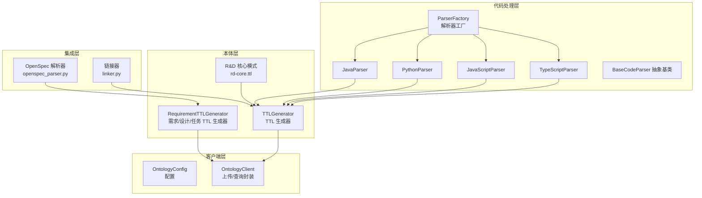
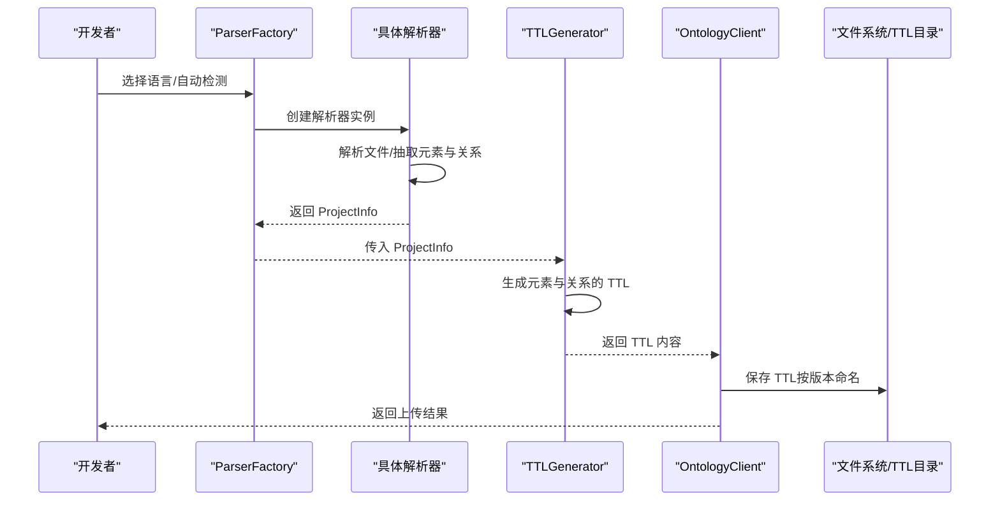
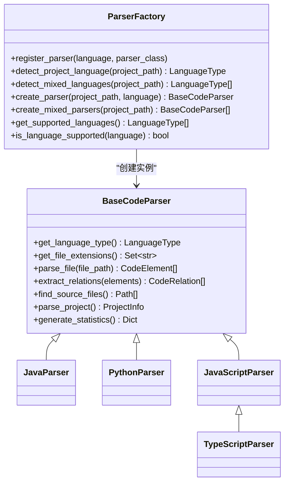
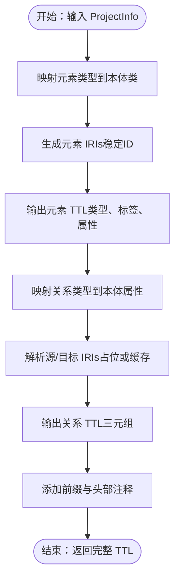
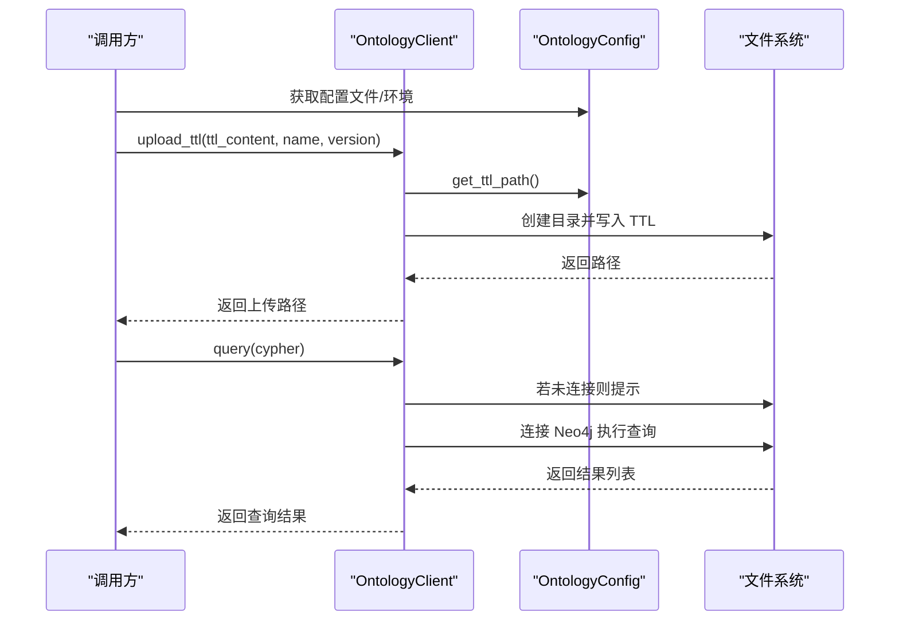
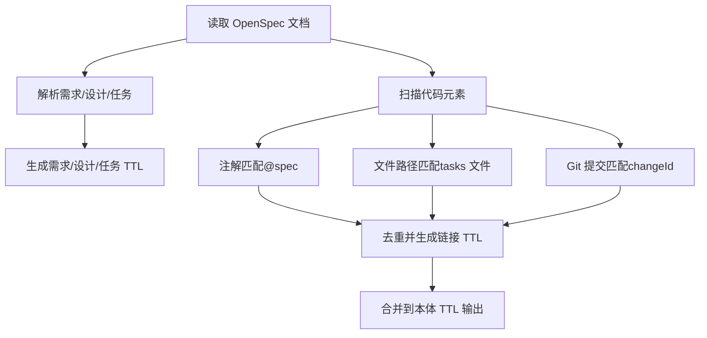
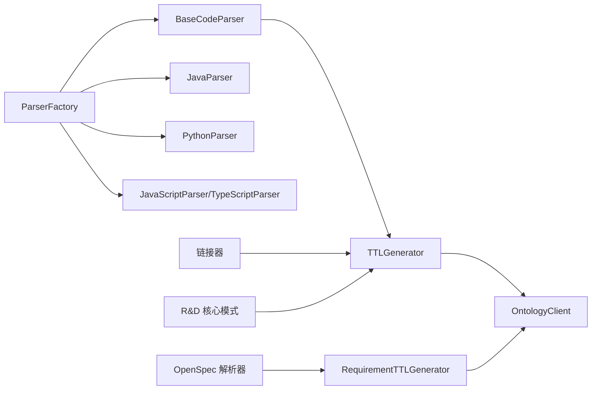

# 本体系统

<cite>
**本文引用的文件**
- [README.md](file://README.md)
- [settings.json](file://settings.json)
- [ontology_client/config.py](file://ontology_client/config.py)
- [ontology_client/client.py](file://ontology_client/client.py)
- [rd_ontology/rd-core.ttl](file://rd_ontology/rd-core.ttl)
- [rd_ontology/ttl_generator.py](file://rd_ontology/ttl_generator.py)
- [code_processor/base_parser.py](file://code_processor/base_parser.py)
- [code_processor/parser_factory.py](file://code_processor/parser_factory.py)
- [code_processor/java_parser.py](file://code_processor/java_parser.py)
- [code_processor/python_parser.py](file://code_processor/python_parser.py)
- [code_processor/javascript_parser.py](file://code_processor/javascript_parser.py)
- [sdd_integration/openspec_parser.py](file://sdd_integration/openspec_parser.py)
- [sdd_integration/linker.py](file://sdd_integration/linker.py)
- [tests/test_ttl_generator.py](file://tests/test_ttl_generator.py)
- [tests/test_code_processor.py](file://tests/test_code_processor.py)
</cite>

## 目录
1. [引言](#引言)
2. [项目结构](#项目结构)
3. [核心组件](#核心组件)
4. [架构总览](#架构总览)
5. [详细组件分析](#详细组件分析)
6. [依赖分析](#依赖分析)
7. [性能考虑](#性能考虑)
8. [故障排查指南](#故障排查指南)
9. [结论](#结论)
10. [附录](#附录)

## 引言
本体系统围绕“研发（R&D）本体”展开，目标是将软件开发生命周期中的需求、设计、代码元素与测试以统一的知识图谱形式表达，并通过 TTL（Terse Triple Language）持久化，最终在图数据库中进行查询与推理。系统支持多语言代码解析（Java、Python、JavaScript/TypeScript），并结合 OpenSpec 文档与 Git 提交记录，自动或半自动地建立代码与需求之间的链接，从而支撑多 AI 协同开发场景下的知识表示与智能分析。

## 项目结构
项目采用模块化组织，核心模块包括：
- 代码处理器（code_processor）：多语言解析器与工厂，负责从源码中抽取元素与关系，并生成统一的数据模型。
- 本体客户端（ontology_client）：负责 TTL 文件上传、版本管理以及基于 Neo4j 的查询封装。
- R&D 本体（rd_ontology）：包含本体核心模式（TTL）与 TTL 生成器，将代码分析结果转换为本体实例数据。
- SDD 集成（sdd_integration）：解析 OpenSpec 文档并建立代码与需求/设计/任务的链接。
- 测试（tests）：覆盖 TTL 生成器与代码处理器的关键行为。

图表来源
- [code_processor/parser_factory.py](file://code_processor/parser_factory.py#L20-L171)
- [code_processor/java_parser.py](file://code_processor/java_parser.py#L39-L128)
- [code_processor/python_parser.py](file://code_processor/python_parser.py#L22-L136)
- [code_processor/javascript_parser.py](file://code_processor/javascript_parser.py#L22-L122)
- [rd_ontology/ttl_generator.py](file://rd_ontology/ttl_generator.py#L18-L321)
- [rd_ontology/rd-core.ttl](file://rd_ontology/rd-core.ttl#L1-L294)
- [sdd_integration/openspec_parser.py](file://sdd_integration/openspec_parser.py#L51-L198)
- [sdd_integration/linker.py](file://sdd_integration/linker.py#L35-L241)
- [ontology_client/config.py](file://ontology_client/config.py#L13-L106)
- [ontology_client/client.py](file://ontology_client/client.py#L19-L201)

章节来源
- [README.md](file://README.md#L71-L92)
- [code_processor/parser_factory.py](file://code_processor/parser_factory.py#L20-L171)
- [rd_ontology/ttl_generator.py](file://rd_ontology/ttl_generator.py#L18-L321)
- [ontology_client/client.py](file://ontology_client/client.py#L19-L201)

## 核心组件
- 代码处理器（多语言解析器与工厂）
  - 统一抽象接口与数据模型，支持 Java、Python、JavaScript/TypeScript。
  - 提供文件发现、语法树/AST 解析、关系抽取与统计分析。
- TTL 生成器
  - 将代码元素与关系映射为本体三元组，生成稳定 IRIs，支持前缀与属性映射。
  - 支持需求/设计/任务的 TTL 生成与链接三元组输出。
- 本体客户端
  - 管理 TTL 文件上传与版本号递增，提供 Neo4j 查询封装与常用检索方法。
- OpenSpec 集成
  - 解析 proposal/design/tasks 文档，提取结构化信息并生成 TTL。
  - 通过注解、文件路径、Git 提交等多策略链接代码与需求。
- 配置管理
  - 支持环境变量与文件两种方式加载本体路径、域名与 Neo4j 凭据。

章节来源
- [code_processor/base_parser.py](file://code_processor/base_parser.py#L82-L204)
- [code_processor/parser_factory.py](file://code_processor/parser_factory.py#L20-L171)
- [rd_ontology/ttl_generator.py](file://rd_ontology/ttl_generator.py#L18-L321)
- [sdd_integration/openspec_parser.py](file://sdd_integration/openspec_parser.py#L51-L198)
- [sdd_integration/linker.py](file://sdd_integration/linker.py#L35-L241)
- [ontology_client/config.py](file://ontology_client/config.py#L13-L106)
- [ontology_client/client.py](file://ontology_client/client.py#L19-L201)

## 架构总览
系统以“代码解析—本体生成—持久化/查询”为主线，贯穿多语言支持、SDD 文档集成与多 AI 协同的上下文。

图表来源
- [code_processor/parser_factory.py](file://code_processor/parser_factory.py#L122-L160)
- [rd_ontology/ttl_generator.py](file://rd_ontology/ttl_generator.py#L176-L228)
- [ontology_client/client.py](file://ontology_client/client.py#L26-L48)

## 详细组件分析

### 代码处理器与工厂
- 抽象基类 BaseCodeParser 定义统一接口：语言类型、文件扩展名、单文件解析、关系抽取、项目遍历与统计。
- ParserFactory 支持语言自动检测、混合语言项目分析、注册与创建解析器。
- 各语言解析器实现：
  - JavaParser：基于 javalang 库解析 AST，抽取类、接口、枚举、方法、字段、导入与继承/实现关系。
  - PythonParser：基于 AST 与自定义访问器，抽取类、函数、变量、装饰器、调用关系、导入关系。
  - JavaScript/TypeScriptParser：正则与 AST 结合，抽取类、函数、组件、变量、导入/导出、React Hooks 使用关系。

图表来源
- [code_processor/base_parser.py](file://code_processor/base_parser.py#L206-L358)
- [code_processor/parser_factory.py](file://code_processor/parser_factory.py#L20-L171)
- [code_processor/java_parser.py](file://code_processor/java_parser.py#L39-L128)
- [code_processor/python_parser.py](file://code_processor/python_parser.py#L22-L136)
- [code_processor/javascript_parser.py](file://code_processor/javascript_parser.py#L22-L122)

章节来源
- [code_processor/base_parser.py](file://code_processor/base_parser.py#L206-L358)
- [code_processor/parser_factory.py](file://code_processor/parser_factory.py#L20-L171)
- [code_processor/java_parser.py](file://code_processor/java_parser.py#L39-L128)
- [code_processor/python_parser.py](file://code_processor/python_parser.py#L22-L136)
- [code_processor/javascript_parser.py](file://code_processor/javascript_parser.py#L22-L122)

### TTL 生成器与 R&D 本体核心
- TTLGenerator
  - 将 CodeElement 映射到本体类（如 CodeClass、CodeMethod 等），将 RelationType 映射到属性（如 inherits、implements、calls 等）。
  - 生成稳定 IRIs（SHA1 截断），避免重复与漂移。
  - 支持字符串转义、前缀声明与注释头信息。
- RequirementTTLGenerator
  - 生成 Requirement/Design/Task 的 TTL 实例，支持 changeId、rationale、scope、decision 等属性。
- R&D 核心模式（rd-core.ttl）
  - 定义实体层（Requirement、Design、CodeElement、Test、Task）、类层次（CodeClass、CodeMethod 等）与属性/关系（implementsRequirement、realizesDesign、testsCode、inherits、calls、imports 等）。

图表来源
- [rd_ontology/ttl_generator.py](file://rd_ontology/ttl_generator.py#L61-L228)
- [rd_ontology/rd-core.ttl](file://rd_ontology/rd-core.ttl#L1-L294)

章节来源
- [rd_ontology/ttl_generator.py](file://rd_ontology/ttl_generator.py#L18-L321)
- [rd_ontology/rd-core.ttl](file://rd_ontology/rd-core.ttl#L1-L294)

### 本体客户端与查询封装
- OntologyClient
  - 上传 TTL 到指定目录并按名称+版本命名，自动递增版本号。
  - 列表化 TTL 文件，提供统计信息。
  - 封装 Cypher 查询（Neo4j），提供按需求搜索代码、按代码搜索测试、变更影响分析等常用查询。
- 配置管理
  - 支持从文件或环境变量加载本体路径、TTL 目录、域名与 Neo4j 凭据；提供校验与路径拼接。

图表来源
- [ontology_client/config.py](file://ontology_client/config.py#L31-L106)
- [ontology_client/client.py](file://ontology_client/client.py#L26-L111)

章节来源
- [ontology_client/config.py](file://ontology_client/config.py#L13-L106)
- [ontology_client/client.py](file://ontology_client/client.py#L19-L201)

### SDD 集成与链接策略
- OpenSpec 解析器
  - 从 proposal.md 提取需求（changeId、title、rationale、scope、breaking_changes 等）。
  - 从 design.md 提取设计（title、architecture decisions、components、data flow）。
  - 从 tasks.md 提取任务（索引、文本、完成状态、文件路径、阶段）。
- 链接器
  - 注解匹配（@spec）、文件路径匹配（tasks 中的文件）、Git 提交记录匹配。
  - 去重保留最高置信度，生成链接 TTL（如 implementsRequirement）。

图表来源
- [sdd_integration/openspec_parser.py](file://sdd_integration/openspec_parser.py#L51-L198)
- [sdd_integration/linker.py](file://sdd_integration/linker.py#L47-L241)
- [rd_ontology/ttl_generator.py](file://rd_ontology/ttl_generator.py#L231-L321)

章节来源
- [sdd_integration/openspec_parser.py](file://sdd_integration/openspec_parser.py#L51-L198)
- [sdd_integration/linker.py](file://sdd_integration/linker.py#L35-L241)
- [rd_ontology/ttl_generator.py](file://rd_ontology/ttl_generator.py#L231-L321)

## 依赖分析
- 组件耦合
  - 代码处理器与 TTL 生成器松耦合：前者提供 ProjectInfo，后者只依赖类型枚举与映射。
  - 本体客户端与 TTL 生成器通过字符串内容交互，不直接依赖解析器。
  - OpenSpec 解析器与链接器独立于解析器，但依赖解析器产出的元素集合。
- 外部依赖
  - Java 解析依赖 javalang。
  - Neo4j 查询依赖 neo4j 驱动（可选）。
  - Git 提交解析依赖系统 git 命令。

图表来源
- [code_processor/parser_factory.py](file://code_processor/parser_factory.py#L243-L248)
- [rd_ontology/ttl_generator.py](file://rd_ontology/ttl_generator.py#L18-L321)
- [ontology_client/client.py](file://ontology_client/client.py#L19-L201)

章节来源
- [code_processor/parser_factory.py](file://code_processor/parser_factory.py#L243-L248)
- [rd_ontology/ttl_generator.py](file://rd_ontology/ttl_generator.py#L18-L321)
- [ontology_client/client.py](file://ontology_client/client.py#L19-L201)

## 性能考虑
- 解析阶段
  - 过滤排除目录（如 .git、node_modules、__pycache__ 等），减少 IO 与解析负担。
  - 逐文件解析并增量收集元素与关系，避免一次性加载全部文件。
- TTL 生成
  - 使用稳定 ID（SHA1 截断）确保 IRIs 不随内容变化而漂移，有利于增量更新与缓存。
  - 字符串转义与截断（如 docstring、rationale）控制 TTL 体积。
- 查询阶段
  - 通过专用查询方法（按需求搜索代码、按代码搜索测试、变更影响分析）降低 Cypher 复杂度。
  - 统计查询仅在配置可用时执行，避免不必要的连接。

[本节为通用指导，无需列出章节来源]

## 故障排查指南
- 无法解析 Java 代码
  - 现象：抛出导入异常或解析失败。
  - 排查：确认已安装 javalang；检查文件编码与语法错误。
- Neo4j 查询失败
  - 现象：查询返回空或报错。
  - 排查：确认已安装 neo4j 驱动；检查 URI、用户名、密码；确认服务可达。
- TTL 上传失败
  - 现象：抛出配置错误或目录不存在。
  - 排查：检查 ONTOLOGY_PATH 与 TTL 目录权限；确认配置文件或环境变量正确。
- 链接不准确
  - 现象：注解/文件路径/Git 提交匹配结果与预期不符。
  - 排查：检查注解格式（@spec）、任务文件路径一致性、Git 提交是否包含 changeId。

章节来源
- [code_processor/java_parser.py](file://code_processor/java_parser.py#L43-L45)
- [ontology_client/client.py](file://ontology_client/client.py#L86-L111)
- [ontology_client/config.py](file://ontology_client/config.py#L79-L88)
- [sdd_integration/linker.py](file://sdd_integration/linker.py#L159-L212)

## 结论
本体系统通过多语言解析器与统一数据模型，将需求、设计、代码与测试以 TTL 形式表达，并在 Neo4j 中提供高效查询。借助 OpenSpec 与 Git 的多策略链接，系统实现了从规范到实现的可追溯性与可验证性，为多 AI 协同开发提供了坚实的知识基础设施。建议在实际落地中关注增量更新、版本管理与查询性能优化，持续完善链接策略与本体扩展。

[本节为总结性内容，无需列出章节来源]

## 附录

### 本体扩展与版本管理
- 扩展建议
  - 新增语言：在 ParserFactory 注册新解析器，完善 TTL 映射。
  - 新增关系：在 TTLGenerator 中补充 RelationType 映射，扩展 rd-core.ttl 属性。
  - 新增属性：在 CodeElement/CodeRelation 中增加字段，并在 TTLGenerator 中输出。
- 版本管理
  - 上传时按名称+版本命名，自动递增版本号，便于回溯与对比。

章节来源
- [code_processor/parser_factory.py](file://code_processor/parser_factory.py#L243-L248)
- [rd_ontology/ttl_generator.py](file://rd_ontology/ttl_generator.py#L61-L68)
- [ontology_client/client.py](file://ontology_client/client.py#L50-L63)

### 查询示例与最佳实践
- 按需求搜索代码
  - 使用 search_code_by_requirement，支持 changeId 或名称模糊匹配。
- 按代码搜索测试
  - 使用 search_tests_for_code，基于 testsCode 关系定位测试。
- 变更影响分析
  - analyze_change_impact 输入受影响文件路径，返回受影响的需求与测试清单。
- 最佳实践
  - 在代码中添加 @spec 注解，明确标注 changeId，提高注解匹配置信度。
  - 保持任务文件路径与实际文件一致，提升文件路径匹配成功率。
  - 在 Git 提交中包含 changeId，便于提交记录匹配。

章节来源
- [ontology_client/client.py](file://ontology_client/client.py#L112-L155)
- [sdd_integration/linker.py](file://sdd_integration/linker.py#L70-L157)

### 测试要点
- TTL 生成器
  - 稳定 ID 一致性、元素 TTL 输出、关系 TTL 输出、项目 TTL 生成。
- 代码处理器
  - Python 类/函数/导入解析、语言检测、解析器创建与统计。

章节来源
- [tests/test_ttl_generator.py](file://tests/test_ttl_generator.py#L12-L103)
- [tests/test_code_processor.py](file://tests/test_code_processor.py#L17-L139)