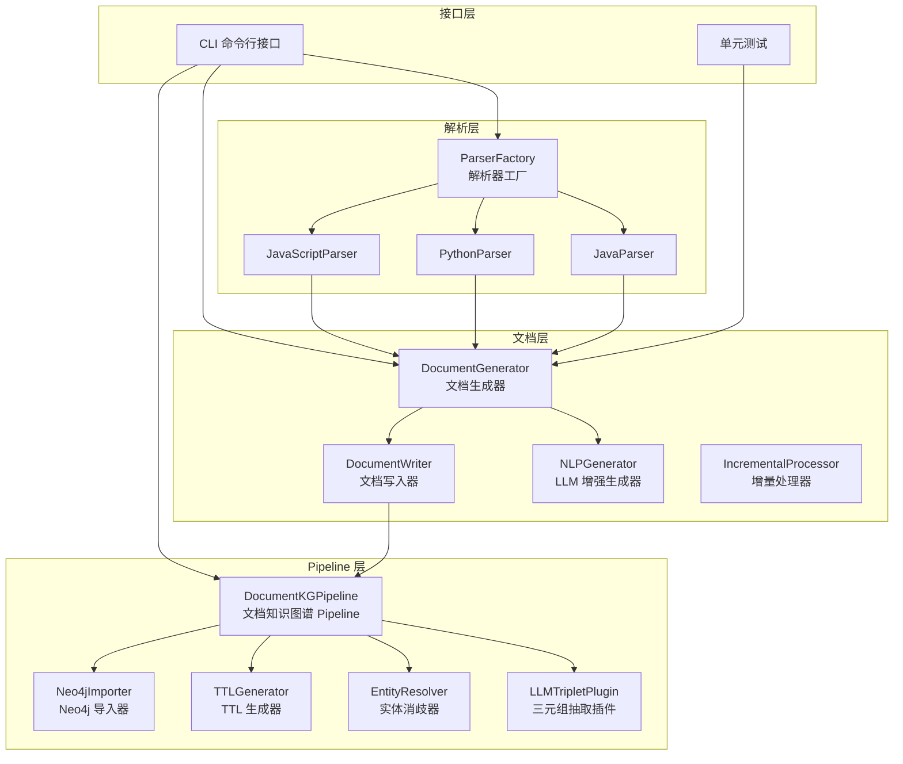
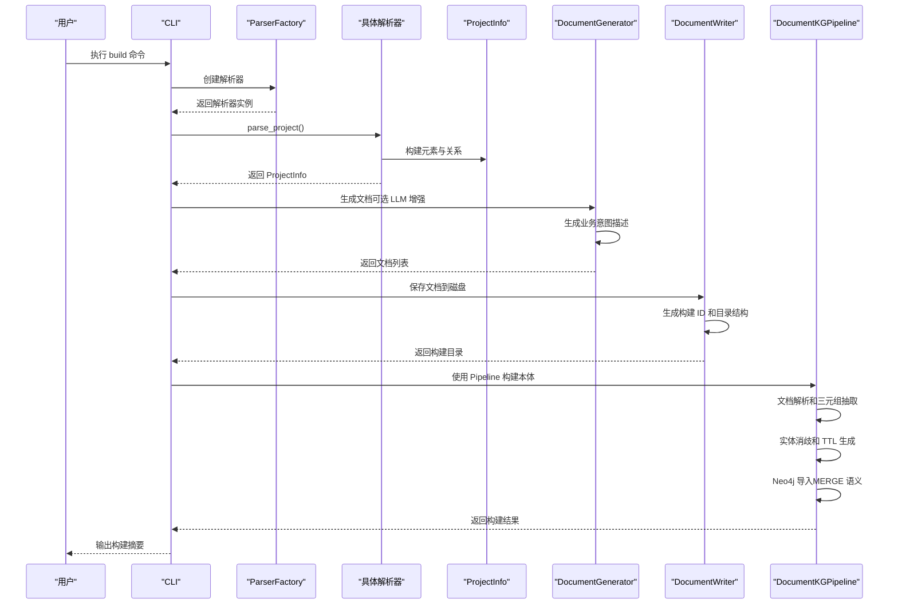
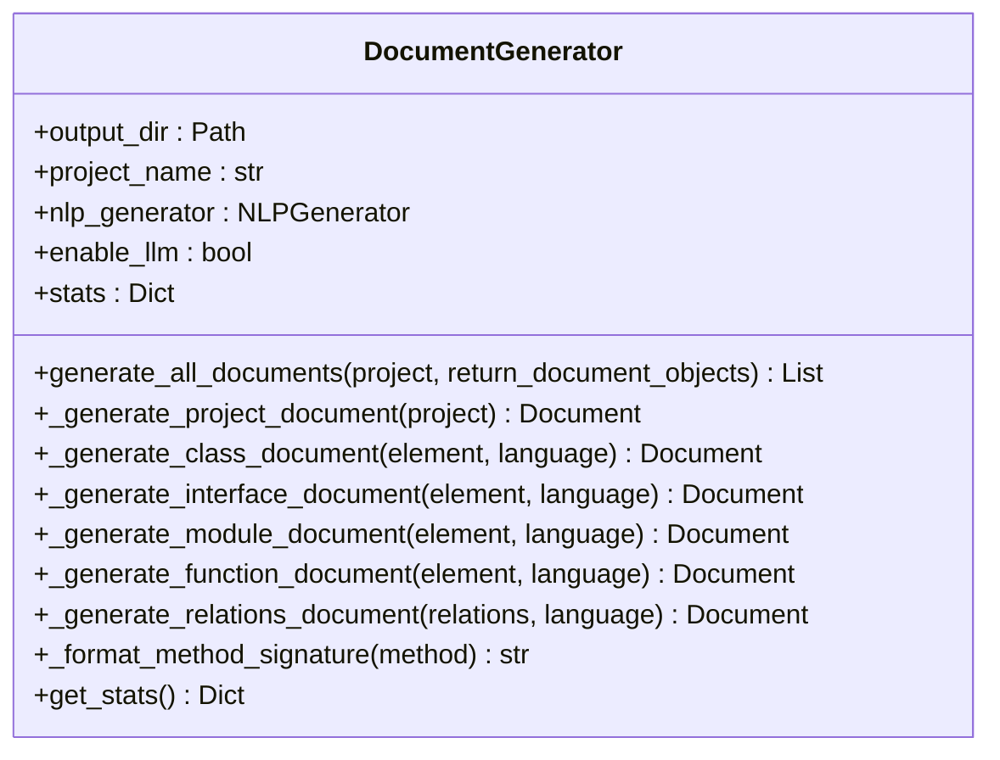
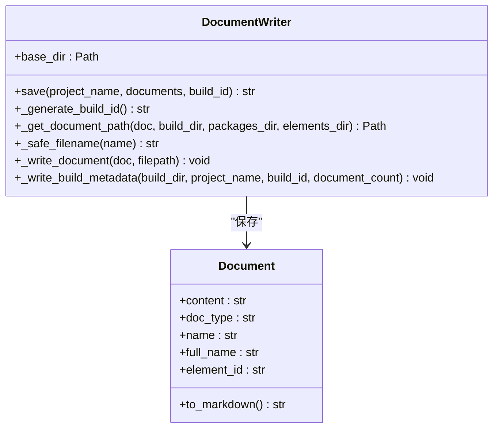
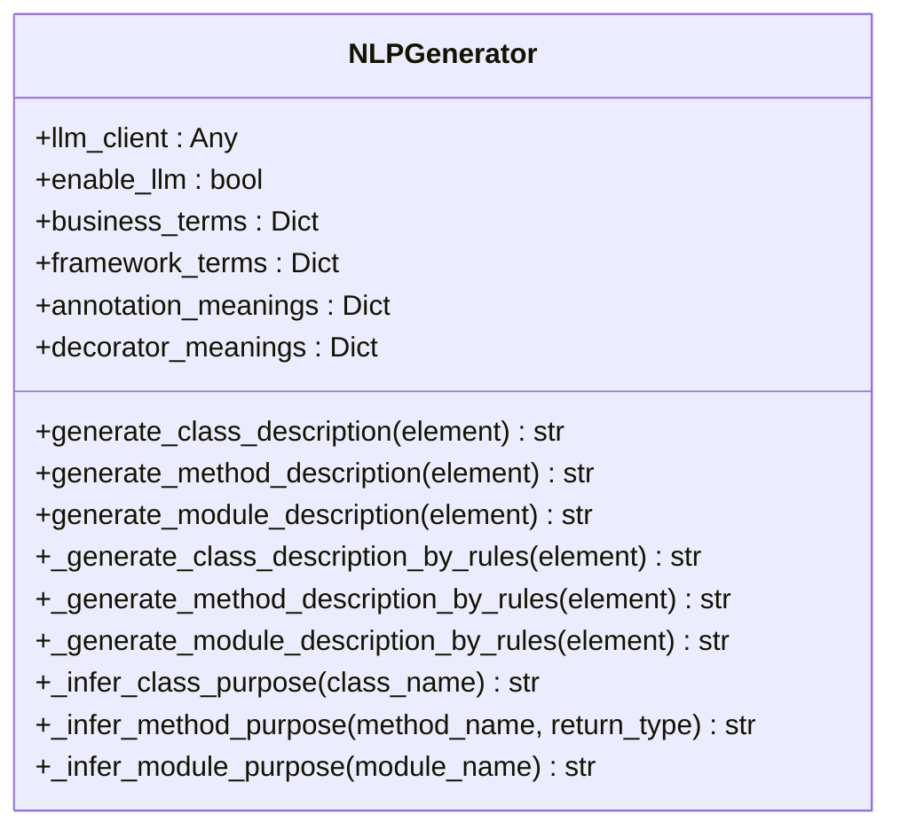
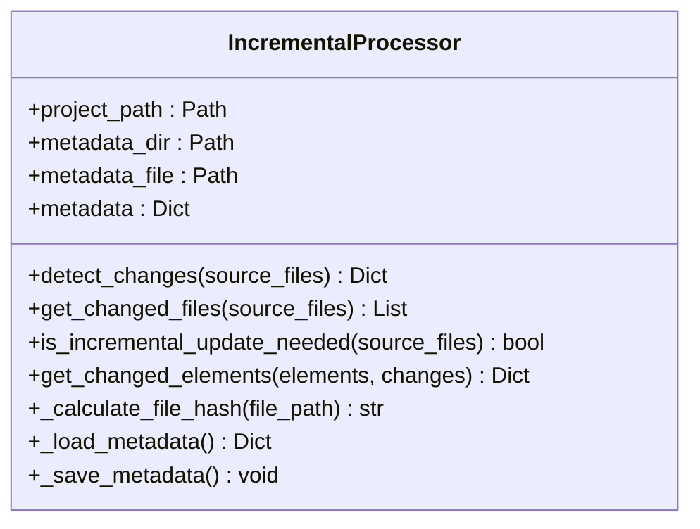
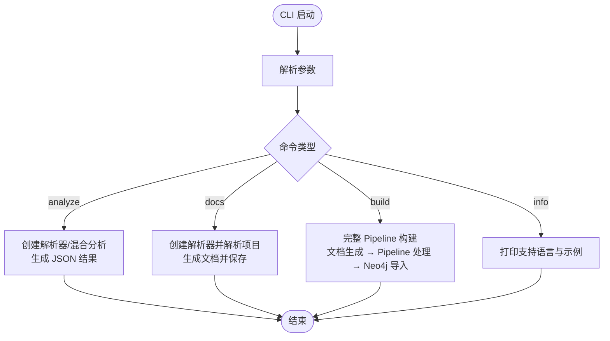
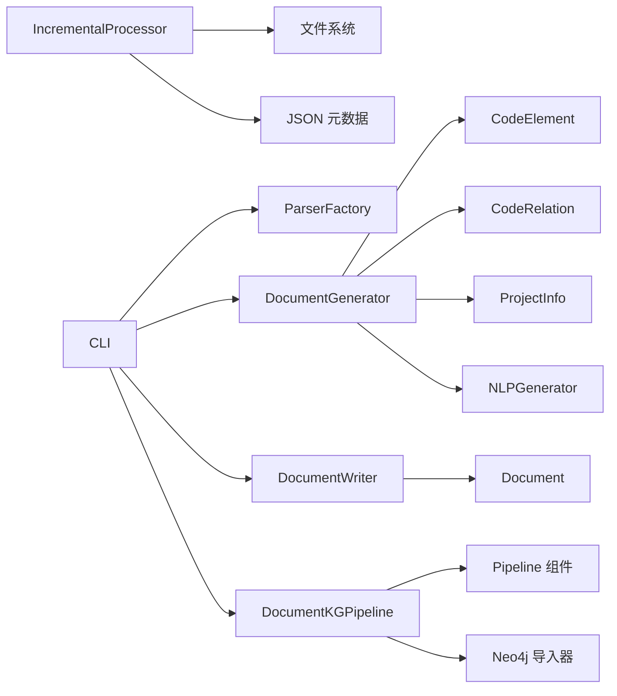

# TTL 生成器引擎

<cite>
**本文引用的文件**
- [code_processor/document_generator.py](file://code_processor/document_generator.py)
- [code_processor/document_writer.py](file://code_processor/document_writer.py)
- [code_processor/nlp_generator.py](file://code_processor/nlp_generator.py)
- [code_processor/incremental_processor.py](file://code_processor/incremental_processor.py)
- [code_processor/base_parser.py](file://code_processor/base_parser.py)
- [code_processor/cli.py](file://code_processor/cli.py)
- [ontology_client/client.py](file://ontology_client/client.py)
- [docs/code-ontology-technical.md](file://docs/code-ontology-technical.md)
- [docs/plans/2026-02-02-code-ontology-pipeline-design.md](file://docs/plans/2026-02-02-code-ontology-pipeline-design.md)
- [tests/test_ttl_generator.py](file://tests/test_ttl_generator.py)
</cite>

## 更新摘要
**所做更改**
- 移除了旧的 TTLGenerator 和 iri_utils 组件文档
- 新增了基于 DocumentKGPipeline 的完整架构说明
- 更新了文档生成器、文档写入器和增量处理器的详细说明
- 新增了 LLM 增强文档生成功能
- 更新了 CLI 命令和使用示例
- 新增了实体 ID 规范和文档格式规范

## 目录
1. [简介](#简介)
2. [项目结构](#项目结构)
3. [核心组件](#核心组件)
4. [架构总览](#架构总览)
5. [详细组件分析](#详细组件分析)
6. [依赖关系分析](#依赖关系分析)
7. [性能考量](#性能考量)
8. [故障排除指南](#故障排除指南)
9. [结论](#结论)
10. [附录](#附录)

## 简介
本文件为 TTL 生成器引擎的技术文档，聚焦于将代码分析结果转换为 R&D 本体的 TTL（Turtle）格式。经过架构重构后，系统采用全新的 DocumentKGPipeline 方式，通过"代码解析 → 文档生成 → Pipeline 处理 → TTL 生成 → Neo4j 导入"的完整流水线实现代码本体构建。内容覆盖算法实现、代码分析流程、本体构建逻辑、元素与关系提取、语义标注、配置选项、输出格式、质量控制、多语言支持、复杂关系处理、性能优化、使用示例、调试技巧与故障排除，以及生成结果验证与本体完整性检查。

## 项目结构
该模块围绕"代码解析器 + 文档生成器 + Pipeline 处理器 + TTL 生成器"的完整架构组织，配合 CLI 提供命令行入口，测试保障生成器行为正确性。

**图表来源**
- [code_processor/document_generator.py](file://code_processor/document_generator.py#L23-L134)
- [code_processor/document_writer.py](file://code_processor/document_writer.py#L110-L179)
- [code_processor/nlp_generator.py](file://code_processor/nlp_generator.py#L18-L41)
- [code_processor/incremental_processor.py](file://code_processor/incremental_processor.py#L25-L56)
- [ontology_client/client.py](file://ontology_client/client.py#L158-L226)

**章节来源**
- [code_processor/document_generator.py](file://code_processor/document_generator.py#L23-L134)
- [code_processor/document_writer.py](file://code_processor/document_writer.py#L110-L179)
- [code_processor/nlp_generator.py](file://code_processor/nlp_generator.py#L18-L41)
- [code_processor/incremental_processor.py](file://code_processor/incremental_processor.py#L25-L56)
- [ontology_client/client.py](file://ontology_client/client.py#L158-L226)

## 核心组件
- **DocumentGenerator**：负责将 CodeElement 与 CodeRelation 转换为结构化文档，支持 LLM 增强的业务意图描述生成。
- **DocumentWriter**：负责将生成的文档保存到磁盘，管理构建 ID 和目录结构。
- **NLPGenerator**：基于规则和 LLM 的自然语言生成器，为代码元素生成高质量的业务意图描述。
- **IncrementalProcessor**：检测文件变更并实现增量更新，支持基于哈希值的文件变更检测。
- **DocumentKGPipeline**：完整的文档到知识图谱构建流水线，包含文档解析、三元组抽取、实体消歧、TTL 生成和 Neo4j 导入。
- **CLI**：提供 analyze、docs、build 等命令，支持多语言分析、文档生成和完整 Pipeline 构建。

**章节来源**
- [code_processor/document_generator.py](file://code_processor/document_generator.py#L23-L134)
- [code_processor/document_writer.py](file://code_processor/document_writer.py#L110-L179)
- [code_processor/nlp_generator.py](file://code_processor/nlp_generator.py#L18-L41)
- [code_processor/incremental_processor.py](file://code_processor/incremental_processor.py#L25-L56)
- [ontology_client/client.py](file://ontology_client/client.py#L158-L226)

## 架构总览
经过架构重构后，TTL 生成器采用全新的 DocumentKGPipeline 方式：解析器从源码中抽取元素与关系，文档生成器将其转换为带 frontmatter 的 Markdown 文档，DocumentWriter 保存到磁盘，DocumentKGPipeline 使用 LLM 从文档中抽取三元组，生成 TTL 文件并导入 Neo4j。

**图表来源**
- [code_processor/cli.py](file://code_processor/cli.py#L160-L263)
- [code_processor/document_generator.py](file://code_processor/document_generator.py#L69-L134)
- [code_processor/document_writer.py](file://code_processor/document_writer.py#L126-L179)
- [ontology_client/client.py](file://ontology_client/client.py#L614-L787)

## 详细组件分析

### DocumentGenerator 组件
职责与特性
- 将 CodeElement 与 CodeRelation 转换为结构化文档，支持 Markdown 格式和 frontmatter 元数据。
- 自动生成业务意图描述，支持规则推断和 LLM 增强两种模式。
- 按元素类型分类生成文档：项目概览、类、接口、模块、函数、关系文档。
- 支持统计信息收集和文档对象返回。

算法与流程
- **文档生成**：按类型分组元素，生成对应的文档模板，填充基本信息、业务描述、关系等。
- **业务意图生成**：基于命名模式、注解/装饰器含义、方法签名等规则推断业务意图。
- **文档格式**：使用 frontmatter 标准化元数据，包含 element_id、语言、包名等关键信息。

**图表来源**
- [code_processor/document_generator.py](file://code_processor/document_generator.py#L23-L134)

**章节来源**
- [code_processor/document_generator.py](file://code_processor/document_generator.py#L23-L134)

### DocumentWriter 组件
职责与特性
- 负责将生成的文档保存到磁盘，管理构建 ID 和目录结构。
- 生成标准化的文档目录结构：project.md、packages/、elements/、relations.md。
- 提供安全的文件名生成和构建元数据管理。

算法与流程
- **目录结构**：创建项目级别的构建目录，按类型组织文档文件。
- **构建 ID**：基于时间戳和哈希值生成唯一的构建标识符。
- **文件命名**：将完整名称转换为安全的文件名，支持长文件名的哈希处理。

**图表来源**
- [code_processor/document_writer.py](file://code_processor/document_writer.py#L110-L179)
- [code_processor/document_writer.py](file://code_processor/document_writer.py#L17-L62)

**章节来源**
- [code_processor/document_writer.py](file://code_processor/document_writer.py#L110-L179)
- [code_processor/document_writer.py](file://code_processor/document_writer.py#L17-L62)

### NLPGenerator 组件
职责与特性
- 为代码元素生成高质量的业务意图描述，而非简单的 AST 翻译。
- 支持规则推断和 LLM 增强两种模式，提供灵活的描述生成策略。
- 包含丰富的业务术语映射、框架术语和注解含义表。

算法与流程
- **规则推断**：基于类名后缀、方法命名模式、返回类型等规则推断业务意图。
- **LLM 增强**：构建详细的元素上下文，调用 LLM 生成更丰富的描述。
- **术语映射**：维护业务术语、框架术语、注解/装饰器含义的映射表。

**图表来源**
- [code_processor/nlp_generator.py](file://code_processor/nlp_generator.py#L18-L41)

**章节来源**
- [code_processor/nlp_generator.py](file://code_processor/nlp_generator.py#L18-L41)

### IncrementalProcessor 组件
职责与特性
- 检测文件变更并实现增量更新，基于文件哈希值进行变更检测。
- 管理元数据持久化，支持新增、修改、删除文件的分类处理。
- 提供统计信息和缓存管理功能。

算法与流程
- **文件哈希**：计算文件的 SHA256 哈希值，用于变更检测。
- **元数据管理**：持久化文件元数据，包括哈希值、修改时间、大小等。
- **变更分类**：将文件分为新增、修改、删除、未变更四类。

**图表来源**
- [code_processor/incremental_processor.py](file://code_processor/incremental_processor.py#L25-L56)

**章节来源**
- [code_processor/incremental_processor.py](file://code_processor/incremental_processor.py#L25-L56)

### CLI 与使用示例
- **analyze**：单语言或混合语言分析，支持输出 JSON 或文档。
- **docs**：生成代码描述文档，支持保存到文件和自定义输出目录。
- **build**：完整的 Pipeline 构建流程，支持增量构建、LLM 增强、Neo4j 导入等选项。
- **info**：展示支持语言与命令示例。

**图表来源**
- [code_processor/cli.py](file://code_processor/cli.py#L299-L376)
- [code_processor/cli.py](file://code_processor/cli.py#L40-L114)
- [code_processor/cli.py](file://code_processor/cli.py#L116-L158)
- [code_processor/cli.py](file://code_processor/cli.py#L160-L263)

**章节来源**
- [code_processor/cli.py](file://code_processor/cli.py#L299-L376)
- [code_processor/cli.py](file://code_processor/cli.py#L40-L114)
- [code_processor/cli.py](file://code_processor/cli.py#L116-L158)
- [code_processor/cli.py](file://code_processor/cli.py#L160-L263)

## 依赖关系分析
- **DocumentGenerator** 依赖基础数据模型（CodeElement、CodeRelation、ProjectInfo）与 NLPGenerator。
- **DocumentWriter** 依赖 Document 对象和文件系统操作。
- **NLPGenerator** 依赖业务术语映射和 LLM 客户端（可选）。
- **IncrementalProcessor** 依赖文件系统和 JSON 元数据存储。
- **DocumentKGPipeline** 依赖 ontology 项目的 Pipeline 组件和 Neo4j 导入器。
- **CLI** 依赖所有上述组件，形成完整的端到端工作流。

**图表来源**
- [code_processor/document_generator.py](file://code_processor/document_generator.py#L13-L18)
- [code_processor/document_writer.py](file://code_processor/document_writer.py#L11-L12)
- [code_processor/nlp_generator.py](file://code_processor/nlp_generator.py#L13-L13)
- [code_processor/incremental_processor.py](file://code_processor/incremental_processor.py#L14-L19)
- [ontology_client/client.py](file://ontology_client/client.py#L144-L156)

**章节来源**
- [code_processor/document_generator.py](file://code_processor/document_generator.py#L13-L18)
- [code_processor/document_writer.py](file://code_processor/document_writer.py#L11-L12)
- [code_processor/nlp_generator.py](file://code_processor/nlp_generator.py#L13-L13)
- [code_processor/incremental_processor.py](file://code_processor/incremental_processor.py#L14-L19)
- [ontology_client/client.py](file://ontology_client/client.py#L144-L156)

## 性能考量
- **解析阶段**
  - 文件扫描与过滤：排除常见目录（如 .git、node_modules、venv 等），减少无关文件处理。
  - 语言检测：综合项目特征与文件扩展名打分，避免全盘扫描。
  - AST/正则解析：针对不同语言选择合适解析策略（javalang、AST、正则），平衡准确度与速度。
- **文档生成阶段**
  - LLM 调用优化：支持规则推断和 LLM 增强的混合模式，降低 LLM 调用成本。
  - 文档缓存：生成的文档保存到磁盘，支持增量构建时的文档复用。
  - 增量处理：基于文件哈希的变更检测，只处理变更的文件和元素。
- **Pipeline 处理阶段**
  - 分片处理：LLMTripletPlugin 支持分片和重试机制，提高处理效率。
  - 实体消歧：EntityResolver 提供实体消歧功能，确保关系链接的准确性。
  - TTL 生成：使用标准的 TTL 生成器，支持版本化保存和增量更新。
- **I/O 与内存**
  - 采用增量写入（列表累积后一次性写入文件），减少磁盘 IO。
  - 项目统计与包结构分析在解析阶段完成，避免重复遍历。

**章节来源**
- [code_processor/incremental_processor.py](file://code_processor/incremental_processor.py#L57-L66)
- [code_processor/nlp_generator.py](file://code_processor/nlp_generator.py#L206-L225)
- [docs/plans/2026-02-02-code-ontology-pipeline-design.md](file://docs/plans/2026-02-02-code-ontology-pipeline-design.md#L398-L406)

## 故障排除指南
- **语言不支持**
  - 现象：无法创建解析器或语言检测为 UNKNOWN。
  - 处理：确认项目根目录存在语言特征文件或扩展名匹配；使用 --language 强制指定语言；或在 ParserFactory 中注册新解析器。
- **文档生成异常**
  - 现象：生成的文档格式不正确或缺少某些部分。
  - 处理：检查 NLPGenerator 的 LLM 客户端配置；确认 DocumentGenerator 的输出目录权限；验证代码元素的元数据完整性。
- **Pipeline 构建失败**
  - 现象：Pipeline 执行过程中出现错误或构建结果不完整。
  - 处理：检查 ontology 项目的配置和依赖；验证文档目录结构；确认 LLM 插件和实体消歧器的配置。
- **Neo4j 导入问题**
  - 现象：TTL 文件导入 Neo4j 失败或数据不完整。
  - 处理：检查 Neo4j 连接配置；验证 TTL 文件格式；确认 MERGE 语义的正确性；查看导入日志中的错误信息。
- **CLI 使用问题**
  - 现象：命令无效或输出路径错误。
  - 处理：使用 --help 查看命令帮助；确保项目路径存在；检查输出目录权限；验证 Pipeline 依赖项的安装。

**章节来源**
- [code_processor/cli.py](file://code_processor/cli.py#L40-L114)
- [code_processor/document_generator.py](file://code_processor/document_generator.py#L196-L298)
- [ontology_client/client.py](file://ontology_client/client.py#L158-L226)

## 结论
经过架构重构后的 TTL 生成器引擎通过全新的 DocumentKGPipeline 方式，实现了从多语言源码到 R&D 本体 TTL 的完整自动化转换。新的架构采用"代码解析 → 文档生成 → Pipeline 处理 → TTL 生成 → Neo4j 导入"的流水线设计，支持 LLM 增强的业务意图描述生成、增量构建、实体消歧和关系抽取等功能。其稳定的实体 ID、规则推断和 LLM 增强相结合的机制确保了大规模项目的可扩展性与一致性；CLI 提供便捷的使用入口；测试覆盖关键行为，保障质量。结合本体核心模式，可进一步实现需求、设计与代码元素的关联与推理。

## 附录

### 配置选项与输出格式
- **CLI 配置**
  - analyze：支持 --language、--mixed、--output、--verbose。
  - docs：支持 --output、--save、--prefix。
  - build：支持 --use-pipeline/--no-pipeline、--project-name、--database、--save-docs/--no-save-docs、--llm-enhance、--clear-existing、--full-rebuild。
  - info：显示支持语言与示例。
- **文档格式**
  - 带 frontmatter 的 Markdown 格式，包含标准化的元数据字段。
  - 支持 element_id、语言、包名、文件路径、行号等关键信息。
  - 业务意图描述支持规则推断和 LLM 增强两种模式。

**章节来源**
- [code_processor/cli.py](file://code_processor/cli.py#L311-L376)
- [code_processor/document_writer.py](file://code_processor/document_writer.py#L63-L107)
- [code_processor/document_generator.py](file://code_processor/document_generator.py#L204-L211)

### 实体 ID 规范与文档格式
- **实体 ID 规范**
  - 格式：`code:<language>:<project>:<full_name>`
  - 示例：`code:python:ontologyDevOS:code_processor.parser_factory.ParserFactory`
  - 用途：作为 Neo4j 节点的唯一标识，确保实体可回指和关系链接的准确性。
- **文档格式规范**
  - 前缀声明：包含必要的 RDF 前缀定义。
  - 头部注释：项目路径、语言、元素数量、关系数量等元信息。
  - 分区：代码元素区、代码关系区、项目概览区。
  - 默认文件名：按照项目名称和构建 ID 组织的目录结构。

**章节来源**
- [code_processor/document_writer.py](file://code_processor/document_writer.py#L300-L325)
- [code_processor/document_generator.py](file://code_processor/document_generator.py#L135-L194)

### 多语言支持与复杂关系处理
- **多语言支持**
  - ParserFactory 支持 Java、Python、JavaScript/TypeScript；混合语言项目可同时分析多种语言。
  - DocumentGenerator 支持按语言生成相应的文档内容。
  - IncrementalProcessor 支持多语言项目的增量构建。
- **复杂关系处理**
  - 继承、实现、导入、调用、使用、包含、覆盖、装饰、访问、修改、抛出、返回等均有明确映射。
  - NLPGenerator 提供业务意图描述，帮助理解复杂关系的语义。
  - DocumentKGPipeline 支持实体消歧和关系抽取的自动化处理。
- **特殊元素处理**
  - Java 注解、Python 装饰器、React 组件与 Hooks、TypeScript 扩展等在解析器中分别处理。
  - LLM 增强的描述生成器能够理解和描述这些特殊元素的业务意图。

**章节来源**
- [code_processor/base_parser.py](file://code_processor/base_parser.py#L17-L52)
- [code_processor/nlp_generator.py](file://code_processor/nlp_generator.py#L117-L150)
- [docs/plans/2026-02-02-code-ontology-pipeline-design.md](file://docs/plans/2026-02-02-code-ontology-pipeline-design.md#L325-L368)

### 使用示例与最佳实践
- **基本文档生成**
  - 使用 CLI docs 命令，自动生成带业务意图描述的文档。
- **完整 Pipeline 构建**
  - 使用 CLI build 命令，执行完整的 Pipeline 流程，包括文档生成、LLM 处理、TTL 生成和 Neo4j 导入。
- **增量构建**
  - 使用 --full-rebuild 选项禁用增量构建，或使用 IncrementalProcessor 进行变更检测。
- **LLM 增强**
  - 使用 --llm-enhance 选项启用 LLM 增强的业务意图描述生成。
- **调试与验证**
  - 使用 --verbose 查看详细日志；运行测试用例验证生成器行为；检查文档目录结构和 Pipeline 输出。

**章节来源**
- [code_processor/cli.py](file://code_processor/cli.py#L116-L158)
- [code_processor/cli.py](file://code_processor/cli.py#L160-L263)
- [tests/test_ttl_generator.py](file://tests/test_ttl_generator.py#L15-L103)

### 生成结果验证与本体完整性检查
- **单元测试覆盖**
  - DocumentGenerator 的文档生成功能、DocumentWriter 的文件保存功能、NLPGenerator 的业务意图描述功能。
  - IncrementalProcessor 的文件变更检测和增量处理功能。
- **Pipeline 完整性**
  - 确认 Pipeline 的各个阶段正常执行：文档解析、三元组抽取、实体消歧、TTL 生成、Neo4j 导入。
  - 验证实体 ID 的一致性和关系链接的准确性。
- **质量控制**
  - 文档格式的标准化（frontmatter、元数据、内容结构）。
  - LLM 输出的质量控制（规则回退、错误处理、重试机制）。
  - 增量构建的准确性（变更检测、元素过滤、缓存管理）。

**章节来源**
- [tests/test_ttl_generator.py](file://tests/test_ttl_generator.py#L15-L103)
- [code_processor/document_generator.py](file://code_processor/document_generator.py#L196-L298)
- [code_processor/document_writer.py](file://code_processor/document_writer.py#L126-L179)
- [code_processor/incremental_processor.py](file://code_processor/incremental_processor.py#L100-L182)