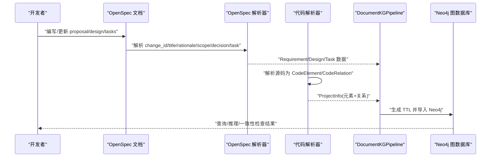
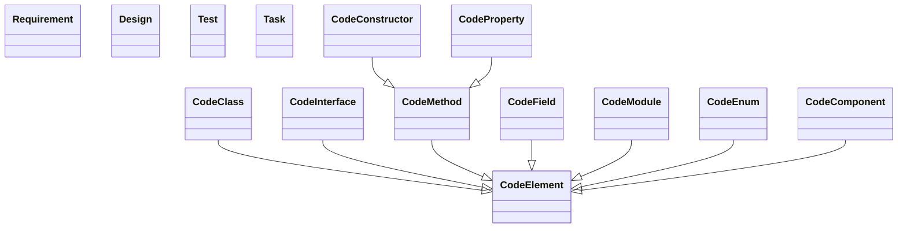
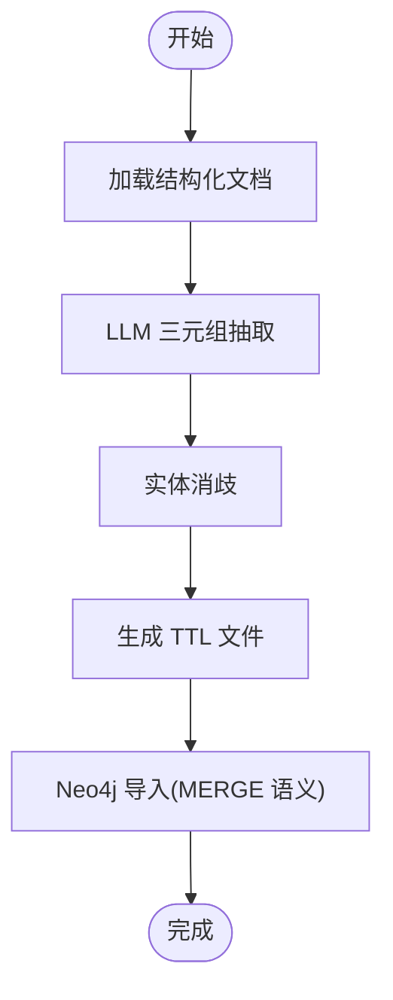
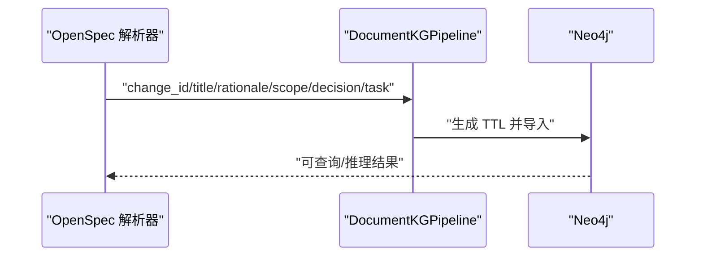
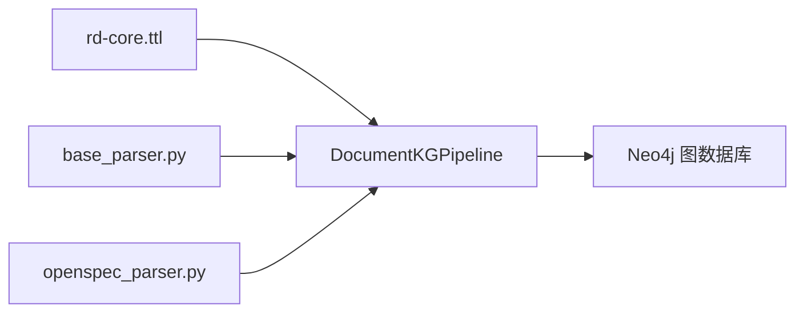

# 核心本体定义

<cite>
**本文引用的文件**
- [rd-core.ttl](file://rd_ontology/rd-core.ttl)
- [base_parser.py](file://code_processor/base_parser.py)
- [openspec_parser.py](file://sdd_integration/openspec_parser.py)
- [README.md](file://README.md)
- [code-ontology-technical.md](file://docs/code-ontology-technical.md)
- [2026-02-02-code-ontology-pipeline-design.md](file://docs/plans/2026-02-02-code-ontology-pipeline-design.md)
- [test_ttl_generator.py](file://tests/test_ttl_generator.py)
- [README.md](file://plugins/ontology-devos/README.md)
</cite>

## 目录
1. [简介](#简介)
2. [项目结构](#项目结构)
3. [核心组件](#核心组件)
4. [架构总览](#架构总览)
5. [详细组件分析](#详细组件分析)
6. [依赖关系分析](#依赖关系分析)
7. [性能考量](#性能考量)
8. [故障排查指南](#故障排查指南)
9. [结论](#结论)
10. [附录](#附录)

## 简介
本文件系统化阐述核心本体定义，聚焦于 rd-core.ttl 的实体分类、关系定义与约束规则，并结合代码元素、需求、设计、测试、任务等核心概念的本体表示，解释类层次结构、属性定义与数据类型规范，覆盖本体的语义规则、推理能力与一致性检查方法，提供查询示例、关系映射与扩展指南，并给出本体维护策略、版本管理与与其他本体的集成方案。

**重要更新**：根据架构重构，R&D 本体现已主要提供模式定义，TTL 生成逻辑已移至 ontology 项目，形成"模式定义层 + 生成执行层"的分离架构。

## 项目结构
本体与代码处理链路经过架构重构，现分为三层：
- **模式定义层**：rd-core.ttl 定义类、属性与关系的本体结构
- **代码解析层**：base_parser.py 定义统一的代码元素与关系抽象
- **生成执行层**：由 ontology 项目负责 TTL 生成与 Neo4j 导入

```mermaid
graph TB
subgraph "模式定义层"
CORE["rd-core.ttl<br/>类/属性/关系定义"]
END
subgraph "代码解析层"
BP["base_parser.py<br/>ElementType/RelationType/CodeElement/CodeRelation"]
END
subgraph "生成执行层"
GEN["ontology 项目<br/>DocumentKGPipeline/TTLGenerator/Neo4jImporter"]
END
subgraph "OpenSpec 集成"
OSP["openspec_parser.py<br/>Requirement/Design/Task"]
SPEC["spec.md<br/>规范-实现一致性检查"]
END
BP --> GEN
CORE --> GEN
OSP --> GEN
SPEC --> GEN
```

**图表来源**
- [rd-core.ttl](file://rd_ontology/rd-core.ttl#L1-L294)
- [base_parser.py](file://code_processor/base_parser.py#L26-L80)
- [2026-02-02-code-ontology-pipeline-design.md](file://docs/plans/2026-02-02-code-ontology-pipeline-design.md#L33-L79)
- [code-ontology-technical.md](file://docs/code-ontology-technical.md#L55-L59)

**章节来源**
- [README.md](file://README.md#L71-L92)
- [code-ontology-technical.md](file://docs/code-ontology-technical.md#L55-L59)

## 核心组件
- **类层次与实体域**：Requirement、Design、CodeElement 及其子类 CodeClass、CodeInterface、CodeMethod、CodeField、CodeModule、CodeEnum、CodeConstructor、CodeProperty、CodeComponent；Task
- **关系属性**：对象属性如 implementsRequirement、realizesDesign、testsCode、validatesRequirement、inherits、implements、extends、calls、dependsOn、contains、imports、overrides、decorates、uses、affectsFile、belongsToRequirement；数据属性如 fullName、filePath、lineNumber、language、package、modifier、annotation、docstring、returnType、parameterName、parameterType、rationale、scope、decision、changeId、confidence、linkMethod
- **代码元素与关系抽象**：ElementType、RelationType、CodeElement、CodeRelation、ProjectInfo
- **架构重构后的生成流程**：由 ontology 项目的 DocumentKGPipeline 负责完整的 TTL 生成与 Neo4j 导入

**章节来源**
- [rd-core.ttl](file://rd_ontology/rd-core.ttl#L17-L35)
- [rd-core.ttl](file://rd_ontology/rd-core.ttl#L41-L84)
- [rd-core.ttl](file://rd_ontology/rd-core.ttl#L91-L187)
- [rd-core.ttl](file://rd_ontology/rd-core.ttl#L193-L293)
- [base_parser.py](file://code_processor/base_parser.py#L26-L80)
- [code-ontology-technical.md](file://docs/code-ontology-technical.md#L55-L59)

## 架构总览
架构重构后，本体架构以"模式定义 + 流水线执行"为主线，通过 OpenSpec 文档抽取需求与设计，结合代码解析器生成的结构化数据，最终由 ontology 项目的流水线完成 TTL 生成与 Neo4j 导入，支撑后续推理与一致性检查。



**图表来源**
- [openspec_parser.py](file://sdd_integration/openspec_parser.py#L51-L86)
- [2026-02-02-code-ontology-pipeline-design.md](file://docs/plans/2026-02-02-code-ontology-pipeline-design.md#L81-L112)
- [code-ontology-technical.md](file://docs/code-ontology-technical.md#L11-L20)

## 详细组件分析

### 类层次结构与本体表示
- **抽象实体类**：Requirement、Design、CodeElement、Test、Task
- **代码结构类**：CodeClass、CodeInterface、CodeMethod、CodeField、CodeModule、CodeEnum、CodeConstructor、CodeProperty、CodeComponent
- **继承关系**：各代码结构类均继承自 CodeElement；CodeConstructor 与 CodeProperty 继承自 CodeMethod



**图表来源**
- [rd-core.ttl](file://rd_ontology/rd-core.ttl#L17-L84)

**章节来源**
- [rd-core.ttl](file://rd_ontology/rd-core.ttl#L17-L84)

### 属性定义与数据类型规范
- **代码元素通用属性**：fullName(string)、filePath(string)、lineNumber(integer)、language(string)、package(string)、modifier(string)、annotation(string)、docstring(string)
- **方法特有属性**：returnType(string)、parameterName(string)、parameterType(string)
- **需求/设计属性**：rationale(string)、scope(string)、decision(string)
- **元数据属性**：changeId(string)、confidence(decimal)、linkMethod(string)

**章节来源**
- [rd-core.ttl](file://rd_ontology/rd-core.ttl#L193-L293)

### 关系定义与约束规则
- **需求-代码关系**：implementsRequirement(域 CodeElement，范围 Requirement)、validatesRequirement(域 Test，范围 Requirement)
- **设计-代码关系**：realizesDesign(域 CodeElement，范围 Design)
- **代码结构关系**：inherits(域 CodeClass，范围 CodeClass)、implements(域 CodeClass，范围 CodeInterface)、extends/contains/imports/dependsOn/uses(域 CodeElement，范围 CodeElement)、calls(域 CodeMethod，范围 CodeMethod)、overrides(域 CodeMethod，范围 CodeMethod)、decorates(域 CodeElement，范围 CodeElement)
- **任务关系**：affectsFile(域 Task，范围 CodeElement)、belongsToRequirement(域 Task，范围 Requirement)

**章节来源**
- [rd-core.ttl](file://rd_ontology/rd-core.ttl#L91-L187)

### 架构重构后的生成流程
**重要更新**：TTL 生成逻辑已完全移至 ontology 项目的 DocumentKGPipeline，形成标准化的五阶段流水线：

1. **文档解析**：DocumentAdapter 加载结构化文档
2. **三元组抽取**：LLMTripletPlugin 使用 LLM 提取实体和关系
3. **实体消歧**：EntityResolver 确保实体唯一性
4. **TTL 生成**：TTLGenerator 生成标准 TTL 文件
5. **Neo4j 导入**：Neo4jImporter 使用 MERGE 语义导入图数据库



**图表来源**
- [2026-02-02-code-ontology-pipeline-design.md](file://docs/plans/2026-02-02-code-ontology-pipeline-design.md#L102-L112)
- [code-ontology-technical.md](file://docs/code-ontology-technical.md#L11-L20)

**章节来源**
- [code-ontology-technical.md](file://docs/code-ontology-technical.md#L55-L59)
- [2026-02-02-code-ontology-pipeline-design.md](file://docs/plans/2026-02-02-code-ontology-pipeline-design.md#L33-L79)

### OpenSpec 集成与一致性检查
- **OpenSpec 解析**：从 proposal.md、design.md、tasks.md 中抽取 Requirement、Design、Task 结构化数据
- **SDD 链接策略**：使用双向锚点 + 语义匹配，通过 `element_id` 和 `change_id` 建立链接
- **一致性检查**：规范-实现一致性检查场景要求在任务完成后对照规范审查代码，报告差异



**图表来源**
- [openspec_parser.py](file://sdd_integration/openspec_parser.py#L51-L86)
- [2026-02-02-code-ontology-pipeline-design.md](file://docs/plans/2026-02-02-code-ontology-pipeline-design.md#L335-L357)

**章节来源**
- [openspec_parser.py](file://sdd_integration/openspec_parser.py#L51-L197)
- [2026-02-02-code-ontology-pipeline-design.md](file://docs/plans/2026-02-02-code-ontology-pipeline-design.md#L325-L357)

## 依赖关系分析
**架构重构后的依赖关系**：
- **模式定义层**：rd-core.ttl 作为单一权威来源，定义所有类与属性的 IRI 命名空间
- **代码解析层**：base_parser.py 提供统一的数据结构，便于下游流水线处理
- **生成执行层**：由 ontology 项目的 DocumentKGPipeline 完成 TTL 生成与导入
- **OpenSpec 集成**：openspec_parser.py 提供需求/设计/任务结构化数据



**图表来源**
- [rd-core.ttl](file://rd_ontology/rd-core.ttl#L1-L294)
- [base_parser.py](file://code_processor/base_parser.py#L26-L80)
- [2026-02-02-code-ontology-pipeline-design.md](file://docs/plans/2026-02-02-code-ontology-pipeline-design.md#L33-L79)

**章节来源**
- [2026-02-02-code-ontology-pipeline-design.md](file://docs/plans/2026-02-02-code-ontology-pipeline-design.md#L33-L79)
- [base_parser.py](file://code_processor/base_parser.py#L26-L80)
- [openspec_parser.py](file://sdd_integration/openspec_parser.py#L51-L86)

## 性能考量
**架构重构带来的性能优化**：
- **流水线并行化**：DocumentKGPipeline 的五阶段流水线支持并行处理
- **增量构建**：支持增量构建，减少重复计算开销
- **缓存机制**：LLM 调用结果缓存，降低构建成本
- **批量导入**：Neo4jImporter 使用 MERGE 语义进行批量导入，提升导入效率

**章节来源**
- [2026-02-02-code-ontology-pipeline-design.md](file://docs/plans/2026-02-02-code-ontology-pipeline-design.md#L398-L406)
- [code-ontology-technical.md](file://docs/code-ontology-technical.md#L11-L20)

## 故障排查指南
**架构重构后的故障排查**：
- **模式定义问题**：检查 rd-core.ttl 中类与属性的 IRI 命名空间是否正确
- **流水线执行失败**：检查 ontology 项目的 DocumentKGPipeline 配置与依赖
- **Neo4j 导入错误**：验证 TTL 文件格式与 Neo4j 连接参数
- **OpenSpec 解析错误**：检查 proposal.md、design.md、tasks.md 的格式与字段提取正则表达式
- **SDD 链接不通过**：对照规范文档的场景与实现，逐项比对需求与代码元素的映射关系

**章节来源**
- [test_ttl_generator.py](file://tests/test_ttl_generator.py#L15-L103)
- [openspec_parser.py](file://sdd_integration/openspec_parser.py#L88-L197)
- [README.md](file://plugins/ontology-devos/README.md#L125-L144)

## 结论
本体经过架构重构后，形成了"模式定义 + 流水线执行"的清晰分离架构。R&D 本体专注于提供权威的模式定义，而 TTL 生成与导入工作交由 ontology 项目的成熟流水线完成。这种设计提升了系统的可维护性、可扩展性和性能表现，同时保持了与 OpenSpec 集成和 SDD 工作流的无缝衔接。建议在实际使用中充分利用流水线的并行化能力和缓存机制，持续优化构建性能和查询体验。

## 附录

### 本体查询示例（路径指引）
- 查询某模块下的所有类与方法
  - 示例路径：[rd-core.ttl](file://rd_ontology/rd-core.ttl#L41-L84)
- 查询某需求相关的代码实现
  - 示例路径：[rd-core.ttl](file://rd_ontology/rd-core.ttl#L91-L113)
- 查询某测试覆盖的代码元素
  - 示例路径：[rd-core.ttl](file://rd_ontology/rd-core.ttl#L103-L113)
- 查询继承关系
  - 示例路径：[rd-core.ttl](file://rd_ontology/rd-core.ttl#L116-L126)
- 查询模块导入关系
  - 示例路径：[rd-core.ttl](file://rd_ontology/rd-core.ttl#L152-L156)

### 关系映射参考（路径指引）
- 元素类型到 TTL 类名映射
  - 示例路径：[base_parser.py](file://code_processor/base_parser.py#L26-L52)
- 关系类型到 TTL 属性映射
  - 示例路径：[base_parser.py](file://code_processor/base_parser.py#L54-L80)

### 扩展指南
- **新增代码元素类型**：在 ElementType 中添加枚举值，并在 rd-core.ttl 中定义对应的类
- **新增关系类型**：在 RelationType 中添加枚举值，并在 rd-core.ttl 中定义对应的关系属性
- **新增属性**：在 rd-core.ttl 中定义 DatatypeProperty，并在下游流水线中处理对应字段
- **新增推理规则**：在本体中补充 OWL 约束（如反自反、对称性、传递性等），并在推理引擎中启用相应规则

**章节来源**
- [base_parser.py](file://code_processor/base_parser.py#L26-L80)
- [rd-core.ttl](file://rd_ontology/rd-core.ttl#L193-L293)

### 维护策略与版本管理
- **版本控制**：采用语义化版本管理，主版本号变更时引入破坏性修改；次版本号变更时新增属性或关系；修订版本号变更时修复错误
- **向后兼容**：新增属性或关系时保持默认值与空值处理，避免破坏既有推理
- **变更记录**：在 rd-core.ttl 中记录重要变更与迁移指南，便于升级与回溯
- **流水线兼容性**：确保模式定义变更不影响现有流水线的稳定性

### 与其他本体的集成方案
- **术语对齐**：与现有软件工程本体（如 SWEO、SWEET）对齐术语与关系，确保互操作性
- **数据交换**：通过 TTL/JSON-LD 等格式进行数据交换，保持命名空间与 IRI 的稳定性
- **推理增强**：引入 OWL DL 推理器（如 HermiT、Pellet）进行一致性检查与语义推理，确保本体的闭包与单调性
- **流水线集成**：通过标准化的 TTL 格式与 Neo4j 导入接口，与其他本体项目实现无缝集成

**章节来源**
- [code-ontology-technical.md](file://docs/code-ontology-technical.md#L55-L59)
- [2026-02-02-code-ontology-pipeline-design.md](file://docs/plans/2026-02-02-code-ontology-pipeline-design.md#L415-L420)