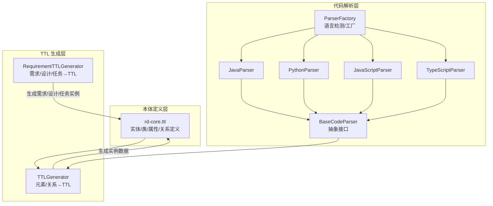
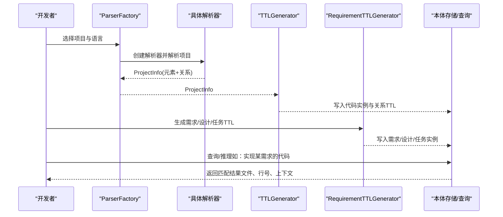
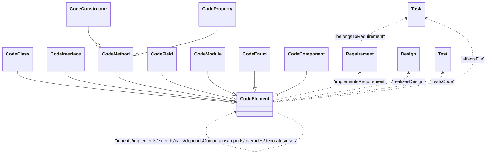
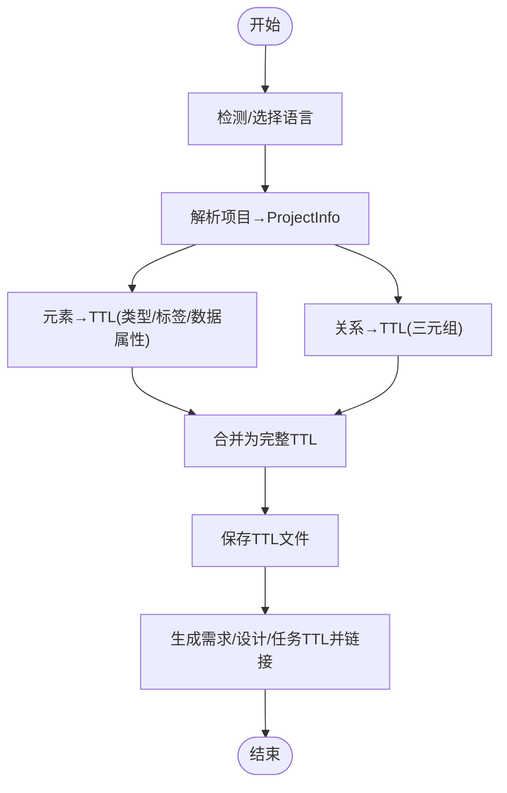
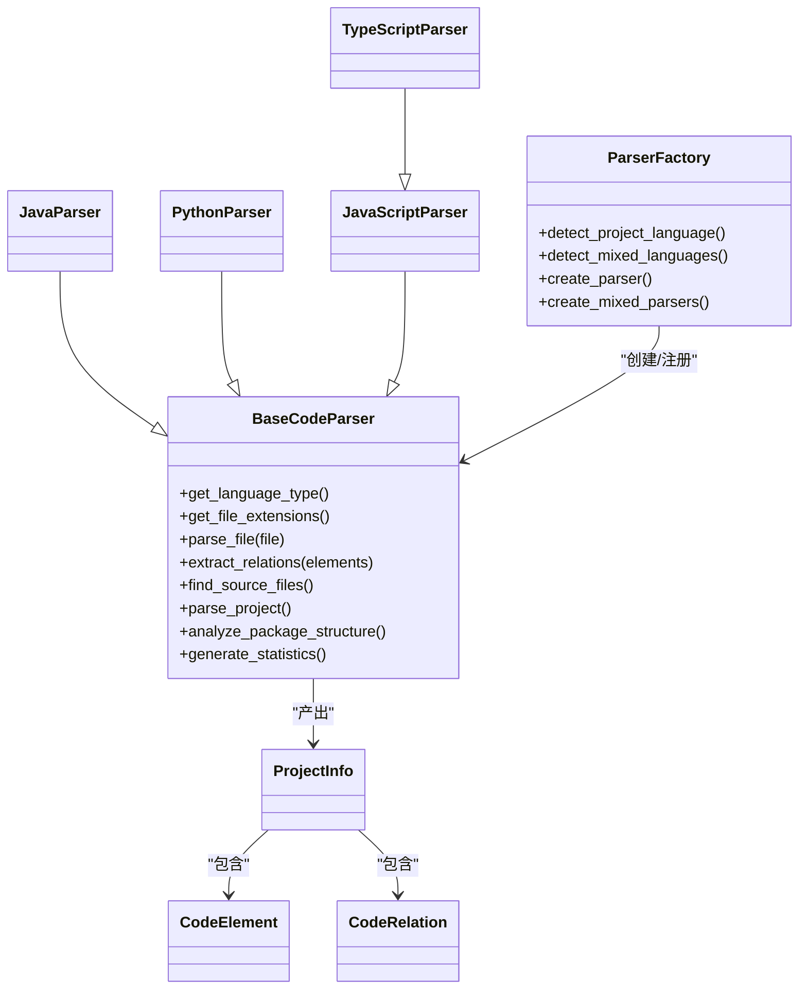
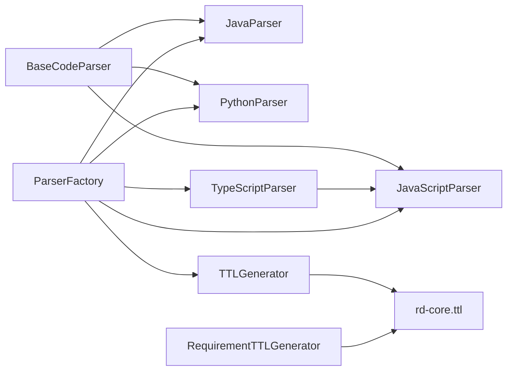

# 研究与发展本体

<cite>
**本文引用的文件**   
- [rd-core.ttl](file://rd_ontology/rd-core.ttl)
- [ttl_generator.py](file://rd_ontology/ttl_generator.py)
- [base_parser.py](file://code_processor/base_parser.py)
- [parser_factory.py](file://code_processor/parser_factory.py)
- [java_parser.py](file://code_processor/java_parser.py)
- [python_parser.py](file://code_processor/python_parser.py)
- [javascript_parser.py](file://code_processor/javascript_parser.py)
- [test_ttl_generator.py](file://tests/test_ttl_generator.py)
- [test_code_processor.py](file://tests/test_code_processor.py)
- [settings.json](file://settings.json)
- [spec.md](file://openspec/changes/add-code-ontology-capability/specs/code-ontology/spec.md)
- [sdd.md](file://docs/sdd.md)
- [CLAUDE.md](file://CLAUDE.md)
</cite>

## 目录
1. [引言](#引言)
2. [项目结构](#项目结构)
3. [核心组件](#核心组件)
4. [架构总览](#架构总览)
5. [详细组件分析](#详细组件分析)
6. [依赖分析](#依赖分析)
7. [性能考量](#性能考量)
8. [故障排查指南](#故障排查指南)
9. [结论](#结论)
10. [附录](#附录)

## 引言
本文件面向“研究与发展本体”（R&D Ontology）项目，系统化阐述本体结构、代码解析与 TTL 生成器的工作原理、本体构建流程、语义表示与关系推理、知识图谱构建方法，以及扩展、版本与维护策略。文档同时提供实际使用案例、查询示例与集成方案，帮助读者将本体系统应用于代码理解与智能分析。

## 项目结构
本项目围绕“代码本体”展开，核心由三层组成：
- 本体定义层：rd-core.ttl 定义实体、类与属性、关系的本体结构与命名空间。
- 代码解析层：多语言解析器（Java、Python、JavaScript/TypeScript）与工厂，负责抽取代码元素与关系。
- TTL 生成层：将解析结果映射为 TTL（RDF Turtle）三元组，形成实例数据与链接。

图表来源
- [rd-core.ttl](file://rd_ontology/rd-core.ttl#L1-L294)
- [ttl_generator.py](file://rd_ontology/ttl_generator.py#L18-L321)
- [base_parser.py](file://code_processor/base_parser.py#L206-L358)
- [parser_factory.py](file://code_processor/parser_factory.py#L20-L248)
- [java_parser.py](file://code_processor/java_parser.py#L39-L425)
- [python_parser.py](file://code_processor/python_parser.py#L22-L455)
- [javascript_parser.py](file://code_processor/javascript_parser.py#L22-L548)

章节来源
- [rd-core.ttl](file://rd_ontology/rd-core.ttl#L1-L294)
- [ttl_generator.py](file://rd_ontology/ttl_generator.py#L18-L321)
- [base_parser.py](file://code_processor/base_parser.py#L206-L358)
- [parser_factory.py](file://code_processor/parser_factory.py#L20-L248)

## 核心组件
- 本体核心（rd-core.ttl）
  - 定义实体层：Requirement、Design、CodeElement、Test、Task。
  - 定义类层：CodeClass、CodeInterface、CodeMethod、CodeField、CodeModule、CodeEnum、CodeConstructor、CodeProperty、CodeComponent 等，继承自 CodeElement。
  - 定义对象属性：implementsRequirement、realizesDesign、testsCode、inherits、implements、extends、calls、dependsOn、contains、imports、overrides、decorates、uses 等。
  - 定义数据属性：fullName、filePath、lineNumber、language、package、modifier、annotation、docstring、returnType、parameterName、parameterType、rationale、scope、decision、changeId、confidence、linkMethod 等。
- TTL 生成器（ttl_generator.py）
  - TTLGenerator：将 CodeElement/CodeRelation 映射为 TTL，生成稳定 IRI、类型声明、标签与数据属性、关系三元组。
  - RequirementTTLGenerator：生成 Requirement/Design/Task 实例与链接，支持变更 ID、理由、范围、决策、任务等。
- 代码解析器与工厂（base_parser.py、parser_factory.py、java_parser.py、python_parser.py、javascript_parser.py）
  - 抽象接口：统一的 CodeElement、CodeRelation、ProjectInfo、ElementType、RelationType、LanguageType。
  - 多语言解析：Java、Python、JavaScript/TypeScript 解析器，提取元素与关系。
  - 工厂：自动检测语言、注册解析器、批量分析混合语言项目。

章节来源
- [rd-core.ttl](file://rd_ontology/rd-core.ttl#L17-L294)
- [ttl_generator.py](file://rd_ontology/ttl_generator.py#L18-L321)
- [base_parser.py](file://code_processor/base_parser.py#L82-L358)
- [parser_factory.py](file://code_processor/parser_factory.py#L20-L248)
- [java_parser.py](file://code_processor/java_parser.py#L39-L425)
- [python_parser.py](file://code_processor/python_parser.py#L22-L455)
- [javascript_parser.py](file://code_processor/javascript_parser.py#L22-L548)

## 架构总览
本体系统以“解析→映射→生成→存储/查询”为主线，形成从代码到语义图谱的闭环。

图表来源
- [parser_factory.py](file://code_processor/parser_factory.py#L123-L160)
- [ttl_generator.py](file://rd_ontology/ttl_generator.py#L176-L228)
- [rd-core.ttl](file://rd_ontology/rd-core.ttl#L1-L294)

## 详细组件分析

### 本体结构与类层次
- 实体层
  - Requirement：需求/规范，包含 changeId、rationale、scope。
  - Design：设计/架构决策，包含 changeId、decision。
  - CodeElement：抽象代码元素，作为类层次的根。
  - Test：测试用例/测试集，包含验证关系。
  - Task：开发任务，包含变更归属与影响文件。
- 类层（继承自 CodeElement）
  - CodeClass、CodeInterface、CodeMethod、CodeField、CodeModule、CodeEnum、CodeConstructor、CodeProperty、CodeComponent。
- 属性与关系
  - 数据属性：fullName、filePath、lineNumber、language、package、modifier、annotation、docstring、returnType、parameterName、parameterType、rationale、scope、decision、changeId、confidence、linkMethod。
  - 对象属性：implementsRequirement、realizesDesign、testsCode、inherits、implements、extends、calls、dependsOn、contains、imports、overrides、decorates、uses、affectsFile、belongsToRequirement。

图表来源
- [rd-core.ttl](file://rd_ontology/rd-core.ttl#L17-L294)

章节来源
- [rd-core.ttl](file://rd_ontology/rd-core.ttl#L17-L294)

### TTL 生成器工作原理
- 元素映射
  - 将 ElementType 映射到本体类名，生成稳定 IRI（SHA1(full_name|file_path|line_number) 截断），声明类型与标签，填充数据属性。
- 关系映射
  - 将 RelationType 映射到对象属性，生成三元组；对缺失元素生成占位 IRI。
- 项目生成
  - 输出带前缀的 TTL 文件，包含元素实例与关系三元组。
- 需求/设计/任务生成
  - 生成 Requirement/Design/Task 实例，支持变更 ID、理由、范围、决策、任务文本等。

图表来源
- [ttl_generator.py](file://rd_ontology/ttl_generator.py#L176-L228)
- [ttl_generator.py](file://rd_ontology/ttl_generator.py#L99-L174)
- [ttl_generator.py](file://rd_ontology/ttl_generator.py#L231-L321)

章节来源
- [ttl_generator.py](file://rd_ontology/ttl_generator.py#L18-L321)

### 代码解析器与工厂
- 抽象接口
  - CodeElement：统一的元素结构（类型、名称、全名、文件路径、行号、包、修饰符、注解、文档、参数、返回类型、父子关系等）。
  - CodeRelation：统一的关系结构（类型、源/目标、上下文、额外属性）。
  - ProjectInfo：项目信息容器（元素、关系、包统计、依赖、统计信息）。
  - ElementType/RelationType/LanguageType：枚举类型，覆盖多语言特性。
- 多语言解析器
  - JavaParser：使用 javalang 解析 AST，提取类、接口、枚举、方法、字段、导入、注解等，抽取继承/实现/导入关系。
  - PythonParser：使用 AST，提取类、函数、方法、变量、装饰器、属性、调用关系、导入关系等。
  - JavaScript/TypeScriptParser：正则与 AST 结合，提取类、函数、组件、Hook、导出、导入、调用等。
- 工厂与多语言分析
  - ParserFactory：根据项目特征与扩展名自动检测语言，注册解析器，创建解析器实例，支持混合语言项目分析。
  - MultiLanguageProjectAnalyzer：统一分析多语言项目，聚合结果并输出概览。

图表来源
- [base_parser.py](file://code_processor/base_parser.py#L206-L358)
- [parser_factory.py](file://code_processor/parser_factory.py#L20-L248)
- [java_parser.py](file://code_processor/java_parser.py#L39-L425)
- [python_parser.py](file://code_processor/python_parser.py#L22-L455)
- [javascript_parser.py](file://code_processor/javascript_parser.py#L22-L548)

章节来源
- [base_parser.py](file://code_processor/base_parser.py#L82-L358)
- [parser_factory.py](file://code_processor/parser_factory.py#L20-L248)
- [java_parser.py](file://code_processor/java_parser.py#L39-L425)
- [python_parser.py](file://code_processor/python_parser.py#L22-L455)
- [javascript_parser.py](file://code_processor/javascript_parser.py#L22-L548)

### 本体中的核心概念、类层次与属性定义
- 核心概念
  - Requirement：需求/规范，承载 changeId、rationale、scope。
  - Design：设计/架构决策，承载 changeId、decision。
  - CodeElement：代码元素抽象，派生出类、接口、方法、字段、模块、枚举、构造器、属性、组件等。
  - Test：测试，与 CodeElement 建立 testsCode 关系。
  - Task：任务，与 CodeElement 建立 affectsFile 关系，与 Requirement 建立 belongsToRequirement 关系。
- 类层次
  - CodeClass、CodeInterface、CodeMethod、CodeField、CodeModule、CodeEnum、CodeConstructor、CodeProperty、CodeComponent 继承自 CodeElement。
- 属性定义
  - 数据属性：fullName、filePath、lineNumber、language、package、modifier、annotation、docstring、returnType、parameterName、parameterType、rationale、scope、decision、changeId、confidence、linkMethod。
  - 关系属性：implementsRequirement、realizesDesign、testsCode、inherits、implements、extends、calls、dependsOn、contains、imports、overrides、decorates、uses、affectsFile、belongsToRequirement。

章节来源
- [rd-core.ttl](file://rd_ontology/rd-core.ttl#L17-L294)

### 代码本体的语义表示、关系推理与知识图谱构建
- 语义表示
  - 通过 Owl/RDFS 命名空间与类/属性声明，将代码结构与需求/设计/测试/任务映射为可推理的 RDF 图。
- 关系推理
  - 基于对象属性与数据属性，可进行“实现关系”“依赖关系”“调用关系”“导入关系”等推理。
  - 可通过 confidence 与 linkMethod 表征链接可信度与来源。
- 知识图谱构建
  - 以 CodeElement 为节点，以 inherits/implements/extends/calls/dependsOn/contains/imports/overrides/decorates/uses 为边，结合 Requirement/Design/Test/Task，形成多模态知识图谱。

章节来源
- [rd-core.ttl](file://rd_ontology/rd-core.ttl#L87-L294)

### 实际使用案例、查询示例与集成方案
- 使用案例
  - 分析多语言项目：通过 ParserFactory 自动检测语言并解析，生成 ProjectInfo，再由 TTLGenerator 输出 TTL。
  - 链接代码与需求：RequirementTTLGenerator 生成 Requirement/Design/Task 实例，通过对象属性将代码元素与需求/任务关联。
- 查询示例（概念性）
  - 查询实现某需求的代码元素：基于 implementsRequirement 关系与 Requirement.changeId。
  - 查询某文件影响的任务：基于 Task.affectsFile 与文件路径。
  - 查询某方法的调用链：基于 calls/dependsOn/contains 等关系。
- 集成方案
  - CLI：通过命令行分析项目、生成 TTL、链接需求、构建本体。
  - 工作流：与 OpenSpec 规范驱动开发流程结合，实现“提案→实现→归档”的闭环。

章节来源
- [spec.md](file://openspec/changes/add-code-ontology-capability/specs/code-ontology/spec.md#L1-L175)
- [sdd.md](file://docs/sdd.md#L1-L816)
- [CLAUDE.md](file://CLAUDE.md#L1-L440)

## 依赖分析
- 组件耦合
  - TTLGenerator 依赖 CodeElement/CodeRelation/ProjectInfo 的统一数据结构。
  - 各语言解析器依赖 BaseCodeParser 抽象，通过工厂统一调度。
  - RequirementTTLGenerator 与 TTLGenerator 共享命名空间与属性约定。
- 外部依赖
  - Java：javalang 库用于 AST 解析。
  - Python：标准 ast 库。
  - JavaScript/TypeScript：正则与 AST 结合。

图表来源
- [base_parser.py](file://code_processor/base_parser.py#L206-L358)
- [parser_factory.py](file://code_processor/parser_factory.py#L20-L248)
- [ttl_generator.py](file://rd_ontology/ttl_generator.py#L18-L321)
- [rd-core.ttl](file://rd_ontology/rd-core.ttl#L1-L294)

章节来源
- [base_parser.py](file://code_processor/base_parser.py#L206-L358)
- [parser_factory.py](file://code_processor/parser_factory.py#L20-L248)
- [ttl_generator.py](file://rd_ontology/ttl_generator.py#L18-L321)
- [rd-core.ttl](file://rd_ontology/rd-core.ttl#L1-L294)

## 性能考量
- 解析性能
  - 大型项目建议分语言并行解析，减少 IO 与内存占用。
  - 使用缓存与增量解析策略，避免重复扫描。
- TTL 生成
  - 控制字符串长度（如 docstring 截断），减少序列化体积。
  - 批量写入与压缩输出，提升 I/O 效率。
- 查询与推理
  - 建议在本体存储侧建立索引与分区，加速常用关系查询。
  - 对高频查询建立物化视图或预计算结果。

## 故障排查指南
- 解析失败
  - Java：确认已安装 javalang；若 AST 解析失败，回退基础提取逻辑。
  - Python：检查语法错误；关注 AST 访客对装饰器、属性、异步函数的处理。
  - JavaScript/TypeScript：注意正则匹配与 AST 结合的边界情况。
- TTL 生成异常
  - 检查元素 IRI 生成是否重复（稳定 ID 依赖 full_name、file_path、line_number）。
  - 确认关系映射表（RELATION_TYPE_MAP）与 ElementType/RelationType 一致。
- 集成问题
  - 确认命名空间与前缀一致，避免 IRI 冲突。
  - 检查 settings.json 中的权限与钩子配置，确保工具链可用。

章节来源
- [java_parser.py](file://code_processor/java_parser.py#L13-L45)
- [python_parser.py](file://code_processor/python_parser.py#L37-L63)
- [javascript_parser.py](file://code_processor/javascript_parser.py#L38-L64)
- [ttl_generator.py](file://rd_ontology/ttl_generator.py#L65-L98)
- [settings.json](file://settings.json#L1-L37)

## 结论
本体系统通过清晰的三层架构，实现了从多语言代码到语义图谱的自动化转换。rd-core.ttl 提供稳定的本体结构，解析器与工厂确保跨语言一致性，TTL 生成器将结构化数据映射为可推理的 RDF。结合 OpenSpec 与 SDD 工作流，本体系统可显著提升代码理解、需求追踪与智能分析能力。

## 附录
- 版本与维护策略
  - 本体版本：以 changeId 与命名空间版本化，确保链接稳定性。
  - 扩展指南：新增语言解析器需实现 BaseCodeParser 接口并注册到工厂；新增关系需在本体中定义属性并在映射表中注册。
  - 测试：通过单元测试覆盖解析、映射与 TTL 生成的关键路径。
- 配置与工具
  - settings.json：控制权限与钩子，确保工具链与工作流顺畅。
  - OpenSpec 与 SDD：规范驱动的开发流程，与本体系统协同提升交付质量。

章节来源
- [spec.md](file://openspec/changes/add-code-ontology-capability/specs/code-ontology/spec.md#L1-L175)
- [sdd.md](file://docs/sdd.md#L1-L816)
- [CLAUDE.md](file://CLAUDE.md#L1-L440)
- [settings.json](file://settings.json#L1-L37)