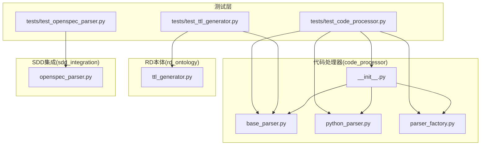
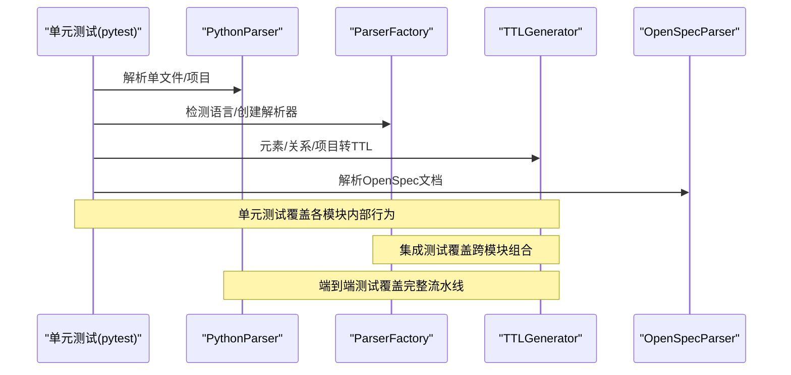
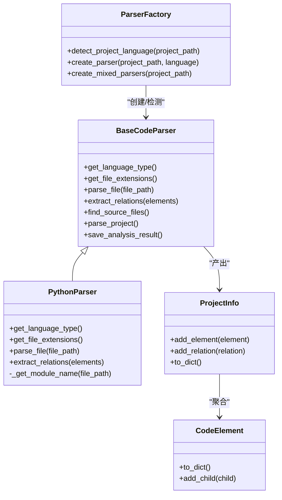
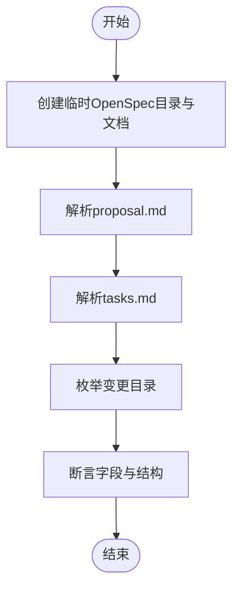
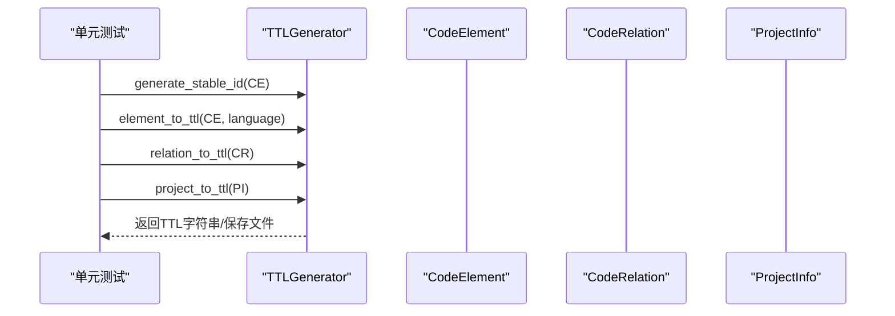
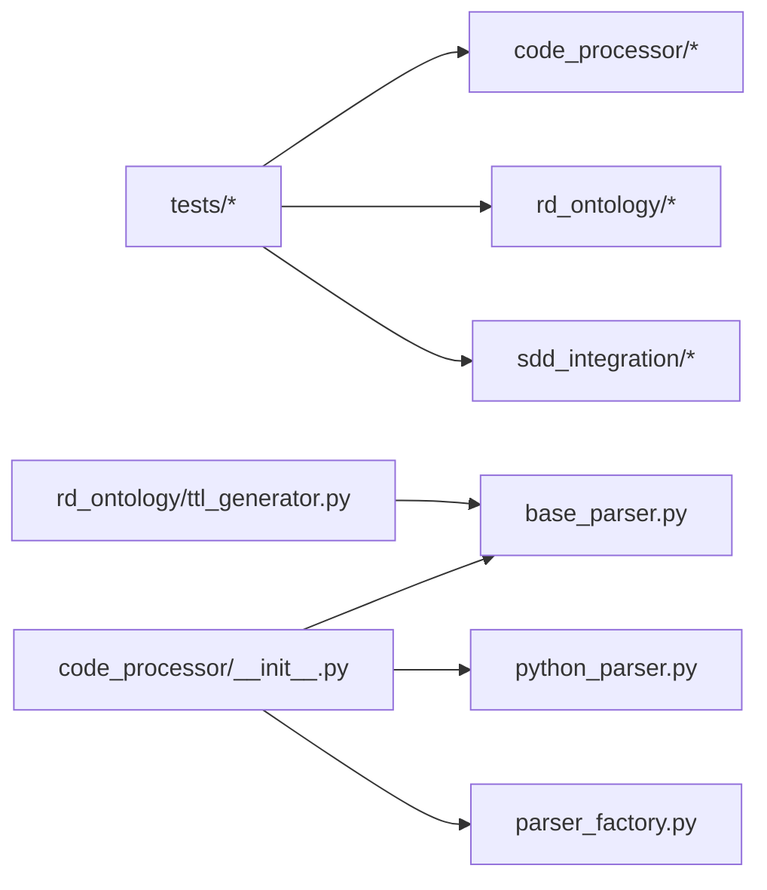

# 测试与验证

<cite>
**本文引用的文件**
- [tests/test_code_processor.py](file://tests/test_code_processor.py)
- [tests/test_openspec_parser.py](file://tests/test_openspec_parser.py)
- [tests/test_ttl_generator.py](file://tests/test_ttl_generator.py)
- [code_processor/__init__.py](file://code_processor/__init__.py)
- [code_processor/base_parser.py](file://code_processor/base_parser.py)
- [code_processor/python_parser.py](file://code_processor/python_parser.py)
- [code_processor/parser_factory.py](file://code_processor/parser_factory.py)
- [rd_ontology/ttl_generator.py](file://rd_ontology/ttl_generator.py)
- [sdd_integration/openspec_parser.py](file://sdd_integration/openspec_parser.py)
- [global/codex-skills/writing-skills/testing-skills-with-subagents.md](file://global/codex-skills/writing-skills/testing-skills-with-subagents.md)
- [global/codex-skills/test-driven-development/testing-anti-patterns.md](file://global/codex-skills/test-driven-development/testing-anti-patterns.md)
- [global/codex-skills/systematic-debugging/test-pressure-1.md](file://global/codex-skills/systematic-debugging/test-pressure-1.md)
- [global/codex-skills/systematic-debugging/test-pressure-2.md](file://global/codex-skills/systematic-debugging/test-pressure-2.md)
- [settings.json](file://settings.json)
- [README.md](file://README.md)
</cite>

## 目录
1. [引言](#引言)
2. [项目结构](#项目结构)
3. [核心组件](#核心组件)
4. [架构总览](#架构总览)
5. [详细组件分析](#详细组件分析)
6. [依赖关系分析](#依赖关系分析)
7. [性能考虑](#性能考虑)
8. [故障排除指南](#故障排除指南)
9. [结论](#结论)
10. [附录](#附录)

## 引言
本文件面向“测试与验证”主题，围绕代码处理器、OpenSpec 解析器与 TTL 本体生成器三个核心模块，系统阐述单元测试、集成测试与端到端测试的策略与实现；给出测试用例设计、覆盖率要求与质量标准；说明测试数据准备、模拟环境搭建与测试结果分析；并结合项目内“压力测试”“测试驱动开发反模式”等知识资产，总结持续集成、自动化测试与回归测试的最佳实践，提供故障排除与性能基准方法，帮助构建完善的测试体系以确保系统的稳定性与可靠性。

## 项目结构
本项目采用按功能域划分的模块化组织方式，测试用例集中于 tests 目录，核心业务逻辑分布在 code_processor、rd_ontology、sdd_integration 等子包中，并辅以全局技能与测试方法论文档，形成“代码-测试-流程”的闭环。

图表来源
- [tests/test_code_processor.py](file://tests/test_code_processor.py#L1-L139)
- [tests/test_openspec_parser.py](file://tests/test_openspec_parser.py#L1-L97)
- [tests/test_ttl_generator.py](file://tests/test_ttl_generator.py#L1-L103)
- [code_processor/__init__.py](file://code_processor/__init__.py#L1-L40)
- [code_processor/base_parser.py](file://code_processor/base_parser.py#L1-L358)
- [code_processor/python_parser.py](file://code_processor/python_parser.py#L1-L455)
- [code_processor/parser_factory.py](file://code_processor/parser_factory.py#L1-L248)
- [rd_ontology/ttl_generator.py](file://rd_ontology/ttl_generator.py#L1-L321)
- [sdd_integration/openspec_parser.py](file://sdd_integration/openspec_parser.py#L1-L249)

章节来源
- [README.md](file://README.md#L71-L92)
- [code_processor/__init__.py](file://code_processor/__init__.py#L1-L40)

## 核心组件
- 代码处理器(code_processor)
  - 统一抽象基类与数据模型：语言类型、元素类型、关系类型、代码元素、关系、项目信息。
  - 多语言解析器工厂：自动识别项目语言、创建对应解析器、混合语言项目分析。
  - Python 解析器：基于 AST 的类、函数、变量、导入、装饰器、调用关系抽取。
- OpenSpec 解析器(sdd_integration)
  - 解析 proposal.md、design.md、tasks.md，提取需求、设计与任务清单。
- RD 本体生成器(rd_ontology)
  - 将代码元素与关系转换为 TTL（RDF/Turtle），支持稳定 ID、IRI 生成与前缀声明。

章节来源
- [code_processor/base_parser.py](file://code_processor/base_parser.py#L17-L358)
- [code_processor/parser_factory.py](file://code_processor/parser_factory.py#L20-L248)
- [code_processor/python_parser.py](file://code_processor/python_parser.py#L22-L455)
- [sdd_integration/openspec_parser.py](file://sdd_integration/openspec_parser.py#L51-L249)
- [rd_ontology/ttl_generator.py](file://rd_ontology/ttl_generator.py#L18-L321)

## 架构总览
下图展示了从“测试用例”到“被测模块”的调用链路与职责边界，体现单元测试、集成测试与端到端测试在不同层次上的协同。

图表来源
- [tests/test_code_processor.py](file://tests/test_code_processor.py#L17-L135)
- [tests/test_ttl_generator.py](file://tests/test_ttl_generator.py#L12-L100)
- [tests/test_openspec_parser.py](file://tests/test_openspec_parser.py#L12-L93)
- [code_processor/python_parser.py](file://code_processor/python_parser.py#L37-L63)
- [code_processor/parser_factory.py](file://code_processor/parser_factory.py#L122-L140)
- [rd_ontology/ttl_generator.py](file://rd_ontology/ttl_generator.py#L99-L228)
- [sdd_integration/openspec_parser.py](file://sdd_integration/openspec_parser.py#L88-L197)

## 详细组件分析

### 代码处理器模块测试策略
- 单元测试
  - Python 解析器：针对类、函数、导入等典型语法节点进行解析断言，覆盖同步/异步函数、装饰器、属性、字段等特性。
  - 解析器工厂：检测项目语言类型、创建解析器实例、混合语言项目分析。
  - 数据模型：CodeElement 的字典序列化、父子关系添加。
- 集成测试
  - 以临时目录构造多文件场景，验证 find_source_files、parse_project、统计与包结构分析。
  - 多语言混合项目：分别解析 Java/Python/JS/TS 并合并结果。
- 端到端测试
  - 从源码到 TTL 的完整链路：解析 -> 关系抽取 -> TTL 输出，校验前缀、实例与三元组完整性。

图表来源
- [code_processor/base_parser.py](file://code_processor/base_parser.py#L206-L358)
- [code_processor/python_parser.py](file://code_processor/python_parser.py#L22-L147)
- [code_processor/parser_factory.py](file://code_processor/parser_factory.py#L48-L171)
- [code_processor/base_parser.py](file://code_processor/base_parser.py#L82-L204)

章节来源
- [tests/test_code_processor.py](file://tests/test_code_processor.py#L17-L135)
- [code_processor/python_parser.py](file://code_processor/python_parser.py#L37-L135)
- [code_processor/parser_factory.py](file://code_processor/parser_factory.py#L122-L171)
- [code_processor/base_parser.py](file://code_processor/base_parser.py#L263-L298)

### OpenSpec 解析器测试策略
- 单元测试
  - proposal.md：标题、动机、范围、影响、破坏性变更等字段解析。
  - tasks.md：阶段、任务项、完成状态、文件路径提取。
  - changes 列表：过滤归档目录，仅列出有效变更。
- 集成测试
  - 整合 OpenSpecParser 与 TTL 生成器，验证 requirement/design/task 到 TTL 的映射。
- 端到端测试
  - 从 openspec 文档到 TTL 实例文件，校验命名空间、标签与属性一致性。

图表来源
- [tests/test_openspec_parser.py](file://tests/test_openspec_parser.py#L15-L93)
- [sdd_integration/openspec_parser.py](file://sdd_integration/openspec_parser.py#L57-L249)

章节来源
- [tests/test_openspec_parser.py](file://tests/test_openspec_parser.py#L12-L93)
- [sdd_integration/openspec_parser.py](file://sdd_integration/openspec_parser.py#L88-L197)

### RD 本体生成器测试策略
- 单元测试
  - 稳定 ID 生成：同一元素重复生成一致 ID，长度符合预期。
  - 元素/关系/项目到 TTL：校验类名映射、属性转义、IRI 生成、三元组格式。
- 集成测试
  - 结合 CodeElement/CodeRelation/ProjectInfo，验证 TTL 文件头、注释与内容块。
- 端到端测试
  - 从解析结果到 TTL 文件输出，校验前缀声明与实例/关系三元组。

图表来源
- [tests/test_ttl_generator.py](file://tests/test_ttl_generator.py#L15-L100)
- [rd_ontology/ttl_generator.py](file://rd_ontology/ttl_generator.py#L65-L228)

章节来源
- [tests/test_ttl_generator.py](file://tests/test_ttl_generator.py#L12-L100)
- [rd_ontology/ttl_generator.py](file://rd_ontology/ttl_generator.py#L99-L228)

## 依赖关系分析
- 模块耦合
  - tests 依赖具体实现类（如 PythonParser、ParserFactory、TTLGenerator、OpenSpecParser）。
  - code_processor 通过 __init__.py 暴露统一接口，降低上层对具体实现的耦合。
  - rd_ontology 依赖 code_processor 的数据模型，保持低耦合高内聚。
- 外部依赖
  - pytest 作为测试运行器；logging 用于日志记录；json 用于结果持久化。
- 循环依赖
  - 当前结构未见循环导入；若后续扩展，应避免模块间相互 import。

图表来源
- [code_processor/__init__.py](file://code_processor/__init__.py#L11-L39)
- [tests/test_code_processor.py](file://tests/test_code_processor.py#L10-L13)
- [tests/test_ttl_generator.py](file://tests/test_ttl_generator.py#L8-L9)
- [tests/test_openspec_parser.py](file://tests/test_openspec_parser.py#L9-L9)

章节来源
- [code_processor/__init__.py](file://code_processor/__init__.py#L11-L39)

## 性能考虑
- 解析性能
  - Python AST 解析在大型项目中可能成为瓶颈，建议：
    - 分批处理文件，限制并发度；
    - 对大文件进行预过滤（如跳过二进制或无关目录）；
    - 缓存中间结果（如模块名映射、导入表）。
- TTL 生成性能
  - 字符串转义与 IRI 生成为 CPU 密集操作，建议：
    - 批量写入文件而非逐条拼接；
    - 使用内存缓冲（如 io.StringIO）减少 I/O 次数。
- 测试执行性能
  - 使用 pytest-xdist 并行执行测试用例；
  - 通过标记（markers）隔离长耗时测试，按需运行。

[本节为通用指导，不直接分析具体文件]

## 故障排除指南
- 测试失败常见原因
  - 语法错误：Python 文件存在语法异常导致解析器返回空列表，需在测试中捕获并断言。
  - 文件路径问题：相对路径与项目根路径不一致，需使用临时目录与绝对路径。
  - 依赖缺失：缺少特定语言的依赖（如某些第三方库），需在 CI 中预装。
- 日志定位
  - 模块内广泛使用 logging，可通过日志级别与上下文定位问题。
- 压力测试与反模式
  - 参考“测试技能与子代理”与“测试反模式”，避免测试 mock 行为、添加测试专用方法、过度 mock 等陷阱。
  - 在紧急生产修复、沉没成本与疲劳等压力情境下，验证系统是否仍遵循既定流程。

章节来源
- [code_processor/python_parser.py](file://code_processor/python_parser.py#L57-L62)
- [global/codex-skills/writing-skills/testing-skills-with-subagents.md](file://global/codex-skills/writing-skills/testing-skills-with-subagents.md#L332-L357)
- [global/codex-skills/test-driven-development/testing-anti-patterns.md](file://global/codex-skills/test-driven-development/testing-anti-patterns.md#L15-L20)

## 结论
本测试体系以 pytest 为核心，覆盖单元、集成与端到端三层测试，结合 OpenSpec 文档与 RD 本体生成的完整链路，确保从代码到 TTL 的一致性与正确性。配合“压力测试”“测试反模式”等方法论，可有效提升测试质量与系统鲁棒性。建议在 CI 中引入覆盖率统计、并行执行与回归测试，持续优化测试效率与稳定性。

[本节为总结性内容，不直接分析具体文件]

## 附录

### 测试用例设计与质量标准
- 单元测试
  - 覆盖率：核心解析与映射逻辑达到较高覆盖率（建议 >80%）。
  - 断言点：解析结果字段、关系抽取、TTL 三元组结构。
- 集成测试
  - 场景：多文件、多模块、混合语言项目；断言统计与包结构。
- 端到端测试
  - 场景：从源码到 TTL 的完整流水线；断言前缀、实例与关系三元组。
- 质量标准
  - 无悬挂依赖、无循环导入；
  - 日志可追溯、错误信息明确；
  - 测试失败可快速定位到具体模块与输入。

章节来源
- [tests/test_code_processor.py](file://tests/test_code_processor.py#L17-L135)
- [tests/test_ttl_generator.py](file://tests/test_ttl_generator.py#L12-L100)
- [tests/test_openspec_parser.py](file://tests/test_openspec_parser.py#L12-L93)

### 持续集成与自动化测试最佳实践
- CI 配置要点
  - 安装依赖：确保 Python 与必要工具可用；
  - 并行执行：pytest-xdist 提升吞吐；
  - 覆盖率：使用 pytest-cov 生成报告；
  - 回归测试：固定套件在主干分支强制通过。
- 回归测试
  - 将关键端到端测试纳入每日流水线；
  - 对 OpenSpec 与 TTL 生成的关键路径增加回归用例。

章节来源
- [settings.json](file://settings.json#L1-L37)

### 性能基准测试方法
- 基准指标
  - 解析时间（秒/千行）、TTL 生成时间、内存占用峰值；
  - 测试执行时间（含并行）。
- 基准场景
  - 不同规模项目（小/中/大）与不同语言占比；
  - 大量小文件与少量大文件对比。
- 基准工具
  - 使用 pytest-benchmark 或自定义计时器；
  - 使用 memory_profiler 监控内存。

[本节为通用指导，不直接分析具体文件]