# OpenSpec 集成规范

<cite>
**本文档引用的文件**
- [openspec/specs/claudecode-openspec-integration/spec.md](file://openspec/specs/claudecode-openspec-integration/spec.md)
- [openspec/AGENTS.md](file://openspec/AGENTS.md)
- [openspec/project.md](file://openspec/project.md)
- [openspec/changes/add-code-ontology-capability/proposal.md](file://openspec/changes/add-code-ontology-capability/proposal.md)
- [openspec/changes/archive/2026-01-22-add-claudecode-openspec-workflow/proposal.md](file://openspec/changes/archive/2026-01-22-add-claudecode-openspec-workflow/proposal.md)
- [skills/openspec-workflow/SKILL.md](file://skills/openspec-workflow/SKILL.md)
- [CLAUDE.md](file://CLAUDE.md)
- [sdd_integration/openspec_parser.py](file://sdd_integration/openspec_parser.py)
- [sdd_integration/linker.py](file://sdd_integration/linker.py)
- [hooks/post-tool-use-tracker.sh](file://hooks/post-tool-use-tracker.sh)
- [hooks/skill-activation-prompt.sh](file://hooks/skill-activation-prompt.sh)
- [hooks/package.json](file://hooks/package.json)
</cite>

## 目录
1. [简介](#简介)
2. [项目结构](#项目结构)
3. [核心组件](#核心组件)
4. [架构概览](#架构概览)
5. [详细组件分析](#详细组件分析)
6. [依赖关系分析](#依赖关系分析)
7. [性能考虑](#性能考虑)
8. [故障排除指南](#故障排除指南)
9. [结论](#结论)

## 简介

OpenSpec 集成规范定义了 Claude Code 如何自动集成 OpenSpec 规范驱动开发工作流，确保开发过程遵循 spec-first 原则。该规范通过四个核心需求实现了完整的规范驱动开发生态系统：

- **前规范检查机制**：在开始任何非平凡实现任务之前检查现有的 OpenSpec 规范
- **自动提案触发检测**：根据定义的触发器检测何时需要创建 OpenSpec 提案
- **OpenSpec 命令集成**：提供 `/openspec:proposal` 和 `/openspec:apply` 命令的完整集成
- **规范-实现一致性检查**：验证实现是否与对应的规范匹配

该规范特别强调了破坏性变更检测、新能力检测和功能请求匹配现有规范等关键场景。

## 项目结构

项目采用模块化的组织结构，专门为 OpenSpec 集成开发而设计：

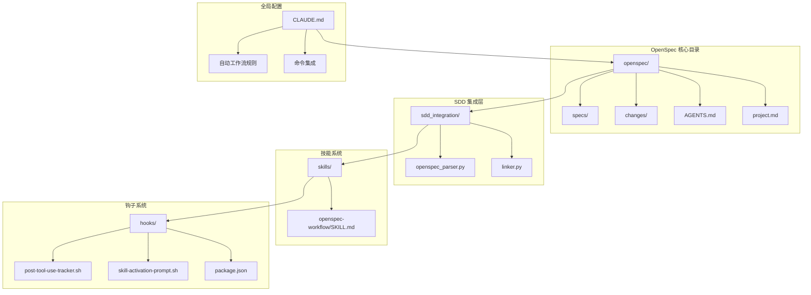

**图表来源**
- [openspec/specs/claudecode-openspec-integration/spec.md](file://openspec/specs/claudecode-openspec-integration/spec.md#L1-L54)
- [sdd_integration/openspec_parser.py](file://sdd_integration/openspec_parser.py#L1-L249)
- [skills/openspec-workflow/SKILL.md](file://skills/openspec-workflow/SKILL.md#L1-L231)

**章节来源**
- [openspec/specs/claudecode-openspec-integration/spec.md](file://openspec/specs/claudecode-openspec-integration/spec.md#L1-L54)
- [openspec/AGENTS.md](file://openspec/AGENTS.md#L1-L457)
- [openspec/project.md](file://openspec/project.md#L1-L65)

## 核心组件

### OpenSpec 规范引擎

OpenSpec 规范引擎是整个系统的核心，负责解析和管理 OpenSpec 文档。它包含三个主要的数据类：

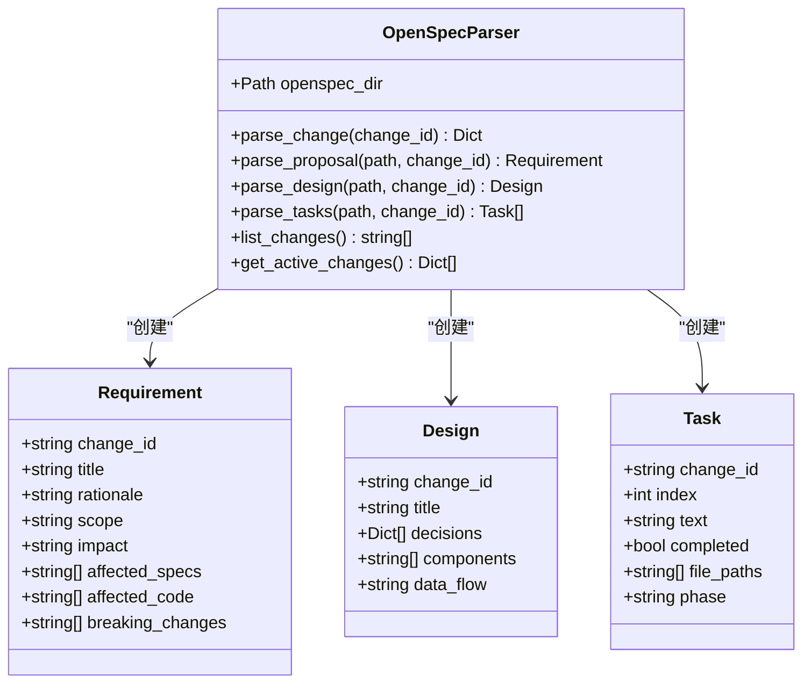

**图表来源**
- [sdd_integration/openspec_parser.py](file://sdd_integration/openspec_parser.py#L17-L51)

### 代码-需求链接器

代码-需求链接器负责建立代码元素与需求之间的关联关系，支持多种链接方法：

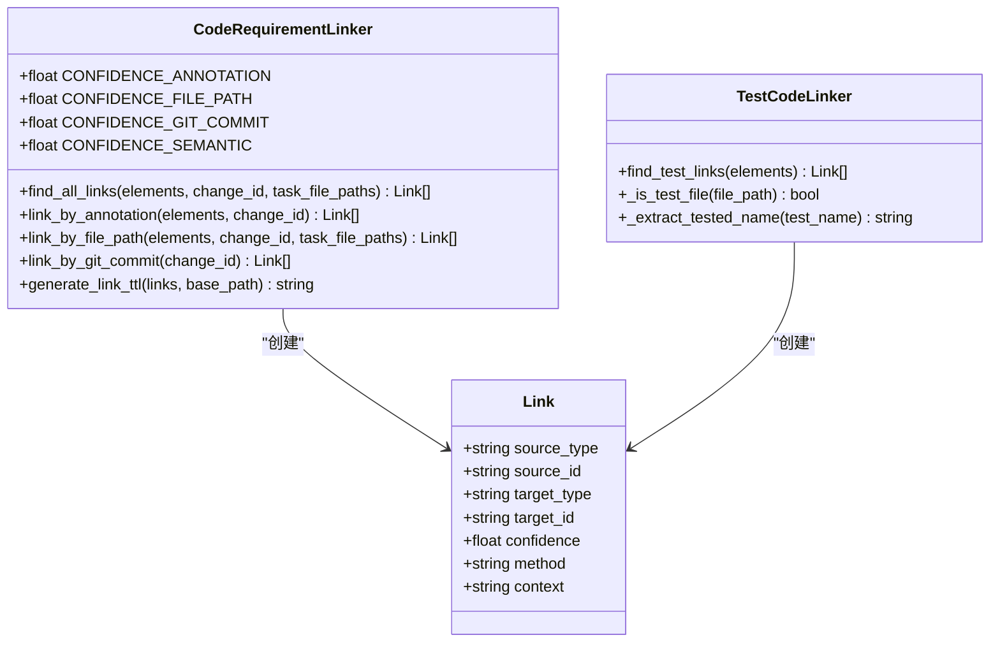

**图表来源**
- [sdd_integration/linker.py](file://sdd_integration/linker.py#L23-L35)

**章节来源**
- [sdd_integration/openspec_parser.py](file://sdd_integration/openspec_parser.py#L1-L249)
- [sdd_integration/linker.py](file://sdd_integration/linker.py#L1-L324)

## 架构概览

OpenSpec 集成架构采用分层设计，确保规范驱动开发的完整性和可扩展性：

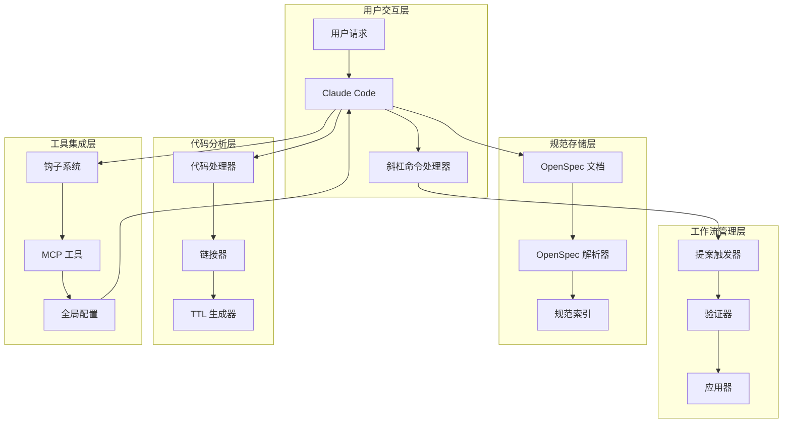

**图表来源**
- [CLAUDE.md](file://CLAUDE.md#L26-L100)
- [openspec/AGENTS.md](file://openspec/AGENTS.md#L15-L80)

### 自动工作流决策树

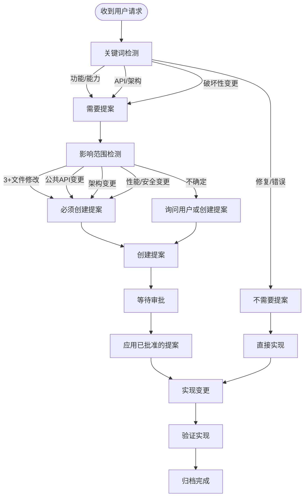

**图表来源**
- [CLAUDE.md](file://CLAUDE.md#L30-L83)

## 详细组件分析

### 前规范检查机制

前规范检查机制确保在开始任何实现任务之前，Claude Code 会自动检查现有的 OpenSpec 规范：

#### 功能请求匹配现有规范场景

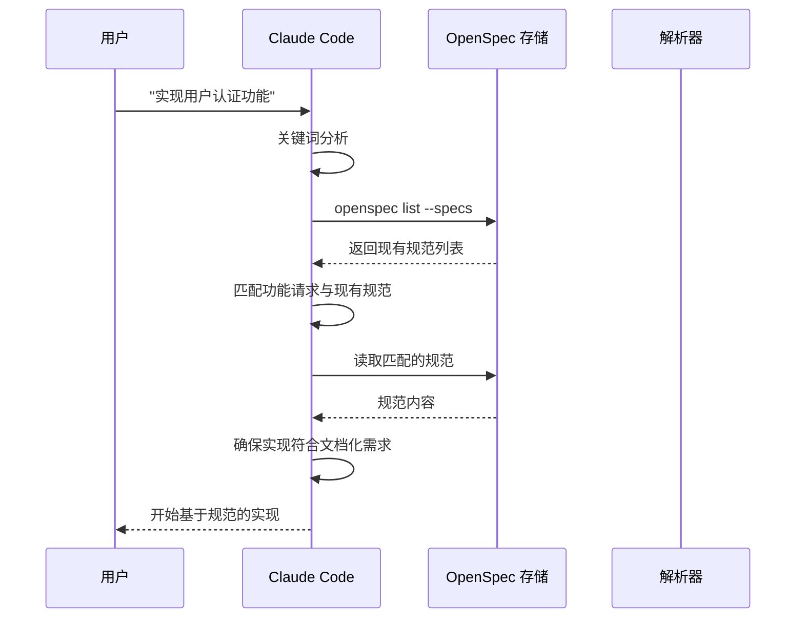

**图表来源**
- [CLAUDE.md](file://CLAUDE.md#L48-L67)
- [openspec/AGENTS.md](file://openspec/AGENTS.md#L66-L74)

#### 功能请求无匹配规范场景

当用户请求的新功能没有现有规范时，Claude Code 会提示是否先创建提案：

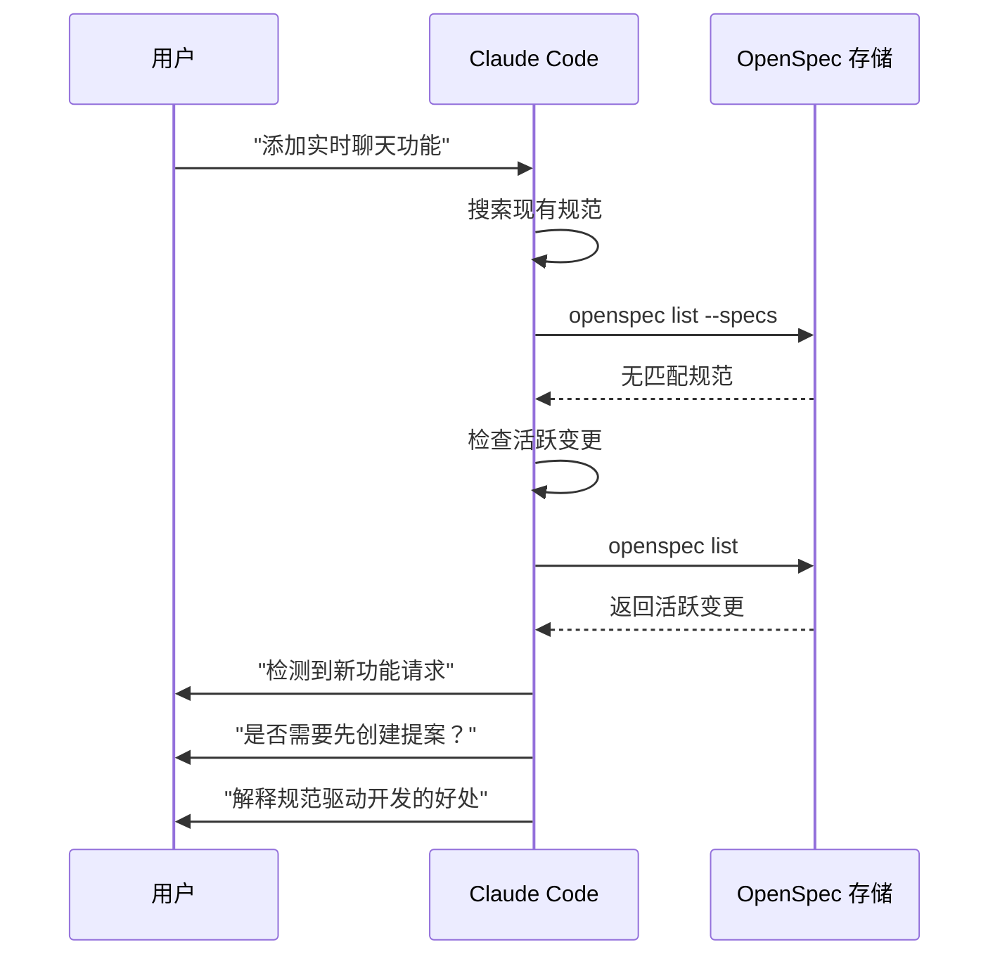

**图表来源**
- [CLAUDE.md](file://CLAUDE.md#L16-L20)
- [openspec/AGENTS.md](file://openspec/AGENTS.md#L17-L47)

**章节来源**
- [CLAUDE.md](file://CLAUDE.md#L48-L67)
- [openspec/specs/claudecode-openspec-integration/spec.md](file://openspec/specs/claudecode-openspec-integration/spec.md#L8-L20)

### 自动提案触发检测

自动提案触发检测机制基于多个维度的触发器来判断何时需要创建 OpenSpec 提案：

#### 破坏性变更检测

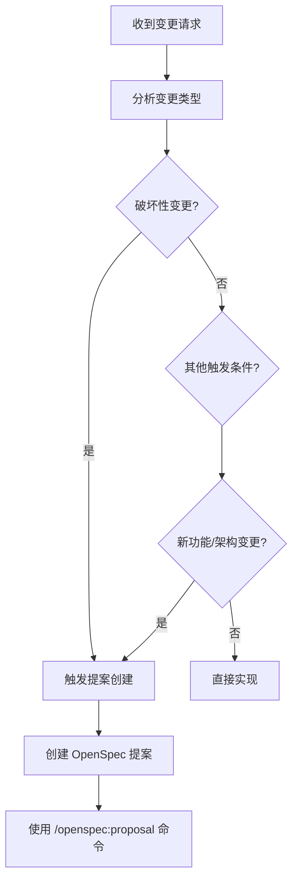

**图表来源**
- [CLAUDE.md](file://CLAUDE.md#L69-L83)
- [openspec/specs/claudecode-openspec-integration/spec.md](file://openspec/specs/claudecode-openspec-integration/spec.md#L24-L27)

#### 新能力检测

新能力检测通过检查 `openspec list --specs` 来查找相关规范，如果能力未被文档化则推荐创建提案：

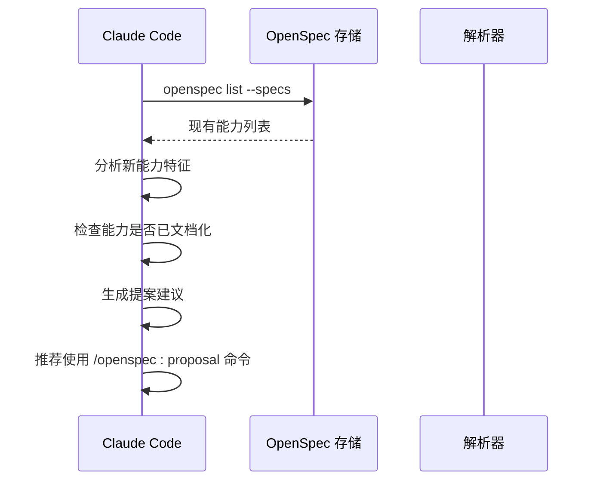

**图表来源**
- [CLAUDE.md](file://CLAUDE.md#L29-L33)
- [openspec/AGENTS.md](file://openspec/AGENTS.md#L145-L155)

**章节来源**
- [CLAUDE.md](file://CLAUDE.md#L69-L83)
- [openspec/specs/claudecode-openspec-integration/spec.md](file://openspec/specs/claudecode-openspec-integration/spec.md#L21-L33)

### OpenSpec 命令集成

OpenSpec 命令集成为 Claude Code 提供了完整的规范驱动开发工具链：

#### /openspec:proposal 命令

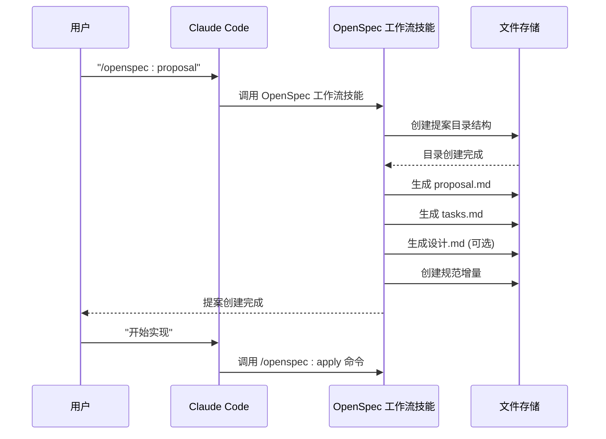

**图表来源**
- [skills/openspec-workflow/SKILL.md](file://skills/openspec-workflow/SKILL.md#L38-L44)
- [openspec/AGENTS.md](file://openspec/AGENTS.md#L91-L112)

#### /openspec:apply 命令

应用命令允许用户在提案批准后开始实现：

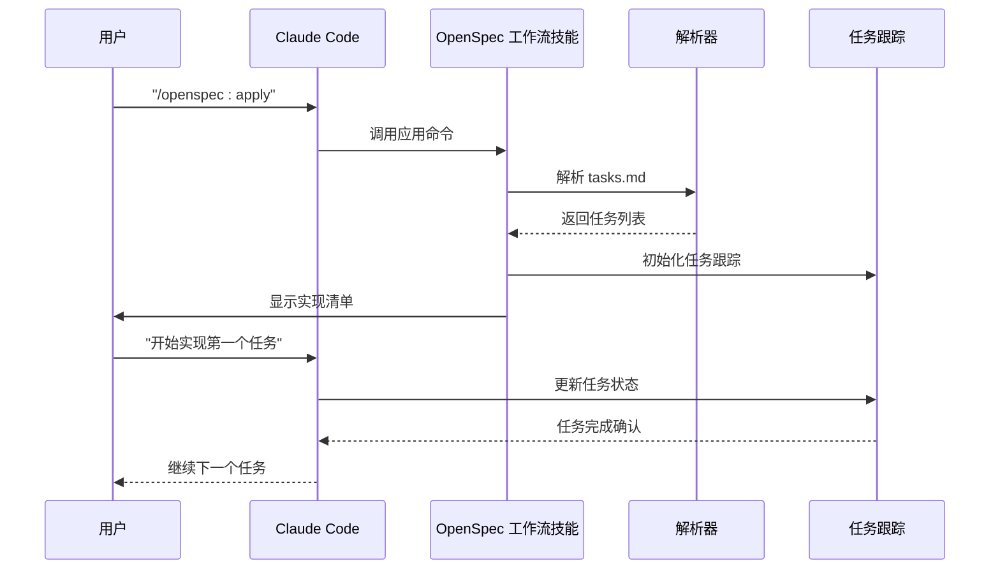

**图表来源**
- [skills/openspec-workflow/SKILL.md](file://skills/openspec-workflow/SKILL.md#L42-L44)
- [sdd_integration/openspec_parser.py](file://sdd_integration/openspec_parser.py#L162-L197)

**章节来源**
- [skills/openspec-workflow/SKILL.md](file://skills/openspec-workflow/SKILL.md#L38-L44)
- [openspec/AGENTS.md](file://openspec/AGENTS.md#L91-L112)

### 规范-实现一致性检查

规范-实现一致性检查确保实现完全符合规范要求：

#### 实现完成后的验证流程

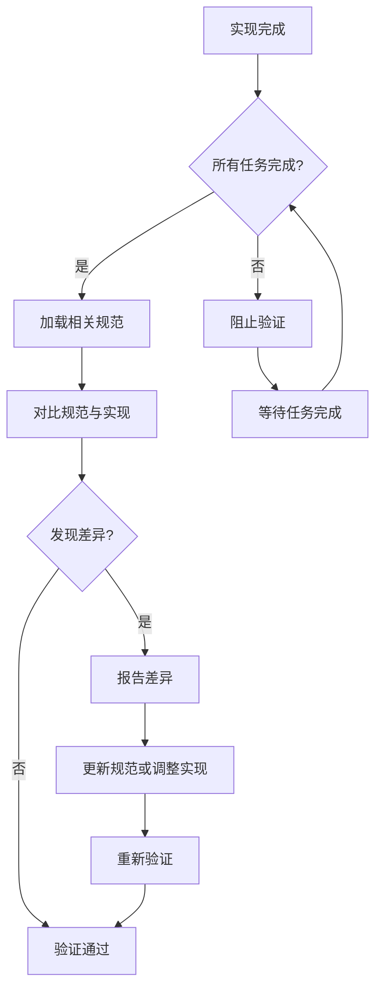

**图表来源**
- [openspec/specs/claudecode-openspec-integration/spec.md](file://openspec/specs/claudecode-openspec-integration/spec.md#L47-L54)

**章节来源**
- [openspec/specs/claudecode-openspec-integration/spec.md](file://openspec/specs/claudecode-openspec-integration/spec.md#L47-L54)

## 依赖关系分析

OpenSpec 集成系统的依赖关系展现了清晰的模块化架构：

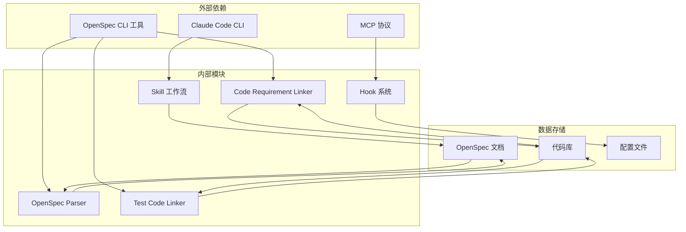

**图表来源**
- [openspec/project.md](file://openspec/project.md#L17-L22)
- [CLAUDE.md](file://CLAUDE.md#L54-L65)

### 数据流依赖

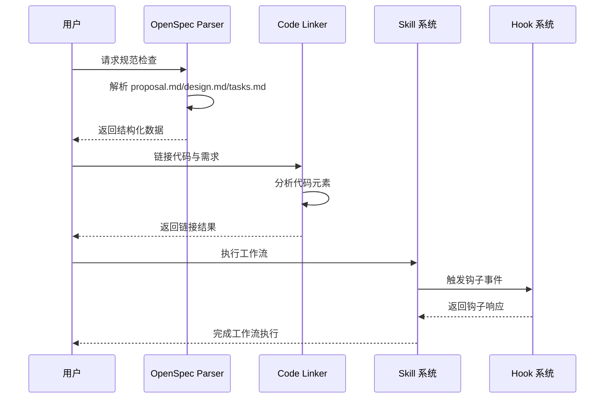

**图表来源**
- [sdd_integration/openspec_parser.py](file://sdd_integration/openspec_parser.py#L51-L86)
- [sdd_integration/linker.py](file://sdd_integration/linker.py#L35-L68)

**章节来源**
- [openspec/project.md](file://openspec/project.md#L17-L22)
- [CLAUDE.md](file://CLAUDE.md#L54-L65)

## 性能考虑

OpenSpec 集成系统在设计时充分考虑了性能优化：

### 解析器性能优化

OpenSpec 解析器采用了高效的正则表达式匹配和缓存机制：

- **正则表达式优化**：使用编译后的正则表达式减少重复编译开销
- **增量解析**：支持部分文档解析，避免全量重解析
- **内存管理**：使用 dataclass 减少内存占用

### 链接器性能策略

代码-需求链接器实现了多层缓存和智能匹配：

- **路径标准化**：预处理文件路径，减少匹配时间
- **去重算法**：使用字典映射实现 O(1) 去重
- **渐进式匹配**：按优先级顺序尝试不同匹配方法

### 命令执行优化

斜杠命令系统通过异步处理和结果缓存提升响应速度：

- **命令预热**：常用命令预加载到内存
- **结果缓存**：频繁查询结果缓存到本地
- **并发处理**：支持多命令并发执行

## 故障排除指南

### 常见问题诊断

#### OpenSpec 解析失败

当 OpenSpec 文档解析失败时，通常由以下原因导致：

1. **文件格式错误**：检查 `proposal.md`、`design.md`、`tasks.md` 的格式
2. **缺少必需字段**：确保每个文件包含必要的标题和内容
3. **编码问题**：确认文件使用 UTF-8 编码

#### 链接失败问题

代码-需求链接失败的常见原因：

1. **注解格式错误**：检查 `@spec` 注解的格式和大小写
2. **文件路径不匹配**：验证任务文件路径与实际文件的一致性
3. **Git 历史访问权限**：确认有权限访问 Git 仓库历史

#### 命令执行错误

斜杠命令执行失败的排查步骤：

1. **检查命令语法**：验证命令格式是否正确
2. **确认权限设置**：检查文件和目录的访问权限
3. **查看日志输出**：分析详细的错误信息

**章节来源**
- [skills/openspec-workflow/SKILL.md](file://skills/openspec-workflow/SKILL.md#L168-L175)
- [openspec/AGENTS.md](file://openspec/AGENTS.md#L289-L317)

### 调试技巧

#### 日志分析

系统提供了多层次的日志记录：

- **解析器日志**：记录文档解析过程和结果
- **链接器日志**：显示链接匹配的详细信息
- **命令日志**：跟踪命令执行的完整流程

#### 性能监控

通过以下指标监控系统性能：

- **解析时间**：测量文档解析耗时
- **链接成功率**：统计链接匹配的成功率
- **命令响应时间**：监控命令执行的响应时间

## 结论

OpenSpec 集成规范为 Claude Code 提供了一个完整的规范驱动开发框架。通过自动化的前规范检查、智能的提案触发检测和完善的命令集成，该系统确保了开发过程的规范性和一致性。

### 主要优势

1. **规范先行**：强制执行规范驱动开发原则
2. **自动化程度高**：减少手动干预，提升效率
3. **可扩展性强**：模块化设计支持功能扩展
4. **错误处理完善**：提供全面的故障排除机制

### 最佳实践建议

1. **严格遵守规范格式**：确保所有 OpenSpec 文档遵循标准格式
2. **及时更新规范**：实现完成后及时更新相关规范
3. **充分利用链接功能**：通过代码-需求链接提升开发质量
4. **定期维护工具链**：保持 OpenSpec CLI 工具的最新版本

该集成规范为团队协作和长期项目维护奠定了坚实的基础，通过规范驱动开发确保了代码质量和项目的可持续发展。