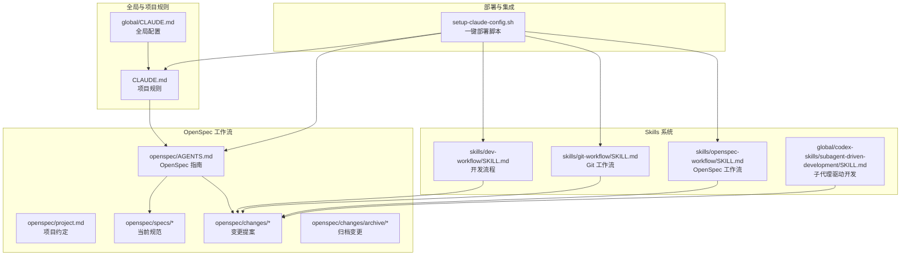
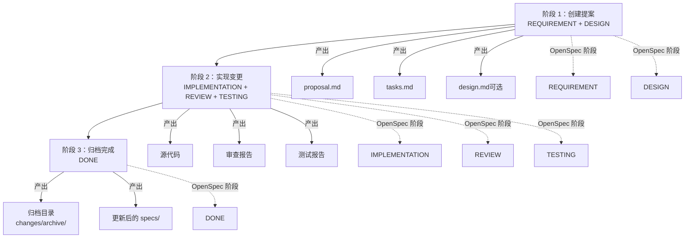
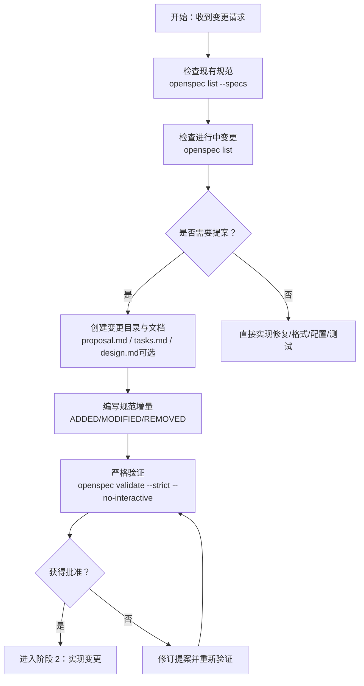
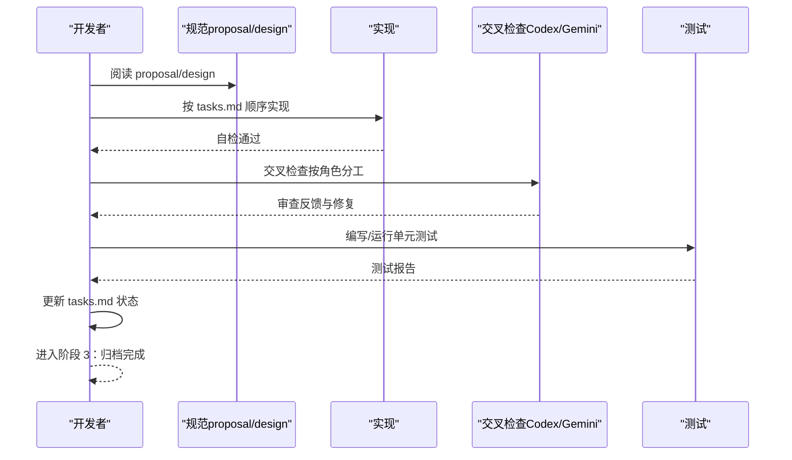
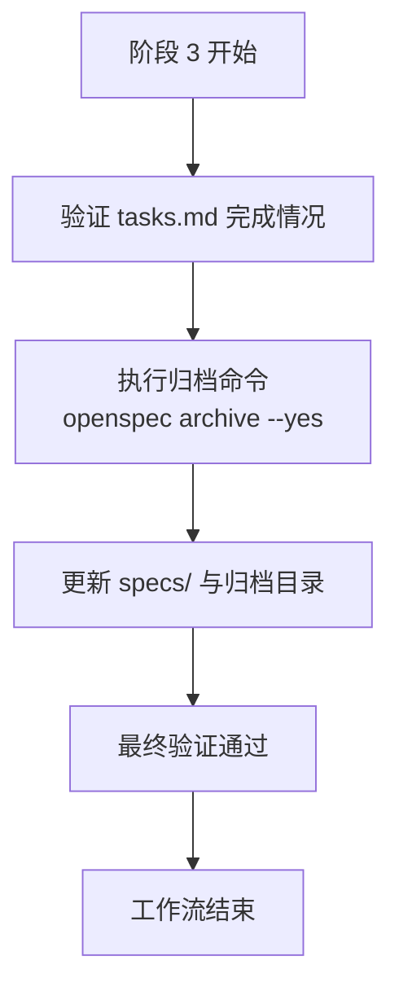
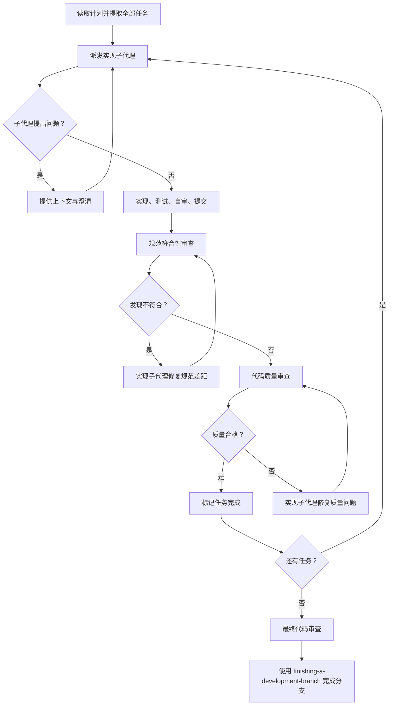
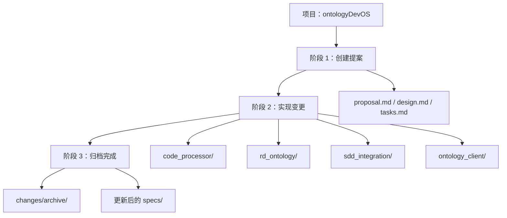
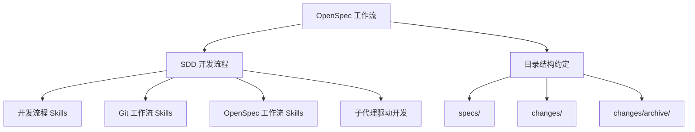

# 三阶段工作流

<cite>
**本文引用的文件**
- [README.md](file://README.md)
- [CLAUDE.md](file://CLAUDE.md)
- [global/CLAUDE.md](file://global/CLAUDE.md)
- [openspec/AGENTS.md](file://openspec/AGENTS.md)
- [openspec/project.md](file://openspec/project.md)
- [openspec/specs/claudecode-openspec-integration/spec.md](file://openspec/specs/claudecode-openspec-integration/spec.md)
- [skills/dev-workflow/SKILL.md](file://skills/dev-workflow/SKILL.md)
- [skills/git-workflow/SKILL.md](file://skills/git-workflow/SKILL.md)
- [skills/openspec-workflow/SKILL.md](file://skills/openspec-workflow/SKILL.md)
- [global/codex-skills/subagent-driven-development/SKILL.md](file://global/codex-skills/subagent-driven-development/SKILL.md)
- [global/codex-skills/subagent-driven-development/implementer-prompt.md](file://global/codex-skills/subagent-driven-development/implementer-prompt.md)
- [global/codex-skills/subagent-driven-development/spec-reviewer-prompt.md](file://global/codex-skills/subagent-driven-development/spec-reviewer-prompt.md)
- [global/codex-skills/subagent-driven-development/code-quality-reviewer-prompt.md](file://global/codex-skills/subagent-driven-development/code-quality-reviewer-prompt.md)
- [openspec/changes/add-code-ontology-capability/proposal.md](file://openspec/changes/add-code-ontology-capability/proposal.md)
- [openspec/changes/add-code-ontology-capability/design.md](file://openspec/changes/add-code-ontology-capability/design.md)
- [openspec/changes/add-code-ontology-capability/tasks.md](file://openspec/changes/add-code-ontology-capability/tasks.md)
- [setup-claude-config.sh](file://setup-claude-config.sh)
</cite>

## 目录
1. [简介](#简介)
2. [项目结构](#项目结构)
3. [核心组件](#核心组件)
4. [架构总览](#架构总览)
5. [详细组件分析](#详细组件分析)
6. [依赖关系分析](#依赖关系分析)
7. [性能考量](#性能考量)
8. [故障排除指南](#故障排除指南)
9. [结论](#结论)
10. [附录](#附录)

## 简介
本文件系统化阐述三阶段工作流（提案创建 → 实现变更 → 归档完成），并将其与规范驱动开发（SDD）和 OpenSpec 工作流统一。三阶段分别对应：
- 阶段 1：创建提案（REQUIREMENT + DESIGN）
- 阶段 2：实现变更（IMPLEMENTATION + REVIEW + TESTING）
- 阶段 3：归档完成（DONE）

文档明确各阶段的任务、输出物、质量标准、阶段间转换条件与约束，并结合项目中的真实变更提案展示如何在不同类型的项目中应用该工作流。

## 项目结构
本项目提供多 AI 协同与 SDD 工作流基础设施，核心包括：
- 全局与项目级 CLAUDE.md 规则
- OpenSpec 规范与变更目录结构
- 多个可复用的 Skills（开发流程、Git 工作流、OpenSpec 工作流等）
- 子代理驱动开发的提示模板
- 一键部署脚本以快速在任意项目中启用工作流

**图表来源**
- [CLAUDE.md](file://CLAUDE.md#L220-L308)
- [openspec/AGENTS.md](file://openspec/AGENTS.md#L123-L142)
- [openspec/project.md](file://openspec/project.md#L24-L46)
- [skills/dev-workflow/SKILL.md](file://skills/dev-workflow/SKILL.md#L53-L92)
- [skills/git-workflow/SKILL.md](file://skills/git-workflow/SKILL.md#L27-L53)
- [skills/openspec-workflow/SKILL.md](file://skills/openspec-workflow/SKILL.md#L26-L46)
- [global/codex-skills/subagent-driven-development/SKILL.md](file://global/codex-skills/subagent-driven-development/SKILL.md#L38-L83)
- [setup-claude-config.sh](file://setup-claude-config.sh#L60-L185)

**章节来源**
- [README.md](file://README.md#L71-L92)
- [CLAUDE.md](file://CLAUDE.md#L220-L308)
- [openspec/AGENTS.md](file://openspec/AGENTS.md#L123-L142)
- [openspec/project.md](file://openspec/project.md#L24-L46)
- [skills/dev-workflow/SKILL.md](file://skills/dev-workflow/SKILL.md#L53-L92)
- [skills/git-workflow/SKILL.md](file://skills/git-workflow/SKILL.md#L27-L53)
- [skills/openspec-workflow/SKILL.md](file://skills/openspec-workflow/SKILL.md#L26-L46)
- [global/codex-skills/subagent-driven-development/SKILL.md](file://global/codex-skills/subagent-driven-development/SKILL.md#L38-L83)
- [setup-claude-config.sh](file://setup-claude-config.sh#L60-L185)

## 核心组件
- OpenSpec 工作流：规范驱动的提案、实现与归档流程，确保“先规范、后实现”。
- 开发流程 Skills：严格阶段顺序（REQUIREMENT → DESIGN → IMPLEMENTATION → REVIEW → TESTING → DONE），并提供文档模板与校验。
- Git 工作流 Skills：标准化分支命名、提交消息与合并流程，保障团队协作一致性。
- 子代理驱动开发：每任务一个子代理 + 两阶段审查（规范符合性 → 代码质量），提升迭代速度与质量。
- 一键部署脚本：将上述规则与工具注入任意项目，快速启用多 AI 协同与 SDD 工作流。

**章节来源**
- [openspec/AGENTS.md](file://openspec/AGENTS.md#L15-L65)
- [skills/dev-workflow/SKILL.md](file://skills/dev-workflow/SKILL.md#L28-L50)
- [skills/git-workflow/SKILL.md](file://skills/git-workflow/SKILL.md#L27-L53)
- [global/codex-skills/subagent-driven-development/SKILL.md](file://global/codex-skills/subagent-driven-development/SKILL.md#L8-L11)
- [setup-claude-config.sh](file://setup-claude-config.sh#L187-L234)

## 架构总览
三阶段工作流与 OpenSpec 的映射关系如下：

**图表来源**
- [CLAUDE.md](file://CLAUDE.md#L222-L284)
- [openspec/AGENTS.md](file://openspec/AGENTS.md#L15-L65)

**章节来源**
- [CLAUDE.md](file://CLAUDE.md#L222-L284)
- [openspec/AGENTS.md](file://openspec/AGENTS.md#L15-L65)

## 详细组件分析

### 阶段 1：创建提案（REQUIREMENT + DESIGN）
- 任务
  - 检查现有规范与进行中的变更，避免重复与冲突
  - 创建变更提案目录与文档：proposal.md、tasks.md、design.md（必要时）
  - 编写规范增量（ADDED/MODIFIED/REMOVED），并确保每个需求至少包含一个场景
  - 使用严格验证命令确保格式与内容合规
- 输出物
  - proposal.md：变更动机、变更内容、影响范围
  - tasks.md：实现清单与进度跟踪
  - design.md：技术决策（跨模块、架构、安全、性能等复杂变更时）
  - 规范增量（specs/ 下的 spec.md）
- 质量标准
  - 至少一个场景；场景标题格式正确；delta 操作头匹配；无空 delta
- 转换条件
  - 通过验证后进入“等待审批”状态，方可进入阶段 2

**图表来源**
- [CLAUDE.md](file://CLAUDE.md#L48-L99)
- [openspec/AGENTS.md](file://openspec/AGENTS.md#L43-L65)
- [openspec/AGENTS.md](file://openspec/AGENTS.md#L145-L155)
- [openspec/AGENTS.md](file://openspec/AGENTS.md#L289-L317)

**章节来源**
- [CLAUDE.md](file://CLAUDE.md#L48-L99)
- [openspec/AGENTS.md](file://openspec/AGENTS.md#L43-L65)
- [openspec/AGENTS.md](file://openspec/AGENTS.md#L145-L155)
- [openspec/AGENTS.md](file://openspec/AGENTS.md#L289-L317)

### 阶段 2：实现变更（IMPLEMENTATION + REVIEW + TESTING）
- 任务
  - 依据 proposal.md/desgin.md/tasks.md 顺序实现
  - 每完成一部分即进行自检与交叉检查（按角色分工）
  - 编写/运行单元测试，确保场景通过
  - 更新 tasks.md 状态为“已完成”
- 输出物
  - 源代码
  - 审查报告（review.md）
  - 测试报告（test-report.md）
- 质量标准
  - 实现与规范一致；无安全漏洞；测试覆盖充分；文档完整
- 转换条件
  - 所有测试通过、审查通过、tasks.md 完成后进入阶段 3

**图表来源**
- [CLAUDE.md](file://CLAUDE.md#L241-L273)
- [skills/dev-workflow/SKILL.md](file://skills/dev-workflow/SKILL.md#L196-L242)
- [skills/dev-workflow/SKILL.md](file://skills/dev-workflow/SKILL.md#L245-L279)

**章节来源**
- [CLAUDE.md](file://CLAUDE.md#L241-L273)
- [skills/dev-workflow/SKILL.md](file://skills/dev-workflow/SKILL.md#L196-L242)
- [skills/dev-workflow/SKILL.md](file://skills/dev-workflow/SKILL.md#L245-L279)

### 阶段 3：归档完成（DONE）
- 任务
  - 确认 tasks.md 所有任务完成
  - 归档变更至 changes/archive/，并更新 specs/
  - 运行最终验证，确保归档通过
- 输出物
  - 归档目录 changes/archive/YYYY-MM-DD-[name]/
  - 更新后的 specs/
- 转换条件
  - 归档命令执行成功且验证通过

**图表来源**
- [CLAUDE.md](file://CLAUDE.md#L265-L273)
- [openspec/AGENTS.md](file://openspec/AGENTS.md#L59-L65)

**章节来源**
- [CLAUDE.md](file://CLAUDE.md#L265-L273)
- [openspec/AGENTS.md](file://openspec/AGENTS.md#L59-L65)

### 子代理驱动开发（可选强化流程）
- 核心原则：每任务一个子代理 + 两阶段审查（规范符合性 → 代码质量）
- 流程优势：减少上下文切换、自动审查节点、早期发现问题
- 适用场景：任务相对独立、需要快速迭代与高质量保证

**图表来源**
- [global/codex-skills/subagent-driven-development/SKILL.md](file://global/codex-skills/subagent-driven-development/SKILL.md#L38-L83)
- [global/codex-skills/subagent-driven-development/implementer-prompt.md](file://global/codex-skills/subagent-driven-development/implementer-prompt.md#L5-L79)
- [global/codex-skills/subagent-driven-development/spec-reviewer-prompt.md](file://global/codex-skills/subagent-driven-development/spec-reviewer-prompt.md#L7-L62)
- [global/codex-skills/subagent-driven-development/code-quality-reviewer-prompt.md](file://global/codex-skills/subagent-driven-development/code-quality-reviewer-prompt.md#L9-L21)

**章节来源**
- [global/codex-skills/subagent-driven-development/SKILL.md](file://global/codex-skills/subagent-driven-development/SKILL.md#L8-L11)
- [global/codex-skills/subagent-driven-development/SKILL.md](file://global/codex-skills/subagent-driven-development/SKILL.md#L38-L83)
- [global/codex-skills/subagent-driven-development/implementer-prompt.md](file://global/codex-skills/subagent-driven-development/implementer-prompt.md#L5-L79)
- [global/codex-skills/subagent-driven-development/spec-reviewer-prompt.md](file://global/codex-skills/subagent-driven-development/spec-reviewer-prompt.md#L7-L62)
- [global/codex-skills/subagent-driven-development/code-quality-reviewer-prompt.md](file://global/codex-skills/subagent-driven-development/code-quality-reviewer-prompt.md#L9-L21)

### 实际项目案例：代码本体能力集成
- 背景：将代码分析能力与本体框架整合，支持 SDD 集成与变更影响分析
- 阶段 1：创建提案（REQUIREMENT + DESIGN）
  - proposal.md：阐明动机、能力与影响
  - design.md：技术架构决策与映射策略
  - tasks.md：分阶段任务清单与并行化
- 阶段 2：实现变更（IMPLEMENTATION + REVIEW + TESTING）
  - 代码处理器迁移、本体模式定义、SDD 集成层与本体客户端实现
  - 交叉检查与测试覆盖
- 阶段 3：归档完成（DONE）
  - 归档变更并更新相关规范

**图表来源**
- [openspec/changes/add-code-ontology-capability/proposal.md](file://openspec/changes/add-code-ontology-capability/proposal.md#L1-L86)
- [openspec/changes/add-code-ontology-capability/design.md](file://openspec/changes/add-code-ontology-capability/design.md#L1-L261)
- [openspec/changes/add-code-ontology-capability/tasks.md](file://openspec/changes/add-code-ontology-capability/tasks.md#L1-L107)
- [CLAUDE.md](file://CLAUDE.md#L265-L273)

**章节来源**
- [openspec/changes/add-code-ontology-capability/proposal.md](file://openspec/changes/add-code-ontology-capability/proposal.md#L1-L86)
- [openspec/changes/add-code-ontology-capability/design.md](file://openspec/changes/add-code-ontology-capability/design.md#L1-L261)
- [openspec/changes/add-code-ontology-capability/tasks.md](file://openspec/changes/add-code-ontology-capability/tasks.md#L1-L107)
- [CLAUDE.md](file://CLAUDE.md#L265-L273)

## 依赖关系分析
- OpenSpec 与 SDD 的耦合
  - OpenSpec 的 REQUIREMENT/DESIGN 与 SDD 的 REQUIREMENT/DESIGN 对齐
  - IMPLEMENTATION/REVIEW/TESTING 与 SDD 的 IMPLEMENTATION/REVIEW/TESTING 对齐
- 角色与工具的依赖
  - Claude 为主导者，Codex 与 Gemini 作为交叉检查与辅助工具
  - 子代理驱动开发依赖 Superpowers 插件与审查模板
- 目录与文件的依赖
  - OpenSpec 目录结构（specs/、changes/、changes/archive/）与工作流强绑定
  - Skills 与 Hooks 的自动激活机制

**图表来源**
- [openspec/AGENTS.md](file://openspec/AGENTS.md#L123-L142)
- [skills/dev-workflow/SKILL.md](file://skills/dev-workflow/SKILL.md#L53-L92)
- [skills/git-workflow/SKILL.md](file://skills/git-workflow/SKILL.md#L27-L53)
- [skills/openspec-workflow/SKILL.md](file://skills/openspec-workflow/SKILL.md#L26-L46)
- [global/codex-skills/subagent-driven-development/SKILL.md](file://global/codex-skills/subagent-driven-development/SKILL.md#L38-L83)

**章节来源**
- [openspec/AGENTS.md](file://openspec/AGENTS.md#L123-L142)
- [skills/dev-workflow/SKILL.md](file://skills/dev-workflow/SKILL.md#L53-L92)
- [skills/git-workflow/SKILL.md](file://skills/git-workflow/SKILL.md#L27-L53)
- [skills/openspec-workflow/SKILL.md](file://skills/openspec-workflow/SKILL.md#L26-L46)
- [global/codex-skills/subagent-driven-development/SKILL.md](file://global/codex-skills/subagent-driven-development/SKILL.md#L38-L83)

## 性能考量
- 任务并行化
  - 在同一阶段内识别可并行任务（如多语言解析器、多模块 TTL 定义）
- 自动化与减少手工干预
  - 通过 Skills 与 Hooks 自动化阶段校验与状态更新
- 质量前置
  - 两阶段审查（规范符合性 → 代码质量）降低后期返工成本
- CI/CD 集成
  - 建议在阶段 2 结束后接入自动化构建与测试流水线

[本节为通用性能建议，不直接分析具体文件]

## 故障排除指南
- OpenSpec 验证失败
  - 常见错误：缺少 delta、场景格式错误、场景缺失
  - 处理方法：使用严格模式验证；检查场景标题格式；确保每个需求至少一个场景
- 提案冲突
  - 检查进行中变更与受影响规范，协调变更范围或合并提案
- 审查反馈未解决
  - 实现子代理修复后需重新审查，直至通过
- 归档失败
  - 确认 tasks.md 完成、最终验证通过后再执行归档命令

**章节来源**
- [openspec/AGENTS.md](file://openspec/AGENTS.md#L289-L317)
- [openspec/AGENTS.md](file://openspec/AGENTS.md#L417-L428)
- [global/codex-skills/subagent-driven-development/SKILL.md](file://global/codex-skills/subagent-driven-development/SKILL.md#L199-L224)

## 结论
三阶段工作流将规范驱动开发（SDD）与 OpenSpec 工具链有机结合，通过严格的阶段顺序、清晰的输出物与质量标准，确保变更可控、可追溯、可归档。配合多 AI 协同与子代理驱动开发，可在不同类型的项目中高效落地，显著提升交付质量与团队协作效率。

[本节为总结性内容，不直接分析具体文件]

## 附录
- 一键部署脚本
  - 支持安装 Skills、Agents、OpenSpec、MCP 工具，并初始化项目级配置
- 角色与工具使用规范
  - Claude 为主导者，Codex/Gemini 用于交叉验证与扩展思路
- Git 工作流规范
  - 标准化的分支命名、提交消息与合并流程

**章节来源**
- [setup-claude-config.sh](file://setup-claude-config.sh#L187-L234)
- [global/CLAUDE.md](file://global/CLAUDE.md#L60-L73)
- [skills/git-workflow/SKILL.md](file://skills/git-workflow/SKILL.md#L27-L53)