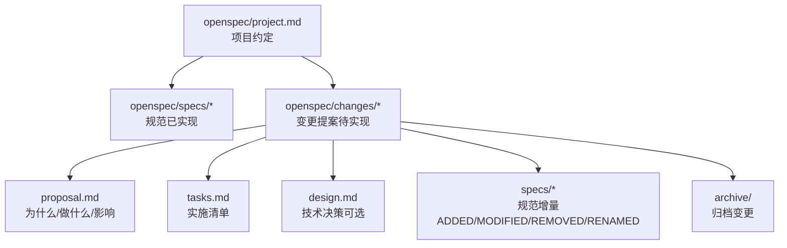
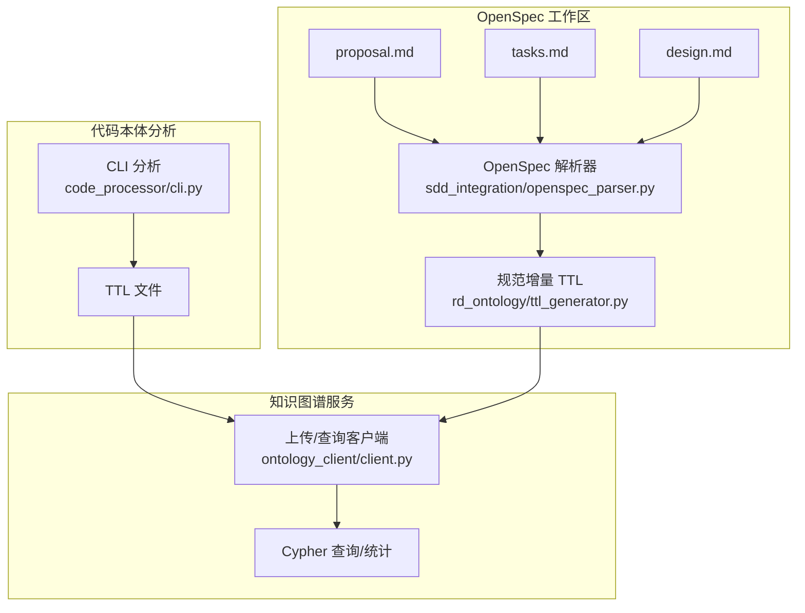
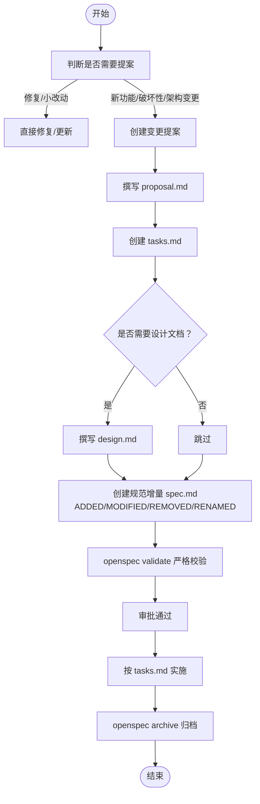
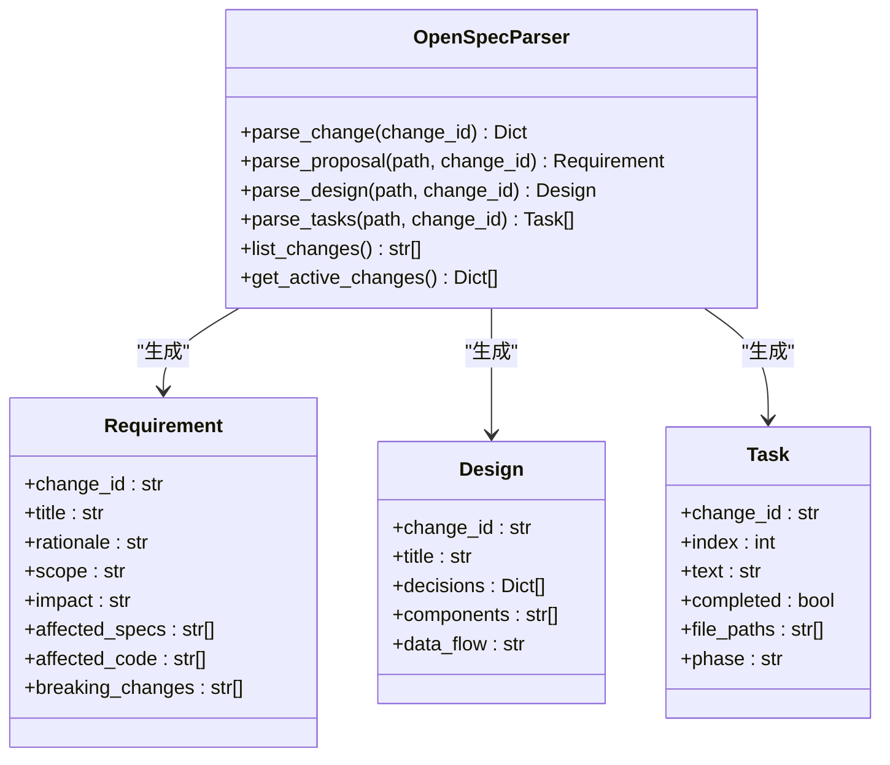
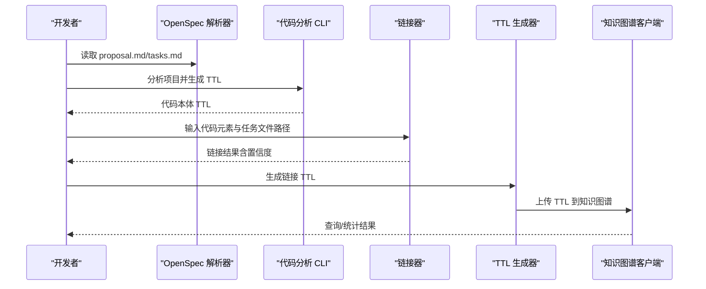
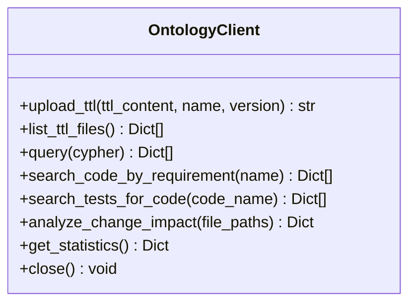
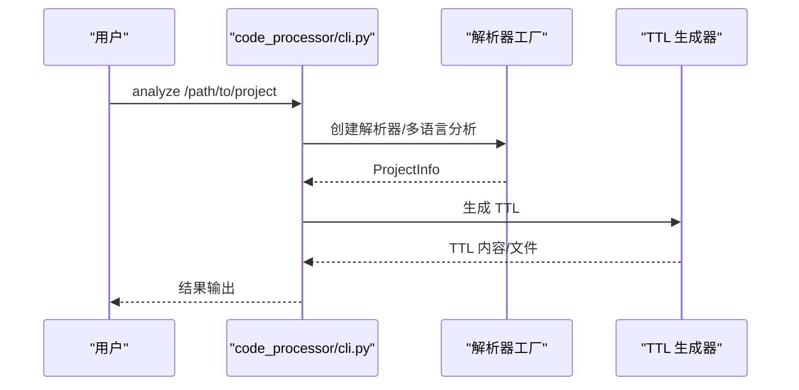
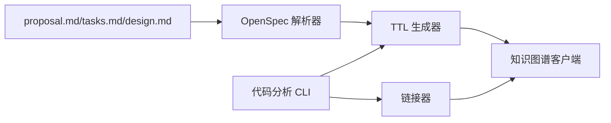

# 变更提案管理

<cite>
**本文档引用的文件**
- [openspec/AGENTS.md](file://openspec/AGENTS.md)
- [openspec/project.md](file://openspec/project.md)
- [openspec/specs/claudecode-openspec-integration/spec.md](file://openspec/specs/claudecode-openspec-integration/spec.md)
- [openspec/changes/add-code-ontology-capability/proposal.md](file://openspec/changes/add-code-ontology-capability/proposal.md)
- [openspec/changes/add-code-ontology-capability/tasks.md](file://openspec/changes/add-code-ontology-capability/tasks.md)
- [openspec/changes/archive/2026-01-22-add-claudecode-openspec-workflow/proposal.md](file://openspec/changes/archive/2026-01-22-add-claudecode-openspec-workflow/proposal.md)
- [openspec/changes/archive/2026-01-22-add-claudecode-openspec-workflow/tasks.md](file://openspec/changes/archive/2026-01-22-add-claudecode-openspec-workflow/tasks.md)
- [openspec/changes/archive/2026-01-22-add-claudecode-openspec-workflow/specs/claudecode-openspec-integration/spec.md](file://openspec/changes/archive/2026-01-22-add-claudecode-openspec-workflow/specs/claudecode-openspec-integration/spec.md)
- [code_processor/cli.py](file://code_processor/cli.py)
- [sdd_integration/openspec_parser.py](file://sdd_integration/openspec_parser.py)
- [sdd_integration/linker.py](file://sdd_integration/linker.py)
- [ontology_client/client.py](file://ontology_client/client.py)
- [rd_ontology/ttl_generator.py](file://rd_ontology/ttl_generator.py)
</cite>

## 目录
1. [简介](#简介)
2. [项目结构](#项目结构)
3. [核心组件](#核心组件)
4. [架构总览](#架构总览)
5. [详细组件分析](#详细组件分析)
6. [依赖关系分析](#依赖关系分析)
7. [性能考虑](#性能考虑)
8. [故障排除指南](#故障排除指南)
9. [结论](#结论)
10. [附录](#附录)

## 简介
本文件系统化阐述 OpenSpec 变更提案的创建、管理与跟踪方法，覆盖提案文档结构（proposal.md、tasks.md、spec.md）、变更影响评估、风险分析与审批流程，并提供模板与检查清单。同时解释如何使用 openspec list --specs 命令查找相关规范，以及如何处理破坏性变更与新功能提案。

## 项目结构
OpenSpec 工作流围绕以下目录组织：
- openspec/project.md：项目约定与背景
- openspec/specs/[capability]/spec.md：已实现规范（truth）
- openspec/changes/[change-id]/proposal.md、tasks.md、design.md、specs/[capability]/spec.md：变更提案（proposals）
- openspec/changes/archive/：归档的已完成变更

图表来源
- [openspec/AGENTS.md](file://openspec/AGENTS.md#L123-L141)
- [openspec/project.md](file://openspec/project.md#L1-L65)

章节来源
- [openspec/AGENTS.md](file://openspec/AGENTS.md#L123-L141)
- [openspec/project.md](file://openspec/project.md#L1-L65)

## 核心组件
- 变更提案三文件：proposal.md（why/what/impact）、tasks.md（实施清单）、design.md（技术决策，必要时）
- 规范增量：在 changes/[change-id]/specs 下按能力拆分的 spec.md，使用 ADDED/MODIFIED/REMOVED/RENAMED 标注
- CLI 工具链：openspec list、show、validate、archive；以及代码本体分析与 TTL 生成工具
- SDD 集成：解析 OpenSpec 文档、链接代码与需求、查询与影响分析

章节来源
- [openspec/AGENTS.md](file://openspec/AGENTS.md#L143-L235)
- [openspec/AGENTS.md](file://openspec/AGENTS.md#L448-L457)

## 架构总览
OpenSpec 变更从“规范驱动”出发，通过 CLI 与解析器将提案结构化，再经由 TTL 生成与上传进入知识图谱，最终支持查询与影响分析。

图表来源
- [sdd_integration/openspec_parser.py](file://sdd_integration/openspec_parser.py#L51-L86)
- [rd_ontology/ttl_generator.py](file://rd_ontology/ttl_generator.py#L18-L216)
- [code_processor/cli.py](file://code_processor/cli.py#L167-L214)
- [ontology_client/client.py](file://ontology_client/client.py#L19-L201)

## 详细组件分析

### 组件一：变更提案文档结构与规范
- proposal.md：说明变更动机（Why）、范围（What Changes）、影响（Impact），并标注破坏性变更
- tasks.md：阶段化实施清单，含文件路径提取与完成状态
- design.md：跨模块或复杂变更的技术决策、风险与迁移计划（必要时）
- 规范增量（ADDED/MODIFIED/REMOVED/RENAMED）：每个能力一个 spec.md，要求每条需求至少一个场景

图表来源
- [openspec/AGENTS.md](file://openspec/AGENTS.md#L145-L235)

章节来源
- [openspec/AGENTS.md](file://openspec/AGENTS.md#L143-L235)
- [openspec/AGENTS.md](file://openspec/AGENTS.md#L289-L316)

### 组件二：OpenSpec 解析器（解析 proposal.md、tasks.md、design.md）
- 负责抽取 Requirement/Design/Task 结构化信息
- 支持从 Impact 段落提取受影响规范与代码
- 从 tasks.md 提取文件路径并标注阶段

图表来源
- [sdd_integration/openspec_parser.py](file://sdd_integration/openspec_parser.py#L17-L197)

章节来源
- [sdd_integration/openspec_parser.py](file://sdd_integration/openspec_parser.py#L51-L197)

### 组件三：代码-需求链接器（Linker）
- 多源链接：注解（@spec）、文件路径匹配、Git 提交消息
- 去重与置信度评分，生成 TTL 链接三元组
- 测试到代码的反向链接

图表来源
- [sdd_integration/linker.py](file://sdd_integration/linker.py#L35-L68)
- [rd_ontology/ttl_generator.py](file://rd_ontology/ttl_generator.py#L231-L320)
- [ontology_client/client.py](file://ontology_client/client.py#L26-L155)

章节来源
- [sdd_integration/linker.py](file://sdd_integration/linker.py#L35-L241)

### 组件四：知识图谱客户端（上传/查询/统计）
- TTL 上传与版本管理
- Cypher 查询封装（按需求/测试检索、变更影响分析）
- 统计信息（节点数、关系数、需求数）

图表来源
- [ontology_client/client.py](file://ontology_client/client.py#L19-L201)

章节来源
- [ontology_client/client.py](file://ontology_client/client.py#L19-L201)

### 组件五：代码分析 CLI（TTL 生成）
- 单语言/混合语言分析
- 输出 JSON/TTL
- 信息展示与帮助

图表来源
- [code_processor/cli.py](file://code_processor/cli.py#L32-L163)
- [rd_ontology/ttl_generator.py](file://rd_ontology/ttl_generator.py#L176-L228)

章节来源
- [code_processor/cli.py](file://code_processor/cli.py#L32-L163)

## 依赖关系分析
- 变更提案依赖 openspec 解析器抽取结构化信息
- 代码分析 CLI 产出 TTL，供 TTL 生成器与知识图谱客户端消费
- 链接器将代码与需求/任务建立链接，形成可查询的知识图谱

图表来源
- [sdd_integration/openspec_parser.py](file://sdd_integration/openspec_parser.py#L51-L86)
- [rd_ontology/ttl_generator.py](file://rd_ontology/ttl_generator.py#L18-L216)
- [code_processor/cli.py](file://code_processor/cli.py#L167-L214)
- [sdd_integration/linker.py](file://sdd_integration/linker.py#L35-L68)
- [ontology_client/client.py](file://ontology_client/client.py#L19-L201)

章节来源
- [sdd_integration/openspec_parser.py](file://sdd_integration/openspec_parser.py#L51-L86)
- [rd_ontology/ttl_generator.py](file://rd_ontology/ttl_generator.py#L18-L216)
- [code_processor/cli.py](file://code_processor/cli.py#L167-L214)
- [sdd_integration/linker.py](file://sdd_integration/linker.py#L35-L68)
- [ontology_client/client.py](file://ontology_client/client.py#L19-L201)

## 性能考虑
- 代码分析：优先单语言分析以减少开销；混合分析适合多语言项目
- TTL 生成：缓存元素 IRIs，避免重复计算
- 查询优化：在 Cypher 中使用索引字段（如 changeId、name）；限制返回字段与数量
- 批量操作：合并多次 TTL 生成与上传，减少 IO 次数

## 故障排除指南
- “变更必须至少有一个增量”：检查 changes/[name]/specs/ 是否存在且包含 ADDED/MODIFIED/REMOVED/RENAMED 标头
- “需求必须至少有一个场景”：确认场景使用四级标题格式（#### Scenario:）
- 场景解析失败静默问题：使用 JSON 输出调试，核对 deltas 字段
- 变更冲突：运行 openspec list 检查活动变更，协调重叠能力
- 校验失败：使用严格模式与非交互模式，查看 JSON 输出细节

章节来源
- [openspec/AGENTS.md](file://openspec/AGENTS.md#L289-L316)
- [openspec/AGENTS.md](file://openspec/AGENTS.md#L415-L433)

## 结论
通过规范化的变更提案三文件与严格的校验流程，结合代码分析与知识图谱链接，OpenSpec 能够实现从“需求→设计→实现→验证”的闭环管理。建议在提案阶段充分评估影响与风险，采用阶段化实施与持续验证，确保规范与实现同步演进。

## 附录

### A. 变更提案创建模板与检查清单
- 选择唯一 change-id（动词-名词，短小描述）
- 创建目录 openspec/changes/[change-id]/
- 撰写 proposal.md：Why/What Changes/Impact（含受影响规范与代码）
- 撰写 tasks.md：阶段化清单，提取文件路径，标注完成状态
- 必要时撰写 design.md：背景、目标、决策、风险、迁移、开放问题
- 在 changes/[change-id]/specs 下创建对应能力的规范增量（ADDED/MODIFIED/REMOVED/RENAMED）
- 使用 openspec validate 严格校验
- 审批通过后按 tasks.md 实施，完成后 openspec archive 归档

章节来源
- [openspec/AGENTS.md](file://openspec/AGENTS.md#L143-L235)
- [openspec/AGENTS.md](file://openspec/AGENTS.md#L318-L347)

### B. 使用 openspec list --specs 查找相关规范
- 列出所有规范：openspec list --specs
- 列出活动变更：openspec list
- 显示详情：openspec show <spec-id> --type spec；openspec show <change-id> --json --deltas-only
- 全文搜索：rg -n "Requirement:|Scenario:" openspec/specs

章节来源
- [openspec/AGENTS.md](file://openspec/AGENTS.md#L81-L87)
- [openspec/AGENTS.md](file://openspec/AGENTS.md#L91-L112)

### C. 处理破坏性变更与新功能提案
- 破坏性变更：在 proposal.md 中明确标注破坏性变更，评估影响面与回滚策略
- 新功能提案：优先检查现有规范，避免重复；若确需新增能力，使用 ADDED 标注并在 specs 下创建增量
- 自动化触发：在 Claude Code 工作流中集成 OpenSpec 命令，检测破坏性变更与新能力并提示创建提案

章节来源
- [openspec/specs/claudecode-openspec-integration/spec.md](file://openspec/specs/claudecode-openspec-integration/spec.md#L21-L32)
- [openspec/changes/archive/2026-01-22-add-claudecode-openspec-workflow/proposal.md](file://openspec/changes/archive/2026-01-22-add-claudecode-openspec-workflow/proposal.md#L11-L15)
- [openspec/changes/archive/2026-01-22-add-claudecode-openspec-workflow/tasks.md](file://openspec/changes/archive/2026-01-22-add-claudecode-openspec-workflow/tasks.md#L1-L9)
- [openspec/changes/archive/2026-01-22-add-claudecode-openspec-workflow/specs/claudecode-openspec-integration/spec.md](file://openspec/changes/archive/2026-01-22-add-claudecode-openspec-workflow/specs/claudecode-openspec-integration/spec.md#L16-L27)

### D. 示例：代码本体能力提案
- 背景：将 mcp-graphrag 的代码分析能力迁移到本项目，增强 SDD 集成
- 结构：proposal.md 描述动机与范围；tasks.md 分阶段实施；spec.md 作为增量更新目标能力
- 关键点：标注破坏性变更（若存在）、成功标准（解析多语言项目、生成有效 TTL、准确查询）

章节来源
- [openspec/changes/add-code-ontology-capability/proposal.md](file://openspec/changes/add-code-ontology-capability/proposal.md#L1-L86)
- [openspec/changes/add-code-ontology-capability/tasks.md](file://openspec/changes/add-code-ontology-capability/tasks.md#L1-L107)