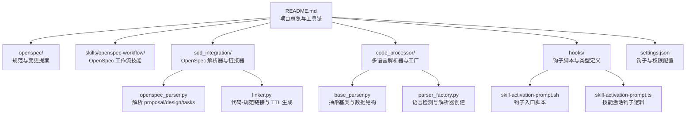
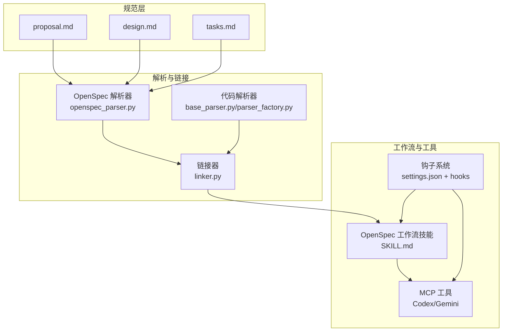
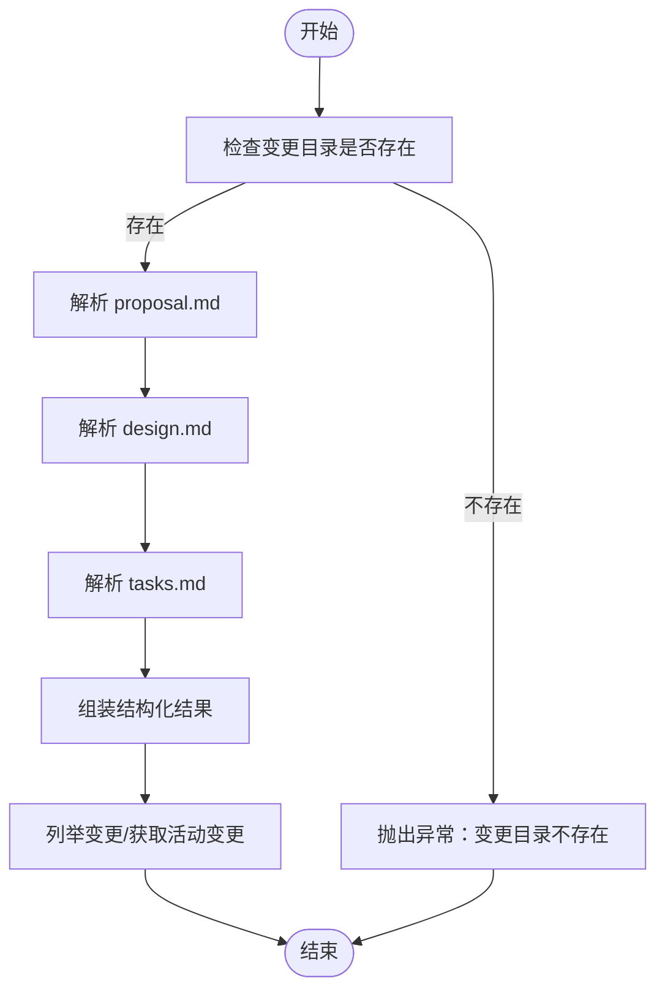
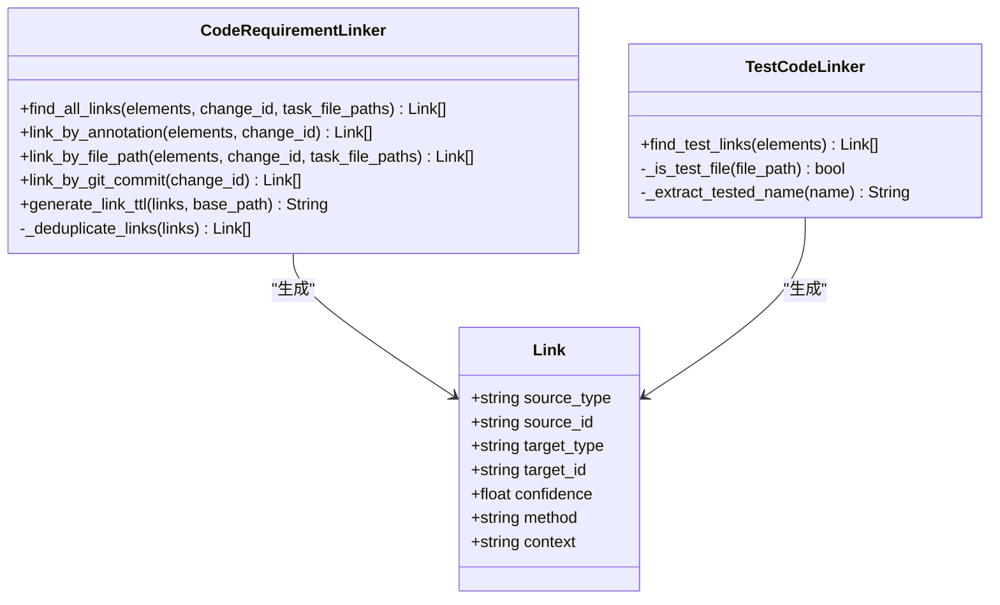
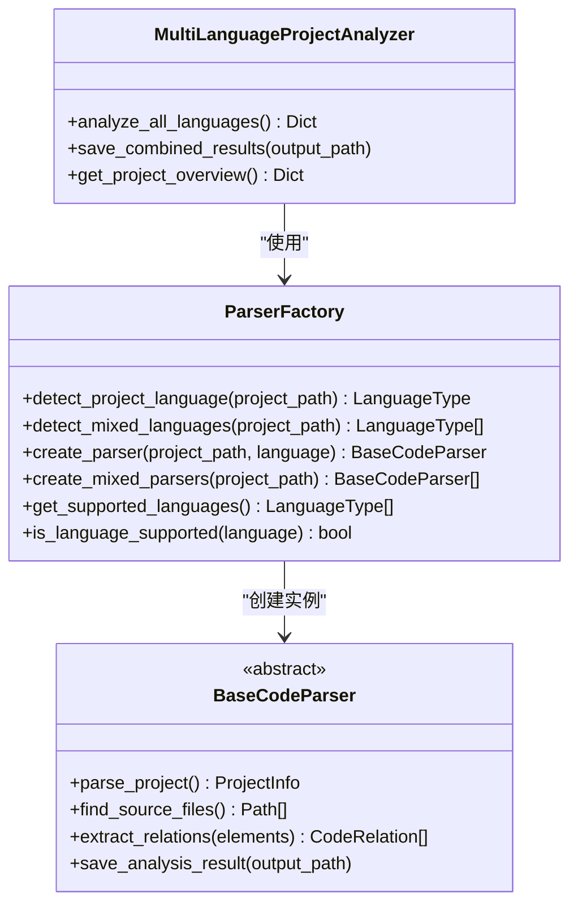
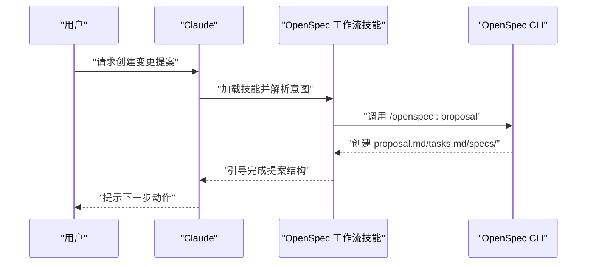
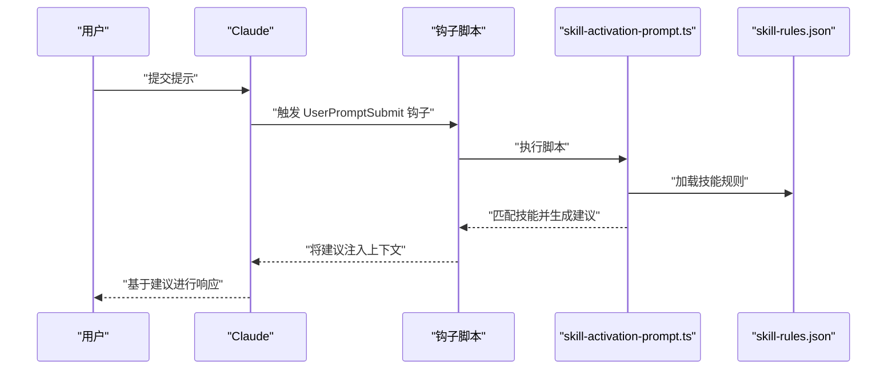
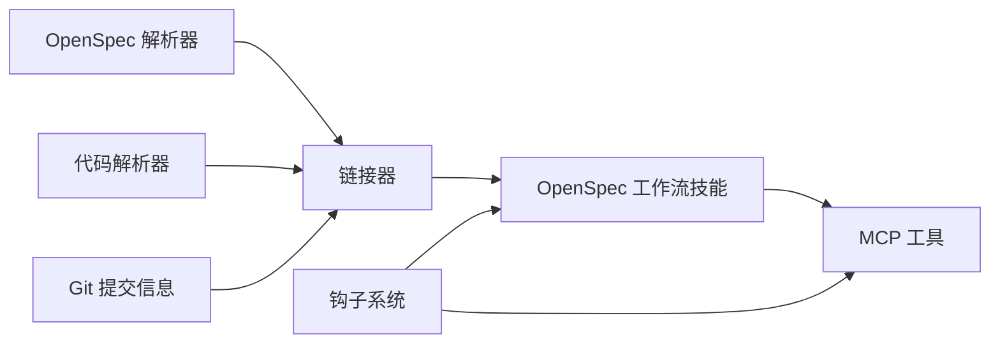

# 工作流自动化

<cite>
**本文引用的文件**
- [README.md](file://README.md)
- [sdd.md](file://docs/sdd.md)
- [openspec_parser.py](file://sdd_integration/openspec_parser.py)
- [linker.py](file://sdd_integration/linker.py)
- [base_parser.py](file://code_processor/base_parser.py)
- [parser_factory.py](file://code_processor/parser_factory.py)
- [openspec-workflow/SKILL.md](file://skills/openspec-workflow/SKILL.md)
- [claudecode-openspec-integration/spec.md](file://openspec/specs/claudecode-openspec-integration/spec.md)
- [settings.json](file://settings.json)
- [skill-activation-prompt.sh](file://hooks/skill-activation-prompt.sh)
- [skill-activation-prompt.ts](file://hooks/skill-activation-prompt.ts)
- [HOOK_MECHANISMS.md](file://skills/skill-developer/HOOK_MECHANISMS.md)
- [test_openspec_parser.py](file://tests/test_openspec_parser.py)
</cite>

## 目录
1. [简介](#简介)
2. [项目结构](#项目结构)
3. [核心组件](#核心组件)
4. [架构总览](#架构总览)
5. [详细组件分析](#详细组件分析)
6. [依赖关系分析](#依赖关系分析)
7. [性能考量](#性能考量)
8. [故障排除指南](#故障排除指南)
9. [结论](#结论)
10. [附录](#附录)

## 简介
本技术文档聚焦于工作流自动化，围绕 SDD（规范驱动开发）工作流的自动化实现机制展开，重点覆盖 OpenSpec 解析器、链接器与工作流引擎三部分。文档说明如何自动检测规范变更、触发相应的工作流步骤与管理任务状态，提供自动化脚本的配置与定制方法，并给出工作流监控与故障排除指南，以及如何集成第三方工具与扩展自动化功能。

## 项目结构
该项目以“多 AI 协同 + SDD 工作流”为核心，围绕 OpenSpec 规范目录与技能系统组织代码与配置。关键目录与文件如下：
- openspec/：OpenSpec 规范与变更提案目录，包含规范、提案、设计与任务清单
- sdd_integration/：SDD 工作流集成模块，包含 OpenSpec 解析器与代码-规范链接器
- code_processor/：多语言代码解析器与工厂，用于抽取代码元素与关系
- skills/openspec-workflow/：OpenSpec 工作流技能，定义命令与流程
- hooks/：钩子脚本与类型定义，用于自动化触发与上下文注入
- settings.json：Claude Code 钩子与权限配置
- tests/：针对 OpenSpec 解析器的单元测试

**图表来源**
- [README.md](file://README.md#L71-L92)
- [openspec_parser.py](file://sdd_integration/openspec_parser.py#L51-L86)
- [linker.py](file://sdd_integration/linker.py#L35-L68)
- [base_parser.py](file://code_processor/base_parser.py#L206-L241)
- [parser_factory.py](file://code_processor/parser_factory.py#L20-L46)
- [skill-activation-prompt.sh](file://hooks/skill-activation-prompt.sh#L1-L6)
- [skill-activation-prompt.ts](file://hooks/skill-activation-prompt.ts#L36-L127)
- [settings.json](file://settings.json#L13-L36)

**章节来源**
- [README.md](file://README.md#L71-L92)

## 核心组件
- OpenSpec 解析器：从变更目录解析 proposal.md、design.md、tasks.md，提取结构化数据，支持变更列表与活动变更获取
- 链接器：将代码元素与需求/任务进行链接，支持注解、文件路径、Git 提交与去重合并，并生成 RDF TTL 三元组
- 代码解析器与工厂：多语言代码解析器（Java、Python、JavaScript/TypeScript），自动检测项目语言并批量分析
- OpenSpec 工作流技能：定义命令（/openspec:proposal、/openspec:apply、/openspec:archive）与工作流流程
- 钩子与配置：UserPromptSubmit 钩子在用户提交提示前注入技能建议，PostToolUse 钩子在工具使用后追踪编辑行为

**章节来源**
- [openspec_parser.py](file://sdd_integration/openspec_parser.py#L51-L86)
- [linker.py](file://sdd_integration/linker.py#L35-L68)
- [base_parser.py](file://code_processor/base_parser.py#L206-L241)
- [parser_factory.py](file://code_processor/parser_factory.py#L20-L46)
- [openspec-workflow/SKILL.md](file://skills/openspec-workflow/SKILL.md#L26-L46)
- [settings.json](file://settings.json#L13-L36)

## 架构总览
SDD 工作流自动化由“规范解析—代码链接—工作流执行—工具集成—钩子注入”构成闭环。OpenSpec 解析器负责从规范中抽取结构化信息；链接器将代码与规范关联，形成可审计的代码-规范关系；工作流技能提供命令与流程；钩子在用户交互与工具使用前后注入上下文与控制；第三方工具（Codex、Gemini）通过 MCP 协议参与协作。

**图表来源**
- [openspec_parser.py](file://sdd_integration/openspec_parser.py#L51-L86)
- [linker.py](file://sdd_integration/linker.py#L35-L68)
- [base_parser.py](file://code_processor/base_parser.py#L206-L241)
- [parser_factory.py](file://code_processor/parser_factory.py#L20-L46)
- [openspec-workflow/SKILL.md](file://skills/openspec-workflow/SKILL.md#L26-L46)
- [settings.json](file://settings.json#L13-L36)

## 详细组件分析

### OpenSpec 解析器
- 职责：解析变更目录中的 proposal、design、tasks，提取需求、设计决策、任务与阶段信息
- 关键流程：
  - 解析 proposal：标题、动机、变更内容、影响范围、破坏性变更
  - 解析 design：架构决策、组件、数据流
  - 解析 tasks：任务清单、完成状态、文件路径、阶段
  - 列举变更与获取活动变更
- 复杂度与性能：线性扫描与正则匹配，时间复杂度近似 O(n)，n 为文档字符数；空间复杂度与解析对象数量线性相关

**图表来源**
- [openspec_parser.py](file://sdd_integration/openspec_parser.py#L57-L86)
- [openspec_parser.py](file://sdd_integration/openspec_parser.py#L88-L130)
- [openspec_parser.py](file://sdd_integration/openspec_parser.py#L131-L160)
- [openspec_parser.py](file://sdd_integration/openspec_parser.py#L162-L197)
- [openspec_parser.py](file://sdd_integration/openspec_parser.py#L228-L249)

**章节来源**
- [openspec_parser.py](file://sdd_integration/openspec_parser.py#L51-L86)
- [openspec_parser.py](file://sdd_integration/openspec_parser.py#L88-L130)
- [openspec_parser.py](file://sdd_integration/openspec_parser.py#L131-L160)
- [openspec_parser.py](file://sdd_integration/openspec_parser.py#L162-L197)
- [openspec_parser.py](file://sdd_integration/openspec_parser.py#L228-L249)

### 链接器（代码-规范链接）
- 职责：将代码元素与需求/任务进行链接，支持注解、文件路径、Git 提交与去重合并，并生成 RDF TTL 三元组
- 方法与置信度：
  - 注解链接：1.0
  - 文件路径匹配：0.9
  - Git 提交引用：0.8
  - 语义匹配：0.6
- 去重策略：按源-目标键保留最高置信度
- 输出：生成代码元素到需求的链接三元组，便于本体构建与审计

**图表来源**
- [linker.py](file://sdd_integration/linker.py#L35-L68)
- [linker.py](file://sdd_integration/linker.py#L70-L111)
- [linker.py](file://sdd_integration/linker.py#L113-L157)
- [linker.py](file://sdd_integration/linker.py#L159-L212)
- [linker.py](file://sdd_integration/linker.py#L225-L241)
- [linker.py](file://sdd_integration/linker.py#L243-L285)
- [linker.py](file://sdd_integration/linker.py#L302-L323)

**章节来源**
- [linker.py](file://sdd_integration/linker.py#L35-L68)
- [linker.py](file://sdd_integration/linker.py#L70-L111)
- [linker.py](file://sdd_integration/linker.py#L113-L157)
- [linker.py](file://sdd_integration/linker.py#L159-L212)
- [linker.py](file://sdd_integration/linker.py#L225-L241)
- [linker.py](file://sdd_integration/linker.py#L243-L285)
- [linker.py](file://sdd_integration/linker.py#L302-L323)

### 代码解析器与工厂
- 职责：自动检测项目语言类型，创建对应解析器，批量解析源码文件，抽取元素与关系，生成统计信息
- 支持语言：Java、Python、JavaScript、TypeScript
- 语言检测：基于项目指示文件与文件扩展名打分
- 多语言分析：混合项目可同时分析多种语言

**图表来源**
- [parser_factory.py](file://code_processor/parser_factory.py#L48-L88)
- [parser_factory.py](file://code_processor/parser_factory.py#L91-L120)
- [parser_factory.py](file://code_processor/parser_factory.py#L123-L140)
- [parser_factory.py](file://code_processor/parser_factory.py#L143-L160)
- [parser_factory.py](file://code_processor/parser_factory.py#L173-L241)
- [base_parser.py](file://code_processor/base_parser.py#L206-L241)

**章节来源**
- [parser_factory.py](file://code_processor/parser_factory.py#L20-L46)
- [parser_factory.py](file://code_processor/parser_factory.py#L48-L88)
- [parser_factory.py](file://code_processor/parser_factory.py#L91-L120)
- [parser_factory.py](file://code_processor/parser_factory.py#L123-L140)
- [parser_factory.py](file://code_processor/parser_factory.py#L143-L160)
- [parser_factory.py](file://code_processor/parser_factory.py#L173-L241)
- [base_parser.py](file://code_processor/base_parser.py#L206-L241)

### OpenSpec 工作流技能
- 命令与流程：提供 /openspec:proposal、/openspec:apply、/openspec:archive 三大斜杠命令，定义提案创建、实现与归档流程
- 快速参考：列出基本命令、模板与最佳实践，帮助在实现前检查规范、决定是否需要提案、任务跟踪与验证

**图表来源**
- [openspec-workflow/SKILL.md](file://skills/openspec-workflow/SKILL.md#L26-L46)
- [openspec-workflow/SKILL.md](file://skills/openspec-workflow/SKILL.md#L70-L82)
- [openspec-workflow/SKILL.md](file://skills/openspec-workflow/SKILL.md#L138-L157)

**章节来源**
- [openspec-workflow/SKILL.md](file://skills/openspec-workflow/SKILL.md#L26-L46)
- [openspec-workflow/SKILL.md](file://skills/openspec-workflow/SKILL.md#L70-L82)
- [openspec-workflow/SKILL.md](file://skills/openspec-workflow/SKILL.md#L138-L157)

### 钩子与自动化脚本
- UserPromptSubmit 钩子：在用户提交提示前，读取输入 JSON，匹配技能规则，输出建议信息注入 Claude 上下文
- PostToolUse 钩子：在工具使用后追踪编辑行为，可用于审计与合规
- 配置：settings.json 中注册钩子命令与匹配器，确保自动化脚本在合适时机执行

**图表来源**
- [settings.json](file://settings.json#L13-L36)
- [skill-activation-prompt.sh](file://hooks/skill-activation-prompt.sh#L1-L6)
- [skill-activation-prompt.ts](file://hooks/skill-activation-prompt.ts#L36-L127)
- [HOOK_MECHANISCES.md](file://skills/skill-developer/HOOK_MECHANISMS.md#L15-L80)

**章节来源**
- [settings.json](file://settings.json#L13-L36)
- [skill-activation-prompt.sh](file://hooks/skill-activation-prompt.sh#L1-L6)
- [skill-activation-prompt.ts](file://hooks/skill-activation-prompt.ts#L36-L127)
- [HOOK_MECHANISMS.md](file://skills/skill-developer/HOOK_MECHANISMS.md#L15-L80)

## 依赖关系分析
- 组件耦合：
  - OpenSpec 解析器依赖 openspec/ 目录结构，输出结构化数据供链接器与工作流使用
  - 链接器依赖代码解析器抽取的元素信息，生成代码-规范链接
  - 工作流技能依赖 OpenSpec CLI 命令与规范文件
  - 钩子系统贯穿用户交互与工具使用，提供上下文注入与行为追踪
- 外部依赖：
  - MCP 工具（Codex、Gemini）通过 Claude Code 集成，参与代码生成与审查
  - Git 用于变更追踪与链接（提交信息）

**图表来源**
- [openspec_parser.py](file://sdd_integration/openspec_parser.py#L51-L86)
- [linker.py](file://sdd_integration/linker.py#L35-L68)
- [base_parser.py](file://code_processor/base_parser.py#L206-L241)
- [openspec-workflow/SKILL.md](file://skills/openspec-workflow/SKILL.md#L26-L46)
- [settings.json](file://settings.json#L13-L36)

**章节来源**
- [openspec_parser.py](file://sdd_integration/openspec_parser.py#L51-L86)
- [linker.py](file://sdd_integration/linker.py#L35-L68)
- [base_parser.py](file://code_processor/base_parser.py#L206-L241)
- [openspec-workflow/SKILL.md](file://skills/openspec-workflow/SKILL.md#L26-L46)
- [settings.json](file://settings.json#L13-L36)

## 性能考量
- OpenSpec 解析器：正则匹配与线性扫描，适合中小规模变更；建议对大型文档分段处理或缓存解析结果
- 链接器：注解与文件路径匹配为 O(n) 级别；Git 提交查询受历史长度影响，建议限制查询范围（如最近 100 条）
- 代码解析器：文件遍历与解析开销与项目规模线性相关；多语言项目需并行处理不同语言解析器
- 钩子系统：UserPromptSubmit 与 PreToolUse 钩子应尽量缩短执行时间，避免阻塞用户交互

[本节为通用性能讨论，不直接分析具体文件]

## 故障排除指南
- OpenSpec 解析失败：
  - 检查变更目录是否存在与命名规范是否一致
  - 核对 proposal.md、design.md、tasks.md 格式是否符合模板
  - 参考单元测试用例定位问题
- 链接失败或链接不准确：
  - 确认代码元素注解中包含规范 ID
  - 检查任务文件路径是否与代码文件一致
  - 验证 Git 提交信息是否包含规范 ID
- 钩子未生效：
  - 确认 settings.json 中钩子命令与匹配器配置正确
  - 检查 skill-rules.json 是否存在且可读
  - 查看钩子执行日志与退出码

**章节来源**
- [test_openspec_parser.py](file://tests/test_openspec_parser.py#L15-L48)
- [test_openspec_parser.py](file://tests/test_openspec_parser.py#L49-L76)
- [test_openspec_parser.py](file://tests/test_openspec_parser.py#L77-L92)
- [HOOK_MECHANISMS.md](file://skills/skill-developer/HOOK_MECHANISMS.md#L170-L190)

## 结论
本工作流自动化方案通过 OpenSpec 解析器、链接器与工作流技能，实现了从规范到代码的可追溯链接与自动化执行；借助钩子系统与 MCP 工具，进一步增强了上下文注入与工具协作能力。建议在实践中持续完善规范模板、优化解析与链接性能，并加强监控与故障排查机制，以支撑更大规模的 SDD 工作流。

[本节为总结性内容，不直接分析具体文件]

## 附录

### 自动化脚本配置与定制
- 钩子脚本：
  - skill-activation-prompt.sh：在 UserPromptSubmit 钩子中调用 skill-activation-prompt.ts
  - skill-activation-prompt.ts：读取输入 JSON，加载 skill-rules.json，匹配关键词与意图模式，输出技能建议
- 配置文件：
  - settings.json：注册钩子命令与匹配器，控制工具使用后的追踪行为
- 定制建议：
  - 在 skill-rules.json 中增加或调整 promptTriggers，以提高技能激活的准确性
  - 根据项目语言与目录结构，调整解析器工厂的语言检测与文件过滤规则

**章节来源**
- [skill-activation-prompt.sh](file://hooks/skill-activation-prompt.sh#L1-L6)
- [skill-activation-prompt.ts](file://hooks/skill-activation-prompt.ts#L36-L127)
- [settings.json](file://settings.json#L13-L36)

### 工作流监控与审计
- 任务状态管理：通过 tasks.md 的复选框标记任务完成状态，实现阶段化验证与回溯
- 变更归档：实现完成后使用 /openspec:archive 命令归档变更，形成历史记录
- 代码-规范一致性：利用链接器生成的 TTL 三元组，构建本体并进行一致性检查

**章节来源**
- [openspec-workflow/SKILL.md](file://skills/openspec-workflow/SKILL.md#L138-L157)
- [openspec-workflow/SKILL.md](file://skills/openspec-workflow/SKILL.md#L178-L186)
- [linker.py](file://sdd_integration/linker.py#L225-L241)

### 第三方工具集成与扩展
- MCP 工具集成：通过 Claude Code 的 MCP 协议接入 Codex 与 Gemini，实现代码生成与大文本分析
- 工具切换：当某工具不可用时，可无缝切换至其他工具，保证工作流连续性
- 规范驱动：通过 claudecode-openspec-integration/spec.md 定义 Claude Code 如何自动集成 OpenSpec 工作流

**章节来源**
- [README.md](file://README.md#L123-L139)
- [claudecode-openspec-integration/spec.md](file://openspec/specs/claudecode-openspec-integration/spec.md#L21-L33)
- [sdd.md](file://docs/sdd.md#L528-L536)