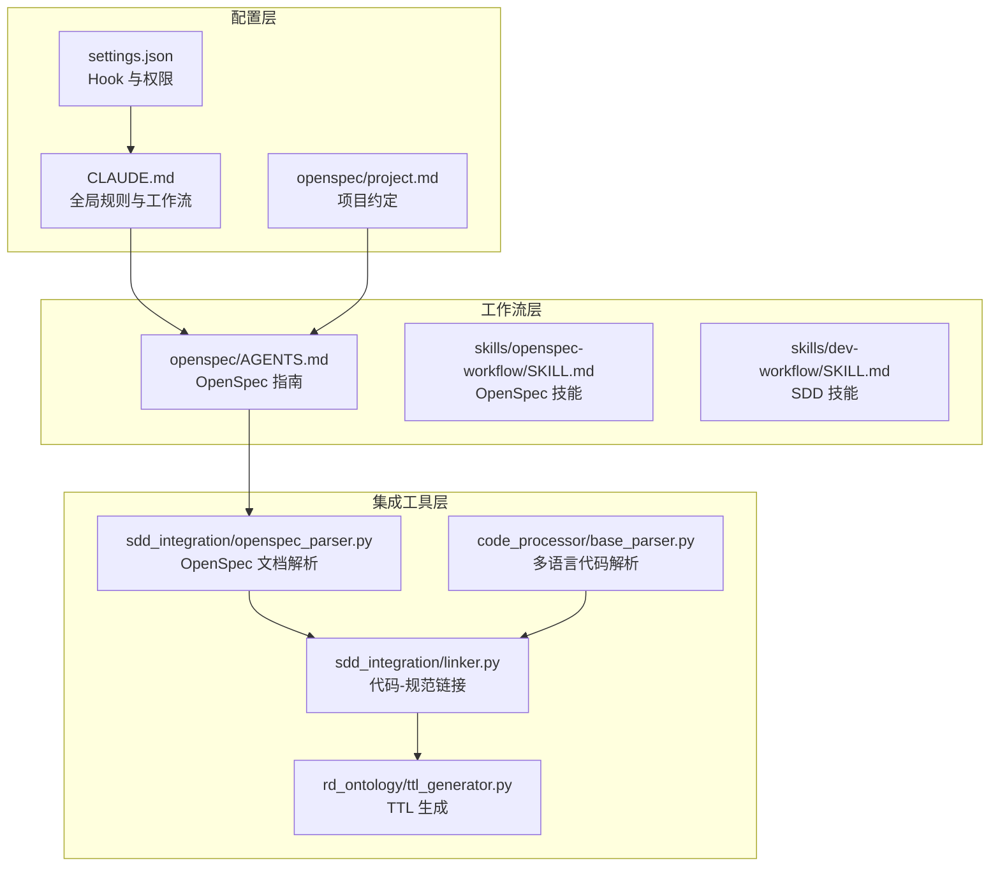
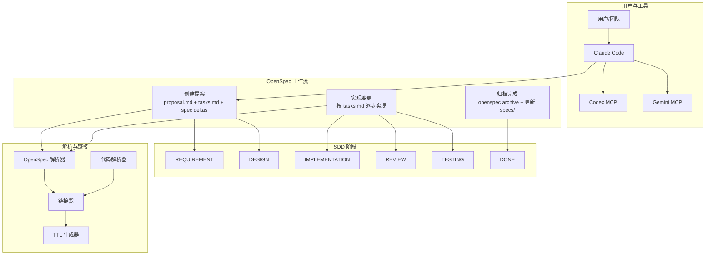
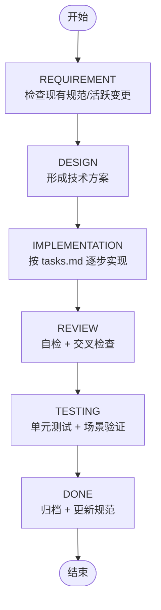
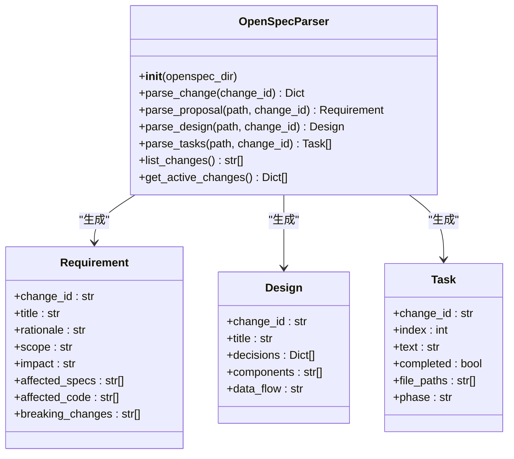
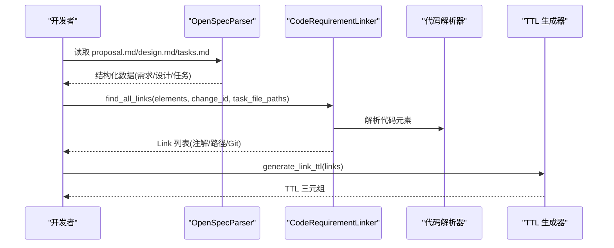
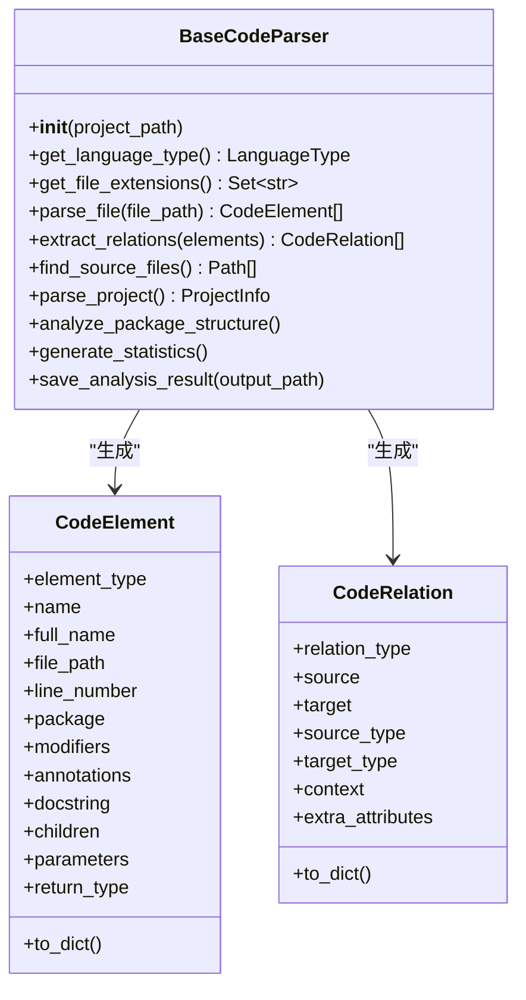
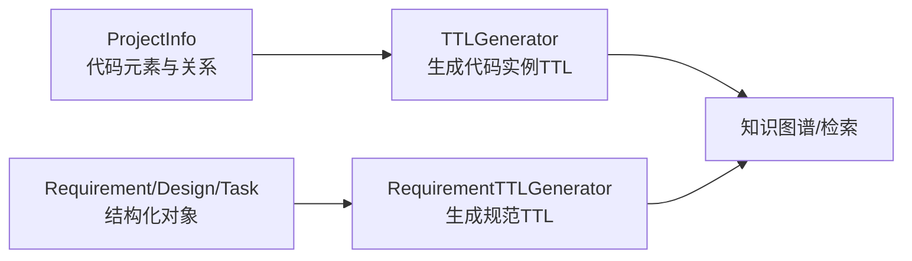
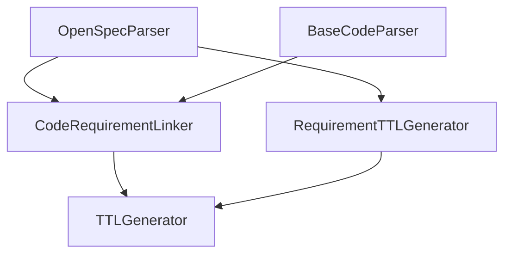

# 规范驱动开发 (SDD)

<cite>
**本文引用的文件**
- [README.md](file://README.md)
- [CLAUDE.md](file://CLAUDE.md)
- [openspec/AGENTS.md](file://openspec/AGENTS.md)
- [openspec/specs/claudecode-openspec-integration/spec.md](file://openspec/specs/claudecode-openspec-integration/spec.md)
- [openspec/changes/add-code-ontology-capability/proposal.md](file://openspec/changes/add-code-ontology-capability/proposal.md)
- [openspec/changes/archive/2026-01-22-add-claudecode-openspec-workflow/proposal.md](file://openspec/changes/archive/2026-01-22-add-claudecode-openspec-workflow/proposal.md)
- [sdd_integration/openspec_parser.py](file://sdd_integration/openspec_parser.py)
- [sdd_integration/linker.py](file://sdd_integration/linker.py)
- [code_processor/base_parser.py](file://code_processor/base_parser.py)
- [rd_ontology/ttl_generator.py](file://rd_ontology/ttl_generator.py)
- [skills/dev-workflow/SKILL.md](file://skills/dev-workflow/SKILL.md)
- [skills/openspec-workflow/SKILL.md](file://skills/openspec-workflow/SKILL.md)
- [global/codex-skills/subagent-driven-development/SKILL.md](file://global/codex-skills/subagent-driven-development/SKILL.md)
- [settings.json](file://settings.json)
- [openspec/project.md](file://openspec/project.md)
</cite>

## 目录
1. [引言](#引言)
2. [项目结构](#项目结构)
3. [核心组件](#核心组件)
4. [架构总览](#架构总览)
5. [详细组件分析](#详细组件分析)
6. [依赖分析](#依赖分析)
7. [性能考量](#性能考量)
8. [故障排查指南](#故障排查指南)
9. [结论](#结论)
10. [附录](#附录)

## 引言
本文件系统化阐述规范驱动开发（SDD）在本项目的落地实践，围绕 OpenSpec 集成的三阶段工作流（提案创建、变更实现、归档完成）与 6 阶段开发流程（REQUIREMENT、DESIGN、IMPLEMENTATION、REVIEW、TESTING、DONE）展开，覆盖变更提案管理、规范版本控制与工作流自动化，并提供项目案例与最佳实践，帮助团队在实际工程中高效实施 SDD。

## 项目结构
本项目以“配置模板 + 工作流 + 集成工具”三层组织：
- 配置层：CLAUDE.md、settings.json、openspec/project.md 等，定义全局规则、项目约定与工具集成。
- 工作流层：openspec/AGENTS.md、skills/openspec-workflow/SKILL.md、skills/dev-workflow/SKILL.md，提供 OpenSpec 与 SDD 的阶段化流程与目录规范。
- 集成工具层：sdd_integration/*、code_processor/*、rd_ontology/*，负责 OpenSpec 文档解析、代码-规范链接与 TTL 生成，支撑规范版本控制与知识图谱化。

**图表来源**
- [CLAUDE.md](file://CLAUDE.md#L1-L440)
- [settings.json](file://settings.json#L1-L37)
- [openspec/project.md](file://openspec/project.md#L1-L65)
- [openspec/AGENTS.md](file://openspec/AGENTS.md#L1-L457)
- [skills/openspec-workflow/SKILL.md](file://skills/openspec-workflow/SKILL.md#L1-L231)
- [skills/dev-workflow/SKILL.md](file://skills/dev-workflow/SKILL.md#L1-L397)
- [sdd_integration/openspec_parser.py](file://sdd_integration/openspec_parser.py#L1-L249)
- [sdd_integration/linker.py](file://sdd_integration/linker.py#L1-L324)
- [code_processor/base_parser.py](file://code_processor/base_parser.py#L1-L358)
- [rd_ontology/ttl_generator.py](file://rd_ontology/ttl_generator.py#L1-L321)

**章节来源**
- [README.md](file://README.md#L1-L229)
- [CLAUDE.md](file://CLAUDE.md#L174-L184)
- [openspec/project.md](file://openspec/project.md#L1-L65)

## 核心组件
- OpenSpec 工作流与规范管理：通过 openspec/AGENTS.md 与 skills/openspec-workflow/SKILL.md，定义提案创建、任务跟踪、验证与归档的完整流程，确保“规范先行、阶段受控、可追溯可审计”。
- SDD 阶段化流程：skills/dev-workflow/SKILL.md 明确 REQUIREMENT → DESIGN → IMPLEMENTATION → REVIEW → TESTING → DONE 的严格顺序与前置条件。
- OpenSpec 文档解析：sdd_integration/openspec_parser.py 将 proposal.md/design.md/tasks.md 解析为结构化对象，支撑后续链接与 TTL 生成。
- 代码-规范链接：sdd_integration/linker.py 基于注解、任务文件路径与 Git 提交，将代码元素与变更需求建立可信链接。
- 代码解析与 TTL 生成：code_processor/base_parser.py 提供多语言抽象与统计；rd_ontology/ttl_generator.py 将代码与 OpenSpec 结构化对象转为 TTL，接入知识图谱。
- 全局规则与自动化：CLAUDE.md 定义 OpenSpec 自动工作流与工具使用规范；settings.json 配置 Hook 与权限，实现工作流自动化。

**章节来源**
- [openspec/AGENTS.md](file://openspec/AGENTS.md#L15-L65)
- [skills/openspec-workflow/SKILL.md](file://skills/openspec-workflow/SKILL.md#L1-L231)
- [skills/dev-workflow/SKILL.md](file://skills/dev-workflow/SKILL.md#L28-L50)
- [sdd_integration/openspec_parser.py](file://sdd_integration/openspec_parser.py#L51-L86)
- [sdd_integration/linker.py](file://sdd_integration/linker.py#L35-L68)
- [code_processor/base_parser.py](file://code_processor/base_parser.py#L206-L298)
- [rd_ontology/ttl_generator.py](file://rd_ontology/ttl_generator.py#L18-L60)
- [CLAUDE.md](file://CLAUDE.md#L26-L99)
- [settings.json](file://settings.json#L13-L35)

## 架构总览
OpenSpec 与 SDD 的集成架构以“规范即契约、文档即上下文”为核心，通过 CLI 与技能系统驱动，贯穿提案、实现与归档全过程，并与代码解析、链接与 TTL 生成形成闭环。

**图表来源**
- [CLAUDE.md](file://CLAUDE.md#L220-L284)
- [openspec/AGENTS.md](file://openspec/AGENTS.md#L123-L141)
- [sdd_integration/openspec_parser.py](file://sdd_integration/openspec_parser.py#L51-L86)
- [sdd_integration/linker.py](file://sdd_integration/linker.py#L35-L68)
- [code_processor/base_parser.py](file://code_processor/base_parser.py#L206-L298)
- [rd_ontology/ttl_generator.py](file://rd_ontology/ttl_generator.py#L18-L60)

## 详细组件分析

### OpenSpec 三阶段工作流与 6 阶段开发流程
- 三阶段映射
  - Stage 1：创建提案 → REQUIREMENT + DESIGN
  - Stage 2：实现变更 → IMPLEMENTATION + REVIEW + TESTING
  - Stage 3：归档完成 → DONE
- 6 阶段输出物
  - REQUIREMENT：proposal.md、spec deltas
  - DESIGN：design.md（可选）
  - IMPLEMENTATION：源代码、tasks.md 状态更新
  - REVIEW：交叉检查完成
  - TESTING：测试通过、测试报告
  - DONE：specs/ 更新、changes/archive/ 移动

**图表来源**
- [CLAUDE.md](file://CLAUDE.md#L220-L284)
- [skills/dev-workflow/SKILL.md](file://skills/dev-workflow/SKILL.md#L28-L50)
- [openspec/AGENTS.md](file://openspec/AGENTS.md#L49-L64)

**章节来源**
- [CLAUDE.md](file://CLAUDE.md#L220-L284)
- [skills/dev-workflow/SKILL.md](file://skills/dev-workflow/SKILL.md#L28-L50)
- [openspec/AGENTS.md](file://openspec/AGENTS.md#L49-L64)

### OpenSpec 文档解析（OpenSpecParser）
- 功能：解析 proposal.md、design.md、tasks.md，提取需求、设计与任务信息，支持任务阶段标注与文件路径抽取。
- 关键点：按 change-id 组织结构化数据，提供 list_changes 与 get_active_changes，便于批量处理与状态查询。

**图表来源**
- [sdd_integration/openspec_parser.py](file://sdd_integration/openspec_parser.py#L17-L197)

**章节来源**
- [sdd_integration/openspec_parser.py](file://sdd_integration/openspec_parser.py#L51-L86)
- [sdd_integration/openspec_parser.py](file://sdd_integration/openspec_parser.py#L88-L197)

### 代码-规范链接（CodeRequirementLinker）
- 方法：注解匹配（@spec）、任务文件路径匹配、Git 提交引用、去重合并，生成 Link 列表。
- TTL 输出：将链接转换为 TTL 三元组，用于知识图谱构建与检索。

**图表来源**
- [sdd_integration/linker.py](file://sdd_integration/linker.py#L47-L68)
- [code_processor/base_parser.py](file://code_processor/base_parser.py#L206-L298)
- [rd_ontology/ttl_generator.py](file://rd_ontology/ttl_generator.py#L225-L241)

**章节来源**
- [sdd_integration/linker.py](file://sdd_integration/linker.py#L35-L68)
- [sdd_integration/linker.py](file://sdd_integration/linker.py#L113-L212)
- [rd_ontology/ttl_generator.py](file://rd_ontology/ttl_generator.py#L225-L241)

### 多语言代码解析（BaseCodeParser）
- 能力：统一接口与抽象实现，支持 Java、Python、JavaScript/TypeScript 等；提供文件扫描、关系抽取、包结构分析与统计。
- 价值：为链接与 TTL 生成提供稳定的数据源。

**图表来源**
- [code_processor/base_parser.py](file://code_processor/base_parser.py#L206-L358)

**章节来源**
- [code_processor/base_parser.py](file://code_processor/base_parser.py#L206-L298)

### TTL 生成与规范版本控制
- TTLGenerator：将 CodeElement/CodeRelation 转换为 TTL，支持稳定 ID 与属性转义。
- RequirementTTLGenerator：为 OpenSpec 的 Requirement/Design/Task 生成 TTL，支撑规范版本控制与检索。

**图表来源**
- [rd_ontology/ttl_generator.py](file://rd_ontology/ttl_generator.py#L18-L60)
- [rd_ontology/ttl_generator.py](file://rd_ontology/ttl_generator.py#L231-L321)

**章节来源**
- [rd_ontology/ttl_generator.py](file://rd_ontology/ttl_generator.py#L18-L60)
- [rd_ontology/ttl_generator.py](file://rd_ontology/ttl_generator.py#L231-L321)

### OpenSpec 规范与集成规范
- claudecode-openspec-integration/spec.md：定义 Claude Code 如何自动集成 OpenSpec，实现“实现前规范检查”“提案触发检测”“命令集成”“一致性检查”。
- add-code-ontology-capability/proposal.md：展示将代码分析能力与规范驱动工作流整合的架构与集成点。
- archive/2026-01-22-add-claudecode-openspec-workflow/proposal.md：自动化 OpenSpec 意识与工作流集成的背景与影响。

**章节来源**
- [openspec/specs/claudecode-openspec-integration/spec.md](file://openspec/specs/claudecode-openspec-integration/spec.md#L1-L54)
- [openspec/changes/add-code-ontology-capability/proposal.md](file://openspec/changes/add-code-ontology-capability/proposal.md#L1-L86)
- [openspec/changes/archive/2026-01-22-add-claudecode-openspec-workflow/proposal.md](file://openspec/changes/archive/2026-01-22-add-claudecode-openspec-workflow/proposal.md#L1-L23)

### 子代理驱动开发（Subagent-Driven Development）
- 通过“每任务一个子代理 + 两阶段审查（规范符合性 → 代码质量）”实现高质量、快速迭代。
- 与 OpenSpec 的 IMPLEMENTATION/REVIEW/TESTING 阶段高度契合，确保每个任务在提交前均满足规范与质量双关卡。

**章节来源**
- [global/codex-skills/subagent-driven-development/SKILL.md](file://global/codex-skills/subagent-driven-development/SKILL.md#L1-L241)

## 依赖分析
- 组件耦合
  - OpenSpecParser 依赖 openspec/ 目录结构，输出结构化对象供 Linker 使用。
  - Linker 依赖 CodeRequirementLinker 与 Code 元素解析结果，生成 TTL。
  - TTL 生成器依赖 CodeElement/CodeRelation 与 Requirement/Design/Task 的结构化对象。
- 外部依赖
  - Claude Code CLI、MCP 工具（Codex、Gemini）、OpenSpec CLI。
  - Git 用于变更追踪与提交引用。

**图表来源**
- [sdd_integration/openspec_parser.py](file://sdd_integration/openspec_parser.py#L51-L86)
- [sdd_integration/linker.py](file://sdd_integration/linker.py#L35-L68)
- [code_processor/base_parser.py](file://code_processor/base_parser.py#L206-L298)
- [rd_ontology/ttl_generator.py](file://rd_ontology/ttl_generator.py#L18-L60)

**章节来源**
- [sdd_integration/openspec_parser.py](file://sdd_integration/openspec_parser.py#L51-L86)
- [sdd_integration/linker.py](file://sdd_integration/linker.py#L35-L68)
- [code_processor/base_parser.py](file://code_processor/base_parser.py#L206-L298)
- [rd_ontology/ttl_generator.py](file://rd_ontology/ttl_generator.py#L18-L60)

## 性能考量
- 解析性能
  - BaseCodeParser 的文件扫描与关系抽取在大型代码库中可能成为瓶颈，建议按模块分治或增量解析。
- 链接效率
  - Linker 的注解与路径匹配为线性扫描，Git 提交解析受历史长度影响，建议在 CI 中缓存解析结果。
- TTL 生成
  - TTL 生成器对大规模 ProjectInfo 的序列化与字符串转义开销可控，注意磁盘 IO 与内存占用。

[本节为通用性能建议，不直接分析具体文件]

## 故障排查指南
- OpenSpec 验证失败
  - 常见错误：缺少增量、场景格式不正确。使用 `openspec validate <change> --strict --no-interactive` 定位问题。
- 任务状态未更新
  - 确保 tasks.md 中任务完成后标记为 `[x]`，并在实现后进行一致性检查。
- 工具使用异常
  - 检查 MCP 工具安装与连接状态，确保 CLAUDE.md 中的工具调用规范得到遵循。
- Hook 未触发
  - 检查 settings.json 中的 Hook 配置与权限，确认命令路径正确。

**章节来源**
- [openspec/AGENTS.md](file://openspec/AGENTS.md#L289-L317)
- [settings.json](file://settings.json#L13-L35)
- [CLAUDE.md](file://CLAUDE.md#L359-L391)

## 结论
本项目通过 OpenSpec 与 SDD 的深度融合，建立了“规范先行、阶段受控、可追溯可审计”的工程体系。借助结构化解析、代码-规范链接与 TTL 生成，实现了从需求到实现再到归档的全生命周期管理。结合子代理驱动开发与多 AI 协同，可在复杂业务场景中显著提升交付质量与效率。

## 附录
- 术语
  - OpenSpec：规范驱动开发工作流工具，提供提案、任务与验证的 CLI 与目录规范。
  - SDD：规范驱动开发，强调以规范为源，分阶段推进与验证。
  - TTL：三元组语言，用于知识图谱表示与检索。
- 迁移建议
  - 从传统开发到 SDD：先以小范围功能试点 OpenSpec，逐步推广到全团队；在 CLAUDE.md 中固化 OpenSpec 自动工作流与工具使用规范；通过 Hook 与技能系统降低人工负担。
- 最佳实践
  - 严格遵循 6 阶段流程与目录规范，确保每个阶段有明确输出物与验收标准。
  - 在 IMPLEMENTATION 阶段采用子代理驱动开发，两阶段审查保障质量。
  - 利用 TTL 生成与链接，构建规范与代码的知识图谱，支持变更影响分析与智能检索。