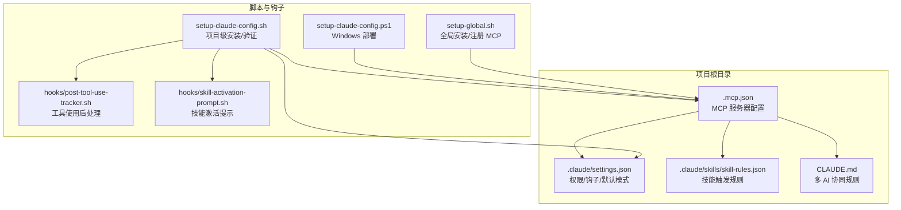
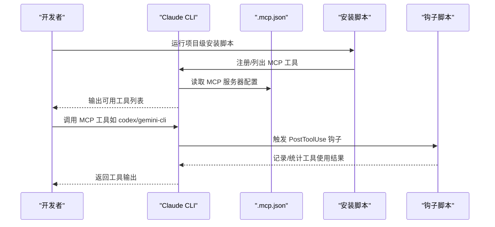
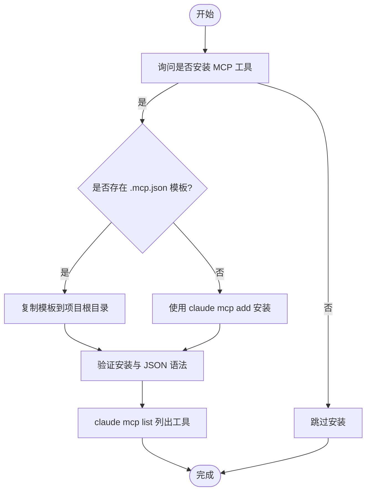
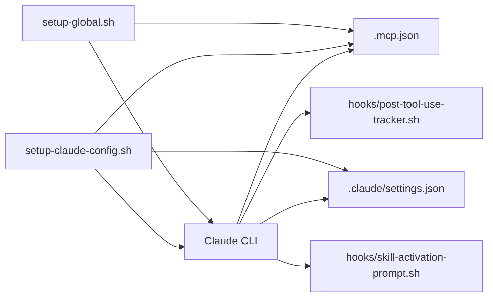

# MCP 工具配置

<cite>
**本文引用的文件**
- [.mcp.json](file://.mcp.json)
- [README.md](file://README.md)
- [settings.json](file://settings.json)
- [setup-claude-config.sh](file://setup-claude-config.sh)
- [setup-global.sh](file://setup-global.sh)
- [hooks/post-tool-use-tracker.sh](file://hooks/post-tool-use-tracker.sh)
- [hooks/skill-activation-prompt.sh](file://hooks/skill-activation-prompt.sh)
- [global/CLAUDE.md](file://global/CLAUDE.md)
- [skills/skill-rules.json](file://skills/skill-rules.json)
- [setup-claude-config.ps1](file://setup-claude-config.ps1)
</cite>

## 目录
1. [简介](#简介)
2. [项目结构](#项目结构)
3. [核心组件](#核心组件)
4. [架构总览](#架构总览)
5. [组件详解](#组件详解)
6. [依赖关系分析](#依赖关系分析)
7. [性能与可靠性](#性能与可靠性)
8. [故障排查指南](#故障排查指南)
9. [结论](#结论)
10. [附录](#附录)

## 简介
本文件系统化阐述 MCP 工具配置体系，聚焦于 .mcp.json 的结构与作用，覆盖 Codex、Gemini 等 MCP 工具的连接参数、认证与使用规范；详述工具配置格式、参数语义与安全设置；提供新增工具、配置权限与管理会话的方法；包含配置验证、连接测试与故障排除策略，并给出最佳实践与安全建议。

## 项目结构
围绕 MCP 工具配置的关键文件与脚本如下：
- .mcp.json：MCP 服务器清单与启动参数
- README.md：MCP 工具列表与安装指引
- settings.json：项目级权限、钩子与通用设置
- setup-claude-config.sh / setup-claude-config.ps1：项目级部署与 MCP 安装/验证
- setup-global.sh：全局安装与 MCP 工具注册
- hooks/post-tool-use-tracker.sh / hooks/skill-activation-prompt.sh：工具使用后的钩子与提示
- global/CLAUDE.md：多 AI 协同与工具使用规则
- skills/skill-rules.json：技能触发与多 AI 协同的上下文

图表来源
- [.mcp.json](file://.mcp.json#L1-L19)
- [settings.json](file://settings.json#L1-L37)
- [setup-claude-config.sh](file://setup-claude-config.sh#L240-L372)
- [setup-claude-config.ps1](file://setup-claude-config.ps1#L1-L200)
- [setup-global.sh](file://setup-global.sh#L220-L265)
- [hooks/post-tool-use-tracker.sh](file://hooks/post-tool-use-tracker.sh#L1-L178)
- [hooks/skill-activation-prompt.sh](file://hooks/skill-activation-prompt.sh#L1-L6)
- [global/CLAUDE.md](file://global/CLAUDE.md#L60-L95)
- [skills/skill-rules.json](file://skills/skill-rules.json#L1-L250)

章节来源
- [.mcp.json](file://.mcp.json#L1-L19)
- [README.md](file://README.md#L123-L139)
- [setup-claude-config.sh](file://setup-claude-config.sh#L240-L372)
- [setup-global.sh](file://setup-global.sh#L220-L265)
- [hooks/post-tool-use-tracker.sh](file://hooks/post-tool-use-tracker.sh#L1-L178)
- [hooks/skill-activation-prompt.sh](file://hooks/skill-activation-prompt.sh#L1-L6)
- [global/CLAUDE.md](file://global/CLAUDE.md#L60-L95)
- [skills/skill-rules.json](file://skills/skill-rules.json#L1-L250)

## 核心组件
- MCP 服务器清单（.mcp.json）
  - 结构：顶层键为 mcpServers，值为对象映射，每个键代表一个 MCP 服务器别名（如 codex、gemini-cli）
  - 关键字段：
    - type：传输类型，示例中为 stdio
    - command：主命令
    - args：命令参数数组
    - env：环境变量对象（示例为空）
- 权限与钩子（settings.json）
  - enableAllProjectMcpServers：是否允许项目级所有 MCP 服务器
  - permissions.allow：允许的工具操作集合（如 Edit:*、Write:* 等）
  - permissions.defaultMode：默认编辑接受模式
  - hooks.UserPromptSubmit / PostToolUse：事件钩子配置，支持命令型钩子
- 全局规则（global/CLAUDE.md）
  - 明确“强制使用工具”的规则与多 AI 分工
  - 强调工具是顾问角色，需在最终答案前调用相应 MCP 工具
- 技能触发（skills/skill-rules.json）
  - 定义技能触发关键词、意图正则、文件路径匹配与优先级
  - 与多 AI 协同形成上下文联动

章节来源
- [.mcp.json](file://.mcp.json#L1-L19)
- [settings.json](file://settings.json#L1-L37)
- [global/CLAUDE.md](file://global/CLAUDE.md#L60-L95)
- [skills/skill-rules.json](file://skills/skill-rules.json#L1-L250)

## 架构总览
MCP 工具配置由“配置文件 + 安装脚本 + 钩子 + 规则”构成，整体交互如下：

图表来源
- [setup-claude-config.sh](file://setup-claude-config.sh#L240-L372)
- [setup-global.sh](file://setup-global.sh#L220-L265)
- [.mcp.json](file://.mcp.json#L1-L19)
- [hooks/post-tool-use-tracker.sh](file://hooks/post-tool-use-tracker.sh#L1-L178)

## 组件详解

### .mcp.json：MCP 服务器配置
- 结构与字段
  - mcpServers：服务器别名到连接参数的映射
  - 每个服务器对象包含：
    - type：传输类型（示例为 stdio）
    - command：可执行命令（如 codex、npx）
    - args：命令行参数数组（如 ["mcp-server"]、["-y", "gemini-mcp-tool"]）
    - env：环境变量对象（示例为空）
- 示例与含义
  - codex：通过 stdio 启动本地 codex mcp-server
  - gemini-cli：通过 stdio 启动 npx -y gemini-mcp-tool
- 安全与认证
  - 示例未包含密钥或令牌字段，表明默认不内嵌认证信息
  - 如需认证，应在外部环境或工具侧配置（例如通过环境变量或工具自身的凭据机制）

章节来源
- [.mcp.json](file://.mcp.json#L1-L19)

### 安装与部署脚本：setup-claude-config.sh / setup-claude-config.ps1 / setup-global.sh
- 功能概览
  - 项目级安装：复制 .mcp.json 模板、安装/验证 MCP 工具、校验 JSON 有效性、检查目录结构与 CLAUDE.md
  - 全局安装：注册用户级 MCP 工具（codex、gemini-cli），同步技能与配置
  - Windows 脚本：提供等价的 PowerShell 部署流程
- 关键流程
  - 询问是否安装 MCP 工具
  - 若存在 .mcp.json 模板则直接复制，否则回退到 claude mcp add 命令
  - 安装后执行 claude mcp list 验证
  - 校验 .claude/skills/skill-rules.json 与 .claude/settings.json 的 JSON 语法

图表来源
- [setup-claude-config.sh](file://setup-claude-config.sh#L240-L372)
- [setup-claude-config.ps1](file://setup-claude-config.ps1#L1-L200)
- [setup-global.sh](file://setup-global.sh#L220-L265)

章节来源
- [setup-claude-config.sh](file://setup-claude-config.sh#L240-L372)
- [setup-claude-config.ps1](file://setup-claude-config.ps1#L1-L200)
- [setup-global.sh](file://setup-global.sh#L220-L265)

### 权限与钩子：settings.json
- 权限
  - allow：允许的操作前缀集合（如 Edit:*、Write:*、MultiEdit:*、NotebookEdit:*、Bash:*）
  - defaultMode：默认编辑接受模式（如 acceptEdits）
- 钩子
  - UserPromptSubmit：提交用户提示后触发命令型钩子
  - PostToolUse：工具使用后触发命令型钩子（按匹配器过滤）
- 安全建议
  - 限制 allow 列表以最小权限原则
  - 对钩子命令进行白名单与路径校验
  - 避免在 env 中直接注入敏感信息，改用外部凭据管理

章节来源
- [settings.json](file://settings.json#L1-L37)
- [hooks/post-tool-use-tracker.sh](file://hooks/post-tool-use-tracker.sh#L1-L178)
- [hooks/skill-activation-prompt.sh](file://hooks/skill-activation-prompt.sh#L1-L6)

### 全局规则与多 AI 协同：global/CLAUDE.md
- 强制使用工具：对非平凡任务，必须在给出最终答案前调用相应 MCP 工具
- 角色分工：Claude 协调者、Codex 高级工程师、Gemini 大文本分析师
- 交叉检查：不同执行器之间互相交叉检查
- 语言规范：正式表达使用英文，日常沟通使用中文

章节来源
- [global/CLAUDE.md](file://global/CLAUDE.md#L60-L95)

### 技能触发与上下文联动：skills/skill-rules.json
- 触发机制：关键词、意图正则、文件路径匹配与内容模式
- 优先级：critical/high/medium/low
- 与多 AI 协同：配置中明确支持通过 MCP 与 Codex/Gemini 协作

章节来源
- [skills/skill-rules.json](file://skills/skill-rules.json#L1-L250)

## 依赖关系分析
- 配置依赖
  - .mcp.json 依赖 Claude CLI 的 MCP 子命令进行注册与调用
  - settings.json 依赖 .claude 目录结构与钩子脚本
- 脚本依赖
  - setup-claude-config.sh 依赖 claude、npx、python3（JSON 校验）
  - setup-global.sh 依赖 claude、codex、gemini（工具同步）
- 钩子依赖
  - post-tool-use-tracker.sh 依赖 jq、构建/类型检查命令（如 tsc、prisma）
  - skill-activation-prompt.sh 依赖 tsx

图表来源
- [setup-claude-config.sh](file://setup-claude-config.sh#L240-L372)
- [setup-global.sh](file://setup-global.sh#L220-L265)
- [.mcp.json](file://.mcp.json#L1-L19)
- [settings.json](file://settings.json#L1-L37)
- [hooks/post-tool-use-tracker.sh](file://hooks/post-tool-use-tracker.sh#L1-L178)
- [hooks/skill-activation-prompt.sh](file://hooks/skill-activation-prompt.sh#L1-L6)

章节来源
- [setup-claude-config.sh](file://setup-claude-config.sh#L240-L372)
- [setup-global.sh](file://setup-global.sh#L220-L265)

## 性能与可靠性
- 连接与传输
  - stdio 传输简单可靠，适合本地工具；网络传输可考虑超时与重试策略
- 工具并发
  - 合理安排工具调用顺序，避免资源争用（如构建命令）
- 钩子开销
  - 钩子脚本应尽量轻量，避免阻塞主流程
- 配置缓存
  - 工具使用后统计可落地到项目缓存目录，便于后续分析与增量构建

[本节为通用指导，无需特定文件引用]

## 故障排查指南
- 安装与注册
  - 确认 Claude CLI 可用且版本兼容
  - 使用 claude mcp list 检查工具是否成功注册
  - 若无 .mcp.json 模板，回退到 claude mcp add 手动安装
- JSON 校验
  - 使用 python3 -m json.tool 校验 .claude/settings.json 与 .claude/skills/skill-rules.json
- 权限问题
  - 检查 settings.json 的 permissions.allow 是否包含所需操作
  - 确认 defaultMode 符合预期
- 钩子问题
  - 确保钩子脚本具备可执行权限
  - 检查钩子命令依赖（如 jq、tsx、构建工具）是否安装
- 工具不可用
  - 核对 .mcp.json 中的 command 与 args 是否正确
  - 确认外部工具（如 codex、npx、gemini-mcp-tool）已正确安装与 PATH 可达

章节来源
- [setup-claude-config.sh](file://setup-claude-config.sh#L285-L372)
- [setup-claude-config.ps1](file://setup-claude-config.ps1#L1-L200)
- [settings.json](file://settings.json#L1-L37)
- [hooks/post-tool-use-tracker.sh](file://hooks/post-tool-use-tracker.sh#L1-L178)

## 结论
本配置体系通过 .mcp.json 明确 MCP 工具的连接与启动参数，结合 settings.json 的权限与钩子机制，辅以全局规则与技能触发，形成“可配置、可验证、可审计”的多 AI 协同框架。遵循最小权限、外部凭据管理与脚本健壮性原则，可在保证安全性的同时提升开发效率。

[本节为总结，无需特定文件引用]

## 附录

### 添加新的 MCP 工具步骤
- 方式一：编辑 .mcp.json
  - 在 mcpServers 下新增条目，设置 type、command、args、env
  - 保存后运行 claude mcp list 验证
- 方式二：使用 claude mcp add
  - 选择作用域（用户级或项目级）
  - 指定传输类型与命令参数
  - 成功后运行 claude mcp list 校验

章节来源
- [README.md](file://README.md#L123-L139)
- [setup-claude-config.sh](file://setup-claude-config.sh#L240-L282)
- [setup-global.sh](file://setup-global.sh#L220-L265)

### 配置工具权限与管理会话
- 权限
  - 在 settings.json 的 permissions.allow 中添加所需操作前缀
  - 根据需要调整 defaultMode
- 会话
  - 钩子脚本可基于 session_id 维护会话级缓存与统计
  - 建议在工具调用前后记录会话标识以便追踪

章节来源
- [settings.json](file://settings.json#L1-L37)
- [hooks/post-tool-use-tracker.sh](file://hooks/post-tool-use-tracker.sh#L1-L178)

### 验证与测试
- 验证清单
  - claude mcp list：确认工具注册状态
  - JSON 语法：python3 -m json.tool 校验
  - 目录结构：.claude/skills、.claude/hooks、.devos/tasks 等
  - CLAUDE.md：确保存在并符合预期
- 测试建议
  - 先在小范围项目验证 .mcp.json 与 settings.json
  - 使用简单任务验证工具链路（如小文件写入、简单分析）

章节来源
- [setup-claude-config.sh](file://setup-claude-config.sh#L285-L372)

### 最佳实践与安全建议
- 最小权限
  - 仅授予必要的 allow 权限，避免通配符滥用
- 凭据管理
  - 将密钥与令牌置于环境变量或外部凭据系统，不在 .mcp.json 或 settings.json 中硬编码
- 钩子安全
  - 严格校验钩子命令路径与参数，避免命令注入
- 可观测性
  - 利用钩子脚本记录工具使用轨迹，结合会话标识进行审计
- 文档与规则
  - 依据 global/CLAUDE.md 的多 AI 协同规则，确保工具使用符合流程

章节来源
- [settings.json](file://settings.json#L1-L37)
- [global/CLAUDE.md](file://global/CLAUDE.md#L60-L95)
- [hooks/post-tool-use-tracker.sh](file://hooks/post-tool-use-tracker.sh#L1-L178)