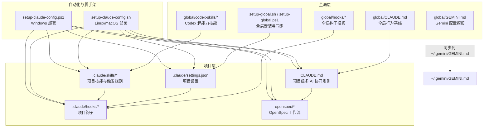
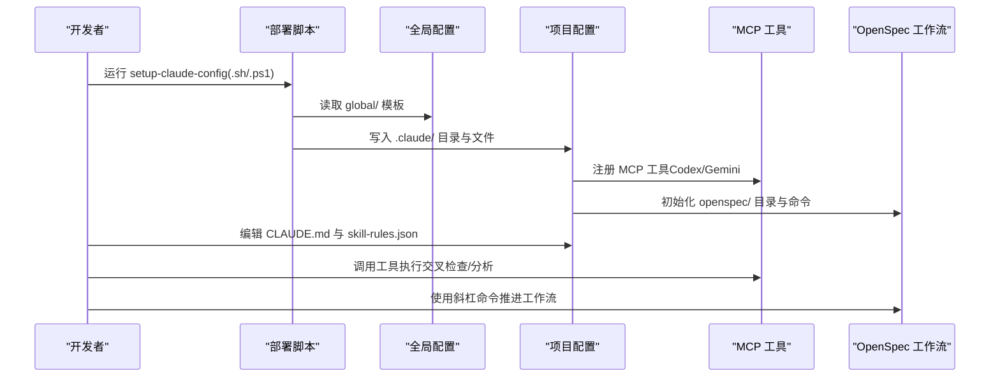
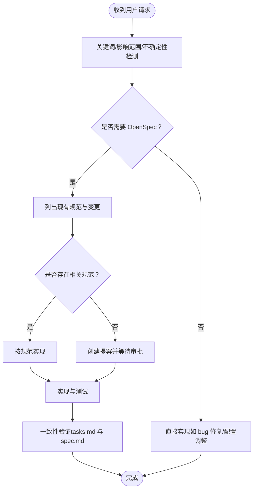
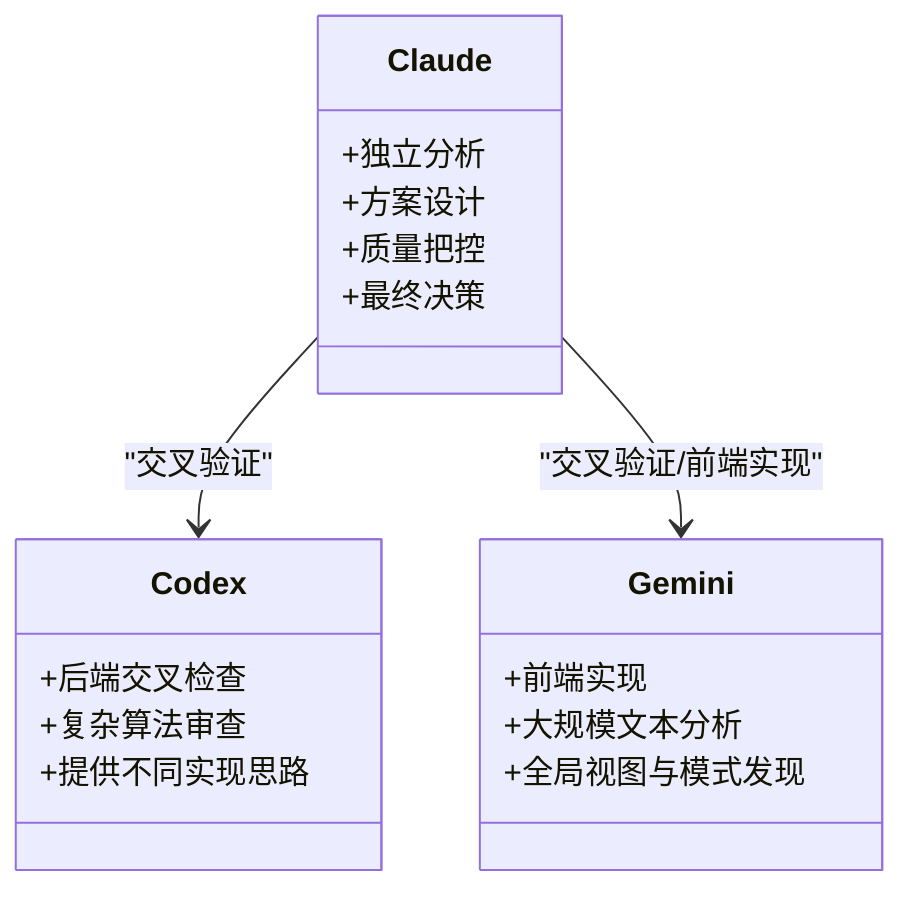
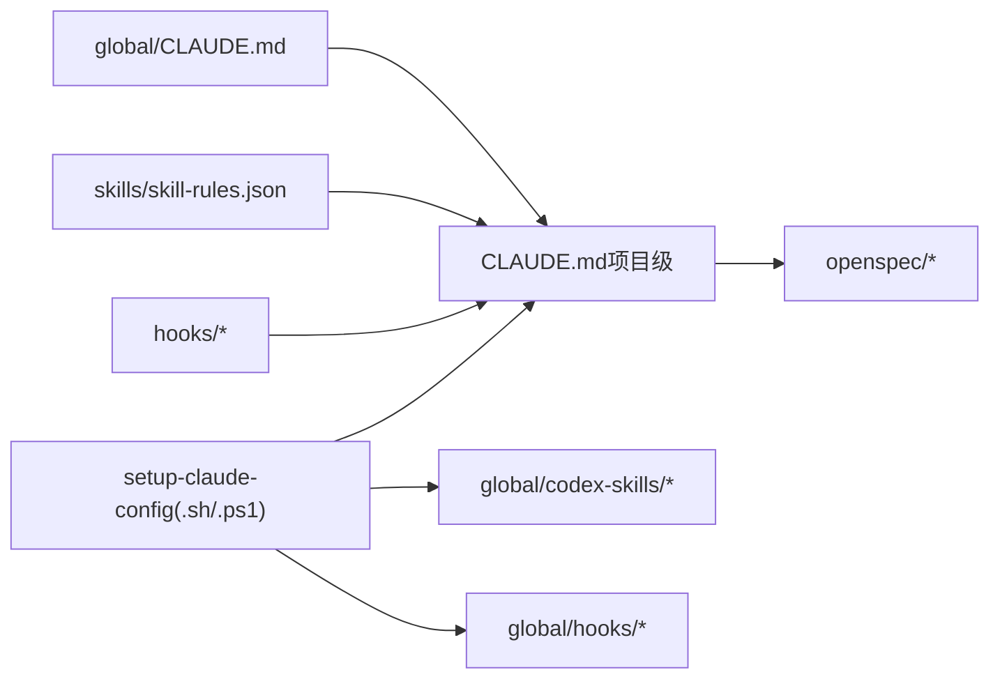

# 全局配置

<cite>
**本文引用的文件**
- [CLAUDE.md（项目级）](file://CLAUDE.md)
- [CLAUDE.md（全局）](file://global/CLAUDE.md)
- [settings.json](file://settings.json)
- [setup-claude-config.sh](file://setup-claude-config.sh)
- [setup-claude-config.ps1](file://setup-claude-config.ps1)
- [setup-global.sh](file://setup-global.sh)
- [setup-global.ps1](file://setup-global.ps1)
- [skill-rules.json](file://skills/skill-rules.json)
- [skill-activation-prompt.sh](file://hooks/skill-activation-prompt.sh)
- [post-tool-use-tracker.sh](file://hooks/post-tool-use-tracker.sh)
- [openspec 工作流规范](file://openspec/specs/claudecode-openspec-integration/spec.md)
- [OpenSpec 指南](file://openspec/AGENTS.md)
- [子代理驱动开发 SKILL](file://global/codex-skills/subagent-driven-development/SKILL.md)
- [写作技能 SKILL](file://global/codex-skills/writing-skills/SKILL.md)
- [ontology_client 配置](file://ontology_client/config.py)
</cite>

## 目录
1. [简介](#简介)
2. [项目结构](#项目结构)
3. [核心组件](#核心组件)
4. [架构总览](#架构总览)
5. [详细组件分析](#详细组件分析)
6. [依赖分析](#依赖分析)
7. [性能考量](#性能考量)
8. [故障排查指南](#故障排查指南)
9. [结论](#结论)
10. [附录](#附录)

## 简介
本文件系统化阐述全局配置体系，聚焦 CLAUDE.md 全局配置文件的结构与作用，覆盖 OpenSpec 工作流规则、多 AI 协同机制、角色分工规范、交叉检查规则等核心配置，并详解配置加载机制、优先级与继承关系。同时提供自定义规则、调整工作流参数、新增配置项的方法，以及配置验证、错误诊断与最佳实践，最后给出不同项目场景的模板与安全注意事项。

## 项目结构
全局配置体系围绕“全局 CLAUDE.md + 项目 CLAUDE.md + 设置与脚手架 + 技能与钩子 + OpenSpec 工作流”展开，形成“全局基线 + 项目定制 + 自动化部署”的三层结构。

图表来源
- [CLAUDE.md（项目级）](file://CLAUDE.md#L1-L440)
- [CLAUDE.md（全局）](file://global/CLAUDE.md#L1-L147)
- [settings.json](file://settings.json#L1-L37)
- [setup-claude-config.sh](file://setup-claude-config.sh#L1-L372)
- [setup-claude-config.ps1](file://setup-claude-config.ps1#L1-L385)
- [setup-global.sh](file://setup-global.sh#L1-L471)
- [setup-global.ps1](file://setup-global.ps1#L1-L470)

章节来源
- [CLAUDE.md（项目级）](file://CLAUDE.md#L1-L440)
- [CLAUDE.md（全局）](file://global/CLAUDE.md#L1-L147)
- [settings.json](file://settings.json#L1-L37)
- [setup-claude-config.sh](file://setup-claude-config.sh#L1-L372)
- [setup-claude-config.ps1](file://setup-claude-config.ps1#L1-L385)
- [setup-global.sh](file://setup-global.sh#L1-L471)
- [setup-global.ps1](file://setup-global.ps1#L1-L470)

## 核心组件
- 全局 CLAUDE.md：定义跨项目通用的多 AI 协同、工具使用、记忆系统、超级能力等基础规则。
- 项目 CLAUDE.md：在全局基础上细化项目特定的流程、角色分工、语言规范、目录结构等。
- settings.json：项目级权限、钩子、命令注入等运行时配置。
- 技能与触发规则（skill-rules.json）：定义技能激活触发器、优先级与执行策略。
- 钩子（hooks）：技能激活提示、工具使用追踪等自动化流程。
- OpenSpec 工作流：规范驱动的提案、实现、归档三阶段流程。
- 安装脚本：一键部署全局与项目级配置，保证一致性与可复现性。

章节来源
- [CLAUDE.md（全局）](file://global/CLAUDE.md#L1-L147)
- [CLAUDE.md（项目级）](file://CLAUDE.md#L1-L440)
- [settings.json](file://settings.json#L1-L37)
- [skill-rules.json](file://skills/skill-rules.json#L1-L250)
- [skill-activation-prompt.sh](file://hooks/skill-activation-prompt.sh#L1-L6)
- [post-tool-use-tracker.sh](file://hooks/post-tool-use-tracker.sh#L1-L178)
- [openspec 工作流规范](file://openspec/specs/claudecode-openspec-integration/spec.md#L1-L54)
- [OpenSpec 指南](file://openspec/AGENTS.md#L1-L457)

## 架构总览
全局配置系统通过“全局模板 + 项目覆盖 + 自动化部署 + 工作流集成”实现统一的多 AI 协同与规范驱动开发。

图表来源
- [setup-claude-config.sh](file://setup-claude-config.sh#L60-L185)
- [setup-claude-config.ps1](file://setup-claude-config.ps1#L40-L186)
- [CLAUDE.md（项目级）](file://CLAUDE.md#L1-L440)
- [openspec/AGENTS.md](file://openspec/AGENTS.md#L1-L457)

## 详细组件分析

### OpenSpec 自动工作流（强制）
- 自动检测逻辑：基于关键词、影响范围与不确定性三类信号判断是否需要 OpenSpec 提案。
- 实现前检查：列出现有规范与进行中变更，避免冲突，再决定是否创建提案。
- 提案触发器：明确“必须创建提案”与“可跳过提案”的边界。
- 工作流命令：提供提案、应用、归档与验证的标准化命令。
- 规范-实现一致性：以 tasks.md 与 spec.md 为基准进行一致性校验。

图表来源
- [CLAUDE.md（项目级）](file://CLAUDE.md#L30-L98)
- [openspec 工作流规范](file://openspec/specs/claudecode-openspec-integration/spec.md#L8-L54)
- [OpenSpec 指南](file://openspec/AGENTS.md#L14-L64)

章节来源
- [CLAUDE.md（项目级）](file://CLAUDE.md#L26-L100)
- [openspec 工作流规范](file://openspec/specs/claudecode-openspec-integration/spec.md#L1-L54)
- [OpenSpec 指南](file://openspec/AGENTS.md#L143-L317)

### 多 AI 协同机制与角色分工
- 主体思考者与决策者：Claude 负责独立分析、方案设计、质量把控与最终决策。
- 辅助工具：Codex 用于后端交叉检查与复杂算法审查；Gemini 用于前端实现与大规模文本分析。
- 使用原则：先独立思考，再交叉验证；工具是顾问，最终决策权在 Claude。

图表来源
- [CLAUDE.md（项目级）](file://CLAUDE.md#L102-L147)

章节来源
- [CLAUDE.md（项目级）](file://CLAUDE.md#L102-L147)

### 交叉检查规则
- 检查策略：按代码类型分配主实现者与交叉检查者，明确修复者职责。
- 检查时机：功能模块完成、提交前、发现潜在问题时。
- 检查内容：设计符合性、功能完整性、边界条件、代码质量与安全隐患。

章节来源
- [CLAUDE.md（项目级）](file://CLAUDE.md#L197-L218)

### 开发流程规范（与 OpenSpec 统一）
- 三阶段工作流：提案 → 实现 → 归档。
- Stage 1：创建提案（REQUIREMENT + DESIGN），验证后等待审批。
- Stage 2：实现变更（IMPLEMENTATION → REVIEW → TESTING），完成后更新 tasks.md。
- Stage 3：归档完成（DONE），更新 specs/ 与移动到 archive/。
- 目录结构与文档格式：规范化的 proposal.md、design.md、tasks.md、spec.md Delta。

章节来源
- [CLAUDE.md（项目级）](file://CLAUDE.md#L220-L356)
- [openspec 工作流规范](file://openspec/specs/claudecode-openspec-integration/spec.md#L1-L54)
- [OpenSpec 指南](file://openspec/AGENTS.md#L123-L141)

### MCP 工具使用规范
- Codex MCP：默认只读沙箱返回 unified diff，禁止危险访问；可选参数控制沙箱与会话。
- Gemini MCP：视为只读分析师，前端代码开发优先使用 Gemini。
- 工具使用是默认行为，非可选项。

章节来源
- [CLAUDE.md（项目级）](file://CLAUDE.md#L359-L391)

### 语言规范与项目结构规则
- 语言规范：正式表达（代码、配置、实验、日志）使用英文；日常沟通使用中文。
- 项目结构：虚拟环境、日志目录、测试目录的统一约定。

章节来源
- [CLAUDE.md（项目级）](file://CLAUDE.md#L413-L436)

### 全局配置文件（global/CLAUDE.md）
- 项目结构规则：虚拟环境、日志与测试目录的通用约定。
- 记忆系统使用：claude-mem 的搜索与上下文检索流程。
- 工具使用：任何非平凡任务必须在最终答案前调用 MCP 工具。
- 多 AI 协同：角色分工与检查策略。
- 超能力插件：superpowers 的技能清单与使用时机。
- 语言规范：与项目级一致。

章节来源
- [CLAUDE.md（全局）](file://global/CLAUDE.md#L1-L147)

### 项目配置文件（settings.json）
- 权限与模式：允许编辑、多编辑、笔记本编辑与 Bash 等权限，默认接受编辑模式。
- 钩子：用户提交提示与工具使用后的钩子执行路径。
- 与脚手架集成：部署脚本自动写入或生成模板，便于项目级定制。

章节来源
- [settings.json](file://settings.json#L1-L37)
- [setup-claude-config.sh](file://setup-claude-config.sh#L175-L184)
- [setup-claude-config.ps1](file://setup-claude-config.ps1#L174-L185)

### 技能与触发规则（skill-rules.json）
- 技能类型与执行策略：domain 技能、建议/阻断/警告级别。
- 触发器：关键词匹配、意图正则、文件路径与内容模式。
- 优先级：critical/high/medium/low 四级。
- 自定义：路径模式、关键词、意图正则均可按项目结构调整。

章节来源
- [skill-rules.json](file://skills/skill-rules.json#L1-L250)

### 钩子（hooks）
- skill-activation-prompt.sh：在技能激活时触发提示，支持 TypeScript 处理。
- post-tool-use-tracker.sh：跟踪编辑文件、识别仓库、缓存命令，支持构建与类型检查命令推断。

章节来源
- [skill-activation-prompt.sh](file://hooks/skill-activation-prompt.sh#L1-L6)
- [post-tool-use-tracker.sh](file://hooks/post-tool-use-tracker.sh#L1-L178)

### OpenSpec 工作流（集成规范）
- 自动提案触发：破坏性变更、新增能力等场景自动建议创建提案。
- 命令集成：/openspec:proposal、/openspec:apply、/openspec:archive 与 validate。
- 规范-实现一致性：以 tasks.md 与 spec.md 为基准进行一致性检查。

章节来源
- [openspec 工作流规范](file://openspec/specs/claudecode-openspec-integration/spec.md#L1-L54)
- [OpenSpec 指南](file://openspec/AGENTS.md#L1-L457)

### 子代理驱动开发（Superpowers）
- 每个任务派发新鲜子代理，两阶段审查：先规范符合性，再代码质量审查。
- 与 finishing-a-development-branch 集成，确保高质量交付。

章节来源
- [子代理驱动开发 SKILL](file://global/codex-skills/subagent-driven-development/SKILL.md#L1-L241)

### 写作技能（Superpowers）
- 将 TDD 应用于过程文档：压力场景 → 失败 → 编写技能 → 通过 → 重构漏洞。
- CSO（Claude 搜索优化）：描述字段聚焦触发条件，避免总结流程导致 Claude 跳过正文。

章节来源
- [写作技能 SKILL](file://global/codex-skills/writing-skills/SKILL.md#L1-L655)

## 依赖分析
- 全局与项目级配置的继承关系：global/CLAUDE.md 作为基线，项目 CLAUDE.md 覆盖与细化。
- 脚手架对配置的依赖：setup-* 脚本负责复制模板、安装工具、初始化 OpenSpec。
- 技能触发规则依赖项目结构：skill-rules.json 的路径与内容模式需与实际项目一致。
- 钩子依赖工具链：post-tool-use-tracker.sh 依赖包管理器与 TypeScript 配置。

图表来源
- [setup-claude-config.sh](file://setup-claude-config.sh#L60-L185)
- [setup-claude-config.ps1](file://setup-claude-config.ps1#L40-L186)
- [CLAUDE.md（项目级）](file://CLAUDE.md#L1-L440)
- [skill-rules.json](file://skills/skill-rules.json#L1-L250)

章节来源
- [setup-claude-config.sh](file://setup-claude-config.sh#L1-L372)
- [setup-claude-config.ps1](file://setup-claude-config.ps1#L1-L385)
- [CLAUDE.md（项目级）](file://CLAUDE.md#L1-L440)
- [skill-rules.json](file://skills/skill-rules.json#L1-L250)

## 性能考量
- 技能触发效率：合理设置 skill-rules.json 的路径与内容模式，避免过度匹配导致上下文膨胀。
- 工具调用成本：MCP 工具调用应尽量在必要时触发，避免频繁调用造成延迟。
- 钩子执行开销：post-tool-use-tracker.sh 会扫描仓库与生成缓存，建议在大型项目中限制扫描范围。
- OpenSpec 验证：严格模式下验证耗时较长，可在 CI 中按需启用。

## 故障排查指南
- 配置加载失败
  - 检查 settings.json 语法：使用 Python 的 JSON 校验工具验证。
  - 检查 .claude 目录结构：确认 hooks、skills、commands 等目录存在。
- 技能未触发
  - 校验 skill-rules.json：确认 keywords、intentPatterns、pathPatterns 与项目结构匹配。
  - 使用钩子验证：skill-activation-prompt.sh 是否正常执行。
- 工具无法调用
  - 检查 MCP 注册：claude mcp list 是否显示 codex 与 gemini。
  - 检查权限：settings.json 中 permissions 是否允许编辑与工具调用。
- OpenSpec 命令不可用
  - 确认已安装 openspec 并初始化：openspec init。
  - 检查命令注入：.claude/commands/openspec/ 是否存在。
- 日志与追踪
  - post-tool-use-tracker.sh 会在 .claude/tsc-cache 下生成缓存与命令列表，可用于定位问题。

章节来源
- [setup-claude-config.sh](file://setup-claude-config.sh#L285-L315)
- [setup-claude-config.ps1](file://setup-claude-config.ps1#L302-L331)
- [settings.json](file://settings.json#L1-L37)
- [skill-rules.json](file://skills/skill-rules.json#L1-L250)
- [post-tool-use-tracker.sh](file://hooks/post-tool-use-tracker.sh#L1-L178)

## 结论
全局配置系统通过“全局模板 + 项目覆盖 + 自动化部署 + 工作流集成”，实现了多 AI 协同与规范驱动开发的一致性与可复现性。项目应在全局基线之上，结合自身结构与团队习惯定制 CLAUDE.md 与 skill-rules.json，并通过安装脚本快速落地。OpenSpec 工作流与 MCP 工具的规范化使用，进一步提升了开发质量与效率。

## 附录

### 配置加载机制、优先级与继承关系
- 加载顺序
  1) 全局 CLAUDE.md（~/.claude/CLAUDE.md）作为基线。
  2) 项目 CLAUDE.md（项目根目录/CLAUDE.md）覆盖全局规则。
  3) settings.json 与 hooks 在项目 .claude 目录中生效。
- 优先级
  - 项目级配置优先于全局配置。
  - OpenSpec 命令与 MCP 工具注册优先于普通文件编辑。
- 继承关系
  - 项目 CLAUDE.md 继承全局 CLAUDE.md 的角色分工、工具使用与工作流原则。
  - 技能触发规则与钩子可按项目结构进行局部调整。

章节来源
- [CLAUDE.md（全局）](file://global/CLAUDE.md#L1-L147)
- [CLAUDE.md（项目级）](file://CLAUDE.md#L1-L440)
- [setup-claude-config.sh](file://setup-claude-config.sh#L67-L85)
- [setup-claude-config.ps1](file://setup-claude-config.ps1#L57-L81)

### 自定义全局行为规则与工作流参数
- 自定义 CLAUDE.md
  - 在项目根目录 CLAUDE.md 中覆盖全局规则，如角色分工、语言规范、目录结构等。
- 调整工作流参数
  - 在 skill-rules.json 中调整 pathPatterns、keywords、intentPatterns，以适配项目文件结构。
  - 在 settings.json 中调整权限与钩子，控制工具调用与自动化行为。
- 新增配置项
  - 通过 setup-* 脚本复制模板文件，或手动在 .claude 目录中新增配置。
  - OpenSpec 相关配置可通过 openspec init 与命令注入完成。

章节来源
- [CLAUDE.md（项目级）](file://CLAUDE.md#L1-L440)
- [skill-rules.json](file://skills/skill-rules.json#L1-L250)
- [settings.json](file://settings.json#L1-L37)
- [setup-claude-config.sh](file://setup-claude-config.sh#L175-L184)
- [setup-claude-config.ps1](file://setup-claude-config.ps1#L174-L185)

### 配置验证方法与错误诊断
- JSON 验证：使用 Python 的 json.tool 校验 skill-rules.json 与 settings.json。
- 目录结构检查：确认 .claude/skills、.claude/hooks、.claude/commands 等目录存在。
- MCP 工具检查：claude mcp list 验证工具注册状态。
- OpenSpec 检查：openspec list、openspec show、openspec validate 验证工作流状态。

章节来源
- [setup-claude-config.sh](file://setup-claude-config.sh#L285-L315)
- [setup-claude-config.ps1](file://setup-claude-config.ps1#L302-L331)

### 不同项目场景下的全局配置模板
- 小型 Python 后端项目
  - CLAUDE.md：强调后端开发为主，Gemini 用于文档与日志分析。
  - skill-rules.json：增加 Django/FastAPI 相关关键词与路径模式。
  - OpenSpec：简化流程，侧重 bug 修复与小功能迭代。
- 前端工程化项目
  - CLAUDE.md：强调前端实现与 Gemini 协作，规范样式与组件开发。
  - skill-rules.json：增加前端框架与构建工具相关触发器。
  - OpenSpec：关注组件拆分与接口变更，严格控制破坏性变更。
- 全栈混合项目
  - CLAUDE.md：明确前后端分工与交叉检查流程。
  - skill-rules.json：分别针对 backend 与 frontend 的路径与内容模式。
  - OpenSpec：多能力并行提案，严格规范评审与测试流程。

章节来源
- [CLAUDE.md（项目级）](file://CLAUDE.md#L128-L194)
- [skill-rules.json](file://skills/skill-rules.json#L108-L183)
- [OpenSpec 指南](file://openspec/AGENTS.md#L143-L317)

### 安全考虑事项
- 权限控制：settings.json 中的 permissions 仅授予必要权限，避免危险操作。
- 工具沙箱：Codex MCP 默认只读沙箱，防止危险访问。
- 钩子执行：确保钩子脚本具备可执行权限，避免因权限不足导致流程中断。
- OpenSpec 审批：在实现前必须获得提案审批，防止未经评审的破坏性变更。

章节来源
- [settings.json](file://settings.json#L3-L12)
- [CLAUDE.md（项目级）](file://CLAUDE.md#L361-L378)
- [OpenSpec 指南](file://openspec/AGENTS.md#L44-L57)