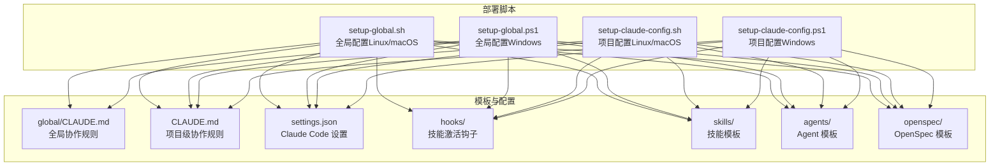
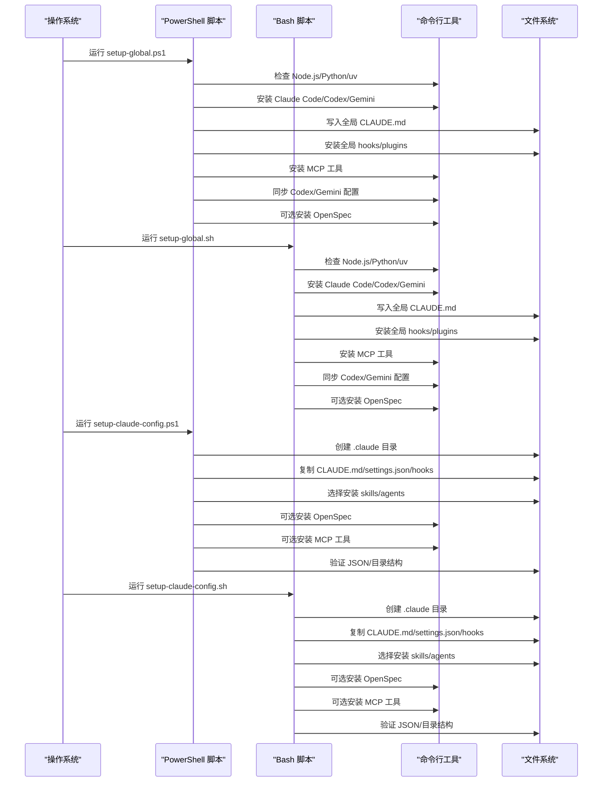
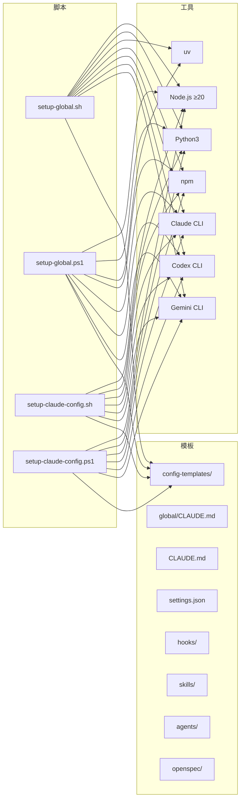

# 部署脚本配置

<cite>
**本文引用的文件**
- [setup-claude-config.ps1](file://setup-claude-config.ps1)
- [setup-claude-config.sh](file://setup-claude-config.sh)
- [setup-global.ps1](file://setup-global.ps1)
- [setup-global.sh](file://setup-global.sh)
- [README.md](file://README.md)
- [CLAUDE.md](file://CLAUDE.md)
- [global/CLAUDE.md](file://global/CLAUDE.md)
- [settings.json](file://settings.json)
- [hooks/package.json](file://hooks/package.json)
- [hooks/skill-activation-prompt.sh](file://hooks/skill-activation-prompt.sh)
- [skills/dev-workflow/SKILL.md](file://skills/dev-workflow/SKILL.md)
- [skills/git-workflow/SKILL.md](file://skills/git-workflow/SKILL.md)
</cite>

## 目录
1. [简介](#简介)
2. [项目结构](#项目结构)
3. [核心组件](#核心组件)
4. [架构总览](#架构总览)
5. [详细组件分析](#详细组件分析)
6. [依赖关系分析](#依赖关系分析)
7. [性能考虑](#性能考虑)
8. [故障排查指南](#故障排查指南)
9. [结论](#结论)
10. [附录](#附录)

## 简介
本文件面向“部署脚本配置系统”的使用者与维护者，系统性阐述如何在不同操作系统（Windows PowerShell 与 macOS/Linux Bash）上使用部署脚本快速完成 Claude Code 的基础设施配置。重点覆盖以下方面：
- setup-claude-config.* 与 setup-global.* 的作用、参数与执行流程
- 在 Windows 与 Linux/macOS 上的部署步骤与差异
- 配置选项、环境变量、依赖检查与错误处理机制
- 自定义方法、调试技巧与最佳实践
- 面向不同场景的使用示例

## 项目结构
该仓库围绕“配置模板”与“部署脚本”两大核心展开，提供全局与项目级两层配置能力，并通过脚本自动化安装与初始化。

图表来源
- [setup-global.sh](file://setup-global.sh#L1-L471)
- [setup-global.ps1](file://setup-global.ps1#L1-L470)
- [setup-claude-config.sh](file://setup-claude-config.sh#L1-L372)
- [setup-claude-config.ps1](file://setup-claude-config.ps1#L1-L385)
- [global/CLAUDE.md](file://global/CLAUDE.md#L1-L147)
- [CLAUDE.md](file://CLAUDE.md#L1-L440)
- [settings.json](file://settings.json#L1-L37)
- [hooks/package.json](file://hooks/package.json#L1-L17)

章节来源
- [README.md](file://README.md#L71-L92)

## 核心组件
- 全局配置脚本（setup-global.*）
  - 作用：在新机器上安装 Claude Code、MCP 工具、插件、全局 CLAUDE.md、全局 hooks、同步 Codex/Gemini 配置与技能，并可选安装 OpenSpec。
  - 适用场景：首次在新主机搭建完整开发环境。
- 项目配置脚本（setup-claude-config.*）
  - 作用：将模板复制到目标项目，创建 .claude 目录结构，安装 CLAUDE.md、hooks、skills、agents、settings.json，并可选安装 OpenSpec 与 MCP 工具。
  - 适用场景：在已有项目中快速部署 Claude Code 基础设施。
- 配置模板
  - global/CLAUDE.md：全局协作规则与工具使用规范
  - CLAUDE.md：项目级协作规则与 OpenSpec 工作流
  - settings.json：Claude Code hooks 与权限配置
  - hooks：技能激活钩子与依赖
  - skills/agents/openspec：可复用的技能与 Agent 模板

章节来源
- [setup-global.sh](file://setup-global.sh#L1-L471)
- [setup-global.ps1](file://setup-global.ps1#L1-L470)
- [setup-claude-config.sh](file://setup-claude-config.sh#L1-L372)
- [setup-claude-config.ps1](file://setup-claude-config.ps1#L1-L385)
- [global/CLAUDE.md](file://global/CLAUDE.md#L1-L147)
- [CLAUDE.md](file://CLAUDE.md#L1-L440)
- [settings.json](file://settings.json#L1-L37)
- [hooks/package.json](file://hooks/package.json#L1-L17)

## 架构总览
下图展示两类脚本在不同平台上的执行路径与交互对象。

图表来源
- [setup-global.ps1](file://setup-global.ps1#L1-L470)
- [setup-global.sh](file://setup-global.sh#L1-L471)
- [setup-claude-config.ps1](file://setup-claude-config.ps1#L1-L385)
- [setup-claude-config.sh](file://setup-claude-config.sh#L1-L372)

## 详细组件分析

### Windows PowerShell 脚本：setup-global.ps1
- 作用与定位
  - 在新机器上完成全局环境配置，包括安装 Claude Code、MCP 工具、插件、全局 CLAUDE.md、全局 hooks，并同步 Codex/Gemini 配置与技能。
- 关键流程
  - 依赖检查：Node.js 版本（≥20）、Python、uv
  - 安装 AI CLI 工具：Claude Code、Codex CLI、Gemini CLI
  - 安装全局 CLAUDE.md（备份原文件）
  - 安装插件（可选：claude-mem、superpowers、pyright-lsp、pinecone、commit-commands、code-review）
  - 安装 MCP 工具（Codex、Gemini），支持 .mcp.json 模板或手动 claude mcp add
  - 同步 Codex 技能与 Gemini 配置
  - 可选安装 OpenSpec
  - 全局 hooks 安装与依赖安装
  - 验证：CLAUDE.md、插件、MCP、OpenSpec、Codex 技能、Gemini 配置
- 参数与环境变量
  - 无显式命令行参数；通过 $env:USERPROFILE/.claude/config-templates 访问模板
- 错误处理
  - 使用 $ErrorActionPreference = "Stop"，失败即终止
  - 对可选组件（Python、uv、OpenSpec、MCP）采用 try/catch 与提示
- 最佳实践
  - 先启用脚本执行策略（Set-ExecutionPolicy）
  - 确保网络可达 npm registry 与 GitHub
  - 安装后使用 claude plugin list 与 claude mcp list 校验

章节来源
- [setup-global.ps1](file://setup-global.ps1#L1-L470)

### Windows PowerShell 脚本：setup-claude-config.ps1
- 作用与定位
  - 在项目中部署 Claude Code 基础设施，创建 .claude 目录，复制 CLAUDE.md、hooks、skills、agents、settings.json，并可选安装 OpenSpec 与 MCP 工具。
- 关键流程
  - 目标目录解析与切换
  - 创建 .claude/{skills,hooks,agents,commands}
  - 复制 CLAUDE.md（备份原文件）
  - 复制 hooks（含 package.json 与依赖安装）
  - 选择安装 skills（dev-workflow、git-workflow、python-backend-guidelines、python-error-tracking、skill-developer、openspec-workflow）
  - 复制 skill-rules.json（备份原文件）
  - 可选安装 agents
  - 处理 settings.json（若存在则生成模板）
  - 可选安装 OpenSpec（Node.js ≥20）
  - 可选安装 MCP 工具（Codex、Gemini），支持 .mcp.json 模板或 claude mcp add
  - 验证：JSON 校验、目录结构、CLAUDE.md、MCP 状态
- 参数与环境变量
  - -TargetDir：目标项目目录，默认当前目录
  - 使用 $env:USERPROFILE/.claude/config-templates 作为模板源
- 错误处理
  - 模板目录不存在时立即退出
  - 依赖缺失（Node.js、Python、uv、Claude CLI）给出明确提示
- 最佳实践
  - 先在全局脚本中完成工具安装
  - 安装后逐项验证 hooks、MCP、OpenSpec 状态

章节来源
- [setup-claude-config.ps1](file://setup-claude-config.ps1#L1-L385)

### macOS/Linux Bash 脚本：setup-global.sh
- 作用与定位
  - 在新机器上完成全局环境配置，安装 Claude Code、MCP 工具、插件、全局 CLAUDE.md、全局 hooks，并同步 Codex/Gemini 配置与技能。
- 关键流程
  - 依赖检查：Node.js（≥20）、Python3、uv（自动安装）
  - 安装 AI CLI 工具：Claude Code、Codex CLI、Gemini CLI
  - 安装全局 CLAUDE.md（备份原文件）
  - 安装插件（可选）
  - 安装 MCP 工具（Codex、Gemini）
  - 同步 Codex 技能与 Gemini 配置（默认 GEMINI.md）
  - 可选安装 OpenSpec
  - 安装全局 hooks（含依赖）
  - 验证：CLAUDE.md、插件、MCP、OpenSpec、Codex 技能、Gemini 配置
- 参数与环境变量
  - 无显式命令行参数；通过 $HOME/.claude/config-templates 访问模板
- 错误处理
  - set -e 导致任何错误即退出
  - uv 安装失败提供手动安装指引
- 最佳实践
  - 确保 npm registry 与 GitHub 可达
  - 安装后使用 claude plugin list 与 claude mcp list 校验

章节来源
- [setup-global.sh](file://setup-global.sh#L1-L471)

### macOS/Linux Bash 脚本：setup-claude-config.sh
- 作用与定位
  - 在项目中部署 Claude Code 基础设施，创建 .claude 目录，复制 CLAUDE.md、hooks、skills、agents、settings.json，并可选安装 OpenSpec 与 MCP 工具。
- 关键流程
  - 目标目录解析与切换
  - 创建 .claude/{skills,hooks,agents,commands} 与 .devos/{tasks,archive,memory,config}
  - 复制 CLAUDE.md（备份原文件）
  - 复制 hooks（含 package.json 与依赖安装）
  - 选择安装 skills（dev-workflow、git-workflow、python-backend-guidelines、python-error-tracking、skill-developer、openspec-workflow）
  - 复制 skill-rules.json（备份原文件）
  - 可选安装 agents
  - 处理 settings.json（若存在则生成模板）
  - 可选安装 OpenSpec（Node.js ≥20）
  - 可选安装 MCP 工具（Codex、Gemini）
  - 验证：hooks 权限、JSON 校验、目录结构、CLAUDE.md、MCP 状态
- 参数与环境变量
  - 第一个参数为目标项目目录，默认当前目录
  - 使用 $HOME/.claude/config-templates 作为模板源
- 错误处理
  - 模板目录不存在时立即退出
  - 依赖缺失（Node.js、Python3、uv、Claude CLI）给出明确提示
- 最佳实践
  - 先在全局脚本中完成工具安装
  - 安装后逐项验证 hooks、MCP、OpenSpec 状态

章节来源
- [setup-claude-config.sh](file://setup-claude-config.sh#L1-L372)

### 配置模板与钩子
- CLAUDE.md（全局/项目）
  - 全局 CLAUDE.md：定义全局协作规则、工具使用规范、Superpowers 插件使用建议
  - 项目 CLAUDE.md：与 OpenSpec 工作流对齐，定义三阶段工作流与 6 阶段流程映射
- settings.json
  - enableAllProjectMcpServers：启用项目级 MCP 服务器
  - permissions：允许编辑、写入、多编辑、笔记本编辑、Bash 等权限
  - hooks：UserPromptSubmit 与 PostToolUse 事件钩子，分别调用技能激活与工具使用跟踪脚本
- hooks
  - skill-activation-prompt.sh：将输入传递给 TypeScript 钩子以实现技能自动激活
  - package.json：TypeScript/TSX 类型定义与测试脚本

章节来源
- [global/CLAUDE.md](file://global/CLAUDE.md#L1-L147)
- [CLAUDE.md](file://CLAUDE.md#L1-L440)
- [settings.json](file://settings.json#L1-L37)
- [hooks/skill-activation-prompt.sh](file://hooks/skill-activation-prompt.sh#L1-L6)
- [hooks/package.json](file://hooks/package.json#L1-L17)

### 技能模板
- dev-workflow：规范化的开发流程（REQUIREMENT → DESIGN → IMPLEMENTATION → REVIEW → TESTING → DONE），定义文档目录、模板与 API
- git-workflow：标准化的 Git 分支命名、提交消息、预提交检查、合并流程与冲突解决

章节来源
- [skills/dev-workflow/SKILL.md](file://skills/dev-workflow/SKILL.md#L1-L397)
- [skills/git-workflow/SKILL.md](file://skills/git-workflow/SKILL.md#L1-L440)

## 依赖关系分析
- 脚本依赖
  - Node.js（≥20）：用于安装 CLI 工具与 OpenSpec
  - Python（可选）：用于 JSON 校验
  - uv（可选）：用于 Codex MCP 安装
  - npm：安装 CLI 工具与 hooks 依赖
  - Claude CLI：安装插件与 MCP 工具
  - Codex CLI：安装 MCP 工具与同步技能
  - Gemini CLI：安装 MCP 工具与同步配置
- 模板依赖
  - config-templates：模板目录，包含 global/CLAUDE.md、CLAUDE.md、settings.json、hooks、skills、agents、openspec 等
- 运行时依赖
  - hooks：TypeScript 钩子需通过 TSX 运行
  - MCP 工具：Codex 与 Gemini 的 MCP 服务

图表来源
- [setup-global.sh](file://setup-global.sh#L46-L76)
- [setup-global.ps1](file://setup-global.ps1#L22-L51)
- [setup-claude-config.sh](file://setup-claude-config.sh#L196-L233)
- [setup-claude-config.ps1](file://setup-claude-config.ps1#L198-L242)
- [hooks/package.json](file://hooks/package.json#L1-L17)

## 性能考虑
- 脚本执行时间主要受网络与磁盘 IO 影响，建议：
  - 预先配置好 npm registry 与缓存
  - 在内网或离线环境中提前下载依赖包
  - 使用本地镜像源加速 npm 安装
- JSON 校验与目录检查为轻量操作，不会显著影响整体耗时
- hooks 依赖安装仅在存在 package.json 时执行，避免不必要的等待

## 故障排查指南
- 模板目录未找到
  - 症状：脚本报错提示模板目录不存在
  - 处理：确保 config-templates 已正确克隆至 $HOME/.claude/config-templates 或 $env:USERPROFILE\.claude\config-templates
- Node.js 版本不足
  - 症状：提示 Node.js ≥20
  - 处理：升级 Node.js 或使用 nvm 安装指定版本
- Python 未安装
  - 症状：JSON 校验跳过
  - 处理：安装 Python3 并重试
- uv 未安装（Windows）
  - 症状：提示安装 uv
  - 处理：按指引安装或使用其他方式安装 Codex MCP
- Claude CLI 未安装
  - 症状：无法安装插件或 MCP 工具
  - 处理：先安装 Claude Code，再运行脚本
- OpenSpec 安装失败
  - 症状：npm install -g @fission-ai/openspec@latest 失败
  - 处理：检查网络与 npm 配置，或手动安装
- hooks 依赖安装失败
  - 症状：npm install 失败
  - 处理：检查网络与 npm 配置，或手动安装依赖
- MCP 工具状态异常
  - 症状：claude mcp list 显示异常
  - 处理：使用 claude mcp remove 与 claude mcp add 重新安装

章节来源
- [setup-claude-config.ps1](file://setup-claude-config.ps1#L26-L31)
- [setup-claude-config.sh](file://setup-claude-config.sh#L47-L52)
- [setup-global.ps1](file://setup-global.ps1#L22-L51)
- [setup-global.sh](file://setup-global.sh#L46-L76)

## 结论
部署脚本配置系统通过全局与项目两级脚本，实现了在不同操作系统上的一键化 Claude Code 基础设施部署。其设计强调：
- 可移植性：PowerShell 与 Bash 脚本覆盖主流平台
- 可扩展性：模板化配置便于定制与复用
- 可靠性：完善的依赖检查、错误处理与验证流程
- 可维护性：清晰的目录结构与职责分离

建议在新机器上先运行全局脚本完成工具与配置安装，再在具体项目中运行项目配置脚本完成本地化部署。

## 附录

### 使用示例与最佳实践
- macOS/Linux 新机器完整配置
  - 步骤：克隆模板 → 运行全局脚本 → 部署到项目
  - 参考：README.md 中的 macOS/Linux 快速开始
- Windows 新机器完整配置
  - 步骤：克隆模板 → 运行全局脚本 → 部署到项目
  - 注意：先启用脚本执行策略
- 仅部署到项目
  - 可直接运行项目配置脚本，或在 Windows 下指定 -TargetDir
- 自定义方法
  - 替换或扩展 global/CLAUDE.md、CLAUDE.md、settings.json
  - 在 hooks 中添加自定义脚本并在 settings.json 中注册
  - 在 skills/ 与 agents/ 中添加自定义技能与 Agent
- 调试技巧
  - 使用 claude plugin list 与 claude mcp list 检查插件与工具状态
  - 通过 .claude/settings.json.template 了解 settings.json 的模板结构
  - 在 hooks 目录中运行 npm install 安装依赖
  - 使用 Python3 -m json.tool 验证 JSON 文件语法

章节来源
- [README.md](file://README.md#L12-L70)
- [setup-claude-config.ps1](file://setup-claude-config.ps1#L362-L380)
- [setup-claude-config.sh](file://setup-claude-config.sh#L353-L371)
- [settings.json](file://settings.json#L1-L37)