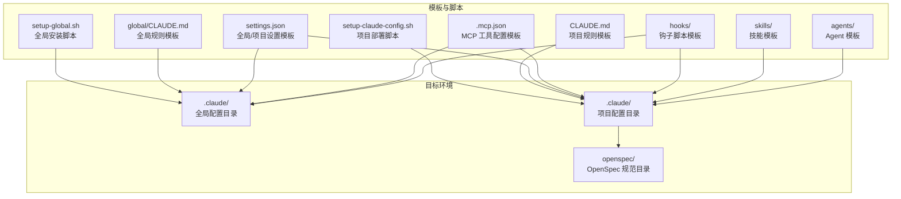
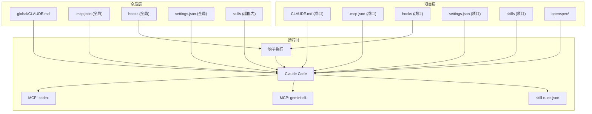
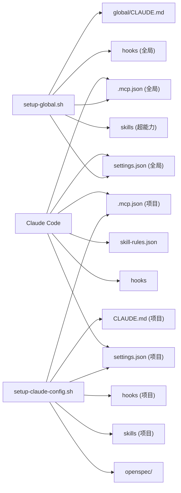
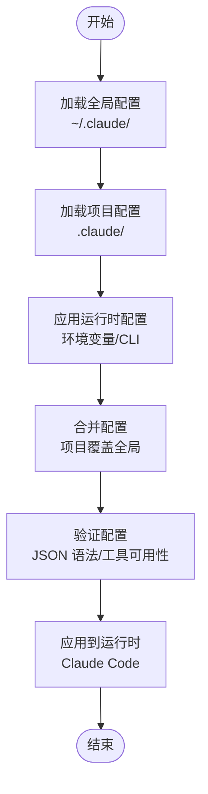

# 配置管理系统

<cite>
**本文引用的文件**
- [CLAUDE.md](file://CLAUDE.md)
- [global/CLAUDE.md](file://global/CLAUDE.md)
- [settings.json](file://settings.json)
- [.mcp.json](file://.mcp.json)
- [skills/skill-rules.json](file://skills/skill-rules.json)
- [setup-claude-config.sh](file://setup-claude-config.sh)
- [setup-global.sh](file://setup-global.sh)
- [hooks/skill-activation-prompt.sh](file://hooks/skill-activation-prompt.sh)
- [hooks/post-tool-use-tracker.sh](file://hooks/post-tool-use-tracker.sh)
- [skills/dev-workflow/SKILL.md](file://skills/dev-workflow/SKILL.md)
- [skills/git-workflow/SKILL.md](file://skills/git-workflow/SKILL.md)
- [skills/python-backend-guidelines/SKILL.md](file://skills/python-backend-guidelines/SKILL.md)
- [agents/README.md](file://agents/README.md)
- [README.md](file://README.md)
</cite>

## 目录
1. [简介](#简介)
2. [项目结构](#项目结构)
3. [核心组件](#核心组件)
4. [架构总览](#架构总览)
5. [详细组件分析](#详细组件分析)
6. [依赖关系分析](#依赖关系分析)
7. [性能考量](#性能考量)
8. [故障排查指南](#故障排查指南)
9. [结论](#结论)
10. [附录](#附录)

## 简介
本文件系统化梳理配置管理系统的层次结构与工作机制，覆盖全局配置与项目级配置、CLAUDE.md 配置模板、settings.json 设置、MCP 工具配置、技能触发规则与钩子体系。文档重点阐述配置加载顺序、优先级与继承机制，提供自定义配置规则、新增工具与调整工作流程参数的方法，并包含配置验证、错误诊断与备份恢复策略，以及团队环境下的标准化配置管理与版本控制最佳实践。

## 项目结构
配置系统围绕“模板 + 脚本 + 配置 + 钩子 + 技能 + Agent”的组织方式展开，支持在新机器上一键安装全局配置，再将模板部署到具体项目中，形成“全局规则 + 项目定制”的双层配置体系。

图表来源
- [README.md](file://README.md#L71-L92)
- [setup-global.sh](file://setup-global.sh#L130-L157)
- [setup-claude-config.sh](file://setup-claude-config.sh#L60-L86)

章节来源
- [README.md](file://README.md#L71-L92)
- [setup-global.sh](file://setup-global.sh#L130-L157)
- [setup-claude-config.sh](file://setup-claude-config.sh#L60-L86)

## 核心组件
- 全局配置（~/.claude/）
  - CLAUDE.md：全局协作与记忆系统规则
  - settings.json：权限、钩子与默认行为
  - .mcp.json：MCP 工具注册（codex、gemini-cli）
  - hooks：全局钩子脚本
  - skills：超能力插件技能同步
- 项目配置（your-project/.claude/）
  - CLAUDE.md：项目级 SDD 流程与交叉检查规则
  - settings.json：项目级权限与钩子
  - .mcp.json：项目级 MCP 工具覆盖
  - skills：项目级技能与触发规则
  - hooks：项目级钩子
  - openspec：OpenSpec 规范与变更目录
- Agent 与技能
  - skills/skill-rules.json：技能触发规则（关键词、意图、文件路径）
  - 各 SKILL.md：技能使用指南与最佳实践
  - agents：专业 Agent 模板

章节来源
- [global/CLAUDE.md](file://global/CLAUDE.md#L1-L147)
- [CLAUDE.md](file://CLAUDE.md#L1-L440)
- [settings.json](file://settings.json#L1-L37)
- [.mcp.json](file://.mcp.json#L1-L19)
- [skills/skill-rules.json](file://skills/skill-rules.json#L1-L250)
- [agents/README.md](file://agents/README.md#L1-L301)

## 架构总览
配置系统通过“模板 + 脚本 + 钩子 + 技能 + MCP 工具”协同工作，形成“全局规则 + 项目定制”的双层架构。全局层提供跨项目的通用协作与工具接入规范，项目层聚焦于具体业务流程与工作流。

图表来源
- [README.md](file://README.md#L197-L216)
- [global/CLAUDE.md](file://global/CLAUDE.md#L1-L147)
- [CLAUDE.md](file://CLAUDE.md#L1-L440)
- [.mcp.json](file://.mcp.json#L1-L19)
- [settings.json](file://settings.json#L1-L37)
- [skills/skill-rules.json](file://skills/skill-rules.json#L1-L250)

## 详细组件分析

### 全局配置与项目级配置的层次结构
- 全局配置（~/.claude/）
  - CLAUDE.md：定义全局协作原则、记忆系统使用、工具默认行为与多 AI 分工
  - .mcp.json：注册 codex 与 gemini-cli 作为 MCP 工具
  - settings.json：全局权限与钩子配置
  - hooks：全局钩子脚本
  - skills：超能力插件技能同步至 Codex
- 项目配置（your-project/.claude/）
  - CLAUDE.md：定义项目级 SDD 流程、交叉检查与前后端分工
  - .mcp.json：项目级 MCP 工具覆盖（可与全局合并或覆盖）
  - settings.json：项目级权限与钩子
  - skills：项目级技能与 skill-rules.json
  - hooks：项目级钩子
  - openspec：OpenSpec 规范与变更目录

加载顺序与优先级（建议）
- 加载顺序
  1) 全局配置（~/.claude/）
  2) 项目配置（your-project/.claude/）
  3) 运行时动态配置（如环境变量）
- 优先级
  - 项目级配置覆盖全局配置
  - 运行时动态配置可覆盖文件配置
- 继承机制
  - 项目 CLAUDE.md 可继承全局协作原则，同时补充项目特定流程
  - MCP 与 settings 可分别在全局与项目层定义，最终以项目层为准

章节来源
- [README.md](file://README.md#L197-L216)
- [global/CLAUDE.md](file://global/CLAUDE.md#L1-L147)
- [CLAUDE.md](file://CLAUDE.md#L1-L440)
- [.mcp.json](file://.mcp.json#L1-L19)
- [settings.json](file://settings.json#L1-L37)

### CLAUDE.md 配置模板
- 全局 CLAUDE.md（global/CLAUDE.md）
  - 记忆系统使用规则、多 AI 协同角色分工、交叉检查规则、Superpowers 技能清单、语言规范
- 项目 CLAUDE.md（CLAUDE.md）
  - OpenSpec 工作流、前后端分工流程、交叉检查规则、MCP 工具使用规范、项目结构规则

章节来源
- [global/CLAUDE.md](file://global/CLAUDE.md#L1-L147)
- [CLAUDE.md](file://CLAUDE.md#L1-L440)

### settings.json 设置
- enableAllProjectMcpServers：启用项目级 MCP 服务器
- permissions.allow：允许的操作（编辑、写入、多编辑、笔记本、Bash）
- permissions.defaultMode：默认编辑接受模式
- hooks.UserPromptSubmit：用户提交提示后的钩子（如技能激活提示）
- hooks.PostToolUse：工具使用后的钩子（如编辑/多编辑/写入后跟踪）

章节来源
- [settings.json](file://settings.json#L1-L37)

### MCP 工具配置
- .mcp.json
  - codex：stdio 类型，命令为 codex，参数为 mcp-server
  - gemini-cli：stdio 类型，命令为 npx，参数为 -y gemini-mcp-tool
- 安装与覆盖
  - 全局安装：setup-global.sh
  - 项目部署：setup-claude-config.sh 可复制 .mcp.json 模板到项目

章节来源
- [.mcp.json](file://.mcp.json#L1-L19)
- [setup-global.sh](file://setup-global.sh#L233-L264)
- [setup-claude-config.sh](file://setup-claude-config.sh#L244-L282)

### 技能触发规则（skill-rules.json）
- 版本与描述：1.1，多 AI 协同 + SDD 工作流
- 技能类别：domain 类型，支持 suggest/block/warn 强制级别
- 关键词与意图匹配：支持正则表达式，灵活识别用户意图
- 文件路径触发：支持路径模式与排除模式，匹配 Python 后端、Git 目录等
- 自定义化：可调整 pathPatterns、keywords、intentPatterns 以适配项目结构

章节来源
- [skills/skill-rules.json](file://skills/skill-rules.json#L1-L250)

### 钩子机制
- skill-activation-prompt.sh
  - 在用户提交提示后执行，将输入传递给 TypeScript 钩子脚本
- post-tool-use-tracker.sh
  - 工具使用后执行，跟踪编辑文件、推断仓库、缓存命令、更新受影响仓库列表

章节来源
- [hooks/skill-activation-prompt.sh](file://hooks/skill-activation-prompt.sh#L1-L6)
- [hooks/post-tool-use-tracker.sh](file://hooks/post-tool-use-tracker.sh#L1-L178)

### Agent 与技能集成
- Agent 模板：agents/README.md 提供 10 个专业 Agent，可直接复制使用
- 技能模板：skills 下包含开发流程、Git 工作流、Python 后端规范、错误追踪、技能开发等
- 触发与使用：通过 skill-rules.json 与 CLAUDE.md 规则共同决定何时激活

章节来源
- [agents/README.md](file://agents/README.md#L1-L301)
- [skills/dev-workflow/SKILL.md](file://skills/dev-workflow/SKILL.md#L1-L397)
- [skills/git-workflow/SKILL.md](file://skills/git-workflow/SKILL.md#L1-L440)
- [skills/python-backend-guidelines/SKILL.md](file://skills/python-backend-guidelines/SKILL.md#L1-L596)

## 依赖关系分析
配置系统各组件之间的依赖关系如下：

图表来源
- [setup-global.sh](file://setup-global.sh#L130-L157)
- [setup-claude-config.sh](file://setup-claude-config.sh#L60-L86)
- [README.md](file://README.md#L197-L216)

章节来源
- [setup-global.sh](file://setup-global.sh#L130-L157)
- [setup-claude-config.sh](file://setup-claude-config.sh#L60-L86)
- [README.md](file://README.md#L197-L216)

## 性能考量
- 钩子执行开销
  - post-tool-use-tracker.sh 在每次编辑后执行，涉及文件系统与命令解析，建议在大型项目中合理使用缓存与去重
- 技能触发匹配
  - skill-rules.json 的路径与正则匹配在大型代码库中可能带来扫描成本，建议优化 pathPatterns 与排除模式
- MCP 工具调用
  - codex 与 gemini-cli 的启动与通信开销需关注，建议在本地缓存与会话复用方面优化

## 故障排查指南
- 配置文件语法错误
  - 使用 Python3 的 json.tool 验证 settings.json 与 skill-rules.json 的语法
- MCP 工具不可用
  - 检查 claude mcp list 输出，确认工具已安装且可访问
- 钩子未执行
  - 确认 hooks 目录下脚本具备可执行权限，且在 settings.json 中正确配置了钩子
- 技能未触发
  - 检查 skill-rules.json 的 keywords、intentPatterns 与 pathPatterns 是否与项目实际匹配
- OpenSpec 初始化失败
  - 确保 Node.js 版本满足要求（>= 20），并检查 npm 安装状态

章节来源
- [setup-claude-config.sh](file://setup-claude-config.sh#L296-L315)
- [setup-global.sh](file://setup-global.sh#L43-L58)
- [settings.json](file://settings.json#L13-L35)

## 结论
本配置管理系统通过“模板 + 脚本 + 钩子 + 技能 + MCP 工具”的组合，实现了全局规则与项目定制的双层配置体系。建议在团队中遵循“全局统一 + 项目定制”的原则，利用 skill-rules.json 与 CLAUDE.md 明确工作流与协作规范，并通过钩子与 MCP 工具提升自动化与一致性。定期备份配置文件与遵循版本控制策略，有助于在团队环境中实现标准化与可追溯性。

## 附录

### 配置加载与优先级流程

图表来源
- [README.md](file://README.md#L197-L216)
- [settings.json](file://settings.json#L1-L37)
- [.mcp.json](file://.mcp.json#L1-L19)

### 自定义配置规则与新增工具步骤
- 自定义技能触发规则
  - 调整 skills/skill-rules.json 的 pathPatterns、keywords、intentPatterns
  - 通过 CLAUDE.md 补充项目特定流程与角色分工
- 新增 MCP 工具
  - 在 .mcp.json 中添加新工具条目，或使用 claude mcp add 命令
  - 确保工具命令与参数正确，必要时在项目层覆盖全局配置
- 调整工作流程参数
  - 在 CLAUDE.md 中修改前后端分工与交叉检查规则
  - 在 settings.json 中调整权限与钩子行为

章节来源
- [skills/skill-rules.json](file://skills/skill-rules.json#L242-L247)
- [CLAUDE.md](file://CLAUDE.md#L359-L391)
- [.mcp.json](file://.mcp.json#L1-L19)
- [settings.json](file://settings.json#L1-L37)

### 配置验证与备份恢复策略
- 验证
  - JSON 语法：python3 -m json.tool
  - MCP 工具：claude mcp list
  - 钩子：检查可执行权限与输出日志
- 备份
  - 备份 ~/.claude 与项目 .claude 目录
  - 版本控制：将 CLAUDE.md、settings.json、.mcp.json、skill-rules.json 纳入版本控制
- 恢复
  - 使用备份目录替换当前配置
  - 重新执行 setup-claude-config.sh 或 setup-global.sh 进行修复安装

章节来源
- [setup-claude-config.sh](file://setup-claude-config.sh#L296-L315)
- [setup-global.sh](file://setup-global.sh#L405-L431)

### 团队环境下的最佳实践与安全考虑
- 最佳实践
  - 全局统一协作规则，项目定制流程细节
  - 使用 skill-rules.json 与 CLAUDE.md 明确职责与流程
  - 通过 hooks 自动化审计与缓存命令
  - OpenSpec 规范驱动开发，严格阶段过渡
- 安全考虑
  - settings.json 中避免硬编码敏感信息，使用环境变量
  - MCP 工具权限最小化，默认模式 acceptEdits
  - 钩子脚本避免执行高风险命令，限制工作目录

章节来源
- [settings.json](file://settings.json#L3-L12)
- [hooks/post-tool-use-tracker.sh](file://hooks/post-tool-use-tracker.sh#L1-L178)
- [CLAUDE.md](file://CLAUDE.md#L359-L391)