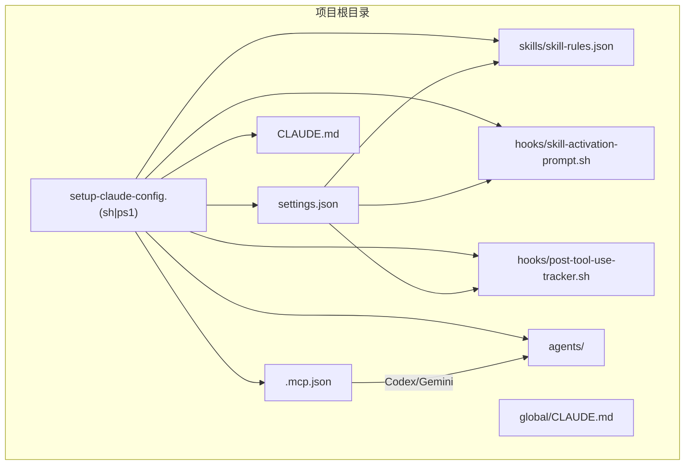
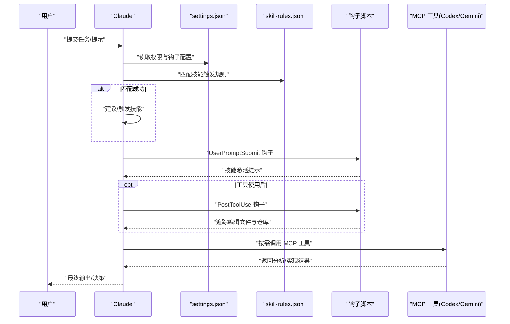
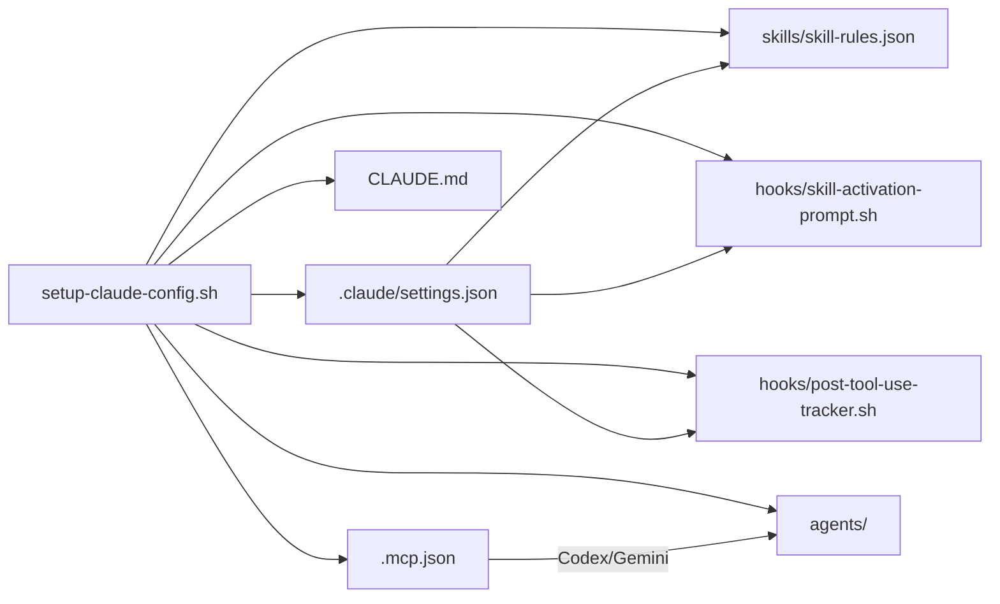

# 项目级配置

<cite>
**本文引用的文件**
- [settings.json](file://settings.json)
- [.mcp.json](file://.mcp.json)
- [setup-claude-config.sh](file://setup-claude-config.sh)
- [setup-claude-config.ps1](file://setup-claude-config.ps1)
- [CLAUDE.md](file://CLAUDE.md)
- [global/CLAUDE.md](file://global/CLAUDE.md)
- [skills/skill-rules.json](file://skills/skill-rules.json)
- [hooks/skill-activation-prompt.sh](file://hooks/skill-activation-prompt.sh)
- [hooks/post-tool-use-tracker.sh](file://hooks/post-tool-use-tracker.sh)
- [agents/README.md](file://agents/README.md)
- [agents/code-architecture-reviewer.md](file://agents/code-architecture-reviewer.md)
- [agents/documentation-architect.md](file://agents/documentation-architect.md)
- [AGENTS.md](file://AGENTS.md)
</cite>

## 目录
1. [简介](#简介)
2. [项目结构](#项目结构)
3. [核心组件](#核心组件)
4. [架构总览](#架构总览)
5. [详细组件分析](#详细组件分析)
6. [依赖关系分析](#依赖关系分析)
7. [性能考虑](#性能考虑)
8. [故障排除指南](#故障排除指南)
9. [结论](#结论)
10. [附录](#附录)

## 简介
本文件系统性阐述本仓库的项目级配置体系，重点围绕 settings.json 配置文件展开，涵盖其作用、结构、配置项语义、默认值与可选取值范围，并提供针对不同开发场景的配置示例、版本控制与团队协作最佳实践，以及常见问题的排查路径。同时，结合 .mcp.json、脚本安装器、技能规则、钩子与 Agent 等配套组件，帮助读者建立一套可复用、可演进的多 AI 协同与规范驱动开发（SDD）配置体系。

## 项目结构
本项目采用“配置模板 + 自动化安装器 + 多 AI 工具集成”的结构，核心配置文件与脚本如下：
- settings.json：项目级 Claude Code 行为与权限配置
- .mcp.json：MCP（多 AI 协同）工具服务器配置
- setup-claude-config.sh / setup-claude-config.ps1：跨平台安装器，负责复制模板、生成配置、安装 MCP 工具
- CLAUDE.md / global/CLAUDE.md：项目与全局协作规则、多 AI 分工与工作流规范
- skills/skill-rules.json：技能触发规则与匹配模式
- hooks/：钩子脚本，用于技能激活提示与工具使用后的追踪
- agents/：可独立使用的 Agent 模板，支持快速集成与定制

图表来源
- [settings.json](file://settings.json#L1-L37)
- [.mcp.json](file://.mcp.json#L1-L19)
- [setup-claude-config.sh](file://setup-claude-config.sh#L175-L185)
- [setup-claude-config.ps1](file://setup-claude-config.ps1#L174-L186)
- [CLAUDE.md](file://CLAUDE.md#L1-L440)
- [global/CLAUDE.md](file://global/CLAUDE.md#L1-L147)
- [skills/skill-rules.json](file://skills/skill-rules.json#L1-L250)
- [hooks/skill-activation-prompt.sh](file://hooks/skill-activation-prompt.sh#L1-L6)
- [hooks/post-tool-use-tracker.sh](file://hooks/post-tool-use-tracker.sh#L1-L178)

章节来源
- [settings.json](file://settings.json#L1-L37)
- [.mcp.json](file://.mcp.json#L1-L19)
- [setup-claude-config.sh](file://setup-claude-config.sh#L1-L372)
- [setup-claude-config.ps1](file://setup-claude-config.ps1#L1-L385)
- [CLAUDE.md](file://CLAUDE.md#L1-L440)
- [global/CLAUDE.md](file://global/CLAUDE.md#L1-L147)
- [skills/skill-rules.json](file://skills/skill-rules.json#L1-L250)
- [hooks/skill-activation-prompt.sh](file://hooks/skill-activation-prompt.sh#L1-L6)
- [hooks/post-tool-use-tracker.sh](file://hooks/post-tool-use-tracker.sh#L1-L178)

## 核心组件
- settings.json：定义项目级 Claude Code 权限、钩子与 MCP 服务器启用策略
- .mcp.json：声明 MCP 工具服务器（如 Codex、Gemini），用于多 AI 协同
- setup-claude-config.*：自动化安装器，一键部署 .claude 目录、技能、Agent、CLAUDE.md、MCP 工具
- CLAUDE.md / global/CLAUDE.md：项目与全局协作规则、角色分工、工作流规范
- skills/skill-rules.json：技能触发规则（关键词、意图正则、文件路径/内容模式）
- hooks/：技能激活提示与工具使用后追踪
- agents/：可即插即用的 Agent 模板，支持快速集成与定制

章节来源
- [settings.json](file://settings.json#L1-L37)
- [.mcp.json](file://.mcp.json#L1-L19)
- [setup-claude-config.sh](file://setup-claude-config.sh#L175-L185)
- [setup-claude-config.ps1](file://setup-claude-config.ps1#L174-L186)
- [CLAUDE.md](file://CLAUDE.md#L1-L440)
- [global/CLAUDE.md](file://global/CLAUDE.md#L1-L147)
- [skills/skill-rules.json](file://skills/skill-rules.json#L1-L250)
- [hooks/skill-activation-prompt.sh](file://hooks/skill-activation-prompt.sh#L1-L6)
- [hooks/post-tool-use-tracker.sh](file://hooks/post-tool-use-tracker.sh#L1-L178)

## 架构总览
settings.json 作为项目级中枢，协调以下方面：
- 权限控制：允许/拒绝编辑、笔记、Shell 等能力
- 钩子机制：在用户提交提示、工具使用后触发脚本
- MCP 服务器：统一管理 Codex、Gemini 等工具服务器
- 与技能系统联动：通过 skill-rules.json 的触发规则，决定何时激活特定技能
- 与 Agent 系统联动：Agent 作为独立任务单元，可在 Claude 的统一规则下执行

图表来源
- [settings.json](file://settings.json#L13-L35)
- [skills/skill-rules.json](file://skills/skill-rules.json#L1-L250)
- [hooks/skill-activation-prompt.sh](file://hooks/skill-activation-prompt.sh#L1-L6)
- [hooks/post-tool-use-tracker.sh](file://hooks/post-tool-use-tracker.sh#L1-L178)
- [.mcp.json](file://.mcp.json#L1-L19)

## 详细组件分析

### settings.json 配置详解
- enableAllProjectMcpServers（布尔）
  - 作用：启用项目级 MCP 服务器集合
  - 默认值：true
  - 说明：当为 true 时，项目内所有 MCP 工具服务器均可用；为 false 时需显式配置或禁用
- permissions（对象）
  - allow（数组）
    - 支持通配符：Edit:*、Write:*、MultiEdit:*、NotebookEdit:*、Bash:*
    - 用于授权 Claude 对文件、笔记、终端等的操作范围
  - defaultMode（字符串）
    - 可选值："acceptEdits"
    - 说明：默认接受编辑，便于在受控环境下提升开发效率
- hooks（对象）
  - UserPromptSubmit（数组）
    - 类型：command
    - 命令：指向 skill-activation-prompt.sh，用于在用户提交提示时输出技能激活建议
  - PostToolUse（数组）
    - matcher：过滤 Edit|MultiEdit|Write 等工具使用事件
    - 类型：command
    - 命令：指向 post-tool-use-tracker.sh，用于追踪编辑文件、识别仓库并生成后续构建/类型检查命令

章节来源
- [settings.json](file://settings.json#L1-L37)
- [hooks/skill-activation-prompt.sh](file://hooks/skill-activation-prompt.sh#L1-L6)
- [hooks/post-tool-use-tracker.sh](file://hooks/post-tool-use-tracker.sh#L1-L178)

### .mcp.json 配置详解
- mcpServers（对象）
  - codex（对象）
    - type：stdio
    - command：codex
    - args：["mcp-server"]
    - env：空对象（可扩展）
  - gemini-cli（对象）
    - type：stdio
    - command：npx
    - args：["-y", "gemini-mcp-tool"]
    - env：空对象（可扩展）
- 说明：.mcp.json 为 MCP 工具服务器的静态配置文件，setup 脚本会优先复制模板，若未找到则回退到 claude mcp add 命令安装

章节来源
- [.mcp.json](file://.mcp.json#L1-L19)
- [setup-claude-config.sh](file://setup-claude-config.sh#L244-L282)
- [setup-claude-config.ps1](file://setup-claude-config.ps1#L253-L299)

### 安装器与配置生成
- setup-claude-config.sh / setup-claude-config.ps1
  - 功能：创建 .claude 目录结构、复制 CLAUDE.md、安装 hooks、安装技能、安装 Agent、生成 settings.json、安装 OpenSpec、安装 MCP 工具
  - 特性：跨平台、交互式选择、自动验证 JSON、自动初始化 OpenSpec、列出 MCP 状态
  - 注意：若已有 settings.json，会生成 .claude/settings.json.template 以便手动合并

章节来源
- [setup-claude-config.sh](file://setup-claude-config.sh#L1-L372)
- [setup-claude-config.ps1](file://setup-claude-config.ps1#L1-L385)

### 技能规则与触发机制
- skills/skill-rules.json
  - version/description：版本与描述
  - skills.*：各技能的触发规则
    - type/enforcement/priority：技能类型、执行约束、优先级
    - promptTriggers：关键词与意图正则
    - fileTriggers：路径/内容模式匹配
  - notes：对 enforcement 与 priority 的说明，以及自定义建议
- 与 settings.json 的关系：settings.json 的 hooks 会在用户提示提交时调用 skill-activation-prompt.sh，从而提示合适的技能

章节来源
- [skills/skill-rules.json](file://skills/skill-rules.json#L1-L250)
- [hooks/skill-activation-prompt.sh](file://hooks/skill-activation-prompt.sh#L1-L6)

### 钩子脚本与工具使用追踪
- skill-activation-prompt.sh
  - 作用：在用户提交提示后，将标准输入传递给 skill-activation-prompt.ts，输出技能激活建议
- post-tool-use-tracker.sh
  - 作用：工具使用后追踪编辑文件，识别仓库、生成构建/类型检查命令，并记录到缓存目录
  - 逻辑要点：跳过 Markdown 文件、按仓库分类、检测包管理器与 tsconfig、去重命令

章节来源
- [hooks/skill-activation-prompt.sh](file://hooks/skill-activation-prompt.sh#L1-L6)
- [hooks/post-tool-use-tracker.sh](file://hooks/post-tool-use-tracker.sh#L1-L178)

### CLAUDE.md 与全局协作规则
- CLAUDE.md（项目级）
  - OpenSpec 强制工作流、角色分工、前后端流程、交叉检查规则、MCP 工具使用规范、语言规范、项目结构规则
- global/CLAUDE.md（全局级）
  - 项目结构规则、记忆系统使用、全局工具规则、多 AI 协同角色、交叉检查规则、Superpowers 插件使用、语言规范
- 两者关系：global/CLAUDE.md 提供通用规则，CLAUDE.md 在项目中落地并细化

章节来源
- [CLAUDE.md](file://CLAUDE.md#L1-L440)
- [global/CLAUDE.md](file://global/CLAUDE.md#L1-L147)

### Agent 集成与使用
- agents/README.md
  - Agent 的定义、优势、可用 Agent 列表、集成步骤、与技能对比、故障排除
- agents/code-architecture-reviewer.md / agents/documentation-architect.md
  - 示例 Agent 的职责、方法论、输出规范与保存位置
- 与配置的关系：Agent 作为独立任务单元，可在 Claude 的统一规则与 MCP 工具支持下执行

章节来源
- [agents/README.md](file://agents/README.md#L1-L301)
- [agents/code-architecture-reviewer.md](file://agents/code-architecture-reviewer.md#L1-L84)
- [agents/documentation-architect.md](file://agents/documentation-architect.md#L1-L83)
- [AGENTS.md](file://AGENTS.md#L1-L18)

## 依赖关系分析

图表来源
- [setup-claude-config.sh](file://setup-claude-config.sh#L60-L185)
- [settings.json](file://settings.json#L1-L37)
- [.mcp.json](file://.mcp.json#L1-L19)
- [skills/skill-rules.json](file://skills/skill-rules.json#L1-L250)
- [hooks/skill-activation-prompt.sh](file://hooks/skill-activation-prompt.sh#L1-L6)
- [hooks/post-tool-use-tracker.sh](file://hooks/post-tool-use-tracker.sh#L1-L178)

章节来源
- [setup-claude-config.sh](file://setup-claude-config.sh#L60-L185)
- [settings.json](file://settings.json#L1-L37)
- [.mcp.json](file://.mcp.json#L1-L19)
- [skills/skill-rules.json](file://skills/skill-rules.json#L1-L250)
- [hooks/skill-activation-prompt.sh](file://hooks/skill-activation-prompt.sh#L1-L6)
- [hooks/post-tool-use-tracker.sh](file://hooks/post-tool-use-tracker.sh#L1-L178)

## 性能考虑
- 钩子脚本
  - post-tool-use-tracker.sh 会对每个编辑文件进行仓库识别与命令生成，建议在大型项目中避免频繁小改动，以减少 IO 压力
- MCP 工具
  - Codex/Gemini 为外部工具，调用频率与并发需结合项目规模与资源限制合理控制
- 技能触发
  - skill-rules.json 的正则匹配与路径扫描在大型仓库中可能带来开销，建议按需精简路径模式与关键词

[本节为通用指导，不直接分析具体文件]

## 故障排除指南
- settings.json 语法错误
  - 现象：安装器或验证步骤报错
  - 处理：使用 Python3 的 json.tool 验证；参考安装器中的 JSON 校验逻辑
- hooks 权限问题
  - 现象：钩子脚本不可执行
  - 处理：确保 .claude/hooks/*.sh 具备执行权限；安装器会自动 chmod +x
- MCP 工具缺失
  - 现象：claude mcp list 显示为空或失败
  - 处理：优先使用 .mcp.json 模板；若无模板，使用 claude mcp add 命令安装；确保 Node.js 与 Claude CLI 可用
- Agent 路径问题
  - 现象：Agent 报路径错误
  - 处理：检查 Agent 文件中的硬编码路径，替换为 $CLAUDE_PROJECT_DIR 或相对路径
- OpenSpec 初始化失败
  - 现象：openspec init 失败
  - 处理：确保 Node.js 版本满足要求；按提示手动执行 openspec init

章节来源
- [setup-claude-config.sh](file://setup-claude-config.sh#L285-L315)
- [setup-claude-config.ps1](file://setup-claude-config.ps1#L302-L321)
- [hooks/post-tool-use-tracker.sh](file://hooks/post-tool-use-tracker.sh#L1-L178)
- [agents/README.md](file://agents/README.md#L269-L290)

## 结论
本项目通过 settings.json、.mcp.json、安装器与配套脚本，构建了可复用、可演进的项目级配置体系。settings.json 作为中枢，统一了权限、钩子与 MCP 服务器策略；配合 skill-rules.json 的触发机制与 hooks 的自动化流程，实现了“提示即建议、工具即追踪”的闭环；结合 CLAUDE.md 的协作规则与 Agent 的即插即用能力，形成了面向多 AI 协同与规范驱动开发（SDD）的完整配置生态。

[本节为总结性内容，不直接分析具体文件]

## 附录

### settings.json 配置项速查
- enableAllProjectMcpServers：布尔，启用项目级 MCP 服务器集合
- permissions.allow：数组，授权通配符（Edit:*、Write:*、MultiEdit:*、NotebookEdit:*、Bash:*）
- permissions.defaultMode：字符串，"acceptEdits"
- hooks.UserPromptSubmit：数组，command 类型，指向 skill-activation-prompt.sh
- hooks.PostToolUse.matcher：字符串，过滤 Edit|MultiEdit|Write
- hooks.PostToolUse.hooks：数组，command 类型，指向 post-tool-use-tracker.sh

章节来源
- [settings.json](file://settings.json#L1-L37)

### .mcp.json 配置项速查
- mcpServers.codex.type：stdio
- mcpServers.codex.command：codex
- mcpServers.codex.args：["mcp-server"]
- mcpServers.gemini-cli.type：stdio
- mcpServers.gemini-cli.command：npx
- mcpServers.gemini-cli.args：["-y", "gemini-mcp-tool"]

章节来源
- [.mcp.json](file://.mcp.json#L1-L19)

### 不同开发场景下的配置示例与建议
- 多 AI 协同开发
  - 确保 .mcp.json 中包含 codex 与 gemini-cli
  - 在 CLAUDE.md 中明确角色分工与交叉检查流程
- 规范驱动开发（SDD）
  - 在 CLAUDE.md 中启用 OpenSpec 强制工作流
  - 使用 skills/skill-rules.json 的触发规则引导开发流程
- 团队协作与权限控制
  - 在 settings.json 的 permissions.allow 中精确授权
  - 使用 hooks.PostToolUse 追踪编辑与仓库，便于审计与复盘

[本节为概念性内容，不直接分析具体文件]

### 配置文件的备份策略与版本控制
- 备份策略
  - 安装器在覆盖 settings.json 时会生成 .claude/settings.json.template，便于手动合并
  - .mcp.json 与 CLAUDE.md 在覆盖前会备份为 .backup 文件
- 版本控制
  - 建议将 .claude/ 与 .mcp.json 纳入版本控制，但敏感凭据除外
  - 通过分支与 PR 审核配置变更，确保团队共识
- 团队协作最佳实践
  - 在 CLAUDE.md 中沉淀团队规范与最佳实践
  - 使用 skill-rules.json 的自定义字段，结合项目特性优化触发规则
  - 定期回顾 hooks 的有效性，清理无效或冗余的追踪逻辑

章节来源
- [setup-claude-config.sh](file://setup-claude-config.sh#L69-L74)
- [setup-claude-config.sh](file://setup-claude-config.sh#L249-L254)
- [setup-claude-config.ps1](file://setup-claude-config.ps1#L59-L65)
- [setup-claude-config.ps1](file://setup-claude-config.ps1#L258-L264)