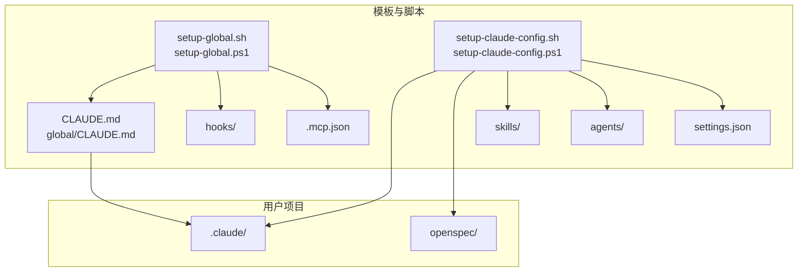
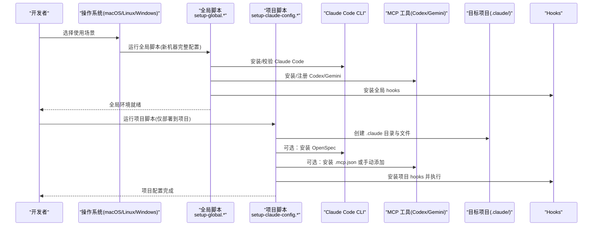
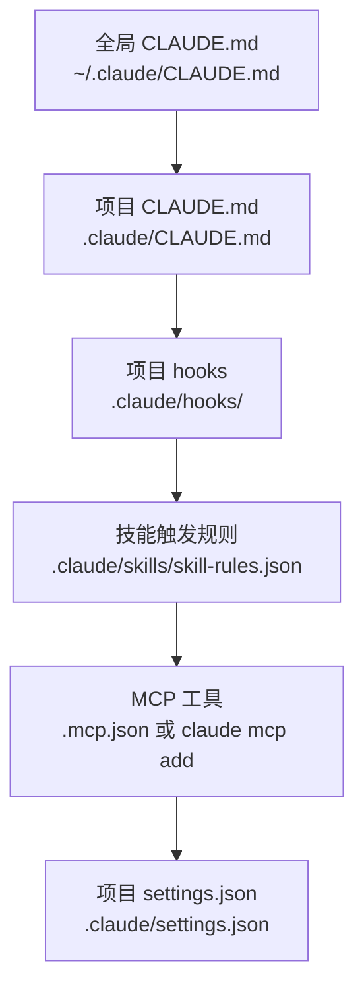

# 快速开始

<cite>
**本文引用的文件**
- [README.md](file://README.md)
- [setup-claude-config.sh](file://setup-claude-config.sh)
- [setup-claude-config.ps1](file://setup-claude-config.ps1)
- [setup-global.sh](file://setup-global.sh)
- [setup-global.ps1](file://setup-global.ps1)
- [settings.json](file://settings.json)
- [CLAUDE.md](file://CLAUDE.md)
- [global/CLAUDE.md](file://global/CLAUDE.md)
- [hooks/skill-activation-prompt.sh](file://hooks/skill-activation-prompt.sh)
- [hooks/post-tool-use-tracker.sh](file://hooks/post-tool-use-tracker.sh)
- [skills/skill-rules.json](file://skills/skill-rules.json)
- [skills/dev-workflow/SKILL.md](file://skills/dev-workflow/SKILL.md)
- [skills/git-workflow/SKILL.md](file://skills/git-workflow/SKILL.md)
- [agents/README.md](file://agents/README.md)
</cite>

## 目录
1. [简介](#简介)
2. [项目结构](#项目结构)
3. [核心组件](#核心组件)
4. [架构总览](#架构总览)
5. [详细组件分析](#详细组件分析)
6. [依赖关系分析](#依赖关系分析)
7. [性能考虑](#性能考虑)
8. [故障排除指南](#故障排除指南)
9. [结论](#结论)
10. [附录](#附录)

## 简介
本指南面向首次接触 ontologyDevOS 项目的开发者，提供从零到一的快速上手路径。您将学会：
- 在 macOS/Linux 与 Windows 上分别完成“新机器完整配置”和“仅部署到项目”的两种使用场景
- 理解全局配置与项目级配置的差异与作用域
- 掌握一键部署脚本的工作原理与关键步骤
- 识别前置条件与常见问题的排查方法

## 项目结构
本项目以“配置模板 + 一键部署脚本 + 多 AI 协同规则 + 技能与代理体系”为核心，提供可复用的 Claude Code 工作流模板。

图表来源
- [setup-global.sh](file://setup-global.sh#L1-L471)
- [setup-claude-config.sh](file://setup-claude-config.sh#L1-L372)
- [settings.json](file://settings.json#L1-L37)
- [CLAUDE.md](file://CLAUDE.md#L1-L440)
- [global/CLAUDE.md](file://global/CLAUDE.md#L1-L147)

章节来源
- [README.md](file://README.md#L71-L92)

## 核心组件
- 全局配置脚本（setup-global.*）：在新机器上安装 Claude Code、插件、MCP 工具，并同步 Codex/Gemini 的技能与配置。
- 项目配置脚本（setup-claude-config.*）：将模板中的 CLAUDE.md、hooks、skills、agents、settings.json、OpenSpec、MCP 配置复制到目标项目。
- 配置文件：
  - settings.json：定义 hooks、权限与编辑器行为
  - CLAUDE.md：项目级多 AI 协同与 SDD 规则
  - global/CLAUDE.md：全局通用规则（适用于所有项目）
- 技能与代理：通过 skill-rules.json 触发特定技能，agents 提供可即用的多步任务代理

章节来源
- [settings.json](file://settings.json#L1-L37)
- [CLAUDE.md](file://CLAUDE.md#L1-L440)
- [global/CLAUDE.md](file://global/CLAUDE.md#L1-L147)
- [skills/skill-rules.json](file://skills/skill-rules.json#L1-L250)
- [agents/README.md](file://agents/README.md#L1-L301)

## 架构总览
下图展示了“新机器完整配置”与“仅部署到项目”的两条主路径，以及它们如何与全局与项目配置交互。

图表来源
- [setup-global.sh](file://setup-global.sh#L1-L471)
- [setup-global.ps1](file://setup-global.ps1#L1-L470)
- [setup-claude-config.sh](file://setup-claude-config.sh#L1-L372)
- [setup-claude-config.ps1](file://setup-claude-config.ps1#L1-L385)

## 详细组件分析

### 全局配置（新机器完整配置）
- 适用场景：首次在新机器上搭建完整开发环境，包含 Claude Code、插件、MCP 工具、OpenSpec、全局 hooks 与 Codex/Gemini 技能同步。
- 关键步骤：
  1) 安装/校验 Node.js（>= 20）、Python3、uv
  2) 安装 Claude Code、Codex CLI、Gemini CLI
  3) 安装/同步全局 CLAUDE.md、hooks
  4) 选择并安装插件（claude-mem、superpowers、pyright-lsp、pinecone、commit-commands、code-review）
  5) 安装/注册 Codex MCP 与 Gemini MCP
  6) 同步 Codex 技能与 Gemini 配置
  7) 可选安装 OpenSpec
  8) 验证安装状态（插件、MCP、OpenSpec、Codex 技能、Gemini 配置）

章节来源
- [setup-global.sh](file://setup-global.sh#L43-L127)
- [setup-global.sh](file://setup-global.sh#L168-L265)
- [setup-global.sh](file://setup-global.sh#L275-L342)
- [setup-global.sh](file://setup-global.sh#L354-L368)
- [setup-global.sh](file://setup-global.sh#L378-L394)
- [setup-global.sh](file://setup-global.sh#L405-L446)
- [setup-global.ps1](file://setup-global.ps1#L19-L52)
- [setup-global.ps1](file://setup-global.ps1#L156-L196)
- [setup-global.ps1](file://setup-global.ps1#L211-L247)
- [setup-global.ps1](file://setup-global.ps1#L260-L319)
- [setup-global.ps1](file://setup-global.ps1#L332-L347)
- [setup-global.ps1](file://setup-global.ps1#L357-L384)
- [setup-global.ps1](file://setup-global.ps1#L395-L444)

### 项目级配置（仅部署到项目）
- 适用场景：已有全局环境，只需将模板配置应用到某个具体项目。
- 关键步骤：
  1) 创建 .claude 目录结构（skills、hooks、agents、commands）
  2) 复制 CLAUDE.md（项目级规则）
  3) 安装 hooks 并可选安装 hooks 依赖
  4) 选择安装技能（dev-workflow、git-workflow、python-backend-guidelines、python-error-tracking、skill-developer、openspec-workflow）
  5) 复制 skill-rules.json
  6) 可选安装 agents
  7) 复制/覆盖 settings.json（如存在冲突，生成 .template 便于手动合并）
  8) 可选安装 OpenSpec（需 Node.js >= 20）
  9) 可选安装 MCP 工具（优先使用 .mcp.json，否则使用 claude mcp add）
  10) 验证安装（hooks 权限、JSON 校验、目录结构、CLAUDE.md、MCP 状态）

章节来源
- [setup-claude-config.sh](file://setup-claude-config.sh#L60-L86)
- [setup-claude-config.sh](file://setup-claude-config.sh#L98-L151)
- [setup-claude-config.sh](file://setup-claude-config.sh#L153-L161)
- [setup-claude-config.sh](file://setup-claude-config.sh#L163-L173)
- [setup-claude-config.sh](file://setup-claude-config.sh#L175-L185)
- [setup-claude-config.sh](file://setup-claude-config.sh#L187-L234)
- [setup-claude-config.sh](file://setup-claude-config.sh#L236-L283)
- [setup-claude-config.sh](file://setup-claude-config.sh#L285-L351)
- [setup-claude-config.ps1](file://setup-claude-config.ps1#L40-L98)
- [setup-claude-config.ps1](file://setup-claude-config.ps1#L99-L142)
- [setup-claude-config.ps1](file://setup-claude-config.ps1#L144-L156)
- [setup-claude-config.ps1](file://setup-claude-config.ps1#L158-L172)
- [setup-claude-config.ps1](file://setup-claude-config.ps1#L174-L186)
- [setup-claude-config.ps1](file://setup-claude-config.ps1#L188-L243)
- [setup-claude-config.ps1](file://setup-claude-config.ps1#L245-L299)
- [setup-claude-config.ps1](file://setup-claude-config.ps1#L302-L351)

### 全局配置与项目级配置的区别
- 全局配置（~/.claude 或 %USERPROFILE%\.claude\)：适用于所有项目，包含全局 CLAUDE.md、hooks、插件、MCP 工具、OpenSpec、Codex/Gemini 同步。
- 项目级配置（your-project/.claude/）：仅影响当前项目，包含项目 CLAUDE.md、项目 hooks、项目 skills、agents、settings.json、OpenSpec 目录结构与 MCP 配置。

章节来源
- [README.md](file://README.md#L197-L216)
- [global/CLAUDE.md](file://global/CLAUDE.md#L1-L147)
- [CLAUDE.md](file://CLAUDE.md#L1-L440)

### 配置层级与生效顺序

图表来源
- [global/CLAUDE.md](file://global/CLAUDE.md#L1-L147)
- [CLAUDE.md](file://CLAUDE.md#L1-L440)
- [hooks/skill-activation-prompt.sh](file://hooks/skill-activation-prompt.sh#L1-L6)
- [hooks/post-tool-use-tracker.sh](file://hooks/post-tool-use-tracker.sh#L1-L178)
- [skills/skill-rules.json](file://skills/skill-rules.json#L1-L250)
- [settings.json](file://settings.json#L1-L37)

## 依赖关系分析
- 前置依赖
  - Node.js（>= 20）：用于安装/使用 OpenSpec、部分 hooks 依赖
  - Python3：用于 JSON 校验与部分工具链
  - uv：用于安装 Codex MCP（脚本会尝试安装）
  - Claude Code CLI：用于插件与 MCP 管理
  - Git：用于 OpenSpec 初始化与 Git 工作流
- 外部工具
  - Codex MCP：后端交叉检查与算法审查
  - Gemini MCP：前端实现与大文本分析
  - OpenSpec：规范驱动开发（Proposal → Implementation → Archive）

章节来源
- [setup-global.sh](file://setup-global.sh#L46-L76)
- [setup-claude-config.sh](file://setup-claude-config.sh#L197-L233)
- [setup-claude-config.ps1](file://setup-claude-config.ps1#L198-L242)

## 性能考虑
- 脚本采用“先校验、后安装”的策略，失败即停止，减少无效重试
- hooks 在成功编辑后异步记录受影响仓库与构建命令，便于后续增量构建
- skill-rules.json 通过路径与关键字匹配触发技能，避免不必要的技能加载

章节来源
- [hooks/post-tool-use-tracker.sh](file://hooks/post-tool-use-tracker.sh#L122-L141)
- [skills/skill-rules.json](file://skills/skill-rules.json#L1-L250)

## 故障排除指南
- Windows 脚本执行策略
  - 若提示无法执行脚本，请先在 PowerShell 中执行启用策略的命令
  - 参考：[README.md](file://README.md#L66-L69)
- Node.js 版本不足
  - OpenSpec 安装与初始化需要 Node.js >= 20
  - 参考：[setup-claude-config.sh](file://setup-claude-config.sh#L197-L229)，[setup-claude-config.ps1](file://setup-claude-config.ps1#L198-L242)
- uv 未安装
  - 脚本会尝试安装 uv，若失败请手动安装
  - 参考：[setup-global.sh](file://setup-global.sh#L67-L76)
- MCP 工具未找到
  - 若使用 .mcp.json 模板，优先复制 .mcp.json；否则使用 claude mcp add
  - 参考：[setup-claude-config.sh](file://setup-claude-config.sh#L246-L282)，[setup-claude-config.ps1](file://setup-claude-config.ps1#L255-L299)
- JSON 校验失败
  - 脚本会尝试使用 Python3 校验 .claude/skills/skill-rules.json 与 .claude/settings.json
  - 参考：[setup-claude-config.sh](file://setup-claude-config.sh#L296-L315)，[setup-claude-config.ps1](file://setup-claude-config.ps1#L309-L321)
- 代理与技能路径问题
  - 某些代理文件可能包含硬编码路径，需替换为 $CLAUDE_PROJECT_DIR 或相对路径
  - 参考：[agents/README.md](file://agents/README.md#L172-L187)，[agents/README.md](file://agents/README.md#L289-L290)

章节来源
- [README.md](file://README.md#L66-L69)
- [setup-claude-config.sh](file://setup-claude-config.sh#L197-L282)
- [setup-claude-config.ps1](file://setup-claude-config.ps1#L198-L299)
- [setup-global.sh](file://setup-global.sh#L67-L76)
- [agents/README.md](file://agents/README.md#L172-L187)
- [agents/README.md](file://agents/README.md#L289-L290)

## 结论
通过本指南，您可以：
- 在新机器上一键完成全局环境搭建
- 将模板配置快速应用到任意项目
- 明确全局与项目级配置的职责边界
- 在遇到问题时快速定位并解决

建议在首次使用时：
- 先执行“新机器完整配置”，确保工具链齐全
- 再执行“仅部署到项目”，按需选择技能与代理
- 定期检查 MCP 与 OpenSpec 状态，保持工具链可用

## 附录

### 快速开始步骤（macOS/Linux）
- 新机器完整配置
  1) 克隆仓库到 ~/.claude/config-templates
  2) 运行全局配置脚本
  3) 进入目标项目，运行项目配置脚本
- 仅部署到项目
  1) 进入目标项目
  2) 运行项目配置脚本

章节来源
- [README.md](file://README.md#L14-L38)
- [setup-global.sh](file://setup-global.sh#L1-L471)
- [setup-claude-config.sh](file://setup-claude-config.sh#L1-L372)

### 快速开始步骤（Windows）
- 新机器完整配置
  1) 克隆仓库到 $env:USERPROFILE\.claude\config-templates
  2) 运行全局配置脚本
  3) 进入目标项目，运行项目配置脚本
- 仅部署到项目
  1) 进入目标项目
  2) 运行项目配置脚本（可指定目标目录）

章节来源
- [README.md](file://README.md#L40-L69)
- [setup-global.ps1](file://setup-global.ps1#L1-L470)
- [setup-claude-config.ps1](file://setup-claude-config.ps1#L1-L385)

### 多 AI 协同与 SDD 工作流
- 角色分工：Claude（主体思考者与决策者），Codex（后端技术顾问），Gemini（前端主力）
- 工作流：Proposal → Implementation → Archive
- 交叉检查：后端由 Claude 主导，前端由 Gemini 主导，Claude 审查

章节来源
- [CLAUDE.md](file://CLAUDE.md#L102-L187)
- [CLAUDE.md](file://CLAUDE.md#L220-L308)

### 技能与代理使用建议
- 技能：通过 skill-rules.json 的关键字与文件模式自动触发
- 代理：直接复制 .md 文件即可使用，必要时更新路径与认证信息

章节来源
- [skills/skill-rules.json](file://skills/skill-rules.json#L1-L250)
- [agents/README.md](file://agents/README.md#L149-L187)
- [skills/dev-workflow/SKILL.md](file://skills/dev-workflow/SKILL.md#L1-L397)
- [skills/git-workflow/SKILL.md](file://skills/git-workflow/SKILL.md#L1-L440)