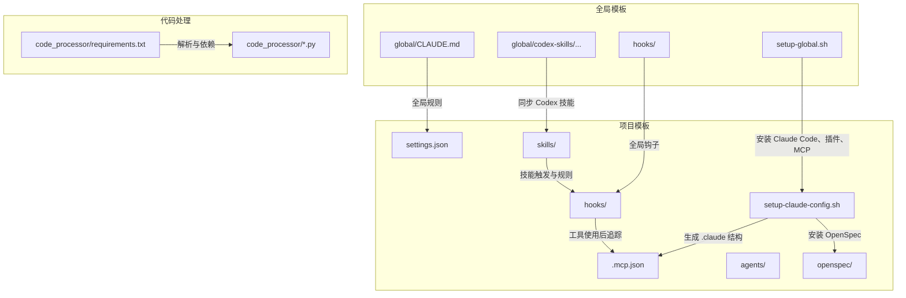
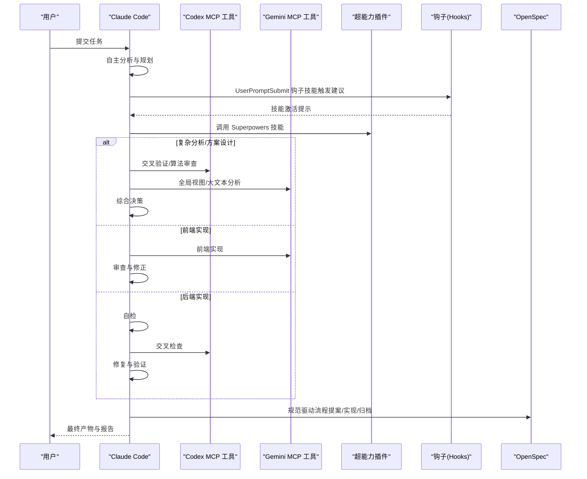
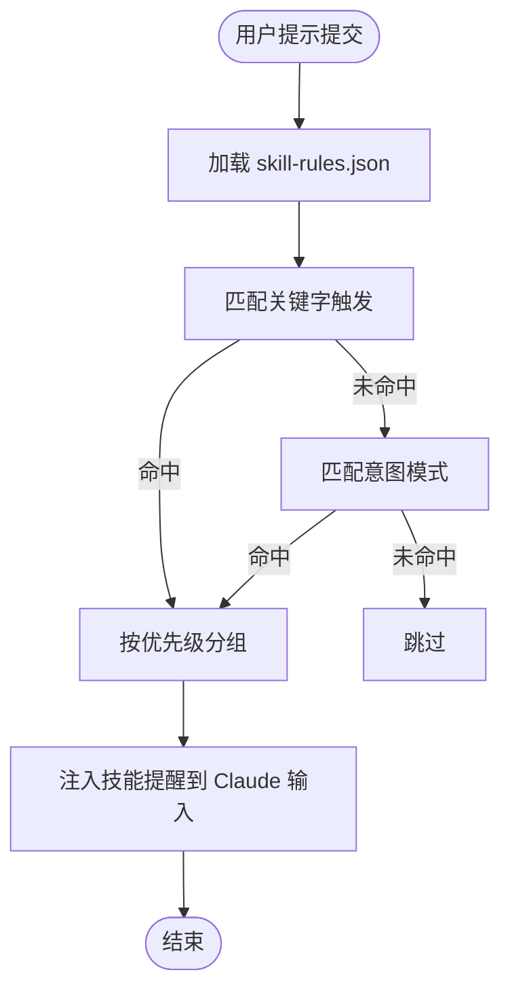
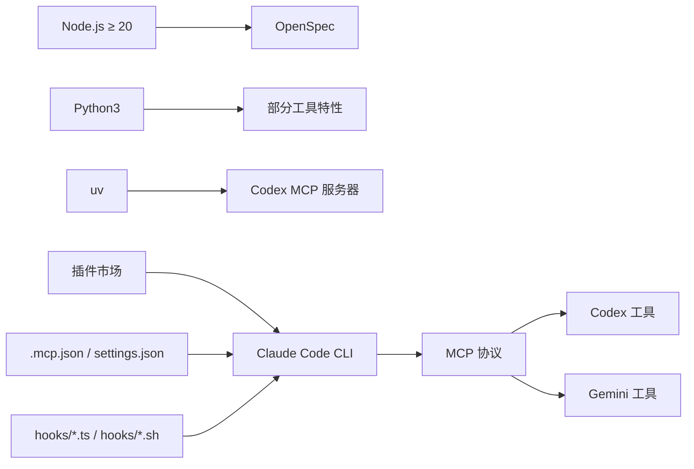

# 技术栈

<cite>
**本文引用的文件**
- [README.md](file://README.md)
- [CLAUDE.md](file://CLAUDE.md)
- [.mcp.json](file://.mcp.json)
- [settings.json](file://settings.json)
- [setup-claude-config.sh](file://setup-claude-config.sh)
- [setup-global.sh](file://setup-global.sh)
- [hooks/skill-activation-prompt.ts](file://hooks/skill-activation-prompt.ts)
- [hooks/post-tool-use-tracker.sh](file://hooks/post-tool-use-tracker.sh)
- [hooks/package.json](file://hooks/package.json)
- [code_processor/requirements.txt](file://code_processor/requirements.txt)
- [skills/dev-workflow/SKILL.md](file://skills/dev-workflow/SKILL.md)
- [skills/python-backend-guidelines/SKILL.md](file://skills/python-backend-guidelines/SKILL.md)
- [skills/skill-developer/SKILL.md](file://skills/skill-developer/SKILL.md)
- [agents/README.md](file://agents/README.md)
- [global/CLAUDE.md](file://global/CLAUDE.md)
</cite>

## 目录
1. [简介](#简介)
2. [项目结构](#项目结构)
3. [核心组件](#核心组件)
4. [架构总览](#架构总览)
5. [详细组件分析](#详细组件分析)
6. [依赖关系分析](#依赖关系分析)
7. [性能考量](#性能考量)
8. [故障排查指南](#故障排查指南)
9. [结论](#结论)
10. [附录](#附录)

## 简介
本技术栈文档面向 ontologyDevOS 项目，系统性说明其基于 Claude Code 的多 AI 协同与规范驱动开发（SDD）工作流所采用的关键技术与工具链，包括：
- Claude Code CLI 与 MCP 协议集成
- 超能力插件（Superpowers）生态
- Codex 与 Gemini MCP 工具
- 技能（Skills）与代理（Agents）体系
- 钩子（Hooks）机制与自动化工作流
- OpenSpec 规范驱动开发（SDD）集成

文档旨在帮助开发者快速理解技术选型、组件职责、相互关系、版本与兼容性要求，以及如何在本地与项目中部署与使用。

## 项目结构
项目采用“模板 + 配置 + 工具”的分层组织方式：
- 全局模板与脚本：用于在新机器上一键安装 Claude Code、插件、MCP 工具与全局规则
- 项目级模板：一键部署到具体项目，生成 .claude 目录、技能、代理、设置与 OpenSpec 规范
- 核心工具与配置：.mcp.json、settings.json、hooks、技能与代理定义文件
- 代码处理与解析：code_processor（Java/JS/Python 解析器与依赖）

图表来源
- [setup-global.sh](file://setup-global.sh#L1-L471)
- [setup-claude-config.sh](file://setup-claude-config.sh#L1-L372)
- [global/CLAUDE.md](file://global/CLAUDE.md#L1-L147)
- [.mcp.json](file://.mcp.json#L1-L19)
- [settings.json](file://settings.json#L1-L37)
- [hooks/skill-activation-prompt.ts](file://hooks/skill-activation-prompt.ts#L1-L133)
- [hooks/post-tool-use-tracker.sh](file://hooks/post-tool-use-tracker.sh#L1-L178)
- [code_processor/requirements.txt](file://code_processor/requirements.txt#L1-L8)

章节来源
- [README.md](file://README.md#L71-L92)
- [setup-global.sh](file://setup-global.sh#L1-L471)
- [setup-claude-config.sh](file://setup-claude-config.sh#L1-L372)

## 核心组件
- Claude Code CLI：主体思考者与决策者，负责任务拆解、规划、实现与最终决策
- MCP 工具：
  - Codex：后端技术顾问，负责交叉检查、算法审查与实现建议
  - Gemini：前端开发主力，负责大文本/代码分析与前端实现
- 超能力插件（Superpowers）：提供 13 项技能，覆盖头脑风暴、并行任务分发、计划执行、调试、测试、Git 工作流等
- 技能（Skills）：可复用的开发知识模板，支持关键字、意图、路径与内容匹配触发
- 代理（Agents）：针对复杂多步骤任务的自治子任务执行器
- 钩子（Hooks）：在用户提示提交前与工具使用后自动注入上下文或追踪编辑行为
- OpenSpec：规范驱动开发（SDD）工具，统一三阶段与六阶段流程

章节来源
- [README.md](file://README.md#L94-L129)
- [CLAUDE.md](file://CLAUDE.md#L102-L125)
- [global/CLAUDE.md](file://global/CLAUDE.md#L114-L133)

## 架构总览
多 AI 协同与 SDD 工作流的总体交互如下：

图表来源
- [CLAUDE.md](file://CLAUDE.md#L150-L186)
- [CLAUDE.md](file://CLAUDE.md#L359-L391)
- [README.md](file://README.md#L123-L139)
- [setup-claude-config.sh](file://setup-claude-config.sh#L236-L282)

## 详细组件分析

### Claude Code 与多 AI 协同
- 角色定位：Claude 是主体思考者与最终决策者；Codex 与 Gemini 作为顾问与助手参与交叉验证与扩展思路
- 使用原则：先独立思考，再交叉验证；禁止直接把任务丢给工具或完全采纳工具建议
- 前后端分工：
  - 后端：Claude 实现 → 自检 → Codex 交叉检查 → Claude 修复 → 验证
  - 前端：Claude 设计 → Gemini 实现 → Claude 审查 → 修正 → 验证

章节来源
- [CLAUDE.md](file://CLAUDE.md#L128-L147)
- [CLAUDE.md](file://CLAUDE.md#L150-L175)

### MCP 工具：Codex 与 Gemini
- Codex（后端技术顾问）
  - 用途：复杂算法审查、架构设计交叉检查、代码质量与边界验证
  - 参数与沙箱：支持工作目录、沙箱模式（只读/工作区写/全权限）、会话 ID；默认只读并返回统一 diff
  - 使用规范：不指定模型参数，使用默认模型；始终关闭返回全部消息
- Gemini（前端开发主力）
  - 用途：大文本/代码分析、全局模式发现、前端实现
  - 使用规范：视为只读分析师；实现与最终决策由 Claude 完成；优先用于前端开发

章节来源
- [CLAUDE.md](file://CLAUDE.md#L359-L391)
- [.mcp.json](file://.mcp.json#L1-L19)

### 超能力插件（Superpowers）生态
- 能力矩阵：包含头脑风暴、并行任务分发、计划执行、完成开发分支、接收/请求代码审查、子代理驱动开发、系统化调试、测试驱动开发、Git 工作流、完成前验证、编写计划与技能等
- 使用策略：在合适时机调用相应技能，提升开发效率与质量

章节来源
- [README.md](file://README.md#L105-L122)
- [global/CLAUDE.md](file://global/CLAUDE.md#L114-L133)

### 技能（Skills）系统
- 触发机制：关键字、意图模式、文件路径模式、内容模式
- 强制级别：阻断（block，关键错误）、建议（suggest，常规指导）、警告（warn，低优先）
- 配置文件：.claude/skills/skill-rules.json，定义技能类型、触发与强制级别
- 钩子机制：
  - UserPromptSubmit：在 Claude 看到用户提示前，基于关键字与意图建议相关技能
  - PostToolUse：在 Edit/MultiEdit/Write 成功后，追踪编辑文件与仓库，生成后续构建/类型检查命令
- 最佳实践：遵循 500 行规则、渐进披露、表目录、Gerund 命名法、充分测试

图表来源
- [hooks/skill-activation-prompt.ts](file://hooks/skill-activation-prompt.ts#L36-L127)
- [settings.json](file://settings.json#L13-L35)

章节来源
- [skills/skill-developer/SKILL.md](file://skills/skill-developer/SKILL.md#L28-L58)
- [hooks/skill-activation-prompt.ts](file://hooks/skill-activation-prompt.ts#L1-L133)
- [hooks/post-tool-use-tracker.sh](file://hooks/post-tool-use-tracker.sh#L1-L178)

### 代理（Agents）系统
- 特点：独立、即拷即用，适合复杂多步骤任务
- 类型：代码架构评审、重构策划、文档架构、前端错误修复、计划评审、Web 研究专家、认证路由测试/调试、自动错误修复等
- 集成方式：复制 .md 文件至 .claude/agents/，必要时更新路径与认证配置

章节来源
- [agents/README.md](file://agents/README.md#L1-L301)

### OpenSpec 规范驱动开发（SDD）
- 三阶段工作流：提案 → 实现变更 → 归档完成
- 与六阶段映射：REQUIREMENT/DESIGN → IMPLEMENTATION/REVIEW/TESTING → DONE
- 目录结构：openspec/specs/ 与 openspec/changes/ 下的规范与变更提案
- 命令：提案创建、应用、归档、格式校验等

章节来源
- [CLAUDE.md](file://CLAUDE.md#L220-L284)
- [README.md](file://README.md#L174-L186)

### 代码处理与解析（code_processor）
- 语言支持：Java、JavaScript、Python
- 依赖：javalang（Java 解析）、tqdm（进度条）
- 作用：为项目提供代码解析与处理能力，支撑静态分析与生成

章节来源
- [code_processor/requirements.txt](file://code_processor/requirements.txt#L1-L8)

## 依赖关系分析
- 安装与部署依赖
  - Node.js ≥ 20（安装 OpenSpec）
  - Python3（可选，部分特性）
  - uv（Codex MCP 服务器启动）
- 工具链依赖
  - Claude Code CLI（主体 AI）
  - Codex CLI（后端工具）
  - Gemini CLI（前端工具）
  - 插件市场：claude-mem、superpowers、pyright-lsp、pinecone、commit-commands、code-review
- 配置与钩子
  - .mcp.json：声明 MCP 服务器（codex、gemini-cli）
  - settings.json：注册钩子与权限
  - hooks：TypeScript/Shell 钩子脚本

图表来源
- [setup-global.sh](file://setup-global.sh#L46-L76)
- [setup-claude-config.sh](file://setup-claude-config.sh#L197-L233)
- [.mcp.json](file://.mcp.json#L1-L19)
- [settings.json](file://settings.json#L1-L37)

章节来源
- [setup-global.sh](file://setup-global.sh#L46-L76)
- [setup-claude-config.sh](file://setup-claude-config.sh#L197-L233)

## 性能考量
- 钩子执行开销：UserPromptSubmit 与 PostToolUse 钩子需控制在毫秒级响应，避免阻塞 Claude 响应
- MCP 工具调用：仅在必要时调用，避免频繁跨进程通信
- 代码解析：对大型代码库的解析应分批处理，减少内存峰值
- 缓存与去重：工具使用后命令缓存去重，避免重复构建/类型检查

章节来源
- [hooks/skill-activation-prompt.ts](file://hooks/skill-activation-prompt.ts#L129-L133)
- [hooks/post-tool-use-tracker.sh](file://hooks/post-tool-use-tracker.sh#L171-L175)

## 故障排查指南
- MCP 工具不可用
  - 检查 .mcp.json 配置与 claude mcp list 输出
  - 确认 Codex/Gemini CLI 已安装并可用
- 技能未触发
  - 检查 skill-rules.json 语法与触发模式
  - 使用 hooks/skill-activation-prompt.ts 手动测试关键字与意图匹配
- 工具使用后未追踪
  - 检查 PostToolUse 钩子是否注册与可执行
  - 确认编辑文件不在 Markdown 类型且路径可识别
- OpenSpec 初始化失败
  - 确保 Node.js 版本满足 ≥ 20
  - 手动执行 openspec init 并检查权限

章节来源
- [setup-claude-config.sh](file://setup-claude-config.sh#L336-L341)
- [hooks/skill-activation-prompt.ts](file://hooks/skill-activation-prompt.ts#L1-L133)
- [hooks/post-tool-use-tracker.sh](file://hooks/post-tool-use-tracker.sh#L1-L178)

## 结论
ontologyDevOS 通过 Claude Code CLI 与 MCP 协议，将 Codex 与 Gemini 作为智能顾问深度融入开发流程，配合超能力插件、技能与代理系统，实现了“主体思考 + 交叉验证 + 自动化工作流”的多 AI 协同开发范式，并以 OpenSpec 统一规范驱动开发的阶段与产出。该技术栈强调：
- 明确的角色分工与使用边界
- 严格的交叉检查与质量门禁
- 可复用的知识模板与自动化钩子
- 规范先行的 SDD 工作流

## 附录

### 版本与兼容性要求
- Node.js：≥ 20（安装 OpenSpec）
- Python3：可选（部分特性）
- uv：可选（Codex MCP 服务器启动）
- Claude Code CLI：已安装（全局/项目）
- 插件与工具：通过插件市场与 npm 安装

章节来源
- [setup-global.sh](file://setup-global.sh#L46-L76)
- [setup-claude-config.sh](file://setup-claude-config.sh#L197-L233)

### 第三方服务与 API
- Anthropic API：Claude Code CLI
- OpenAI API：Codex CLI
- Google API：Gemini CLI
- 插件市场：claude-plugins-official、superpowers-marketplace、thedotmack

章节来源
- [README.md](file://README.md#L220-L224)
- [setup-global.sh](file://setup-global.sh#L88-L126)

### 部署与使用指引
- 新机器完整配置：运行 setup-global.sh，安装 Claude Code、插件、MCP 工具与全局规则
- 仅部署到项目：运行 setup-claude-config.sh，生成 .claude 目录、技能、代理、OpenSpec 与 MCP 配置
- 验证与测试：claude mcp list、技能触发测试、OpenSpec 初始化与命令注入

章节来源
- [README.md](file://README.md#L12-L70)
- [setup-global.sh](file://setup-global.sh#L1-L471)
- [setup-claude-config.sh](file://setup-claude-config.sh#L1-L372)