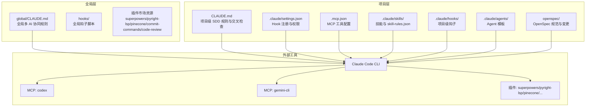
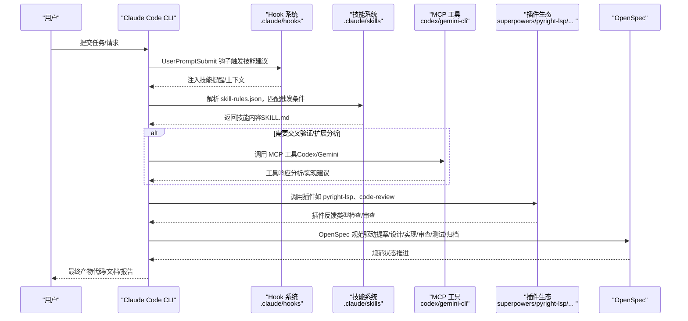
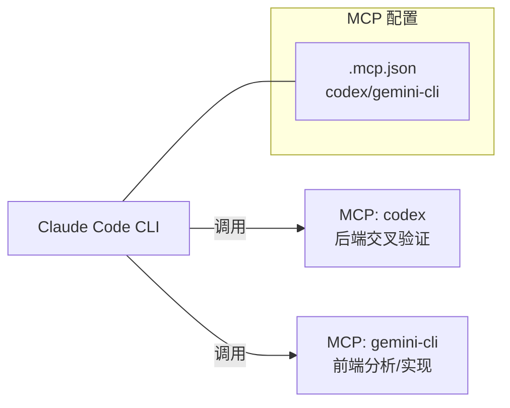
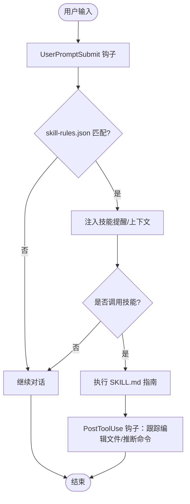
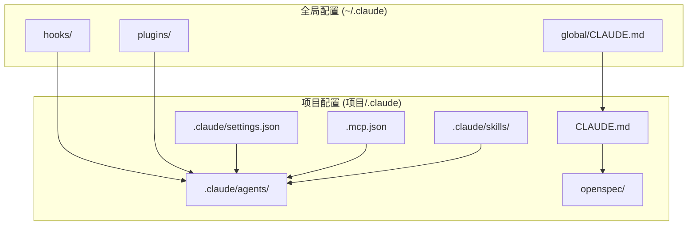
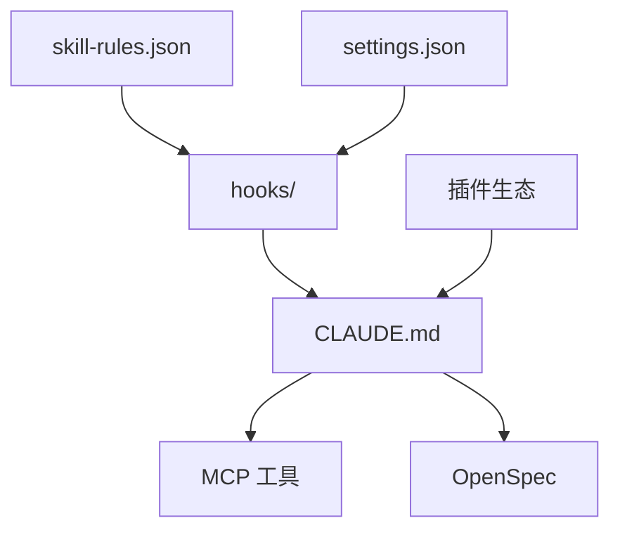

# 架构概览

<cite>
**本文档引用的文件**
- [README.md](file://README.md)
- [CLAUDE.md](file://CLAUDE.md)
- [global/CLAUDE.md](file://global/CLAUDE.md)
- [.mcp.json](file://.mcp.json)
- [settings.json](file://settings.json)
- [skills/skill-rules.json](file://skills/skill-rules.json)
- [skills/skill-developer/SKILL.md](file://skills/skill-developer/SKILL.md)
- [skills/dev-workflow/SKILL.md](file://skills/dev-workflow/SKILL.md)
- [skills/git-workflow/SKILL.md](file://skills/git-workflow/SKILL.md)
- [skills/python-backend-guidelines/SKILL.md](file://skills/python-backend-guidelines/SKILL.md)
- [hooks/skill-activation-prompt.sh](file://hooks/skill-activation-prompt.sh)
- [hooks/post-tool-use-tracker.sh](file://hooks/post-tool-use-tracker.sh)
- [setup-claude-config.sh](file://setup-claude-config.sh)
- [setup-global.sh](file://setup-global.sh)
</cite>

## 目录
1. [简介](#简介)
2. [项目结构](#项目结构)
3. [核心组件](#核心组件)
4. [架构总览](#架构总览)
5. [详细组件分析](#详细组件分析)
6. [依赖关系分析](#依赖关系分析)
7. [性能考量](#性能考量)
8. [故障排查指南](#故障排查指南)
9. [结论](#结论)

## 简介
本文件为 ontologyDevOS 项目的架构概览文档，聚焦于三大核心架构：多 AI 协同架构、技能系统架构与配置管理架构。文档解释各组件间的交互关系与数据流向，并重点阐述 MCP 协议在系统中的作用与重要性；同时介绍插件系统的设计理念与扩展机制，说明全局配置与项目配置的层次结构，最后提供系统边界图与组件关系图，帮助开发者快速理解系统的运行机制。

## 项目结构
项目采用“模板 + 脚本 + 配置 + 技能”的分层组织方式：
- 模板与脚本：通过全局与项目级部署脚本，将 CLAUDE.md、hooks、skills、agents、OpenSpec、MCP 配置等安装到目标环境
- 配置层：全局 CLAUDE.md（多 AI 协同规则）与项目 CLAUDE.md（SDD 流程与交叉检查），以及 settings.json、.mcp.json 等
- 技能层：以 skill-rules.json 为核心，配合各类 SKILL.md 技能文档，实现自动激活与执行
- 插件与工具：Claude Code CLI、MCP 工具（Codex、Gemini）、插件市场资源（superpowers、pyright-lsp 等）

图表来源
- [setup-global.sh](file://setup-global.sh#L1-L471)
- [setup-claude-config.sh](file://setup-claude-config.sh#L1-L372)
- [CLAUDE.md](file://CLAUDE.md#L1-L440)
- [global/CLAUDE.md](file://global/CLAUDE.md#L1-L147)
- [.mcp.json](file://.mcp.json#L1-L19)
- [settings.json](file://settings.json#L1-L37)
- [skills/skill-rules.json](file://skills/skill-rules.json#L1-L250)

章节来源
- [README.md](file://README.md#L71-L92)
- [setup-global.sh](file://setup-global.sh#L1-L471)
- [setup-claude-config.sh](file://setup-claude-config.sh#L1-L372)

## 核心组件
- 多 AI 协同（MCP）：通过 MCP 协议将 Codex（后端技术顾问）与 Gemini（前端分析主力）注入 Claude，形成“主体思考者 + 交叉验证者”的协同体系
- 技能系统（Skill）：以 skill-rules.json 为触发引擎，结合 UserPromptSubmit 与 PostToolUse 钩子，实现技能的自动激活与执行
- 配置管理（Settings/MCP/CLAUDE.md）：全局与项目级配置分层，支持 Hook 注册、权限控制、MCP 工具注册与多 AI 协同规则
- 插件系统（Plugins）：通过 Claude Code CLI 插件市场安装与管理，提供记忆、LSP、RAG、Git 辅助、代码审查等能力
- OpenSpec 集成：将提案、设计、实现、审查、测试、归档的六阶段流程与三阶段工作流统一，贯穿项目生命周期

章节来源
- [CLAUDE.md](file://CLAUDE.md#L102-L125)
- [global/CLAUDE.md](file://global/CLAUDE.md#L76-L95)
- [skills/skill-rules.json](file://skills/skill-rules.json#L1-L250)
- [settings.json](file://settings.json#L1-L37)
- [.mcp.json](file://.mcp.json#L1-L19)

## 架构总览
系统以 Claude Code CLI 为中心，围绕“多 AI 协同 + 技能系统 + 配置管理 + 插件生态 + OpenSpec 工作流”构建闭环。数据流从用户请求进入，经过 CLAUDE.md 的规则解析与技能系统触发，必要时调用 MCP 工具进行交叉验证或扩展分析，最终产出代码、文档与测试报告，并通过 OpenSpec 完成规范演进与归档。

图表来源
- [CLAUDE.md](file://CLAUDE.md#L102-L125)
- [skills/skill-rules.json](file://skills/skill-rules.json#L1-L250)
- [hooks/skill-activation-prompt.sh](file://hooks/skill-activation-prompt.sh#L1-L6)
- [hooks/post-tool-use-tracker.sh](file://hooks/post-tool-use-tracker.sh#L1-L178)
- [.mcp.json](file://.mcp.json#L1-L19)

## 详细组件分析

### 多 AI 协同架构（MCP）
- 角色分工
  - Claude Code：主体思考者与决策者，负责理解需求、拆分任务、最终决策
  - Codex：后端技术顾问，负责复杂算法与架构审查、交叉验证
  - Gemini：前端分析主力，负责大文本/长代码分析与前端实现
- MCP 工具注册
  - 通过 .mcp.json 或 claude mcp add 命令注册 codex 与 gemini-cli
  - 支持 stdio 传输，便于本地/容器内运行
- 使用规范
  - 对非平凡任务，先自问“Codex/Gemini 能否帮助？”再决定是否调用
  - 前端实现优先交给 Gemini，后端实现由 Claude 主导，再由 Codex 交叉验证

图表来源
- [CLAUDE.md](file://CLAUDE.md#L136-L147)
- [.mcp.json](file://.mcp.json#L1-L19)

章节来源
- [CLAUDE.md](file://CLAUDE.md#L102-L125)
- [CLAUDE.md](file://CLAUDE.md#L136-L147)
- [.mcp.json](file://.mcp.json#L1-L19)

### 技能系统架构
- 触发机制
  - UserPromptSubmit：在 Claude 看到用户提示前，基于关键字/意图/路径/内容模式主动建议相关技能
  - PostToolUse：在 Edit/MultiEdit/Write 成功后，跟踪编辑文件并推断构建/类型检查命令
- 配置中心
  - skill-rules.json：定义技能类型（guardrail/domain）、触发关键字/意图/路径/内容模式、执行优先级与跳过条件
  - settings.json：注册 Hook 类型与命令，统一权限与默认模式
- 执行流程
  - 用户输入 → 触发钩子 → skill-activation-prompt.ts 注入上下文 → Claude 选择技能 → 执行 SKILL.md 指南 → PostToolUse 钩子记录与缓存

图表来源
- [skills/skill-rules.json](file://skills/skill-rules.json#L1-L250)
- [settings.json](file://settings.json#L1-L37)
- [hooks/skill-activation-prompt.sh](file://hooks/skill-activation-prompt.sh#L1-L6)
- [hooks/post-tool-use-tracker.sh](file://hooks/post-tool-use-tracker.sh#L1-L178)

章节来源
- [skills/skill-developer/SKILL.md](file://skills/skill-developer/SKILL.md#L28-L58)
- [skills/skill-rules.json](file://skills/skill-rules.json#L1-L250)
- [settings.json](file://settings.json#L13-L35)
- [hooks/skill-activation-prompt.sh](file://hooks/skill-activation-prompt.sh#L1-L6)
- [hooks/post-tool-use-tracker.sh](file://hooks/post-tool-use-tracker.sh#L1-L178)

### 配置管理架构
- 全局配置（~/.claude）
  - global/CLAUDE.md：定义全局项目结构、记忆系统使用、多 AI 协同与交叉检查规则
  - hooks：全局钩子脚本与依赖
  - plugins：插件市场资源同步
- 项目配置（项目根目录/.claude）
  - CLAUDE.md：项目级 SDD 流程、OpenSpec 集成与交叉检查
  - settings.json：Hook 注册、权限与默认模式
  - .mcp.json：MCP 工具注册
  - skills：项目级技能与 skill-rules.json
  - agents：Agent 模板
  - openspec：OpenSpec 规范与变更目录
- 层次结构
  - 全局规则作为基线，项目配置覆盖并细化，遵循“全局优先、项目定制”的原则

图表来源
- [global/CLAUDE.md](file://global/CLAUDE.md#L1-L147)
- [CLAUDE.md](file://CLAUDE.md#L1-L440)
- [settings.json](file://settings.json#L1-L37)
- [.mcp.json](file://.mcp.json#L1-L19)

章节来源
- [README.md](file://README.md#L197-L216)
- [global/CLAUDE.md](file://global/CLAUDE.md#L1-L147)
- [CLAUDE.md](file://CLAUDE.md#L1-L440)

### 插件系统与扩展机制
- 设计理念
  - 通过 Claude Code CLI 插件市场安装与管理，提供记忆、LSP、RAG、Git 辅助、代码审查等能力
  - 与技能系统解耦，通过 Hook 与工具调用集成
- 扩展机制
  - 新插件通过 marketplace 安装，按需启用
  - 与 skill-rules.json 结合，可针对特定文件/意图触发插件辅助（例如 pyright-lsp 的类型检查）
- 典型插件
  - superpowers：13 项技能集合，涵盖头脑风暴、并行任务分发、计划执行、子代理驱动开发、系统化调试、TDD、Git Worktrees 等
  - pyright-lsp：Python LSP 支持
  - pinecone：向量数据库，用于 RAG
  - commit-commands：Git 提交命令增强
  - code-review：代码审查增强

章节来源
- [README.md](file://README.md#L94-L122)
- [setup-global.sh](file://setup-global.sh#L168-L218)

### OpenSpec 集成与 SDD 工作流
- 三阶段工作流与六阶段开发流程统一
  - Stage 1：创建提案（REQUIREMENT + DESIGN）
  - Stage 2：实现变更（IMPLEMENTATION + REVIEW + TESTING）
  - Stage 3：归档完成（DONE）
- 目录结构与文档格式
  - openspec/specs/ 与 openspec/changes/ 目录规范
  - proposal.md、design.md、tasks.md、spec deltas 等标准格式
- 与 CLAUDE.md 的联动
  - 通过 CLAUDE.md 的自动检测逻辑与实现前检查，确保 OpenSpec 规范落地

章节来源
- [CLAUDE.md](file://CLAUDE.md#L220-L307)
- [AGENTS.md](file://AGENTS.md#L1-L18)

## 依赖关系分析
- 组件耦合
  - 技能系统与 Hook 紧密耦合，依赖 skill-rules.json 与 settings.json
  - MCP 工具与 CLAUDE.md 的使用规范强耦合，确保工具调用时机与职责边界清晰
  - OpenSpec 与 CLAUDE.md 强耦合，保证流程一致性
- 外部依赖
  - Claude Code CLI、MCP 工具（Codex、Gemini）、插件市场、Node.js（OpenSpec）
- 潜在循环依赖
  - 未发现直接循环依赖；Hook 与技能系统为单向依赖，MCP 为外部调用

图表来源
- [skills/skill-rules.json](file://skills/skill-rules.json#L1-L250)
- [settings.json](file://settings.json#L1-L37)
- [CLAUDE.md](file://CLAUDE.md#L1-L440)
- [.mcp.json](file://.mcp.json#L1-L19)

章节来源
- [skills/skill-rules.json](file://skills/skill-rules.json#L1-L250)
- [settings.json](file://settings.json#L1-L37)
- [CLAUDE.md](file://CLAUDE.md#L1-L440)

## 性能考量
- Hook 执行开销
  - UserPromptSubmit 与 PostToolUse 钩子应尽量轻量化，避免阻塞主流程
  - 建议对文件路径与内容模式进行合理缓存与去重
- MCP 工具调用
  - 仅在必要时调用，避免频繁跨进程通信
  - 对长文本/大代码库分析优先交给 Gemini，减少 Claude 的负担
- 技能系统优化
  - 控制 SKILL.md 长度（建议不超过 500 行），复杂逻辑下沉至参考文件
  - 使用渐进披露模式，减少一次性加载成本

## 故障排查指南
- MCP 工具不可用
  - 检查 .mcp.json 或 claude mcp list 是否正确注册
  - 确认 codex/gemini-cli 可执行与版本满足要求
- Hook 未生效
  - 检查 settings.json 中的 Hook 注册与匹配器
  - 验证 hooks 脚本可执行权限与依赖安装
- 技能未触发
  - 核对 skill-rules.json 的关键字/意图/路径/内容模式
  - 使用手动测试命令验证 UserPromptSubmit 与 PreToolUse 流程
- OpenSpec 初始化失败
  - 确认 Node.js 版本满足要求（>= 20）
  - 手动执行 openspec init 并检查 openspec/ 目录结构

章节来源
- [setup-claude-config.sh](file://setup-claude-config.sh#L236-L282)
- [setup-global.sh](file://setup-global.sh#L230-L264)
- [skills/skill-developer/SKILL.md](file://skills/skill-developer/SKILL.md#L322-L402)

## 结论
ontologyDevOS 通过“多 AI 协同 + 技能系统 + 配置管理 + 插件生态 + OpenSpec 工作流”的架构设计，实现了从需求到实现再到归档的全生命周期自动化与规范化。MCP 协议在其中扮演关键角色，使 Claude 能够在合适时机调用 Codex 与 Gemini，提升代码质量与开发效率。技能系统与 Hook 机制确保了规则的可配置与可扩展，而全局/项目分层配置则提供了灵活的定制空间。建议在实际使用中持续优化 Hook 与 MCP 调用策略，严格遵循 OpenSpec 规范，以获得最佳的开发体验与产出质量。