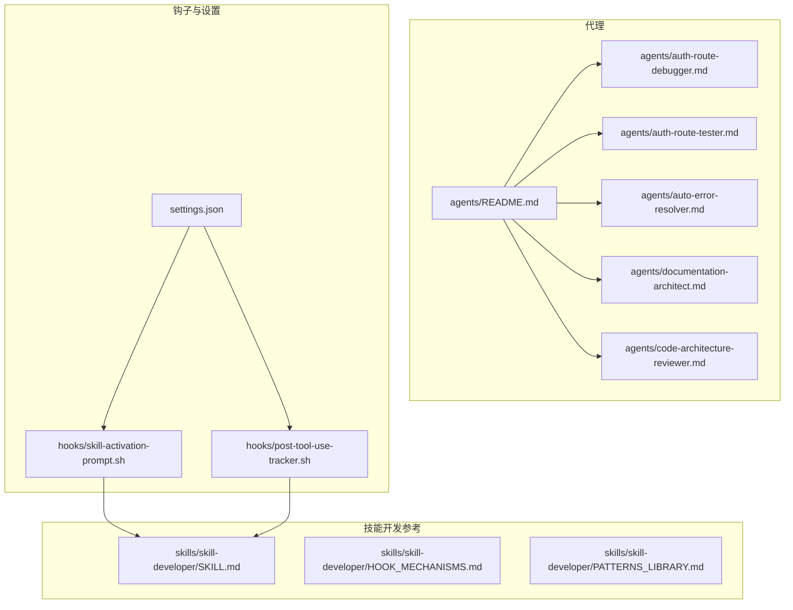
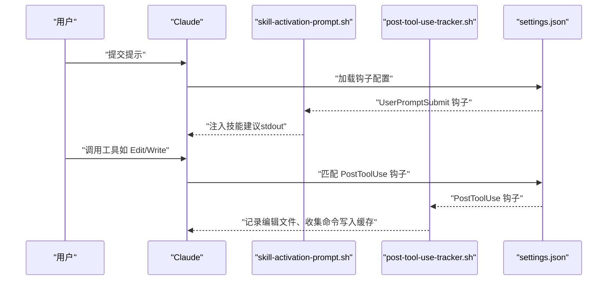
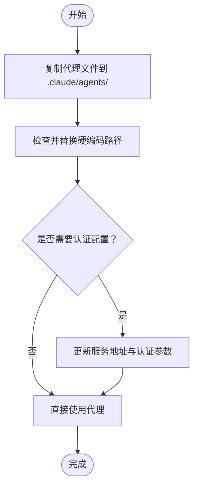
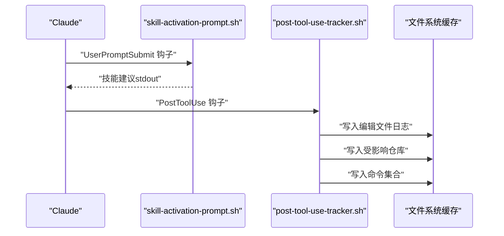
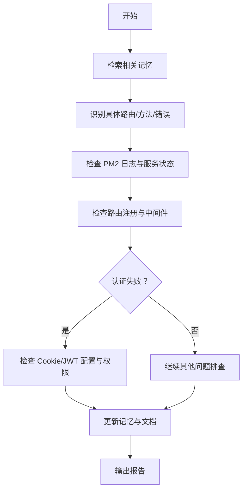
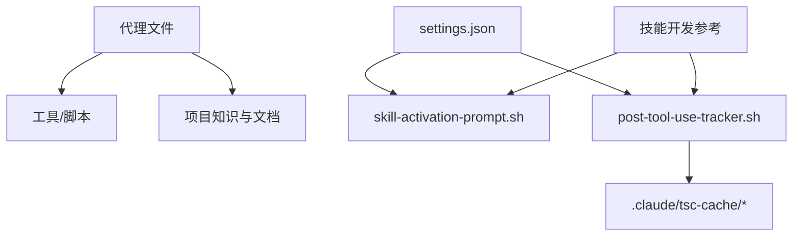

# 代理开发指南

<cite>
**本文引用的文件**
- [agents/README.md](file://agents/README.md)
- [agents/auth-route-debugger.md](file://agents/auth-route-debugger.md)
- [agents/auth-route-tester.md](file://agents/auth-route-tester.md)
- [agents/auto-error-resolver.md](file://agents/auto-error-resolver.md)
- [agents/documentation-architect.md](file://agents/documentation-architect.md)
- [agents/code-architecture-reviewer.md](file://agents/code-architecture-reviewer.md)
- [settings.json](file://settings.json)
- [hooks/skill-activation-prompt.sh](file://hooks/skill-activation-prompt.sh)
- [hooks/post-tool-use-tracker.sh](file://hooks/post-tool-use-tracker.sh)
- [skills/skill-developer/SKILL.md](file://skills/skill-developer/SKILL.md)
- [skills/skill-developer/HOOK_MECHANISMS.md](file://skills/skill-developer/HOOK_MECHANISES.md)
- [skills/skill-developer/PATTERNS_LIBRARY.md](file://skills/skill-developer/PATTERNS_LIBRARY.md)
</cite>

## 目录
1. [简介](#简介)
2. [项目结构](#项目结构)
3. [核心组件](#核心组件)
4. [架构总览](#架构总览)
5. [详细组件分析](#详细组件分析)
6. [依赖关系分析](#依赖关系分析)
7. [性能考虑](#性能考虑)
8. [故障排除指南](#故障排除指南)
9. [结论](#结论)
10. [附录](#附录)

## 简介
本指南面向希望在本项目中创建自定义代理的开发者，系统讲解代理的文件结构、YAML前置元数据、指令编写规范与最佳实践。内容覆盖代理的关键要素：目的描述、步骤说明、工具列表、输出格式；提供完整开发模板与集成部署流程（文件复制、路径检查、定制化配置与故障排除）；并总结常见问题与性能优化建议。

## 项目结构
本项目采用“代理即 Markdown 文件”的设计理念，代理位于 agents/ 目录，每个代理是一个独立的 .md 文件，可直接复制到任意项目中使用。同时，项目提供了技能开发框架与钩子机制，用于增强开发体验与质量控制。

图表来源
- [agents/README.md](file://agents/README.md#L1-L301)
- [settings.json](file://settings.json#L1-L37)
- [hooks/skill-activation-prompt.sh](file://hooks/skill-activation-prompt.sh#L1-L6)
- [hooks/post-tool-use-tracker.sh](file://hooks/post-tool-use-tracker.sh#L1-L178)
- [skills/skill-developer/SKILL.md](file://skills/skill-developer/SKILL.md#L1-L427)

章节来源
- [agents/README.md](file://agents/README.md#L1-L301)
- [settings.json](file://settings.json#L1-L37)

## 核心组件
- 代理文件：以 Markdown 结构组织，支持 YAML 前置元数据（name、description、tools、model、color 等），并在正文定义 Purpose、Instructions、Tools Available、Expected Output 等关键要素。
- 钩子与设置：settings.json 注册 UserPromptSubmit 与 PostToolUse 钩子，分别用于“提示技能激活”和“编辑后追踪”。脚本文件负责实际执行逻辑。
- 技能开发参考：提供技能触发类型、执行流程、退出码行为、会话状态管理与性能优化等深度机制，便于理解代理与技能的协同关系。

章节来源
- [agents/README.md](file://agents/README.md#L240-L267)
- [settings.json](file://settings.json#L13-L36)
- [hooks/skill-activation-prompt.sh](file://hooks/skill-activation-prompt.sh#L1-L6)
- [hooks/post-tool-use-tracker.sh](file://hooks/post-tool-use-tracker.sh#L1-L178)
- [skills/skill-developer/SKILL.md](file://skills/skill-developer/SKILL.md#L28-L58)

## 架构总览
代理与技能的协作围绕 Claude 的工具使用生命周期展开：UserPromptSubmit 钩子在用户提交提示前注入技能建议；PostToolUse 钩子在工具执行后进行缓存与命令收集，为后续代理（如自动错误解析）提供上下文信息。

图表来源
- [settings.json](file://settings.json#L13-L36)
- [hooks/skill-activation-prompt.sh](file://hooks/skill-activation-prompt.sh#L1-L6)
- [hooks/post-tool-use-tracker.sh](file://hooks/post-tool-use-tracker.sh#L1-L178)

## 详细组件分析

### 代理文件结构与 YAML 前置元数据
- 文件结构：标准 Markdown，支持 YAML 前置元数据块（可选）。元数据字段包括 name、description、tools、model、color 等。
- 正文结构：建议包含 Purpose、Instructions、Tools Available、Expected Output 等部分，确保指令明确、步骤清晰、工具与输出格式固定。

章节来源
- [agents/README.md](file://agents/README.md#L240-L267)
- [agents/auth-route-debugger.md](file://agents/auth-route-debugger.md#L1-L6)
- [agents/auth-route-tester.md](file://agents/auth-route-tester.md#L1-L6)
- [agents/auto-error-resolver.md](file://agents/auto-error-resolver.md#L1-L6)
- [agents/documentation-architect.md](file://agents/documentation-architect.md#L1-L6)
- [agents/code-architecture-reviewer.md](file://agents/code-architecture-reviewer.md#L1-L6)

### 指令编写规范与关键要素
- 目的描述（Purpose）：清晰说明代理职责与适用场景，便于用户快速判断是否使用。
- 步骤说明（Instructions）：将复杂任务拆分为编号步骤，明确输入、过程与输出。
- 工具列表（Tools Available）：列出代理可用工具，避免未授权操作。
- 输出格式（Expected Output）：固定输出结构，便于后续处理与归档。

章节来源
- [agents/README.md](file://agents/README.md#L250-L258)
- [agents/auth-route-debugger.md](file://agents/auth-route-debugger.md#L19-L118)
- [agents/auth-route-tester.md](file://agents/auth-route-tester.md#L62-L94)
- [agents/auto-error-resolver.md](file://agents/auto-error-resolver.md#L9-L97)
- [agents/documentation-architect.md](file://agents/documentation-architect.md#L10-L83)
- [agents/code-architecture-reviewer.md](file://agents/code-architecture-reviewer.md#L23-L84)

### 代理集成与部署流程
- 标准集成：复制 .md 文件至目标项目 .claude/agents/ 目录，即可直接使用。
- 路径检查：扫描并替换硬编码路径，统一使用 $CLAUDE_PROJECT_DIR 或相对路径。
- 定制化配置：根据代理特性（如认证、截图路径等）进行必要更新。
- 故障排除：检查代理文件是否存在、路径是否正确、工具权限是否满足。

图表来源
- [agents/README.md](file://agents/README.md#L149-L187)

章节来源
- [agents/README.md](file://agents/README.md#L149-L187)

### 代理开发模板与最佳实践
- 模板结构：参考现有代理文件，确保 YAML 元数据与正文结构一致。
- 最佳实践：
  - 指令具体明确，步骤编号化；
  - 明确列出可用工具；
  - 固定输出格式，便于自动化处理；
  - 避免硬编码路径，使用环境变量或相对路径；
  - 对认证类代理，提供配置指引与示例命令。

章节来源
- [agents/README.md](file://agents/README.md#L240-L267)
- [agents/auth-route-debugger.md](file://agents/auth-route-debugger.md#L1-L118)
- [agents/auth-route-tester.md](file://agents/auth-route-tester.md#L1-L94)
- [agents/auto-error-resolver.md](file://agents/auto-error-resolver.md#L1-L97)
- [agents/documentation-architect.md](file://agents/documentation-architect.md#L1-L83)
- [agents/code-architecture-reviewer.md](file://agents/code-architecture-reviewer.md#L1-L84)

### 代理与钩子的协作
- UserPromptSubmit 钩子：在用户提交提示前，基于技能规则注入相关技能建议，提升上下文质量。
- PostToolUse 钩子：在工具执行后，记录编辑文件、识别仓库、生成构建与类型检查命令，为代理提供上下文缓存。

图表来源
- [settings.json](file://settings.json#L13-L36)
- [hooks/skill-activation-prompt.sh](file://hooks/skill-activation-prompt.sh#L1-L6)
- [hooks/post-tool-use-tracker.sh](file://hooks/post-tool-use-tracker.sh#L1-L178)

章节来源
- [settings.json](file://settings.json#L13-L36)
- [hooks/skill-activation-prompt.sh](file://hooks/skill-activation-prompt.sh#L1-L6)
- [hooks/post-tool-use-tracker.sh](file://hooks/post-tool-use-tracker.sh#L1-L178)

### 代理示例分析

#### 认证路由调试代理（auth-route-debugger）
- 职责：诊断认证问题、测试已认证路由、检查路由注册与中间件配置、整合项目记忆。
- 工作流：初始评估 → 检查服务日志 → 路由注册检查 → 认证测试 → 常见问题排查 → 文档更新。
- 输出：根因、重现步骤、修复方案、测试命令、配置变更、记忆/文档更新。

图表来源
- [agents/auth-route-debugger.md](file://agents/auth-route-debugger.md#L19-L118)

章节来源
- [agents/auth-route-debugger.md](file://agents/auth-route-debugger.md#L1-L118)

#### 认证路由测试代理（auth-route-tester）
- 职责：端到端功能测试、数据库记录验证、实现审查、调试方法论。
- 工作流：确保服务运行 → 创建测试数据 → 使用认证脚本测试 → 验证数据库变更 → 清理临时代码 → 生成报告。
- 输出：测试结果、数据库变更、发现问题、修复方案、改进建议、审查要点。

章节来源
- [agents/auth-route-tester.md](file://agents/auth-route-tester.md#L1-L94)

#### 自动错误解析代理（auto-error-resolver）
- 职责：自动修复 TypeScript 编译错误，系统化分析与修复，验证修复有效性。
- 工作流：读取错误缓存 → 检查服务日志 → 分析错误类型 → 逐类修复 → 验证修复 → 报告完成。
- 输出：修复摘要与验证结果。

章节来源
- [agents/auto-error-resolver.md](file://agents/auto-error-resolver.md#L1-L97)

#### 文档架构师代理（documentation-architect）
- 职责：收集上下文、创建高质量文档、确定文档位置策略、质量保证。
- 方法论：发现 → 分析 → 文档创建 → 质量保证 → 输出指导。
- 输出：文档结构建议、上下文摘要、可读性强的文档。

章节来源
- [agents/documentation-architect.md](file://agents/documentation-architect.md#L1-L83)

#### 代码架构评审代理（code-architecture-reviewer）
- 职责：审查代码质量与架构一致性、提问设计决策、验证系统集成、保存评审结果。
- 方法论：实现质量分析 → 质疑设计决策 → 验证系统集成 → 评估架构契合度 → 提供建设性反馈 → 保存评审 → 返回父进程。
- 输出：评审报告（含关键/重要/次要问题与下一步）。

章节来源
- [agents/code-architecture-reviewer.md](file://agents/code-architecture-reviewer.md#L1-L84)

## 依赖关系分析
- 代理依赖：代理文件本身独立，但其执行可能依赖项目中的工具与脚本（如认证测试脚本、日志查看命令等）。
- 钩子依赖：settings.json 注册钩子，脚本文件负责实际执行；钩子依赖文件系统缓存与命令检测逻辑。
- 技能与代理：技能开发参考文件为代理与技能的协同提供机制基础（触发类型、执行流程、退出码行为等）。

图表来源
- [settings.json](file://settings.json#L13-L36)
- [hooks/skill-activation-prompt.sh](file://hooks/skill-activation-prompt.sh#L1-L6)
- [hooks/post-tool-use-tracker.sh](file://hooks/post-tool-use-tracker.sh#L1-L178)
- [skills/skill-developer/SKILL.md](file://skills/skill-developer/SKILL.md#L1-L427)

章节来源
- [settings.json](file://settings.json#L13-L36)
- [hooks/post-tool-use-tracker.sh](file://hooks/post-tool-use-tracker.sh#L1-L178)
- [skills/skill-developer/SKILL.md](file://skills/skill-developer/SKILL.md#L1-L427)

## 性能考虑
- 代理执行效率：尽量减少外部工具调用次数，合并相似操作；对日志与命令的读取与解析进行必要的缓存与去重。
- 钩子性能：UserPromptSubmit 与 PreToolUse 钩子应控制在毫秒级响应，避免阻塞用户交互；对正则匹配与文件路径匹配进行优化。
- 资源使用：避免在代理中进行长时间运行的操作，必要时使用异步或分批处理。

## 故障排除指南
- 代理未找到：检查 .claude/agents/ 下是否存在目标代理文件。
- 路径错误：扫描代理文件中的硬编码路径，替换为 $CLAUDE_PROJECT_DIR 或相对路径。
- 认证问题：确认代理所需的认证配置（如 JWT Cookie）是否正确设置。
- 工具权限不足：检查代理声明的工具列表与实际可用权限是否匹配。

章节来源
- [agents/README.md](file://agents/README.md#L269-L291)

## 结论
通过遵循本指南的文件结构、指令编写规范与最佳实践，并结合钩子与技能开发参考，开发者可以高效创建可复用、可定制、可维护的代理，显著提升开发与运维效率。

## 附录

### 代理开发模板（不含代码内容）
- YAML 元数据（示例字段）
  - name：代理名称
  - description：代理描述与触发关键词
  - tools：可用工具列表
  - model：模型偏好
  - color：主题色
- 正文结构
  - 目的（Purpose）
  - 指令（Instructions）
  - 工具（Tools Available）
  - 输出（Expected Output）

章节来源
- [agents/README.md](file://agents/README.md#L240-L267)

### 指令编写技巧与工具使用说明
- 指令编写技巧
  - 明确具体、步骤编号化；
  - 指定返回格式与示例；
  - 包含常见问题与规避措施。
- 工具使用说明
  - 明确列出可用工具；
  - 对认证类代理提供配置示例；
  - 对路径类代理提供替换指引。

章节来源
- [agents/README.md](file://agents/README.md#L260-L266)
- [agents/auth-route-debugger.md](file://agents/auth-route-debugger.md#L1-L118)
- [agents/auth-route-tester.md](file://agents/auth-route-tester.md#L1-L94)
- [agents/auto-error-resolver.md](file://agents/auto-error-resolver.md#L1-L97)

### 结果格式化要求
- 固定输出结构：根因、重现步骤、修复方案、测试命令、配置变更、记忆/文档更新；
- 报告保存：按约定路径保存评审或测试报告；
- 可读性：语言简洁、条理清晰、包含必要上下文。

章节来源
- [agents/auth-route-debugger.md](file://agents/auth-route-debugger.md#L106-L118)
- [agents/auth-route-tester.md](file://agents/auth-route-tester.md#L70-L94)
- [agents/code-architecture-reviewer.md](file://agents/code-architecture-reviewer.md#L63-L84)

### 钩子机制与技能开发参考
- UserPromptSubmit 钩子：在提示提交前注入技能建议，非阻塞。
- PreToolUse 钩子：在工具执行前进行阻塞式校验（退出码 2），stderr 传递消息给 Claude。
- 会话状态管理：防止同一会话内重复阻塞。
- 性能优化：减少正则与路径匹配数量，缓存编译后的正则，优化文件读取。

章节来源
- [skills/skill-developer/HOOK_MECHANISMS.md](file://skills/skill-developer/HOOK_MECHANISMS.md#L15-L167)
- [skills/skill-developer/HOOK_MECHANISMS.md](file://skills/skill-developer/HOOK_MECHANISMS.md#L211-L257)
- [skills/skill-developer/HOOK_MECHANISMS.md](file://skills/skill-developer/HOOK_MECHANISMS.md#L260-L301)
- [skills/skill-developer/SKILL.md](file://skills/skill-developer/SKILL.md#L314-L321)
- [skills/skill-developer/PATTERNS_LIBRARY.md](file://skills/skill-developer/PATTERNS_LIBRARY.md#L1-L153)