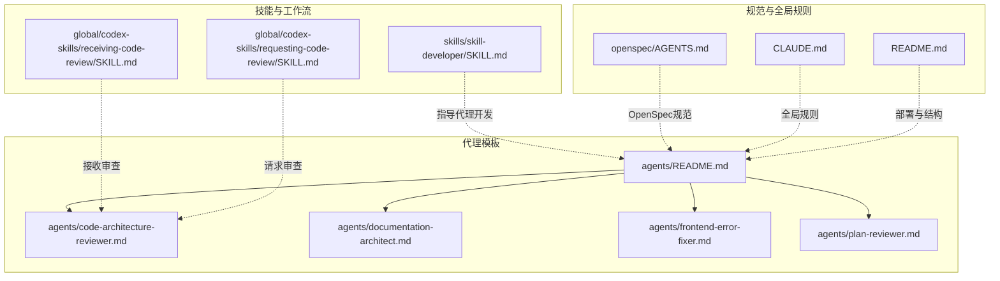
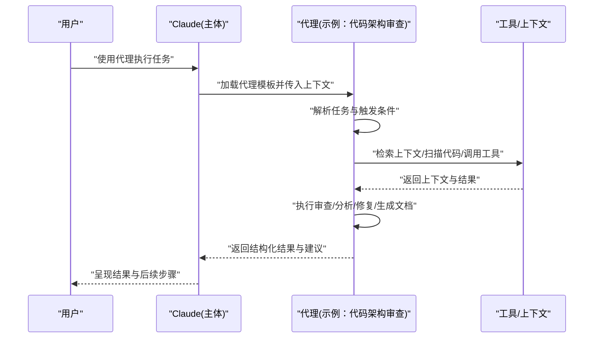
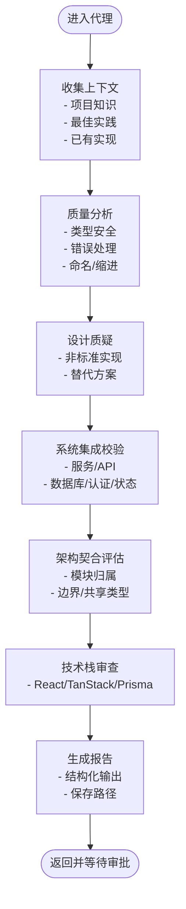
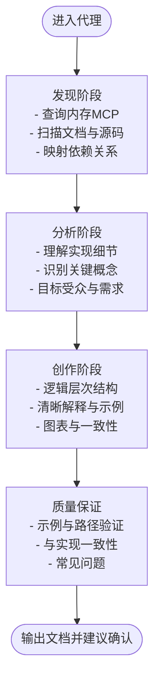
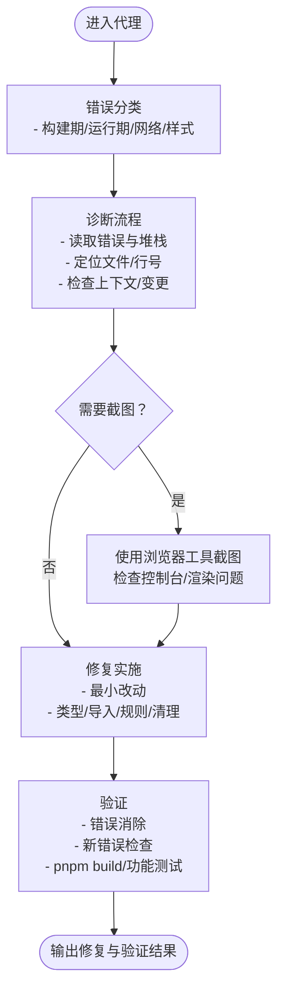
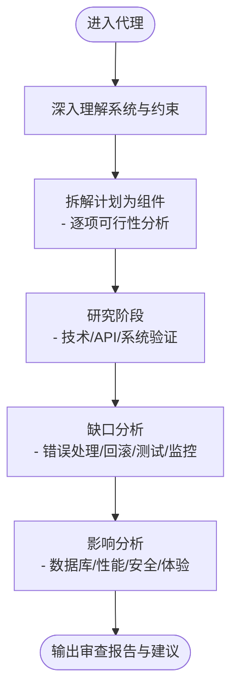
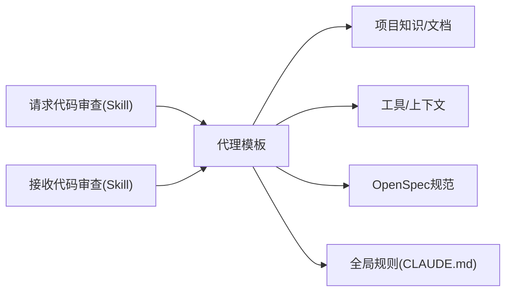

# 代理模板系统

<cite>
**本文引用的文件**
- [agents/README.md](file://agents/README.md)
- [agents/code-architecture-reviewer.md](file://agents/code-architecture-reviewer.md)
- [agents/documentation-architect.md](file://agents/documentation-architect.md)
- [agents/frontend-error-fixer.md](file://agents/frontend-error-fixer.md)
- [agents/plan-reviewer.md](file://agents/plan-reviewer.md)
- [global/codex-skills/receiving-code-review/SKILL.md](file://global/codex-skills/receiving-code-review/SKILL.md)
- [global/codex-skills/requesting-code-review/SKILL.md](file://global/codex-skills/requesting-code-review/SKILL.md)
- [skills/skill-developer/SKILL.md](file://skills/skill-developer/SKILL.md)
- [openspec/AGENTS.md](file://openspec/AGENTS.md)
- [CLAUDE.md](file://CLAUDE.md)
- [README.md](file://README.md)
</cite>

## 目录
1. [简介](#简介)
2. [项目结构](#项目结构)
3. [核心组件](#核心组件)
4. [架构总览](#架构总览)
5. [详细组件分析](#详细组件分析)
6. [依赖关系分析](#依赖关系分析)
7. [性能考量](#性能考量)
8. [故障排查指南](#故障排查指南)
9. [结论](#结论)
10. [附录](#附录)

## 简介
本文件系统化阐述“代理模板系统”的设计理念、应用场景与实现机制，聚焦四类专业代理：代码架构审查代理、文档架构代理、前端错误修复代理、规划审查代理。文档同时提供代理开发指南，涵盖模板结构、触发条件、执行逻辑与结果输出，并展示如何创建与定制代理以满足特定开发需求。

该系统基于 Markdown 代理模板与 OpenSpec 规范驱动开发方法论，强调“先规范、后实现”，并通过多 AI 协同（Claude 主体、Codex 交叉验证、Gemini 前端实现）提升质量与效率。

## 项目结构
代理模板位于 agents/ 目录，配套技能与工作流规则位于 skills/ 与 global/codex-skills/，OpenSpec 规范与指令位于 openspec/ 与 CLAUDE.md。整体采用“模板即资产”的轻量集成方式，便于复制即用。

**图表来源**
- [agents/README.md](file://agents/README.md#L1-L301)
- [skills/skill-developer/SKILL.md](file://skills/skill-developer/SKILL.md#L1-L427)
- [openspec/AGENTS.md](file://openspec/AGENTS.md#L1-L457)
- [CLAUDE.md](file://CLAUDE.md#L1-L440)
- [README.md](file://README.md#L71-L92)

**章节来源**
- [agents/README.md](file://agents/README.md#L1-L301)
- [README.md](file://README.md#L71-L92)

## 核心组件
- 代码架构审查代理：面向新实现、重构后的代码进行架构一致性与最佳实践审查，产出结构化评审报告。
- 文档架构代理：围绕新功能或变更收集上下文，生成开发者友好的文档，覆盖 API、数据流、测试等维度。
- 前端错误修复代理：针对构建期与运行期前端错误进行分类诊断与精准修复，必要时使用浏览器工具截图定位问题。
- 规划审查代理：在实现前对开发计划进行深度审查，识别风险、缺失考虑与替代方案，输出可执行的改进建议。

上述代理均以独立 Markdown 文件形式提供，具备明确的用途、步骤、工具可用性与期望输出，支持直接复制到项目中使用。

**章节来源**
- [agents/code-architecture-reviewer.md](file://agents/code-architecture-reviewer.md#L1-L84)
- [agents/documentation-architect.md](file://agents/documentation-architect.md#L1-L83)
- [agents/frontend-error-fixer.md](file://agents/frontend-error-fixer.md#L1-L77)
- [agents/plan-reviewer.md](file://agents/plan-reviewer.md#L1-L53)

## 架构总览
代理模板系统遵循“模板即服务”的架构：Claude 通过任务工具调用各代理，代理在自身上下文中执行多步分析与输出，最终返回结构化结果。OpenSpec 与全局规则确保变更在规范框架内进行，多 AI 协同保证质量与一致性。

**图表来源**
- [agents/code-architecture-reviewer.md](file://agents/code-architecture-reviewer.md#L23-L81)
- [agents/documentation-architect.md](file://agents/documentation-architect.md#L12-L82)
- [agents/frontend-error-fixer.md](file://agents/frontend-error-fixer.md#L17-L76)
- [agents/plan-reviewer.md](file://agents/plan-reviewer.md#L10-L52)

## 详细组件分析

### 代码架构审查代理
- 设计理念：以“系统集成”“架构契合”“技术栈一致性”为核心，强调 TypeScript、React、TanStack Router/Query、Prisma、JWT Cookie 认证等项目关键技术栈的最佳实践。
- 应用场景：新功能实现后、重构后、合并前、架构决策验证时。
- 执行机制：
  - 分析实现质量（类型安全、错误处理、命名规范、异步处理、缩进标准）
  - 质疑设计决策（非标准实现、未来债务、维护成本）
  - 校验系统集成（服务/API、数据库、认证、工作流引擎、状态管理）
  - 评估架构契合（模块归属、关注点分离、微服务边界、共享类型）
  - 特定技术审查（React 组件、API 客户端、数据库、状态管理）
  - 保存与反馈（结构化评审报告，明确严重程度与下一步）
- 结果输出：按“摘要/关键问题/重要改进/次要建议/架构考量/后续步骤”组织，保存至 dev/active/[task]/[task]-code-review.md。

**图表来源**
- [agents/code-architecture-reviewer.md](file://agents/code-architecture-reviewer.md#L23-L81)

**章节来源**
- [agents/code-architecture-reviewer.md](file://agents/code-architecture-reviewer.md#L1-L84)

### 文档架构代理
- 设计理念：围绕复杂系统创建全面、易读、可维护的开发者文档，强调上下文收集、结构化输出与质量保障。
- 应用场景：新功能文档、API 文档、数据流图、测试文档、架构概览。
- 执行机制：
  - 上下文收集：内存 MCP、现有文档、相关源码、架构依赖
  - 文档创建：开发者指南、README、API 文档、数据流图、测试文档
  - 位置策略：优先特性本地文档、遵循既有模式、逻辑目录结构
  - 方法论：发现→分析→创作→质量保证（示例准确、路径存在、匹配实现、常见问题）
  - 标准与注意事项：清晰技术语言、目录索引、语法高亮、快速入门与详解、版本与更新时间、跨引用、一致性
- 结果输出：结构化文档，建议先行总结与结构确认，确保可读性与可维护性。

**图表来源**
- [agents/documentation-architect.md](file://agents/documentation-architect.md#L33-L82)

**章节来源**
- [agents/documentation-architect.md](file://agents/documentation-architect.md#L1-L83)

### 前端错误修复代理
- 设计理念：精确诊断与修复前端错误，区分构建期与运行期问题，最小化改动，保留既有功能。
- 应用场景：TypeScript/打包/ESLint 错误、浏览器控制台错误、React 错误、网络问题、样式渲染问题。
- 执行机制：
  - 错误分类：构建期/运行期/网络/样式
  - 诊断流程：读取错误消息与堆栈、定位文件与行号、检查上下文与最近变更、必要时使用浏览器工具截图
  - 修复策略：最小化修复、保留结构与模式、补充防御性编程、遵循项目命名与缩进规范
  - 验证：确认修复、检查新错误、构建验证、功能测试
  - 常见模式：空值访问、类型不匹配、模块未找到、语法错误、CORS、Hook 规则、内存泄漏
- 结果输出：修复后的代码与简要说明，必要时附带截图与验证结果。

**图表来源**
- [agents/frontend-error-fixer.md](file://agents/frontend-error-fixer.md#L19-L76)

**章节来源**
- [agents/frontend-error-fixer.md](file://agents/frontend-error-fixer.md#L1-L77)

### 规划审查代理
- 设计理念：在实现前对开发计划进行系统性审查，识别数据库影响、依赖冲突、替代方案与风险，输出可执行建议。
- 应用场景：新认证系统集成、数据库迁移、API 集成、类型安全、错误处理、性能与安全、测试策略、回滚计划。
- 执行机制：
  - 深入理解：系统架构、当前实现与约束
  - 计划拆解：逐项可行性与完整性分析
  - 研究验证：技术/API/系统兼容性与限制
  - 缺口分析：错误处理、回滚、测试、监控
  - 影响评估：对现有功能、性能、安全、用户体验的影响
- 结果输出：摘要、关键问题、缺失考虑、替代方案、实施建议、风险缓解、研究发现。

**图表来源**
- [agents/plan-reviewer.md](file://agents/plan-reviewer.md#L17-L52)

**章节来源**
- [agents/plan-reviewer.md](file://agents/plan-reviewer.md#L1-L53)

## 依赖关系分析
- 代理模板依赖于项目知识与文档（如 PROJECT_KNOWLEDGE.md、BEST_PRACTICES.md），以及工具与上下文（如浏览器工具、内存 MCP、源码扫描）。
- OpenSpec 与全局规则（CLAUDE.md）为代理提供规范与流程约束，确保变更在受控环境中进行。
- 代码审查技能（请求/接收）与代理形成闭环：代理产出结果后，通过技能进行反馈与迭代。

**图表来源**
- [agents/code-architecture-reviewer.md](file://agents/code-architecture-reviewer.md#L17-L21)
- [global/codex-skills/requesting-code-review/SKILL.md](file://global/codex-skills/requesting-code-review/SKILL.md#L24-L48)
- [global/codex-skills/receiving-code-review/SKILL.md](file://global/codex-skills/receiving-code-review/SKILL.md#L14-L25)
- [openspec/AGENTS.md](file://openspec/AGENTS.md#L1-L457)
- [CLAUDE.md](file://CLAUDE.md#L26-L100)

**章节来源**
- [openspec/AGENTS.md](file://openspec/AGENTS.md#L1-L457)
- [CLAUDE.md](file://CLAUDE.md#L26-L100)
- [global/codex-skills/requesting-code-review/SKILL.md](file://global/codex-skills/requesting-code-review/SKILL.md#L1-L106)
- [global/codex-skills/receiving-code-review/SKILL.md](file://global/codex-skills/receiving-code-review/SKILL.md#L1-L210)

## 性能考量
- 代理执行的性能取决于上下文收集与工具调用次数。建议：
  - 限定代理作用域，避免无关文件扫描
  - 使用增量上下文（如仅针对变更文件）
  - 合理利用缓存与快照（如浏览器截图）
  - 在 OpenSpec 指引下，先规范后实现，减少返工带来的额外开销

## 故障排查指南
- 代理未找到：确认代理文件存在于 .claude/agents/ 下，名称与调用一致。
- 路径错误：检查代理中是否存在硬编码路径，替换为 $CLAUDE_PROJECT_DIR 或相对路径。
- 自动化审查流程：
  - 请求审查：使用 superpowers:code-reviewer 子代理，填充模板占位符，按批次修复并验证。
  - 接收审查：严格验证后再实施，对不明确或错误建议进行技术性推翻与澄清。

**章节来源**
- [agents/README.md](file://agents/README.md#L269-L291)
- [global/codex-skills/requesting-code-review/SKILL.md](file://global/codex-skills/requesting-code-review/SKILL.md#L24-L48)
- [global/codex-skills/receiving-code-review/SKILL.md](file://global/codex-skills/receiving-code-review/SKILL.md#L40-L84)

## 结论
代理模板系统以“模板即资产”为核心，结合 OpenSpec 规范与多 AI 协同，提供可复制、可定制的专业代理，覆盖架构审查、文档生成、前端修复与规划审查四大场景。通过标准化的触发条件、执行逻辑与结果输出，代理能够稳定地提升代码质量、降低沟通成本并加速交付。

## 附录

### 代理开发指南
- 模板结构
  - 标题与用途：清晰描述代理职责
  - 指令：分步骤的自主执行说明
  - 可用工具：明确列出可使用的工具与上下文
  - 期望输出：规定结果格式与保存位置
- 触发条件
  - 明确使用场景与前置条件（如新功能、重构、合并前、实现前）
- 执行逻辑
  - 上下文收集、分析、执行、验证、输出
  - 引用项目知识与最佳实践
- 结果输出
  - 结构化报告，包含摘要、关键问题、改进建议与后续步骤
  - 保存到约定路径，便于归档与追溯

**章节来源**
- [agents/README.md](file://agents/README.md#L240-L266)
- [agents/code-architecture-reviewer.md](file://agents/code-architecture-reviewer.md#L63-L81)
- [agents/documentation-architect.md](file://agents/documentation-architect.md#L75-L82)
- [agents/frontend-error-fixer.md](file://agents/frontend-error-fixer.md#L39-L76)
- [agents/plan-reviewer.md](file://agents/plan-reviewer.md#L35-L52)