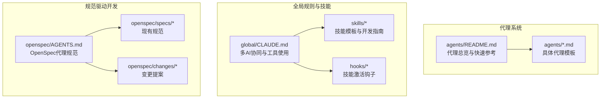
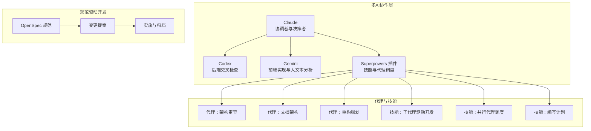
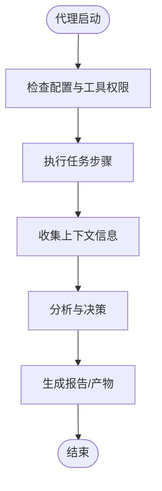
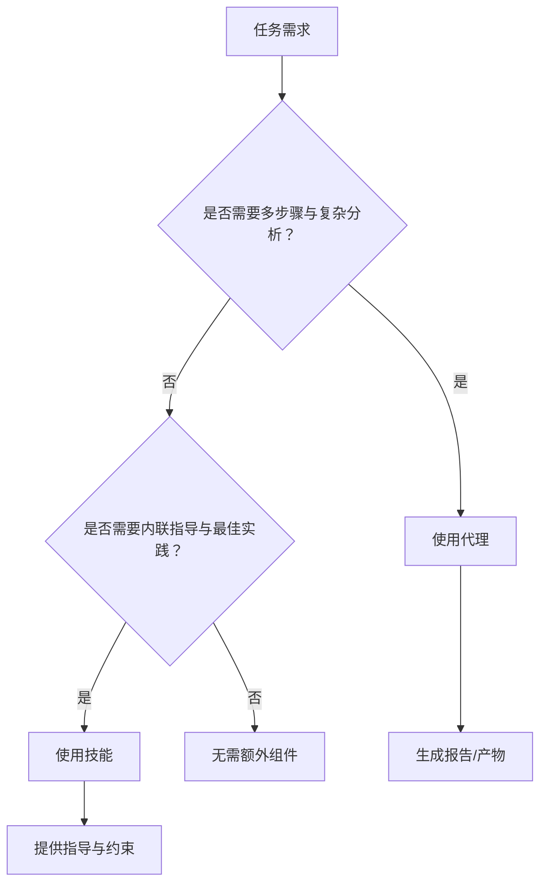
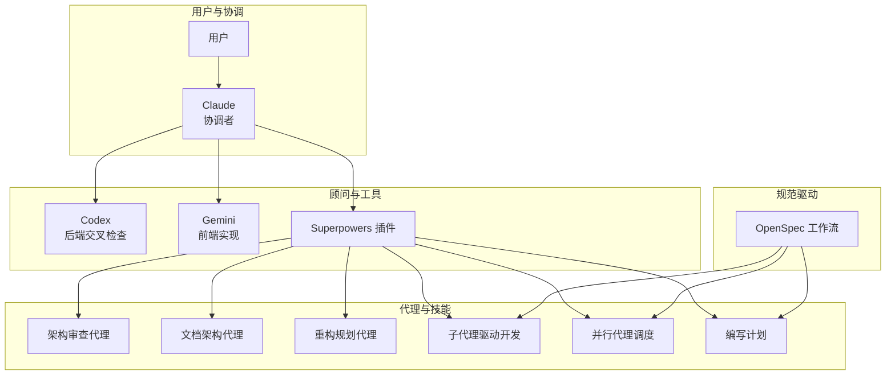
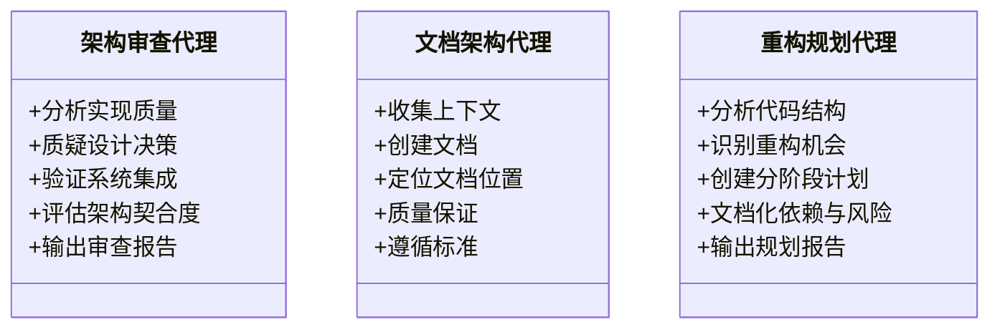
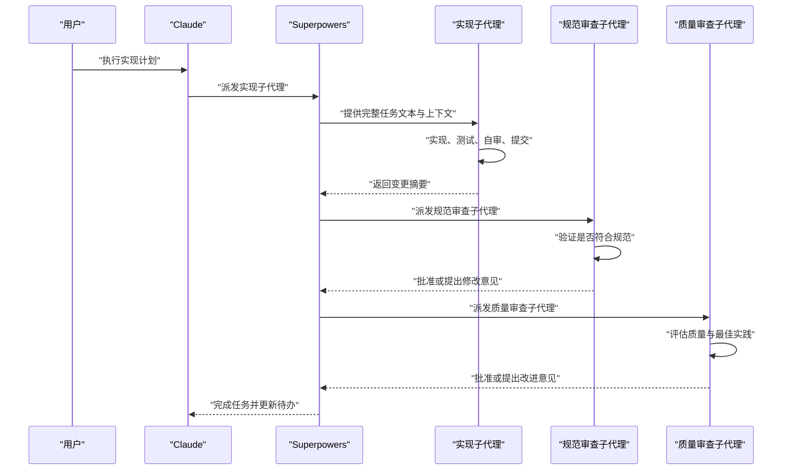
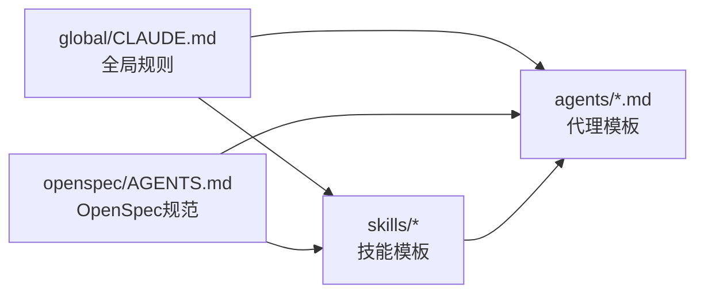

# 代理系统概览

<cite>
**本文档引用的文件**
- [agents/README.md](file://agents/README.md)
- [agents/code-architecture-reviewer.md](file://agents/code-architecture-reviewer.md)
- [agents/documentation-architect.md](file://agents/documentation-architect.md)
- [agents/refactor-planner.md](file://agents/refactor-planner.md)
- [global/CLAUDE.md](file://global/CLAUDE.md)
- [README.md](file://README.md)
- [openspec/AGENTS.md](file://openspec/AGENTS.md)
- [global/codex-skills/subagent-driven-development/SKILL.md](file://global/codex-skills/subagent-driven-development/SKILL.md)
- [global/codex-skills/dispatching-parallel-agents/SKILL.md](file://global/codex-skills/dispatching-parallel-agents/SKILL.md)
- [global/codex-skills/writing-plans/SKILL.md](file://global/codex-skills/writing-plans/SKILL.md)
</cite>

## 目录
1. [简介](#简介)
2. [项目结构](#项目结构)
3. [核心组件](#核心组件)
4. [架构总览](#架构总览)
5. [详细组件分析](#详细组件分析)
6. [依赖关系分析](#依赖关系分析)
7. [性能考虑](#性能考虑)
8. [故障排除指南](#故障排除指南)
9. [结论](#结论)
10. [附录](#附录)

## 简介
本文件为代理系统概览，面向希望在多AI协同开发环境中高效使用代理的开发者。内容涵盖代理的基本概念、设计理念与核心优势，明确代理与技能的区别及适用场景，并系统阐述代理的三大特性：独立运行能力、自主工作能力与专用工具访问权限。同时提供代理系统的整体架构图，展示代理在多AI协同开发中的作用，并附带快速参考表，帮助开发者快速选择合适的代理类型。

## 项目结构
该仓库采用“模板+工作区”的组织方式，核心与代理相关的目录包括：
- agents/：代理模板集合，每个代理以独立的Markdown文件形式提供，便于复制即用
- global/：全局规则与技能集合，包含多AI协同、工具使用、规范驱动开发等指导
- skills/：技能模板与开发指南，强调触发机制、钩子与最佳实践
- openspec/：规范驱动开发（SDD）的变更提案与规范目录
- hooks/：技能激活钩子脚本，支持提示注入与错误处理提醒

**图表来源**
- [agents/README.md](file://agents/README.md#L1-L301)
- [global/CLAUDE.md](file://global/CLAUDE.md#L1-L147)
- [openspec/AGENTS.md](file://openspec/AGENTS.md#L1-L457)

**章节来源**
- [agents/README.md](file://agents/README.md#L1-L301)
- [global/CLAUDE.md](file://global/CLAUDE.md#L1-L147)
- [openspec/AGENTS.md](file://openspec/AGENTS.md#L1-L457)

## 核心组件
- 代理（Agents）：专门处理复杂、多步骤任务的自治Claude实例，具备独立运行、自主工作与专用工具访问能力，适合一次性或阶段性任务，结果以报告形式返回。
- 技能（Skills）：提供内联指导与最佳实践，强调触发机制、钩子与持续提醒，适合在开发过程中提供即时建议与约束。
- OpenSpec：规范驱动开发框架，定义变更提案、设计与实施的三阶段工作流，确保规范与实现一致。
- 多AI协同：Claude作为协调者，Codex负责后端交叉检查，Gemini负责前端实现与大文本分析，形成“主体思考+顾问交叉验证”的协作模式。

**章节来源**
- [agents/README.md](file://agents/README.md#L7-L16)
- [global/CLAUDE.md](file://global/CLAUDE.md#L76-L95)
- [openspec/AGENTS.md](file://openspec/AGENTS.md#L15-L64)

## 架构总览
下图展示了代理系统在多AI协同开发中的整体架构：Claude作为协调者，通过Superpowers插件调度子代理与技能；OpenSpec贯穿需求、设计与实施阶段；代理以独立模板形式存在，可在不同项目中直接复用。

**图表来源**
- [global/CLAUDE.md](file://global/CLAUDE.md#L76-L133)
- [global/codex-skills/subagent-driven-development/SKILL.md](file://global/codex-skills/subagent-driven-development/SKILL.md#L1-L241)
- [global/codex-skills/dispatching-parallel-agents/SKILL.md](file://global/codex-skills/dispatching-parallel-agents/SKILL.md#L1-L181)
- [global/codex-skills/writing-plans/SKILL.md](file://global/codex-skills/writing-plans/SKILL.md#L1-L117)
- [openspec/AGENTS.md](file://openspec/AGENTS.md#L15-L64)

## 详细组件分析

### 代理基本概念与三大特性
- 独立运行能力：代理为独立的Markdown文件，复制即可使用，无需额外配置，适合跨项目迁移与复用。
- 自主工作能力：代理具备明确的指令、可用工具与期望输出格式，能够在最小监督下完成复杂任务。
- 专用工具访问权限：代理可按需访问特定工具或资源，如文档生成、架构审查、重构规划等。

**图表来源**
- [agents/README.md](file://agents/README.md#L149-L168)

**章节来源**
- [agents/README.md](file://agents/README.md#L7-L16)
- [agents/README.md](file://agents/README.md#L149-L168)

### 代理与技能的区别与适用场景
- 何时使用代理：任务需要多步骤、复杂分析、自主工作且有明确终点；例如架构审查、文档生成、重构规划。
- 何时使用技能：需要内联指导、最佳实践检查与持续提醒；例如编写计划、并行代理调度、子代理驱动开发。
- 两者结合：技能在开发过程中提供模式与规范，代理在完成后进行综合评审与产出。

**图表来源**
- [agents/README.md](file://agents/README.md#L190-L203)

**章节来源**
- [agents/README.md](file://agents/README.md#L190-L203)

### 代理系统整体架构图（多AI协同开发）

**图表来源**
- [global/CLAUDE.md](file://global/CLAUDE.md#L76-L133)
- [global/codex-skills/subagent-driven-development/SKILL.md](file://global/codex-skills/subagent-driven-development/SKILL.md#L1-L241)
- [global/codex-skills/dispatching-parallel-agents/SKILL.md](file://global/codex-skills/dispatching-parallel-agents/SKILL.md#L1-L181)
- [global/codex-skills/writing-plans/SKILL.md](file://global/codex-skills/writing-plans/SKILL.md#L1-L117)

### 代理模板解析与职责边界
- 架构审查代理：专注于代码质量、设计决策与系统集成，输出结构化审查报告，强调可操作建议与优先级。
- 文档架构代理：负责从记忆、现有文档与源码中收集上下文，生成高质量开发者文档，覆盖API、数据流与测试文档。
- 重构规划代理：对代码结构进行系统分析，识别重构机会，制定分阶段、低风险的重构计划，包含依赖与风险评估。

**图表来源**
- [agents/code-architecture-reviewer.md](file://agents/code-architecture-reviewer.md#L1-L84)
- [agents/documentation-architect.md](file://agents/documentation-architect.md#L1-L83)
- [agents/refactor-planner.md](file://agents/refactor-planner.md#L1-L63)

**章节来源**
- [agents/code-architecture-reviewer.md](file://agents/code-architecture-reviewer.md#L1-L84)
- [agents/documentation-architect.md](file://agents/documentation-architect.md#L1-L83)
- [agents/refactor-planner.md](file://agents/refactor-planner.md#L1-L63)

### 多AI协同中的代理工作流
- 子代理驱动开发：在同一会话中，针对每个任务派发新的子代理，先进行规范符合性审查，再进行代码质量审查，实现快速迭代与质量门禁。
- 并行代理调度：当存在多个相互独立的问题域时，派发一个代理处理一个问题域，让其并发工作，显著提升效率。
- 编写计划：在动手编码前，先写出可执行的实现计划，明确任务粒度、文件路径与测试方法，随后选择执行策略（同一会话或并行会话）。

**图表来源**
- [global/codex-skills/subagent-driven-development/SKILL.md](file://global/codex-skills/subagent-driven-development/SKILL.md#L38-L83)

**章节来源**
- [global/codex-skills/subagent-driven-development/SKILL.md](file://global/codex-skills/subagent-driven-development/SKILL.md#L1-L241)
- [global/codex-skills/dispatching-parallel-agents/SKILL.md](file://global/codex-skills/dispatching-parallel-agents/SKILL.md#L1-L181)
- [global/codex-skills/writing-plans/SKILL.md](file://global/codex-skills/writing-plans/SKILL.md#L1-L117)

## 依赖关系分析
- 代理依赖于全局规则与工具：代理模板中声明的工具与模型选择需与全局配置一致，确保在不同项目中可移植。
- 技能与代理互补：技能提供触发与约束，代理提供执行与产出；两者共同构成“指导—执行—评审”的闭环。
- OpenSpec贯穿始终：从变更提案到设计与实施，代理与技能均应遵循OpenSpec的工作流与规范要求。

**图表来源**
- [global/CLAUDE.md](file://global/CLAUDE.md#L1-L147)
- [openspec/AGENTS.md](file://openspec/AGENTS.md#L1-L457)

**章节来源**
- [global/CLAUDE.md](file://global/CLAUDE.md#L1-L147)
- [openspec/AGENTS.md](file://openspec/AGENTS.md#L1-L457)

## 性能考虑
- 代理的独立性降低耦合成本：每个代理独立运行，减少共享状态与冲突，提高并行效率。
- 子代理驱动开发减少上下文切换：在同一会话中连续执行任务，避免手递手等待，缩短反馈周期。
- 并行代理调度提升多问题域修复速度：独立问题域并发处理，显著缩短整体修复时间。
- OpenSpec的严格校验与场景化要求有助于早期发现问题，降低返工成本。

[本节为通用性能讨论，不涉及具体文件分析]

## 故障排除指南
- 代理不可用：检查代理文件是否存在、路径是否正确、是否包含硬编码路径。
- 路径错误：在复制代理后，替换硬编码路径为环境变量或相对路径。
- 认证代理无法使用：确认JWT Cookie认证配置正确，服务URL已更新为目标环境。
- 代理输出不符合预期：核对代理的工具列表与期望输出格式，必要时调整提示与工具权限。

**章节来源**
- [agents/README.md](file://agents/README.md#L269-L291)

## 结论
代理系统通过“独立运行、自主工作、专用工具访问”三大特性，为复杂任务提供了高可移植、高效率的解决方案。在多AI协同开发中，代理与技能相辅相成：技能提供内联指导与约束，代理负责执行与产出。配合OpenSpec的规范驱动工作流，代理能够更好地融入团队开发流程，提升交付质量与效率。

[本节为总结性内容，不涉及具体文件分析]

## 附录

### 代理快速参考表
- 架构审查代理：中等复杂度，无需定制，无认证需求
- 文档架构代理：中等复杂度，无需定制，无认证需求
- 重构规划代理：中等复杂度，无需定制，无认证需求
- 前端错误修复代理：中等复杂度，截图路径需定制，无认证需求
- 认证路由测试代理：中等复杂度，需JWT Cookie认证，认证设置需定制
- 认证路由调试代理：中等复杂度，需JWT Cookie认证，认证设置需定制
- 自动错误修复代理：低复杂度，路径需定制，无认证需求
- 计划审查代理：低复杂度，无需定制，无认证需求
- 代码重构大师：高复杂度，无需定制，无认证需求
- 网络研究专家：低复杂度，无需定制，无认证需求

**章节来源**
- [agents/README.md](file://agents/README.md#L206-L220)