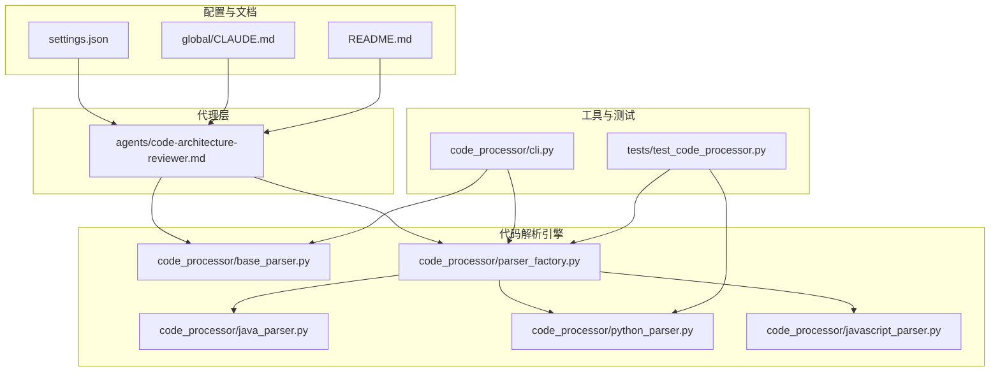
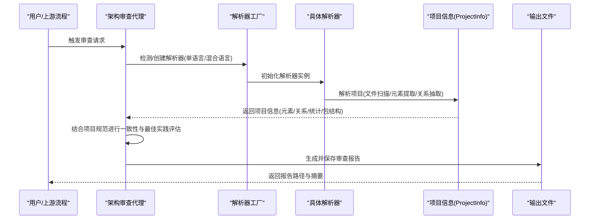
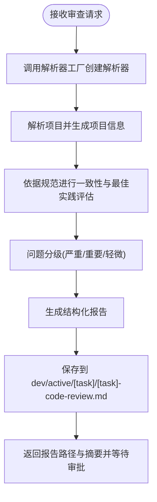
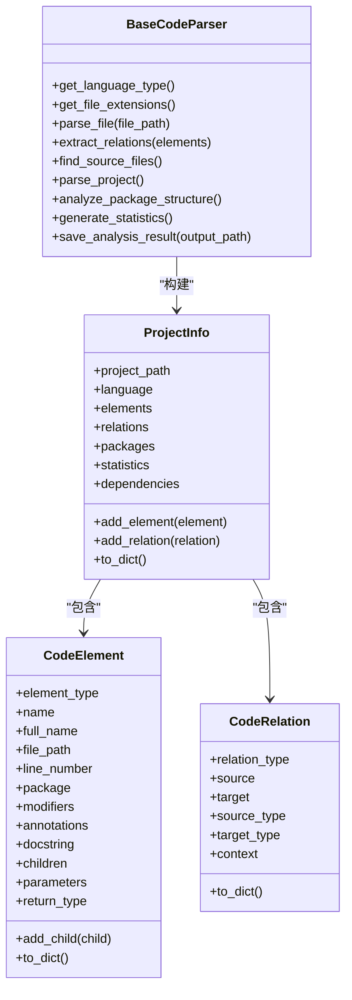
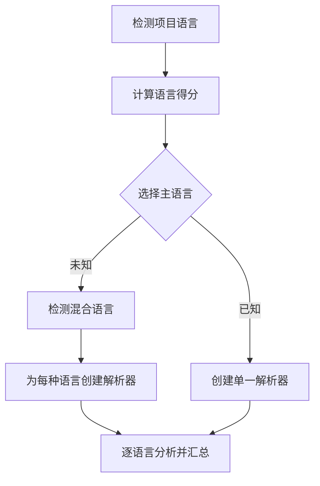
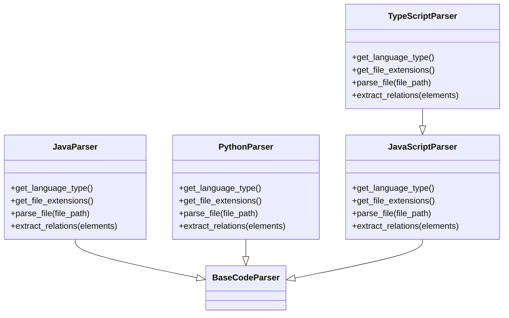
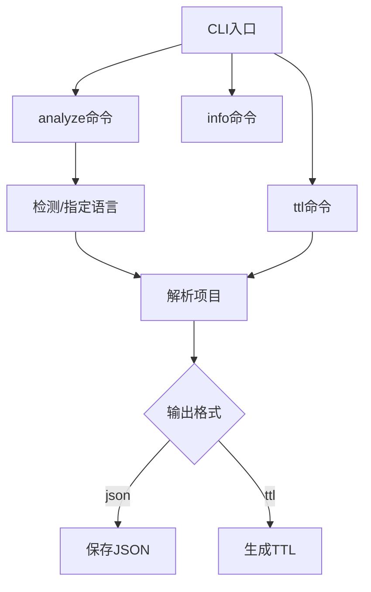
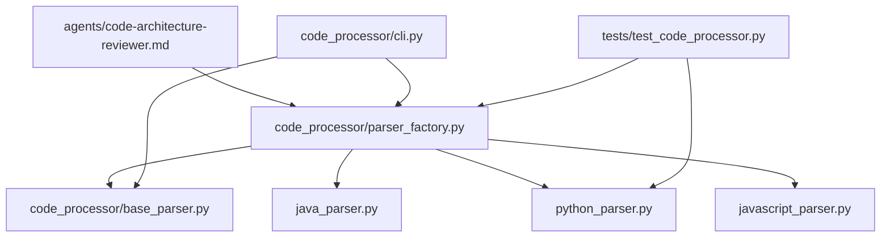

# 代码架构审查代理

<cite>
**本文引用的文件**
- [agents/code-architecture-reviewer.md](file://agents/code-architecture-reviewer.md)
- [code_processor/__init__.py](file://code_processor/__init__.py)
- [code_processor/base_parser.py](file://code_processor/base_parser.py)
- [code_processor/parser_factory.py](file://code_processor/parser_factory.py)
- [code_processor/java_parser.py](file://code_processor/java_parser.py)
- [code_processor/python_parser.py](file://code_processor/python_parser.py)
- [code_processor/javascript_parser.py](file://code_processor/javascript_parser.py)
- [code_processor/cli.py](file://code_processor/cli.py)
- [tests/test_code_processor.py](file://tests/test_code_processor.py)
- [settings.json](file://settings.json)
- [global/CLAUDE.md](file://global/CLAUDE.md)
- [README.md](file://README.md)
</cite>

## 目录
1. [简介](#简介)
2. [项目结构](#项目结构)
3. [核心组件](#核心组件)
4. [架构总览](#架构总览)
5. [详细组件分析](#详细组件分析)
6. [依赖关系分析](#依赖关系分析)
7. [性能考量](#性能考量)
8. [故障排查指南](#故障排查指南)
9. [结论](#结论)
10. [附录](#附录)

## 简介
本文件面向“代码架构审查代理”，系统化阐述其核心功能、工作流程、输出格式与配置方法，并结合代码库中的多语言代码解析模块，提供从代码扫描、架构模式识别到问题分类与报告生成的完整说明。该代理专注于：
- 代码架构一致性检查：确保新增或修改代码符合项目整体架构与模块边界
- 最佳实践评估：基于项目规范与现有模式进行质量与风格评估
- 架构合理性验证：验证技术选型与实现是否满足性能、安全与可维护性要求

同时，文档提供典型使用场景（新功能审查、合并前验证、重构前后对比）与定制化建议，帮助团队在不同阶段高效应用该代理。

## 项目结构
该项目采用“代理模板 + 多语言代码解析引擎 + CLI 工具 + 测试”的组织方式：
- agents：存放各类专业代理的模板与说明，其中 code-architecture-reviewer.md 定义了架构审查代理的行为与输出规范
- code_processor：多语言代码解析引擎，支持 Java、Python、JavaScript/TypeScript，提供统一的数据模型与工厂模式
- tests：单元测试，覆盖解析器与数据模型的关键行为
- 其他根级文件：全局配置、设置、README 等

**图表来源**
- [agents/code-architecture-reviewer.md](file://agents/code-architecture-reviewer.md#L1-L84)
- [code_processor/base_parser.py](file://code_processor/base_parser.py#L1-L358)
- [code_processor/parser_factory.py](file://code_processor/parser_factory.py#L1-L248)
- [code_processor/java_parser.py](file://code_processor/java_parser.py#L1-L425)
- [code_processor/python_parser.py](file://code_processor/python_parser.py#L1-L455)
- [code_processor/javascript_parser.py](file://code_processor/javascript_parser.py#L1-L548)
- [code_processor/cli.py](file://code_processor/cli.py#L1-L215)
- [tests/test_code_processor.py](file://tests/test_code_processor.py#L1-L139)
- [settings.json](file://settings.json#L1-L37)
- [global/CLAUDE.md](file://global/CLAUDE.md#L1-L147)
- [README.md](file://README.md#L1-L229)

**章节来源**
- [README.md](file://README.md#L71-L92)
- [agents/code-architecture-reviewer.md](file://agents/code-architecture-reviewer.md#L1-L84)

## 核心组件
- 代理模板：定义审查范围、评估维度、输出结构与保存路径
- 解析器基类与数据模型：统一抽象、元素与关系建模、统计与包结构分析
- 解析器工厂：自动检测语言、创建解析器实例、混合语言项目分析
- 多语言解析器：Java、Python、JavaScript/TypeScript 的语法特性提取
- CLI 工具：命令行入口，支持单语言/混合语言分析与 TTL 输出
- 测试：覆盖解析器行为与数据模型转换

**章节来源**
- [agents/code-architecture-reviewer.md](file://agents/code-architecture-reviewer.md#L23-L83)
- [code_processor/base_parser.py](file://code_processor/base_parser.py#L82-L203)
- [code_processor/parser_factory.py](file://code_processor/parser_factory.py#L20-L171)
- [code_processor/java_parser.py](file://code_processor/java_parser.py#L39-L128)
- [code_processor/python_parser.py](file://code_processor/python_parser.py#L22-L147)
- [code_processor/javascript_parser.py](file://code_processor/javascript_parser.py#L22-L130)
- [code_processor/cli.py](file://code_processor/cli.py#L32-L164)
- [tests/test_code_processor.py](file://tests/test_code_processor.py#L17-L139)

## 架构总览
代理工作流由“代码扫描 + 模式识别 + 问题分类 + 报告生成”构成，结合解析引擎对项目进行全量结构化分析，形成统一的“项目信息”对象，供代理进行架构一致性与最佳实践评估。

**图表来源**
- [agents/code-architecture-reviewer.md](file://agents/code-architecture-reviewer.md#L63-L83)
- [code_processor/parser_factory.py](file://code_processor/parser_factory.py#L122-L171)
- [code_processor/base_parser.py](file://code_processor/base_parser.py#L263-L298)
- [code_processor/cli.py](file://code_processor/cli.py#L32-L102)

## 详细组件分析

### 代理模板：代码架构审查代理
- 审查范围与维度：实现质量、设计决策、系统集成、架构契合度、特定技术栈规范
- 输出结构：摘要、严重问题、重要改进、轻微建议、架构考虑、下一步
- 保存与返回：按任务名保存至 dev/active/[task]/[task]-code-review.md，并提示等待审批

**图表来源**
- [agents/code-architecture-reviewer.md](file://agents/code-architecture-reviewer.md#L23-L83)

**章节来源**
- [agents/code-architecture-reviewer.md](file://agents/code-architecture-reviewer.md#L1-L84)

### 数据模型与解析流程：BaseCodeParser 与 ProjectInfo
- 统一抽象：LanguageType、ElementType、RelationType、CodeElement、CodeRelation、ProjectInfo
- 文件扫描：排除常见目录，支持多种扩展名
- 关系抽取：继承、实现、导入、调用、使用、覆盖、装饰等
- 统计与包结构：元素类型分布、关系类型分布、包内元素统计

**图表来源**
- [code_processor/base_parser.py](file://code_processor/base_parser.py#L17-L203)

**章节来源**
- [code_processor/base_parser.py](file://code_processor/base_parser.py#L1-L358)

### 解析器工厂：语言检测与多语言分析
- 语言检测：基于项目指标与文件扩展名打分
- 多语言支持：Java、Python、JavaScript、TypeScript
- 混合项目：自动识别并创建多个解析器，统一汇总结果

**图表来源**
- [code_processor/parser_factory.py](file://code_processor/parser_factory.py#L48-L121)
- [code_processor/parser_factory.py](file://code_processor/parser_factory.py#L143-L171)

**章节来源**
- [code_processor/parser_factory.py](file://code_processor/parser_factory.py#L1-L248)

### 多语言解析器实现要点
- Java：基于 javalang 语法树，提取类、接口、枚举、方法、字段、注解、继承/实现/导入关系
- Python：基于 AST，提取类、函数、变量、装饰器、方法覆盖、调用关系、导入关系
- JavaScript/TypeScript：基于正则与 AST 特征，提取组件、Hook、函数、类、接口、类型别名、枚举、导入/导出关系

**图表来源**
- [code_processor/java_parser.py](file://code_processor/java_parser.py#L39-L128)
- [code_processor/python_parser.py](file://code_processor/python_parser.py#L22-L147)
- [code_processor/javascript_parser.py](file://code_processor/javascript_parser.py#L22-L130)
- [code_processor/javascript_parser.py](file://code_processor/javascript_parser.py#L446-L548)

**章节来源**
- [code_processor/java_parser.py](file://code_processor/java_parser.py#L1-L425)
- [code_processor/python_parser.py](file://code_processor/python_parser.py#L1-L455)
- [code_processor/javascript_parser.py](file://code_processor/javascript_parser.py#L1-L548)

### CLI 工具：命令行入口与输出
- analyze：单语言/混合语言分析，输出统计与元素/关系概览；支持 JSON/TTL 输出
- ttl：从项目分析结果生成 TTL
- info：显示支持语言与命令帮助

**图表来源**
- [code_processor/cli.py](file://code_processor/cli.py#L167-L215)
- [code_processor/cli.py](file://code_processor/cli.py#L32-L164)

**章节来源**
- [code_processor/cli.py](file://code_processor/cli.py#L1-L215)

## 依赖关系分析
- 代理依赖解析器工厂与具体解析器，以获得统一的项目信息
- CLI 作为外部入口，直接调用解析器工厂与解析器
- 测试覆盖解析器与数据模型的关键行为，保证解析稳定性

**图表来源**
- [agents/code-architecture-reviewer.md](file://agents/code-architecture-reviewer.md#L1-L84)
- [code_processor/parser_factory.py](file://code_processor/parser_factory.py#L1-L248)
- [code_processor/base_parser.py](file://code_processor/base_parser.py#L1-L358)
- [code_processor/java_parser.py](file://code_processor/java_parser.py#L1-L425)
- [code_processor/python_parser.py](file://code_processor/python_parser.py#L1-L455)
- [code_processor/javascript_parser.py](file://code_processor/javascript_parser.py#L1-L548)
- [code_processor/cli.py](file://code_processor/cli.py#L1-L215)
- [tests/test_code_processor.py](file://tests/test_code_processor.py#L1-L139)

**章节来源**
- [code_processor/__init__.py](file://code_processor/__init__.py#L11-L40)
- [tests/test_code_processor.py](file://tests/test_code_processor.py#L1-L139)

## 性能考量
- 文件过滤：解析前排除常见构建/缓存/IDE目录，减少无效扫描
- 异常容错：解析单文件失败不中断整体流程，记录警告日志
- 统计聚合：在解析完成后一次性生成统计与包结构，避免重复遍历
- CLI 输出：支持 JSON/TTL 两种输出，便于后续处理与可视化

**章节来源**
- [code_processor/base_parser.py](file://code_processor/base_parser.py#L242-L298)
- [code_processor/parser_factory.py](file://code_processor/parser_factory.py#L90-L121)
- [code_processor/cli.py](file://code_processor/cli.py#L94-L100)

## 故障排查指南
- 语言检测失败：确认项目中存在支持的语言指示文件或扩展名
- 解析异常：查看日志定位具体文件，检查语法与编码格式
- 缺少依赖：Java 解析需安装 javalang；Python 解析依赖标准库 AST
- 权限与钩子：确保项目设置允许编辑与工具钩子执行

**章节来源**
- [code_processor/java_parser.py](file://code_processor/java_parser.py#L42-L46)
- [settings.json](file://settings.json#L1-L37)
- [global/CLAUDE.md](file://global/CLAUDE.md#L30-L57)

## 结论
代码架构审查代理通过统一的多语言解析引擎，将代码结构转化为可评估的项目信息，结合代理模板的评估维度与输出规范，形成可操作的审查报告。该体系既适用于新功能审查、合并前验证，也可用于重构前后对比，具备良好的扩展性与可维护性。

## 附录

### 使用场景示例
- 新功能实现后审查：提交代码后触发代理，生成报告并等待审批
- 合并前验证：在 PR 中运行代理，优先修复严重问题
- 重构前后对比：分别对重构前后的版本运行代理，对比报告差异

### 输出格式与报告结构
- 报告文件：dev/active/[task]/[task]-code-review.md
- 结构字段：摘要、严重问题、重要改进、轻微建议、架构考虑、下一步
- 保存与返回：包含“最后更新日期”，返回报告路径与摘要，并提示等待审批

**章节来源**
- [agents/code-architecture-reviewer.md](file://agents/code-architecture-reviewer.md#L63-L83)

### 配置选项与定制化建议
- 项目设置：权限与钩子配置，确保代理与工具链正常运行
- 全局规则：遵循全局 CLAUDE.md 的多 AI 协同与交叉检查原则
- 代理定制：根据项目规范调整评估维度与优先级，确保与现有文档一致

**章节来源**
- [settings.json](file://settings.json#L1-L37)
- [global/CLAUDE.md](file://global/CLAUDE.md#L76-L147)
- [README.md](file://README.md#L141-L173)