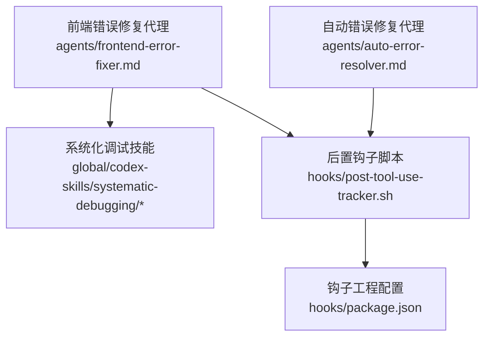
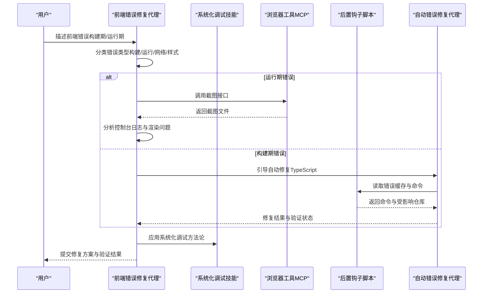
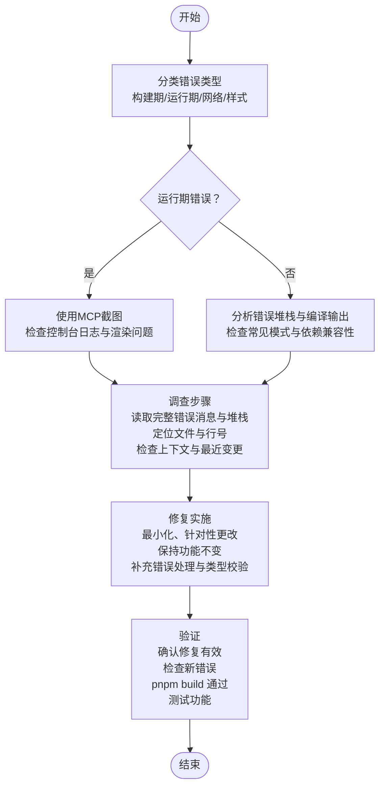
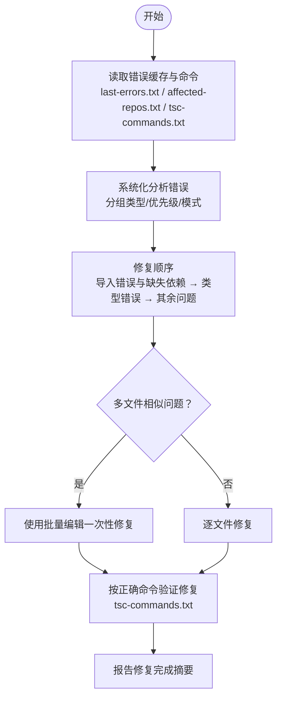
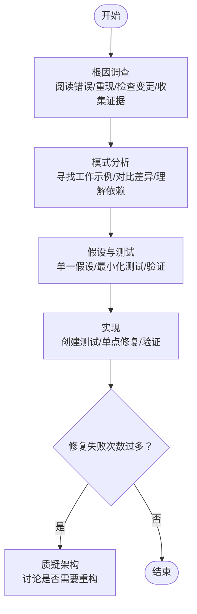
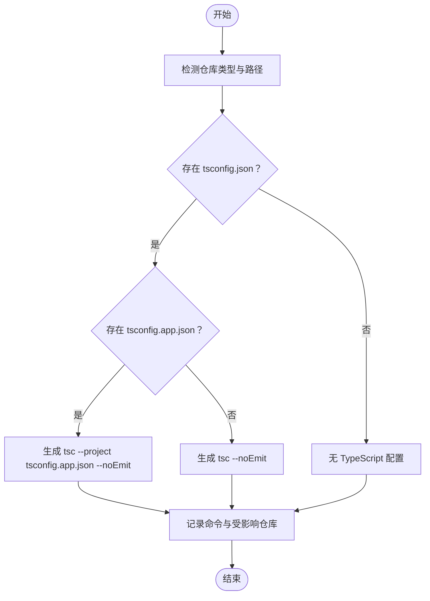
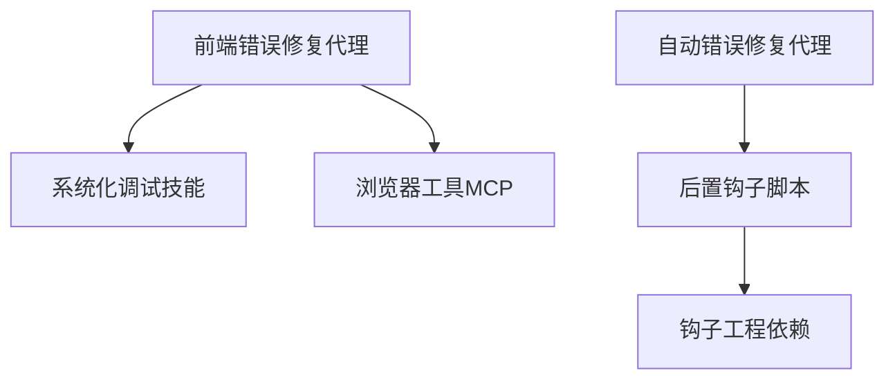

# 前端错误修复代理

<cite>
**本文引用的文件**
- [agents/frontend-error-fixer.md](file://agents/frontend-error-fixer.md)
- [agents/auto-error-resolver.md](file://agents/auto-error-resolver.md)
- [global/codex-skills/systematic-debugging/SKILL.md](file://global/codex-skills/systematic-debugging/SKILL.md)
- [global/codex-skills/systematic-debugging/root-cause-tracing.md](file://global/codex-skills/systematic-debugging/root-cause-tracing.md)
- [global/codex-skills/systematic-debugging/defense-in-depth.md](file://global/codex-skills/systematic-debugging/defense-in-depth.md)
- [agents/README.md](file://agents/README.md)
- [hooks/post-tool-use-tracker.sh](file://hooks/post-tool-use-tracker.sh)
- [hooks/package.json](file://hooks/package.json)
</cite>

## 目录
1. [简介](#简介)
2. [项目结构](#项目结构)
3. [核心组件](#核心组件)
4. [架构总览](#架构总览)
5. [详细组件分析](#详细组件分析)
6. [依赖关系分析](#依赖关系分析)
7. [性能考虑](#性能考虑)
8. [故障排除指南](#故障排除指南)
9. [结论](#结论)
10. [附录](#附录)

## 简介
本文件面向前端错误修复代理（frontend-error-fixer）的深度文档化目标，系统阐述其在以下方面的职责与能力：
- 前端问题诊断：区分构建期与运行期错误，结合浏览器工具与日志进行精准定位
- 代码修复：基于最小变更原则，确保类型安全与功能不变的前提下修复问题
- 构建失败处理：针对 TypeScript 编译、打包与 Lint 错误进行系统化解析与修复
- 截图处理机制：通过浏览器工具 MCP 捕获错误状态，辅助可视化定位
- 根因定位策略：遵循系统化调试方法论，采用“回溯溯源—防御式加固”的闭环流程

同时，本文提供典型使用场景（浏览器控制台错误、TypeScript 编译错误、React 错误调试、构建失败排查），并总结前端开发最佳实践与常见问题解决方案。

## 项目结构
前端错误修复代理位于 agents 目录下，配合系统化调试技能与钩子脚本共同工作：
- agents/frontend-error-fixer.md：定义代理的角色、方法论、诊断步骤、修复策略与验证流程
- agents/auto-error-resolver.md：自动修复 TypeScript 编译错误的配套代理，侧重构建期错误
- global/codex-skills/systematic-debugging/*：系统化调试方法论与根因追踪、多层防御策略
- hooks/post-tool-use-tracker.sh：工具使用后置钩子，用于收集构建命令与受影响仓库信息
- hooks/package.json：钩子工程的 TypeScript 依赖与脚本配置

图表来源
- [agents/frontend-error-fixer.md](file://agents/frontend-error-fixer.md#L1-L77)
- [agents/auto-error-resolver.md](file://agents/auto-error-resolver.md#L1-L97)
- [global/codex-skills/systematic-debugging/SKILL.md](file://global/codex-skills/systematic-debugging/SKILL.md#L1-L297)
- [hooks/post-tool-use-tracker.sh](file://hooks/post-tool-use-tracker.sh#L128-L178)
- [hooks/package.json](file://hooks/package.json#L1-L17)

章节来源
- [agents/frontend-error-fixer.md](file://agents/frontend-error-fixer.md#L1-L77)
- [agents/README.md](file://agents/README.md#L60-L70)

## 核心组件
- 前端错误修复代理（frontend-error-fixer）
  - 角色定位：前端调试专家，覆盖构建期与运行期错误
  - 方法论：分类—诊断—调查—修复—验证五步法
  - 工具链：浏览器工具 MCP（截图）、构建命令缓存、类型检查命令
  - 验证：pnpm build、功能测试
- 自动错误修复代理（auto-error-resolver）
  - 角色定位：自动修复 TypeScript 编译错误
  - 工具链：错误缓存、受影响仓库列表、TSC 命令缓存
  - 验证：按仓库正确命令执行 tsc 并报告完成
- 系统化调试技能（systematic-debugging）
  - 四阶段流程：根因调查—模式分析—假设与测试—实现
  - 支撑技术：根因追溯、防御式加固、条件等待等
- 后置钩子脚本（post-tool-use-tracker.sh）
  - 功能：检测仓库类型与配置，生成构建与类型检查命令，维护缓存文件

章节来源
- [agents/frontend-error-fixer.md](file://agents/frontend-error-fixer.md#L7-L77)
- [agents/auto-error-resolver.md](file://agents/auto-error-resolver.md#L1-L97)
- [global/codex-skills/systematic-debugging/SKILL.md](file://global/codex-skills/systematic-debugging/SKILL.md#L46-L214)
- [hooks/post-tool-use-tracker.sh](file://hooks/post-tool-use-tracker.sh#L128-L178)

## 架构总览
前端错误修复代理的工作流由“错误分类—诊断—调查—修复—验证”构成，并可结合浏览器工具 MCP 进行截图取证与可视化分析。自动错误修复代理则专注于构建期 TypeScript 错误的自动化修复与验证。

图表来源
- [agents/frontend-error-fixer.md](file://agents/frontend-error-fixer.md#L17-L51)
- [agents/auto-error-resolver.md](file://agents/auto-error-resolver.md#L9-L37)
- [global/codex-skills/systematic-debugging/SKILL.md](file://global/codex-skills/systematic-debugging/SKILL.md#L50-L121)
- [hooks/post-tool-use-tracker.sh](file://hooks/post-tool-use-tracker.sh#L128-L178)

## 详细组件分析

### 组件A：前端错误修复代理（frontend-error-fixer）
- 角色与专长
  - TypeScript/JavaScript 错误诊断与修复
  - React 19 错误边界与常见陷阱
  - 构建工具问题（Vite、Webpack、ESBuild）
  - 浏览器兼容性与运行时错误
  - 网络与 API 集成问题
  - CSS/样式冲突与渲染问题
- 方法论与流程
  - 错误分类：构建期（TypeScript、Lint、打包）、运行期（浏览器控制台、React 错误）、网络相关、样式/渲染问题
  - 诊断过程：运行期使用浏览器工具 MCP 截图与检查控制台日志；构建期分析完整堆栈与编译输出；检查空值访问、异步/等待问题、类型不匹配等常见模式；核对依赖与版本兼容性
  - 调查步骤：完整阅读错误消息与堆栈；定位具体文件与行号；检查上下文代码；查找近期引入问题的变更；必要时使用截图捕获错误状态；截图保存至指定目录并检查最新图片
  - 修复实施：进行最小化、针对性更改以解决特定错误；保持现有功能不变；在缺失处添加适当错误处理；确保 TypeScript 类型正确且显式；遵循项目既定规范（缩进、命名约定等）
  - 验证：确认错误已解决；检查修复是否引入新错误；确保构建通过（pnpm build）；测试受影响功能
- 常见错误模式与修复要点
  - “无法读取未定义/空属性”：添加空值检查或可选链
  - “类型 X 不可分配给类型 Y”：修复类型定义或添加适当的类型断言
  - “模块未找到”：检查导入路径并确保依赖已安装
  - “意外的令牌”：修复语法错误或 Babel/TypeScript 配置
  - “CORS 被阻止”：识别 API 配置问题
  - “React Hook 规则违规”：修复条件性 Hook 使用
  - “内存泄漏”：在 useEffect 返回中添加清理
- 关键原则
  - 仅做必要的修复，避免过度改动
  - 始终保留现有代码结构与模式
  - 仅在错误发生处添加防御式编程
  - 复杂修复添加简要内联注释
  - 若错误呈现系统性特征，应识别根因而非修补症状
- 浏览器工具 MCP 使用
  - 使用截图接口捕获错误状态
  - 截图保存到指定目录
  - 使用列出命令检查最新截图
  - 检查截图中可见的控制台错误
  - 查看可能指示问题的视觉渲染问题

图表来源
- [agents/frontend-error-fixer.md](file://agents/frontend-error-fixer.md#L17-L51)

章节来源
- [agents/frontend-error-fixer.md](file://agents/frontend-error-fixer.md#L7-L77)

### 组件B：自动错误修复代理（auto-error-resolver）
- 角色与职责
  - 专门修复 TypeScript 编译错误
  - 从错误检查钩子缓存中读取错误信息、受影响仓库与 TSC 命令
  - 按类型分组错误，优先处理可能级联的问题（如缺失类型定义）
  - 优先修复导入错误与缺失依赖，再修复类型错误，最后处理剩余问题
  - 在多文件相似问题场景使用批量编辑
  - 修复后按 tsc-commands.txt 中的正确命令进行验证
- 常见错误模式与修复要点
  - 缺失导入：检查导入路径是否正确、模块是否存在、必要时安装缺失的 npm 包
  - 类型不匹配：检查函数签名、接口实现、添加适当的类型注解
  - 属性不存在：检查拼写、验证对象结构、向接口添加缺失属性
- 关键指导原则
  - 总是使用 tsc-commands.txt 中的正确命令进行验证
  - 优先修复根因而非添加忽略注释
  - 若缺少类型定义，需正确创建
  - 保持修复聚焦于错误本身，避免重构无关代码

图表来源
- [agents/auto-error-resolver.md](file://agents/auto-error-resolver.md#L9-L37)

章节来源
- [agents/auto-error-resolver.md](file://agents/auto-error-resolver.md#L1-L97)

### 组件C：系统化调试方法论（systematic-debugging）
- 四阶段流程
  - 根因调查：仔细阅读错误消息与堆栈、重现问题、检查最近变更、在多组件系统中收集证据
  - 模式分析：寻找类似工作示例、对照参考实现、明确差异、理解依赖
  - 假设与测试：形成单一假设、最小化测试、验证后再继续
  - 实现：创建可复现测试用例、实现单点修复、验证修复效果；若修复失败超过阈值，重新审视架构
- 根因追溯（Root Cause Tracing）
  - 当错误出现在深层调用栈时，自下而上回溯，直至找到原始触发点，从源头修复而非症状点
  - 可通过添加日志与堆栈信息辅助定位
- 防御式加固（Defense-in-Depth）
  - 在数据流的每一层增加校验：入口参数校验、业务逻辑校验、环境守卫、调试取证
  - 通过多层校验使问题结构上不可再现

图表来源
- [global/codex-skills/systematic-debugging/SKILL.md](file://global/codex-skills/systematic-debugging/SKILL.md#L50-L214)
- [global/codex-skills/systematic-debugging/root-cause-tracing.md](file://global/codex-skills/systematic-debugging/root-cause-tracing.md#L32-L152)
- [global/codex-skills/systematic-debugging/defense-in-depth.md](file://global/codex-skills/systematic-debugging/defense-in-depth.md#L20-L123)

章节来源
- [global/codex-skills/systematic-debugging/SKILL.md](file://global/codex-skills/systematic-debugging/SKILL.md#L1-L297)
- [global/codex-skills/systematic-debugging/root-cause-tracing.md](file://global/codex-skills/systematic-debugging/root-cause-tracing.md#L1-L170)
- [global/codex-skills/systematic-debugging/defense-in-depth.md](file://global/codex-skills/systematic-debugging/defense-in-depth.md#L1-L123)

### 组件D：后置钩子脚本（post-tool-use-tracker.sh）
- 功能概述
  - 检测仓库类型与配置，生成构建命令与 TypeScript 检查命令
  - 维护错误缓存与受影响仓库列表，供自动修复代理使用
- 关键行为
  - 检测 tsconfig.json 与 tsconfig.app.json，选择合适的 tsc 命令
  - 记录被编辑文件与受影响仓库，去重后写入缓存
  - 输出构建命令与 tsc 命令，便于后续验证

图表来源
- [hooks/post-tool-use-tracker.sh](file://hooks/post-tool-use-tracker.sh#L128-L178)

章节来源
- [hooks/post-tool-use-tracker.sh](file://hooks/post-tool-use-tracker.sh#L128-L178)
- [hooks/package.json](file://hooks/package.json#L1-L17)

## 依赖关系分析
- 前端错误修复代理依赖系统化调试技能与浏览器工具 MCP，用于运行期错误的可视化取证与根因分析
- 自动错误修复代理依赖后置钩子脚本提供的错误缓存与命令信息，确保修复验证的准确性
- 后置钩子脚本依赖钩子工程的 TypeScript 与运行时工具（tsx）

图表来源
- [agents/frontend-error-fixer.md](file://agents/frontend-error-fixer.md#L25-L37)
- [agents/auto-error-resolver.md](file://agents/auto-error-resolver.md#L11-L14)
- [hooks/post-tool-use-tracker.sh](file://hooks/post-tool-use-tracker.sh#L128-L178)
- [hooks/package.json](file://hooks/package.json#L11-L15)

章节来源
- [agents/frontend-error-fixer.md](file://agents/frontend-error-fixer.md#L17-L51)
- [agents/auto-error-resolver.md](file://agents/auto-error-resolver.md#L9-L37)
- [hooks/post-tool-use-tracker.sh](file://hooks/post-tool-use-tracker.sh#L128-L178)
- [hooks/package.json](file://hooks/package.json#L1-L17)

## 性能考虑
- 最小化修复：仅针对具体错误进行改动，避免引入额外复杂度
- 本地验证优先：在本地 pnpm build 通过后再提交，减少 CI 失败成本
- 批量修复：对于多文件相似问题，使用批量编辑提升效率
- 日志与取证：通过截图与日志定位问题，减少反复试错时间

## 故障排除指南
- 截图未生成或找不到最新截图
  - 确认已调用浏览器工具 MCP 的截图接口
  - 检查截图保存目录权限与路径
  - 使用列出命令确认最新截图文件名
- 构建命令不正确导致验证失败
  - 检查后置钩子脚本生成的命令是否与仓库配置一致
  - 确认 tsconfig 文件存在且选择正确的 tsc 命令
- 自动修复代理未读取到错误缓存
  - 确认错误检查钩子已生成缓存文件
  - 检查会话 ID 是否正确，缓存路径是否存在
- 修复后仍出现错误
  - 使用系统化调试方法论回溯根因，避免仅修复症状
  - 对关键路径增加防御式校验，防止问题再次发生

章节来源
- [agents/frontend-error-fixer.md](file://agents/frontend-error-fixer.md#L68-L76)
- [agents/auto-error-resolver.md](file://agents/auto-error-resolver.md#L11-L14)
- [hooks/post-tool-use-tracker.sh](file://hooks/post-tool-use-tracker.sh#L128-L178)
- [global/codex-skills/systematic-debugging/SKILL.md](file://global/codex-skills/systematic-debugging/SKILL.md#L50-L121)

## 结论
前端错误修复代理通过“分类—诊断—调查—修复—验证”的闭环流程，结合浏览器工具 MCP 的截图取证与系统化调试方法论，能够高效地处理构建期与运行期的前端错误。自动错误修复代理进一步提升了 TypeScript 编译错误的自动化修复能力。后置钩子脚本为两类代理提供了稳定的命令与缓存支持。整体方案强调根因修复与防御式加固，有助于降低回归风险并提升开发效率。

## 附录
- 使用场景示例
  - 浏览器控制台错误处理：使用截图捕获错误状态，结合系统化调试定位空值访问或异步问题
  - TypeScript 编译错误修复：自动修复导入缺失与类型不匹配，随后按正确命令验证
  - React 错误调试：识别 Hook 条件使用问题与渲染异常，最小化修复并补充清理逻辑
  - 构建失败排查：分析堆栈与依赖兼容性，修复配置问题并确保 pnpm build 通过
- 前端开发最佳实践
  - 明确的类型定义与严格的类型检查
  - 防御式编程：空值检查、可选链、边界条件处理
  - 清晰的错误处理与日志记录
  - 小步提交与持续验证，减少大规模回滚风险
- 常见问题解决方案
  - CORS 被阻止：检查 API 配置与跨域头设置
  - 内存泄漏：在 useEffect 返回中添加清理
  - 模块未找到：核对导入路径与依赖安装状态