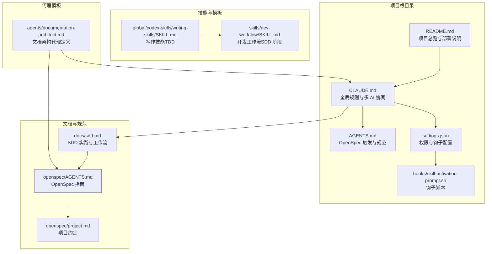
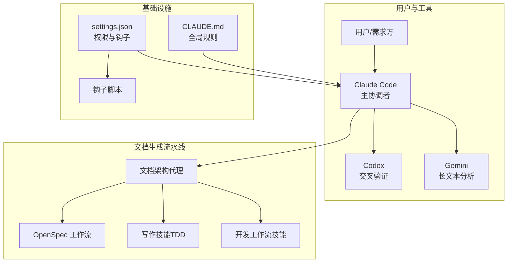
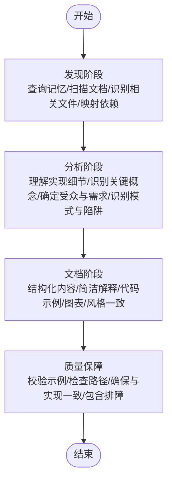
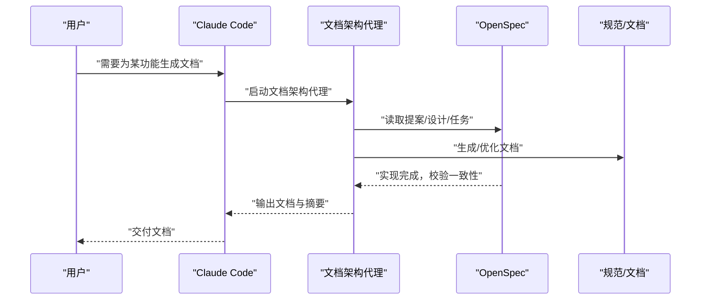
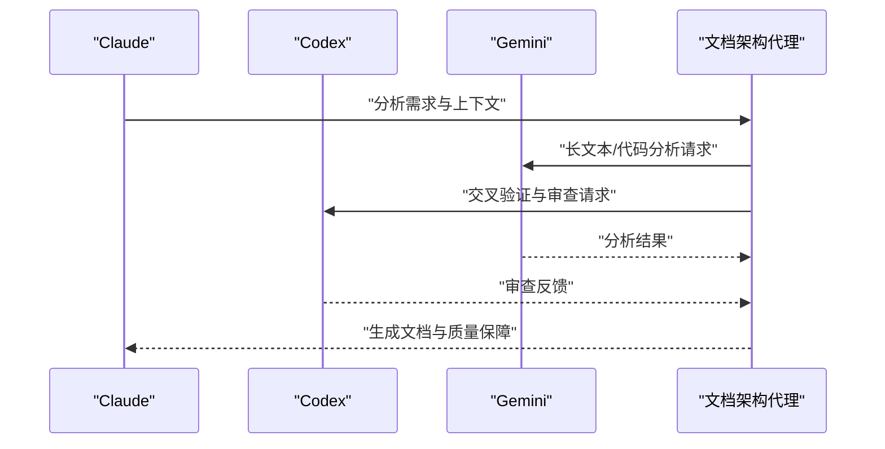
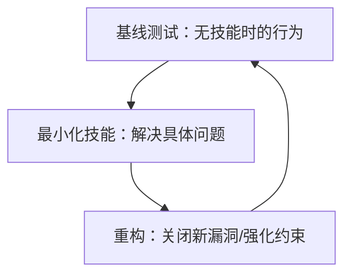
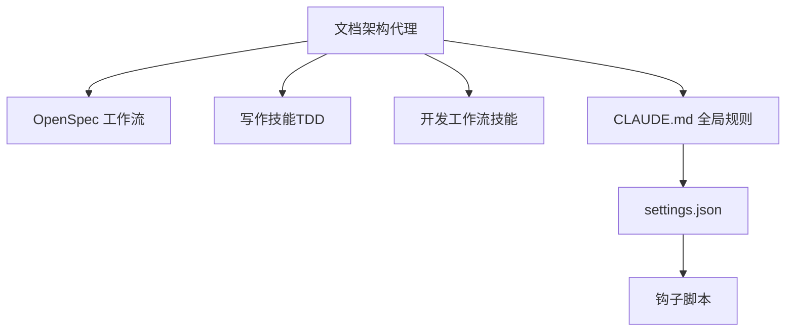

# 文档架构代理

<cite>
**本文引用的文件**
- [agents/documentation-architect.md](file://agents/documentation-architect.md)
- [README.md](file://README.md)
- [CLAUDE.md](file://CLAUDE.md)
- [AGENTS.md](file://AGENTS.md)
- [openspec/AGENTS.md](file://openspec/AGENTS.md)
- [openspec/project.md](file://openspec/project.md)
- [docs/sdd.md](file://docs/sdd.md)
- [settings.json](file://settings.json)
- [hooks/skill-activation-prompt.sh](file://hooks/skill-activation-prompt.sh)
- [global/codex-skills/writing-skills/SKILL.md](file://global/codex-skills/writing-skills/SKILL.md)
- [skills/dev-workflow/SKILL.md](file://skills/dev-workflow/SKILL.md)
</cite>

## 目录
1. [简介](#简介)
2. [项目结构](#项目结构)
3. [核心组件](#核心组件)
4. [架构总览](#架构总览)
5. [详细组件分析](#详细组件分析)
6. [依赖分析](#依赖分析)
7. [性能考量](#性能考量)
8. [故障排查指南](#故障排查指南)
9. [结论](#结论)
10. [附录](#附录)

## 简介
文档架构代理是面向复杂软件系统的“文档架构师”，负责综合生成、优化与校验各类技术文档，覆盖开发者指南、API 文档、数据流图、测试文档与架构概览等。其核心目标是通过系统化的上下文收集、结构化内容生成与质量保障流程，显著提升团队的文档质量与可维护性，缩短新成员上手时间。

## 项目结构
该项目采用“多 AI 协同 + 规范驱动开发（SDD）”的工程化结构，文档架构代理在该体系中承担“文档生成与优化”的关键角色，贯穿 OpenSpec 的提案、实现与归档阶段，并与全局规则、技能系统、钩子机制协同工作。

**图表来源**
- [README.md](file://README.md#L71-L92)
- [CLAUDE.md](file://CLAUDE.md#L1-L440)
- [AGENTS.md](file://AGENTS.md#L1-L18)
- [openspec/AGENTS.md](file://openspec/AGENTS.md#L123-L141)
- [openspec/project.md](file://openspec/project.md#L1-L65)
- [docs/sdd.md](file://docs/sdd.md#L1-L816)
- [settings.json](file://settings.json#L1-L37)
- [hooks/skill-activation-prompt.sh](file://hooks/skill-activation-prompt.sh#L1-L6)
- [global/codex-skills/writing-skills/SKILL.md](file://global/codex-skills/writing-skills/SKILL.md#L1-L655)
- [skills/dev-workflow/SKILL.md](file://skills/dev-workflow/SKILL.md#L1-L397)

**章节来源**
- [README.md](file://README.md#L71-L92)
- [CLAUDE.md](file://CLAUDE.md#L1-L440)
- [AGENTS.md](file://AGENTS.md#L1-L18)
- [openspec/AGENTS.md](file://openspec/AGENTS.md#L123-L141)
- [openspec/project.md](file://openspec/project.md#L1-L65)
- [docs/sdd.md](file://docs/sdd.md#L1-L816)
- [settings.json](file://settings.json#L1-L37)
- [hooks/skill-activation-prompt.sh](file://hooks/skill-activation-prompt.sh#L1-L6)
- [global/codex-skills/writing-skills/SKILL.md](file://global/codex-skills/writing-skills/SKILL.md#L1-L655)
- [skills/dev-workflow/SKILL.md](file://skills/dev-workflow/SKILL.md#L1-L397)

## 核心组件
- 文档架构代理定义文件：定义代理职责、方法论、输出规范与质量标准，指导上下文收集、结构化生成与质量保障。
- OpenSpec 工作流：提供“提案-实现-归档”的三阶段流程，确保文档与实现的一致性与可追溯性。
- 全局规则与多 AI 协同：通过 CLAUDE.md 明确 Claude 为主导，Codex/Gemini 为交叉验证与分析工具，保障文档生成的准确性与一致性。
- 写作技能（TDD）：以测试驱动的方式验证文档技能的有效性，确保文档模板与流程可复用、可维护。
- 开发工作流技能：定义严格的 SDD 阶段顺序与目录规范，为文档生成提供结构化框架。

**章节来源**
- [agents/documentation-architect.md](file://agents/documentation-architect.md#L1-L83)
- [openspec/AGENTS.md](file://openspec/AGENTS.md#L14-L48)
- [CLAUDE.md](file://CLAUDE.md#L102-L124)
- [global/codex-skills/writing-skills/SKILL.md](file://global/codex-skills/writing-skills/SKILL.md#L30-L45)
- [skills/dev-workflow/SKILL.md](file://skills/dev-workflow/SKILL.md#L28-L50)

## 架构总览
文档架构代理在项目中的位置与交互如下：

**图表来源**
- [CLAUDE.md](file://CLAUDE.md#L102-L124)
- [openspec/AGENTS.md](file://openspec/AGENTS.md#L14-L48)
- [global/codex-skills/writing-skills/SKILL.md](file://global/codex-skills/writing-skills/SKILL.md#L30-L45)
- [skills/dev-workflow/SKILL.md](file://skills/dev-workflow/SKILL.md#L28-L50)
- [settings.json](file://settings.json#L1-L37)
- [hooks/skill-activation-prompt.sh](file://hooks/skill-activation-prompt.sh#L1-L6)

## 详细组件分析

### 文档架构代理职责与方法论
- 上下文收集：从记忆系统、现有文档与相关文件中系统性收集信息，理解特性/系统背景与依赖关系。
- 文档创建：生成开发者指南、README、API 文档、数据流图、架构概览与测试文档。
- 位置策略：优先将文档放置在靠近代码的位置，遵循现有模式，必要时创建逻辑目录结构。
- 方法论：发现-分析-文档-质量保障四阶段，确保结构清晰、语言准确、示例可用、风格一致。

**图表来源**
- [agents/documentation-architect.md](file://agents/documentation-architect.md#L31-L57)

**章节来源**
- [agents/documentation-architect.md](file://agents/documentation-architect.md#L10-L83)

### OpenSpec 工作流与文档一致性
- 提案阶段：明确“为什么做、做什么、影响范围”，为文档生成提供权威依据。
- 实现阶段：对照 tasks.md 逐步实现，文档随实现同步更新，确保“实现-文档”一致。
- 归档阶段：将变更合并回规范，文档作为“源真相”的一部分被归档与更新。

**图表来源**
- [openspec/AGENTS.md](file://openspec/AGENTS.md#L14-L48)
- [openspec/AGENTS.md](file://openspec/AGENTS.md#L241-L284)
- [CLAUDE.md](file://CLAUDE.md#L220-L284)

**章节来源**
- [openspec/AGENTS.md](file://openspec/AGENTS.md#L14-L48)
- [openspec/AGENTS.md](file://openspec/AGENTS.md#L241-L284)
- [CLAUDE.md](file://CLAUDE.md#L220-L284)

### 多 AI 协同与工具使用
- Claude 为主导，负责独立分析、方案设计与最终决策。
- Codex 用于交叉验证与复杂实现的审查，确保文档与代码一致性。
- Gemini 用于大规模文本/代码分析，辅助生成与校验。

**图表来源**
- [CLAUDE.md](file://CLAUDE.md#L102-L124)
- [CLAUDE.md](file://CLAUDE.md#L150-L186)

**章节来源**
- [CLAUDE.md](file://CLAUDE.md#L102-L124)
- [CLAUDE.md](file://CLAUDE.md#L150-L186)

### 写作技能（TDD）与文档质量
- 以测试驱动的方式验证文档技能，确保模板与流程可复用、可维护。
- 通过压力场景与多次迭代，消除理性化与漏洞，形成“基线-绿色-重构”的闭环。

**图表来源**
- [global/codex-skills/writing-skills/SKILL.md](file://global/codex-skills/writing-skills/SKILL.md#L30-L45)
- [global/codex-skills/writing-skills/SKILL.md](file://global/codex-skills/writing-skills/SKILL.md#L532-L554)

**章节来源**
- [global/codex-skills/writing-skills/SKILL.md](file://global/codex-skills/writing-skills/SKILL.md#L30-L45)
- [global/codex-skills/writing-skills/SKILL.md](file://global/codex-skills/writing-skills/SKILL.md#L532-L554)

### 开发工作流技能与文档结构
- 严格的 SDD 阶段顺序（需求→设计→实现→审查→测试→完成），确保文档生成与实现同步。
- 目录规范与输出物清单，便于文档定位与质量核验。

**图表来源**
- [skills/dev-workflow/SKILL.md](file://skills/dev-workflow/SKILL.md#L28-L50)

**章节来源**
- [skills/dev-workflow/SKILL.md](file://skills/dev-workflow/SKILL.md#L28-L50)

## 依赖分析
- 与 OpenSpec 的耦合：文档架构代理依赖 OpenSpec 的提案、任务与规范，确保文档与实现一致。
- 与全局规则的耦合：CLAUDE.md 的工具使用规则与角色分工，决定文档生成过程中的工具调用时机与方式。
- 与技能系统的耦合：写作技能与开发工作流技能为文档生成提供可复用模板与流程约束。
- 与钩子机制的耦合：settings.json 与钩子脚本在用户提交与工具使用后触发相应动作，保障文档生成流程的自动化与可观测性。

**图表来源**
- [openspec/AGENTS.md](file://openspec/AGENTS.md#L14-L48)
- [global/codex-skills/writing-skills/SKILL.md](file://global/codex-skills/writing-skills/SKILL.md#L30-L45)
- [skills/dev-workflow/SKILL.md](file://skills/dev-workflow/SKILL.md#L28-L50)
- [CLAUDE.md](file://CLAUDE.md#L102-L124)
- [settings.json](file://settings.json#L1-L37)
- [hooks/skill-activation-prompt.sh](file://hooks/skill-activation-prompt.sh#L1-L6)

**章节来源**
- [openspec/AGENTS.md](file://openspec/AGENTS.md#L14-L48)
- [global/codex-skills/writing-skills/SKILL.md](file://global/codex-skills/writing-skills/SKILL.md#L30-L45)
- [skills/dev-workflow/SKILL.md](file://skills/dev-workflow/SKILL.md#L28-L50)
- [CLAUDE.md](file://CLAUDE.md#L102-L124)
- [settings.json](file://settings.json#L1-L37)
- [hooks/skill-activation-prompt.sh](file://hooks/skill-activation-prompt.sh#L1-L6)

## 性能考量
- 上下文收集的范围与深度：在保证全面性的同时，避免过度扫描导致的延迟与噪音。
- 工具调用的时机：遵循全局规则，仅在必要时调用 Codex/Gemini，减少不必要的往返开销。
- 文档生成的增量与并发：优先生成局部文档，结合 OpenSpec 的任务清单，按阶段推进，降低一次性生成的复杂度。
- 质量保障的自动化：通过写作技能与开发工作流技能的约束，减少人工返工，提高整体效率。

## 故障排查指南
- 文档与实现不一致
  - 现象：文档描述与代码实现不符。
  - 排查：对照 OpenSpec 的任务清单与规范，逐项核验；必要时调用 Codex 进行交叉验证。
  - 参考
    - [openspec/AGENTS.md](file://openspec/AGENTS.md#L241-L284)
    - [CLAUDE.md](file://CLAUDE.md#L197-L217)
- 文档缺失或结构混乱
  - 现象：缺少目录、层次不清、术语不一致。
  - 排查：遵循开发工作流技能的目录规范与模板；使用写作技能进行压力测试与重构。
  - 参考
    - [skills/dev-workflow/SKILL.md](file://skills/dev-workflow/SKILL.md#L53-L91)
    - [global/codex-skills/writing-skills/SKILL.md](file://global/codex-skills/writing-skills/SKILL.md#L30-L45)
- 工具调用失败或权限不足
  - 现象：无法调用 Codex/Gemini 或钩子执行异常。
  - 排查：检查 settings.json 的权限配置与钩子脚本路径；确认 MCP 工具已正确安装与连接。
  - 参考
    - [settings.json](file://settings.json#L1-L37)
    - [hooks/skill-activation-prompt.sh](file://hooks/skill-activation-prompt.sh#L1-L6)
    - [CLAUDE.md](file://CLAUDE.md#L359-L390)

**章节来源**
- [openspec/AGENTS.md](file://openspec/AGENTS.md#L241-L284)
- [CLAUDE.md](file://CLAUDE.md#L197-L217)
- [skills/dev-workflow/SKILL.md](file://skills/dev-workflow/SKILL.md#L53-L91)
- [global/codex-skills/writing-skills/SKILL.md](file://global/codex-skills/writing-skills/SKILL.md#L30-L45)
- [settings.json](file://settings.json#L1-L37)
- [hooks/skill-activation-prompt.sh](file://hooks/skill-activation-prompt.sh#L1-L6)
- [CLAUDE.md](file://CLAUDE.md#L359-L390)

## 结论
文档架构代理通过系统化的上下文收集、结构化生成与质量保障，将文档创建从“事后补写”转变为“规范驱动、边做边写、持续优化”。结合 OpenSpec 的提案-实现-归档流程与全局规则约束，能够有效提升文档质量、降低维护成本，并加速团队知识沉淀与传承。

## 附录

### 使用场景示例
- 新功能文档编写：基于 OpenSpec 提案与任务清单，生成开发者指南与 API 文档。
- API 文档生成：结合接口定义与示例，输出端点、参数、响应与错误码说明。
- 开发者指南创建：围绕模块职责、接口与依赖，提供可操作的入门与进阶材料。
- 架构概述撰写：以架构图与流程图呈现系统关键路径与数据流。

**章节来源**
- [openspec/AGENTS.md](file://openspec/AGENTS.md#L14-L48)
- [agents/documentation-architect.md](file://agents/documentation-architect.md#L18-L24)

### 输出格式与文档模板
- 文档结构：标题、目录、概述、核心概念、实现细节、示例、排障与参考。
- 内容组织：按“从宏观到微观”的层级组织，确保可读性与可检索性。
- 格式规范：使用清晰技术语言、代码块语法高亮、跨文档引用与版本信息。

**章节来源**
- [agents/documentation-architect.md](file://agents/documentation-architect.md#L58-L67)

### 文档质量评估标准与改进建议
- 一致性：文档与规范、实现保持一致。
- 完整性：覆盖需求、场景、接口、流程与边界。
- 准确性：示例可运行、路径存在、术语统一。
- 可读性：结构清晰、语言简洁、图表辅助。
- 可维护性：遵循模板与目录规范，便于增量更新与归档。

**章节来源**
- [agents/documentation-architect.md](file://agents/documentation-architect.md#L52-L57)
- [skills/dev-workflow/SKILL.md](file://skills/dev-workflow/SKILL.md#L306-L331)
- [global/codex-skills/writing-skills/SKILL.md](file://global/codex-skills/writing-skills/SKILL.md#L373-L392)