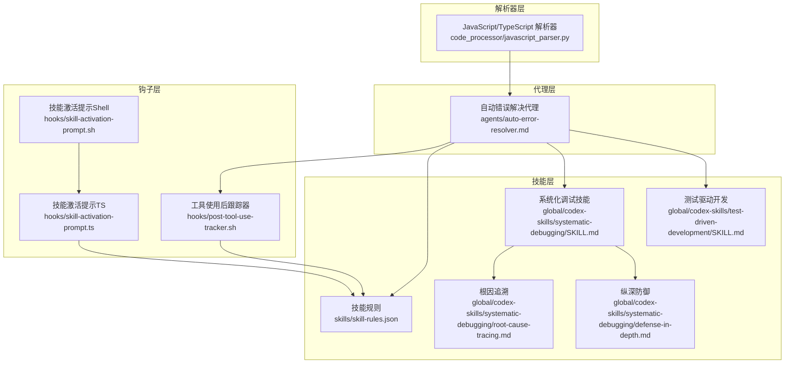
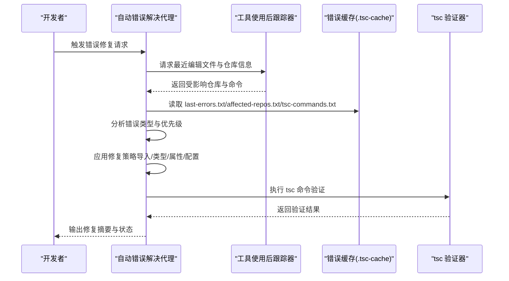
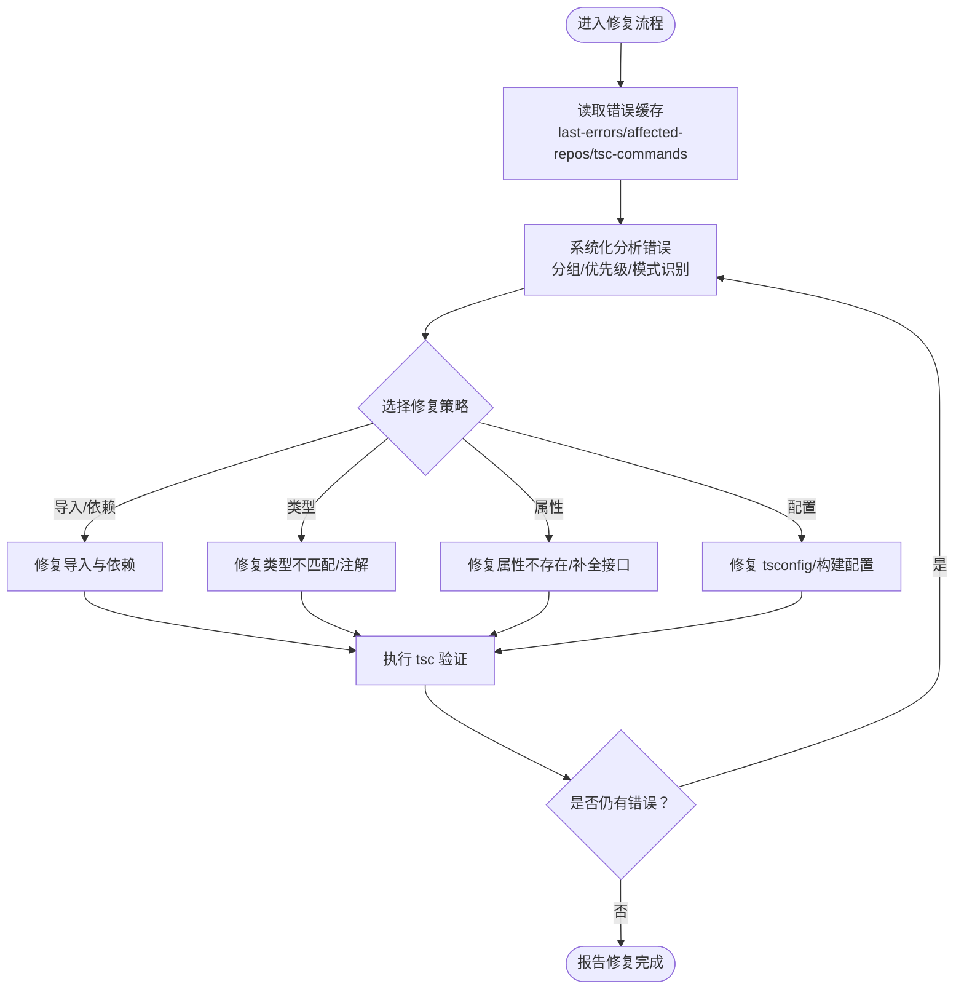
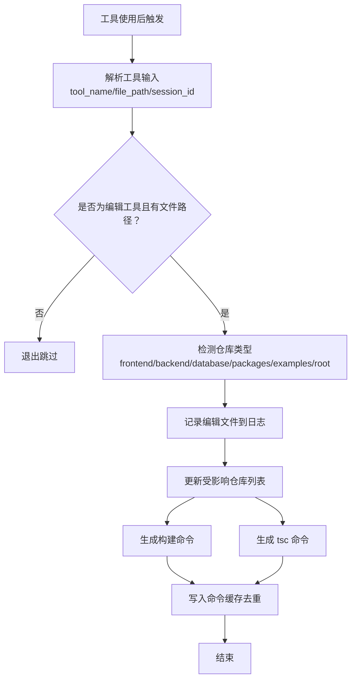
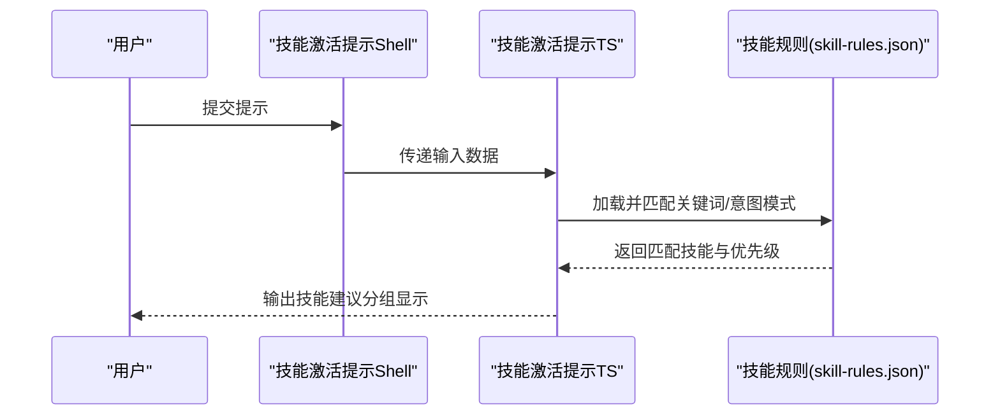
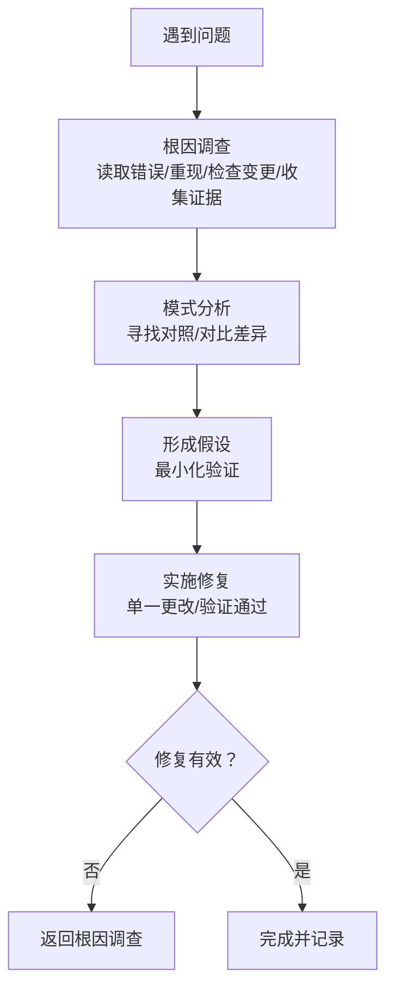
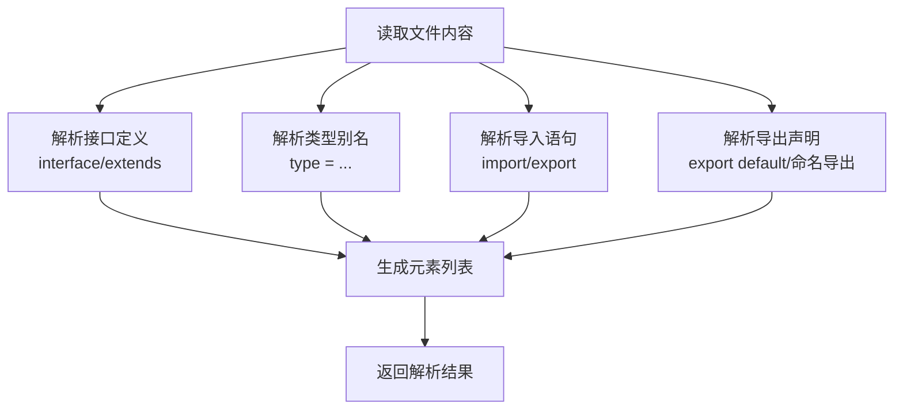
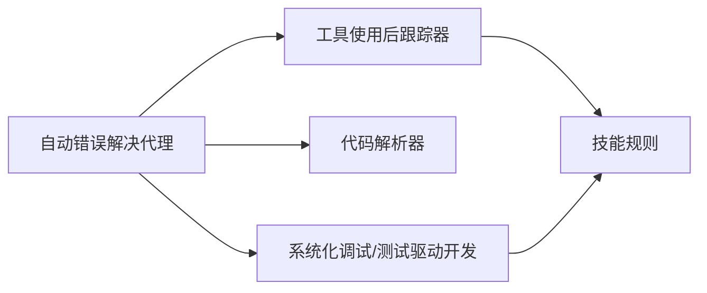

# 自动错误解决代理

<cite>
**本文引用的文件**
- [agents/auto-error-resolver.md](file://agents/auto-error-resolver.md)
- [hooks/post-tool-use-tracker.sh](file://hooks/post-tool-use-tracker.sh)
- [hooks/skill-activation-prompt.ts](file://hooks/skill-activation-prompt.ts)
- [hooks/skill-activation-prompt.sh](file://hooks/skill-activation-prompt.sh)
- [skills/skill-rules.json](file://skills/skill-rules.json)
- [global/codex-skills/systematic-debugging/SKILL.md](file://global/codex-skills/systematic-debugging/SKILL.md)
- [global/codex-skills/systematic-debugging/root-cause-tracing.md](file://global/codex-skills/systematic-debugging/root-cause-tracing.md)
- [global/codex-skills/systematic-debugging/defense-in-depth.md](file://global/codex-skills/systematic-debugging/defense-in-depth.md)
- [global/codex-skills/test-driven-development/SKILL.md](file://global/codex-skills/test-driven-development/SKILL.md)
- [code_processor/javascript_parser.py](file://code_processor/javascript_parser.py)
- [README.md](file://README.md)
</cite>

## 目录
1. [简介](#简介)
2. [项目结构](#项目结构)
3. [核心组件](#核心组件)
4. [架构总览](#架构总览)
5. [详细组件分析](#详细组件分析)
6. [依赖关系分析](#依赖关系分析)
7. [性能考量](#性能考量)
8. [故障排查指南](#故障排查指南)
9. [结论](#结论)
10. [附录](#附录)

## 简介
本文件为“自动错误解决代理”的权威技术文档，聚焦于 TypeScript 编译错误的自动化修复、系统性错误的批量处理以及构建失败的快速恢复。该代理通过与项目中的钩子、技能系统协同工作，形成从“错误采集—分析—修复—验证”的闭环流程，覆盖缺失导入、类型不匹配、属性不存在、配置错误等常见问题，并提供优先级策略与最佳实践建议。

## 项目结构
该项目采用“多 AI 协同 + 规范驱动开发（SDD）”的组织方式，核心围绕以下模块：
- 代理层：专门的自动错误解决代理，负责错误识别、修复策略选择与验证
- 钩子层：在工具使用后自动记录编辑文件、推断仓库、生成构建/编译命令
- 技能层：基于规则的技能触发系统，辅助调试与系统化方法论
- 解析器层：对 JavaScript/TypeScript 代码进行元素解析，辅助类型与接口识别

图表来源
- [agents/auto-error-resolver.md](file://agents/auto-error-resolver.md#L1-L97)
- [hooks/post-tool-use-tracker.sh](file://hooks/post-tool-use-tracker.sh#L1-L178)
- [hooks/skill-activation-prompt.ts](file://hooks/skill-activation-prompt.ts#L1-L133)
- [hooks/skill-activation-prompt.sh](file://hooks/skill-activation-prompt.sh#L1-L6)
- [skills/skill-rules.json](file://skills/skill-rules.json#L1-L250)
- [global/codex-skills/systematic-debugging/SKILL.md](file://global/codex-skills/systematic-debugging/SKILL.md#L1-L297)
- [global/codex-skills/systematic-debugging/root-cause-tracing.md](file://global/codex-skills/systematic-debugging/root-cause-tracing.md#L1-L170)
- [global/codex-skills/systematic-debugging/defense-in-depth.md](file://global/codex-skills/systematic-debugging/defense-in-depth.md#L52-L112)
- [global/codex-skills/test-driven-development/SKILL.md](file://global/codex-skills/test-driven-development/SKILL.md#L150-L369)
- [code_processor/javascript_parser.py](file://code_processor/javascript_parser.py#L168-L506)

章节来源
- [README.md](file://README.md#L71-L92)

## 核心组件
- 自动错误解决代理：负责读取错误缓存、分析错误类型、按优先级修复、使用正确的 tsc 命令验证修复结果
- 工具使用后跟踪器：在 Edit/MultiEdit/Write 成功后，自动识别受影响仓库、生成构建/编译命令并写入缓存
- 技能激活提示：根据关键词与意图模式，向用户提示合适的技能（如系统化调试、测试驱动开发）
- 系统化调试技能：提供四阶段调试框架，强调“先溯源再修复”
- 解析器：对 TypeScript/JavaScript 文件进行接口、类型别名、导入导出等元素解析，辅助类型修复

章节来源
- [agents/auto-error-resolver.md](file://agents/auto-error-resolver.md#L1-L97)
- [hooks/post-tool-use-tracker.sh](file://hooks/post-tool-use-tracker.sh#L1-L178)
- [hooks/skill-activation-prompt.ts](file://hooks/skill-activation-prompt.ts#L1-L133)
- [hooks/skill-activation-prompt.sh](file://hooks/skill-activation-prompt.sh#L1-L6)
- [skills/skill-rules.json](file://skills/skill-rules.json#L1-L250)
- [global/codex-skills/systematic-debugging/SKILL.md](file://global/codex-skills/systematic-debugging/SKILL.md#L1-L297)
- [code_processor/javascript_parser.py](file://code_processor/javascript_parser.py#L168-L506)

## 架构总览
自动错误解决代理的工作流由“错误采集—分析—修复—验证”四个阶段构成，贯穿钩子与技能系统的协同：

图表来源
- [agents/auto-error-resolver.md](file://agents/auto-error-resolver.md#L9-L36)
- [hooks/post-tool-use-tracker.sh](file://hooks/post-tool-use-tracker.sh#L122-L178)

## 详细组件分析

### 组件一：自动错误解决代理
职责与流程
- 读取错误缓存：从 tsc-cache 中读取最近错误、受影响仓库与 tsc 命令
- 分析错误：按类型分组（缺失导入、类型不匹配、属性不存在等），识别可能引发级联的根因
- 修复策略：优先修复导入与依赖，其次处理类型与属性，最后处理剩余问题；对同类问题使用批量编辑
- 验证修复：每次修改后执行正确的 tsc 命令，直至全部修复

错误分类与修复优先级
- 语法错误：优先修复，避免阻塞后续类型检查
- 类型不匹配：修复函数签名、接口实现或添加类型注解
- 属性不存在：检查拼写、对象结构，必要时补充接口属性
- 导入问题：校验路径、模块存在性，必要时安装缺失依赖
- 配置错误：依据仓库类型选择正确命令（前端 tsconfig.app.json、后端默认 tsc、项目引用 build）

图表来源
- [agents/auto-error-resolver.md](file://agents/auto-error-resolver.md#L9-L36)
- [agents/auto-error-resolver.md](file://agents/auto-error-resolver.md#L38-L61)

章节来源
- [agents/auto-error-resolver.md](file://agents/auto-error-resolver.md#L1-L97)

### 组件二：工具使用后跟踪器
职责与机制
- 在 Edit/MultiEdit/Write 成功后运行，提取工具输入中的文件路径与会话 ID
- 自动识别仓库类型（前端、后端、数据库、包管理等），并将受影响仓库写入缓存
- 生成构建命令与 tsc 命令，去重后写入缓存，供代理读取
- 对未知仓库与 Markdown 文件进行跳过，避免无效处理

图表来源
- [hooks/post-tool-use-tracker.sh](file://hooks/post-tool-use-tracker.sh#L1-L178)

章节来源
- [hooks/post-tool-use-tracker.sh](file://hooks/post-tool-use-tracker.sh#L1-L178)

### 组件三：技能激活提示与规则系统
职责与机制
- 基于 skill-rules.json 的关键词与意图模式，在用户提交提示前给出技能建议
- 将匹配到的技能按优先级（critical/high/medium/low）分组输出，提醒用户在响应前使用相关技能
- 与系统化调试、测试驱动开发等技能联动，提升修复质量与稳定性

图表来源
- [hooks/skill-activation-prompt.sh](file://hooks/skill-activation-prompt.sh#L1-L6)
- [hooks/skill-activation-prompt.ts](file://hooks/skill-activation-prompt.ts#L1-L133)
- [skills/skill-rules.json](file://skills/skill-rules.json#L1-L250)

章节来源
- [hooks/skill-activation-prompt.sh](file://hooks/skill-activation-prompt.sh#L1-L6)
- [hooks/skill-activation-prompt.ts](file://hooks/skill-activation-prompt.ts#L1-L133)
- [skills/skill-rules.json](file://skills/skill-rules.json#L1-L250)

### 组件四：系统化调试与测试驱动开发
职责与机制
- 系统化调试：四阶段流程（根因调查→模式分析→假设→实施），强调“先溯源再修复”，防止症状式修复
- 根因追溯：当错误出现在深层调用栈时，回溯调用链找到原始触发点
- 纵深防御：在多层增加校验与日志，确保问题无法再次发生
- 测试驱动开发：以失败测试驱动实现，最小化修复并保持其他测试通过

图表来源
- [global/codex-skills/systematic-debugging/SKILL.md](file://global/codex-skills/systematic-debugging/SKILL.md#L46-L212)
- [global/codex-skills/systematic-debugging/root-cause-tracing.md](file://global/codex-skills/systematic-debugging/root-cause-tracing.md#L1-L170)
- [global/codex-skills/systematic-debugging/defense-in-depth.md](file://global/codex-skills/systematic-debugging/defense-in-depth.md#L52-L112)
- [global/codex-skills/test-driven-development/SKILL.md](file://global/codex-skills/test-driven-development/SKILL.md#L150-L369)

章节来源
- [global/codex-skills/systematic-debugging/SKILL.md](file://global/codex-skills/systematic-debugging/SKILL.md#L1-L297)
- [global/codex-skills/systematic-debugging/root-cause-tracing.md](file://global/codex-skills/systematic-debugging/root-cause-tracing.md#L1-L170)
- [global/codex-skills/systematic-debugging/defense-in-depth.md](file://global/codex-skills/systematic-debugging/defense-in-depth.md#L52-L112)
- [global/codex-skills/test-driven-development/SKILL.md](file://global/codex-skills/test-driven-development/SKILL.md#L150-L369)

### 组件五：代码解析器（TypeScript/JavaScript）
职责与机制
- 解析 TypeScript 接口、类型别名、导入导出等元素，辅助代理识别类型定义缺失与接口补全需求
- 通过正则与 AST 风格的扫描，定位接口继承关系与导出项，为修复提供结构化依据

图表来源
- [code_processor/javascript_parser.py](file://code_processor/javascript_parser.py#L168-L506)

章节来源
- [code_processor/javascript_parser.py](file://code_processor/javascript_parser.py#L168-L506)

## 依赖关系分析
- 代理依赖钩子提供的错误缓存与命令信息，确保修复过程可验证、可重复
- 代理依赖技能系统提供的调试与测试方法论，保证修复质量与长期稳定性
- 解析器为代理提供类型结构信息，辅助接口与类型的精准修复

图表来源
- [agents/auto-error-resolver.md](file://agents/auto-error-resolver.md#L1-L97)
- [hooks/post-tool-use-tracker.sh](file://hooks/post-tool-use-tracker.sh#L1-L178)
- [skills/skill-rules.json](file://skills/skill-rules.json#L1-L250)
- [code_processor/javascript_parser.py](file://code_processor/javascript_parser.py#L168-L506)

章节来源
- [agents/auto-error-resolver.md](file://agents/auto-error-resolver.md#L1-L97)
- [hooks/post-tool-use-tracker.sh](file://hooks/post-tool-use-tracker.sh#L1-L178)
- [skills/skill-rules.json](file://skills/skill-rules.json#L1-L250)
- [code_processor/javascript_parser.py](file://code_processor/javascript_parser.py#L168-L506)

## 性能考量
- 修复优先级与批量编辑：优先处理导入与依赖类错误，减少类型检查开销；对同类问题使用批量编辑降低重复 IO
- 命令缓存与去重：通过钩子生成并去重构建/编译命令，避免重复执行
- 解析范围控制：解析器仅关注接口、类型别名、导入导出等关键元素，减少不必要的扫描成本
- 日志与缓存清理：定期清理 tsc-cache 与编辑日志，避免磁盘膨胀影响性能

## 故障排查指南
常见问题与对策
- 修复后仍有错误：确认是否使用了正确的 tsc 命令；检查是否遗漏了根因（如缺失类型定义）
- 修复未生效：检查是否被系统化调试流程打断；确认修复是否最小化且只针对当前错误
- 仓库识别错误：检查钩子对仓库类型的判断逻辑，必要时调整路径模式
- 技能未触发：核对 skill-rules.json 中的关键词与意图模式，确保与实际场景匹配

章节来源
- [agents/auto-error-resolver.md](file://agents/auto-error-resolver.md#L55-L61)
- [hooks/post-tool-use-tracker.sh](file://hooks/post-tool-use-tracker.sh#L32-L85)
- [hooks/skill-activation-prompt.ts](file://hooks/skill-activation-prompt.ts#L50-L78)
- [skills/skill-rules.json](file://skills/skill-rules.json#L1-L250)

## 结论
自动错误解决代理通过与钩子、技能系统与解析器的协同，实现了 TypeScript 编译错误的自动化修复、系统性错误的批量处理与构建失败的快速恢复。其以“先溯源再修复”的系统化调试方法论为基础，结合测试驱动开发的验证闭环，确保修复既快又稳，适合在多仓库、多语言的复杂项目中推广使用。

## 附录

### 使用场景示例
- 重构后的类型错误修复：通过解析器识别接口缺失，代理自动补全接口属性并验证
- 系统性编译错误处理：按优先级批量修复导入与依赖问题，随后处理类型不匹配
- 构建失败快速诊断：利用钩子生成的 tsc 命令与受影响仓库列表，快速定位并修复配置错误

### 最佳实践与错误预防策略
- 优先修复根因而非添加忽略注释
- 保持修复最小化，避免无关重构
- 使用系统化调试方法论，先溯源再修复
- 引入测试驱动开发，以失败测试驱动实现，确保修复可验证
- 在多层增加防御性校验与日志，防止问题再次发生

章节来源
- [agents/auto-error-resolver.md](file://agents/auto-error-resolver.md#L55-L61)
- [global/codex-skills/systematic-debugging/SKILL.md](file://global/codex-skills/systematic-debugging/SKILL.md#L1-L297)
- [global/codex-skills/test-driven-development/SKILL.md](file://global/codex-skills/test-driven-development/SKILL.md#L150-L369)
- [global/codex-skills/systematic-debugging/defense-in-depth.md](file://global/codex-skills/systematic-debugging/defense-in-depth.md#L52-L112)