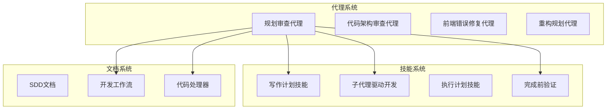
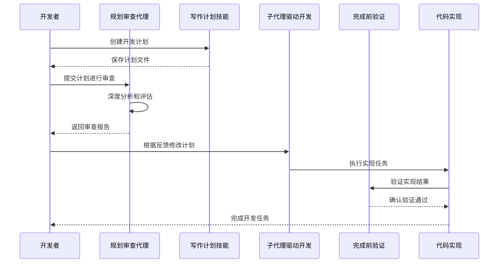
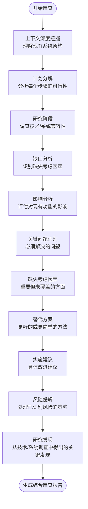
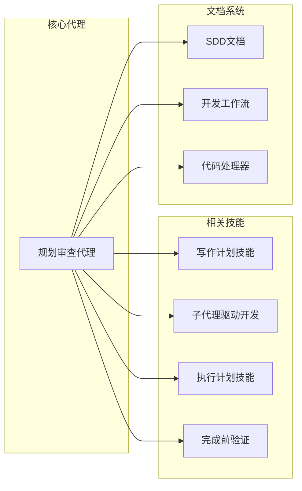

# 规划审查代理

<cite>
**本文档引用的文件**
- [plan-reviewer.md](file://agents/plan-reviewer.md)
- [README.md](file://agents/README.md)
- [SKILL.md](file://global/codex-skills/writing-plans/SKILL.md)
- [SKILL.md](file://global/codex-skills/subagent-driven-development/SKILL.md)
- [SKILL.md](file://global/codex-skills/verification-before-completion/SKILL.md)
- [SKILL.md](file://global/codex-skills/executing-plans/SKILL.md)
- [sdd.md](file://docs/sdd.md)
- [base_parser.py](file://code_processor/base_parser.py)
- [SKILL.md](file://skills/dev-workflow/SKILL.md)
</cite>

## 目录
1. [简介](#简介)
2. [项目结构](#项目结构)
3. [核心组件](#核心组件)
4. [架构概览](#架构概览)
5. [详细组件分析](#详细组件分析)
6. [依赖分析](#依赖分析)
7. [性能考虑](#性能考虑)
8. [故障排除指南](#故障排除指南)
9. [结论](#结论)
10. [附录](#附录)

## 简介

规划审查代理是一个专门设计的AI代理，用于在开发实施前对技术方案进行全面审查。该代理的核心价值在于通过系统化的审查流程，帮助开发团队在项目早期识别潜在问题、遗漏考虑因素和更好的替代方案，从而避免昂贵的实施错误。

该代理特别适用于复杂功能开发前的方案审查、架构决策验证、潜在问题预防和开发资源规划等场景。通过深度分析系统架构、数据库影响、依赖关系、替代方案和风险评估，规划审查代理能够提供全面的技术洞察和改进建议。

## 项目结构

该代理位于项目的agents目录中，采用独立的Markdown文件格式，便于直接复制使用。项目整体结构体现了多AI协作和规范驱动开发的理念：

**图表来源**
- [plan-reviewer.md](file://agents/plan-reviewer.md#L1-L53)
- [README.md](file://agents/README.md#L73-L82)

**章节来源**
- [plan-reviewer.md](file://agents/plan-reviewer.md#L1-L53)
- [README.md](file://agents/README.md#L1-L301)

## 核心组件

### 规划审查代理核心职责

规划审查代理的核心职责围绕五个关键方面展开：

1. **深度系统分析** - 研究和理解计划中提到的所有系统、技术和组件，验证兼容性、限制性和集成需求
2. **数据库影响评估** - 分析计划对数据库架构、性能、迁移和数据完整性的影响
3. **依赖关系映射** - 识别计划依赖的所有显式和隐式依赖，检查版本冲突、废弃功能或不受支持的组合
4. **替代方案评估** - 考虑是否有更好的方法、更简单的解决方案或更具可维护性的替代方案
5. **风险评估** - 识别潜在故障点、边缘情况和计划可能崩溃的情况

### 审查流程

代理采用系统化的审查流程，包括七个关键步骤：

1. **上下文深度挖掘** - 全面理解现有系统架构、当前实现和约束条件
2. **计划分解** - 将计划分解为单个组件，分析每个步骤的可行性和完整性
3. **研究阶段** - 调查计划中提到的任何技术、API或系统，验证当前文档、已知问题和兼容性要求
4. **缺口分析** - 识别计划中缺失的内容 - 错误处理、回滚策略、测试方法、监控等
5. **影响分析** - 考虑更改对现有功能、性能、安全性和用户体验的影响

**章节来源**
- [plan-reviewer.md](file://agents/plan-reviewer.md#L10-L23)

## 架构概览

规划审查代理在整个开发工作流中扮演着关键的审查和验证角色：

**图表来源**
- [plan-reviewer.md](file://agents/plan-reviewer.md#L17-L23)
- [SKILL.md](file://global/codex-skills/writing-plans/SKILL.md#L14-L18)
- [SKILL.md](file://global/codex-skills/subagent-driven-development/SKILL.md#L8-L11)

### 关键审查领域

代理重点关注八个关键领域：

1. **身份认证/授权** - 验证与现有认证系统的兼容性、令牌处理、会话管理
2. **数据库操作** - 检查适当的迁移、索引策略、事务处理和数据验证
3. **API集成** - 验证端点可用性、速率限制、认证要求和错误处理
4. **类型安全** - 确保为新数据结构和API响应定义了适当的TypeScript类型
5. **错误处理** - 验证全面的错误场景得到解决
6. **性能** - 考虑可扩展性、缓存策略和潜在瓶颈
7. **安全性** - 识别潜在漏洞或安全差距
8. **测试策略** - 确保计划包括充分的测试方法
9. **回滚计划** - 验证有安全的方式在出现问题时撤销更改

**章节来源**
- [plan-reviewer.md](file://agents/plan-reviewer.md#L24-L34)

## 详细组件分析

### 规划审查代理工作流程

**图表来源**
- [plan-reviewer.md](file://agents/plan-reviewer.md#L17-L42)

### 输出要求结构

规划审查代理的输出遵循严格的结构化格式：

1. **执行摘要** - 计划可行性和主要问题的简要概述
2. **关键问题** - 实施前必须解决的致命问题
3. **缺失考虑因素** - 原始计划中未涵盖的重要方面
4. **替代方法** - 如果存在更好的或更简单的方法
5. **实施建议** - 具体改进以使计划更加稳健
6. **风险缓解** - 处理已识别风险的策略
7. **研究发现** - 从所调查的技术/系统中得出的关键发现

### 质量标准

代理遵循严格的质量标准：

- 仅标记真正的严重问题 - 不要创造不存在的问题
- 提供具体、可操作的反馈，带有具体示例
- 当可能时引用实际文档、已知限制或兼容性问题
- 建议实用的替代方案，而不是理论上的理想方案
- 专注于防止现实世界的实施失败
- 考虑项目的特定上下文和约束条件

**章节来源**
- [plan-reviewer.md](file://agents/plan-reviewer.md#L35-L51)

### 使用场景示例

规划审查代理适用于多种关键场景：

#### 场景1：复杂功能开发前的方案审查
- **场景描述**：用户创建了新的认证系统集成计划（如将Auth0与现有Keycloak设置集成）
- **代理作用**：彻底分析认证集成计划，识别潜在问题或遗漏的考虑因素
- **预期输出**：详细的审查报告，包括关键问题、缺失考虑因素和替代方案

#### 场景2：数据库迁移策略验证
- **场景描述**：用户制定了将用户数据迁移到新架构的计划
- **代理作用**：检查迁移计划中的潜在数据库问题、回滚策略和其他考虑因素
- **预期输出**：针对数据库操作的具体建议和风险缓解策略

#### 场景3：架构决策验证
- **场景描述**：团队需要验证重大架构变更的可行性
- **代理作用**：评估架构决策的技术可行性、实施难度和风险等级
- **预期输出**：架构方案验证报告和改进建议

**章节来源**
- [plan-reviewer.md](file://agents/plan-reviewer.md#L1-L6)

## 依赖分析

### 技术依赖关系

规划审查代理与多个系统组件紧密集成：

**图表来源**
- [plan-reviewer.md](file://agents/plan-reviewer.md#L1-L53)
- [SKILL.md](file://global/codex-skills/writing-plans/SKILL.md#L1-L117)

### 工作流集成点

代理在多个工作流节点发挥作用：

1. **计划创建阶段** - 与写作计划技能集成，确保计划的完整性和可执行性
2. **开发执行阶段** - 与子代理驱动开发技能协作，提供持续的审查和验证
3. **质量保证阶段** - 与完成前验证技能配合，确保实施结果符合预期
4. **文档管理阶段** - 与开发工作流技能整合，维护审查历史和最佳实践

**章节来源**
- [SKILL.md](file://global/codex-skills/subagent-driven-development/SKILL.md#L229-L241)
- [SKILL.md](file://global/codex-skills/verification-before-completion/SKILL.md#L1-L140)

## 性能考虑

### 审查效率优化

规划审查代理在设计时考虑了性能和效率因素：

1. **并行处理能力** - 代理可以同时分析多个技术组件和依赖关系
2. **智能优先级排序** - 重点关注最关键的风险和问题
3. **渐进式审查** - 从高层次架构分析开始，逐步深入到具体实现细节
4. **缓存机制** - 利用项目知识库和最佳实践文档减少重复分析

### 资源利用策略

- **内存优化** - 采用增量分析方法，避免一次性加载大量数据
- **计算效率** - 使用启发式算法快速识别高风险区域
- **网络优化** - 减少对外部API的依赖，提高响应速度

## 故障排除指南

### 常见问题诊断

#### 问题1：审查结果过于乐观
**症状**：代理报告计划完美无缺
**可能原因**：
- 计划过于简化，缺乏详细的技术细节
- 开发者期望过高，忽视了潜在风险
- 代理配置过于宽松

**解决方案**：
- 要求开发者提供更详细的技术规格说明
- 调整代理的审查严格度设置
- 引入同行审查机制

#### 问题2：审查时间过长
**症状**：代理分析耗时过长
**可能原因**：
- 计划过于复杂，包含大量技术组件
- 代理需要访问大量外部资源进行验证
- 系统资源不足

**解决方案**：
- 将大型计划分解为多个较小的审查批次
- 优化代理的资源配置
- 实施增量审查策略

#### 问题3：遗漏关键风险
**症状**：实施后出现意外问题
**可能原因**：
- 代理的知识库不完整
- 开发者提供了不准确的背景信息
- 新出现的技术风险未被识别

**解决方案**：
- 定期更新代理的知识库和最佳实践
- 建立持续学习机制
- 引入专家审查环节

**章节来源**
- [plan-reviewer.md](file://agents/plan-reviewer.md#L44-L50)

## 结论

规划审查代理代表了现代软件开发中质量保证和风险管理的重要进步。通过系统化的审查流程、全面的技术分析和严格的输出标准，该代理能够有效预防开发过程中的常见陷阱和昂贵错误。

该代理的核心价值体现在：

1. **早期问题识别** - 在开发实施前发现潜在问题，避免后期修复的成本
2. **全面风险评估** - 覆盖技术、架构、安全、性能等各个方面的风险
3. **实用的改进建议** - 提供具体、可操作的解决方案和最佳实践
4. **标准化的审查流程** - 确保审查质量和一致性的标准方法

通过与项目中的其他技能和工具的有效集成，规划审查代理构成了一个完整的质量保证生态系统，为团队提供了可靠的开发支持和风险控制机制。

## 附录

### 评估标准和审查报告格式

#### 技术可行性评估标准
- **架构一致性**：方案与现有系统架构的匹配程度
- **技术成熟度**：所选技术的稳定性和适用性
- **集成复杂度**：与其他系统的集成难度和风险
- **可扩展性**：方案对未来增长的支持能力

#### 实施难度评估标准
- **技术难度**：实现所需的技术水平和复杂度
- **资源需求**：开发、测试、部署所需的资源投入
- **时间估算**：完成实施的时间预测和里程碑
- **人员要求**：所需技能和经验水平

#### 风险等级分类
- **高风险**：可能导致重大损失或系统故障的问题
- **中风险**：可能影响项目进度或质量的问题
- **低风险**：轻微影响或可轻松解决的问题

#### 改进建议框架
1. **具体性** - 建议必须具体明确，避免模糊表述
2. **可操作性** - 提供可执行的解决方案和步骤
3. **优先级** - 按重要性和紧急程度排序
4. **验证方法** - 说明如何验证建议的有效性

### 最佳实践和经验总结

#### 规划制定最佳实践
1. **详细的需求分析** - 确保对业务需求和技术要求有全面理解
2. **风险预评估** - 在制定计划时主动识别潜在风险
3. **替代方案比较** - 考虑多种可能的实现方法
4. **资源规划** - 准确估算所需的人力、时间和资金投入

#### 审查流程优化
1. **分阶段审查** - 将大型计划分解为多个审查阶段
2. **专家参与** - 邀请相关领域的专家参与关键决策
3. **持续改进** - 基于历史经验和反馈不断优化审查流程
4. **文档化管理** - 保持完整的审查历史和决策记录

#### 团队协作建议
1. **透明沟通** - 确保所有相关方都能及时了解审查结果
2. **责任明确** - 明确每个阶段的责任人和决策权限
3. **反馈机制** - 建立有效的反馈和纠正机制
4. **知识传承** - 将审查经验和最佳实践纳入团队知识库

**章节来源**
- [sdd.md](file://docs/sdd.md#L19-L34)
- [base_parser.py](file://code_processor/base_parser.py#L1-L358)