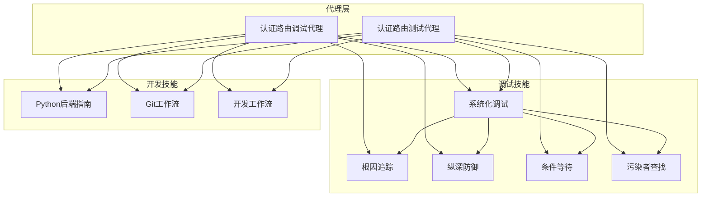
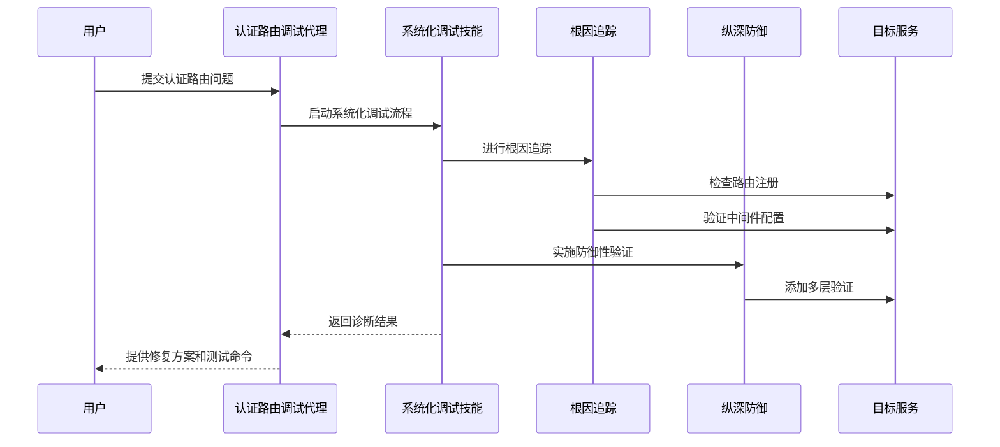
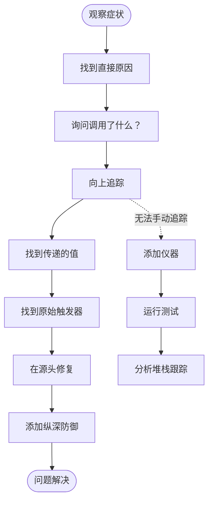
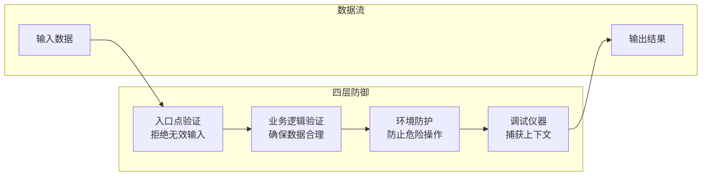
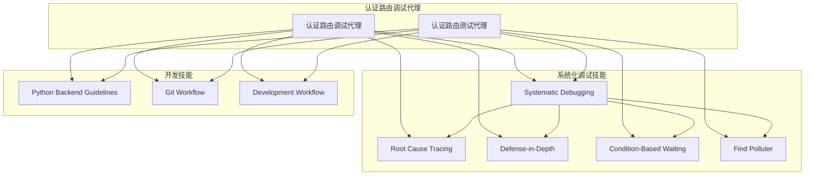

# 认证路由调试代理

<cite>
**本文档引用的文件**
- [agents/auth-route-debugger.md](file://agents/auth-route-debugger.md)
- [agents/auth-route-tester.md](file://agents/auth-route-tester.md)
- [global/codex-skills/systematic-debugging/SKILL.md](file://global/codex-skills/systematic-debugging/SKILL.md)
- [global/codex-skills/systematic-debugging/root-cause-tracing.md](file://global/codex-skills/systematic-debugging/root-cause-tracing.md)
- [global/codex-skills/systematic-debugging/defense-in-depth.md](file://global/codex-skills/systematic-debugging/defense-in-depth.md)
- [global/codex-skills/systematic-debugging/condition-based-waiting.md](file://global/codex-skills/systematic-debugging/condition-based-waiting.md)
- [global/codex-skills/systematic-debugging/find-polluter.sh](file://global/codex-skills/systematic-debugging/find-polluter.sh)
- [skills/python-backend-guidelines/SKILL.md](file://skills/python-backend-guidelines/SKILL.md)
- [skills/git-workflow/SKILL.md](file://skills/git-workflow/SKILL.md)
- [skills/dev-workflow/SKILL.md](file://skills/dev-workflow/SKILL.md)
</cite>

## 目录
1. [简介](#简介)
2. [项目结构](#项目结构)
3. [核心组件](#核心组件)
4. [架构概览](#架构概览)
5. [详细组件分析](#详细组件分析)
6. [依赖关系分析](#依赖关系分析)
7. [性能考虑](#性能考虑)
8. [故障排除指南](#故障排除指南)
9. [结论](#结论)
10. [附录](#附录)

## 简介

认证路由调试代理是ontologyDevOS项目中专门用于诊断和解决API路由认证问题的智能代理。该代理专注于处理JWT Cookie认证系统中的各种问题，包括401/403认证失败、Cookie配置问题、路由注册冲突以及权限验证错误。

该代理基于系统化调试方法论，结合了多种调试技术和最佳实践，能够快速定位和解决复杂的认证路由问题。它特别适用于Keycloak/OpenID Connect集成的Express.js应用，提供了从问题诊断到解决方案验证的完整工作流程。

## 项目结构

项目采用模块化的组织方式，认证路由调试代理位于agents目录下，配合多个调试技能和工具：



**图表来源**
- [agents/auth-route-debugger.md](file://agents/auth-route-debugger.md#L1-L118)
- [agents/auth-route-tester.md](file://agents/auth-route-tester.md#L1-L94)
- [global/codex-skills/systematic-debugging/SKILL.md](file://global/codex-skills/systematic-debugging/SKILL.md#L1-L297)

**章节来源**
- [agents/auth-route-debugger.md](file://agents/auth-route-debugger.md#L1-L118)
- [agents/auth-route-tester.md](file://agents/auth-route-tester.md#L1-L94)

## 核心组件

### 认证路由调试代理 (Auth Route Debugger)

认证路由调试代理是一个专门的AI代理，负责诊断和解决API路由的认证问题。其核心职责包括：

#### 主要功能
1. **诊断认证问题**：识别401/403错误的根本原因
2. **测试认证路由**：使用专用测试脚本验证路由行为
3. **调试路由注册**：检查app.ts中的路由注册和中间件配置
4. **内存集成**：利用项目记忆MCP存储和检索类似问题的解决方案

#### 技术特性
- 基于JWT Cookie的认证系统
- Keycloak/OpenID Connect集成
- Express.js路由注册模式
- SSO中间件模式的深度理解

**章节来源**
- [agents/auth-route-debugger.md](file://agents/auth-route-debugger.md#L9-L18)

### 认证路由测试代理 (Auth Route Tester)

认证路由测试代理专注于验证路由功能的完整性，确保路由正确处理数据、创建适当的数据库记录并返回预期响应。

#### 测试重点
1. **路由测试协议**：验证路由是否按预期工作
2. **功能测试**：确保POST/PUT路由正确持久化数据
3. **实现审查**：分析路由逻辑的潜在问题
4. **调试方法**：使用PM2日志监控服务状态

**章节来源**
- [agents/auth-route-tester.md](file://agents/auth-route-tester.md#L10-L51)

## 架构概览

认证路由调试代理采用分层架构设计，结合了多种调试技术和工具：



**图表来源**
- [global/codex-skills/systematic-debugging/SKILL.md](file://global/codex-skills/systematic-debugging/SKILL.md#L46-L170)
- [global/codex-skills/systematic-debugging/root-cause-tracing.md](file://global/codex-skills/systematic-debugging/root-cause-tracing.md#L32-L152)

## 详细组件分析

### 系统化调试方法论

系统化调试方法论是认证路由调试代理的核心理论基础，包含四个关键阶段：

#### 阶段一：根因调查
1. **仔细阅读错误信息**：不跳过任何错误或警告
2. **重现问题**：确定可重复的触发步骤
3. **检查最近变更**：分析可能导致问题的代码变更
4. **收集多组件证据**：在复杂系统中添加诊断仪器

#### 阶段二：模式分析
1. **寻找工作示例**：定位代码库中相似但正常工作的代码
2. **与参考进行比较**：完全理解参考实现
3. **识别差异**：列出工作和故障代码之间的每个差异
4. **理解依赖关系**：确定组件需要的设置、配置和环境

#### 阶段三：假设和测试
1. **形成单一假设**：明确"我认为X是根本原因因为Y"
2. **最小化测试**：进行最小可能的更改来验证假设
3. **验证后再继续**：确认修复后再进行下一步
4. **当不确定时**：承认不确定性并寻求帮助

#### 阶段四：实施
1. **创建失败测试用例**：最简单的可重现示例
2. **实施单一修复**：只修复识别的根本原因
3. **验证修复**：确保测试通过且不影响其他功能
4. **架构质疑**：如果多次修复失败，质疑架构设计

**章节来源**
- [global/codex-skills/systematic-debugging/SKILL.md](file://global/codex-skills/systematic-debugging/SKILL.md#L46-L214)

### 根因追踪技术

根因追踪是一种专门的调试技术，用于追踪错误在调用栈中的传播路径：



**图表来源**
- [global/codex-skills/systematic-debugging/root-cause-tracing.md](file://global/codex-skills/systematic-debugging/root-cause-tracing.md#L32-L152)

**章节来源**
- [global/codex-skills/systematic-debugging/root-cause-tracing.md](file://global/codex-skills/systematic-debugging/root-cause-tracing.md#L1-L170)

### 纵深防御验证

纵深防御是一种多层次的安全验证策略，确保问题在每个数据传递层都被捕获：

#### 四层验证体系

1. **入口点验证**：在API边界拒绝明显无效的输入
2. **业务逻辑验证**：确保数据对操作有意义
3. **环境防护**：在特定上下文中防止危险操作
4. **调试仪器**：捕获上下文用于取证分析



**图表来源**
- [global/codex-skills/systematic-debugging/defense-in-depth.md](file://global/codex-skills/systematic-debugging/defense-in-depth.md#L20-L123)

**章节来源**
- [global/codex-skills/systematic-debugging/defense-in-depth.md](file://global/codex-skills/systematic-debugging/defense-in-depth.md#L1-L123)

### 条件等待技术

条件等待是一种避免任意超时的技术，专注于等待实际需要的条件而不是猜测时间：

#### 核心模式
```typescript
// ❌ 之前：猜测时间
await new Promise(r => setTimeout(r, 50));
const result = getResult();
expect(result).toBeDefined();

// ✅ 之后：等待条件
await waitFor(() => getResult() !== undefined);
const result = getResult();
expect(result).toBeDefined();
```

**章节来源**
- [global/codex-skills/systematic-debugging/condition-based-waiting.md](file://global/codex-skills/systematic-debugging/condition-based-waiting.md#L34-L82)

### 污染者查找脚本

find-polluter.sh是一个专门的脚本，用于在测试环境中查找创建不需要文件/状态的测试：

```bash
#!/usr/bin/env bash
# 使用方法：./find-polluter.sh <要检查的文件或目录> <测试模式>
# 示例：./find-polluter.sh '.git' 'src/**/*.test.ts'

# 获取测试文件列表
TEST_FILES=$(find . -path "$TEST_PATTERN" | sort)
TOTAL=$(echo "$TEST_FILES" | wc -l | tr -d ' ')

# 逐个测试找到污染者
for TEST_FILE in $TEST_FILES; do
    npm test "$TEST_FILE" > /dev/null 2>&1 || true
    if [ -e "$POLLUTION_CHECK" ]; then
        echo "🎯 找到污染者: $TEST_FILE"
        break
    fi
done
```

**章节来源**
- [global/codex-skills/systematic-debugging/find-polluter.sh](file://global/codex-skills/systematic-debugging/find-polluter.sh#L1-L64)

## 依赖关系分析

认证路由调试代理依赖于多个技能和工具，形成了一个完整的调试生态系统：



**图表来源**
- [agents/auth-route-debugger.md](file://agents/auth-route-debugger.md#L1-L118)
- [agents/auth-route-tester.md](file://agents/auth-route-tester.md#L1-L94)

**章节来源**
- [skills/python-backend-guidelines/SKILL.md](file://skills/python-backend-guidelines/SKILL.md#L1-L596)
- [skills/git-workflow/SKILL.md](file://skills/git-workflow/SKILL.md#L1-L440)
- [skills/dev-workflow/SKILL.md](file://skills/dev-workflow/SKILL.md#L1-L397)

## 性能考虑

认证路由调试代理在设计时充分考虑了性能优化：

### 调试效率优化
1. **系统化方法减少反复**：通过结构化流程避免无序的猜测修复
2. **根因追踪避免症状治疗**：直接定位问题源头而非表面现象
3. **条件等待替代任意超时**：提高测试稳定性同时减少执行时间

### 资源利用优化
1. **多层防御减少重试**：通过早期验证减少不必要的重试
2. **污染者查找自动化**：快速定位问题测试用例
3. **PM2日志监控**：实时监控服务状态避免长时间等待

## 故障排除指南

### 常见认证问题诊断

#### 401/403认证失败
1. **令牌过期检查**：验证Keycloak令牌生命周期设置
2. **Cookie配置验证**：检查httpOnly、secure、sameSite设置
3. **JWT签名验证**：确认form/config.ini中的JWT密钥配置
4. **角色访问控制**：检查用户角色是否满足权限要求

#### 路由未找到（404）
1. **路由注册检查**：验证app.ts中的路由注册
2. **路由顺序验证**：确保路由没有被后续路由拦截
3. **命名冲突检测**：检查是否存在路径冲突
4. **路由器导出导入**：确认路由模块正确导出

#### Cookie问题
1. **开发vs生产配置**：对比不同环境的Cookie设置
2. **CORS配置**：验证跨域请求的Cookie传输
3. **SameSite策略**：检查跨域请求的SameSite限制

### 调试策略和测试方法

#### 认证流程验证
1. **使用测试脚本**：`node scripts/test-auth-route.js [URL]`
2. **无认证测试**：使用`--no-auth`标志确认是否为认证问题
3. **PM2日志监控**：实时监控服务状态和错误信息

#### 权限级别检查
1. **用户角色验证**：检查res.locals.claims中的角色信息
2. **默认开发凭证**：用户名：testuser，密码：testpassword
3. **Keycloak配置**：yourRealm、your-app-client设置

#### 安全漏洞识别
1. **中间件配置**：验证SSO中间件的JWT签名验证
2. **令牌回退机制**：检查Bearer token支持
3. **Cookie安全性**：验证Cookie的httpOnly和secure标志

**章节来源**
- [agents/auth-route-debugger.md](file://agents/auth-route-debugger.md#L58-L118)

### 最佳实践和解决方案

#### JWT认证最佳实践
1. **令牌生命周期管理**：合理设置Keycloak令牌过期时间
2. **Cookie安全配置**：在生产环境中启用secure和httpOnly标志
3. **多层验证策略**：实施纵深防御验证
4. **日志记录**：添加详细的调试日志但避免敏感信息泄露

#### 常见问题解决方案
1. **认证失败处理**：检查令牌签名密钥和用户角色配置
2. **Token问题诊断**：验证JWT生成和验证流程
3. **Cookie配置错误**：对比开发和生产环境的Cookie设置
4. **权限错误排查**：检查用户角色和权限映射

**章节来源**
- [global/codex-skills/systematic-debugging/SKILL.md](file://global/codex-skills/systematic-debugging/SKILL.md#L258-L297)

## 结论

认证路由调试代理代表了现代软件调试技术的综合应用，通过系统化的方法论和丰富的工具集，为复杂的认证路由问题提供了完整的解决方案。

该代理的核心价值在于：
1. **系统化思维**：避免随机修复，确保根本原因得到解决
2. **多层验证**：通过纵深防御确保问题不会再次发生
3. **自动化工具**：提供实用的脚本和工具简化调试过程
4. **最佳实践集成**：结合行业标准的调试技术和开发规范

通过采用这种综合性的调试方法，开发团队可以显著提高问题解决效率，减少系统性错误的发生，并建立更加健壮和可靠的认证系统。

## 附录

### 使用场景示例

#### 场景1：认证失败处理
1. 用户报告访问`/api/workflow/123`路由时出现401错误
2. 使用调试代理启动系统化调查
3. 检查令牌过期时间和Cookie配置
4. 验证用户角色权限
5. 提供具体的修复建议和测试命令

#### 场景2：Token问题诊断
1. POST `/form/submit`路由返回404但路由定义存在
2. 检查路由注册顺序和命名冲突
3. 验证路由器导出导入配置
4. 使用PM2日志检查启动错误
5. 提供路由修复和测试验证方案

#### 场景3：Cookie配置错误
1. 开发环境Cookie正常但生产环境异常
2. 对比不同环境的Cookie设置
3. 检查CORS配置和SameSite策略
4. 验证SSL证书和HTTPS配置
5. 提供环境适配和安全加固建议

### 调试命令速查表

#### 基础调试命令
- `pm2 logs form` - 实时监控服务日志
- `pm2 logs form --lines 200` - 查看最近错误
- `tail -f form/logs/form-error.log` - 实时查看错误日志
- `pm2 list` - 检查服务状态

#### 认证测试命令
- `node scripts/test-auth-route.js [URL]` - GET请求测试
- `node scripts/test-auth-route.js --method POST --body '[JSON]' [URL]` - POST请求测试
- `node scripts/test-auth-route.js --no-auth [URL]` - 无认证测试

#### 数据库验证命令
- `docker exec -i local-mysql mysql -u root -ppassword1 blog_dev` - 访问数据库
- `SELECT * FROM WorkflowInstance ORDER BY createdAt DESC LIMIT 5;` - 查询工作流实例
- `SELECT * FROM SystemActionQueue WHERE status = 'pending';` - 查询待处理队列