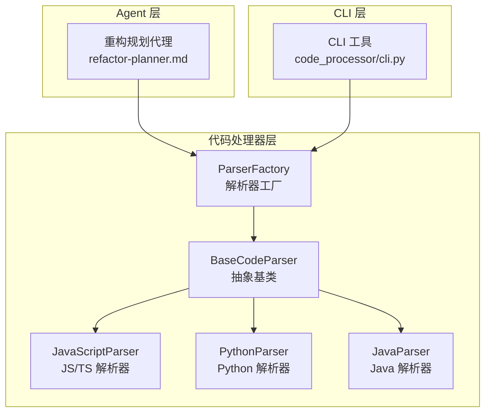
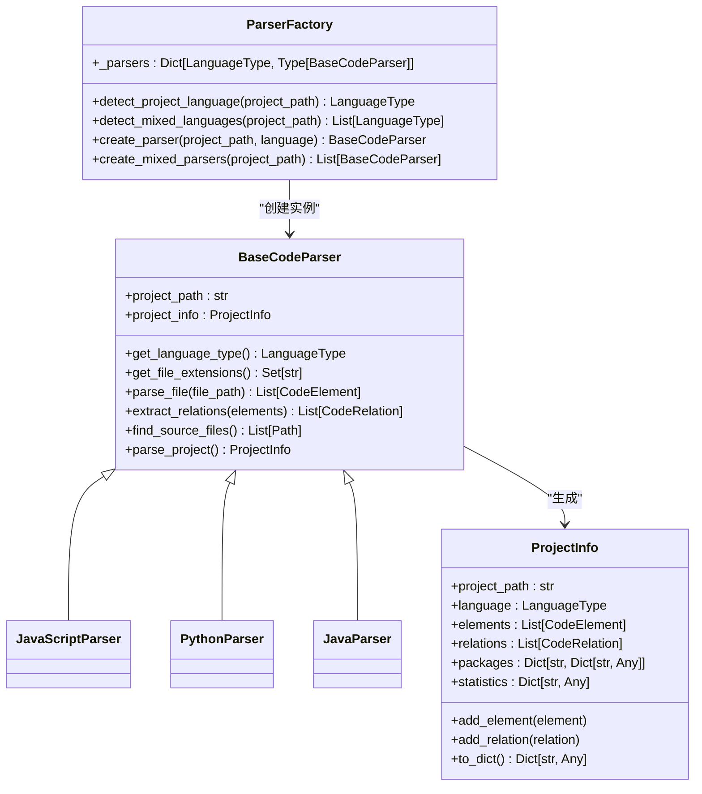
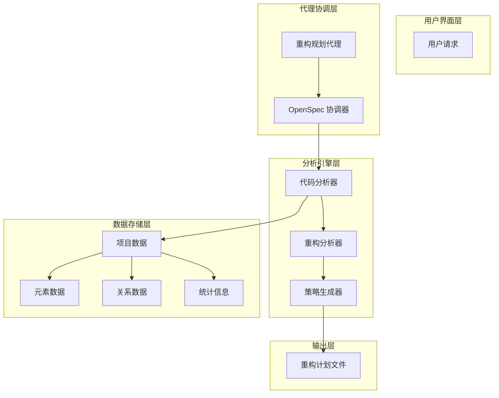
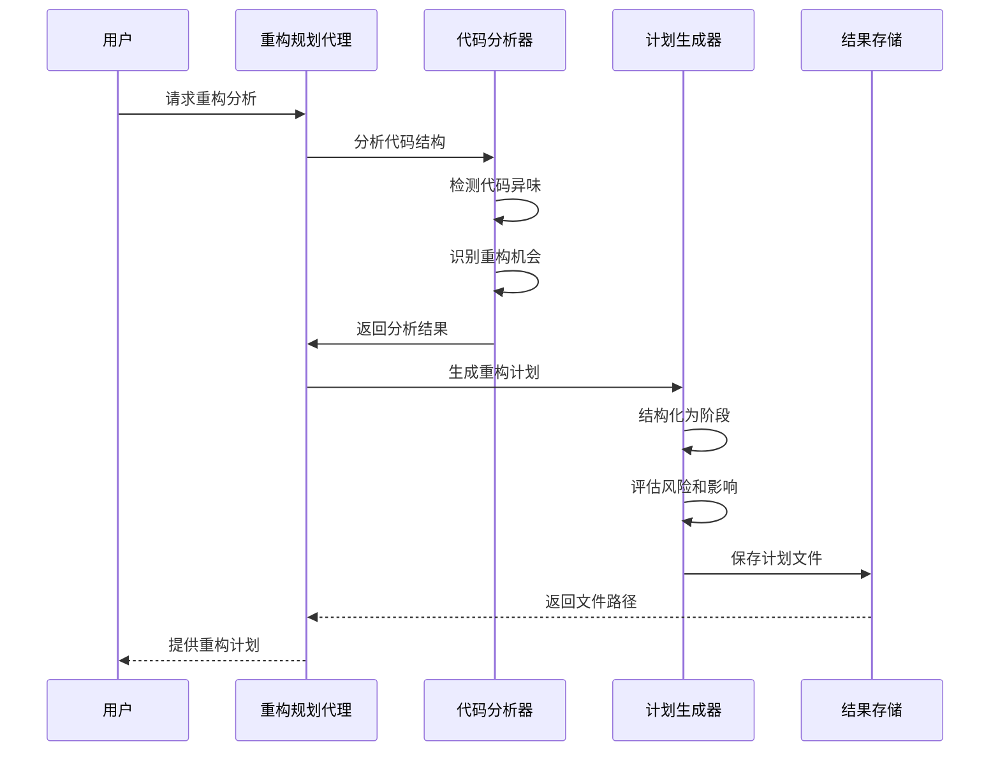
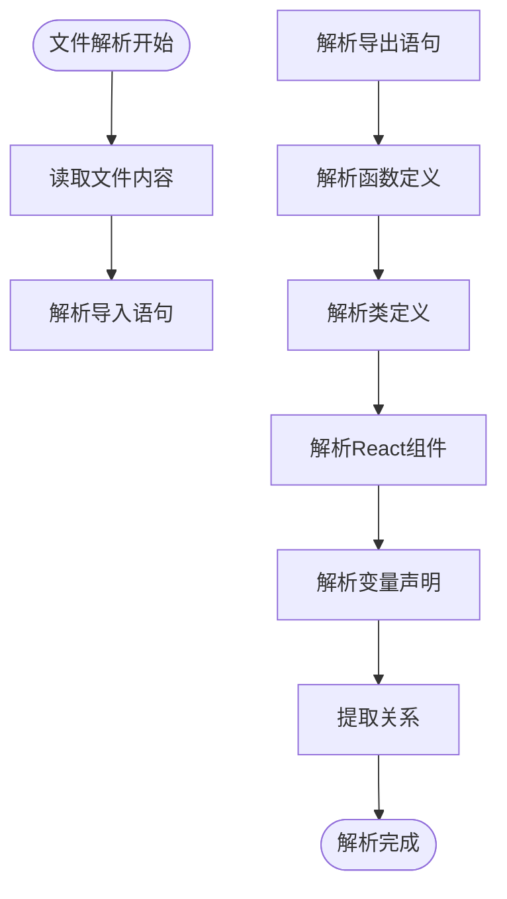
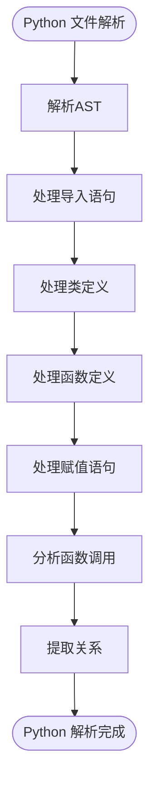
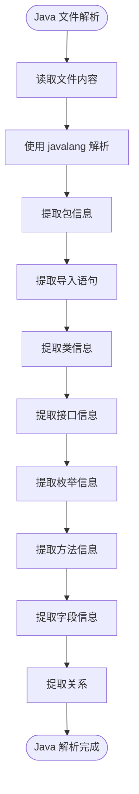
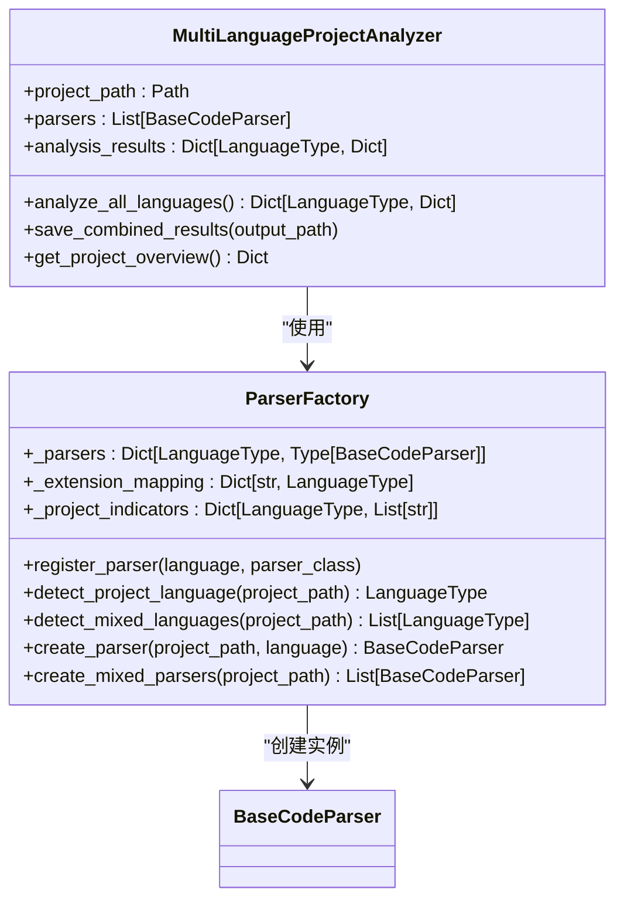
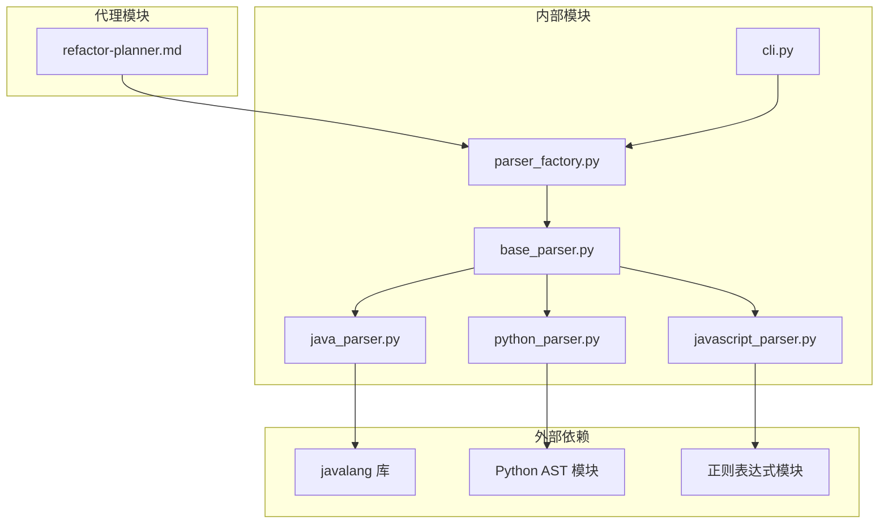

# 重构规划代理

<cite>
**本文档引用的文件**
- [refactor-planner.md](file://agents/refactor-planner.md)
- [base_parser.py](file://code_processor/base_parser.py)
- [parser_factory.py](file://code_processor/parser_factory.py)
- [javascript_parser.py](file://code_processor/javascript_parser.py)
- [python_parser.py](file://code_processor/python_parser.py)
- [java_parser.py](file://code_processor/java_parser.py)
- [cli.py](file://code_processor/cli.py)
- [README.md](file://README.md)
- [CLAUDE.md](file://CLAUDE.md)
- [SKILL.md](file://skills/dev-workflow/SKILL.md)
- [SKILL.md](file://skills/git-workflow/SKILL.md)
</cite>

## 目录
1. [简介](#简介)
2. [项目结构](#项目结构)
3. [核心组件](#核心组件)
4. [架构概览](#架构概览)
5. [详细组件分析](#详细组件分析)
6. [依赖关系分析](#依赖关系分析)
7. [性能考虑](#性能考虑)
8. [故障排除指南](#故障排除指南)
9. [结论](#结论)

## 简介

重构规划代理是一个专门设计的AI代理，用于分析代码结构并创建全面的重构计划。该代理集成了先进的代码解析技术，支持多种编程语言，能够识别技术债务、代码异味和架构改进机会，并提供详细的步骤化重构计划。

该代理的核心功能包括：
- **代码分析**：深度分析当前代码库结构、模块边界和架构模式
- **重构需求识别**：检测代码异味（长方法、大类、特征嫉妒等）
- **策略制定**：基于项目现有模式和约定提出解决方案
- **实施规划**：将重构结构化为逻辑增量阶段
- **风险评估**：识别潜在的破坏性变更和影响

## 项目结构

重构规划代理位于项目的 `agents/` 目录下，与代码处理器模块紧密集成：

**图表来源**
- [refactor-planner.md](file://agents/refactor-planner.md#L1-L63)
- [parser_factory.py](file://code_processor/parser_factory.py#L20-L248)
- [base_parser.py](file://code_processor/base_parser.py#L206-L358)

**章节来源**
- [refactor-planner.md](file://agents/refactor-planner.md#L1-L63)
- [README.md](file://README.md#L71-L92)

## 核心组件

### 重构规划代理核心职责

重构规划代理具有以下核心职责：

1. **当前代码库结构分析**
   - 检查文件组织、模块边界和架构模式
   - 识别代码重复、紧耦合和SOLID原则违规
   - 映射组件间的依赖关系和交互模式
   - 评估当前测试覆盖率和可测试性
   - 审查命名约定、代码一致性和可读性问题

2. **重构机会识别**
   - 检测代码异味（长方法、大类、特征嫉妒等）
   - 寻找提取可重用组件或服务的机会
   - 识别可改进可维护性的设计模式
   - 发现可通过重构解决的性能瓶颈
   - 识别需要现代化的过时模式

3. **详细步骤化重构计划**
   - 将重构结构化为逻辑增量阶段
   - 基于影响、风险和价值优先排序变更
   - 提供关键转换的具体代码示例
   - 定义保持功能的中间状态
   - 为每个重构步骤定义明确的验收标准
   - 估计每阶段的努力和复杂度

4. **依赖关系和风险文档**
   - 映射受重构影响的所有组件
   - 识别潜在的破坏性变更及其影响
   - 强调需要额外测试的区域
   - 记录每阶段的回滚策略
   - 注意任何外部依赖或集成点
   - 评估提议变更的性能影响

**章节来源**
- [refactor-planner.md](file://agents/refactor-planner.md#L9-L62)

### 代码处理器架构

重构规划代理依赖于强大的代码处理器架构，该架构提供了多语言支持和统一的代码分析接口：

**图表来源**
- [base_parser.py](file://code_processor/base_parser.py#L206-L358)
- [parser_factory.py](file://code_processor/parser_factory.py#L20-L248)

**章节来源**
- [base_parser.py](file://code_processor/base_parser.py#L1-L358)
- [parser_factory.py](file://code_processor/parser_factory.py#L1-L248)

## 架构概览

重构规划代理采用分层架构设计，确保了高度的模块化和可扩展性：

**图表来源**
- [refactor-planner.md](file://agents/refactor-planner.md#L41-L62)
- [base_parser.py](file://code_processor/base_parser.py#L173-L204)

## 详细组件分析

### 重构规划代理工作流程

重构规划代理遵循严格的分析-规划-实施流程：

**图表来源**
- [refactor-planner.md](file://agents/refactor-planner.md#L41-L62)

### 代码解析器组件

重构规划代理使用多语言解析器来处理不同类型的代码：

#### JavaScript/TypeScript 解析器

JavaScript/TypeScript 解析器专注于现代前端和全栈代码分析：

**图表来源**
- [javascript_parser.py](file://code_processor/javascript_parser.py#L38-L122)

#### Python 解析器

Python 解析器使用AST（抽象语法树）进行深度分析：

**图表来源**
- [python_parser.py](file://code_processor/python_parser.py#L37-L136)

#### Java 解析器

Java 解析器使用专业的 javalang 库进行精确的代码分析：

**图表来源**
- [java_parser.py](file://code_processor/java_parser.py#L129-L337)

### 解析器工厂模式

解析器工厂实现了工厂模式，支持动态语言检测和多语言项目分析：

**图表来源**
- [parser_factory.py](file://code_processor/parser_factory.py#L20-L248)

**章节来源**
- [javascript_parser.py](file://code_processor/javascript_parser.py#L1-L548)
- [python_parser.py](file://code_processor/python_parser.py#L1-L455)
- [java_parser.py](file://code_processor/java_parser.py#L1-L425)
- [parser_factory.py](file://code_processor/parser_factory.py#L1-L248)

## 依赖关系分析

重构规划代理的依赖关系体现了清晰的分层架构：

**图表来源**
- [base_parser.py](file://code_processor/base_parser.py#L8-L14)
- [parser_factory.py](file://code_processor/parser_factory.py#L12-L15)
- [javascript_parser.py](file://code_processor/javascript_parser.py#L9-L17)

**章节来源**
- [base_parser.py](file://code_processor/base_parser.py#L1-L358)
- [parser_factory.py](file://code_processor/parser_factory.py#L1-L248)

## 性能考虑

重构规划代理在设计时充分考虑了性能优化：

### 内存管理
- 使用生成器模式处理大型项目文件
- 实现增量解析，避免一次性加载所有文件
- 合理的缓存策略，减少重复计算

### 并行处理
- 多语言项目支持并行解析
- 文件级别的并行处理能力
- 异步I/O操作优化

### 优化策略
- 智能的文件过滤机制，排除无关目录
- 增量分析，只处理变更的文件
- 智能的错误处理，避免单点故障

## 故障排除指南

### 常见问题及解决方案

#### Java 解析器依赖问题
**问题**：缺少 javalang 库导致Java解析失败
**解决方案**：安装依赖库或使用其他语言解析器

#### Python AST 解析错误
**问题**：Python文件语法错误导致解析失败
**解决方案**：跳过有问题的文件或修复语法错误

#### JavaScript/TypeScript 解析限制
**问题**：复杂的TypeScript特性无法完全解析
**解决方案**：使用简化版本或手动验证结果

### 调试技巧

1. **启用详细日志**：使用 `-v` 参数获取详细输出
2. **分步调试**：逐个语言类型进行测试
3. **小项目验证**：先在小型项目上测试功能
4. **结果验证**：手动检查生成的分析结果

**章节来源**
- [java_parser.py](file://code_processor/java_parser.py#L43-L44)
- [cli.py](file://code_processor/cli.py#L23-L29)

## 结论

重构规划代理代表了代码重构自动化的重要进展。通过集成多语言解析技术和智能分析算法，该代理能够：

- **全面分析**：支持Java、Python、JavaScript/TypeScript等多种语言
- **智能识别**：自动检测代码异味和重构机会
- **结构化规划**：提供详细的步骤化重构计划
- **风险控制**：全面评估和记录潜在风险
- **质量保证**：确保重构过程的可控性和可追溯性

该代理不仅提高了重构工作的效率，更重要的是确保了重构的质量和安全性。通过遵循项目既定的开发流程和最佳实践，重构规划代理为代码库的长期健康和可维护性提供了强有力的支持。

在未来的发展中，该代理可以进一步扩展支持更多编程语言，集成更高级的机器学习算法来识别重构模式，并提供更智能化的重构建议。同时，与OpenSpec工作流的深度集成将使重构过程更加规范化和标准化。