# 多 AI 协同机制

<cite>
**本文引用的文件**
- [README.md](file://README.md)
- [CLAUDE.md](file://CLAUDE.md)
- [.mcp.json](file://.mcp.json)
- [settings.json](file://settings.json)
- [global/CLAUDE.md](file://global/CLAUDE.md)
- [hooks/skill-activation-prompt.ts](file://hooks/skill-activation-prompt.ts)
- [hooks/skill-activation-prompt.sh](file://hooks/skill-activation-prompt.sh)
- [hooks/post-tool-use-tracker.sh](file://hooks/post-tool-use-tracker.sh)
- [agents/code-architecture-reviewer.md](file://agents/code-architecture-reviewer.md)
- [agents/documentation-architect.md](file://agents/documentation-architect.md)
- [global/codex-skills/brainstorming/SKILL.md](file://global/codex-skills/brainstorming/SKILL.md)
- [global/codex-skills/dispatching-parallel-agents/SKILL.md](file://global/codex-skills/dispatching-decimal-agents/SKILL.md)
</cite>

## 目录
1. [简介](#简介)
2. [项目结构](#项目结构)
3. [核心组件](#核心组件)
4. [架构总览](#架构总览)
5. [详细组件分析](#详细组件分析)
6. [依赖关系分析](#依赖关系分析)
7. [性能考量](#性能考量)
8. [故障排查指南](#故障排查指南)
9. [结论](#结论)
10. [附录](#附录)

## 简介
本文件系统化阐述“多 AI 协同机制”，聚焦 Claude Code、Codex、Gemini 三者在本项目中的角色分工与协作模式，并详解 MCP 协议的实现原理与工具注入机制。同时，明确前后端开发的分工策略：后端开发由 Claude 主导并由 Codex 交叉检查，前端开发由 Gemini 主导并由 Claude 审查。文档提供可落地的协作流程示例，覆盖代码实现、交叉检查、修复验证的完整闭环，并清晰界定主实现者、交叉检查者、修复者的职责与相互关系。

## 项目结构
本项目围绕“多 AI 协同 + SDD（规范驱动开发）”组织，关键要素包括：
- 全局与项目级 CLAUDE.md：定义多 AI 协同规则、开发流程规范、交叉检查策略
- MCP 工具配置：codex（Codex）、gemini-cli（Gemini）
- Hooks：技能激活提示与工具使用后置跟踪
- Agent 模板：架构评审、文档架构等专业化角色
- 全局 Codex 技能：头脑风暴、并行任务分发等

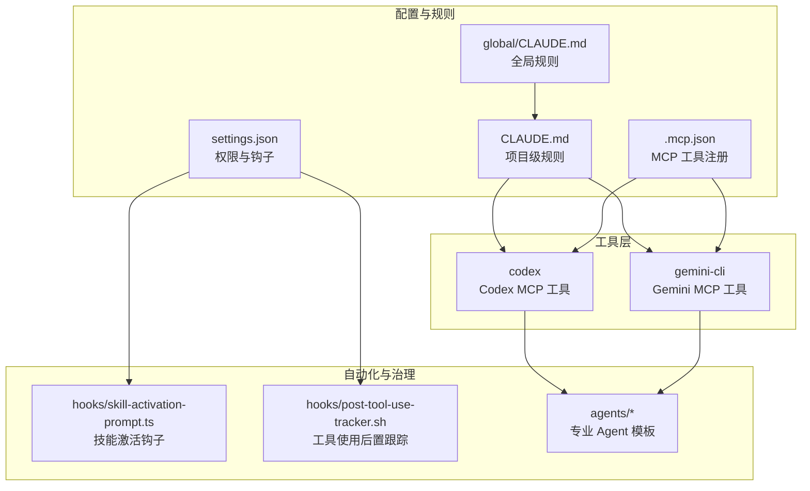

**图表来源**
- [CLAUDE.md](file://CLAUDE.md#L1-L440)
- [global/CLAUDE.md](file://global/CLAUDE.md#L1-L147)
- [.mcp.json](file://.mcp.json#L1-L19)
- [settings.json](file://settings.json#L1-L37)
- [hooks/skill-activation-prompt.ts](file://hooks/skill-activation-prompt.ts#L1-L133)
- [hooks/post-tool-use-tracker.sh](file://hooks/post-tool-use-tracker.sh#L1-L178)
- [agents/code-architecture-reviewer.md](file://agents/code-architecture-reviewer.md#L1-L84)
- [agents/documentation-architect.md](file://agents/documentation-architect.md#L1-L83)

**章节来源**
- [README.md](file://README.md#L1-L229)
- [CLAUDE.md](file://CLAUDE.md#L1-L440)
- [global/CLAUDE.md](file://global/CLAUDE.md#L1-L147)
- [.mcp.json](file://.mcp.json#L1-L19)
- [settings.json](file://settings.json#L1-L37)

## 核心组件
- Claude Code（主体思考者与决策者）
  - 独立分析、设计、质量把控、最终决策与修复
  - 主导后端开发，负责前端方案设计与审查
- Codex（后端技术顾问）
  - 后端交叉检查、复杂算法与架构审查、提供不同实现思路
  - 建议需经 Claude 独立评估
- Gemini（前端开发主力）
  - 前端实现、大规模文本/代码分析、全局视图与模式发现
  - 实现需经 Claude 审查与验证

上述角色与流程在项目级 CLAUDE.md 中有明确规定，MCP 工具通过 .mcp.json 注册，权限与钩子在 settings.json 中配置。

**章节来源**
- [CLAUDE.md](file://CLAUDE.md#L128-L187)
- [global/CLAUDE.md](file://global/CLAUDE.md#L76-L95)
- [.mcp.json](file://.mcp.json#L1-L19)
- [settings.json](file://settings.json#L1-L37)

## 架构总览
多 AI 协同以“Claude 为主导，Codex/Gemini 为交叉验证与扩展”的模式运行。Claude 先独立分析与设计，再通过 MCP 工具进行交叉验证与扩展思路，最终由 Claude 做出决策。MCP 工具以标准协议注入，遵循最小权限与只读/受控写入原则。

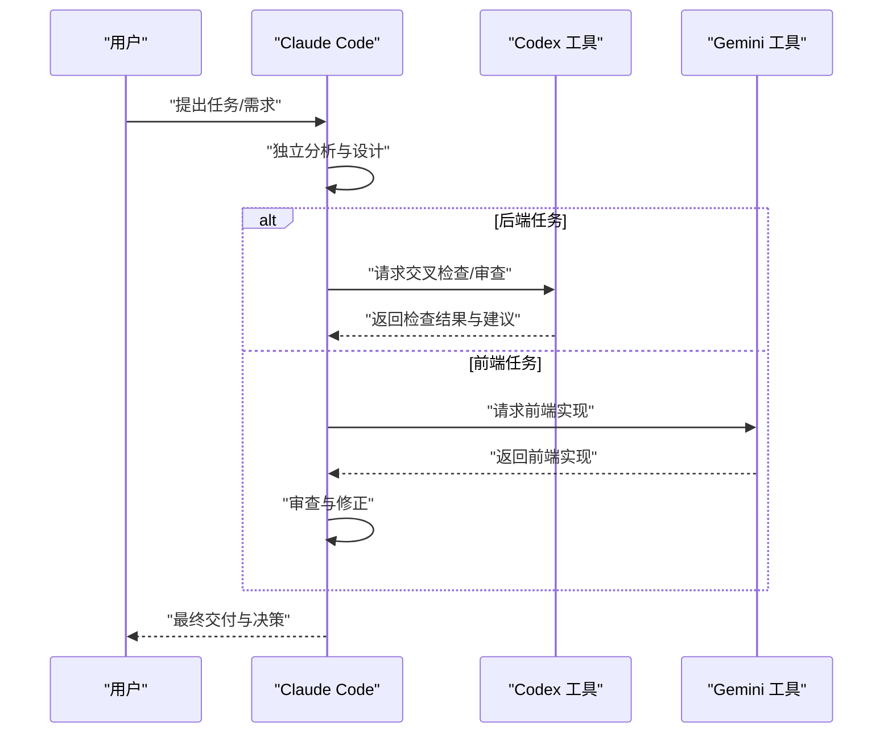

**图表来源**
- [CLAUDE.md](file://CLAUDE.md#L150-L187)
- [global/CLAUDE.md](file://global/CLAUDE.md#L60-L73)

## 详细组件分析

### MCP 协议与工具注入机制
- 工具注册
  - 通过 .mcp.json 声明 codex 与 gemini-cli 的启动方式与传输类型
  - codex 使用 stdio 传输，gemini-cli 使用 npx 启动
- 权限与钩子
  - settings.json 启用项目级 MCP 服务器，配置编辑/写入权限模式
  - UserPromptSubmit 钩子在提交前触发技能激活提示
  - PostToolUse 钩子在 Edit/MultiEdit/Write 成功后记录工具使用与受影响仓库
- 工具使用规范
  - Codex：默认只读/统一 diff 输出，禁止危险访问
  - Gemini：视为只读分析师，前端实现优先使用
  - 最终决策权在 Claude，工具仅为顾问

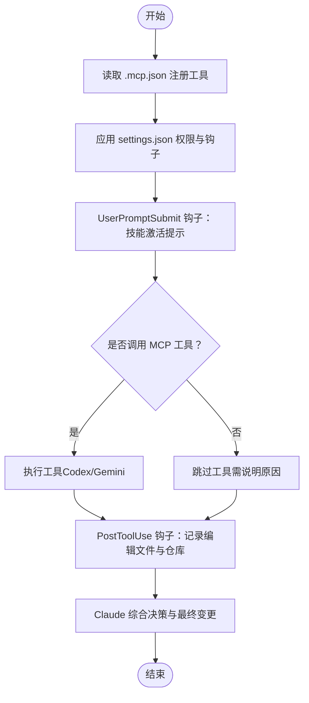

**图表来源**
- [.mcp.json](file://.mcp.json#L1-L19)
- [settings.json](file://settings.json#L1-L37)
- [hooks/skill-activation-prompt.sh](file://hooks/skill-activation-prompt.sh#L1-L6)
- [hooks/skill-activation-prompt.ts](file://hooks/skill-activation-prompt.ts#L1-L133)
- [hooks/post-tool-use-tracker.sh](file://hooks/post-tool-use-tracker.sh#L1-L178)

**章节来源**
- [.mcp.json](file://.mcp.json#L1-L19)
- [settings.json](file://settings.json#L1-L37)
- [CLAUDE.md](file://CLAUDE.md#L359-L391)

### 角色分工与协作模式
- 后端开发（Claude 主导 + Codex 交叉检查）
  - Claude 实现 → Claude 自检 → Codex 交叉检查 → Claude 修复 → 验证
- 前端开发（Gemini 主导 + Claude 审查）
  - Claude 设计 → Gemini 实现 → Claude 审查 → Gemini/Claude 修正 → 验证
- 复杂分析与方案设计
  - Claude 初步分析 → Codex 分析 → Gemini 分析 → Claude 综合决策

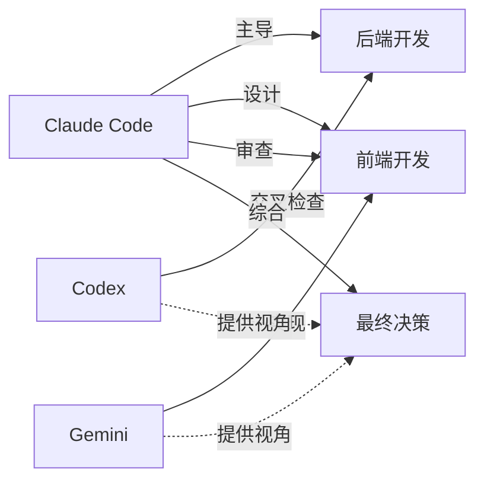

**图表来源**
- [CLAUDE.md](file://CLAUDE.md#L150-L187)
- [global/CLAUDE.md](file://global/CLAUDE.md#L76-L95)

**章节来源**
- [CLAUDE.md](file://CLAUDE.md#L150-L187)
- [global/CLAUDE.md](file://global/CLAUDE.md#L76-L95)

### 交叉检查规则与职责划分
- 后端代码：主实现者 Claude，交叉检查者 Codex，修复者 Claude
- 前端代码：主实现者 Gemini，交叉检查者 Claude，修复者 Gemini/Claude
- 混合代码：按类型分别执行对应流程

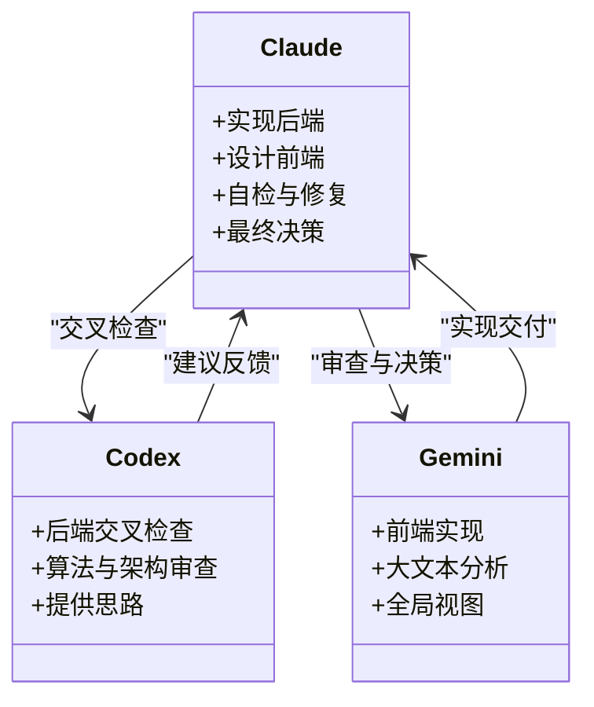

**图表来源**
- [CLAUDE.md](file://CLAUDE.md#L197-L218)
- [global/CLAUDE.md](file://global/CLAUDE.md#L98-L112)

**章节来源**
- [CLAUDE.md](file://CLAUDE.md#L197-L218)
- [global/CLAUDE.md](file://global/CLAUDE.md#L98-L112)

### 技能激活与工具使用治理
- 技能激活钩子
  - 通过 skill-activation-prompt.ts 解析用户输入，匹配 skill-rules.json 中的触发关键词与意图模式
  - 输出按优先级分组的技能清单，并提示在回复前使用相应 Skill 工具
- 工具使用后置跟踪
  - post-tool-use-tracker.sh 记录编辑文件路径、推断仓库归属、收集构建与类型检查命令
  - 为后续验证与审计提供依据

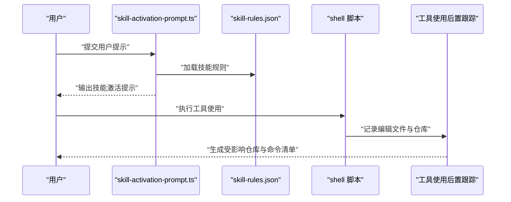

**图表来源**
- [hooks/skill-activation-prompt.ts](file://hooks/skill-activation-prompt.ts#L1-L133)
- [hooks/skill-activation-prompt.sh](file://hooks/skill-activation-prompt.sh#L1-L6)
- [hooks/post-tool-use-tracker.sh](file://hooks/post-tool-use-tracker.sh#L1-L178)

**章节来源**
- [hooks/skill-activation-prompt.ts](file://hooks/skill-activation-prompt.ts#L1-L133)
- [hooks/skill-activation-prompt.sh](file://hooks/skill-activation-prompt.sh#L1-L6)
- [hooks/post-tool-use-tracker.sh](file://hooks/post-tool-use-tracker.sh#L1-L178)

### 典型协作流程示例

#### 后端开发完整循环（Claude → Codex → Claude → 验证）
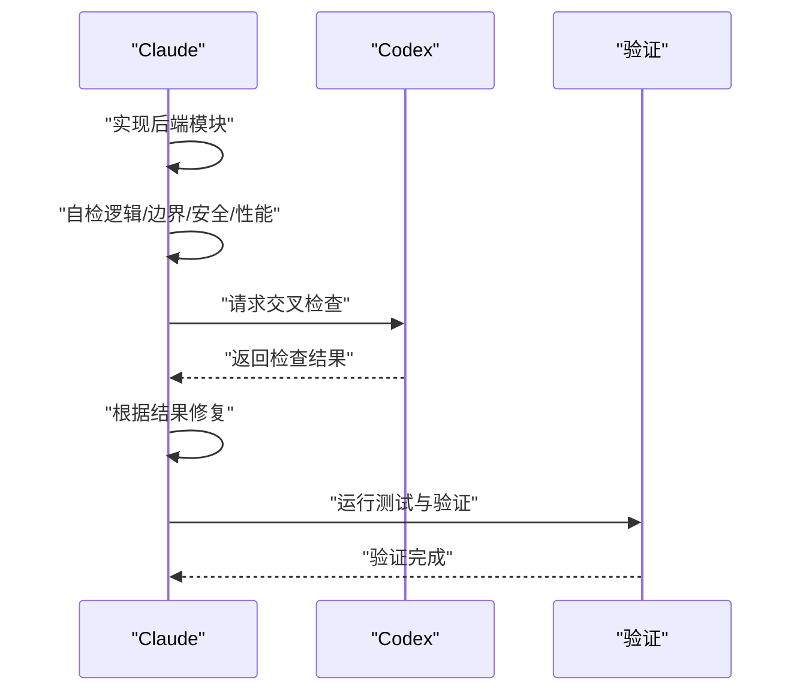

**图表来源**
- [CLAUDE.md](file://CLAUDE.md#L152-L162)

#### 前端开发完整循环（Claude → Gemini → Claude → 修正 → 验证）
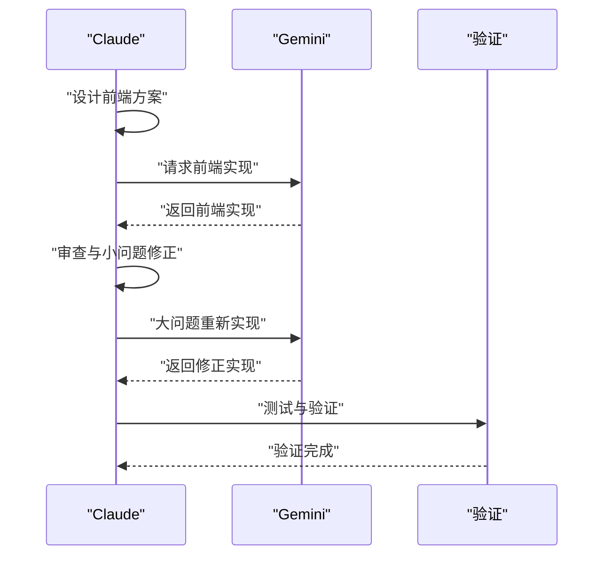

**图表来源**
- [CLAUDE.md](file://CLAUDE.md#L163-L175)

#### 复杂分析与方案设计（Claude → Codex → Gemini → Claude）
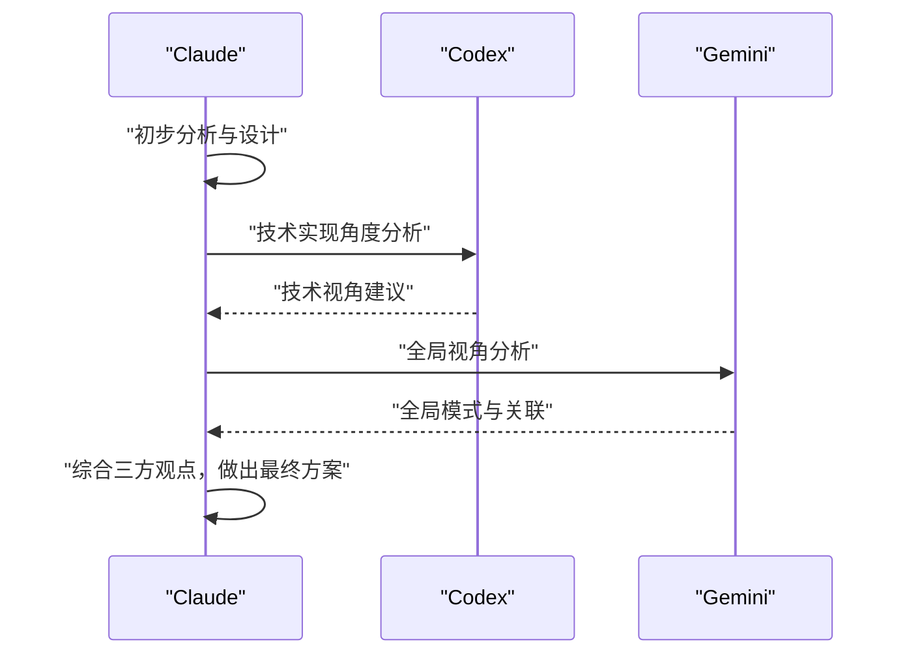

**图表来源**
- [CLAUDE.md](file://CLAUDE.md#L176-L187)

### 专业 Agent 与全局技能支撑
- 架构评审 Agent：对新代码进行质量、设计一致性与系统集成审查
- 文档架构 Agent：基于上下文生成高质量文档，涵盖开发者指南、API 文档、数据流图等
- 全局 Codex 技能：头脑风暴、并行任务分发等，支持创意到设计再到实施的完整链路

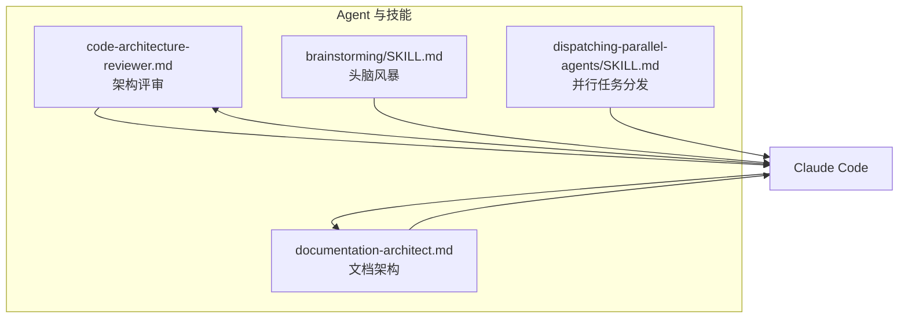

**图表来源**
- [agents/code-architecture-reviewer.md](file://agents/code-architecture-reviewer.md#L1-L84)
- [agents/documentation-architect.md](file://agents/documentation-architect.md#L1-L83)
- [global/codex-skills/brainstorming/SKILL.md](file://global/codex-skills/brainstorming/SKILL.md#L1-L55)
- [global/codex-skills/dispatching-parallel-agents/SKILL.md](file://global/codex-skills/dispatching-parallel-agents/SKILL.md#L1-L181)

**章节来源**
- [agents/code-architecture-reviewer.md](file://agents/code-architecture-reviewer.md#L1-L84)
- [agents/documentation-architect.md](file://agents/documentation-architect.md#L1-L83)
- [global/codex-skills/brainstorming/SKILL.md](file://global/codex-skills/brainstorming/SKILL.md#L1-L55)
- [global/codex-skills/dispatching-parallel-agents/SKILL.md](file://global/codex-skills/dispatching-parallel-agents/SKILL.md#L1-L181)

## 依赖关系分析
- 配置与规则
  - 项目级 CLAUDE.md 依赖全局 CLAUDE.md 的基础规则
  - settings.json 依赖 .mcp.json 的工具注册
- 工具与钩子
  - skill-activation-prompt.ts 依赖 skill-rules.json（位于项目 .claude/skills/）
  - post-tool-use-tracker.sh 依赖项目内仓库结构与包管理器脚本
- Agent 与技能
  - Agent 模板与全局 Codex 技能共同支撑多 AI 协同的创意、并行与审查能力

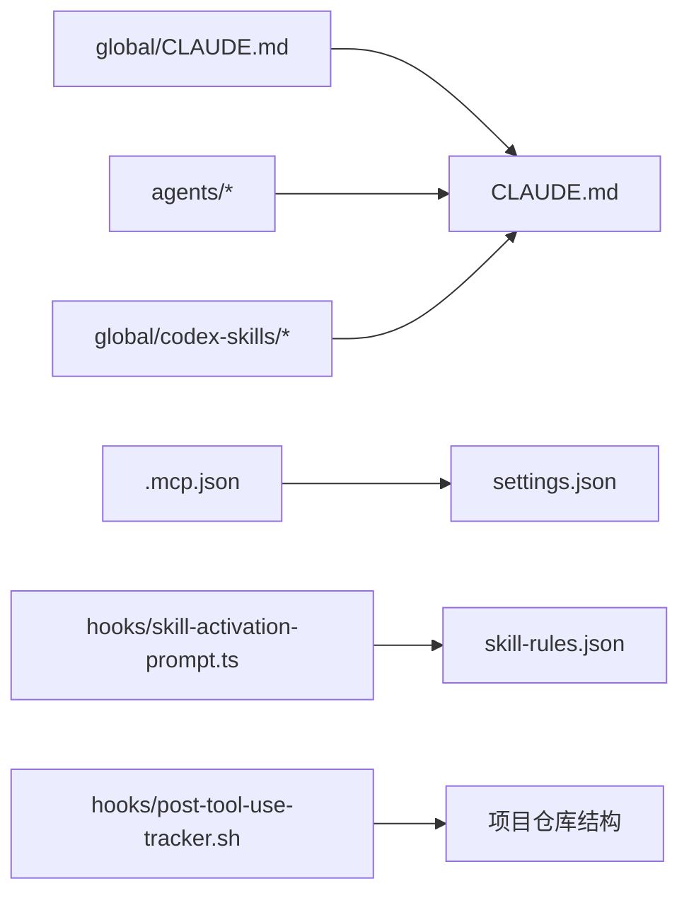

**图表来源**
- [global/CLAUDE.md](file://global/CLAUDE.md#L1-L147)
- [CLAUDE.md](file://CLAUDE.md#L1-L440)
- [.mcp.json](file://.mcp.json#L1-L19)
- [settings.json](file://settings.json#L1-L37)
- [hooks/skill-activation-prompt.ts](file://hooks/skill-activation-prompt.ts#L1-L133)
- [hooks/post-tool-use-tracker.sh](file://hooks/post-tool-use-tracker.sh#L1-L178)
- [agents/code-architecture-reviewer.md](file://agents/code-architecture-reviewer.md#L1-L84)
- [agents/documentation-architect.md](file://agents/documentation-architect.md#L1-L83)
- [global/codex-skills/brainstorming/SKILL.md](file://global/codex-skills/brainstorming/SKILL.md#L1-L55)
- [global/codex-skills/dispatching-parallel-agents/SKILL.md](file://global/codex-skills/dispatching-parallel-agents/SKILL.md#L1-L181)

**章节来源**
- [global/CLAUDE.md](file://global/CLAUDE.md#L1-L147)
- [CLAUDE.md](file://CLAUDE.md#L1-L440)
- [.mcp.json](file://.mcp.json#L1-L19)
- [settings.json](file://settings.json#L1-L37)

## 性能考量
- 并行化：通过 Gemini 的长上下文能力与 Codex 的算法审查能力，Claude 可在复杂问题上实现“多视角并行分析”
- 工具调用成本：MCP 工具默认最小权限与只读/受控写入，减少不必要的资源消耗
- 验证前置：通过 post-tool-use-tracker.sh 自动识别受影响仓库与构建命令，降低人工排查成本

[本节为通用指导，不直接分析具体文件]

## 故障排查指南
- 工具未注册或无法连接
  - 检查 .mcp.json 中工具命令与参数是否正确
  - 确认 MCP 服务器已启用（settings.json enableAllProjectMcpServers）
- 技能未按预期激活
  - 检查 skill-activation-prompt.ts 与 skill-rules.json 的匹配规则
  - 确认 UserPromptSubmit 钩子已执行
- 工具使用后未记录
  - 检查 PostToolUse 钩子与 post-tool-use-tracker.sh 的执行权限
  - 确认编辑文件路径与仓库推断逻辑
- 交叉检查结果未被采纳
  - 遵循 CLAUDE.md 中“最终决策权在 Claude”的原则，工具建议需经独立评估

**章节来源**
- [.mcp.json](file://.mcp.json#L1-L19)
- [settings.json](file://settings.json#L1-L37)
- [hooks/skill-activation-prompt.ts](file://hooks/skill-activation-prompt.ts#L1-L133)
- [hooks/post-tool-use-tracker.sh](file://hooks/post-tool-use-tracker.sh#L1-L178)
- [CLAUDE.md](file://CLAUDE.md#L394-L410)

## 结论
本项目通过“Claude 主导 + Codex/Gemini 交叉验证”的多 AI 协同机制，结合 MCP 工具注入、权限与钩子治理、Agent 与全局技能支撑，形成了规范驱动、可验证、可审计的开发流水线。后端由 Claude 主导并由 Codex 交叉检查，前端由 Gemini 主导并由 Claude 审查，配合标准化的交叉检查与验证流程，确保质量与效率的平衡。

[本节为总结性内容，不直接分析具体文件]

## 附录
- 术语
  - MCP：Model Context Protocol，用于在 Claude 与外部工具之间建立标准通信
  - 交叉检查：由第三方工具对主实现者的工作进行独立审查与验证
- 参考
  - README.md 中的快速开始与目录结构
  - CLAUDE.md 中的角色分工与流程规范
  - global/CLAUDE.md 中的全局规则与工具使用原则

**章节来源**
- [README.md](file://README.md#L1-L229)
- [CLAUDE.md](file://CLAUDE.md#L1-L440)
- [global/CLAUDE.md](file://global/CLAUDE.md#L1-L147)