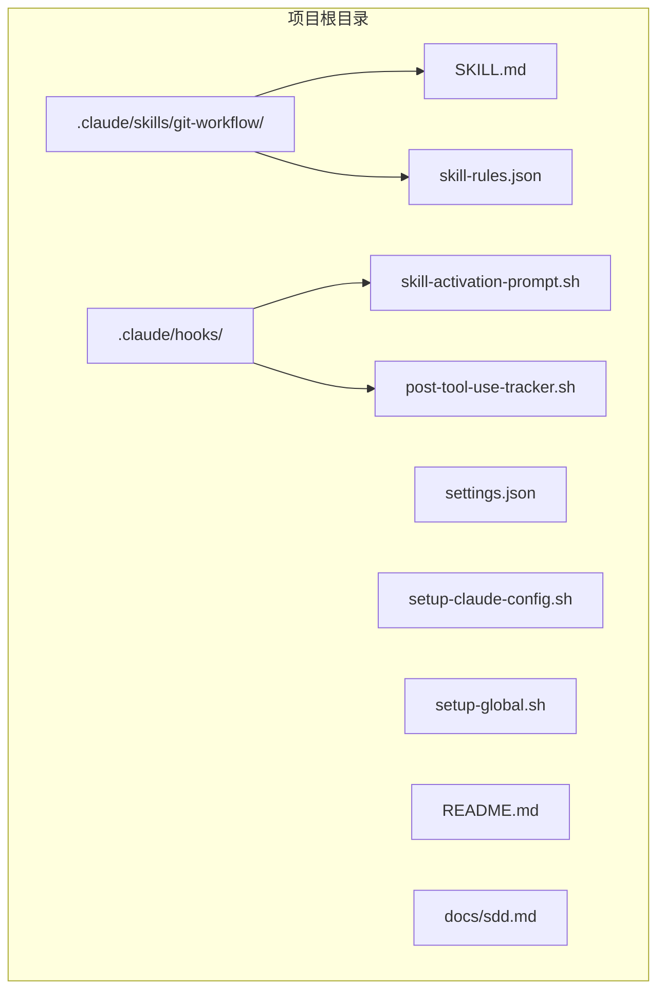
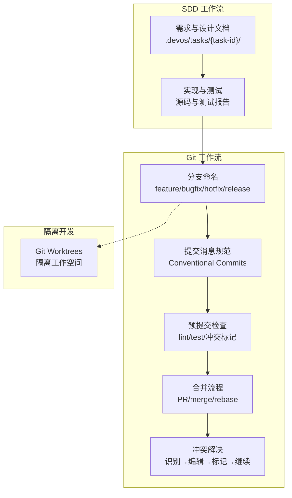
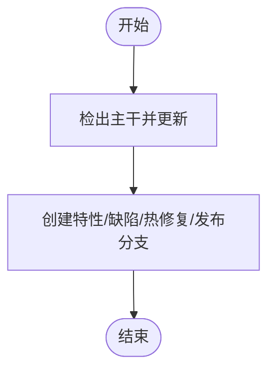
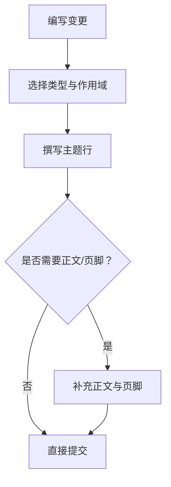
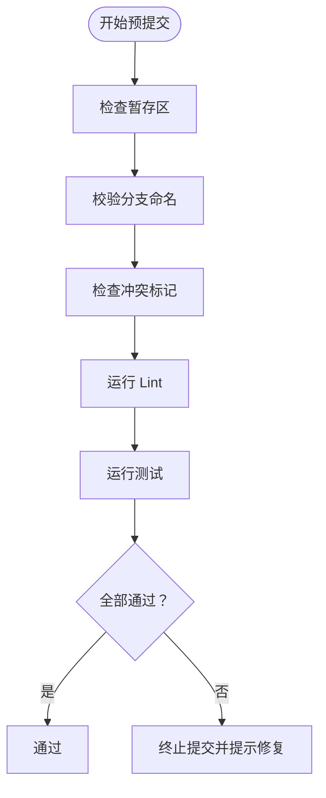
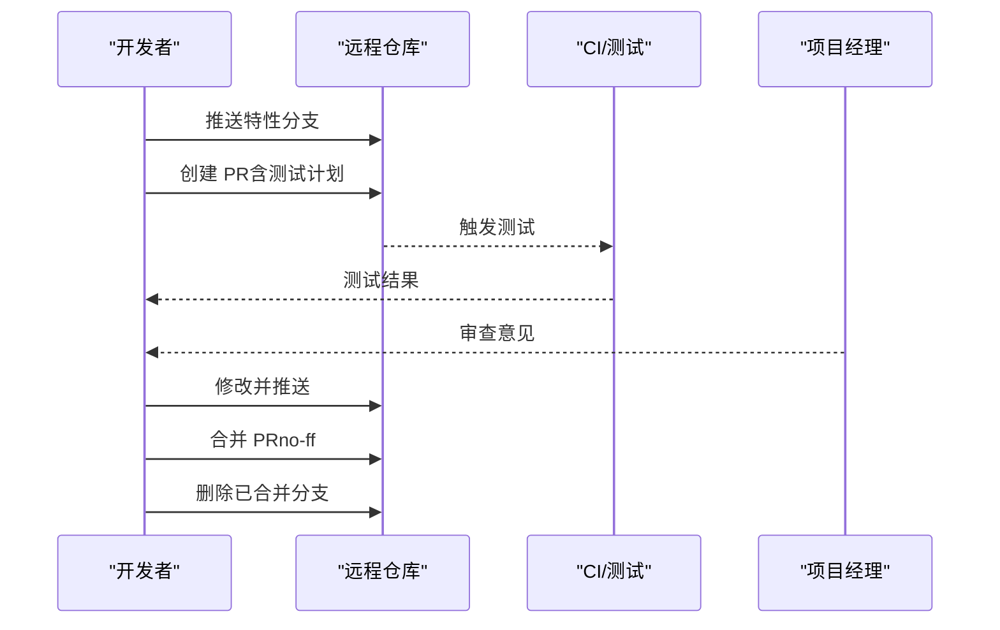
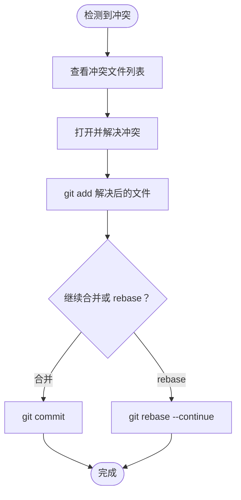
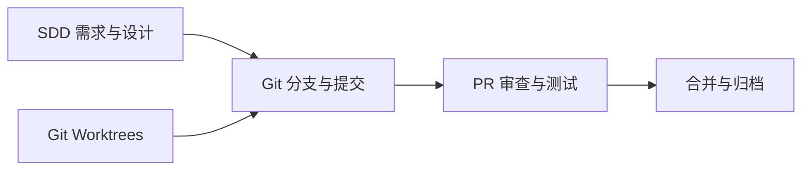
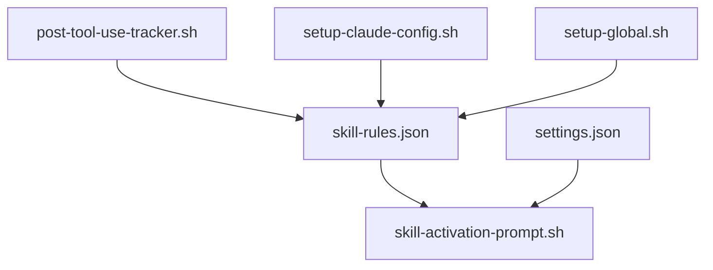

# Git 工作流技能

<cite>
**本文引用的文件**
- [skills/git-workflow/SKILL.md](file://skills/git-workflow/SKILL.md)
- [skills/dev-workflow/SKILL.md](file://skills/dev-workflow/SKILL.md)
- [global/codex-skills/using-git-worktrees/SKILL.md](file://global/codex-skills/using-git-worktrees/SKILL.md)
- [docs/sdd.md](file://docs/sdd.md)
- [README.md](file://README.md)
- [setup-claude-config.sh](file://setup-claude-config.sh)
- [setup-global.sh](file://setup-global.sh)
- [settings.json](file://settings.json)
- [hooks/skill-activation-prompt.sh](file://hooks/skill-activation-prompt.sh)
- [hooks/post-tool-use-tracker.sh](file://hooks/post-tool-use-tracker.sh)
- [skills/skill-rules.json](file://skills/skill-rules.json)
</cite>

## 目录
1. [简介](#简介)
2. [项目结构](#项目结构)
3. [核心组件](#核心组件)
4. [架构总览](#架构总览)
5. [详细组件分析](#详细组件分析)
6. [依赖分析](#依赖分析)
7. [性能考量](#性能考量)
8. [故障排查指南](#故障排查指南)
9. [结论](#结论)
10. [附录](#附录)

## 简介
本文件系统化阐述 Git 工作流技能，面向团队协作与规范化的版本控制实践，覆盖分支命名约定、提交消息规范、预提交检查、合并与拉取请求流程、冲突解决策略，以及与 SDD（规范驱动开发）工作流的结合方法。文档同时提供可操作的 Git 指令与常见问题解决方案，帮助提升代码管理与发布效率。

## 项目结构
该仓库提供了完整的多 AI 协同与 SDD 工作流基础设施，其中 Git 工作流技能位于 skills/git-workflow 目录，配套的技能触发规则、钩子与配置位于 .claude 目录与 hooks 目录中。整体结构如下：

图表来源
- [README.md](file://README.md#L71-L92)
- [setup-claude-config.sh](file://setup-claude-config.sh#L60-L85)
- [setup-global.sh](file://setup-global.sh#L13-L21)

章节来源
- [README.md](file://README.md#L71-L92)
- [setup-claude-config.sh](file://setup-claude-config.sh#L60-L85)
- [setup-global.sh](file://setup-global.sh#L13-L21)

## 核心组件
- Git 工作流技能（skills/git-workflow/SKILL.md）：定义分支命名、提交消息、预提交检查、合并流程与冲突解决的规范与操作步骤。
- Dev 工作流技能（skills/dev-workflow/SKILL.md）：定义 SDD 开发流程的阶段顺序、文档规范与目录约定，为 Git 工作流提供上下文。
- Git Worktrees 技能（global/codex-skills/using-git-worktrees/SKILL.md）：提供隔离工作空间的实践，便于并行开发与安全验证。
- 技能触发与钩子（skills/skill-rules.json、hooks/skill-activation-prompt.sh、hooks/post-tool-use-tracker.sh）：通过关键词与意图模式自动激活相应技能，保障 Git 工作流的规范化执行。
- 配置与部署脚本（settings.json、setup-claude-config.sh、setup-global.sh）：提供项目级与全局级的 Claude Code 配置、插件与 MCP 工具安装，支撑 Git 工作流的自动化与一致性。

章节来源
- [skills/git-workflow/SKILL.md](file://skills/git-workflow/SKILL.md#L1-L440)
- [skills/dev-workflow/SKILL.md](file://skills/dev-workflow/SKILL.md#L1-L397)
- [global/codex-skills/using-git-worktrees/SKILL.md](file://global/codex-skills/using-git-worktrees/SKILL.md#L1-L214)
- [skills/skill-rules.json](file://skills/skill-rules.json#L1-L250)
- [hooks/skill-activation-prompt.sh](file://hooks/skill-activation-prompt.sh#L1-L6)
- [hooks/post-tool-use-tracker.sh](file://hooks/post-tool-use-tracker.sh#L1-L178)
- [settings.json](file://settings.json#L1-L37)
- [setup-claude-config.sh](file://setup-claude-config.sh#L1-L372)
- [setup-global.sh](file://setup-global.sh#L1-L471)

## 架构总览
Git 工作流技能与 SDD 工作流在项目中协同运作：SDD 明确“做什么”，Git 工作流确保“如何做”（分支、提交、合并、审查）。Git Worktrees 技能进一步提供隔离开发环境，确保变更在受控空间内验证与测试。

图表来源
- [skills/dev-workflow/SKILL.md](file://skills/dev-workflow/SKILL.md#L28-L92)
- [skills/git-workflow/SKILL.md](file://skills/git-workflow/SKILL.md#L27-L121)
- [global/codex-skills/using-git-worktrees/SKILL.md](file://global/codex-skills/using-git-worktrees/SKILL.md#L6-L142)

## 详细组件分析

### 分支命名与创建
- 分支类型与命名模式：feature/bugfix/hotfix/release，结合任务 ID 与简要描述，确保可追溯性与可读性。
- 创建流程：从主干拉取最新代码后创建新分支，避免本地落后导致的冲突与重复劳动。

图表来源
- [skills/git-workflow/SKILL.md](file://skills/git-workflow/SKILL.md#L54-L71)

章节来源
- [skills/git-workflow/SKILL.md](file://skills/git-workflow/SKILL.md#L27-L71)

### 提交消息规范（Conventional Commits）
- 格式：type(scope): subject
- 类型覆盖：feat、fix、docs、style、refactor、test、chore、perf 等。
- 示例：包含正文与页脚，Breaking Change 场景需明确说明影响与迁移建议。

图表来源
- [skills/git-workflow/SKILL.md](file://skills/git-workflow/SKILL.md#L75-L121)

章节来源
- [skills/git-workflow/SKILL.md](file://skills/git-workflow/SKILL.md#L75-L121)

### 预提交检查清单与自动化脚本
- 清单：变更已暂存、分支名符合约定、无冲突标记、本地测试与 Lint 通过。
- 自动化脚本：检查分支命名、冲突标记、Lint，失败即中止提交，确保提交质量。

图表来源
- [skills/git-workflow/SKILL.md](file://skills/git-workflow/SKILL.md#L125-L192)

章节来源
- [skills/git-workflow/SKILL.md](file://skills/git-workflow/SKILL.md#L125-L192)

### 合并与拉取请求流程
- 特性分支合并：先与主干 rebase/merge 保持线性或引入合并提交，推送后创建 PR。
- 合并到主干：PR 审查通过后，使用 no-ff 合并并删除已合并分支。
- 热修复合并：先合并到主干，再合并到 develop，确保双分支一致。

图表来源
- [skills/git-workflow/SKILL.md](file://skills/git-workflow/SKILL.md#L196-L254)

章节来源
- [skills/git-workflow/SKILL.md](file://skills/git-workflow/SKILL.md#L196-L254)

### 冲突解决流程
- 识别冲突：git status 查看冲突文件。
- 打开并编辑冲突文件，按需保留或合并变更，移除冲突标记。
- 标记为已解决并继续：git add 后执行 commit 或 rebase --continue。
- 异常情况：可 abort 合并或 rebase，避免长期悬挂状态。

图表来源
- [skills/git-workflow/SKILL.md](file://skills/git-workflow/SKILL.md#L258-L303)

章节来源
- [skills/git-workflow/SKILL.md](file://skills/git-workflow/SKILL.md#L258-L303)

### 与 SDD 工作流的结合
- SDD 明确“做什么”：Requirement → Design → Implementation → Review → Testing → Done。
- Git 工作流确保“如何做”：以规范的分支与提交管理贯穿每个阶段，配合 PR 审查与测试报告，形成闭环。
- Git Worktrees 提供隔离开发环境，避免主干污染，便于并行任务与基线验证。

图表来源
- [skills/dev-workflow/SKILL.md](file://skills/dev-workflow/SKILL.md#L28-L92)
- [skills/git-workflow/SKILL.md](file://skills/git-workflow/SKILL.md#L27-L121)
- [global/codex-skills/using-git-worktrees/SKILL.md](file://global/codex-skills/using-git-worktrees/SKILL.md#L6-L142)

章节来源
- [skills/dev-workflow/SKILL.md](file://skills/dev-workflow/SKILL.md#L28-L92)
- [skills/git-workflow/SKILL.md](file://skills/git-workflow/SKILL.md#L27-L121)
- [global/codex-skills/using-git-worktrees/SKILL.md](file://global/codex-skills/using-git-worktrees/SKILL.md#L6-L142)

## 依赖分析
- 技能触发与钩子：skill-rules.json 定义关键词与意图模式，自动激活 git-workflow 技能；post-tool-use-tracker.sh 在编辑后记录受影响仓库，辅助后续验证。
- 配置与部署：settings.json 控制权限与钩子；setup-claude-config.sh/setup-global.sh 负责安装技能、插件、MCP 工具与 OpenSpec，确保 Git 工作流的可复现与可移植。

图表来源
- [skills/skill-rules.json](file://skills/skill-rules.json#L1-L250)
- [hooks/skill-activation-prompt.sh](file://hooks/skill-activation-prompt.sh#L1-L6)
- [hooks/post-tool-use-tracker.sh](file://hooks/post-tool-use-tracker.sh#L1-L178)
- [settings.json](file://settings.json#L1-L37)
- [setup-claude-config.sh](file://setup-claude-config.sh#L1-L372)
- [setup-global.sh](file://setup-global.sh#L1-L471)

章节来源
- [skills/skill-rules.json](file://skills/skill-rules.json#L1-L250)
- [hooks/skill-activation-prompt.sh](file://hooks/skill-activation-prompt.sh#L1-L6)
- [hooks/post-tool-use-tracker.sh](file://hooks/post-tool-use-tracker.sh#L1-L178)
- [settings.json](file://settings.json#L1-L37)
- [setup-claude-config.sh](file://setup-claude-config.sh#L1-L372)
- [setup-global.sh](file://setup-global.sh#L1-L471)

## 性能考量
- 减少大型提交：将一次逻辑变更拆分为多个小提交，便于审查与回滚。
- 避免直接推送主干：通过 PR 流程集中审查与测试，降低回归风险。
- 使用 rebase 保持线性历史：在特性分支内定期 rebase 主干，减少合并噪音。
- 预提交检查前置：在本地尽早发现问题，减少 CI 与审查成本。

## 故障排查指南
- 分支命名不规范：检查分支是否以 feature/bugfix/hotfix/release 开头，必要时重命名并更新远程分支。
- 冲突标记未清理：使用 git diff --check 检查冲突标记，解决后重新暂存并提交。
- Lint 或测试失败：先在本地修复，确保通过后再推送；必要时回退到上一个稳定提交。
- 合并冲突无法继续：使用 git merge --abort 或 git rebase --abort 撤销，重新开始。
- PR 审查反馈未处理：根据审查意见逐一修改，提交后在 PR 下方评论以触发 CI 重新运行。

章节来源
- [skills/git-workflow/SKILL.md](file://skills/git-workflow/SKILL.md#L125-L303)

## 结论
Git 工作流技能通过规范化的分支命名、提交消息、预提交检查与合并流程，显著提升团队协作效率与代码质量。结合 SDD 工作流与 Git Worktrees 技能，可在“做什么”与“如何做”之间建立清晰边界，确保变更可控、可追溯、可验证。通过 skill-rules.json 与钩子机制，Git 工作流得以自动化激活与持续改进，为大规模团队协作提供坚实基础。

## 附录
- 常用 Git 操作速查
  - 查看状态与历史：git status、git log --oneline -10、git log --oneline --graph --all
  - 查看变更：git diff、git diff --staged、git diff path/to/file.py
  - 撤销与重置：git reset HEAD path/to/file.py、git checkout -- path/to/file.py、git reset --soft/--hard HEAD~1
- 部署与配置
  - 项目级部署：./setup-claude-config.sh
  - 全局部署：./setup-global.sh
  - 验证 MCP 工具：claude mcp list
  - 验证插件：claude plugin list

章节来源
- [README.md](file://README.md#L12-L139)
- [setup-claude-config.sh](file://setup-claude-config.sh#L1-L372)
- [setup-global.sh](file://setup-global.sh#L1-L471)