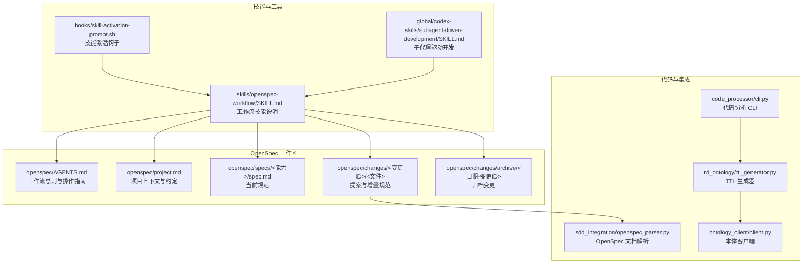
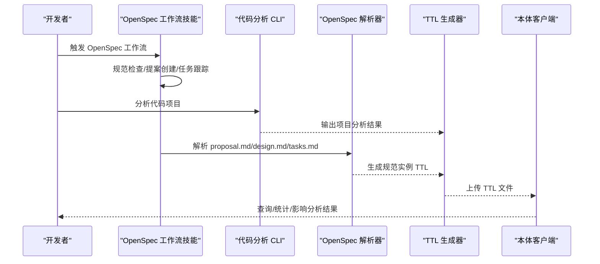
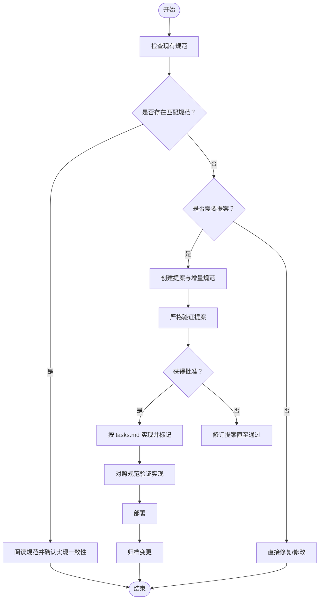
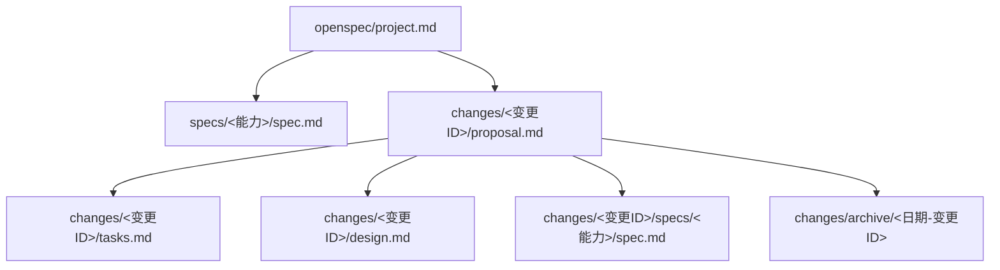
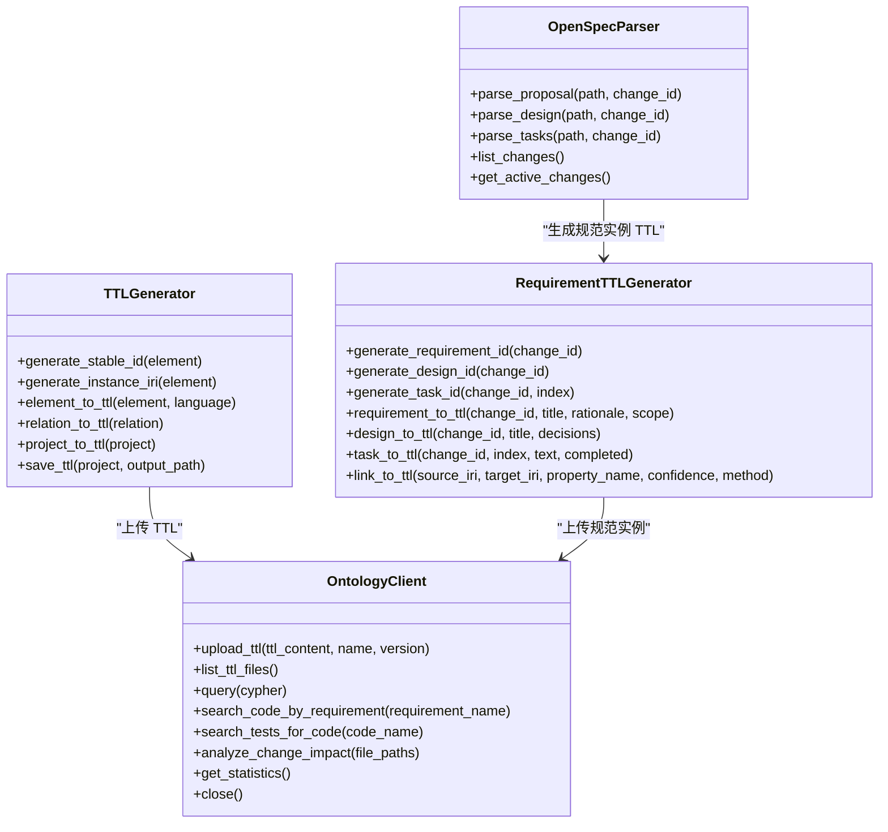
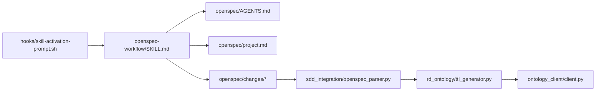

# OpenSpec 工作流技能

<cite>
**本文引用的文件**
- [skills/openspec-workflow/SKILL.md](file://skills/openspec-workflow/SKILL.md)
- [openspec/AGENTS.md](file://openspec/AGENTS.md)
- [openspec/project.md](file://openspec/project.md)
- [openspec/specs/claudecode-openspec-integration/spec.md](file://openspec/specs/claudecode-openspec-integration/spec.md)
- [openspec/changes/add-code-ontology-capability/proposal.md](file://openspec/changes/add-code-ontology-capability/proposal.md)
- [openspec/changes/add-code-ontology-capability/design.md](file://openspec/changes/add-code-ontology-capability/design.md)
- [openspec/changes/add-code-ontology-capability/tasks.md](file://openspec/changes/add-code-ontology-capability/tasks.md)
- [openspec/changes/archive/2026-01-22-add-claudecode-openspec-workflow/proposal.md](file://openspec/changes/archive/2026-01-22-add-claudecode-openspec-workflow/proposal.md)
- [openspec/changes/archive/2026-01-22-add-claudecode-openspec-workflow/tasks.md](file://openspec/changes/archive/2026-01-22-add-claudecode-openspec-workflow/tasks.md)
- [global/codex-skills/subagent-driven-development/SKILL.md](file://global/codex-skills/subagent-driven-development/SKILL.md)
- [code_processor/cli.py](file://code_processor/cli.py)
- [sdd_integration/openspec_parser.py](file://sdd_integration/openspec_parser.py)
- [rd_ontology/ttl_generator.py](file://rd_ontology/ttl_generator.py)
- [ontology_client/client.py](file://ontology_client/client.py)
- [hooks/skill-activation-prompt.sh](file://hooks/skill-activation-prompt.sh)
</cite>

## 目录
1. [简介](#简介)
2. [项目结构](#项目结构)
3. [核心组件](#核心组件)
4. [架构总览](#架构总览)
5. [详细组件分析](#详细组件分析)
6. [依赖关系分析](#依赖关系分析)
7. [性能考量](#性能考量)
8. [故障排查指南](#故障排查指南)
9. [结论](#结论)
10. [附录](#附录)

## 简介
本文件系统化阐述 OpenSpec 规范驱动开发（SDD）工作流技能，围绕“规范先行”的理念，覆盖从需求规范到实现验证的完整闭环。内容包括：
- OpenSpec 规范编写与变更提案管理
- 三阶段工作流（创建变更、实现变更、归档变更）
- 技能如何支撑规范驱动开发流程
- OpenSpec 文档编写指南与最佳实践
- 在实际项目中应用 OpenSpec 工作流技能的方法

## 项目结构
该仓库以多 AI 协同开发基础设施为核心，OpenSpec 工作流技能作为关键能力之一，与 SDD 流程、Agent 协作、Hooks 自动化等模块协同工作。

图表来源
- [openspec/AGENTS.md](file://openspec/AGENTS.md#L1-L457)
- [openspec/project.md](file://openspec/project.md#L1-L65)
- [skills/openspec-workflow/SKILL.md](file://skills/openspec-workflow/SKILL.md#L1-L231)
- [hooks/skill-activation-prompt.sh](file://hooks/skill-activation-prompt.sh#L1-L6)
- [global/codex-skills/subagent-driven-development/SKILL.md](file://global/codex-skills/subagent-driven-development/SKILL.md#L1-L241)
- [code_processor/cli.py](file://code_processor/cli.py#L1-L215)
- [sdd_integration/openspec_parser.py](file://sdd_integration/openspec_parser.py#L1-L249)
- [rd_ontology/ttl_generator.py](file://rd_ontology/ttl_generator.py#L1-L321)
- [ontology_client/client.py](file://ontology_client/client.py#L1-L201)

章节来源
- [openspec/AGENTS.md](file://openspec/AGENTS.md#L123-L141)
- [openspec/project.md](file://openspec/project.md#L32-L35)

## 核心组件
- OpenSpec 工作流技能：提供规范驱动开发的命令、模板与流程指引，确保“先规范、后实现、再归档”。
- OpenSpec 文档体系：包含项目上下文、当前规范与变更提案，形成“现状-计划-历史”的三段式结构。
- 代码与本体集成：通过 CLI 分析代码、解析 OpenSpec 文档、生成 TTL 并上传至本体服务，打通“代码-规范-查询”的知识图谱链路。
- 子代理驱动开发：与 OpenSpec 工作流结合，以“任务级子代理 + 两阶段评审”保障实现质量与规范一致性。

章节来源
- [skills/openspec-workflow/SKILL.md](file://skills/openspec-workflow/SKILL.md#L8-L231)
- [openspec/AGENTS.md](file://openspec/AGENTS.md#L15-L64)
- [global/codex-skills/subagent-driven-development/SKILL.md](file://global/codex-skills/subagent-driven-development/SKILL.md#L38-L83)

## 架构总览
OpenSpec 工作流技能在整体项目中的作用是“规范治理 + 实施管控 + 质量保证”。其与代码分析、本体构建、查询检索形成闭环。

图表来源
- [skills/openspec-workflow/SKILL.md](file://skills/openspec-workflow/SKILL.md#L138-L186)
- [code_processor/cli.py](file://code_processor/cli.py#L32-L110)
- [sdd_integration/openspec_parser.py](file://sdd_integration/openspec_parser.py#L51-L86)
- [rd_ontology/ttl_generator.py](file://rd_ontology/ttl_generator.py#L176-L228)
- [ontology_client/client.py](file://ontology_client/client.py#L26-L48)

## 详细组件分析

### 组件一：OpenSpec 工作流技能（规范驱动开发）
- 目标与适用场景：在开始新功能、破坏性变更、架构调整前，先检查现有规范或创建提案；在实现前进行验证，在部署后归档。
- 快速参考命令与斜杠命令：提供 list/show/validate/archive 等常用命令及 /openspec:* 命令入口。
- 实施前检查清单：检查现有规范、活跃变更，判断是否需要提案。
- 提案创建：目录结构、变更 ID 命名、proposal.md/tasks.md/specs 增量模板。
- 实现流程：阅读 proposal/design/tasks，按序实现并标记任务，最后对照规范验证。
- 验证与归档：使用严格模式验证，部署后归档并移动到 archive 目录。
- 决策树：针对“新请求/修复/破坏性变更/架构变更”给出是否创建提案的建议。

图表来源
- [skills/openspec-workflow/SKILL.md](file://skills/openspec-workflow/SKILL.md#L48-L200)

章节来源
- [skills/openspec-workflow/SKILL.md](file://skills/openspec-workflow/SKILL.md#L16-L231)

### 组件二：OpenSpec 文档体系（规范-提案-历史）
- 项目上下文：明确目的、技术栈、外部工具、约束与 SDD 流程。
- 规范（specs）：当前能力的权威需求与场景，采用“新增/修改/删除/重命名”增量格式。
- 提案（changes）：包含 proposal.md、tasks.md、design.md（必要时），以及针对受影响能力的增量规范。
- 归档（archive）：完成的变更迁移至带日期的归档目录，便于追溯与审计。

图表来源
- [openspec/project.md](file://openspec/project.md#L1-L65)
- [openspec/AGENTS.md](file://openspec/AGENTS.md#L123-L141)

章节来源
- [openspec/AGENTS.md](file://openspec/AGENTS.md#L143-L196)
- [openspec/project.md](file://openspec/project.md#L32-L35)

### 组件三：代码与本体集成（从代码到规范再到查询）
- 代码分析 CLI：支持单语言/混合语言分析，输出 JSON/TTL 结果，生成项目概览与统计信息。
- OpenSpec 解析器：解析 proposal.md/design.md/tasks.md，抽取 Requirement/Design/Task 数据结构，提取文件路径等元信息。
- TTL 生成器：将 CodeElement/CodeRelation 与 Requirement/Design/Task 转换为 TTL 三元组，生成稳定 IRI。
- 本体客户端：负责 TTL 文件上传、Neo4j 查询、语义搜索与影响分析。

图表来源
- [sdd_integration/openspec_parser.py](file://sdd_integration/openspec_parser.py#L51-L249)
- [rd_ontology/ttl_generator.py](file://rd_ontology/ttl_generator.py#L18-L321)
- [ontology_client/client.py](file://ontology_client/client.py#L19-L201)

章节来源
- [code_processor/cli.py](file://code_processor/cli.py#L32-L110)
- [sdd_integration/openspec_parser.py](file://sdd_integration/openspec_parser.py#L88-L197)
- [rd_ontology/ttl_generator.py](file://rd_ontology/ttl_generator.py#L99-L228)
- [ontology_client/client.py](file://ontology_client/client.py#L26-L155)

### 组件四：Claude Code 与 OpenSpec 的集成规范
- 自动规范检查：在实现前检查现有 OpenSpec 规范，若无匹配则提示创建提案。
- 自动提案触发：检测破坏性变更、新能力时建议创建提案并引导使用 /openspec:proposal。
- OpenSpec 命令集成：支持 /openspec:proposal、/openspec:apply 等命令，贯穿工作流管理。
- 规范-实现一致性检查：实现完成后对照规范审查代码，报告差异。

章节来源
- [openspec/specs/claudecode-openspec-integration/spec.md](file://openspec/specs/claudecode-openspec-integration/spec.md#L1-L54)

### 组件五：子代理驱动开发（与 OpenSpec 工作流结合）
- 原理：每个任务派发一个全新子代理，先“规范合规审查”，再“代码质量审查”，完成后标记任务。
- 优势：减少上下文污染、并行安全、自动化的质量门禁。
- 与 OpenSpec 结合：每项任务均需对照 tasks.md 与规范，确保实现与增量一致。

章节来源
- [global/codex-skills/subagent-driven-development/SKILL.md](file://global/codex-skills/subagent-driven-development/SKILL.md#L38-L83)

## 依赖关系分析
- 技能与文档：openspec-workflow 技能依赖 AGENTS.md 与 project.md 的上下文与约定。
- 工具链：CLI → 解析器 → TTL 生成器 → 本体客户端，形成端到端的数据流。
- Hooks：skill-activation-prompt.sh 将技能激活与项目钩子系统对接，便于自动化触发。

图表来源
- [skills/openspec-workflow/SKILL.md](file://skills/openspec-workflow/SKILL.md#L221-L227)
- [openspec/AGENTS.md](file://openspec/AGENTS.md#L1-L457)
- [openspec/project.md](file://openspec/project.md#L1-L65)
- [sdd_integration/openspec_parser.py](file://sdd_integration/openspec_parser.py#L51-L86)
- [rd_ontology/ttl_generator.py](file://rd_ontology/ttl_generator.py#L176-L228)
- [ontology_client/client.py](file://ontology_client/client.py#L26-L48)
- [hooks/skill-activation-prompt.sh](file://hooks/skill-activation-prompt.sh#L1-L6)

章节来源
- [hooks/skill-activation-prompt.sh](file://hooks/skill-activation-prompt.sh#L1-L6)

## 性能考量
- 解析与生成：OpenSpec 文档解析与 TTL 生成均为内存与磁盘 IO 密集型，建议在大型项目上分阶段执行，避免一次性处理过多文件。
- 查询优化：本体查询依赖 Neo4j，应合理设计索引与 Cypher，避免全量扫描；对高频查询可缓存结果。
- 并行化：任务级子代理并行执行可提升吞吐，但需注意资源竞争与冲突（如同时写入同一文件）。
- CI/CD 集成：将 TTL 生成与上传纳入流水线，设置增量构建策略以减少重复工作。

## 故障排查指南
- 常见验证错误
  - “必须至少有一个增量”：在 changes/<变更ID>/specs/ 下添加规范增量文件。
  - “必须至少有一个场景”：为需求添加至少一个“#### 场景：名称”。
  - “场景格式无效”：统一使用“#### 场景：名称”格式。
- 验证与调试
  - 使用严格模式与非交互模式运行验证，定位问题。
  - 使用 JSON 输出查看解析细节，逐项修正。
- 归档前置条件
  - 部署前不得归档；归档后需再次验证以确保符合规范。

章节来源
- [skills/openspec-workflow/SKILL.md](file://skills/openspec-workflow/SKILL.md#L168-L175)
- [openspec/AGENTS.md](file://openspec/AGENTS.md#L289-L316)

## 结论
OpenSpec 工作流技能通过“规范先行、三阶段闭环、工具链贯通、质量门禁”四大支柱，将规范驱动开发（SDD）落地为可执行、可验证、可持续的工程实践。结合子代理驱动开发与本体查询能力，可显著提升变更的透明度、一致性与可追溯性，适用于复杂项目的长期演进与团队协作。

## 附录

### OpenSpec 文档编写指南与最佳实践
- 规范编写
  - 使用“新增/修改/删除/重命名”四种增量操作，确保变更可追踪。
  - 每个需求至少包含一个“#### 场景：名称”的成功场景。
  - 优先使用“必须/应该”等规范性表述，避免模糊语言。
- 提案创建
  - 变更 ID 使用 kebab-case 与动词前缀，保持简洁描述。
  - proposal.md 清晰说明“为什么”“变更内容”“影响范围”。
  - tasks.md 以任务清单形式列出实现步骤，完成后及时标记。
- 工作流执行
  - 实施前检查现有规范，避免重复与冲突。
  - 严格验证后再提交实现，部署后及时归档。
  - 与子代理驱动开发结合，确保每项任务均满足规范与质量要求。

章节来源
- [openspec/AGENTS.md](file://openspec/AGENTS.md#L237-L281)
- [openspec/AGENTS.md](file://openspec/AGENTS.md#L376-L404)
- [skills/openspec-workflow/SKILL.md](file://skills/openspec-workflow/SKILL.md#L204-L218)

### 实际项目应用示例
- 示例一：新增代码本体能力
  - 背景：将代码分析能力与本体框架集成，支持变更影响分析与智能检索。
  - 过程：创建提案 → 设计文档 → 实现任务 → 生成 TTL → 上传本体 → 查询验证。
  - 成果：建立“代码-规范-查询”的统一知识图谱，支撑持续演进。
- 示例二：Claude Code 自动 OpenSpec 工作流
  - 背景：自动化 OpenSpec 意识与触发，确保规范驱动成为默认行为。
  - 过程：更新项目规则 → 定义触发器 → 集成命令 → 测试与文档化。
  - 成果：降低人为疏漏，提升一致性与可审计性。

章节来源
- [openspec/changes/add-code-ontology-capability/proposal.md](file://openspec/changes/add-code-ontology-capability/proposal.md#L1-L86)
- [openspec/changes/add-code-ontology-capability/design.md](file://openspec/changes/add-code-ontology-capability/design.md#L1-L261)
- [openspec/changes/add-code-ontology-capability/tasks.md](file://openspec/changes/add-code-ontology-capability/tasks.md#L1-L107)
- [openspec/changes/archive/2026-01-22-add-claudecode-openspec-workflow/proposal.md](file://openspec/changes/archive/2026-01-22-add-claudecode-openspec-workflow/proposal.md#L1-L23)
- [openspec/changes/archive/2026-01-22-add-claudecode-openspec-workflow/tasks.md](file://openspec/changes/archive/2026-01-22-add-claudecode-openspec-workflow/tasks.md#L1-L9)