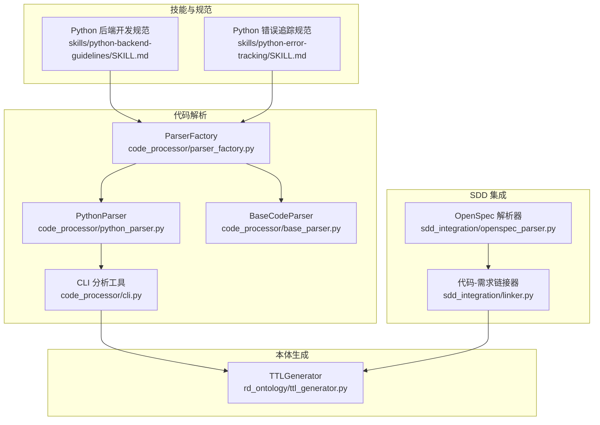
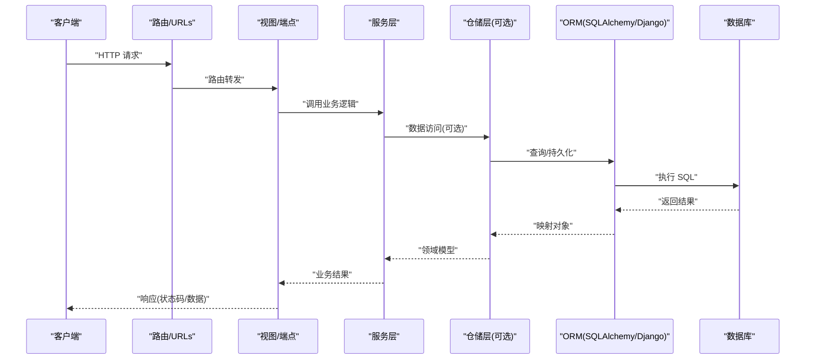
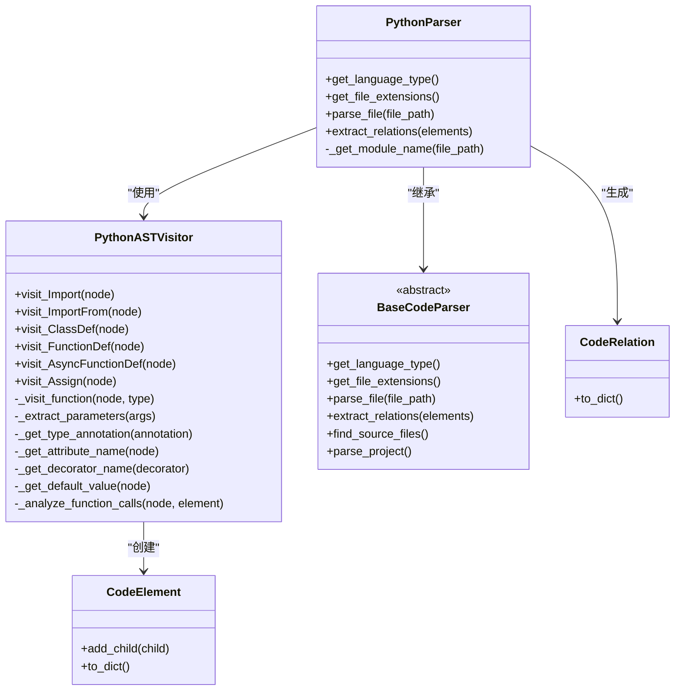
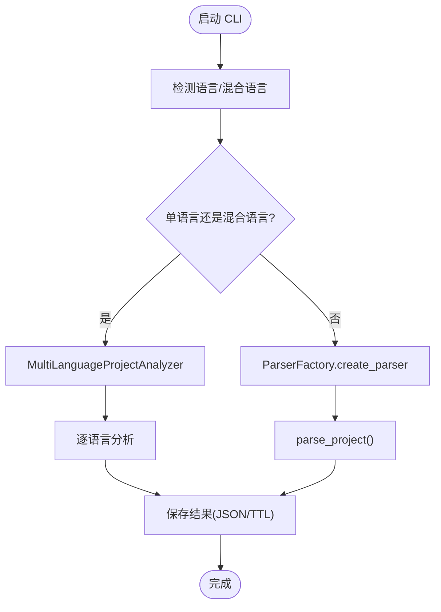
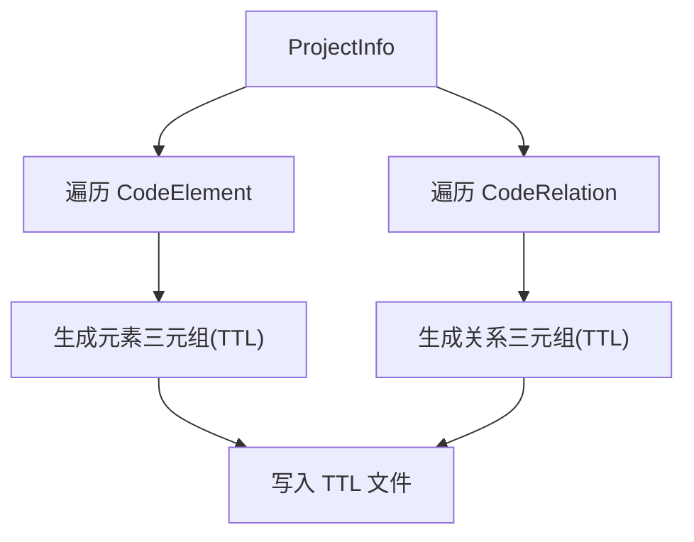
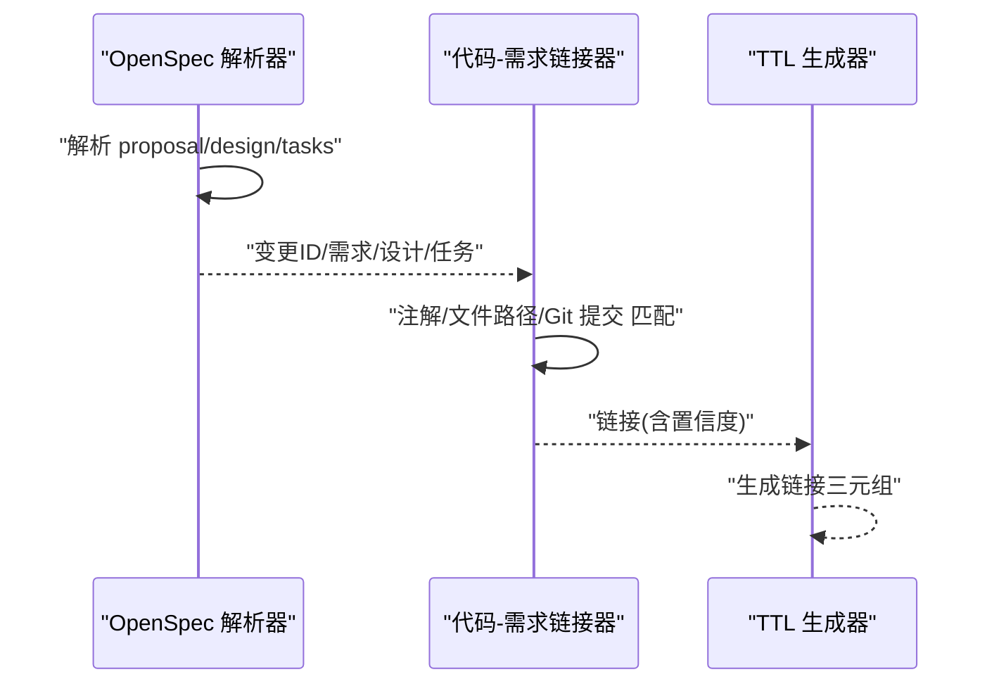
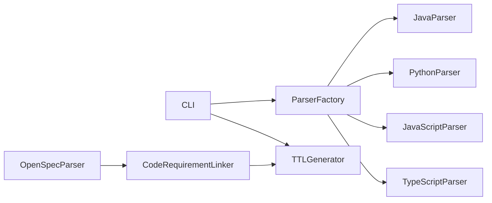

# Python 后端开发规范

<cite>
**本文引用的文件列表**
- [skills/python-backend-guidelines/SKILL.md](file://skills/python-backend-guidelines/SKILL.md)
- [skills/python-error-tracking/SKILL.md](file://skills/python-error-tracking/SKILL.md)
- [code_processor/python_parser.py](file://code_processor/python_parser.py)
- [code_processor/base_parser.py](file://code_processor/base_parser.py)
- [code_processor/parser_factory.py](file://code_processor/parser_factory.py)
- [code_processor/cli.py](file://code_processor/cli.py)
- [code_processor/requirements.txt](file://code_processor/requirements.txt)
- [rd_ontology/ttl_generator.py](file://rd_ontology/ttl_generator.py)
- [sdd_integration/openspec_parser.py](file://sdd_integration/openspec_parser.py)
- [sdd_integration/linker.py](file://sdd_integration/linker.py)
- [tests/test_code_processor.py](file://tests/test_code_processor.py)
- [README.md](file://README.md)
</cite>

## 目录
1. [简介](#简介)
2. [项目结构](#项目结构)
3. [核心组件](#核心组件)
4. [架构总览](#架构总览)
5. [详细组件分析](#详细组件分析)
6. [依赖关系分析](#依赖关系分析)
7. [性能考虑](#性能考虑)
8. [故障排查指南](#故障排查指南)
9. [结论](#结论)
10. [附录](#附录)

## 简介
本规范面向 Python 后端开发，覆盖基于 Django REST Framework 与 FastAPI 的最佳实践，包括分层架构、API 设计、数据库访问、异常处理、性能优化、测试与错误追踪等。同时结合代码解析与本体生成能力，支持在大型项目中建立可追溯、可审计的代码与需求链接体系，提升开发质量与效率。

## 项目结构
该仓库采用“技能模板 + 代码解析 + 本体生成 + SDD 集成”的组合方式：
- 技能模板：提供 Python 后端开发规范与错误追踪规范
- 代码解析：多语言代码解析器（Java/Python/JS/TS），支持 Python AST 解析
- 本体生成：将解析结果转换为 TTL（RDF Turtle）格式，构建研发本体实例
- SDD 集成：解析 OpenSpec 文档，建立代码与需求/设计/任务的链接

图表来源
- [skills/python-backend-guidelines/SKILL.md](file://skills/python-backend-guidelines/SKILL.md#L1-L596)
- [skills/python-error-tracking/SKILL.md](file://skills/python-error-tracking/SKILL.md#L1-L574)
- [code_processor/parser_factory.py](file://code_processor/parser_factory.py#L1-L248)
- [code_processor/python_parser.py](file://code_processor/python_parser.py#L1-L455)
- [code_processor/base_parser.py](file://code_processor/base_parser.py#L1-L358)
- [code_processor/cli.py](file://code_processor/cli.py#L1-L215)
- [rd_ontology/ttl_generator.py](file://rd_ontology/ttl_generator.py#L1-L321)
- [sdd_integration/openspec_parser.py](file://sdd_integration/openspec_parser.py#L1-L249)
- [sdd_integration/linker.py](file://sdd_integration/linker.py#L1-L324)

章节来源
- [README.md](file://README.md#L71-L92)
- [code_processor/__init__.py](file://code_processor/__init__.py#L1-L40)

## 核心组件
- 分层架构与目录结构：明确路由/视图、服务层、仓储层职责边界，支持 FastAPI 与 Django 两种工程形态
- 类型提示与数据校验：Pydantic（FastAPI）或序列化器（Django），确保输入输出一致性
- 异步与并发：优先使用异步 I/O；合理使用并发与上下文管理器
- 数据库访问：SQLAlchemy（异步）或 Django ORM；避免 N+1 查询，善用预加载
- 错误处理与 Sentry：统一捕获未预期异常，保留业务逻辑错误的 HTTP 行为
- 性能监控：Span/Transaction 标注关键路径，采样率按环境调整
- 测试策略：服务层隔离测试，端到端测试覆盖关键路径

章节来源
- [skills/python-backend-guidelines/SKILL.md](file://skills/python-backend-guidelines/SKILL.md#L40-L115)
- [skills/python-backend-guidelines/SKILL.md](file://skills/python-backend-guidelines/SKILL.md#L298-L596)
- [skills/python-error-tracking/SKILL.md](file://skills/python-error-tracking/SKILL.md#L1-L574)

## 架构总览
下图展示了从请求到数据库的典型调用链，体现分层职责与依赖方向。

图表来源
- [skills/python-backend-guidelines/SKILL.md](file://skills/python-backend-guidelines/SKILL.md#L40-L58)

## 详细组件分析

### 组件一：Python 代码解析器（AST）
- 功能：解析 Python 源码，提取类、函数、变量、导入、装饰器、方法调用等元素，并建立继承、修饰、调用、导入等关系
- 关键点：
  - 使用 AST 访问器遍历节点，识别类/方法/函数/赋值/导入等
  - 支持同步与异步函数区分、参数类型注解提取、默认值解析
  - 生成关系：继承、修饰、覆盖、调用、导入等
  - 输出：元素与关系列表，供后续 TTL 生成与链接分析

图表来源
- [code_processor/python_parser.py](file://code_processor/python_parser.py#L22-L455)
- [code_processor/base_parser.py](file://code_processor/base_parser.py#L206-L358)

章节来源
- [code_processor/python_parser.py](file://code_processor/python_parser.py#L1-L455)
- [code_processor/base_parser.py](file://code_processor/base_parser.py#L1-L358)

### 组件二：解析工厂与 CLI
- 解析工厂：根据项目特征自动检测语言类型，注册多语言解析器，支持混合项目分析
- CLI：提供 analyze/ttl/info 三个命令，支持单语言/混合语言分析、JSON/TTL 输出、统计概览

图表来源
- [code_processor/parser_factory.py](file://code_processor/parser_factory.py#L41-L160)
- [code_processor/cli.py](file://code_processor/cli.py#L32-L164)

章节来源
- [code_processor/parser_factory.py](file://code_processor/parser_factory.py#L1-L248)
- [code_processor/cli.py](file://code_processor/cli.py#L1-L215)

### 组件三：TTL 生成器（RDF 本体）
- 将解析出的元素与关系映射为 RDF/Turtle 三元组，生成研发本体实例
- 支持稳定 ID 生成、IRI 规范化、属性转义、前缀声明与注释头

图表来源
- [rd_ontology/ttl_generator.py](file://rd_ontology/ttl_generator.py#L176-L228)

章节来源
- [rd_ontology/ttl_generator.py](file://rd_ontology/ttl_generator.py#L1-L321)

### 组件四：OpenSpec 解析与链接
- OpenSpec 解析：从 proposal.md/design.md/tasks.md 中抽取需求、设计决策、任务清单
- 链接器：基于注解、文件路径、Git 提交信息等多源匹配，建立代码与需求/设计/任务的链接，并生成 TTL

图表来源
- [sdd_integration/openspec_parser.py](file://sdd_integration/openspec_parser.py#L51-L249)
- [sdd_integration/linker.py](file://sdd_integration/linker.py#L35-L241)
- [rd_ontology/ttl_generator.py](file://rd_ontology/ttl_generator.py#L313-L321)

章节来源
- [sdd_integration/openspec_parser.py](file://sdd_integration/openspec_parser.py#L1-L249)
- [sdd_integration/linker.py](file://sdd_integration/linker.py#L1-L324)

### 组件五：错误追踪与性能监控（Sentry）
- 初始化：在应用入口尽早初始化，选择对应框架集成
- 捕获策略：仅捕获未预期异常；业务逻辑错误仍抛出合适 HTTP 状态
- 上下文：设置用户、标签、面包屑、自定义上下文
- 性能：Span/Transaction 标注关键路径，按环境调整采样率
- 背景任务：Celery/异步任务中同样遵循上述原则

章节来源
- [skills/python-error-tracking/SKILL.md](file://skills/python-error-tracking/SKILL.md#L1-L574)

## 依赖关系分析
- 多语言解析器注册：ParserFactory 统一注册 Java/Python/JS/TS 解析器
- CLI 依赖解析器与 TTL 生成器：支持 JSON/TTL 输出
- OpenSpec 与链接器：与 TTL 生成器协同，输出链接三元组
- 测试：对解析器进行单元测试，覆盖类/函数/导入解析与工厂语言检测

图表来源
- [code_processor/parser_factory.py](file://code_processor/parser_factory.py#L243-L248)
- [code_processor/cli.py](file://code_processor/cli.py#L16-L21)
- [rd_ontology/ttl_generator.py](file://rd_ontology/ttl_generator.py#L1-L321)
- [sdd_integration/openspec_parser.py](file://sdd_integration/openspec_parser.py#L1-L249)
- [sdd_integration/linker.py](file://sdd_integration/linker.py#L1-L324)

章节来源
- [code_processor/parser_factory.py](file://code_processor/parser_factory.py#L1-L248)
- [code_processor/cli.py](file://code_processor/cli.py#L1-L215)
- [tests/test_code_processor.py](file://tests/test_code_processor.py#L1-L139)

## 性能考虑
- 数据库查询优化
  - 避免 N+1 查询：使用预加载（如 selectinload）
  - 合理分页与过滤
- 异步 I/O 优先：FastAPI 中使用 async/await，减少阻塞
- 并发控制：使用 gather 并发执行独立任务，但避免滥用
- 缓存策略：对热点读取加缓存（如 Redis），注意失效策略
- 监控采样：生产环境降低 traces/profiles 采样率，平衡成本与可观测性

章节来源
- [skills/python-backend-guidelines/SKILL.md](file://skills/python-backend-guidelines/SKILL.md#L502-L534)
- [skills/python-error-tracking/SKILL.md](file://skills/python-error-tracking/SKILL.md#L203-L248)

## 故障排查指南
- 初始化顺序：Sentry 必须在应用入口最早初始化，避免遗漏捕获
- 业务错误与异常：业务逻辑错误应抛出 HTTP 异常而非捕获 Sentry；未预期异常才捕获
- 上下文缺失：捕获异常前务必设置用户、标签、面包屑等上下文
- 性能瓶颈定位：使用 Span/Transaction 标注关键路径，观察耗时分布
- 测试验证：编写单元测试验证异常捕获与上下文设置是否正确

章节来源
- [skills/python-error-tracking/SKILL.md](file://skills/python-error-tracking/SKILL.md#L21-L24)
- [skills/python-error-tracking/SKILL.md](file://skills/python-error-tracking/SKILL.md#L416-L464)

## 结论
本规范以“分层架构 + 类型安全 + 异步 I/O + Sentry 监控 + TTL 本体”为核心，结合 OpenSpec 需求与代码的链接能力，形成从设计到实现再到可审计的闭环。建议在新项目中严格遵循规范，持续改进测试与监控，逐步沉淀团队知识资产。

## 附录
- 术语说明
  - 分层架构：路由/视图 → 服务 → 仓储 → ORM → 数据库
  - Sentry：错误追踪与性能监控平台
  - TTL：RDF 的 Turtle 文本表示
  - OpenSpec：规范驱动开发（SDD）的工作流文档
- 相关文件索引
  - Python 后端开发规范：[skills/python-backend-guidelines/SKILL.md](file://skills/python-backend-guidelines/SKILL.md#L1-L596)
  - Python 错误追踪规范：[skills/python-error-tracking/SKILL.md](file://skills/python-error-tracking/SKILL.md#L1-L574)
  - 代码解析器：[code_processor/python_parser.py](file://code_processor/python_parser.py#L1-L455)
  - 基础解析接口：[code_processor/base_parser.py](file://code_processor/base_parser.py#L1-L358)
  - 解析工厂：[code_processor/parser_factory.py](file://code_processor/parser_factory.py#L1-L248)
  - CLI 工具：[code_processor/cli.py](file://code_processor/cli.py#L1-L215)
  - TTL 生成器：[rd_ontology/ttl_generator.py](file://rd_ontology/ttl_generator.py#L1-L321)
  - OpenSpec 解析：[sdd_integration/openspec_parser.py](file://sdd_integration/openspec_parser.py#L1-L249)
  - 链接器：[sdd_integration/linker.py](file://sdd_integration/linker.py#L1-L324)
  - 测试用例：[tests/test_code_processor.py](file://tests/test_code_processor.py#L1-L139)