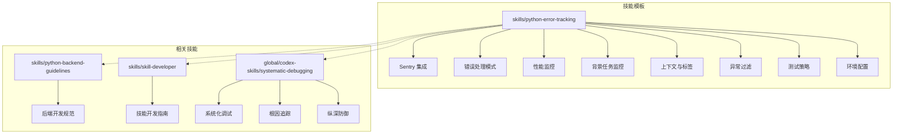
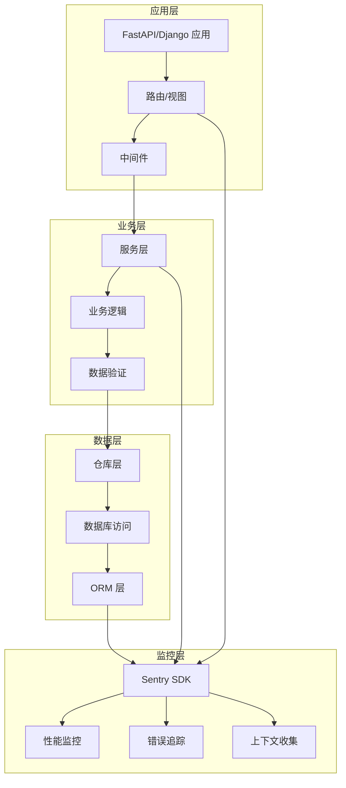
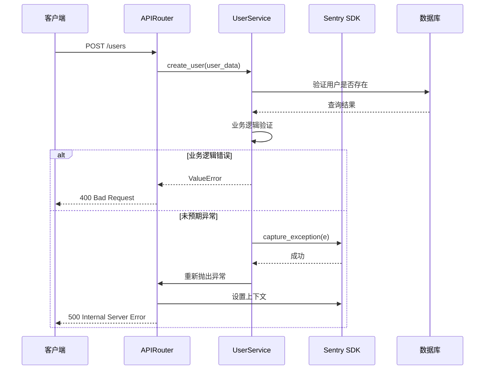
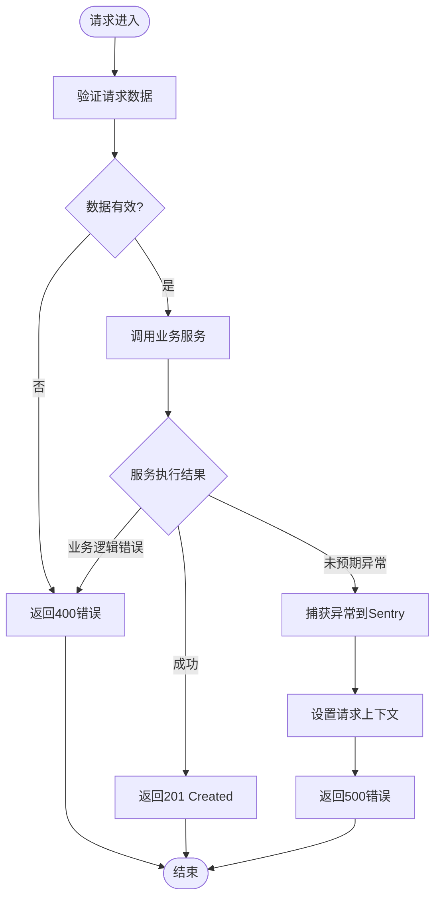
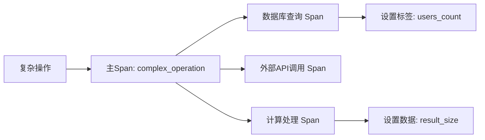
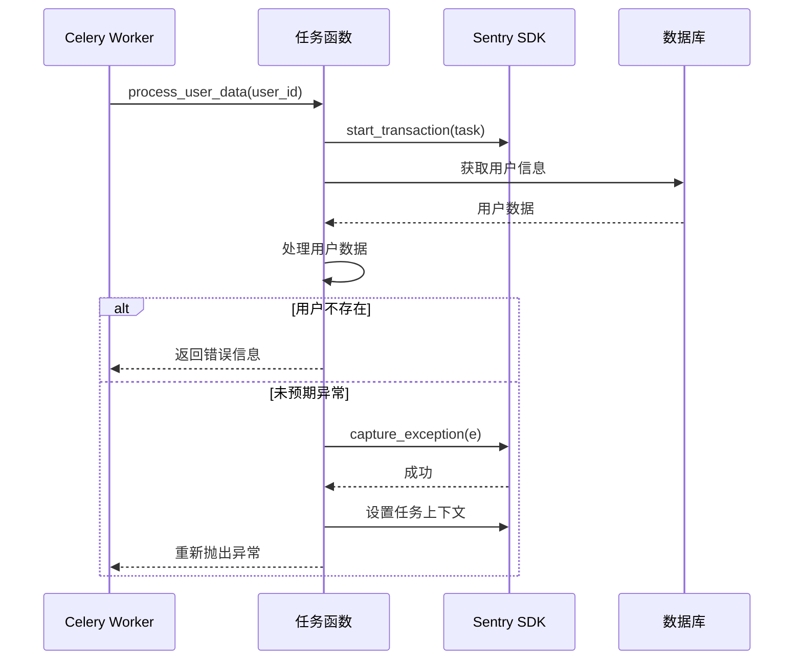
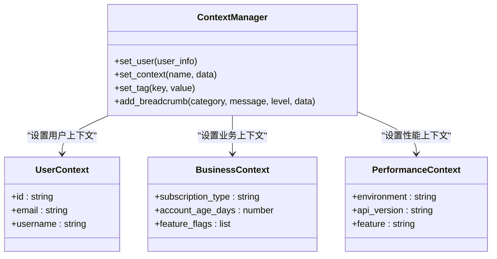
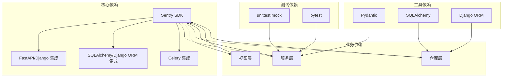
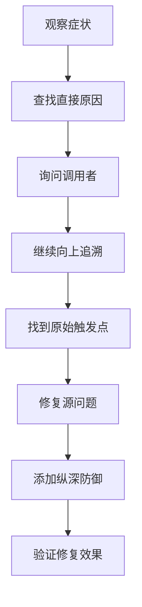

# Python 错误追踪规范

<cite>
**本文引用的文件**
- [README.md](file://README.md)
- [SKILL.md](file://skills/python-error-tracking/SKILL.md)
- [SKILL.md](file://skills/python-backend-guidelines/SKILL.md)
- [SKILL.md](file://skills/skill-developer/SKILL.md)
- [SKILL.md](file://global/codex-skills/systematic-debugging/SKILL.md)
- [root-cause-tracing.md](file://global/codex-skills/systematic-debugging/root-cause-tracing.md)
- [defense-in-depth.md](file://global/codex-skills/systematic-debugging/defense-in-depth.md)
- [testing-anti-patterns.md](file://global/codex-skills/test-driven-development/testing-anti-patterns.md)
</cite>

## 目录
1. [简介](#简介)
2. [项目结构](#项目结构)
3. [核心组件](#核心组件)
4. [架构概览](#架构概览)
5. [详细组件分析](#详细组件分析)
6. [依赖关系分析](#依赖关系分析)
7. [性能考虑](#性能考虑)
8. [故障排查指南](#故障排查指南)
9. [结论](#结论)
10. [附录](#附录)

## 简介
本规范旨在为 Python 应用程序建立完善的错误监控与追踪体系，涵盖异常捕获、日志记录、错误报告、性能监控等关键环节。规范强调以下核心原则：
- 所有未预期错误必须上报至 Sentry，不得使用 print() 或仅本地日志记录
- 在所有视图/端点中实现错误处理
- 为关键业务流程添加性能监控
- 通过上下文信息提升调试效率
- 建立系统化的调试与根因定位流程

本规范基于项目中的技能模板与调试指南，结合实际工程经验，形成可操作的最佳实践。

## 项目结构
该项目采用技能模板（Skill）组织方式，将不同领域的知识封装为可复用的技能模块。Python 错误追踪规范位于 skills/python-error-tracking 目录下，并与 Python 后端开发规范、系统化调试技能等协同工作。

**图表来源**
- [README.md](file://README.md#L71-L92)
- [SKILL.md](file://skills/python-error-tracking/SKILL.md#L1-L574)

**章节来源**
- [README.md](file://README.md#L71-L92)

## 核心组件
本规范的核心组件围绕 Sentry 集成展开，涵盖初始化配置、错误处理模式、性能监控、背景任务追踪、上下文设置、异常过滤、测试策略和环境配置等方面。

### Sentry 初始化与集成
- FastAPI 集成：在应用入口处优先导入 Sentry SDK，配置 FastAPIIntegration 和 SQLAlchemyIntegration
- Django 集成：在 settings.py 顶部初始化，配置 DjangoIntegration
- 采样率控制：根据环境调整 traces_sample_rate 和 profiles_sample_rate
- 环境变量：通过 .env 文件管理 DSN、环境名、采样率等配置

### 错误处理模式
- 视图层：区分业务逻辑错误（4xx）与未预期异常（5xx），前者不捕获至 Sentry
- 服务层：业务逻辑错误直接抛出，未预期异常捕获并重新抛出
- 上下文设置：在捕获异常前设置用户信息、请求数据、业务上下文等

### 性能监控
- 自定义 Span：对数据库查询、外部 API 调用、计算密集型操作进行标记
- 数据库监控：通过 SQLAlchemy/Django 集成自动跟踪查询性能
- 事务追踪：为长耗时操作创建事务，包含多个子 Span

### 背景任务监控
- Celery 任务：为异步任务添加事务和 Span，捕获未预期异常
- 异步任务：为后台通知、批处理等场景添加监控
- 重试机制：合理配置重试策略，避免无限循环

### 上下文与标签
- 用户上下文：设置用户标识、邮箱、用户名等
- 业务上下文：订阅类型、账户年龄、功能开关等
- 标签过滤：按环境、API 版本、特性等维度进行过滤

### 异常过滤
- 忽略特定异常：如 KeyboardInterrupt、BrokenPipeError
- before_send 过滤器：在事件发送前进行二次过滤
- 健康检查过滤：排除健康检查相关的错误

**章节来源**
- [SKILL.md](file://skills/python-error-tracking/SKILL.md#L27-L74)
- [SKILL.md](file://skills/python-error-tracking/SKILL.md#L78-L200)
- [SKILL.md](file://skills/python-error-tracking/SKILL.md#L203-L250)
- [SKILL.md](file://skills/python-error-tracking/SKILL.md#L252-L328)
- [SKILL.md](file://skills/python-error-tracking/SKILL.md#L331-L377)
- [SKILL.md](file://skills/python-error-tracking/SKILL.md#L380-L413)

## 架构概览
本规范采用分层架构，从应用入口到业务逻辑再到数据访问层，每个层次都有明确的职责划分和错误处理策略。

**图表来源**
- [SKILL.md](file://skills/python-backend-guidelines/SKILL.md#L40-L61)
- [SKILL.md](file://skills/python-error-tracking/SKILL.md#L21-L24)

## 详细组件分析

### 错误处理模式分析
本节详细分析三种主要的错误处理模式及其适用场景。

#### FastAPI 端点错误处理

**图表来源**
- [SKILL.md](file://skills/python-error-tracking/SKILL.md#L80-L112)

#### Django 视图错误处理

**图表来源**
- [SKILL.md](file://skills/python-error-tracking/SKILL.md#L113-L152)

#### 服务层错误处理
服务层作为业务逻辑的核心，承担着双重职责：
- 业务逻辑错误：直接抛出，不捕获至 Sentry
- 未预期异常：捕获并重新抛出，确保上层正确处理

**章节来源**
- [SKILL.md](file://skills/python-error-tracking/SKILL.md#L154-L199)

### 性能监控组件
性能监控是错误追踪的重要补充，通过细粒度的性能指标帮助识别系统瓶颈。

#### 自定义 Span 监控

**图表来源**
- [SKILL.md](file://skills/python-error-tracking/SKILL.md#L205-L228)

#### 数据库查询监控
- SQLAlchemy 集成：自动跟踪异步查询性能
- Django 集成：自动跟踪 ORM 查询
- 手动监控：针对复杂查询添加自定义 Span

**章节来源**
- [SKILL.md](file://skills/python-error-tracking/SKILL.md#L230-L248)

### 背景任务监控
背景任务是系统性能监控的重点对象，需要特别关注其执行状态和错误处理。

#### Celery 任务监控

**图表来源**
- [SKILL.md](file://skills/python-error-tracking/SKILL.md#L254-L297)

#### 异步后台任务监控
异步任务与 Celery 任务类似，但不需要重试机制，错误处理相对简单。

**章节来源**
- [SKILL.md](file://skills/python-error-tracking/SKILL.md#L299-L327)

### 上下文与标签管理
上下文信息是错误追踪的关键要素，能够显著提升问题定位效率。

#### 上下文设置模式

**图表来源**
- [SKILL.md](file://skills/python-error-tracking/SKILL.md#L331-L377)

**章节来源**
- [SKILL.md](file://skills/python-error-tracking/SKILL.md#L331-L377)

### 异常过滤机制
异常过滤帮助减少噪声，专注于真正需要关注的问题。

#### 过滤策略
- 忽略列表：排除键盘中断、管道破裂等预期异常
- before_send 过滤器：在事件发送前进行二次过滤
- 健康检查过滤：排除健康检查相关的错误

**章节来源**
- [SKILL.md](file://skills/python-error-tracking/SKILL.md#L380-L413)

## 依赖关系分析
本规范涉及多个组件间的依赖关系，需要合理设计以避免循环依赖和过度耦合。

**图表来源**
- [SKILL.md](file://skills/python-error-tracking/SKILL.md#L27-L74)
- [SKILL.md](file://skills/python-backend-guidelines/SKILL.md#L186-L242)

**章节来源**
- [SKILL.md](file://skills/python-error-tracking/SKILL.md#L27-L74)
- [SKILL.md](file://skills/python-backend-guidelines/SKILL.md#L186-L242)

## 性能考虑
错误追踪系统的性能影响主要体现在以下几个方面：

### 采样率优化
- 开发环境：100% 采样率，便于发现潜在问题
- 生产环境：降低采样率（如 10%），平衡性能与监控覆盖
- 动态采样：根据环境自动调整采样率

### 上下文收集成本
- 上下文大小限制：避免传递过大的数据结构
- 条件性上下文：仅在必要时设置上下文
- 异步上下文：避免阻塞主线程

### 监控开销
- Span 数量控制：避免过度细分导致性能下降
- 批量上报：减少网络请求频率
- 缓存策略：合理缓存频繁使用的上下文信息

## 故障排查指南
系统化调试是解决复杂问题的有效方法，结合本规范提供的调试技能可以快速定位问题根源。

### 根因追踪流程

**图表来源**
- [root-cause-tracing.md](file://global/codex-skills/systematic-debugging/root-cause-tracing.md#L32-L51)

### 纵深防御策略
- 入口验证：拒绝明显无效输入
- 业务逻辑验证：确保数据在业务层面有意义
- 环境保护：防止危险操作在特定环境下执行
- 调试仪器：捕获上下文信息用于取证

### 常见测试反模式避免
- 测试专用方法出现在生产代码中
- 过度模拟导致测试逻辑被破坏
- 不完整的模拟对象
- 将集成测试当作事后补救

**章节来源**
- [SKILL.md](file://global/codex-skills/systematic-debugging/SKILL.md#L50-L120)
- [defense-in-depth.md](file://global/codex-skills/systematic-debugging/defense-in-depth.md#L1-L123)
- [testing-anti-patterns.md](file://global/codex-skills/test-driven-development/testing-anti-patterns.md#L63-L249)

## 结论
Python 错误追踪规范通过系统化的架构设计、严格的错误处理模式、全面的性能监控和完善的调试流程，为构建稳定可靠的 Python 应用提供了坚实基础。关键要点包括：

1. **强制性错误上报**：所有未预期错误必须上报至 Sentry，确保问题可追踪
2. **分层错误处理**：视图层、服务层、仓库层各司其职，错误处理策略清晰
3. **性能监控集成**：通过 Span 和事务追踪识别系统瓶颈
4. **上下文完整性**：丰富的上下文信息显著提升调试效率
5. **系统化调试**：根因追踪和纵深防御确保问题得到彻底解决
6. **测试保障**：完善的测试策略确保监控系统本身的质量

通过遵循本规范，开发团队可以建立一套高效、可靠、可维护的错误监控体系，为应用程序的稳定性提供有力保障。

## 附录

### 最佳实践清单
- ✅ 所有未预期异常必须捕获并上报
- ✅ 在捕获异常前设置完整上下文
- ✅ 区分业务逻辑错误与未预期异常
- ✅ 为关键业务流程添加性能监控
- ✅ 合理配置采样率，平衡性能与监控覆盖
- ✅ 建立系统化的调试流程
- ✅ 定期审查和优化监控策略

### 环境配置建议
- 开发环境：100% 采样率，详细上下文
- 测试环境：高采样率，简化上下文
- 生产环境：降低采样率，精简上下文
- 预发布环境：接近生产配置

### 监控指标建议
- 错误率：总错误数/请求总数
- 性均响应时间：关键操作的平均耗时
- 性能分布：P50/P95/P99 响应时间
- 上下文覆盖率：包含关键上下文的错误比例
- 采样率：实际采样与配置采样的对比