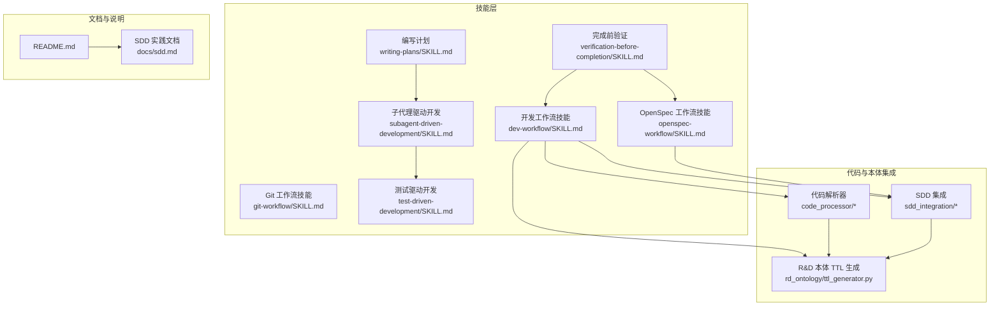
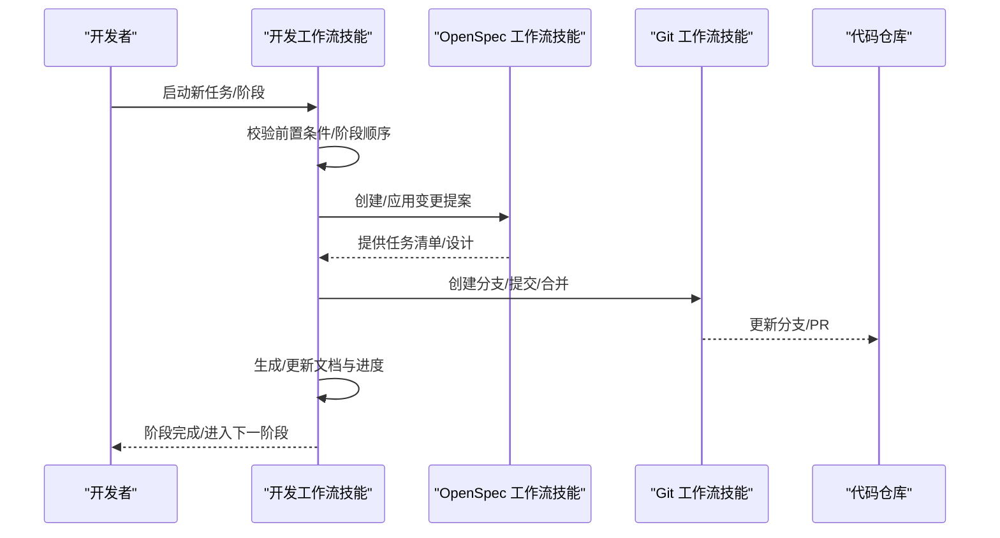
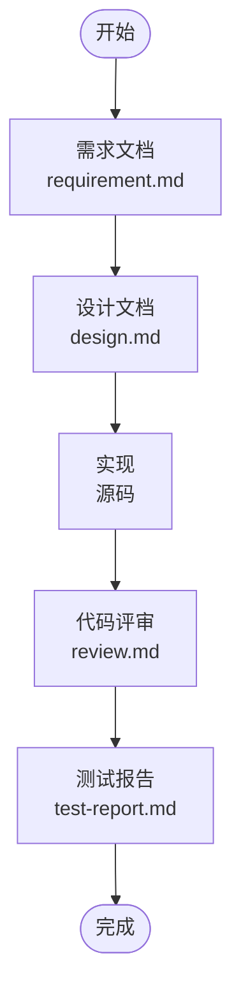
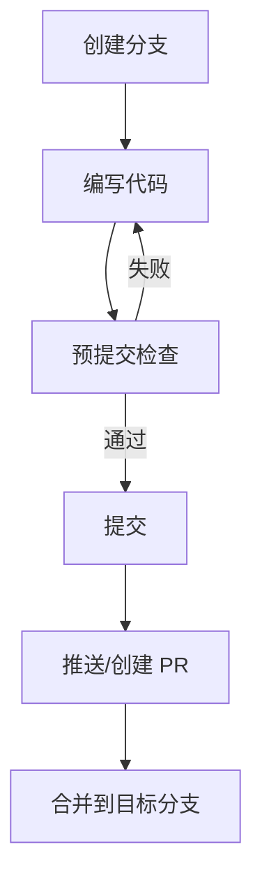
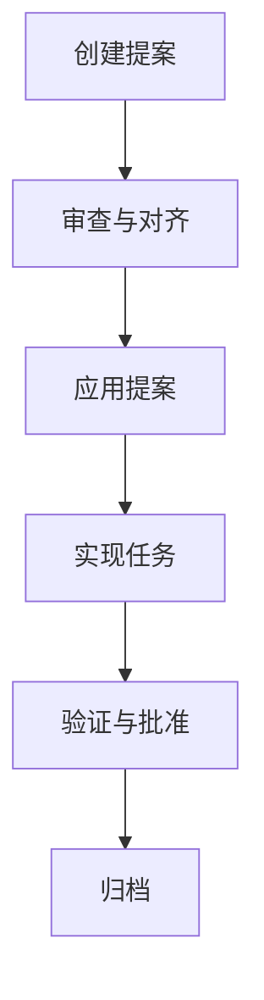
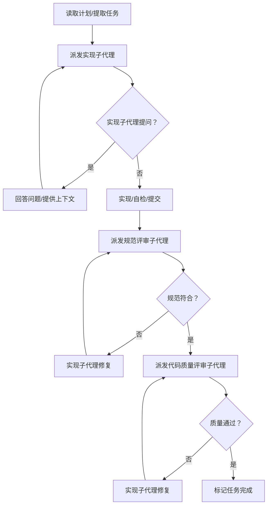
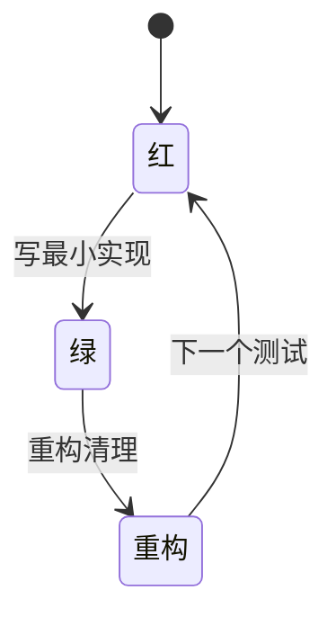
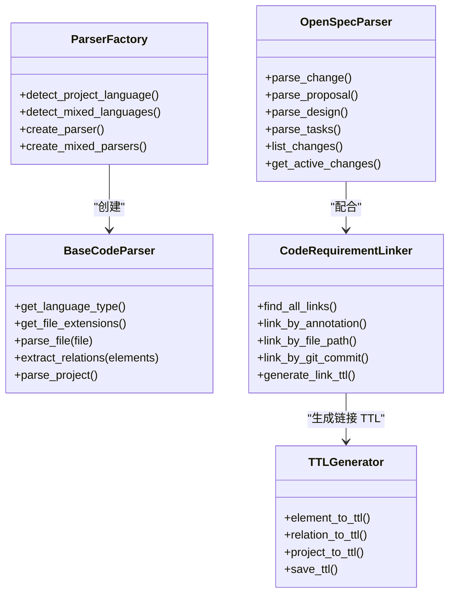
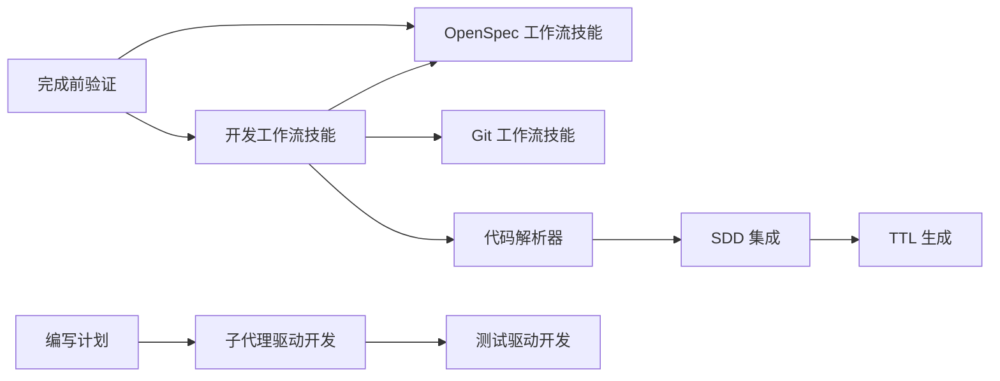

# 开发工作流技能

<cite>
**本文引用的文件**
- [skills/dev-workflow/SKILL.md](file://skills/dev-workflow/SKILL.md)
- [README.md](file://README.md)
- [docs/sdd.md](file://docs/sdd.md)
- [global/codex-skills/subagent-driven-development/SKILL.md](file://global/codex-skills/subagent-driven-development/SKILL.md)
- [global/codex-skills/writing-plans/SKILL.md](file://global/codex-skills/writing-plans/SKILL.md)
- [global/codex-skills/test-driven-development/SKILL.md](file://global/codex-skills/test-driven-development/SKILL.md)
- [global/codex-skills/verification-before-completion/SKILL.md](file://global/codex-skills/verification-before-completion/SKILL.md)
- [skills/git-workflow/SKILL.md](file://skills/git-workflow/SKILL.md)
- [skills/openspec-workflow/SKILL.md](file://skills/openspec-workflow/SKILL.md)
- [code_processor/base_parser.py](file://code_processor/base_parser.py)
- [code_processor/parser_factory.py](file://code_processor/parser_factory.py)
- [sdd_integration/linker.py](file://sdd_integration/linker.py)
- [sdd_integration/openspec_parser.py](file://sdd_integration/openspec_parser.py)
- [rd_ontology/ttl_generator.py](file://rd_ontology/ttl_generator.py)
</cite>

## 目录
1. [简介](#简介)
2. [项目结构](#项目结构)
3. [核心组件](#核心组件)
4. [架构总览](#架构总览)
5. [详细组件分析](#详细组件分析)
6. [依赖分析](#依赖分析)
7. [性能考量](#性能考量)
8. [故障排查指南](#故障排查指南)
9. [结论](#结论)
10. [附录](#附录)

## 简介
本技能面向规范驱动开发（SDD）的全流程管理，围绕需求分析、设计规划、编码实现、测试验证与进度跟踪五大阶段，提供严格的阶段顺序、文档模板、目录约定与质量门禁。技能同时与多 AI 协同（Claude Code、Codex、Gemini）和 OpenSpec 工作流深度融合，确保“先规范、后实现、可追溯、可审计”的交付闭环。

## 项目结构
该仓库提供了完整的 SDD 工作流基础设施与配套技能，核心结构如下：
- 技能层：dev-workflow、git-workflow、openspec-workflow、子技能（如 subagent-driven-development、writing-plans、test-driven-development、verification-before-completion）
- 代码解析与本体集成：code_processor（多语言解析）、sdd_integration（OpenSpec 解析与链接）、rd_ontology（TTL 生成）
- 文档与说明：README、docs/sdd.md

图表来源
- [skills/dev-workflow/SKILL.md](file://skills/dev-workflow/SKILL.md#L1-L397)
- [skills/git-workflow/SKILL.md](file://skills/git-workflow/SKILL.md#L1-L440)
- [skills/openspec-workflow/SKILL.md](file://skills/openspec-workflow/SKILL.md#L1-L231)
- [global/codex-skills/subagent-driven-development/SKILL.md](file://global/codex-skills/subagent-driven-development/SKILL.md#L1-L241)
- [global/codex-skills/writing-plans/SKILL.md](file://global/codex-skills/writing-plans/SKILL.md#L1-L117)
- [global/codex-skills/test-driven-development/SKILL.md](file://global/codex-skills/test-driven-development/SKILL.md#L1-L372)
- [global/codex-skills/verification-before-completion/SKILL.md](file://global/codex-skills/verification-before-completion/SKILL.md#L1-L140)
- [code_processor/base_parser.py](file://code_processor/base_parser.py#L1-L358)
- [sdd_integration/openspec_parser.py](file://sdd_integration/openspec_parser.py#L1-L249)
- [rd_ontology/ttl_generator.py](file://rd_ontology/ttl_generator.py#L1-L321)

章节来源
- [README.md](file://README.md#L1-L229)
- [docs/sdd.md](file://docs/sdd.md#L1-L816)

## 核心组件
- 开发工作流技能：定义严格阶段顺序（需求→设计→实现→评审→测试→完成）、文档模板与目录约定、阶段前置条件与过渡校验、进度跟踪与最佳实践。
- Git 工作流技能：分支命名规范、提交信息标准、预提交检查、合并与冲突处理。
- OpenSpec 工作流技能：变更提案创建、任务清单实现、归档与验证。
- 子技能生态：子代理驱动开发、编写计划、测试驱动开发、完成前验证，支撑高质量迭代与门禁。
- 代码解析与本体集成：多语言代码解析、项目关系抽取、OpenSpec 文档解析、代码-需求链接、TTL 本体生成。

章节来源
- [skills/dev-workflow/SKILL.md](file://skills/dev-workflow/SKILL.md#L28-L397)
- [skills/git-workflow/SKILL.md](file://skills/git-workflow/SKILL.md#L1-L440)
- [skills/openspec-workflow/SKILL.md](file://skills/openspec-workflow/SKILL.md#L1-L231)
- [global/codex-skills/subagent-driven-development/SKILL.md](file://global/codex-skills/subagent-driven-development/SKILL.md#L1-L241)
- [global/codex-skills/writing-plans/SKILL.md](file://global/codex-skills/writing-plans/SKILL.md#L1-L117)
- [global/codex-skills/test-driven-development/SKILL.md](file://global/codex-skills/test-driven-development/SKILL.md#L1-L372)
- [global/codex-skills/verification-before-completion/SKILL.md](file://global/codex-skills/verification-before-completion/SKILL.md#L1-L140)

## 架构总览
开发工作流技能贯穿 SDD 的五个阶段，结合 Git 与 OpenSpec，形成“规范先行、阶段受控、质量门禁、可追溯”的闭环。

图表来源
- [skills/dev-workflow/SKILL.md](file://skills/dev-workflow/SKILL.md#L306-L331)
- [skills/openspec-workflow/SKILL.md](file://skills/openspec-workflow/SKILL.md#L138-L187)
- [skills/git-workflow/SKILL.md](file://skills/git-workflow/SKILL.md#L196-L254)

## 详细组件分析

### 开发工作流技能（dev-workflow）
- 阶段顺序与前置条件：需求→设计→实现→评审→测试→完成，每个阶段必须满足前置文档与产出物。
- 目录结构：任务文档统一存放于 .devos/tasks/{task-id}/，包含 requirement.md、design.md、review.md、test-report.md、progress.md。
- 文档模板：需求、设计、评审报告、测试报告均有标准模板，确保可比对与审计。
- 进度跟踪：以时间戳+阶段+状态的方式记录进展，便于回溯与汇报。
- 质量门禁：阶段过渡前进行严格校验，禁止跳步与缺失前置。

图表来源
- [skills/dev-workflow/SKILL.md](file://skills/dev-workflow/SKILL.md#L30-L49)

章节来源
- [skills/dev-workflow/SKILL.md](file://skills/dev-workflow/SKILL.md#L28-L397)

### Git 工作流技能（git-workflow）
- 分支命名：feature/bugfix/hotfix/release 类型，统一以 {task-id} 前缀。
- 提交信息：采用约定式提交，包含 type(scope): subject，必要时补充 body/footer。
- 预提交检查：冲突标记检查、语法检查、测试通过、分支命名校验。
- 合并与冲突处理：rebase/merge 策略、PR 创建与合并、热修复分支合并策略。

图表来源
- [skills/git-workflow/SKILL.md](file://skills/git-workflow/SKILL.md#L196-L254)

章节来源
- [skills/git-workflow/SKILL.md](file://skills/git-workflow/SKILL.md#L1-L440)

### OpenSpec 工作流技能（openspec-workflow）
- 变更提案：proposal.md（变更理由、内容、影响范围）、tasks.md（任务清单）、design.md（技术决策，可选）。
- 实现流程：阅读提案→审阅设计→按序实现任务→标记完成→对照规范验证。
- 归档：部署后归档已完成变更，移动到 archive 目录。

图表来源
- [skills/openspec-workflow/SKILL.md](file://skills/openspec-workflow/SKILL.md#L138-L187)

章节来源
- [skills/openspec-workflow/SKILL.md](file://skills/openspec-workflow/SKILL.md#L1-L231)

### 子技能：子代理驱动开发（subagent-driven-development）
- 每任务一次子代理，两阶段评审：规范符合性评审→代码质量评审。
- 优势：同一会话内连续推进、自动评审检查点、并行安全、问题早发现早修复。
- 红灯：禁止跳过评审、禁止在问题未关闭时进入下一任务。

图表来源
- [global/codex-skills/subagent-driven-development/SKILL.md](file://global/codex-skills/subagent-driven-development/SKILL.md#L38-L82)

章节来源
- [global/codex-skills/subagent-driven-development/SKILL.md](file://global/codex-skills/subagent-driven-development/SKILL.md#L1-L241)

### 子技能：编写计划（writing-plans）
- 将多步任务拆分为“可执行”的小任务，每步仅约 2-5 分钟。
- 模板：目标、架构、技术栈、任务步骤（写测试→运行验证→最小实现→运行验证→提交）。
- 执行交接：保存计划后提供两种执行路径选择（子代理驱动或并行会话）。

章节来源
- [global/codex-skills/writing-plans/SKILL.md](file://global/codex-skills/writing-plans/SKILL.md#L1-L117)

### 子技能：测试驱动开发（test-driven-development）
- 红-绿-重构循环：先写失败测试→最小实现通过→重构清理。
- 红灯：禁止在没有失败测试前提下写实现、禁止跳过验证、禁止“稍后补测”。

图表来源
- [global/codex-skills/test-driven-development/SKILL.md](file://global/codex-skills/test-driven-development/SKILL.md#L47-L69)

章节来源
- [global/codex-skills/test-driven-development/SKILL.md](file://global/codex-skills/test-driven-development/SKILL.md#L1-L372)

### 子技能：完成前验证（verification-before-completion）
- 铁律：任何“完成/通过/修复”声明前，必须运行完整验证命令并以输出为准。
- 常见失败：仅凭“应该/大概”断言、信任代理报告、部分验证、主观判断。
- 模式：测试→构建→回归→需求核对→代理委托后的独立核查。

章节来源
- [global/codex-skills/verification-before-completion/SKILL.md](file://global/codex-skills/verification-before-completion/SKILL.md#L1-L140)

### 代码解析与本体集成
- 多语言解析：抽象基类定义元素类型、关系类型、项目信息结构；工厂类自动检测语言并创建解析器；支持混合语言项目。
- OpenSpec 解析：从 proposal/design/tasks 中抽取结构化数据，支持变更列表与活动变更查询。
- 代码-需求链接：基于注解、文件路径、Git 提交与命名约定生成链接，去重并生成 TTL 三元组。
- TTL 生成：将代码元素/关系与 OpenSpec 要求/设计/任务映射为 TTL，支持稳定 ID 与属性转义。

图表来源
- [code_processor/base_parser.py](file://code_processor/base_parser.py#L206-L358)
- [code_processor/parser_factory.py](file://code_processor/parser_factory.py#L20-L248)
- [sdd_integration/openspec_parser.py](file://sdd_integration/openspec_parser.py#L51-L249)
- [sdd_integration/linker.py](file://sdd_integration/linker.py#L35-L324)
- [rd_ontology/ttl_generator.py](file://rd_ontology/ttl_generator.py#L18-L321)

章节来源
- [code_processor/base_parser.py](file://code_processor/base_parser.py#L1-L358)
- [code_processor/parser_factory.py](file://code_processor/parser_factory.py#L1-L248)
- [sdd_integration/openspec_parser.py](file://sdd_integration/openspec_parser.py#L1-L249)
- [sdd_integration/linker.py](file://sdd_integration/linker.py#L1-L324)
- [rd_ontology/ttl_generator.py](file://rd_ontology/ttl_generator.py#L1-L321)

## 依赖分析
- 技能耦合：dev-workflow 依赖 openspec-workflow 与 git-workflow 的文档与分支管理；子技能（writing-plans、subagent-driven-development、test-driven-development、verification-before-completion）共同构成高质量执行链。
- 代码与本体：code_processor 提供多语言解析能力，sdd_integration 将 OpenSpec 文档结构化，linker 与 ttl_generator 将代码与需求/任务映射为本体三元组，支撑可追溯性与审计。

图表来源
- [skills/dev-workflow/SKILL.md](file://skills/dev-workflow/SKILL.md#L387-L391)
- [skills/git-workflow/SKILL.md](file://skills/git-workflow/SKILL.md#L428-L435)
- [rd_ontology/ttl_generator.py](file://rd_ontology/ttl_generator.py#L231-L321)

章节来源
- [skills/dev-workflow/SKILL.md](file://skills/dev-workflow/SKILL.md#L387-L397)
- [rd_ontology/ttl_generator.py](file://rd_ontology/ttl_generator.py#L1-L321)

## 性能考量
- 代码解析：扫描与解析大量源文件时，建议排除无关目录（如 .git、node_modules、__pycache__ 等），并针对混合语言项目分别解析以降低复杂度。
- 关系抽取：在大型项目中，关系数量可能呈平方级增长，建议分语言/模块增量分析与缓存统计结果。
- TTL 生成：字符串转义与长文档截断可减少输出体积；稳定 ID 生成避免频繁变更导致的重复写入。
- OpenSpec 解析：正则匹配与文件路径提取需注意性能，建议对大文本分段处理并缓存结果。

## 故障排查指南
- 阶段跳步：若提示“缺少前置文档”，请先补齐 requirement.md 或 design.md，再进行阶段过渡。
- 文档位置错误：确保文档位于 .devos/tasks/{task-id}/ 下，否则无法被工作流识别。
- 评审未通过：根据 review.md 中的问题清单逐项修复并重新评审。
- 测试失败：依据 test-report.md 的失败用例定位问题，遵循 TDD 循环逐步修复。
- Git 冲突：使用内置步骤解决冲突，必要时 abort 合并/变基并重新同步。
- OpenSpec 验证失败：检查 proposal.md 的“变更内容/场景/影响范围”是否满足规范，修正后重新验证。

章节来源
- [skills/dev-workflow/SKILL.md](file://skills/dev-workflow/SKILL.md#L306-L331)
- [skills/git-workflow/SKILL.md](file://skills/git-workflow/SKILL.md#L258-L303)
- [skills/openspec-workflow/SKILL.md](file://skills/openspec-workflow/SKILL.md#L160-L187)
- [global/codex-skills/test-driven-development/SKILL.md](file://global/codex-skills/test-driven-development/SKILL.md#L327-L341)

## 结论
开发工作流技能以严格的阶段顺序与文档模板为基础，结合 Git 与 OpenSpec 的规范化流程，辅以子技能的质量门禁，形成从需求到实现再到验证与归档的完整闭环。通过代码解析与本体集成，进一步强化可追溯性与审计能力，显著提升交付质量与效率。

## 附录
- 使用场景示例
  - 新功能实现：先用 writing-plans 生成可执行计划，再用 subagent-driven-development 逐任务实现与评审，最后用 verification-before-completion 确认完成。
  - 规范驱动变更：使用 openspec-workflow 创建提案，明确变更范围与任务清单，再按阶段推进实现与归档。
  - 代码质量保障：在实现前先写失败测试（TDD），在合并与完成前执行完整验证（Verification Before Completion）。
- 操作要点
  - 严格遵循阶段顺序，不得跳步。
  - 文档模板与目录约定必须一致。
  - 预提交检查与测试必须通过。
  - 评审反馈必须闭环处理。