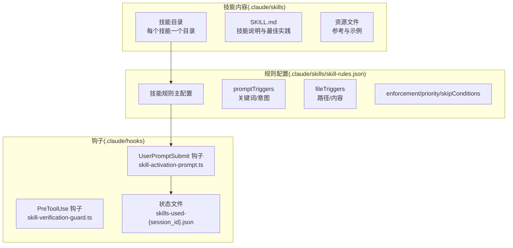
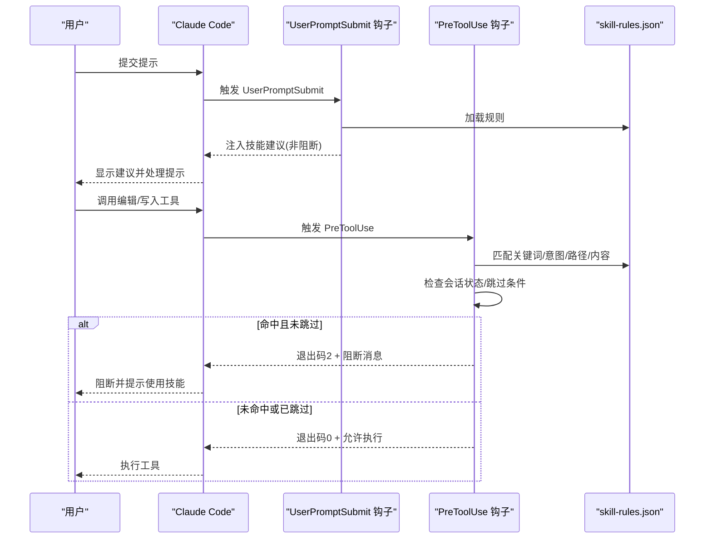
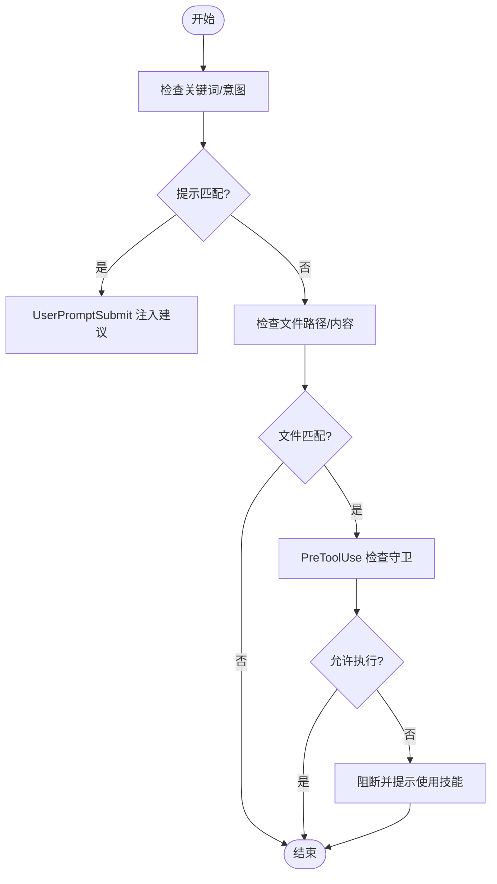
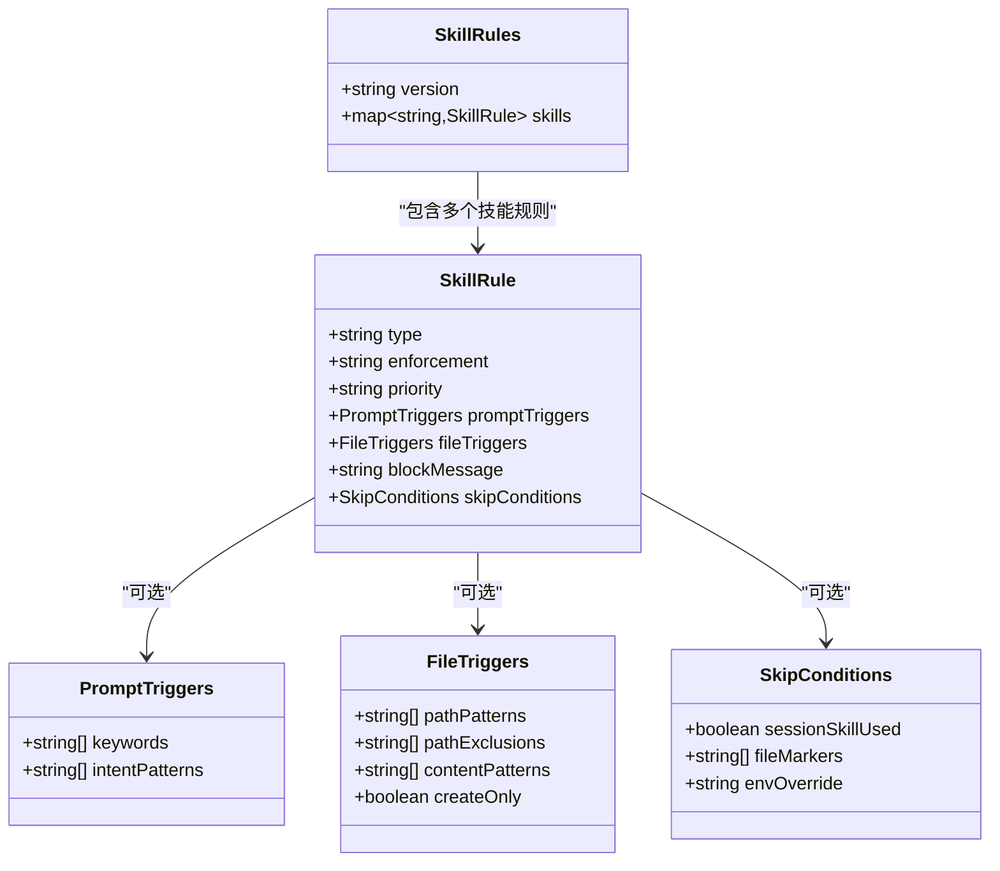
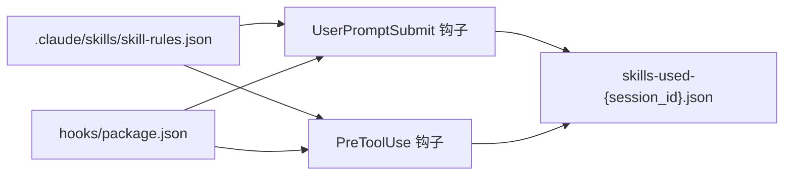

# 技能开发者指南

<cite>
**本文引用的文件**
- [技能开发者指南 SKILL.md](file://skills/skill-developer/SKILL.md)
- [技能规则参考 SKILL_RULES_REFERENCE.md](file://skills/skill-developer/SKILL_RULES_REFERENCE.md)
- [触发类型 TRIGGER_TYPES.md](file://skills/skill-developer/TRIGGER_TYPES.md)
- [钩子机制 HOOK_MECHANISMS.md](file://skills/skill-developer/HOOK_MECHANISMES.md)
- [模式库 PATTERNS_LIBRARY.md](file://skills/skill-developer/PATTERNS_LIBRARY.md)
- [故障排查 TROUBLESHOOTING.md](file://skills/skill-developer/TROUBLESHOOTING.md)
- [高级主题 ADVANCED.md](file://skills/skill-developer/ADVANCED.md)
- [技能总览 README.md](file://skills/README.md)
- [技能规则 skill-rules.json](file://skills/skill-rules.json)
- [包管理 package.json](file://hooks/package.json)
- [开发工作流 SKILL.md](file://skills/dev-workflow/SKILL.md)
- [Git 工作流 SKILL.md](file://skills/git-workflow/SKILL.md)
- [Python 后端指南 SKILL.md](file://skills/python-backend-guidelines/SKILL.md)
</cite>

## 目录
1. [简介](#简介)
2. [项目结构](#项目结构)
3. [核心组件](#核心组件)
4. [架构总览](#架构总览)
5. [详细组件分析](#详细组件分析)
6. [依赖关系分析](#依赖关系分析)
7. [性能考量](#性能考量)
8. [故障排查指南](#故障排查指南)
9. [结论](#结论)
10. [附录](#附录)

## 简介
本指南面向技能开发者，系统讲解 Claude Code 技能系统的架构与开发原理，涵盖技能模板结构、YAML 前言元数据格式、资源文件组织方式；详解触发机制（关键词触发、意图模式匹配、文件路径模式、内容模式匹配）；解释钩子机制（UserPromptSubmit、PreToolUse）的工作流程与扩展点；提供从创建技能目录到配置 skill-rules.json 的完整开发步骤；并给出高级技巧、调试方法与故障排除清单，帮助你快速创建可复用、可维护的技能并集成到现有系统。

## 项目结构
技能系统由“技能内容”“规则配置”“钩子脚本”三部分组成，采用模块化与可组合的设计，便于按领域扩展与按需激活。

图表来源
- [技能开发者指南 SKILL.md](file://skills/skill-developer/SKILL.md#L1-L427)
- [技能规则 skill-rules.json](file://skills/skill-rules.json#L1-L250)
- [钩子机制 HOOK_MECHANISMS.md](file://skills/skill-developer/HOOK_MECHANISMS.md#L1-L307)

章节来源
- [技能开发者指南 SKILL.md](file://skills/skill-developer/SKILL.md#L1-L427)
- [技能总览 README.md](file://skills/README.md#L1-L369)

## 核心组件
- 技能内容：以 SKILL.md 为核心，配合资源文件，遵循“500 行规则 + 渐进披露”的结构化知识组织。
- 触发规则：在 skill-rules.json 中定义关键词、意图、文件路径与内容模式，支持优先级与强制级别。
- 钩子机制：UserPromptSubmit 在用户提交提示前注入建议；PreToolUse 在工具调用前进行阻断式校验。
- 跳过条件：会话跟踪、文件标记、环境变量，用于避免过度打扰与紧急禁用。

章节来源
- [技能开发者指南 SKILL.md](file://skills/skill-developer/SKILL.md#L1-L427)
- [技能规则参考 SKILL_RULES_REFERENCE.md](file://skills/skill-developer/SKILL_RULES_REFERENCE.md#L1-L316)
- [钩子机制 HOOK_MECHANISMS.md](file://skills/skill-developer/HOOK_MECHANISMS.md#L1-L307)

## 架构总览
技能系统通过两条钩子链路实现“自动激活”与“强制守卫”：

图表来源
- [钩子机制 HOOK_MECHANISMS.md](file://skills/skill-developer/HOOK_MECHANISMS.md#L15-L167)
- [技能规则 skill-rules.json](file://skills/skill-rules.json#L1-L250)

## 详细组件分析

### 技能模板与 YAML 前言元数据
- 文件位置：每个技能目录下的 SKILL.md，使用 YAML 前言定义 name 与 description。
- 结构要求：简明描述 + 使用场景 + 关键信息分节；遵循“500 行规则”，复杂内容放入资源文件并通过渐进披露组织。
- 最佳实践：关键词明确写入 description，便于触发；命名采用动名词形式；保持层级清晰、列表与代码块规范。

章节来源
- [技能开发者指南 SKILL.md](file://skills/skill-developer/SKILL.md#L115-L140)
- [技能总览 README.md](file://skills/README.md#L269-L300)

### 触发机制详解
- 关键词触发：用户提示中的大小写不敏感子串匹配，适合显式主题激活。
- 意图模式触发：正则表达式检测用户意图，无需明确提及主题即可激活。
- 文件路径触发：基于 glob 模式匹配当前编辑文件路径，适合按域激活。
- 内容模式触发：对文件内容进行正则匹配，识别技术栈或特定用法。

图表来源
- [触发类型 TRIGGER_TYPES.md](file://skills/skill-developer/TRIGGER_TYPES.md#L15-L259)
- [钩子机制 HOOK_MECHANISMS.md](file://skills/skill-developer/HOOK_MECHANISMS.md#L82-L167)

章节来源
- [触发类型 TRIGGER_TYPES.md](file://skills/skill-developer/TRIGGER_TYPES.md#L15-L259)

### 钩子机制与扩展点
- UserPromptSubmit：在 Claude 处理提示之前运行，输出 stdout 作为上下文注入，非阻断性建议。
- PreToolUse：在工具调用前运行，根据规则决定是否阻断（退出码 2），并输出 stderr 给 Claude。
- 会话状态：通过 skills-used-{session_id}.json 记录技能使用情况，避免同一会话重复阻断。
- 性能优化：减少模式数量、编译缓存、精准路径匹配、延迟加载等。

图表来源
- [技能规则参考 SKILL_RULES_REFERENCE.md](file://skills/skill-developer/SKILL_RULES_REFERENCE.md#L24-L57)

章节来源
- [钩子机制 HOOK_MECHANISMS.md](file://skills/skill-developer/HOOK_MECHANISMS.md#L15-L167)
- [技能规则参考 SKILL_RULES_REFERENCE.md](file://skills/skill-developer/SKILL_RULES_REFERENCE.md#L1-L316)

### 资源文件组织方式
- 主文件：SKILL.md，遵循“目的/何时使用/关键信息”结构。
- 参考文件：按主题拆分，超过 100 行时添加目录索引；保持“一深一浅”的引用层级。
- 示例与测试：在资源文件中提供真实代码示例与最小可运行片段，便于验证。

章节来源
- [技能开发者指南 SKILL.md](file://skills/skill-developer/SKILL.md#L134-L140)
- [技能总览 README.md](file://skills/README.md#L269-L300)

### 完整开发步骤
- 步骤 1：创建技能目录与 SKILL.md，填写 YAML 前言与正文。
- 步骤 2：在 skill-rules.json 中新增技能条目，配置 promptTriggers 与 fileTriggers。
- 步骤 3：使用提供的测试命令手动验证 UserPromptSubmit 与 PreToolUse。
- 步骤 4：根据测试结果调整关键词、意图、路径与内容模式。
- 步骤 5：遵循最佳实践（500 行规则、渐进披露、TOC、测试先行）持续迭代。

章节来源
- [技能开发者指南 SKILL.md](file://skills/skill-developer/SKILL.md#L109-L191)
- [触发类型 TRIGGER_TYPES.md](file://skills/skill-developer/TRIGGER_TYPES.md#L280-L298)

### 高级开发技巧
- 动态规则更新：未来可实现热重载，监听配置变更并缓存编译后的正则。
- 技能依赖：声明前置技能，确保加载顺序与知识叠加。
- 条件强制：按环境（生产/开发/CI）动态调整 enforcement。
- 技能版本与变更记录：版本号与兼容性约束，便于迁移与回滚。
- 多语言支持：为不同语言提供 SKILL.md 变体与自动语言检测。
- 自动化测试框架：为触发模式编写测试用例，纳入 CI。

章节来源
- [高级主题 ADVANCED.md](file://skills/skill-developer/ADVANCED.md#L1-L198)

## 依赖关系分析
- 技能内容依赖 skill-rules.json 的规则解析与匹配。
- 钩子脚本依赖 skill-rules.json 与会话状态文件。
- TypeScript 运行时依赖 @types/node、tsx、typescript。
- 会话状态文件位于 hooks/state 下，按 session_id 分离。

图表来源
- [技能规则 skill-rules.json](file://skills/skill-rules.json#L1-L250)
- [钩子机制 HOOK_MECHANISMS.md](file://skills/skill-developer/HOOK_MECHANISMS.md#L211-L257)
- [包管理 package.json](file://hooks/package.json#L1-L17)

章节来源
- [技能规则 skill-rules.json](file://skills/skill-rules.json#L1-L250)
- [钩子机制 HOOK_MECHANISMS.md](file://skills/skill-developer/HOOK_MECHANISMS.md#L211-L257)
- [包管理 package.json](file://hooks/package.json#L1-L17)

## 性能考量
- 目标：UserPromptSubmit <100ms，PreToolUse <200ms。
- 瓶颈与优化：
  - 减少模式数量与复杂度；
  - 编译缓存正则表达式；
  - 更精确的路径匹配；
  - 仅在必要时读取文件内容并进行内容匹配；
  - 对大型文件考虑限制或分段处理。

章节来源
- [钩子机制 HOOK_MECHANISMS.md](file://skills/skill-developer/HOOK_MECHANISMS.md#L260-L301)

## 故障排查指南
- 技能未触发：
  - 检查 keywords 是否出现在提示中；
  - 测试意图模式正则，避免过于宽泛或严格；
  - 校验 skill-rules.json 语法（jq 校验）；
  - 使用手动测试命令验证钩子行为。
- PreToolUse 未阻断：
  - 路径模式不匹配或被排除；
  - 内容模式未命中；
  - 会话已使用该技能；
  - 文件存在跳过标记；
  - 环境变量禁用了守卫。
- 性能问题：
  - 减少模式数量与复杂度；
  - 精准路径匹配；
  - 简化正则；
  - 使用性能计时命令定位瓶颈。

章节来源
- [故障排查 TROUBLESHOOTING.md](file://skills/skill-developer/TROUBLESHOOTING.md#L1-L515)

## 结论
通过标准化的技能模板、严谨的触发规则与可靠的钩子机制，技能系统实现了“按需激活 + 强制守卫”的双轨控制。遵循 500 行规则与渐进披露，结合完善的测试与故障排查流程，可以高效构建高质量、可维护的技能，并平滑集成到团队工作流中。

## 附录

### 常用参考文件
- 技能模板与 YAML 前言：见各技能目录下的 SKILL.md。
- 触发类型与模式库：见 TRIGGER_TYPES.md 与 PATTERNS_LIBRARY.md。
- 钩子机制与状态管理：见 HOOK_MECHANISMS.md。
- 规则配置参考：见 SKILL_RULES_REFERENCE.md 与 skill-rules.json。
- 高级特性与未来演进：见 ADVANCED.md。

章节来源
- [技能开发者指南 SKILL.md](file://skills/skill-developer/SKILL.md#L293-L346)
- [技能规则 skill-rules.json](file://skills/skill-rules.json#L1-L250)