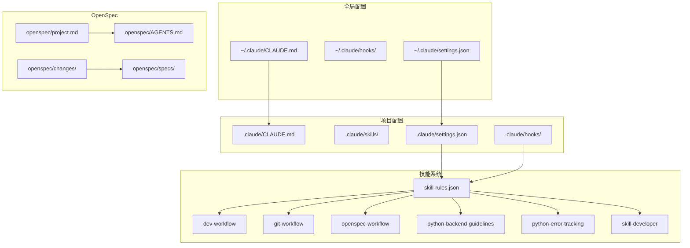
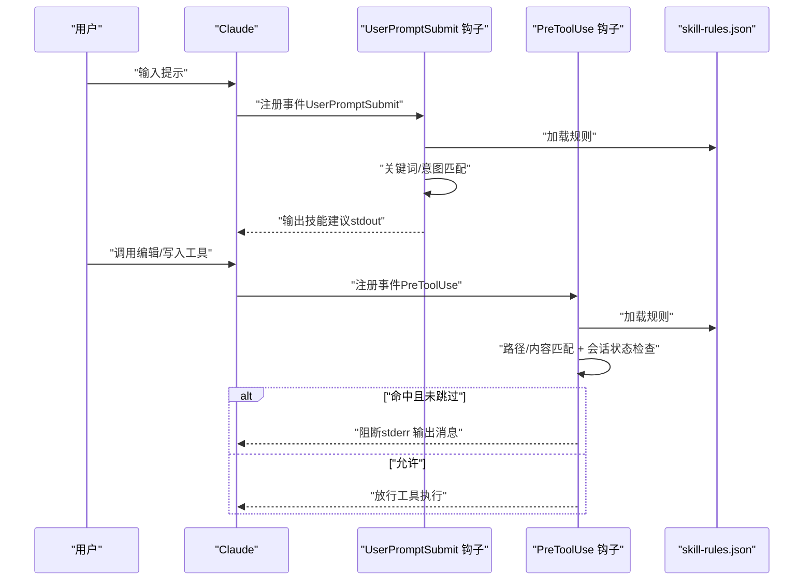
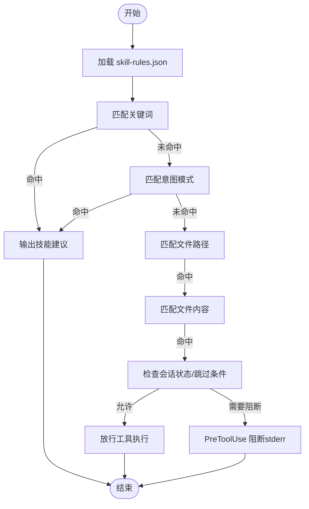
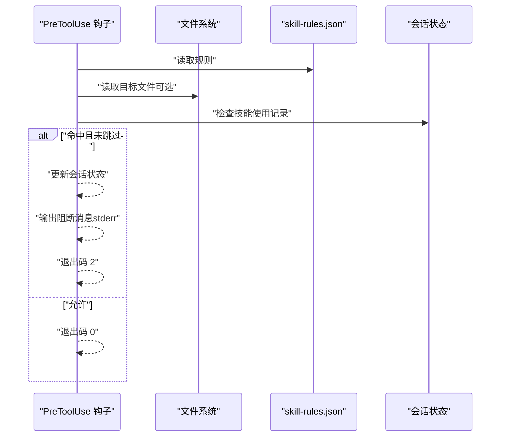
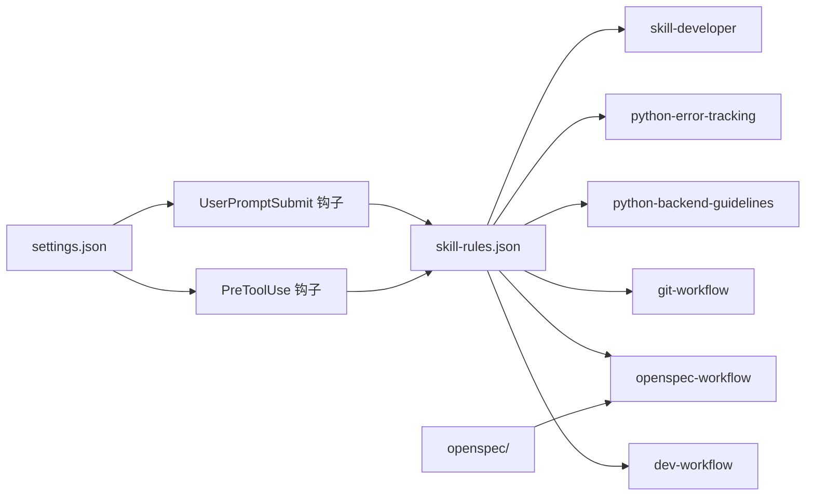

# 技能系统

<cite>
**本文引用的文件**
- [README.md](file://README.md)
- [skills/README.md](file://skills/README.md)
- [skills/skill-rules.json](file://skills/skill-rules.json)
- [skills/skill-developer/SKILL.md](file://skills/skill-developer/SKILL.md)
- [skills/skill-developer/HOOK_MECHANISMS.md](file://skills/skill-developer/HOOK_MECHANISMS.md)
- [skills/skill-developer/TRIGGER_TYPES.md](file://skills/skill-developer/TRIGGER_TYPES.md)
- [skills/skill-developer/TROUBLESHOOTING.md](file://skills/skill-developer/TROUBLESHOOTING.md)
- [skills/dev-workflow/SKILL.md](file://skills/dev-workflow/SKILL.md)
- [skills/git-workflow/SKILL.md](file://skills/git-workflow/SKILL.md)
- [skills/openspec-workflow/SKILL.md](file://skills/openspec-workflow/SKILL.md)
- [skills/python-backend-guidelines/SKILL.md](file://skills/python-backend-guidelines/SKILL.md)
- [skills/python-error-tracking/SKILL.md](file://skills/python-error-tracking/SKILL.md)
- [hooks/skill-activation-prompt.ts](file://hooks/skill-activation-prompt.ts)
- [openspec/AGENTS.md](file://openspec/AGENTS.md)
- [openspec/project.md](file://openspec/project.md)
- [global/codex-skills/writing-skills/examples/CLAUDE_MD_TESTING.md](file://global/codex-skills/writing-skills/examples/CLAUDE_MD_TESTING.md)
- [global/codex-skills/writing-skills/persuasion-principles.md](file://global/codex-skills/writing-skills/persuasion-principles.md)
</cite>

## 目录
1. [简介](#简介)
2. [项目结构](#项目结构)
3. [核心组件](#核心组件)
4. [架构总览](#架构总览)
5. [详细组件分析](#详细组件分析)
6. [依赖关系分析](#依赖关系分析)
7. [性能考量](#性能考量)
8. [故障排查指南](#故障排查指南)
9. [结论](#结论)
10. [附录](#附录)

## 简介
本技能系统是面向 Claude Code 的“按需自动激活”知识库体系，围绕“规范驱动开发（SDD）+ 多 AI 协同”的工程实践构建。系统通过规则化的触发器（关键词、意图模式、文件路径、内容模式）与两类钩子（UserPromptSubmit、PreToolUse）实现技能的自动发现与强制执行，覆盖开发流程、版本控制、规范驱动、后端规范与错误追踪等关键领域，并提供完善的技能开发、调试与扩展指南。

## 项目结构
- 全局与项目级配置分层：全局（~/.claude/）与项目（.claude/）双层配置，支持多 AI 协同与 SDD 工作流。
- 技能目录：skills/ 下包含各领域技能（开发流程、Git 工作流、OpenSpec 工作流、Python 后端规范、错误追踪、技能开发者指南等）。
- 钩子系统：hooks/ 下包含技能激活钩子与错误提醒钩子，配合 settings.json 注册。
- OpenSpec 集成：openspec/ 目录提供规范驱动开发的三阶段工作流与 CLI 工具。

图表来源
- [README.md](file://README.md#L71-L92)
- [skills/README.md](file://skills/README.md#L1-L369)
- [skills/skill-rules.json](file://skills/skill-rules.json#L1-L250)
- [openspec/AGENTS.md](file://openspec/AGENTS.md#L1-L457)
- [openspec/project.md](file://openspec/project.md#L1-L65)

章节来源
- [README.md](file://README.md#L71-L92)
- [skills/README.md](file://skills/README.md#L1-L369)

## 核心组件
- 规则引擎（skill-rules.json）：定义技能类型、触发器、执行策略与优先级，支撑自动激活与强制执行。
- 钩子系统（UserPromptSubmit/PreToolUse）：在用户提示提交前与工具调用前分别注入建议或阻断逻辑。
- 技能内容（SKILL.md）：每个技能以 Markdown 文件承载，遵循“500 行以内 + 渐进披露”的最佳实践。
- OpenSpec 工作流：三阶段（创建变更 → 实施变更 → 归档完成）与六阶段（SDD）开发流程统一。

章节来源
- [skills/skill-rules.json](file://skills/skill-rules.json#L1-L250)
- [skills/skill-developer/SKILL.md](file://skills/skill-developer/SKILL.md#L1-L427)
- [hooks/skill-activation-prompt.ts](file://hooks/skill-activation-prompt.ts#L1-L133)
- [openspec/AGENTS.md](file://openspec/AGENTS.md#L1-L457)

## 架构总览
技能系统采用“规则驱动 + 钩子执行”的两阶段机制：
- 规则匹配：UserPromptSubmit 钩子在用户提示提交前读取 skill-rules.json，基于关键词与意图模式匹配推荐技能。
- 强制执行：PreToolUse 钩子在工具调用前根据文件路径与内容模式判断是否阻断，结合会话状态避免重复阻断。

图表来源
- [hooks/skill-activation-prompt.ts](file://hooks/skill-activation-prompt.ts#L36-L127)
- [skills/skill-developer/HOOK_MECHANISMS.md](file://skills/skill-developer/HOOK_MECHANISMS.md#L15-L167)
- [skills/skill-rules.json](file://skills/skill-rules.json#L1-L250)

章节来源
- [hooks/skill-activation-prompt.ts](file://hooks/skill-activation-prompt.ts#L1-L133)
- [skills/skill-developer/HOOK_MECHANISMS.md](file://skills/skill-developer/HOOK_MECHANISMS.md#L1-L307)

## 详细组件分析

### 规则引擎与触发机制
- 触发器类型
  - 关键词触发：对用户提示进行不区分大小写的子串匹配。
  - 意图模式触发：使用正则表达式识别隐含意图，支持非贪婪匹配与常见动词/名词组合。
  - 文件路径触发：基于 glob 模式匹配被编辑文件路径，支持排除项。
  - 内容模式触发：对文件内容进行正则匹配，常用于检测特定技术栈或库。
- 规则字段
  - type：guardrail/domain
  - enforcement：block/suggest/warn
  - priority：critical/high/medium/low
  - promptTriggers：keywords/intentPatterns
  - fileTriggers：pathPatterns/pathExclusions/contentPatterns

图表来源
- [skills/skill-rules.json](file://skills/skill-rules.json#L1-L250)
- [skills/skill-developer/TRIGGER_TYPES.md](file://skills/skill-developer/TRIGGER_TYPES.md#L1-L306)

章节来源
- [skills/skill-rules.json](file://skills/skill-rules.json#L1-L250)
- [skills/skill-developer/TRIGGER_TYPES.md](file://skills/skill-developer/TRIGGER_TYPES.md#L1-L306)

### 钩子机制详解
- UserPromptSubmit 钩子
  - 时机：用户提示提交前
  - 输入：session_id、prompt 等
  - 行为：读取 skill-rules.json，匹配关键词/意图，按优先级分组输出建议
  - 输出：stdout 作为 Claude 的上下文补充
- PreToolUse 钩子
  - 时机：工具调用前（如 Edit/Write）
  - 输入：tool_name、tool_input（含 file_path 等）
  - 行为：匹配路径/内容 + 会话状态 + 跳过条件；命中则阻断（exit code 2），否则放行
  - 输出：stderr → Claude 的阻断消息

图表来源
- [skills/skill-developer/HOOK_MECHANISMS.md](file://skills/skill-developer/HOOK_MECHANISMS.md#L82-L167)

章节来源
- [skills/skill-developer/HOOK_MECHANISMS.md](file://skills/skill-developer/HOOK_MECHANISMS.md#L1-L307)

### 技能开发指南（Meta-Skill）
- 目标：帮助创建与管理 Claude Code 技能，遵循 500 行规则与渐进披露模式。
- 五步法：创建 SKILL.md → 添加到 skill-rules.json → 测试钩子 → 优化模式 → 保持简洁。
- 强制级别：block（关键守卫）、suggest（推荐）、warn（低优先）。
- 跳过条件：会话状态、文件标记（// @skip-validation）、环境变量覆盖。
- 参考文件：TRIGGER_TYPES.md、SKILL_RULES_REFERENCE.md、HOOK_MECHANISMS.md、TROUBLESHOOTING.md、PATTERNS_LIBRARY.md、ADVANCED.md。

章节来源
- [skills/skill-developer/SKILL.md](file://skills/skill-developer/SKILL.md#L1-L427)
- [skills/skill-developer/HOOK_MECHANISMS.md](file://skills/skill-developer/HOOK_MECHANISMS.md#L1-L307)
- [skills/skill-developer/TRIGGER_TYPES.md](file://skills/skill-developer/TRIGGER_TYPES.md#L1-L306)
- [skills/skill-developer/TROUBLESHOOTING.md](file://skills/skill-developer/TROUBLESHOOTING.md#L1-L515)

### 开发工作流技能（SDD 开发流程管理）
- 目标：严格阶段顺序（需求 → 设计 → 实施 → 审查 → 测试 → 完成）与目录约定。
- 文档结构：.devos/tasks/{task-id}/ 下的 requirement.md、design.md、review.md、test-report.md、progress.md。
- 模板与命令：提供需求、设计、评审、测试报告的模板与保存命令。
- API 参考：Python API 便于外部代理集成。

章节来源
- [skills/dev-workflow/SKILL.md](file://skills/dev-workflow/SKILL.md#L1-L397)

### Git 工作流技能
- 目标：团队协作的 Git 规范，包括分支命名、提交信息、预提交检查、合并与热修复流程。
- 分支命名：feature/、bugfix/、hotfix/、release/，并带任务标识。
- 提交信息：Conventional Commits 格式与类型说明。
- 预提交检查：包含冲突标记、lint、测试等清单与自动化脚本。
- 冲突解决与常用操作：步骤化解决冲突、查看状态/历史/差异、撤销更改等。

章节来源
- [skills/git-workflow/SKILL.md](file://skills/git-workflow/SKILL.md#L1-L440)

### OpenSpec 工作流技能（规范驱动开发）
- 目标：在实现前检查现有规范、创建提案、实施已批准提案、归档已完成工作。
- 三阶段：创建变更（REQUIREMENT+DESIGN）→ 实施变更（IMPLEMENTATION+REVIEW+TESTING）→ 归档完成（DONE）。
- CLI 与斜杠命令：openspec list/show/validate/archive 等。
- 提案与任务：proposal.md、tasks.md、design.md（必要时）与规范增量（ADDED/MODIFIED/REMOVED）。
- 决策树：新请求 → 是否为破坏性变更/架构变更 → 是否为拼写/格式/注释 → 是否为依赖更新/配置/测试 → 是否为 bug 修复。

章节来源
- [skills/openspec-workflow/SKILL.md](file://skills/openspec-workflow/SKILL.md#L1-L231)
- [openspec/AGENTS.md](file://openspec/AGENTS.md#L1-L457)
- [openspec/project.md](file://openspec/project.md#L1-L65)

### Python 后端规范技能
- 目标：统一 Python/Django/FastAPI 后端开发的最佳实践，涵盖分层架构、路由/视图、服务层、仓储层、验证、异步、错误处理与 Sentry 集成。
- 架构：路由 → 视图/端点 → 服务 → 仓储（可选）→ ORM → 数据库。
- 目录结构：FastAPI 与 Django 的典型组织方式。
- 模式示例：FastAPI 端点、Django 视图、服务层、仓储层的代码模式与依赖注入。
- 最佳实践：类型提示、Pydantic/序列化器、异常处理、异步/并发、数据库迁移、测试、配置管理、性能优化、安全实践。
- 对比：Django vs FastAPI 的特性对比表。

章节来源
- [skills/python-backend-guidelines/SKILL.md](file://skills/python-backend-guidelines/SKILL.md#L1-L596)

### Python 错误追踪技能（Sentry）
- 目标：强制在所有后端服务中集成 Sentry，确保“所有意外错误必须上报”，并提供性能监控与背景任务追踪。
- 安装与初始化：FastAPI/Django 的 Sentry 初始化与集成。
- 错误处理：端点、视图、服务层的错误捕获与上下文设置，区分业务错误与意外异常。
- 性能监控：自定义 Span、数据库查询监控、事务追踪。
- 背景任务：Celery 与异步任务的 Sentry 集成。
- 上下文与面包屑：用户上下文、标签、面包屑记录。
- 过滤与测试：忽略特定异常、before_send 过滤、单元测试验证。
- 环境配置：不同环境采样率与配置管理。
- 迁移清单：从 print/logging 到 Sentry 的迁移步骤。

章节来源
- [skills/python-error-tracking/SKILL.md](file://skills/python-error-tracking/SKILL.md#L1-L574)

## 依赖关系分析
- 配置依赖
  - skill-rules.json 为技能激活的核心配置，被钩子系统读取。
  - settings.json 注册钩子事件（UserPromptSubmit/PreToolUse）。
- 技能依赖
  - 各技能 SKILL.md 由技能开发者指南统一规范创建与维护。
  - OpenSpec 与开发工作流技能在项目级协同，统一 SDD 流程。
- 外部工具依赖
  - MCP 工具（Codex、Gemini）与插件（superpowers、pyright-lsp、pinecone 等）增强多 AI 协同与开发体验。

图表来源
- [skills/skill-rules.json](file://skills/skill-rules.json#L1-L250)
- [README.md](file://README.md#L123-L139)

章节来源
- [skills/skill-rules.json](file://skills/skill-rules.json#L1-L250)
- [README.md](file://README.md#L123-L139)

## 性能考量
- 钩子性能目标
  - UserPromptSubmit：<100ms
  - PreToolUse：<200ms
- 性能瓶颈与优化
  - 规则加载：减少加载频率、缓存策略、按需重载。
  - 文件内容匹配：仅在必要时读取文件、限制文件大小、避免复杂正则。
  - glob/正则匹配：编译一次、缓存正则对象、减少模式数量。
- 会话状态与跳过条件
  - 会话状态文件按会话 ID 分离，避免重复阻断。
  - 文件标记与环境变量提供紧急禁用能力，但应谨慎使用。

章节来源
- [skills/skill-developer/HOOK_MECHANISMS.md](file://skills/skill-developer/HOOK_MECHANISMS.md#L260-L301)
- [skills/skill-developer/TROUBLESHOOTING.md](file://skills/skill-developer/TROUBLESHOOTING.md#L438-L508)

## 故障排查指南
- 技能未触发
  - UserPromptSubmit：检查 keywords/intentPatterns 是否匹配；使用 jq 校验 skill-rules.json；手动测试钩子。
  - PreToolUse：检查 pathPatterns/pathExclusions/contentPatterns；确认文件不在排除项；检查会话状态文件；确认未被文件标记或环境变量禁用。
- 误触发（过多触发）
  - 收敛关键词/意图模式；缩小文件路径模式；精确内容模式；必要时降低 enforcement 级别。
- 钩子未执行
  - 检查 settings.json 中钩子注册；确认 bash wrapper 可执行；检查 shebang；安装依赖；编译 TypeScript。
- 性能问题
  - 减少模式数量；简化正则；限定文件范围；测量耗时并定位瓶颈。

章节来源
- [skills/skill-developer/TROUBLESHOOTING.md](file://skills/skill-developer/TROUBLESHOOTING.md#L1-L515)

## 结论
本技能系统通过“规则 + 钩子”的设计实现了高可复用、可扩展的开发知识库体系。它不仅覆盖了开发流程、版本控制、规范驱动与后端规范等关键领域，还提供了完善的开发、调试与扩展指南。结合 OpenSpec 与多 AI 协同，能够有效提升团队在复杂项目中的协作效率与质量一致性。

## 附录
- 技能开发最佳实践
  - 遵循 500 行规则与渐进披露，将细节放入参考文件。
  - 使用明确的触发词与意图模式，避免泛化导致误触发。
  - 为关键守卫技能设置 block 级别，确保强制执行。
  - 通过会话状态与跳过条件平衡用户体验与质量保障。
- 心理学与说服原则
  - 权威、承诺、稀缺、社会认同、团结等原则可用于设计纪律型技能，减少理性化规避。
- 示例与测试
  - 可参考 CLAUDE.md 测试文档与写作技能的心理学原理，持续优化技能的可发现性与遵从度。

章节来源
- [global/codex-skills/writing-skills/examples/CLAUDE_MD_TESTING.md](file://global/codex-skills/writing-skills/examples/CLAUDE_MD_TESTING.md#L1-L190)
- [global/codex-skills/writing-skills/persuasion-principles.md](file://global/codex-skills/writing-skills/persuasion-principles.md#L1-L188)