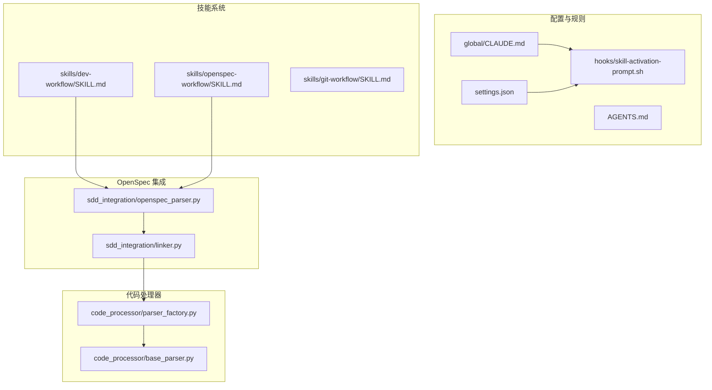
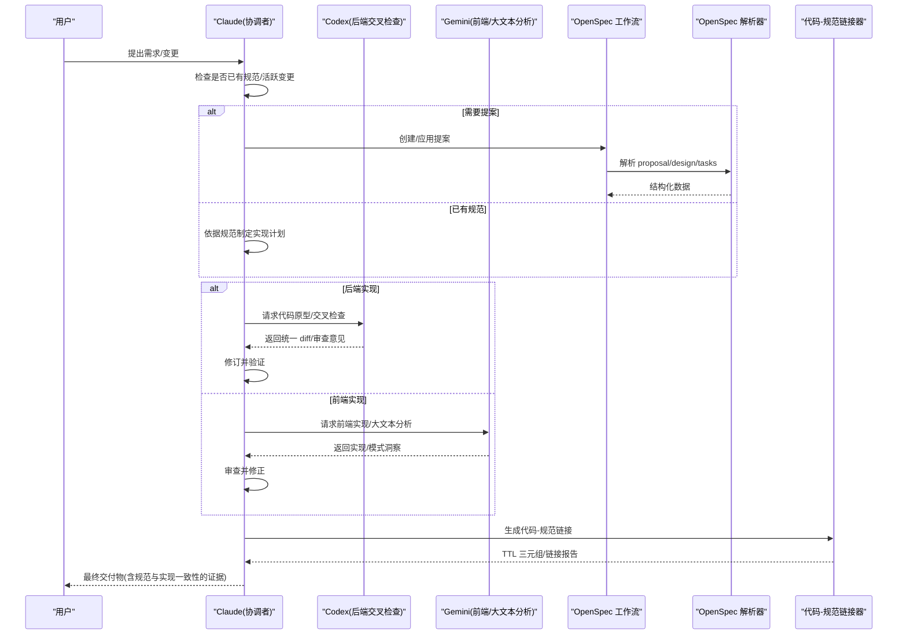
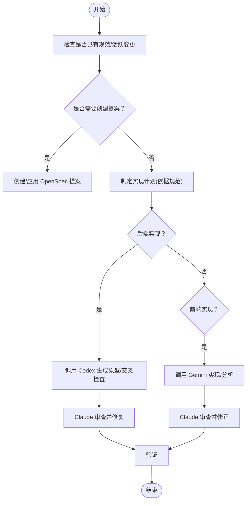
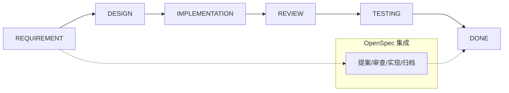
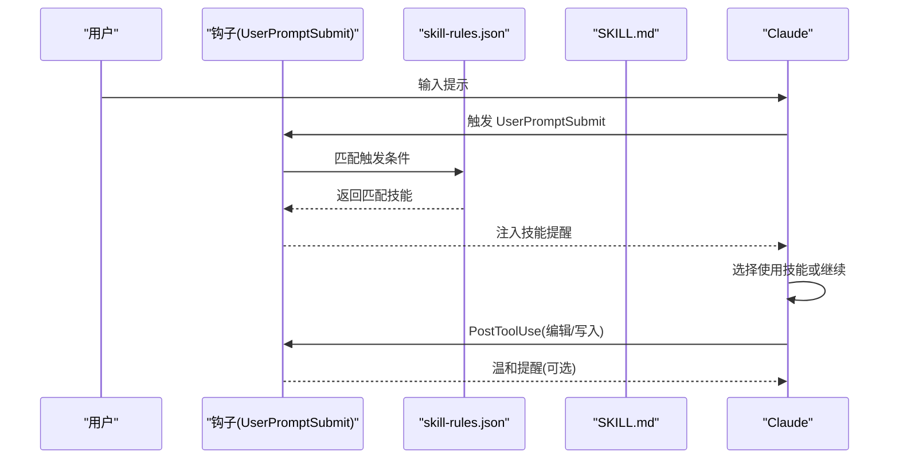
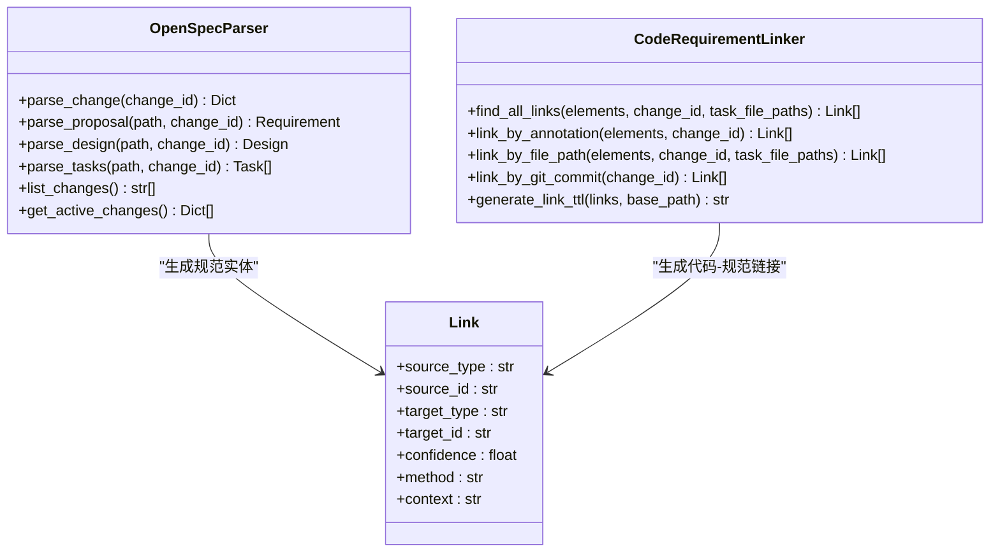
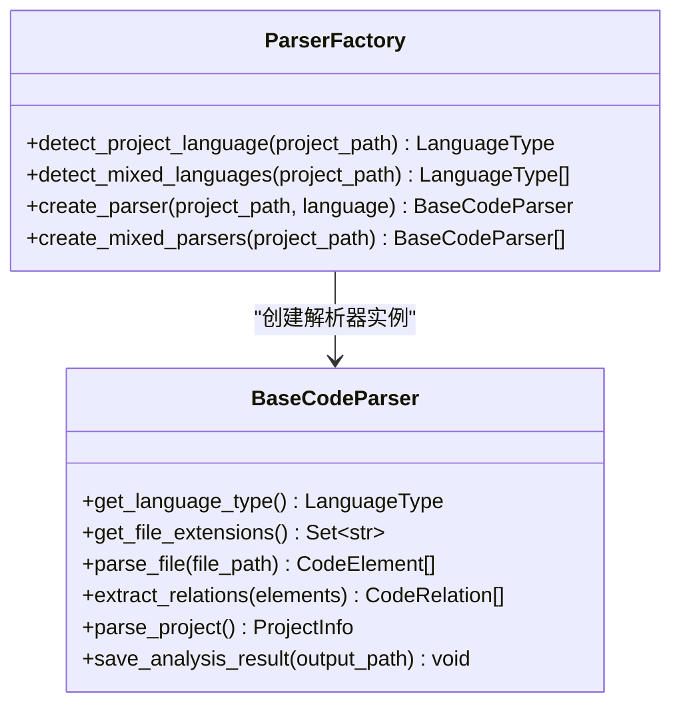
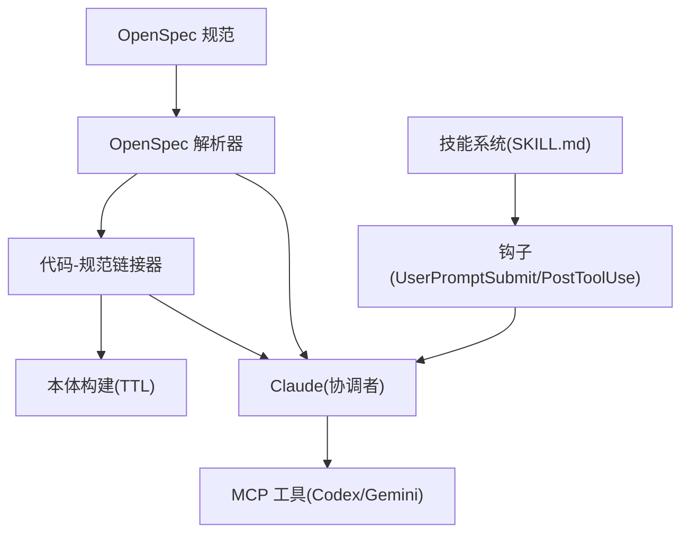

# 核心功能

<cite>
**本文引用的文件**
- [README.md](file://README.md)
- [docs/sdd.md](file://docs/sdd.md)
- [global/CLAUDE.md](file://global/CLAUDE.md)
- [openspec/specs/claudecode-openspec-integration/spec.md](file://openspec/specs/claudecode-openspec-integration/spec.md)
- [skills/dev-workflow/SKILL.md](file://skills/dev-workflow/SKILL.md)
- [skills/openspec-workflow/SKILL.md](file://skills/openspec-workflow/SKILL.md)
- [skills/git-workflow/SKILL.md](file://skills/git-workflow/SKILL.md)
- [sdd_integration/openspec_parser.py](file://sdd_integration/openspec_parser.py)
- [sdd_integration/linker.py](file://sdd_integration/linker.py)
- [code_processor/parser_factory.py](file://code_processor/parser_factory.py)
- [code_processor/base_parser.py](file://code_processor/base_parser.py)
- [settings.json](file://settings.json)
- [hooks/skill-activation-prompt.sh](file://hooks/skill-activation-prompt.sh)
</cite>

## 目录
1. [简介](#简介)
2. [项目结构](#项目结构)
3. [核心组件](#核心组件)
4. [架构总览](#架构总览)
5. [详细组件分析](#详细组件分析)
6. [依赖分析](#依赖分析)
7. [性能考量](#性能考量)
8. [故障排查指南](#故障排查指南)
9. [结论](#结论)
10. [附录](#附录)

## 简介
本文件聚焦 ontologyDevOS 项目的核心能力：多 AI 协同机制（Claude + Codex + Gemini）、规范驱动开发（SDD）工作流、技能系统与 OpenSpec 集成、以及代码本体（R&D Ontology）构建链路。文档旨在帮助读者理解：
- 多 AI 协同的职责边界、触发规则与交叉检查流程
- SDD 三阶段与六阶段统一机制的落地方式
- 技能系统的可复用性与自动化激活机制
- OpenSpec 规范解析、变更链接与代码本体生成的衔接
- 实际使用示例与最佳实践

## 项目结构
项目采用“模板 + 工具 + 集成”的组织方式：
- 全局与项目级配置：通过 CLAUDE.md、AGENTS.md、settings.json 等定义协作规则与工具权限
- 技能系统：skills/* 提供可复用的开发流程、Git 工作流、OpenSpec 工作流等
- OpenSpec 集成：sdd_integration/* 提供规范解析与代码链接能力
- 代码处理器：code_processor/* 提供多语言代码解析与统计
- 钩子与自动化：hooks/* 与 settings.json 配合实现技能自动激活与工具使用追踪

**图表来源**
- [global/CLAUDE.md](file://global/CLAUDE.md#L60-L147)
- [settings.json](file://settings.json#L1-L37)
- [hooks/skill-activation-prompt.sh](file://hooks/skill-activation-prompt.sh#L1-L6)
- [skills/dev-workflow/SKILL.md](file://skills/dev-workflow/SKILL.md#L1-L397)
- [skills/openspec-workflow/SKILL.md](file://skills/openspec-workflow/SKILL.md#L1-L231)
- [skills/git-workflow/SKILL.md](file://skills/git-workflow/SKILL.md#L1-L440)
- [sdd_integration/openspec_parser.py](file://sdd_integration/openspec_parser.py#L1-L249)
- [sdd_integration/linker.py](file://sdd_integration/linker.py#L1-L324)
- [code_processor/parser_factory.py](file://code_processor/parser_factory.py#L1-L248)
- [code_processor/base_parser.py](file://code_processor/base_parser.py#L1-L358)

**章节来源**
- [README.md](file://README.md#L71-L229)
- [global/CLAUDE.md](file://global/CLAUDE.md#L1-L147)
- [settings.json](file://settings.json#L1-L37)

## 核心组件
- 多 AI 协同与交叉检查：通过 CLAUDE.md 的强制工具规则，定义 Claude 为主导者，Codex 为后端交叉检查，Gemini 为前端主导与大文本分析，确保“先思考、再调用、后验证”的闭环。
- 规范驱动开发（SDD）：OpenSpec 工作流与开发流程技能统一，形成“提案—审查—实现—验证—归档”的闭环；同时通过规范解析与代码链接，实现“规范即契约”的可追溯交付。
- 技能系统：以 SKILL.md 为载体，结合 skill-rules.json 与钩子机制，实现技能的自动激活与执行约束，覆盖开发流程、Git 工作流、OpenSpec 工作流等。
- 代码处理器与本体生成：多语言解析器与链接器将代码元素与规范变更关联，生成 TTL 三元组，支撑研发本体（R&D Ontology）构建。

**章节来源**
- [docs/sdd.md](file://docs/sdd.md#L80-L356)
- [global/CLAUDE.md](file://global/CLAUDE.md#L60-L147)
- [skills/dev-workflow/SKILL.md](file://skills/dev-workflow/SKILL.md#L1-L397)
- [skills/openspec-workflow/SKILL.md](file://skills/openspec-workflow/SKILL.md#L1-L231)
- [sdd_integration/openspec_parser.py](file://sdd_integration/openspec_parser.py#L1-L249)
- [sdd_integration/linker.py](file://sdd_integration/linker.py#L1-L324)
- [code_processor/parser_factory.py](file://code_processor/parser_factory.py#L1-L248)

## 架构总览
多 AI 协同与 SDD 工作流的总体交互如下：

**图表来源**
- [docs/sdd.md](file://docs/sdd.md#L80-L356)
- [global/CLAUDE.md](file://global/CLAUDE.md#L60-L147)
- [openspec/specs/claudecode-openspec-integration/spec.md](file://openspec/specs/claudecode-openspec-integration/spec.md#L1-L54)
- [sdd_integration/openspec_parser.py](file://sdd_integration/openspec_parser.py#L51-L86)
- [sdd_integration/linker.py](file://sdd_integration/linker.py#L35-L68)

## 详细组件分析

### 多 AI 协同机制与交叉检查
- 角色与职责
  - Claude：主体思考者与决策者，负责理解目标、拆分工作、决定何时调用 Codex/Gemini，并最终应用代码与撰写文本。
  - Codex：后端技术顾问，负责非平凡代码/实验任务的设计、实现、调试、重构与实验流程，承担交叉检查。
  - Gemini：前端开发主力与大文本分析师，负责前端实现与海量文档/代码库的全局视图与模式发现。
- 强制工具规则
  - 对于任何非平凡任务，Claude 必须先自问“Codex 能否帮助编码/实验？”“Gemini 能否帮助大文本分析？”，并在给出最终答案前调用相应工具；跳过工具需说明原因。
- 交叉检查流程
  - 后端：Claude 实现 → Codex 交叉检查 → Claude 修复 → 验证
  - 前端：Claude 设计 → Gemini 实现 → Claude 审查 → Gemini/Claude 修正 → 验证
  - 交叉检查时机：完成功能模块、提交代码前、发现潜在问题时

**图表来源**
- [global/CLAUDE.md](file://global/CLAUDE.md#L60-L147)
- [docs/sdd.md](file://docs/sdd.md#L288-L356)

**章节来源**
- [global/CLAUDE.md](file://global/CLAUDE.md#L60-L147)
- [docs/sdd.md](file://docs/sdd.md#L80-L356)

### 规范驱动开发（SDD）工作流：三阶段与六阶段统一
- 三阶段工作流
  - 阶段 1：创建提案（REQUIREMENT + DESIGN）
  - 阶段 2：实现变更（IMPLEMENTATION + REVIEW + TESTING）
  - 阶段 3：归档完成（DONE）
- 六阶段开发流程（技能系统）
  - REQUIREMENT → DESIGN → IMPLEMENTATION → REVIEW → TESTING → DONE
  - 每个阶段有前置文档要求与阶段校验，确保严格过渡
- OpenSpec 集成
  - 在实现前检查现有规范，为重大变更创建提案，系统性实现已批准的提案，最后归档已完成的变更
  - 通过规范解析器提取 proposal/design/tasks 的结构化数据，支撑后续链接与验证

**图表来源**
- [skills/dev-workflow/SKILL.md](file://skills/dev-workflow/SKILL.md#L28-L50)
- [skills/openspec-workflow/SKILL.md](file://skills/openspec-workflow/SKILL.md#L48-L67)
- [sdd_integration/openspec_parser.py](file://sdd_integration/openspec_parser.py#L57-L86)

**章节来源**
- [skills/dev-workflow/SKILL.md](file://skills/dev-workflow/SKILL.md#L1-L397)
- [skills/openspec-workflow/SKILL.md](file://skills/openspec-workflow/SKILL.md#L1-L231)
- [sdd_integration/openspec_parser.py](file://sdd_integration/openspec_parser.py#L1-L249)

### 技能系统：可复用性与自动化激活
- 技能类型
  - Guardrail 技能：强制阻断（block），用于关键错误预防
  - Domain 技能：建议（suggest），提供领域知识与最佳实践
  - Warn 技能：低优先级提醒（较少使用）
- 自动化激活
  - UserPromptSubmit 钩子：在 Claude 看到用户提示前，基于关键字/意图/文件路径/内容模式注入相关技能提醒
  - PostToolUse 钩子：对编辑/写入等工具使用后的文件进行风险模式分析，温和提醒
- 配置与规则
  - skill-rules.json 定义技能触发条件、执行级别、文件路径模式、内容检测模式与跳过条件
  - settings.json 注册钩子与权限，确保 Edit/Write/MultiEdit/Bash 等工具可用

**图表来源**
- [skills/skill-developer/SKILL.md](file://skills/skill-developer/SKILL.md#L28-L58)
- [settings.json](file://settings.json#L13-L35)
- [hooks/skill-activation-prompt.sh](file://hooks/skill-activation-prompt.sh#L1-L6)

**章节来源**
- [skills/skill-developer/SKILL.md](file://skills/skill-developer/SKILL.md#L1-L427)
- [settings.json](file://settings.json#L1-L37)
- [hooks/skill-activation-prompt.sh](file://hooks/skill-activation-prompt.sh#L1-L6)

### OpenSpec 集成：规范解析与代码链接
- OpenSpec 规范解析
  - 解析 proposal.md、design.md、tasks.md，抽取需求、设计决策、任务与文件路径等结构化信息
  - 支持列出活跃变更与聚合解析结果
- 代码-规范链接
  - 基于注解（@spec）、任务文件路径匹配、Git 提交信息三种方式建立链接
  - 去重并保留最高置信度，生成 TTL 三元组用于本体构建
- 与开发流程的衔接
  - 在实现阶段，通过链接器将代码元素与规范变更关联，确保实现符合规范

**图表来源**
- [sdd_integration/openspec_parser.py](file://sdd_integration/openspec_parser.py#L51-L197)
- [sdd_integration/linker.py](file://sdd_integration/linker.py#L23-L68)

**章节来源**
- [sdd_integration/openspec_parser.py](file://sdd_integration/openspec_parser.py#L1-L249)
- [sdd_integration/linker.py](file://sdd_integration/linker.py#L1-L324)

### 代码处理器与多语言分析
- 多语言解析器工厂
  - 自动检测项目语言类型与混合语言项目，注册并创建对应解析器
  - 支持 Java、Python、JavaScript/TypeScript 等语言
- 项目分析
  - 统一抽象基类提供文件扫描、元素解析、关系抽取、包结构分析与统计生成
  - 保存分析结果为 JSON，便于后续链接与本体生成

**图表来源**
- [code_processor/parser_factory.py](file://code_processor/parser_factory.py#L20-L160)
- [code_processor/base_parser.py](file://code_processor/base_parser.py#L206-L358)

**章节来源**
- [code_processor/parser_factory.py](file://code_processor/parser_factory.py#L1-L248)
- [code_processor/base_parser.py](file://code_processor/base_parser.py#L1-L358)

## 依赖分析
- 组件耦合
  - OpenSpec 解析器与链接器紧密耦合：前者提供结构化数据，后者据此建立代码-规范链接
  - 技能系统与钩子机制耦合：skill-rules.json 与 hooks 配合实现自动激活
  - 代码处理器为链接器提供代码元素基础数据
- 外部依赖
  - MCP 工具（Codex、Gemini）通过 CLAUDE.md 的全局工具规则与 settings.json 的权限配置进行集成
  - OpenSpec CLI 与斜杠命令（/openspec:proposal、/openspec:apply、/openspec:archive）贯穿工作流

**图表来源**
- [sdd_integration/openspec_parser.py](file://sdd_integration/openspec_parser.py#L51-L86)
- [sdd_integration/linker.py](file://sdd_integration/linker.py#L35-L68)
- [settings.json](file://settings.json#L13-L35)
- [global/CLAUDE.md](file://global/CLAUDE.md#L60-L147)

**章节来源**
- [settings.json](file://settings.json#L1-L37)
- [global/CLAUDE.md](file://global/CLAUDE.md#L60-L147)

## 性能考量
- 解析与链接
  - 多语言解析器在大型项目中可能产生大量文件扫描与元素解析开销，建议在 CI 中缓存分析结果与链接产物
  - 链接器的去重与 TTL 生成为线性复杂度，通常性能可接受
- 工作流效率
  - 通过 OpenSpec 的“实现—验证—归档”闭环，减少返工与歧义，间接提升整体效率
  - 技能自动激活与钩子机制在提示阶段注入上下文，避免重复劳动

[本节为通用指导，无需特定文件来源]

## 故障排查指南
- 技能未自动激活
  - 检查 skill-rules.json 的触发条件与优先级
  - 使用 hooks/skill-activation-prompt.sh 手动测试 UserPromptSubmit 钩子
- 工具调用失败
  - 确认 settings.json 中的权限与钩子注册
  - 检查 MCP 工具（Codex/Gemini）是否正确安装与连接
- OpenSpec 命令异常
  - 使用 openspec list/validate/archive 验证提案状态与格式
  - 若规范解析报错，检查 proposal/design/tasks 的格式与字段完整性
- 链接不准确
  - 检查 @spec 注解、任务文件路径与 Git 提交信息是否包含变更 ID
  - 调整链接置信度阈值与去重策略

**章节来源**
- [settings.json](file://settings.json#L1-L37)
- [hooks/skill-activation-prompt.sh](file://hooks/skill-activation-prompt.sh#L1-L6)
- [skills/openspec-workflow/SKILL.md](file://skills/openspec-workflow/SKILL.md#L160-L186)
- [sdd_integration/openspec_parser.py](file://sdd_integration/openspec_parser.py#L199-L226)
- [sdd_integration/linker.py](file://sdd_integration/linker.py#L214-L223)

## 结论
ontologyDevOS 通过“多 AI 协同 + SDD + 技能系统 + OpenSpec 集成 + 代码处理器”的完整链路，实现了规范先行、可追溯、可复用的 AI 协作开发范式。Claude 作为协调者，结合 Codex 与 Gemini 的专业化能力，确保前后端分工明确、交叉检查到位；OpenSpec 与技能系统共同保障开发流程的规范化与自动化；代码处理器与链接器为研发本体提供结构化数据基础。该体系既适合复杂业务场景，也便于在不同项目中复用与推广。

[本节为总结，无需特定文件来源]

## 附录
- 使用示例（基于现有技能与规范）
  - 启动新功能：使用 OpenSpec 工作流技能创建提案，随后按 tasks.md 逐步实现并验证
  - 后端实现：Claude 先思考，再调用 Codex 生成原型/交叉检查，最后验证
  - 前端实现：Claude 设计，Gemini 实现，Claude 审查并修正
  - Git 协作：使用 Git 工作流技能规范分支命名、提交信息与合并流程
- 最佳实践
  - 严格遵循 SDD 三阶段与六阶段流程，确保阶段前置文档齐全
  - 在实现前先检查规范与活跃变更，避免重复与冲突
  - 使用技能系统与钩子机制，减少人为疏漏
  - 通过链接器与 TTL 生成，持续积累研发本体资产

**章节来源**
- [skills/dev-workflow/SKILL.md](file://skills/dev-workflow/SKILL.md#L1-L397)
- [skills/openspec-workflow/SKILL.md](file://skills/openspec-workflow/SKILL.md#L1-L231)
- [skills/git-workflow/SKILL.md](file://skills/git-workflow/SKILL.md#L1-L440)
- [docs/sdd.md](file://docs/sdd.md#L358-L800)