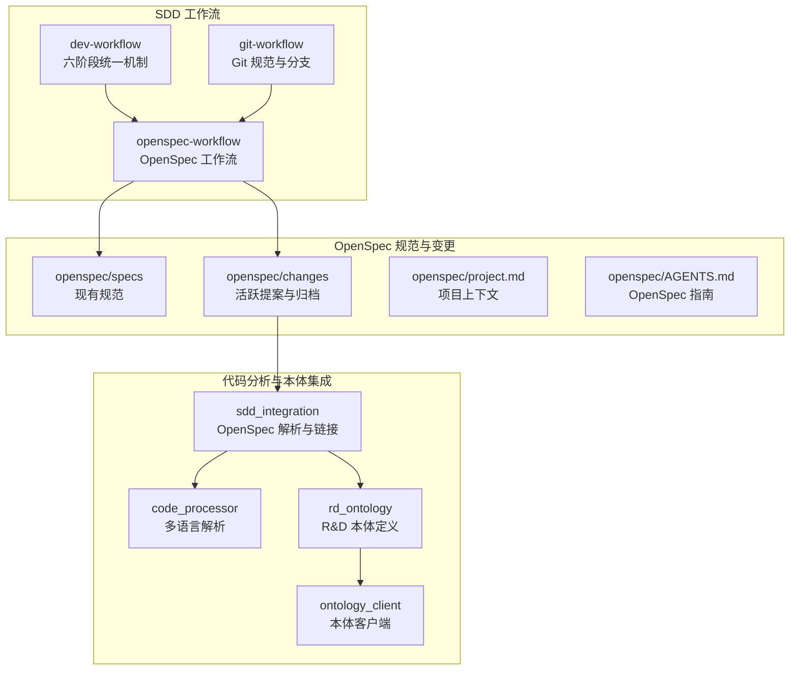
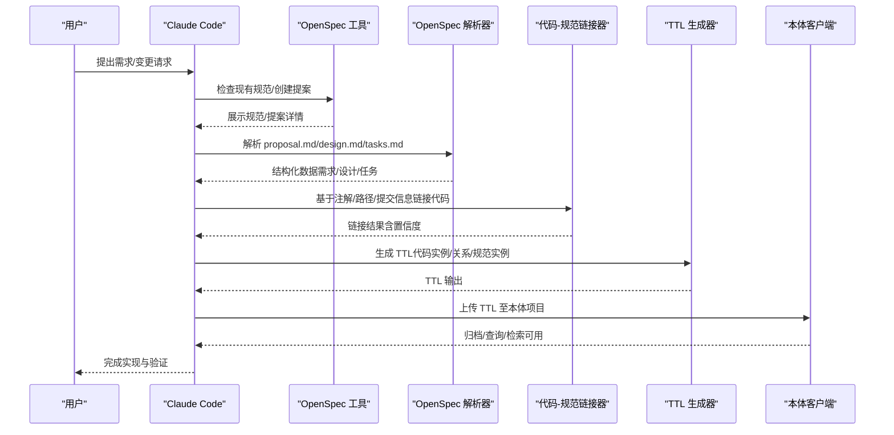
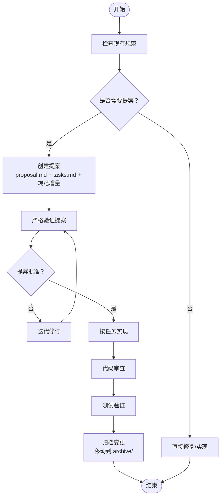
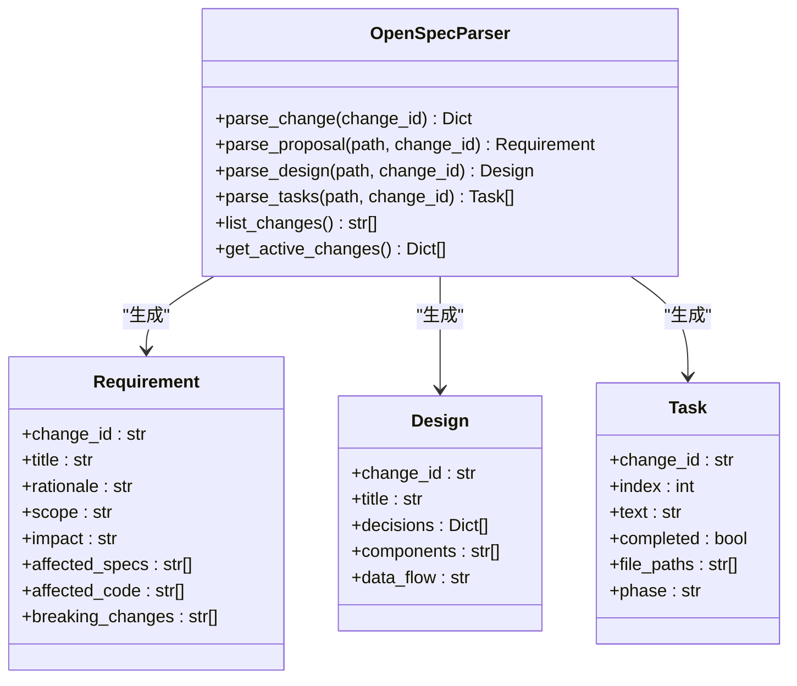
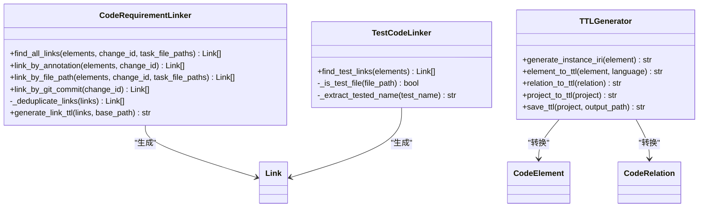
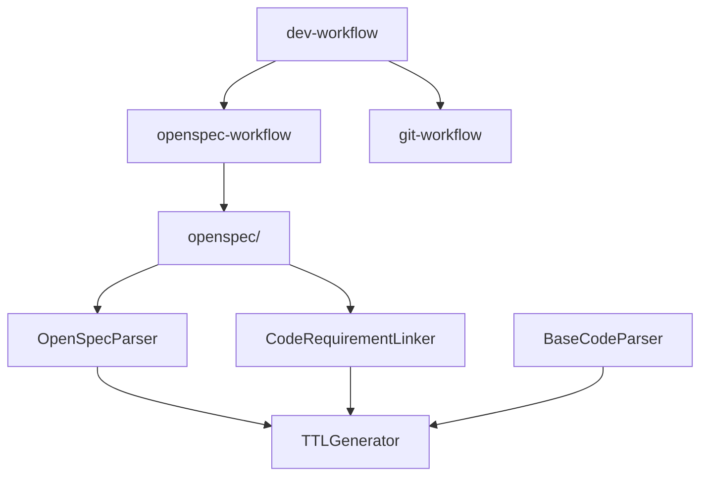

# 规范驱动开发 (SDD) 工作流

<cite>
**本文档引用的文件**
- [README.md](file://README.md)
- [docs/sdd.md](file://docs/sdd.md)
- [skills/dev-workflow/SKILL.md](file://skills/dev-workflow/SKILL.md)
- [skills/git-workflow/SKILL.md](file://skills/git-workflow/SKILL.md)
- [skills/openspec-workflow/SKILL.md](file://skills/openspec-workflow/SKILL.md)
- [openspec/AGENTS.md](file://openspec/AGENTS.md)
- [openspec/project.md](file://openspec/project.md)
- [openspec/specs/claudecode-openspec-integration/spec.md](file://openspec/specs/claudecode-openspec-integration/spec.md)
- [openspec/changes/add-code-ontology-capability/proposal.md](file://openspec/changes/add-code-ontology-capability/proposal.md)
- [openspec/changes/add-code-ontology-capability/tasks.md](file://openspec/changes/add-code-ontology-capability/tasks.md)
- [openspec/changes/add-code-ontology-capability/specs/code-ontology/spec.md](file://openspec/changes/add-code-ontology-capability/specs/code-ontology/spec.md)
- [sdd_integration/__init__.py](file://sdd_integration/__init__.py)
- [sdd_integration/openspec_parser.py](file://sdd_integration/openspec_parser.py)
- [sdd_integration/linker.py](file://sdd_integration/linker.py)
- [code_processor/base_parser.py](file://code_processor/base_parser.py)
- [rd_ontology/ttl_generator.py](file://rd_ontology/ttl_generator.py)
- [global/codex-skills/writing-skills/SKILL.md](file://global/codex-skills/writing-skills/SKILL.md)
</cite>

## 目录
1. [简介](#简介)
2. [项目结构](#项目结构)
3. [核心组件](#核心组件)
4. [架构总览](#架构总览)
5. [详细组件分析](#详细组件分析)
6. [依赖关系分析](#依赖关系分析)
7. [性能考量](#性能考量)
8. [故障排除指南](#故障排除指南)
9. [结论](#结论)
10. [附录](#附录)

## 简介
本文件系统化阐述规范驱动开发（SDD）在本项目中的落地实践，重点说明 OpenSpec 集成的技术实现与三阶段工作流：提案创建（REQUIREMENT + DESIGN）、变更实现（IMPLEMENTATION + REVIEW + TESTING）、归档完成（DONE）。文档同时梳理六个开发阶段的统一机制与 OpenSpec 规范的作用，提供完整的项目生命周期管理流程，覆盖需求收集、设计评审、实现跟踪、测试验证、变更管理和文档归档，并展示在实际项目中应用 SDD 工作流的方法，包括规范编写、变更提案处理、版本控制集成等实践。

## 项目结构
本项目围绕 SDD 工作流构建，包含以下关键层次：
- SDD 工作流技能：dev-workflow、git-workflow、openspec-workflow
- OpenSpec 规范与变更：openspec/specs 与 openspec/changes
- 代码分析与本体集成：code_processor、sdd_integration、rd_ontology、ontology_client
- 全局规则与协作：CLAUDE.md、AGENTS.md、global/ 目录下的技能与模板

**图表来源**
- [README.md](file://README.md#L71-L92)
- [skills/dev-workflow/SKILL.md](file://skills/dev-workflow/SKILL.md#L28-L50)
- [skills/git-workflow/SKILL.md](file://skills/git-workflow/SKILL.md#L27-L52)
- [skills/openspec-workflow/SKILL.md](file://skills/openspec-workflow/SKILL.md#L26-L46)
- [openspec/project.md](file://openspec/project.md#L1-L65)
- [openspec/AGENTS.md](file://openspec/AGENTS.md#L15-L65)

**章节来源**
- [README.md](file://README.md#L71-L92)
- [openspec/project.md](file://openspec/project.md#L1-L65)

## 核心组件
- SDD 六阶段统一机制：REQUIREMENT → DESIGN → IMPLEMENTATION → REVIEW → TESTING → DONE，严格顺序与前置条件校验，确保阶段间质量门禁。
- Git 工作流规范：分支命名、提交规范、合并流程与冲突处理，支撑变更的可追溯性与可审计性。
- OpenSpec 工作流：提案创建、审查对齐、任务实现、归档更新，形成“规范即真相”的变更管理闭环。
- 代码分析与本体集成：多语言代码解析、R&D 本体 TTL 生成、OpenSpec 文档解析与代码-规范链接，实现 SDD 的知识图谱支撑。

**章节来源**
- [skills/dev-workflow/SKILL.md](file://skills/dev-workflow/SKILL.md#L28-L50)
- [skills/git-workflow/SKILL.md](file://skills/git-workflow/SKILL.md#L27-L52)
- [skills/openspec-workflow/SKILL.md](file://skills/openspec-workflow/SKILL.md#L26-L46)
- [sdd_integration/__init__.py](file://sdd_integration/__init__.py#L7-L18)

## 架构总览
SDD 工作流通过 OpenSpec 规范驱动，结合代码分析与本体技术，形成“规范-设计-实现-验证-归档”的完整生命周期。Git 工作流提供变更的版本控制与协作基础，dev-workflow 与 openspec-workflow 提供阶段化的执行与校验机制。

**图表来源**
- [openspec/AGENTS.md](file://openspec/AGENTS.md#L15-L65)
- [sdd_integration/openspec_parser.py](file://sdd_integration/openspec_parser.py#L51-L86)
- [sdd_integration/linker.py](file://sdd_integration/linker.py#L35-L68)
- [rd_ontology/ttl_generator.py](file://rd_ontology/ttl_generator.py#L18-L60)

## 详细组件分析

### OpenSpec 工作流与三阶段流程
- 提案创建阶段（REQUIREMENT + DESIGN）：通过 `/openspec:proposal` 命令引导创建 proposal.md、tasks.md 与规范增量，明确“为什么”“变更内容”“影响范围”，并进行严格验证。
- 变更实现阶段（IMPLEMENTATION + REVIEW + TESTING）：依据 tasks.md 逐步实现，每完成一个阶段进行 Review 与测试，确保实现与规范一致。
- 归档完成阶段（DONE）：通过 `/openspec:archive` 将变更移动到归档目录，更新规范并进行最终验证。

**图表来源**
- [skills/openspec-workflow/SKILL.md](file://skills/openspec-workflow/SKILL.md#L16-L23)
- [openspec/AGENTS.md](file://openspec/AGENTS.md#L15-L65)
- [openspec/AGENTS.md](file://openspec/AGENTS.md#L145-L155)

**章节来源**
- [skills/openspec-workflow/SKILL.md](file://skills/openspec-workflow/SKILL.md#L26-L46)
- [openspec/AGENTS.md](file://openspec/AGENTS.md#L15-L65)

### 六阶段统一机制（dev-workflow）
- 阶段顺序与前置条件：REQUIREMENT → DESIGN → IMPLEMENTATION → REVIEW → TESTING → DONE，每个阶段必须具备前置文档并通过校验。
- 文档目录与输出：统一存储在 `.devos/tasks/{task-id}/`，便于追踪与审计。
- 进度跟踪与最佳实践：定期更新 progress.md，严格禁止跳阶段与忽略审查反馈。

**图表来源**
- [skills/dev-workflow/SKILL.md](file://skills/dev-workflow/SKILL.md#L30-L50)

**章节来源**
- [skills/dev-workflow/SKILL.md](file://skills/dev-workflow/SKILL.md#L28-L50)

### Git 工作流规范
- 分支命名：feature/bugfix/hotfix/release 等类型与任务 ID 组合，确保可读性与可追踪性。
- 提交规范：Conventional Commits 格式，包含类型、作用域、主题与正文/页脚。
- 合并与冲突处理：提供标准的 rebase/merge 流程与冲突解决步骤。

**章节来源**
- [skills/git-workflow/SKILL.md](file://skills/git-workflow/SKILL.md#L27-L52)
- [skills/git-workflow/SKILL.md](file://skills/git-workflow/SKILL.md#L196-L237)
- [skills/git-workflow/SKILL.md](file://skills/git-workflow/SKILL.md#L258-L303)

### OpenSpec 文档解析与结构化提取
- OpenSpecParser：解析 proposal.md、design.md、tasks.md，抽取需求、设计决策与任务清单，支持文件路径提取与阶段标注。
- 结构化数据模型：Requirement、Design、Task 数据类，便于后续 TTL 生成与本体集成。

**图表来源**
- [sdd_integration/openspec_parser.py](file://sdd_integration/openspec_parser.py#L51-L86)
- [sdd_integration/openspec_parser.py](file://sdd_integration/openspec_parser.py#L17-L49)

**章节来源**
- [sdd_integration/openspec_parser.py](file://sdd_integration/openspec_parser.py#L51-L86)

### 代码-规范链接与 TTL 生成
- CodeRequirementLinker：支持注解（@spec）、文件路径匹配、Git 提交信息三种方式，去重并生成带置信度的链接。
- TestCodeLinker：基于命名约定将测试文件与被测代码关联。
- TTLGenerator：将 CodeElement/CodeRelation/Requirement/Design/Task 等转换为 TTL 三元组，支持稳定 ID 与属性映射。

**图表来源**
- [sdd_integration/linker.py](file://sdd_integration/linker.py#L35-L68)
- [sdd_integration/linker.py](file://sdd_integration/linker.py#L243-L285)
- [rd_ontology/ttl_generator.py](file://rd_ontology/ttl_generator.py#L18-L60)

**章节来源**
- [sdd_integration/linker.py](file://sdd_integration/linker.py#L35-L68)
- [rd_ontology/ttl_generator.py](file://rd_ontology/ttl_generator.py#L18-L60)

### 多语言代码解析基础
- BaseCodeParser：抽象基类，定义语言类型、元素类型、关系类型与项目信息结构，提供文件扫描、解析与统计功能。
- 支持语言：Java、Python、JavaScript/TypeScript 等，扩展性强。

**章节来源**
- [code_processor/base_parser.py](file://code_processor/base_parser.py#L206-L298)

### 示例：代码本体能力提案
- 提案目标：将代码分析能力与本体框架整合，支持变更影响分析与智能代码检索。
- 变更内容：迁移与扩展 code_processor、定义 rd_ontology、实现 sdd_integration、集成 ontology_client。
- 任务分解：按阶段与并行化策略推进，确保依赖关系与测试覆盖。

**章节来源**
- [openspec/changes/add-code-ontology-capability/proposal.md](file://openspec/changes/add-code-ontology-capability/proposal.md#L1-L86)
- [openspec/changes/add-code-ontology-capability/tasks.md](file://openspec/changes/add-code-ontology-capability/tasks.md#L1-L107)
- [openspec/changes/add-code-ontology-capability/specs/code-ontology/spec.md](file://openspec/changes/add-code-ontology-capability/specs/code-ontology/spec.md#L1-L175)

### OpenSpec 规范：Claude Code 集成
- 规范目标：确保 Claude Code 在实现前检查现有规范，自动触发提案检测，集成 OpenSpec 命令并进行一致性检查。
- 关键场景：匹配现有规范、检测破坏性变更、执行提案/应用/归档命令、对比规范与实现。

**章节来源**
- [openspec/specs/claudecode-openspec-integration/spec.md](file://openspec/specs/claudecode-openspec-integration/spec.md#L1-L54)

### 全局规则与多 AI 协同
- CLAUDE.md：定义全局工具规则（默认调用 Codex/Gemini）、角色分工与工作流程，确保多 AI 协同的强制性与一致性。
- AGENTS.md：为 Codex/Gemini 提供行为规范与工作目录约定，保障输出质量与协作边界。

**章节来源**
- [README.md](file://README.md#L111-L186)
- [openspec/AGENTS.md](file://openspec/AGENTS.md#L1-L457)

## 依赖关系分析
- 组件耦合与内聚：OpenSpec 解析器与链接器高度内聚于 SDD 工作流；代码解析器与 TTL 生成器分别承担静态分析与本体输出职责。
- 直接与间接依赖：sdd_integration 依赖 code_processor 与 rd_ontology；openspec-workflow 依赖 openspec/ 目录结构；dev-workflow 与 git-workflow 为通用支撑。
- 外部依赖：OpenSpec CLI、MCP 工具链、本体项目服务。

**图表来源**
- [sdd_integration/__init__.py](file://sdd_integration/__init__.py#L7-L18)
- [sdd_integration/openspec_parser.py](file://sdd_integration/openspec_parser.py#L51-L86)
- [sdd_integration/linker.py](file://sdd_integration/linker.py#L35-L68)
- [rd_ontology/ttl_generator.py](file://rd_ontology/ttl_generator.py#L18-L60)

**章节来源**
- [sdd_integration/__init__.py](file://sdd_integration/__init__.py#L7-L18)

## 性能考量
- 解析性能：多语言解析与关系提取的复杂度与源码规模、包结构数量相关，建议在大型项目中分模块增量解析。
- 链接准确性：注解与文件路径匹配的置信度策略有助于减少误链，建议结合 Git 提交信息进行二次校验。
- TTL 生成：大规模项目生成 TTL 时注意内存与 I/O，可采用分批输出与缓存策略。
- 工作流效率：严格阶段门禁与自动化校验可显著降低返工成本，建议在 CI 中集成验证步骤。

## 故障排除指南
- OpenSpec 验证失败
  - 症状：缺少规范增量、场景格式错误、场景缺失。
  - 处理：使用 `openspec validate --strict --no-interactive` 获取详细信息，按提示补充规范增量与场景。
- 提案冲突
  - 症状：多个提案影响相同规范或代码。
  - 处理：运行 `openspec list` 查看活跃变更，协调变更拥有者或合并提案。
- 链接失败
  - 症状：注解/路径/提交信息无法匹配到代码元素。
  - 处理：检查注解格式、tasks.md 中的文件路径、Git 提交信息中的变更 ID。
- 本体集成问题
  - 症状：TTL 生成语法错误或本体客户端上传失败。
  - 处理：验证 TTL 生成器输出、检查本体客户端配置与网络连通性。

**章节来源**
- [openspec/AGENTS.md](file://openspec/AGENTS.md#L289-L316)
- [openspec/AGENTS.md](file://openspec/AGENTS.md#L415-L434)
- [sdd_integration/linker.py](file://sdd_integration/linker.py#L159-L212)
- [rd_ontology/ttl_generator.py](file://rd_ontology/ttl_generator.py#L176-L228)

## 结论
本项目通过 OpenSpec 规范驱动与代码分析本体技术，构建了从需求到实现再到归档的完整 SDD 工作流。dev-workflow 与 git-workflow 提供阶段化与版本控制保障，openspec-workflow 将规范、任务与实现紧密衔接。结合多 AI 协同规则与自动化工具，实现了“规范先行、阶段验证、可追溯、可审计”的高质量交付体系。

## 附录

### 实践清单（应用 SDD 的关键步骤）
- 在实现任何非平凡代码前，先检查现有规范与活跃变更。
- 对重大变更创建 OpenSpec 提案，明确“为什么”“变更内容”“影响范围”。
- 严格按 tasks.md 顺序实现，每阶段完成后进行 Review 与测试。
- 使用 OpenSpec 命令进行应用与归档，确保变更可追溯。
- 在 CI 中集成验证与链接检查，保障质量门禁。

**章节来源**
- [skills/openspec-workflow/SKILL.md](file://skills/openspec-workflow/SKILL.md#L48-L67)
- [openspec/AGENTS.md](file://openspec/AGENTS.md#L48-L64)