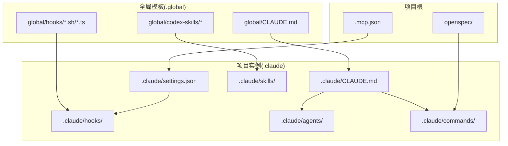
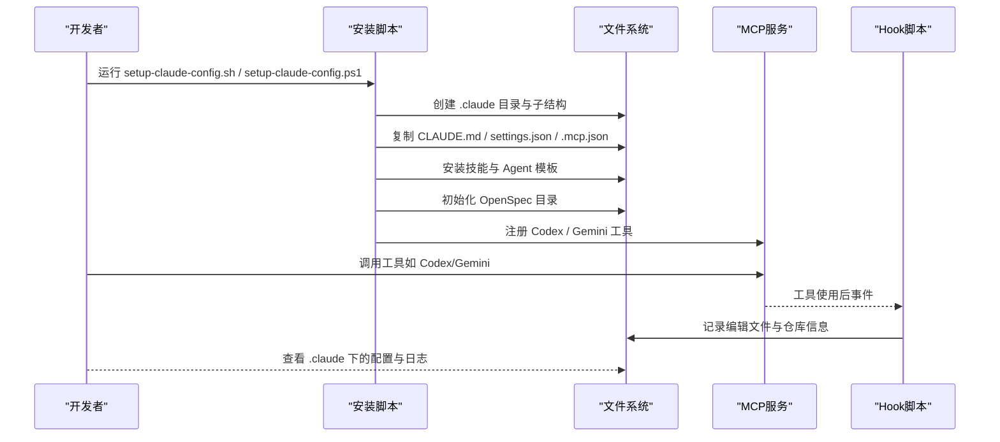
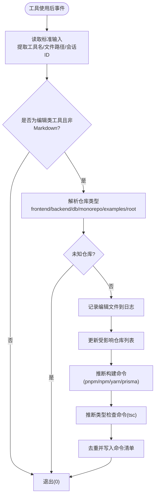
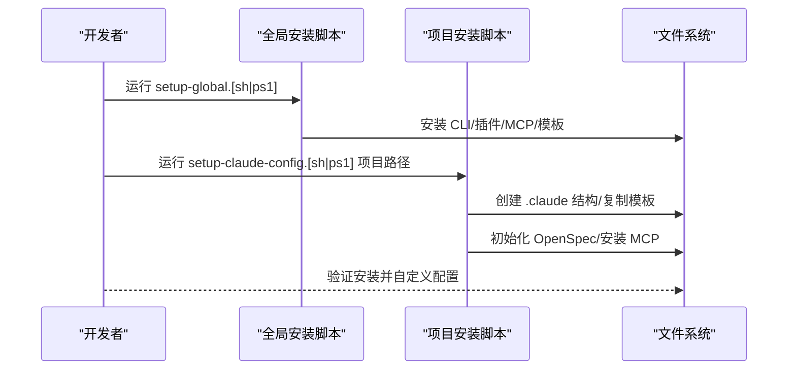
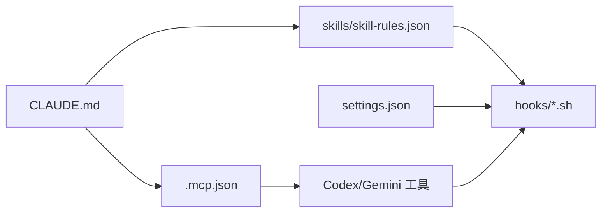

# 配置管理系统

<cite>
**本文引用的文件**
- [CLAUDE.md](file://CLAUDE.md)
- [global/CLAUDE.md](file://global/CLAUDE.md)
- [.mcp.json](file://.mcp.json)
- [settings.json](file://settings.json)
- [setup-claude-config.ps1](file://setup-claude-config.ps1)
- [setup-claude-config.sh](file://setup-claude-config.sh)
- [setup-global.ps1](file://setup-global.ps1)
- [setup-global.sh](file://setup-global.sh)
- [hooks/skill-activation-prompt.sh](file://hooks/skill-activation-prompt.sh)
- [hooks/post-tool-use-tracker.sh](file://hooks/post-tool-use-tracker.sh)
- [skills/skill-rules.json](file://skills/skill-rules.json)
- [skills/dev-workflow/SKILL.md](file://skills/dev-workflow/SKILL.md)
- [skills/git-workflow/SKILL.md](file://skills/git-workflow/SKILL.md)
- [skills/python-backend-guidelines/SKILL.md](file://skills/python-backend-guidelines/SKILL.md)
</cite>

## 目录
1. [简介](#简介)
2. [项目结构](#项目结构)
3. [核心组件](#核心组件)
4. [架构总览](#架构总览)
5. [详细组件分析](#详细组件分析)
6. [依赖关系分析](#依赖关系分析)
7. [性能考虑](#性能考虑)
8. [故障排查指南](#故障排查指南)
9. [结论](#结论)
10. [附录](#附录)

## 简介
本文件系统性阐述配置管理系统的层级结构与管理机制，覆盖全局配置与项目级配置的组织方式、CLAUDE.md 的作用与规则、MCP 工具配置、Hook 机制、以及在不同环境中的部署与迁移策略。系统以“多 AI 协同 + SDD 工作流”为核心理念，通过脚本化安装与模板化配置，实现跨平台、可迁移、可扩展的工程化配置体系。

## 项目结构
系统采用“全局模板 + 项目实例”的双层配置结构：
- 全局配置（~/.claude/ 或 %USERPROFILE%\.claude\)：存放全局 CLAUDE.md、全局 Hook、全局插件与模板，作为新项目的基础模板来源。
- 项目配置（your-project/.claude/）：项目内实际生效的配置，包含 CLAUDE.md、技能规则、Hook、Agent、OpenSpec 命令等。
- MCP 工具配置（.mcp.json）：定义 Codex 与 Gemini 的连接方式与参数。
- Hook 机制：在用户提示提交、工具使用后等事件点执行脚本，实现自动化追踪与提示。

**图表来源**
- [global/CLAUDE.md](file://global/CLAUDE.md#L1-L147)
- [CLAUDE.md](file://CLAUDE.md#L1-L440)
- [.mcp.json](file://.mcp.json#L1-L19)
- [settings.json](file://settings.json#L1-L37)

**章节来源**
- [CLAUDE.md](file://CLAUDE.md#L1-L440)
- [global/CLAUDE.md](file://global/CLAUDE.md#L1-L147)
- [.mcp.json](file://.mcp.json#L1-L19)
- [settings.json](file://settings.json#L1-L37)

## 核心组件
- CLAUDE.md（全局与项目级）
  - 全局 CLAUDE.md：定义跨项目的通用协作规则、工具使用规范、项目结构约定与语言规范。
  - 项目 CLAUDE.md：在项目范围内细化角色分工、工作流、交叉检查规则与 OpenSpec 规范。
- MCP 工具配置（.mcp.json）
  - 定义 Codex 与 Gemini 的启动方式、参数与环境变量，支持 stdio 传输。
- Hook 机制（settings.json + hooks/*.sh）
  - 在用户提交提示、工具使用后等事件点执行脚本，实现技能激活提示与编辑文件追踪。
- 技能规则（skills/skill-rules.json）
  - 定义技能触发关键词、意图正则、文件路径匹配与排除规则，支持多 AI 协同。
- OpenSpec（openspec/）
  - 项目内规范目录，提供提案、评审、实现、归档的完整工作流。

**章节来源**
- [CLAUDE.md](file://CLAUDE.md#L1-L440)
- [global/CLAUDE.md](file://global/CLAUDE.md#L1-L147)
- [.mcp.json](file://.mcp.json#L1-L19)
- [settings.json](file://settings.json#L1-L37)
- [skills/skill-rules.json](file://skills/skill-rules.json#L1-L250)

## 架构总览
系统通过安装脚本将模板复制到项目与全局目录，建立统一的配置骨架；随后通过 MCP 工具与 Hook 机制实现多 AI 协同与自动化运维。

**图表来源**
- [setup-claude-config.sh](file://setup-claude-config.sh#L1-L372)
- [setup-claude-config.ps1](file://setup-claude-config.ps1#L1-L385)
- [.mcp.json](file://.mcp.json#L1-L19)
- [settings.json](file://settings.json#L1-L37)
- [hooks/post-tool-use-tracker.sh](file://hooks/post-tool-use-tracker.sh#L1-L178)

## 详细组件分析

### CLAUDE.md：全局与项目级规则
- 全局 CLAUDE.md
  - 规定项目结构约定（虚拟环境、日志目录、测试目录）、记忆系统使用规则、工具使用默认行为、多 AI 协同角色与交叉检查规则、Superpowers 插件使用清单与语言规范。
- 项目 CLAUDE.md
  - 强化 OpenSpec 工作流（提案、实现、归档），明确角色分工（Claude、Codex、Gemini），定义前后端开发流程、交叉检查策略、语言规范与项目结构规则。
- 两者关系
  - 项目 CLAUDE.md 优先于全局 CLAUDE.md 生效；全局 CLAUDE.md 作为模板与基线，项目 CLAUDE.md 用于定制化。

**章节来源**
- [global/CLAUDE.md](file://global/CLAUDE.md#L1-L147)
- [CLAUDE.md](file://CLAUDE.md#L1-L440)

### MCP 工具配置：Codex 与 Gemini
- .mcp.json
  - 定义两个 MCP 服务器：codex（stdio 传输，命令为 codex mcp-server）、gemini-cli（npx 启动 gemini-mcp-tool）。
  - 支持在项目级与用户级注册，便于多项目共享或隔离。
- 使用方式
  - 通过 claude mcp list/list user/project 查看状态。
  - 在 CLAUDE.md 中约定工具调用时机与参数规范，避免滥用。

**章节来源**
- [.mcp.json](file://.mcp.json#L1-L19)
- [CLAUDE.md](file://CLAUDE.md#L359-L391)

### Hook 机制：事件驱动的自动化
- settings.json
  - 定义钩子事件与执行命令：UserPromptSubmit（技能激活提示）、PostToolUse（工具使用后追踪）。
  - 通过 type: command 指定脚本路径，支持基于匹配器的过滤（如 Edit|MultiEdit|Write）。
- 脚本职责
  - skill-activation-prompt.sh：将标准输入传递给 TypeScript 脚本，生成技能激活提示。
  - post-tool-use-tracker.sh：记录编辑文件、识别仓库、收集构建与类型检查命令，写入缓存目录，便于后续构建与校验。

**图表来源**
- [settings.json](file://settings.json#L13-L35)
- [hooks/post-tool-use-tracker.sh](file://hooks/post-tool-use-tracker.sh#L1-L178)

**章节来源**
- [settings.json](file://settings.json#L1-L37)
- [hooks/skill-activation-prompt.sh](file://hooks/skill-activation-prompt.sh#L1-L6)
- [hooks/post-tool-use-tracker.sh](file://hooks/post-tool-use-tracker.sh#L1-L178)

### 技能规则：智能触发与多 AI 协同
- skills/skill-rules.json
  - 定义技能类型（domain）、执行策略（suggest/block/warn）、优先级（critical/high/medium/low）。
  - promptTriggers：关键词与意图正则，支持灵活匹配用户意图。
  - fileTriggers：路径模式与内容模式，结合排除规则，精准定位触发时机。
  - 为多 AI 协同提供基础：Claude 根据规则决定何时调用 Codex/Gemini，确保“先思考、再验证”。

**章节来源**
- [skills/skill-rules.json](file://skills/skill-rules.json#L1-L250)

### OpenSpec：规范驱动的 SDD 工作流
- 目录结构
  - openspec/specs：已构建能力的规范。
  - openspec/changes：待变更的提案与变更 delta。
  - openspec/changes/archive：已完成归档。
- 工作流
  - Proposal → Review → Implement → Archive，与 CLAUDE.md 的 OpenSpec 规则对齐。
- 项目集成
  - 安装脚本可自动初始化 openspec/ 目录并注入命令，便于在项目中落地。

**章节来源**
- [CLAUDE.md](file://CLAUDE.md#L285-L307)
- [setup-claude-config.sh](file://setup-claude-config.sh#L200-L234)
- [setup-claude-config.ps1](file://setup-claude-config.ps1#L188-L242)

### 安装与部署脚本：跨平台配置
- setup-global.sh / setup-global.ps1
  - 在新机器上安装 Claude Code、Codex、Gemini CLI，同步全局 CLAUDE.md、插件、MCP 工具、Codex 技能与 Gemini 配置，安装全局 Hook。
- setup-claude-config.sh / setup-claude-config.ps1
  - 在项目中部署 .claude 目录结构、CLAUDE.md、技能、Agent、OpenSpec、MCP 配置与 settings.json 模板，支持自动验证与后续手动合并。

**图表来源**
- [setup-global.sh](file://setup-global.sh#L1-L471)
- [setup-global.ps1](file://setup-global.ps1#L1-L470)
- [setup-claude-config.sh](file://setup-claude-config.sh#L1-L372)
- [setup-claude-config.ps1](file://setup-claude-config.ps1#L1-L385)

**章节来源**
- [setup-global.sh](file://setup-global.sh#L1-L471)
- [setup-global.ps1](file://setup-global.ps1#L1-L470)
- [setup-claude-config.sh](file://setup-claude-config.sh#L1-L372)
- [setup-claude-config.ps1](file://setup-claude-config.ps1#L1-L385)

### 技能模板与自定义选项
- 技能模板
  - dev-workflow：严格阶段顺序（需求 → 设计 → 实现 → 评审 → 测试 → 完成），目录约定与文档模板。
  - git-workflow：分支命名、提交规范、预提交检查、合并流程与冲突处理。
  - python-backend-guidelines：FastAPI/Django 最佳实践、分层架构、Pydantic/ORM/异常处理、Sentry 集成。
- 自定义选项
  - skills/skill-rules.json：调整关键词、意图正则、文件路径模式与排除规则，适配项目结构。
  - CLAUDE.md：在项目层面细化角色分工、工作流与交叉检查策略。

**章节来源**
- [skills/dev-workflow/SKILL.md](file://skills/dev-workflow/SKILL.md#L1-L397)
- [skills/git-workflow/SKILL.md](file://skills/git-workflow/SKILL.md#L1-L440)
- [skills/python-backend-guidelines/SKILL.md](file://skills/python-backend-guidelines/SKILL.md#L1-L596)
- [skills/skill-rules.json](file://skills/skill-rules.json#L1-L250)

## 依赖关系分析
- 组件耦合
  - CLAUDE.md 与 MCP 工具配置强关联：工具调用时机与参数由 CLAUDE.md 规定，.mcp.json 提供具体实现。
  - Hook 与 settings.json：settings.json 定义事件与命令，hooks/*.sh 实现具体逻辑。
  - 技能规则与多 AI 协同：skill-rules.json 决定触发策略，CLAUDE.md 决定何时调用工具。
- 外部依赖
  - Node.js（≥20）：安装 CLI 与 OpenSpec。
  - Python：JSON 校验与部分脚本运行。
  - uv（可选）：Codex MCP 启动器。
  - npm：安装 MCP 工具与 Hook 依赖。

**图表来源**
- [CLAUDE.md](file://CLAUDE.md#L1-L440)
- [.mcp.json](file://.mcp.json#L1-L19)
- [skills/skill-rules.json](file://skills/skill-rules.json#L1-L250)
- [settings.json](file://settings.json#L1-L37)

**章节来源**
- [CLAUDE.md](file://CLAUDE.md#L1-L440)
- [.mcp.json](file://.mcp.json#L1-L19)
- [settings.json](file://settings.json#L1-L37)

## 性能考虑
- Hook 执行成本
  - post-tool-use-tracker.sh 会对每个编辑文件进行仓库识别与命令推断，建议在 monorepo 场景下合理配置路径模式，减少误判与重复计算。
- 技能触发频率
  - skill-rules.json 的意图正则与文件模式应尽量精确，避免过度触发导致不必要的技能加载。
- MCP 工具响应
  - .mcp.json 中的命令与参数需优化，避免频繁重启或阻塞；必要时使用缓存与增量构建命令。

## 故障排查指南
- 安装失败
  - Node.js 版本不足：确保版本 ≥ 20。
  - Python/uv 缺失：按脚本提示安装相应工具。
  - 权限问题：确保脚本具备执行权限（chmod +x）。
- MCP 工具不可用
  - 使用 claude mcp list 检查注册状态；若缺失，按 .mcp.json 配置重新添加。
- Hook 未执行
  - 检查 settings.json 中的事件与命令配置；确认 hooks/*.sh 可执行且路径正确。
- OpenSpec 初始化失败
  - 确保全局安装了 @fission-ai/openspec；在项目中执行 openspec init 或使用安装脚本自动初始化。

**章节来源**
- [setup-claude-config.sh](file://setup-claude-config.sh#L47-L52)
- [setup-claude-config.ps1](file://setup-claude-config.ps1#L22-L31)
- [setup-global.sh](file://setup-global.sh#L46-L76)
- [setup-global.ps1](file://setup-global.ps1#L22-L51)
- [settings.json](file://settings.json#L13-L35)

## 结论
本配置管理系统通过“全局模板 + 项目实例”的双层结构，结合 CLAUDE.md 的规则、MCP 工具与 Hook 机制，实现了跨平台、可迁移、可扩展的工程化配置体系。安装脚本自动化部署，技能规则与 OpenSpec 工作流保障开发过程的规范性与可追溯性。建议在新机器与项目迁移场景中，优先使用提供的安装脚本，并根据项目特点定制 CLAUDE.md、skill-rules.json 与 Hook 脚本，以获得最佳的多 AI 协同体验。

## 附录
- 配置文件组织清单
  - 全局：~/.claude/CLAUDE.md、~/.claude/hooks/、~/.codex/skills/、~/.gemini/GEMINI.md
  - 项目：your-project/.claude/（CLAUDE.md、settings.json、hooks、skills、agents、commands）
  - 根目录：.mcp.json、openspec/
- 部署与迁移建议
  - 新机器：运行 setup-global.[sh|ps1] 完成全局配置与工具安装。
  - 项目部署：运行 setup-claude-config.[sh|ps1] 生成 .claude 目录与模板，随后自定义 CLAUDE.md 与 skill-rules.json。
  - 配置同步：将 .claude 与 .mcp.json 版本化管理，配合安装脚本在新环境快速还原。