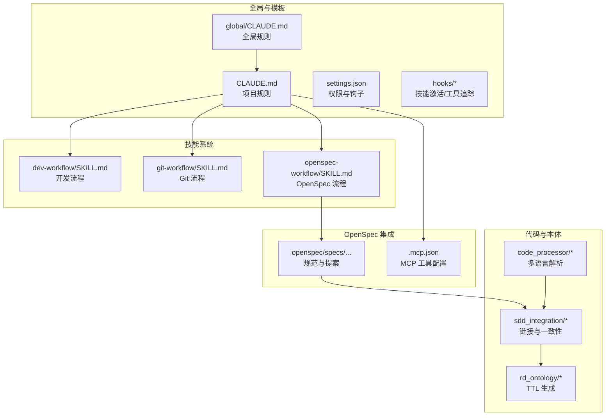
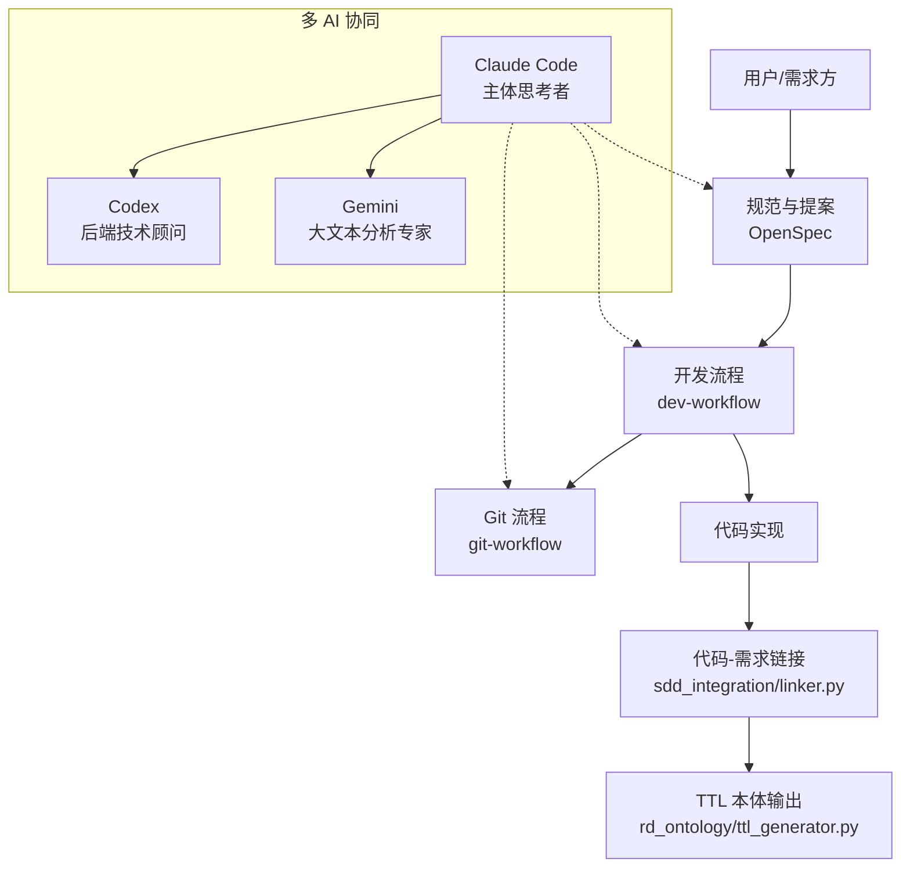
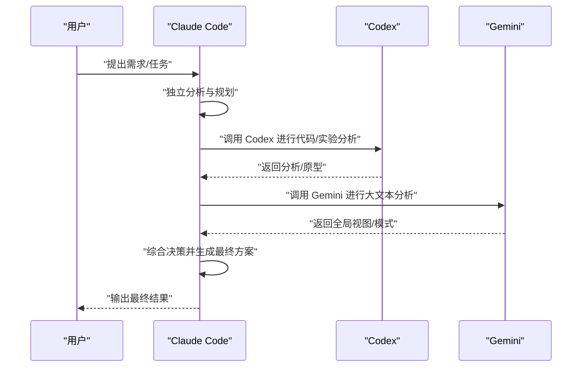
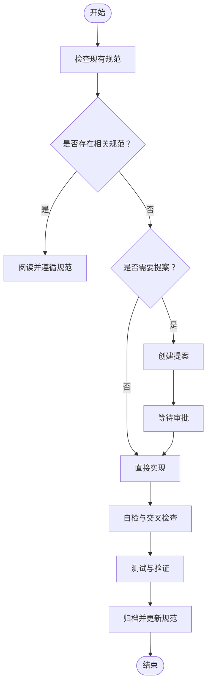
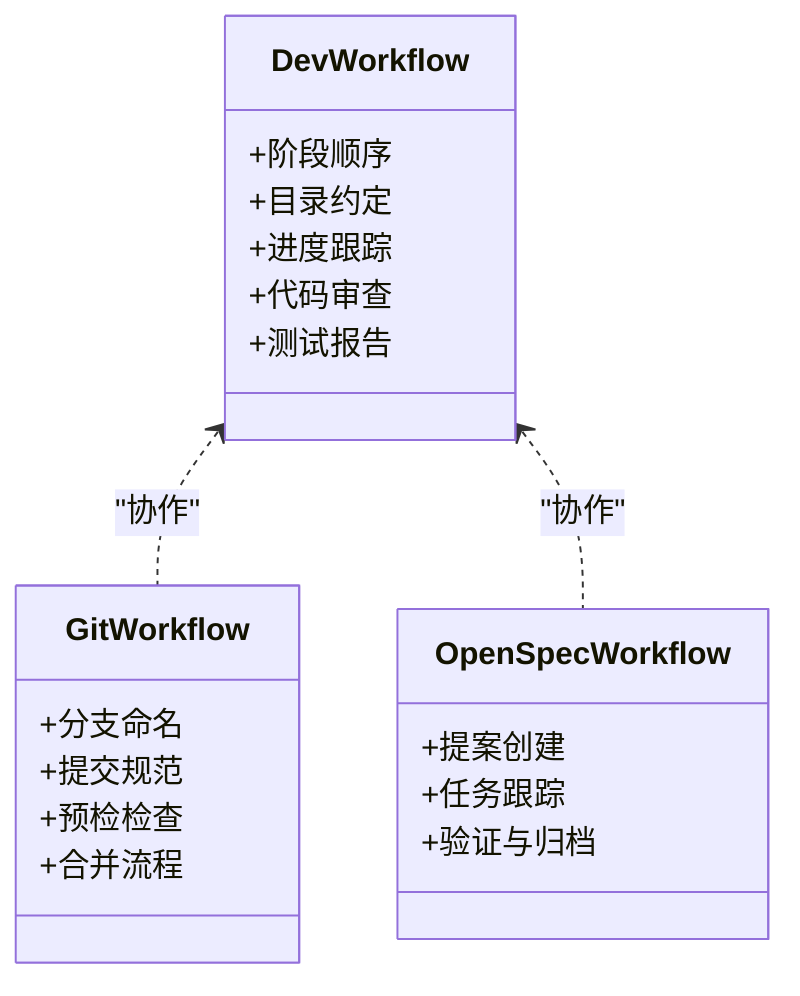
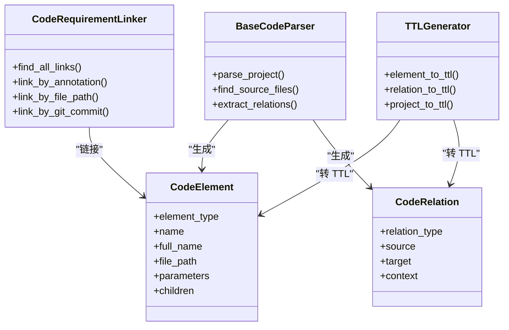
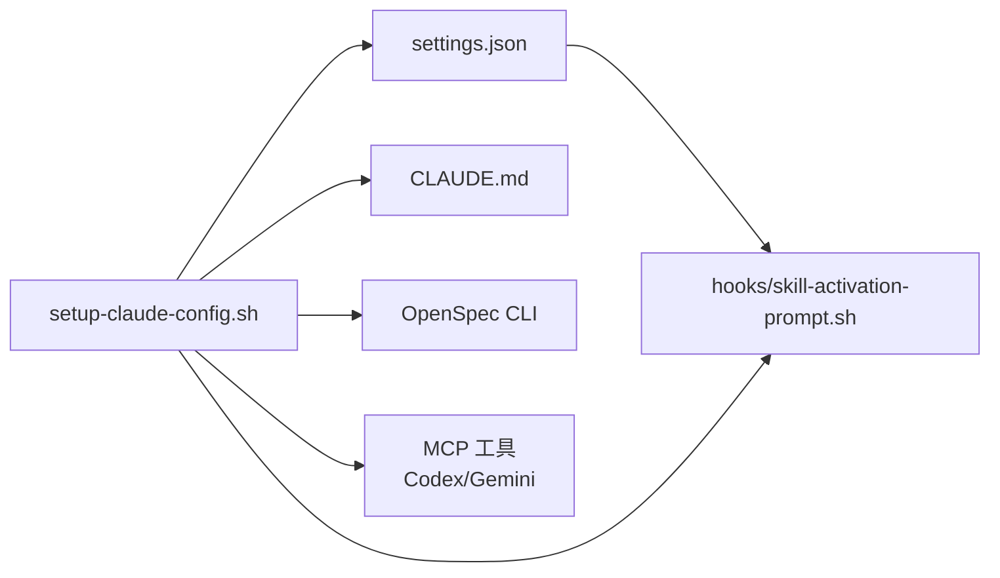

# 项目介绍

<cite>
**本文档引用的文件**
- [README.md](file://README.md)
- [CLAUDE.md](file://CLAUDE.md)
- [AGENTS.md](file://AGENTS.md)
- [global/CLAUDE.md](file://global/CLAUDE.md)
- [docs/sdd.md](file://docs/sdd.md)
- [skills/dev-workflow/SKILL.md](file://skills/dev-workflow/SKILL.md)
- [skills/git-workflow/SKILL.md](file://skills/git-workflow/SKILL.md)
- [skills/openspec-workflow/SKILL.md](file://skills/openspec-workflow/SKILL.md)
- [settings.json](file://settings.json)
- [setup-claude-config.sh](file://setup-claude-config.sh)
- [hooks/skill-activation-prompt.sh](file://hooks/skill-activation-prompt.sh)
- [openspec/specs/claudecode-openspec-integration/spec.md](file://openspec/specs/claudecode-openspec-integration/spec.md)
- [code_processor/base_parser.py](file://code_processor/base_parser.py)
- [sdd_integration/linker.py](file://sdd_integration/linker.py)
- [rd_ontology/ttl_generator.py](file://rd_ontology/ttl_generator.py)
</cite>

## 目录
1. [简介](#简介)
2. [项目结构](#项目结构)
3. [核心组件](#核心组件)
4. [架构总览](#架构总览)
5. [详细组件分析](#详细组件分析)
6. [依赖关系分析](#依赖关系分析)
7. [性能考量](#性能考量)
8. [故障排查指南](#故障排查指南)
9. [结论](#结论)
10. [附录](#附录)

## 简介
ontologyDevOS 是一个面向多 AI 协同与规范驱动开发（SDD）的工程化框架，旨在通过“规范先行、工具互补、流程闭环”的方式，显著提升复杂项目在多模型协作下的交付质量与效率。项目围绕以下核心价值主张展开：
- 多 AI 协同：以 Claude Code 为核心协调者，结合 Codex（后端技术顾问）与 Gemini（大文本分析专家）形成“三位一体”的智能协作闭环，避免单一模型能力边界带来的局限。
- 规范驱动开发（SDD）：以 OpenSpec 为工作流内核，将“提案→审查→实现→归档”的规范流程嵌入到开发全过程，确保每次变更都有据可依、可回溯、可审计。
- 可复用技能系统：提供标准化的开发、Git、OpenSpec 工作流等可复用技能模板，降低团队在不同项目间的迁移成本。
- 工程化集成：通过一键部署脚本、MCP 工具链、Hook 机制与配置模板，实现从全局到项目的无缝落地。

与传统开发方式相比，ontologyDevOS 的创新之处在于：
- 从“凭感觉写代码”转向“按规范写代码”，通过 OpenSpec 的提案与任务清单，将需求与实现解耦，减少返工与歧义。
- 从“单模型孤岛”转向“多模型协同”，通过 MCP 协议与全局规则，让 Claude 在关键节点自动决策调用 Codex 或 Gemini，实现“一个入口，多重能力”。
- 从“事后审查”转向“过程控制”，通过技能系统与阶段化流程，将质量门禁前移，贯穿需求、设计、实现、审查与测试的全流程。

## 项目结构
项目采用“模板 + 工具 + 集成”的分层组织方式：
- 全局模板与配置：提供 CLAUDE.md、settings.json、hooks 等全局规则与自动化钩子，确保多项目一致性。
- 技能系统：dev-workflow、git-workflow、openspec-workflow 等技能，定义可复用的开发流程与最佳实践。
- OpenSpec 集成：提供规范驱动的提案、任务与归档流程，与 Claude 的工作流深度融合。
- 代码与本体：code_processor 提供多语言解析能力，sdd_integration 提供代码与需求的链接能力，rd_ontology 提供 TTL 本体输出，支撑研发知识图谱与可追溯性。
- 部署与自动化：setup-claude-config.sh 一键部署到任意项目，hooks 提供技能激活与工具使用后的追踪。

**图表来源**
- [global/CLAUDE.md](file://global/CLAUDE.md#L1-L147)
- [CLAUDE.md](file://CLAUDE.md#L1-L440)
- [settings.json](file://settings.json#L1-L37)
- [hooks/skill-activation-prompt.sh](file://hooks/skill-activation-prompt.sh#L1-L6)
- [skills/dev-workflow/SKILL.md](file://skills/dev-workflow/SKILL.md#L1-L397)
- [skills/git-workflow/SKILL.md](file://skills/git-workflow/SKILL.md#L1-L440)
- [skills/openspec-workflow/SKILL.md](file://skills/openspec-workflow/SKILL.md#L1-L231)
- [openspec/specs/claudecode-openspec-integration/spec.md](file://openspec/specs/claudecode-openspec-integration/spec.md#L1-L54)
- [code_processor/base_parser.py](file://code_processor/base_parser.py#L1-L358)
- [sdd_integration/linker.py](file://sdd_integration/linker.py#L1-L324)
- [rd_ontology/ttl_generator.py](file://rd_ontology/ttl_generator.py#L1-L321)

**章节来源**
- [README.md](file://README.md#L71-L92)
- [setup-claude-config.sh](file://setup-claude-config.sh#L1-L372)

## 核心组件
- 多 AI 协同规则（CLAUDE.md）：定义 Claude 作为主体思考者与决策者，Codex 与 Gemini 作为交叉验证与扩展思路的顾问，明确工具调用时机与职责边界。
- 规范驱动工作流（OpenSpec）：通过提案、任务与归档的三阶段流程，确保每次变更都有明确的规范依据与可验证的实现路径。
- 技能系统（Skills）：提供开发流程、Git 流程与 OpenSpec 工作流等可复用模板，降低学习与迁移成本。
- 工具与钩子（MCP + Hooks）：通过 .mcp.json 与 hooks 实现工具自动注入与使用追踪，保障流程可控与可观测。
- 代码与本体（解析与链接）：提供多语言代码解析、代码与需求链接、TTL 本体生成，支撑研发知识图谱与可追溯性。

**章节来源**
- [CLAUDE.md](file://CLAUDE.md#L26-L125)
- [skills/dev-workflow/SKILL.md](file://skills/dev-workflow/SKILL.md#L28-L50)
- [skills/git-workflow/SKILL.md](file://skills/git-workflow/SKILL.md#L27-L52)
- [skills/openspec-workflow/SKILL.md](file://skills/openspec-workflow/SKILL.md#L48-L67)
- [settings.json](file://settings.json#L13-L35)
- [code_processor/base_parser.py](file://code_processor/base_parser.py#L206-L298)
- [sdd_integration/linker.py](file://sdd_integration/linker.py#L35-L68)
- [rd_ontology/ttl_generator.py](file://rd_ontology/ttl_generator.py#L18-L60)

## 架构总览
下图展示了从“需求与规范”到“代码实现与本体”的端到端架构，体现多 AI 协同与规范驱动的闭环：

**图表来源**
- [docs/sdd.md](file://docs/sdd.md#L80-L186)
- [openspec/specs/claudecode-openspec-integration/spec.md](file://openspec/specs/claudecode-openspec-integration/spec.md#L1-L54)
- [sdd_integration/linker.py](file://sdd_integration/linker.py#L35-L68)
- [rd_ontology/ttl_generator.py](file://rd_ontology/ttl_generator.py#L176-L228)

## 详细组件分析

### 多 AI 协同机制
- 角色分工：Claude 作为主体思考者与最终决策者，负责理解目标、拆分工作、决定何时调用 Codex 或 Gemini；Codex 专注后端代码与复杂算法的交叉检查；Gemini 专注大文本分析与全局视图。
- 工具调用规则：对于非平凡任务，Claude 必须在给出最终答案前，先自问“Codex 能否帮助编码/实验？”“Gemini 能否帮助大文本分析？”，并在需要时调用相应工具。
- 交叉检查：在完成功能模块、提交代码前或发现潜在问题时，执行交叉检查，确保实现符合设计文档与最佳实践。

**图表来源**
- [CLAUDE.md](file://CLAUDE.md#L102-L125)
- [CLAUDE.md](file://CLAUDE.md#L176-L187)

**章节来源**
- [CLAUDE.md](file://CLAUDE.md#L128-L187)
- [global/CLAUDE.md](file://global/CLAUDE.md#L60-L95)

### 规范驱动开发（SDD）工作流
- 三阶段工作流：提案（REQUIREMENT + DESIGN）→ 实现（IMPLEMENTATION + REVIEW + TESTING）→ 归档（DONE）。
- OpenSpec 集成：通过斜杠命令与 CLI 工具，实现提案创建、任务跟踪、规范验证与归档。
- 实现前检查：在开始任何非平凡实现任务之前，检查现有规范与进行中的变更，决定是否需要创建提案。

**图表来源**
- [skills/openspec-workflow/SKILL.md](file://skills/openspec-workflow/SKILL.md#L48-L67)
- [openspec/specs/claudecode-openspec-integration/spec.md](file://openspec/specs/claudecode-openspec-integration/spec.md#L8-L54)

**章节来源**
- [skills/openspec-workflow/SKILL.md](file://skills/openspec-workflow/SKILL.md#L16-L23)
- [openspec/specs/claudecode-openspec-integration/spec.md](file://openspec/specs/claudecode-openspec-integration/spec.md#L1-L54)

### 技能系统架构
- 开发流程技能：严格阶段顺序（需求→设计→实现→审查→测试），目录约定与进度跟踪，确保每个阶段有据可依。
- Git 流程技能：标准化分支命名、提交信息、预提交检查与合并流程，降低协作成本。
- OpenSpec 工作流技能：与 OpenSpec CLI 深度集成，提供提案创建、任务跟踪与归档的完整流程。

**图表来源**
- [skills/dev-workflow/SKILL.md](file://skills/dev-workflow/SKILL.md#L28-L50)
- [skills/git-workflow/SKILL.md](file://skills/git-workflow/SKILL.md#L27-L52)
- [skills/openspec-workflow/SKILL.md](file://skills/openspec-workflow/SKILL.md#L16-L23)

**章节来源**
- [skills/dev-workflow/SKILL.md](file://skills/dev-workflow/SKILL.md#L8-L34)
- [skills/git-workflow/SKILL.md](file://skills/git-workflow/SKILL.md#L8-L15)
- [skills/openspec-workflow/SKILL.md](file://skills/openspec-workflow/SKILL.md#L8-L15)

### OpenSpec 集成
- 自动提案触发：根据关键词、影响范围与不确定性，自动判断是否需要创建提案。
- 命令集成：提供斜杠命令与 CLI，简化提案创建、应用与归档流程。
- 规范一致性：实现完成后对照规范进行一致性检查，确保实现与需求一致。

**章节来源**
- [openspec/specs/claudecode-openspec-integration/spec.md](file://openspec/specs/claudecode-openspec-integration/spec.md#L21-L54)
- [skills/openspec-workflow/SKILL.md](file://skills/openspec-workflow/SKILL.md#L190-L201)

### 代码与本体（解析、链接与 TTL 生成）
- 多语言解析：抽象基类定义统一接口，支持 Java、Python、JavaScript/TypeScript 等语言的元素与关系抽取。
- 代码-需求链接：通过注解、文件路径与 Git 提交信息等方式，将代码元素与 OpenSpec 的需求/任务进行链接。
- TTL 本体生成：将代码元素、关系与需求/设计/任务转换为 TTL 三元组，支撑研发知识图谱与可追溯性。

**图表来源**
- [code_processor/base_parser.py](file://code_processor/base_parser.py#L206-L298)
- [sdd_integration/linker.py](file://sdd_integration/linker.py#L35-L68)
- [rd_ontology/ttl_generator.py](file://rd_ontology/ttl_generator.py#L18-L60)

**章节来源**
- [code_processor/base_parser.py](file://code_processor/base_parser.py#L17-L80)
- [sdd_integration/linker.py](file://sdd_integration/linker.py#L23-L68)
- [rd_ontology/ttl_generator.py](file://rd_ontology/ttl_generator.py#L176-L228)

## 依赖关系分析
- 配置与钩子：settings.json 定义权限与钩子，skill-activation-prompt.sh 作为技能激活钩子入口，确保每次工具使用后进行追踪。
- 部署脚本：setup-claude-config.sh 负责创建 .claude 目录结构、安装技能、复制 CLAUDE.md、安装 OpenSpec 与 MCP 工具，并进行验证。
- OpenSpec 与 MCP：通过 .mcp.json 或 claude mcp add 命令安装 Codex 与 Gemini，确保多 AI 协同可用。

**图表来源**
- [settings.json](file://settings.json#L13-L35)
- [hooks/skill-activation-prompt.sh](file://hooks/skill-activation-prompt.sh#L1-L6)
- [setup-claude-config.sh](file://setup-claude-config.sh#L60-L185)

**章节来源**
- [settings.json](file://settings.json#L1-L37)
- [setup-claude-config.sh](file://setup-claude-config.sh#L1-L372)

## 性能考量
- 代码解析性能：BaseCodeParser 在解析大型项目时，建议排除不必要的目录（如 .git、node_modules、venv 等），并分批处理文件以降低内存占用。
- 链接准确性：CodeRequirementLinker 通过注解、文件路径与 Git 提交信息进行多源链接，建议在任务文件较多时优先使用文件路径匹配，以提高准确率。
- TTL 生成：TTLGenerator 对长文档字符串进行截断，避免 TTL 文件过大；同时缓存元素 IRIs，减少重复计算。

[本节为通用指导，无需特定文件引用]

## 故障排查指南
- 工具安装失败：确认 Node.js 版本满足要求（≥20），并检查 claude mcp list 输出以确认工具可用性。
- JSON 配置错误：使用 Python 的 JSON 工具验证 .claude/skills/skill-rules.json 与 .claude/settings.json 的语法正确性。
- 权限与钩子：若技能激活或工具使用追踪失败，检查 hooks 的可执行权限与环境变量（如 CLAUDE_PROJECT_DIR）。
- OpenSpec 初始化：若 openspec init 失败，手动执行 openspec init 并选择 Claude Code 作为工具，随后在项目中创建 openspec/ 目录结构。

**章节来源**
- [setup-claude-config.sh](file://setup-claude-config.sh#L197-L233)
- [setup-claude-config.sh](file://setup-claude-config.sh#L296-L315)
- [hooks/skill-activation-prompt.sh](file://hooks/skill-activation-prompt.sh#L1-L6)

## 结论
ontologyDevOS 通过“多 AI 协同 + 规范驱动开发 + 技能系统 + 工具链集成”的工程化框架，为复杂项目的高质量交付提供了系统化的解决方案。它不仅提升了开发效率与代码质量，更重要的是建立了可复用、可追溯、可审计的工程能力，帮助团队在多模型协作时代实现“写得对、写得好、写得稳”。

[本节为总结性内容，无需特定文件引用]

## 附录
- 快速开始：参考 README 的“快速开始”章节，按平台执行一键部署脚本，完成全局与项目级配置。
- 目标用户：适合希望在复杂业务场景中实现高质量、可追溯交付的研发团队，尤其是需要多模型协作与规范约束的项目。

**章节来源**
- [README.md](file://README.md#L12-L70)