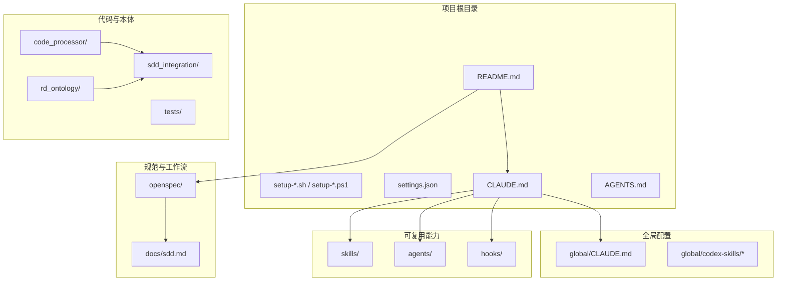
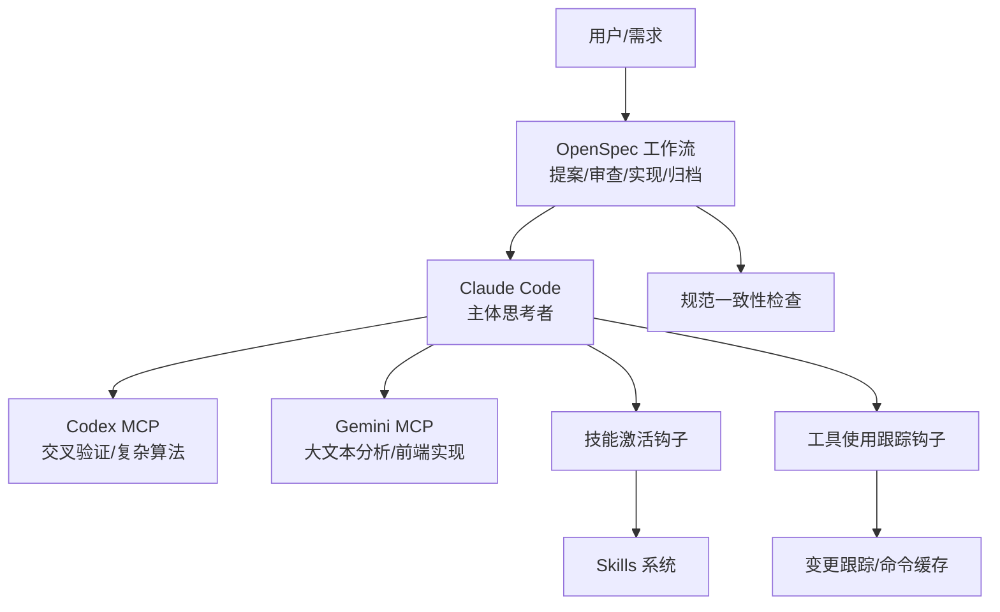
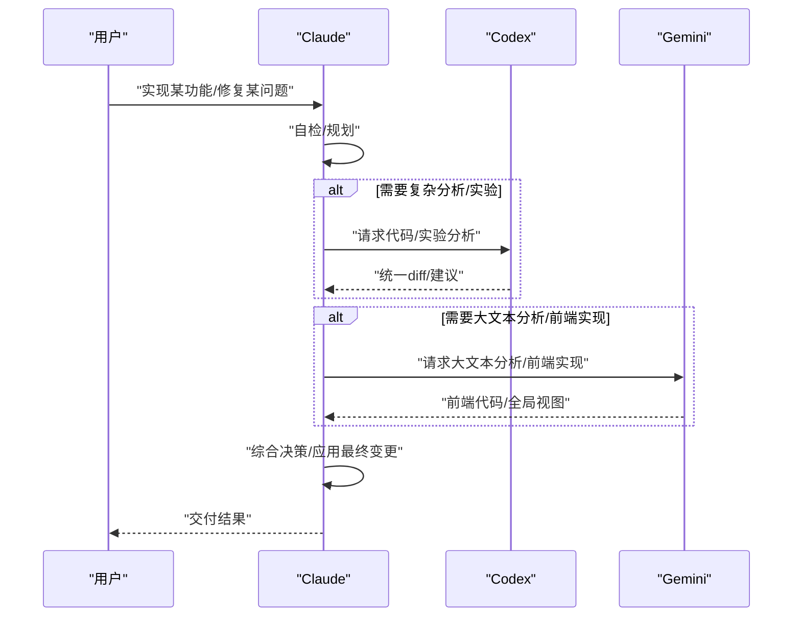
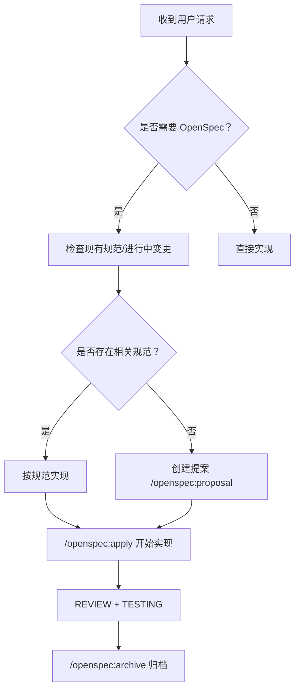
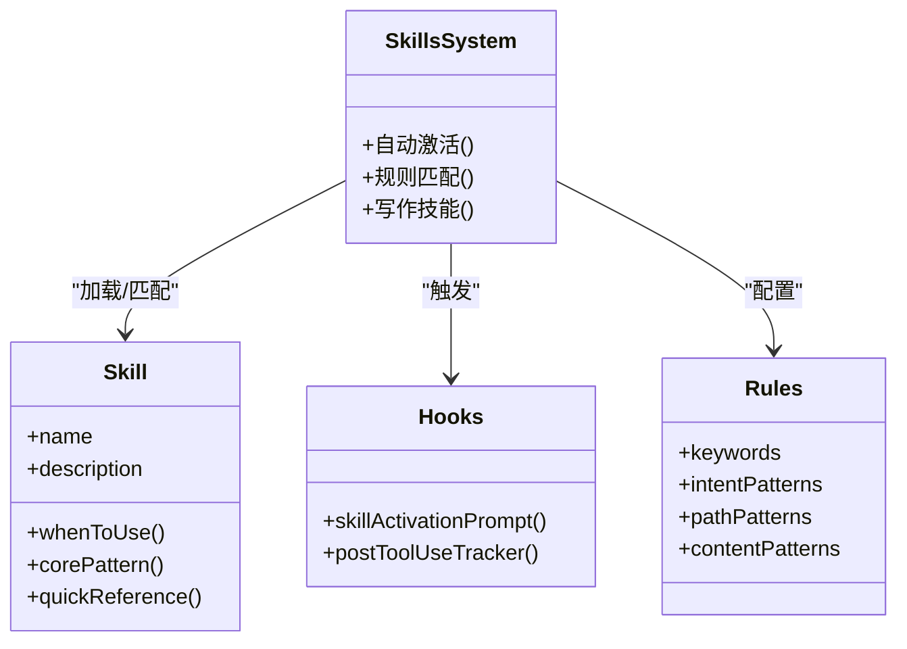
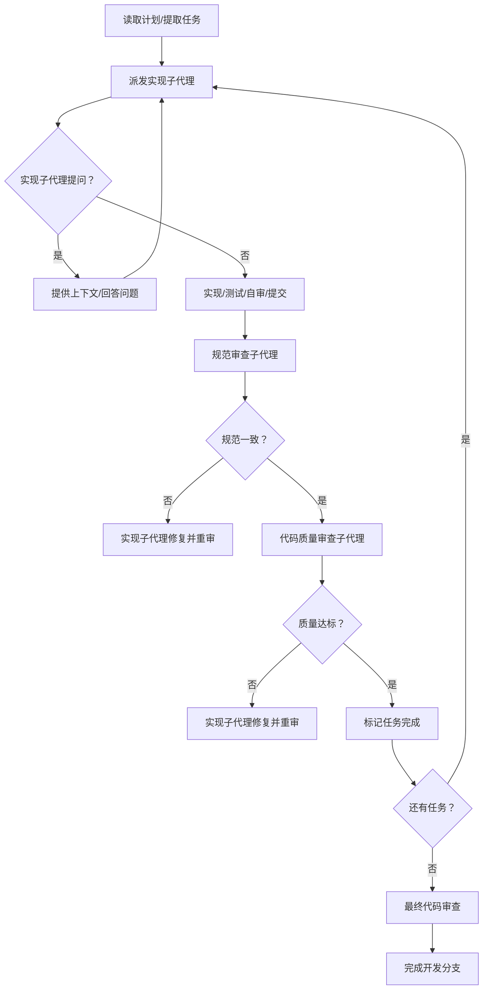
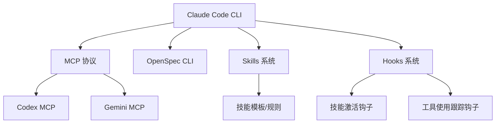

# 项目概述

<cite>
**本文档引用的文件**
- [README.md](file://README.md)
- [CLAUDE.md](file://CLAUDE.md)
- [AGENTS.md](file://AGENTS.md)
- [settings.json](file://settings.json)
- [skills/README.md](file://skills/README.md)
- [global/CLAUDE.md](file://global/CLAUDE.md)
- [hooks/skill-activation-prompt.sh](file://hooks/skill-activation-prompt.sh)
- [hooks/post-tool-use-tracker.sh](file://hooks/post-tool-use-tracker.sh)
- [global/codex-skills/using-superpowers/SKILL.md](file://global/codex-skills/using-superpowers/SKILL.md)
- [global/codex-skills/writing-skills/SKILL.md](file://global/codex-skills/writing-skills/SKILL.md)
- [global/codex-skills/subagent-driven-development/SKILL.md](file://global/codex-skills/subagent-driven-development/SKILL.md)
- [openspec/specs/claudecode-openspec-integration/spec.md](file://openspec/specs/claudecode-openspec-integration/spec.md)
- [openspec/project.md](file://openspec/project.md)
- [docs/sdd.md](file://docs/sdd.md)
</cite>

## 目录
1. [简介](#简介)
2. [项目结构](#项目结构)
3. [核心组件](#核心组件)
4. [架构总览](#架构总览)
5. [详细组件分析](#详细组件分析)
6. [依赖关系分析](#依赖关系分析)
7. [性能考量](#性能考量)
8. [故障排查指南](#故障排查指南)
9. [结论](#结论)
10. [附录](#附录)

## 简介
ontologyDevOS 是一个面向多 AI 协同的开发框架模板，旨在通过“Claude + Codex + Gemini”三位一体协作，结合规范驱动开发（SDD）与 OpenSpec 工作流，实现“写得对、可追溯、可审计”的高质量交付。项目提供可复用的 Skills 系统、Agent 模板、Hooks 自动化与一键部署脚本，帮助团队在任意项目中快速落地多 AI 协同与 SDD 流程。

- 核心价值主张
  - 多 AI 协同：Claude 作为主体思考者与决策者，Codex 与 Gemini 分别承担“交叉验证/复杂算法”和“大文本分析/前端实现”的角色，避免单一模型能力边界。
  - 规范先行：通过 OpenSpec 的提案-审查-实现-归档闭环，确保“先规范、后实现”，降低返工与歧义。
  - 可复用能力：Skills 与 Agent 模板可跨项目迁移，结合 Hooks 实现自动化与质量门禁。
  - 一键部署：提供全局与项目级部署脚本，快速在新机器或新项目中启用。

- 目标用户
  - 希望提升研发效率与代码质量的工程团队
  - 需要在复杂业务（如跨境保险、多合规域）中稳定交付的团队
  - 希望将 AI 从“快速产出”升级为“可靠交付”的组织

- 与其他开发工具的区别
  - 传统 IDE/AI 辅助工具通常依赖人工在不同工具间切换；本项目通过 MCP 协议将工具内嵌到 Claude，实现“一个入口、自动协同”。
  - 传统 SDD 工具多为文档驱动，本项目将 OpenSpec 与多 AI 协同深度融合，形成“规范即上下文、AI 即执行器”的工程化闭环。

**章节来源**
- [README.md](file://README.md#L1-L229)
- [docs/sdd.md](file://docs/sdd.md#L1-L816)
- [openspec/project.md](file://openspec/project.md#L1-L65)

## 项目结构
项目采用“模板 + 多层配置 + 工具链”的组织方式：
- 根目录提供 README、一键部署脚本、全局配置模板与项目级配置模板
- global/ 提供全局 CLAUDE.md 与 Codex Skills 模板
- skills/ 提供可复用的 Skills 与规则配置
- agents/ 提供专业 Agent 模板
- hooks/ 提供事件驱动的自动化脚本
- openspec/ 提供 OpenSpec 规范与变更提案目录
- sdd_integration/ 提供与 OpenSpec 的解析与链接能力
- code_processor/ 提供代码解析与 CLI 能力
- rd_ontology/ 提供本体（RDF/Turtle）生成能力
- tests/ 提供单元测试

**图表来源**
- [README.md](file://README.md#L71-L92)
- [openspec/project.md](file://openspec/project.md#L1-L65)

**章节来源**
- [README.md](file://README.md#L71-L92)
- [openspec/project.md](file://openspec/project.md#L1-L65)

## 核心组件
- 多 AI 协同规则（CLAUDE.md）
  - Claude 为主导思考者与最终决策者，Codex 与 Gemini 为顾问与执行者
  - 明确工具调用时机、角色分工与交叉检查规则
- OpenSpec 集成（openspec/specs/claudecode-openspec-integration/spec.md）
  - 实现前规范检查、提案触发检测、命令集成与一致性验证
- Skills 系统（skills/README.md 与 global/codex-skills/*）
  - 基于上下文自动激活的可复用知识库，支持“纪律型/技巧型/模式型/参考型”技能
- Hooks 自动化（hooks/）
  - 事件驱动的自动化脚本，覆盖技能激活提示与工具使用跟踪
- 项目级配置（settings.json）
  - 钩子、权限与 MCP 服务器开关等配置

**章节来源**
- [CLAUDE.md](file://CLAUDE.md#L102-L125)
- [openspec/specs/claudecode-openspec-integration/spec.md](file://openspec/specs/claudecode-openspec-integration/spec.md#L1-L54)
- [skills/README.md](file://skills/README.md#L1-L369)
- [global/codex-skills/using-superpowers/SKILL.md](file://global/codex-skills/using-superpowers/SKILL.md#L1-L81)
- [hooks/skill-activation-prompt.sh](file://hooks/skill-activation-prompt.sh#L1-L6)
- [hooks/post-tool-use-tracker.sh](file://hooks/post-tool-use-tracker.sh#L1-L178)
- [settings.json](file://settings.json#L1-L37)

## 架构总览
整体架构围绕“规范驱动 + 多 AI 协同 + 自动化执行”展开：
- 规范驱动：OpenSpec 管理提案、设计、任务与归档，确保“先规范、后实现”
- 多 AI 协同：通过 MCP 协议将 Codex 与 Gemini 注入 Claude，Claude 在关键节点自动决策是否调用工具
- 自动化执行：Hooks 在用户提交、工具使用后自动触发，实现技能激活与变更跟踪

**图表来源**
- [CLAUDE.md](file://CLAUDE.md#L148-L187)
- [openspec/specs/claudecode-openspec-integration/spec.md](file://openspec/specs/claudecode-openspec-integration/spec.md#L34-L54)
- [hooks/skill-activation-prompt.sh](file://hooks/skill-activation-prompt.sh#L1-L6)
- [hooks/post-tool-use-tracker.sh](file://hooks/post-tool-use-tracker.sh#L1-L178)

**章节来源**
- [CLAUDE.md](file://CLAUDE.md#L148-L187)
- [openspec/specs/claudecode-openspec-integration/spec.md](file://openspec/specs/claudecode-openspec-integration/spec.md#L34-L54)

## 详细组件分析

### 多 AI 协同机制（Claude + Codex + Gemini）
- 角色与分工
  - Claude：主体思考者与最终决策者，主导后端实现、质量把控与最终决策
  - Codex：后端技术顾问，负责复杂算法与架构审查、交叉验证
  - Gemini：前端开发主力与大文本分析师，负责前端实现与全局视图
- 工具调用规范
  - 对于非平凡任务，Claude 必须先自问“Codex 能否帮助编码/实验？”“Gemini 能否帮助大文本分析？”
  - 工具使用是默认行为，Claude 在实现前后进行交叉检查与修正
- 交叉检查流程
  - 后端：Claude 实现 → 自检 → Codex 交叉检查 → Claude 修复 → 验证
  - 前端：Claude 设计 → Gemini 实现 → Claude 审查 → 修正 → 验证

**图表来源**
- [CLAUDE.md](file://CLAUDE.md#L150-L187)

**章节来源**
- [CLAUDE.md](file://CLAUDE.md#L128-L187)

### 规范驱动开发（SDD）工作流与 OpenSpec 集成
- 三阶段工作流
  - Stage 1：创建提案（REQUIREMENT + DESIGN）
  - Stage 2：实现变更（IMPLEMENTATION + REVIEW + TESTING）
  - Stage 3：归档完成（DONE）
- OpenSpec 命令与一致性检查
  - 提案命令：/openspec:proposal
  - 应用命令：/openspec:apply
  - 归档命令：/openspec:archive
  - 实现完成后对照规范与任务清单进行一致性检查

**图表来源**
- [CLAUDE.md](file://CLAUDE.md#L220-L284)
- [openspec/specs/claudecode-openspec-integration/spec.md](file://openspec/specs/claudecode-openspec-integration/spec.md#L8-L54)

**章节来源**
- [CLAUDE.md](file://CLAUDE.md#L220-L284)
- [openspec/specs/claudecode-openspec-integration/spec.md](file://openspec/specs/claudecode-openspec-integration/spec.md#L1-L54)

### 技能系统架构（Skills）
- 技能类型
  - 纪律型（如 TDD、完成前验证）：严格遵循流程，禁止变通
  - 技巧型（如条件等待、根因追踪）：提供可复用方法
  - 模式型（如降复杂度、信息隐藏）：提供思维模型
  - 参考型（如 API 文档、命令参考）：提供检索与应用
- 自动激活机制
  - 基于 settings.json 与 hooks/skill-activation-prompt.sh 实现“提交前检查、技能激活提示”
  - 基于 skill-rules.json 的关键字、意图、文件路径与内容模式触发
- 写作技能（Writing Skills）
  - 将 TDD 思想应用于技能文档创作，通过“基线测试 → 绿灯验证 → 重构漏洞”形成闭环

**图表来源**
- [skills/README.md](file://skills/README.md#L222-L266)
- [hooks/skill-activation-prompt.sh](file://hooks/skill-activation-prompt.sh#L1-L6)
- [hooks/post-tool-use-tracker.sh](file://hooks/post-tool-use-tracker.sh#L1-L178)
- [global/codex-skills/writing-skills/SKILL.md](file://global/codex-skills/writing-skills/SKILL.md#L30-L655)

**章节来源**
- [skills/README.md](file://skills/README.md#L1-L369)
- [global/codex-skills/using-superpowers/SKILL.md](file://global/codex-skills/using-superpowers/SKILL.md#L1-L81)
- [global/codex-skills/writing-skills/SKILL.md](file://global/codex-skills/writing-skills/SKILL.md#L1-L655)

### 子代理驱动开发（Subagent-Driven Development）
- 核心思想
  - 每个任务派发“新鲜”的子代理执行，两阶段审查：先规范一致性，后代码质量
- 流程
  - 读取计划 → 提取任务 → 为每个任务派发实现子代理 → 规范审查 → 代码质量审查 → 标记完成 → 最终代码审查 → 完成开发分支
- 优势
  - 无上下文污染、并行安全、自动审查、早期缺陷捕获

**图表来源**
- [global/codex-skills/subagent-driven-development/SKILL.md](file://global/codex-skills/subagent-driven-development/SKILL.md#L38-L83)

**章节来源**
- [global/codex-skills/subagent-driven-development/SKILL.md](file://global/codex-skills/subagent-driven-development/SKILL.md#L1-L241)

### 全局与项目级配置
- 全局配置（global/CLAUDE.md）
  - 项目结构规则（虚拟环境、日志、测试目录）
  - 记忆系统使用规则（claude-mem）
  - 全局工具规则（强制调用 Codex/Gemini）
  - Superpowers 插件使用
- 项目级配置（CLAUDE.md 与 settings.json）
  - OpenSpec 自动工作流与命令
  - 工具使用规范与语言规范
  - Hooks 与权限配置

**章节来源**
- [global/CLAUDE.md](file://global/CLAUDE.md#L1-L147)
- [CLAUDE.md](file://CLAUDE.md#L1-L440)
- [settings.json](file://settings.json#L1-L37)

## 依赖关系分析
- 技术栈与外部工具
  - Shell/TypeScript/Markdown/JSON/Python：配置、脚本与工具链
  - Claude Code CLI、MCP 协议、Codex MCP、Gemini MCP、OpenSpec CLI
- 依赖关系图

**图表来源**
- [README.md](file://README.md#L123-L139)
- [openspec/project.md](file://openspec/project.md#L10-L23)

**章节来源**
- [README.md](file://README.md#L123-L139)
- [openspec/project.md](file://openspec/project.md#L10-L23)

## 性能考量
- 工具调用默认化：非平凡任务强制调用 Codex/Gemini，避免重复劳动与上下文切换
- 子代理并行与自动审查：减少人工等待，提高迭代速度
- Hooks 自动化：在关键节点自动记录变更与命令，便于回溯与缓存
- 规范先行：减少返工与歧义，降低后期调试成本

[本节为通用指导，无需特定文件分析]

## 故障排查指南
- 技能未激活
  - 检查 .claude/skills 目录与 skill-rules.json 的 pathPatterns 是否匹配
  - 确认 hooks 已安装且可执行，settings.json 中钩子配置正确
- 工具使用未被跟踪
  - 检查 post-tool-use-tracker.sh 是否在 Edit/MultiEdit/Write 后执行
  - 确认会话 ID 与缓存目录生成正常
- OpenSpec 命令不可用
  - 确认已初始化 OpenSpec，项目中存在 openspec/ 目录
  - 检查 /openspec:* 命令是否已注册

**章节来源**
- [skills/README.md](file://skills/README.md#L302-L342)
- [hooks/post-tool-use-tracker.sh](file://hooks/post-tool-use-tracker.sh#L1-L178)
- [openspec/project.md](file://openspec/project.md#L37-L65)

## 结论
ontologyDevOS 通过“多 AI 协同 + 规范驱动 + 自动化执行”的工程化设计，为复杂业务场景提供了可复用、可追溯、可审计的开发框架。其核心优势在于：
- 将 Claude、Codex、Gemini 通过 MCP 协议无缝整合，实现“一个入口、自动协同”
- 以 OpenSpec 为规范基座，确保“先规范、后实现”的可复现交付
- 以 Skills 与 Hooks 为支撑，形成可迁移的知识与自动化能力
- 以一键部署脚本降低接入门槛，加速团队落地

[本节为总结性内容，无需特定文件分析]

## 附录
- 快速开始
  - macOS/Linux：克隆仓库 → 运行全局配置脚本 → 部署到项目
  - Windows：PowerShell 启用执行策略 → 克隆仓库 → 运行全局/项目配置脚本
- 推荐插件与 MCP 工具
  - 插件：claude-mem、superpowers、pyright-lsp、pinecone、commit-commands、code-review
  - MCP：codex、gemini-cli
- 项目级 Skills
  - dev-workflow、git-workflow、openspec-workflow、python-backend-guidelines、python-error-tracking、skill-developer

**章节来源**
- [README.md](file://README.md#L12-L70)
- [README.md](file://README.md#L94-L139)
- [README.md](file://README.md#L186-L196)