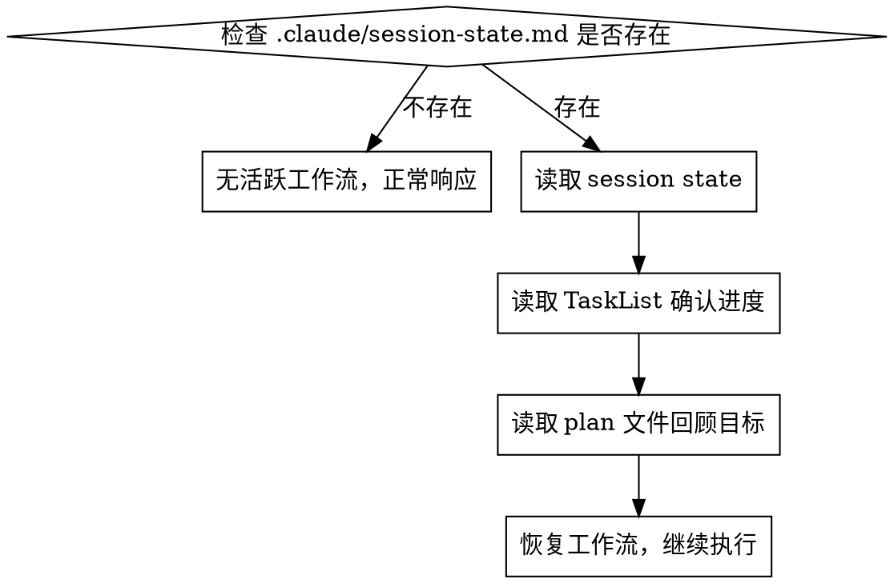

# Session State 持久化与恢复

解决长会话中上下文压缩导致 subagent-driven-development / executing-plans 编排状态丢失的问题。

**核心原则：工作流状态必须持久化到磁盘，不能仅依赖上下文记忆。**

## 1. Session State 文件规范

**路径**: `.claude/session-state.md`（项目根目录下）

**格式**:

```markdown
# Session State
> 如果你正在阅读此文件，说明你可能经历了上下文压缩。请按此文件恢复工作流状态。

## 工作流模式
- **Mode**: subagent-driven-development | executing-plans
- **Started**: YYYY-MM-DDTHH:MM:SS

## 计划与规范
- **Plan File**: docs/plans/YYYY-MM-DD-feature.md
- **Proposal**: openspec/changes/change-name/
- **Spec Files**: openspec/changes/change-name/specs/capability/spec.md

## 分支与工作空间
- **Branch**: feature/xxx
- **Worktree**: .claude/worktrees/xxx（如适用）

## 当前进度
- **Total Tasks**: N
- **Completed**: M
- **Current Task**: 第 K 个 task
- **Current Stage**: implementing | spec-review | quality-review | complete
- **Task Description**: 简短描述当前任务

## 关键上下文
[任何压缩后需要知道的重要决策、约束或注意事项，2-5 行]
```

## 2. 写入时机 (MUST)

执行 subagent-driven-development 或 executing-plans 时，在以下节点**必须**写入/更新 session state：

| 时机 | 操作 |
|------|------|
| 进入工作流模式 | **创建**文件，填写 mode、plan、branch |
| 开始一个新 task | **更新** Current Task、Stage = implementing |
| 切换到 spec-review | **更新** Stage = spec-review |
| 切换到 quality-review | **更新** Stage = quality-review |
| 完成一个 task | **更新** Completed 计数、Stage = complete |
| 添加重要上下文/决策 | **追加**到关键上下文区域 |
| 工作流全部完成 | **删除**文件 |

**写入方式**: 使用 Edit 工具更新对应字段，保持文件整体结构不变。

## 3. 恢复流程

当你发现自己不确定当前在做什么（通常是压缩后），或会话开始时：



**恢复步骤**:

1. **读取 `.claude/session-state.md`** — 获取工作流模式、plan 路径、当前进度
2. **读取 TaskList** — 确认哪些 task 已完成、哪些 in_progress
3. **读取 plan 文件** — 回顾整体目标和 task 列表
4. **读取 proposal（如有）** — 恢复需求上下文
5. **向用户确认** — "检测到中断的工作流：[mode]，当前在 Task K/N（[描述]），是否继续？"
6. **继续执行** — 从 Current Task 和 Current Stage 恢复

## 4. 自动检查触发

以下情况应**自动**检查 session state：

- 会话刚开始时
- 感觉自己缺少上下文时（上下文压缩的典型表现）
- 用户提到"继续"、"接着做"、"刚才在做什么"时
- 使用 `/session-recovery` 手动触发时

## 5. 与 TaskList 的协同

Session state 和 TaskList 各有分工：

| 信息 | Session State | TaskList |
|------|:---:|:---:|
| 工作流模式 | ✓ | - |
| Plan/Proposal 路径 | ✓ | - |
| 分支/工作空间 | ✓ | - |
| 当前审查阶段 | ✓ | - |
| 关键决策上下文 | ✓ | - |
| 各 task 完成状态 | 汇总计数 | ✓ 详细状态 |
| task 依赖关系 | - | ✓ |

**两者互补**：session state 提供"大局"（在做什么、为什么），TaskList 提供"细节"（每个 task 的状态）。

## Red Flags

- ❌ 不要在压缩后凭记忆猜测进度，**必须读取 state 文件和 TaskList**
- ❌ 不要跳过 session state 更新（"这步太小不用更新"）
- ❌ 不要在工作流完成后忘记删除 state 文件
- ❌ 不要让 session state 和 TaskList 的进度不一致
